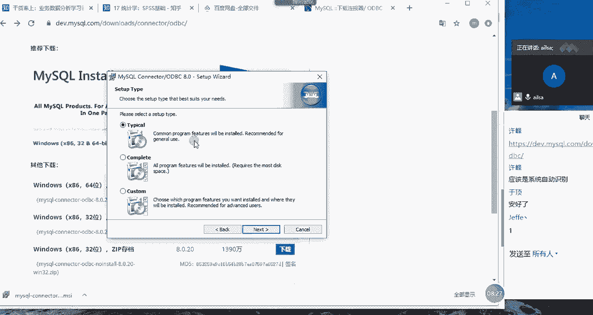

# 强推！这可能是B站最全的【Python金融量化+业务数据分析】系列课程了，保姆级教程，手把手教你学 - P94：07 SPSS数据导入与导出操作 - python数字游侠 - BV1FFDDYCE2g

好的同学们，我们从嗯现在开始进入我们的正式的课程哈，那我们上午介绍了我们推断统计的抽样分布，参数估计和假设检验啊，这些啊我们统计学当中比较重要的理论知识，我们讲完了。

然后我们简单的介绍了一下SPSS的啊，历史以及它的优缺点对吧，还有它的操作界面，我们介绍了啊，工作名称和存储名称以及四大窗口，还有它的基本的使用，我们介绍到了变量的存储类型啊，也就是说哎。

我们现在大家统一的把SSPSS打开哈，打开之后啊，我们接着上午的内容啊往下讲嗯，OK那稍等一下嗯，大家也把自己的SPSS打开哈，OK我现在打开这个界面之后啊，我们看一下接下来我们要讲什么内容哈。

啊让我们来到我们的目录哈，我们要讲是如何通过excel啊，如果通过SPSS导入外部数据，我们主要分三种不同的外部数据，那我们也可以看出啊，SPSS其实在啊对外的啊，数据类型上还是做了很大的兼容性的。

对不对，那我们看第一个如何导入excel文件哈，OK我们打开这个界面啊，然后大家跟着我去操作哈，大家跟着我去操作啊，哎我这边没有excel文件，没有关系，我从上一个复制过来一下哈，比如说啊这个也不好啊。

统一定，比如说我们把销售数据复制到我们的当前的，好当前的一个文件夹下面，然后大家也自己准备一个excel的文件，然后这个时候呢我点击打开哎，我就要导入的是我就要导入的是我的excel文件了。

然后这个时候大家看大家看这里面没有，对不对，哎你看我在day08下面怎么没有呢，大家能告诉我是什么原因吗，好能告诉我是什么原因吗，为什么我在这里面找不着哦，看眼尖的人都知道哈。

你看我在这里面它有指定的文件类型，对不对，这里面没有EXEXCEL的文件类型，所以我就找不着，这个时候我可以选择哎，你看我可以选择我要导入的excel文件类型，它支持嗯。

XLSXLSX以及XLSM这样的一个文件的类型，OK我们一点选它，这里就出现了我们的销售数据，我们点击它，然后打开，大家跟着我去操作哈，跟着我去操作，然后我打开啊，这个时候它出现了一个对话框的界面。

然后我们需要注意什么呢，首先第一个工作表我们都知道excel一个工作簿，它包含多张工作表，对不对，那我这里面因为只有一个，所以它只显示了一个，如果说有多个的话，它这边会显示工作表的名称。

以及后面对应的数据区域啊，供你去选择，也就是说其实SPSS也知道，你在导入一个excel工作簿的时候，不一定就是默认的其中一个工作表，对不对，有可能是多个工作表嗯，还这样的一个结果。

所以说我们要指定一下啊，我们的到底是取的哪个工作表，这是第一个，然后第二个从第一行数据中读取变量名称，什么是变量名称呢，就是我们所谓的列名，那在数据库当中我们叫字段唉，就说这个年份月份等等这些嗯。

就是这个要根据你的实际情况，如果说你的表里面没有字段，那你这个就不用点选了，如果有的话，它就默认第一行是你的字段名，所以这个选一下，然后确定数据类型的值所占百分比，这个无所谓哈，这个默认选择就可以。

然后忽略隐藏的行和列啊，这个点选一就可以了啊，什么叫忽略隐藏的行和列呢，也就是说如果你隐藏了，我就代表你不去显示这个东西啊，然后我们直接点击确定就可以了啊，跑哪去了，稍等一下哈，直接点击确定。

我电脑上没有点慢呢，OK现在执行成功了，大家刚才看到这个步骤没有，它首先冒出来一个代码对吧，这就是我们的语呃语法冒出来一个代码，然后完了之后哎出现了我们所想要的结果，然后大家啊看一下说啥呢啊。

然后大家有没有啊实现这样的一个效果，如果实现了给我扣个一啊，有没有实现这样的效果，如果实现了给我扣个一啊，我刚才看到你们有发文件是吗，没有excel文件是吗，OK哈啊，如果实现了这个效果，给我扣个一。

那我再简单的说一下，也就是说我们这个导入数据的时候，我们可以在刚才的这个地方啊，就是在这里，然后在这里选择我们的数据类型，这是一种方法，那第二种方法其实一样的哈，第二种方法就是点击文件，然后导入数据。

我们选择啊选啊，这里面啊选择excel数据，然后在这里也是一样，它默认文文件类型已经是选择好了，然后再选择我们所想要的文件，在这个过程当中呢，第一个是我们需要注意的是，我们要选择哪个工作表。

然后某个工作项工作表下面的哪些数据区域，第二个就是你是不是第一行就是它的变量名称，如果不是就不要选这个，如果是就可以，但是这个SSPSS也是很智能的，它如果识别出来，你第一行没有没有没有变量名称。

也就是没有字段的时候，它这个默认是不选的啊，你知道吧，因为它在这里识别出来，我这是有点像字段名，所以说他就默认给我选上了，所以还是非常智能的，也就是这几个方面的需要注意事项，其他就没有什么比较简单啊。

OK其他人实现了这个效果吗，如果导入成功了啊，给我扣个一啊，现在只有两个人扣了哈，我们再稍等啊，稍等几秒钟好，我们慢慢的讲，带着大家去做哈，OK啊思敏呢，私密没有实现吗，消息发布，OK那你可以了就行啊。

可了就行，OK那我们这是导入excel的文件啊，相信大家都没有问题哈，因为比较简单，接下来我们导入数据库文件，唉这个就稍微有点难度了哈，那在导入这个数据库文件之前哦，不好意思啊。

这个工作应该是提前去做的哈，导入数据库之前，我们需要下载一个数据库的驱动哈，啊啊就是这个的话啊，我已经放到我们的网盘当中哈，在我们的day08文件里面有个叫MYSQL杠con呃，CONNOR啊。

然后是OODBC啊这样的一个驱动，然后大家下载一下，下载完了之后给我扣个一，然后我教你们怎么去安装嗯，我先暂停一下视频，我们下载这个的话，可以去win呃，那个MYSQL的官网。

然后这边有链接写ODBC的8。0的版本，然后我们可以直接采用MSI的安装方式，这样比较简单一些，然后我们下载完了之后，直接点击next啊，直接要同意，你不同意，没办法，next哈，然后点击next。

这个时候选择第一个就可以了，我们只要安装啊，我们啊正常的就行，然后这个是所有的程序哈，所以我们安装第一个就行了。

然后点next点现在安装啊，这样的一个过程啊。

很快应该是啊拿好了是吧，Oh my account do for，我先不是啊，这样的一个过程哈啊非常的简单，然后我们安装好了之后，接下来啊其他人安装好了吗，我有点着急了是吧，其他人安装好了，OK哈呃。

啊你的也会报错是吗，好吧，我就我就选择不管他了啊，看看等一下会不会报错哈，会不会出错，OK好，那接下来我们就通过这个驱动去导入我们的啊，录着呢录着呢啊去呃去连接我们的MYSQL的数据库。

然后去导入我们的MYSQL的文件啊，这是我们选择文件，然后选择导入数据，选择数据库，选择新建查询，大家跟我去操作哈，选择文件导入数据，数据库新建查询，点击进来，点击进来之后，这边会有一个数据库导入向导。

这边有一个ODBC的数据源，大家看到这没有，这个时候我们需要添加我们ODBC的数据源，点击添加啊，添加之后，然后在这里哈，在这里点击添加啊，天天点击添加，你看这个是我刚刚安装好的MYSQLODBC，8。

0a n i n a s i driver，然后8。00什么什么这个东西哈，我们双击它，不好意思啊，找不着了，尬了啊，我们啊8。0啊，这个我们要双击它，你看一下你们的能不能双击成功啊，你这没有8。0。

OK啊稍等啊，现在我们双击进来了之后，然后这个data source name指的是你连接的这个名称，这个你可以随便起哈，随便起，比如说啊那么无所谓哈，但是你最好去识别一下这个东西，然后这个不用管。

然后这个就是你的IP，也就是说你的MYSQL的IP地址，如果是本机的话，就是127。0。0。1就行，然后这个user就是你连接MYSQL数据库的一个用户的，用户名和密码。

这个database呢就是说你要选择该数据库下面的，就是该就是你这个MYSQL数据库啊，下面的哪个库啊，因为你下面肯定有很多个库，对不对，你要使用哪个database，你就选哪个就行了，然后你测试一下。

如果能成功，那就可以了，如果成功不了，那说明某一个环节出了问题啊，那你看我之前连好的是这样子的哈，来起一个MYSQL麦，然后这是我的本机的地址，然后这是我的IP，然后这是我的账号和密码。

这是我要使用的库，但是这个库哈，这个这个库我连的是5。6版本的，5。6版本的那个老的MYSQ库，而不是连到8。0了哈啊，因为我这边的port是3306，我新的应该是3308啊，这样的一个端口啊。

连接这样的一个效果，如果说都成功了啊，给我扣个一啊，现在应该是有三个人已经成功了啊，跟大家再说一下，如果刚才8。0没有安装成功的话，然后就安装5。2也是没有问题的，嗯我这边试一下。

我这边试一下3308啊，能不能连上哈，哎呀算了还是3306吧，不想改了啊，大家可以试一下啊，OK阿斯敏这边是可以了是吗，因为他说他发不了信息，我看一下啊，嗯现在谁还不行，同志们，现在谁还谁还不可以。

一二啊，可以了哈，12345还差两个，好，然后这个时候你比如说哎，我选择了一个库之后啊，我接着往下走了，比如说现在哎我们就点击确定，然后我们添加好了这个东西之后啊，我们选择它，然后点击下一步啊。

下一步它默认的是表，我们本来选的也是表哈，点击下一步，然后这个时候就该库下面所有的表，已经在这里了，对不对，那你就选择其中一个就行了，但是我跟大家说一下啊，我们现在现在是在做测试。

而且你们电脑性能也不怎么好，所以你最好选一个你该库下面表就是这个量啊，不是特别大的，因为SSPSS它处理不了数据量太大的数据，不然的话就有可能会被卡死啊，所以说你选择比如说选择一个量比较小的。

然后你点击过来之后，它出现的就是相关的一些字段，然后你再点击完成就可以了，很简单，直接点击完成就可以了啊，然后如果啊数据已经，你看数据已经导入成功的啊，在这里你看我这个编码应该是出现了问题哈。

应该是编码出现了问题，然后如果说导入成功的，然后给我扣个一啊，我再看一眼，OK哈啊可以，嗯这应该是我的编码的问题，OK哈我回去看一下这个编码到底存在什么，它这里面存的类型，不要指定类型哈。

无法进行更改哈，他这应该是存在问题的，他说原表的问题啊，这个倒不是特别大影响，那这种这种形式的话，就是我们的SPSS，跟我们的数据库进行一个连接的操作啊，然后大家发现啊。

其实也是说在这里面建立一个MYSQL的客客户端，然后跟我们的MYSQL的服务端进行一个连接，然后建立联系，这样的话我们就可以从我们的MYSQL的数据库当中，去读取我们所想要的数据，这样的一个过程。

对吧啊，那这是导入MYSQL数据库啊，没有问题了哈，那接下来我们再导入一下啊，我们再导入一下我们的文本数据，唉大家都知道文本数据，其实它没有这一列一列这样的一个分的效果，那我们该怎么去操作呢。

哎我们看一下哈啊这个数据哈，这个数据我已经放在我们的网盘当中了，你比如说接下来我要导入的文本数据，是这个东西哈，已经放在这里了，就在我们day08的文件夹下面，这些都是我今天要做的测试数据。

都放在这里了啊，如果可以的话，你们就可以先下载一下嗯，啊然后我再进行一个演示，我们如何导入文本数据，就是点击文件，然后导入数据，选择文本数据，选择文本数据之后，这边会出现诶这个例子，然后我们点击打开。

如果大家现在走到这一步哈，我等一下大家如果走到了这一步，给我扣个一，就是现在我已经找到这个文件了，同志们，我已经找到这个文件了啊，给我扣个一，我先暂停一下，这边我选择了这个文本数据之后哈。

我们点击打开诶，它出现还是对话框，你会发现在SPSS当中的话，它有很多类似于这样的一个对话框的形式，然后我们看一下我们需要注意哪些东西，哎首先的话这个页面是不需要注意什么的。

然后大家看这里面是不是一个啊，就是类似于一个示例展示，也就是说我的数据进到这边来之后，大概是成这个样子啊，然后我们点击下一步，下一步的话，我们看这有几个的不同的区域划分哈，第一个就是变量如何排列啊。

那这个的话啊，这个就是按它的默认设置就可以了，按定界就可以了啊，然后第二个就是哦，还有就是文件开头是否包含变量名，然后这个你看我们的文件开头是有变量名的，所以要包含，如果没有，你就选择否就行了。

然后小数小数符号啊是什么啊，你看小数符号这边就是点儿嘛啊，点它在这里面就叫句号啊，句号的意思，然后我们再往下走啊，往下走啊，下一步，然后是哦每一行表示一个个案，对，没有问题。

它在SSPSS当中每一行代表是一个个案啊，一个个案，这叫这一行代表一个个案，然后这一列啊这个字段哈，它叫变量啊，叫一个变量，一个变量，一个变量，一个变量，一个变量，然后每一行呢叫一个个案。

大家一定要记得这个概念哈，那全部个案指的是全部的数据啊，哎也就是说你要导入多少个个案呢，是全部的还是前多少个唉，还是随机的，怎么怎么着啊，当然了，我们要导入全部的，哎你看它还提供了随机抽取啊。

比如说你随机抽取10%，你看这很明显就是统计学上的一个使用方法哈，你比如说在其他其他的数据分析工具当中，可能根本就没有，所以说我们一看到随机，这个肯定有很强的一个统计学的知识的，理论基础对吧。

那我们再接着往下走，唉下一步，然后说变量之间存在哪些界定符，你看变量之间我们看到这里的时候，变量之间已经变量已经不显示了，对不对啊，那这边的就是空格是没有的，我们去掉就行了。

你看去掉就显示了什么是制表符呢，啊在这里大家可以理解为是tab啊，tab所形成的这样的一个内容啊，就不用去深究它就行了，然后这边文本限定符是什么，就是无啊，这边你看我们从整个呈现的效果来说。

是完全符合我们的要求的，所以说这样是没有问题的，然后我们再点击下一步，然后你看有个日期，它在这里，虽然你看不出来是什么样的效果，但是但是它在这里是不是日期格式的，所以我们给它设置成日期。

然后这里呢你看他前面有个啊制表符哈，这是制表符，然后你需要把它给它去掉，然后改成日期啊日期，然后选择我们的日期时间这样的格式，你看他这样有一个自定义的这些东西对吧，我们选择我们想要的什么呢。

哎我们选择我们想要的YY啊，到哪了，好YY，哎，稍等啊，我们只要我们只要日期啊，咋了咋没有了，这个肯定不是我们所想要的，我们想要的是YYMMDD对吧，四个Y两个M两个D这样的一个标准的格式。

唉我们选择它，然后再点击啊下下一步，然后这个时候啊我们看到要粘贴词语法吗，大家一定要注意这个哈，我们选择是啊，选择是粘贴此语法啊，看到没有，这个要选择是啊，然后在本地缓存数据，OK大家选择完了之后。

然后点击完成，唉，点击完成了之后，你看它跳出来，我们语法编辑器的这样的一个对话框，已经出来了，我们看一下数据有没有出来，诶好像没有出来，对不对，这个时候我需要执行一下我的这个代码，也就是我的编辑器哈。

我需要执行一下我这个语法唉，就我生刚才那些操作，我只是生成了一个语法，还没有执行，那我就点击这个执行按钮啊，这个时候啊等一下哈它就会执行成功了，它生成的结果是数据及四，然后我们可以看一下啊。

变量名全是小方块是吗啊，那这个应该是呃那个呃那个编码的问题啊，编码的问题，编码的问题就是你在设置嗯SP后台的时候，编码的一个实现的效果，来我们看一下我们的结果有没有呈现诶，是不是已经呈现了啊。

对于这个是小方块这样的一个情况的话，我好像之前遇到过一回哈，等到那个课下的时候，我给你们再看一下啊，现在如果说我们先不管我们的名称，然后是否能够打开我们的文件啊，同志们。

如果说你能够正常打开我们的文本文件，给我扣个一啊，点完成当然是没有用的，你要执行你的代码，我刚才说的没有听到吗，啊OK我再说一遍啊，文件导入数据，然后导入我们的文本数据，然后选择我们的文件打开啊。

稍等一下小方块，那下一步都进行不下去了，你们这都是小方块是吗，稍等哈，嗯我们把这个空格去掉，过去很OK，没有关系啊，没有关系，慢慢来，我们把这个日期日期不改的话，它也会报错啊啊然后我们选择日期时间。

然后选择我们所想要的格式啊，走快了走快了，啊YY这个这样的一个效果，然后这个时候我们点击下一步，然后在这里面要粘粘贴此语法，然后要选的是啊，点击完成，点击完成了之后啊，点击完成了之后，它会在这里。

我们的就是语法编辑器，它会自动弹出来啊，有这样的一个语法结构，然后你再点击执行一下，你才能够实现你所想要的效果，也就是说你刚才那些操作只是生成了一个语法，然后你想要执行打开这个文件的话。

你需要执行这个这些语法才可以，嗯啊有没有走到最后，然后把这个文件打开的同志们，打开的给我扣个一，然后没有打开的跟我说一下啊，卡在哪了，OK那刚才有同学说他们在导入数据的过程当中。

这个中文的内容显示的是一个框框对吧，就是它不识别中文，那这个很可能就是编码的问题，那对于这个编码的问题呢，啊就是我们在导入文件的时候，我们可以这么去解决，我们在导入这个啊文文本文件的时候啊。

我们点开它在这里有个编码，这里因为我可能是因为后台设置的问题哈，所以它默认就是本地编码，如果你们的你们的啊这个软件上不是的话，你可以把它改成本地编码，这样的话你在进行数据导入的时候，就没有什么问题了。

可能你们电脑默认的是UTF8对吧，嗯这样的一个形式，所以选择本地编码，就可以解决刚才遇到的问题了哈，OK那我们再接着往下说哈，我们导入数据啊，这个东西其实是已经啊已经啊差不多了哈，我们讲了啊。

来我们看一下我们讲了如何使用呃，导入excel数据，如何导入MYSQL数据，如何啊，导入文本数据，这样的一三种不同的文件类型，进行一个啊导入啊啊那我们既然会导入，我们肯定要学导出，对不对。

那我们该怎么导出我们所想要的一个呃，呃那个SSPSS里面的文件成果呢，首先我们先看一下，我们导出的话，一般也就无非就是导出两种格式哈，我们选择比较典型的哈，不要选择这个哈。

看一下哈啊那我们再打开一个文件吧，再打开一个具有典型操作的哈，比如说我现在大家跟着我操作，把CCSS杠symbol啊，这个文件打开，打开了之后啊，打开了之后，比如说我对它做了一个啊，大家跟着我走哈。

做了一个啊嗯探索的分析吧，探索一个分析，然后分析啊我们的城市啊，相关的一些描述性啊，统计的一些分析哈，OK那这个时候我们点击确定唉，他就有这样的一个结果的呈现啊，对不对。

那我们在进行SPSS结果导出的时候，我们无非倒的也就两个哈，无非导的也就两个，一个就是我们的表啊，就是我们的表的结果啊，我们导出我们的表，第二个就是我们导出我们的分析成果啊，我们的分析成果也就这两种。

那我们我先讲导出表怎么去导哈，导出表呢就是选择文件啊，选择文件啊，呃导出就可以了啊，这边有不同的一个形式，比如说现在我们要么就导出SPS，默默认的这个文件类型对吧，我们也可以导出excel。

我们看一下导出excel是怎么来导出的哈，哎导出excel之后哈，嗯那它其实有非常大的优势啊，我跟大家说它有几个啊，几个比较灵活的地方，第一个它可以导出部分变量，什么意思呢，就是说我这个表的字段特别多。

那我在导出的时候不想要不想要所有的哈，比如说我只想要啊其中一部分，那我就可以啊，把前面加对勾的，哎，是保留的，不加对勾的，我可以去掉去掉去掉去掉啊，这样的那我就直接导出一部分就可以了，非常的灵活哈。

相信不管是excel还是MYSQL，它没有它都没有这样的一个灵活的操作哈，所以说你比如说你啊，我们只想要啊前面这一部分，后面这些什么玩意我们都不想要，对不对，那我们就可以把它给取消掉。

这是导出一部分数据，比如说我们取消了之后，它会告诉我保留了24个变量，然后共32个变量，也就是说共三十三十二个字段，然后我你你这边只要了24个变量，告诉你一下，然后我们再看啊，文件名的名称啊。

我们先去掉哈，我们先去掉，然后我们分析一下什么意思啊，首先保存的类型，我们我就不用说了哈，如果我们的电脑是202007版，2017版以后的哈啊那它就是XLSX，如果说它是啊，我们看一下哈好看。

如果他是九七杠零三版的，那就是XLS，这这也就是我们在之前最开始讲啊，excel发展史的时候，这个后缀名哈，那我们默认选这个就可以了，然后还有就是我要啊，我要输出到哪个文件名下面。

也就是哪个excel工作簿下面，这个时候我们可以起一个新的名字，对不对，我们可以起一个啊叫cc啊，SS啊，杠new啊，就是一个新的啊，结果因为啊我们还需要把我们的后缀名加上XL。

SXXLSX这样的一个完整的内容啊，这个是我们新的啊，一个文件名，我们也可以添加到现有的文件名当中啊，你比如说现在我就想把它添加到销售数据里面，但是诶你添加到这里面，会不会覆盖原有的数据呢，啊其实不会。

为什么呢，因为它是以工作表的名称啊，就是它是以一张表的形式放进来的，那么你就可以怎么着呢，你就可以把它追加到该工作簿的下面，因为我们都知道一个工作簿有多个工作表，我现在只是生成了一张工作表而已。

我把它追加到这个工作簿的下面不就可以了吗，是不是诶，那这种形式其实就比较简单了，你看我们在呃其他的操作当中，我们都是新生成一个excel的工作簿，然后里面只有一张工作表。

然后我们再新成了一个又是一张新的工作簿，然后里面又是一个新的工作表，对不对，那这样就比较麻烦，这个时候我们就完全有点类似于，合并到一个工作簿下面，然后多张工作表，对不对，这是第二个优势。

第一个优势就是它可以导出部分变量，第二个优势，它可以追加到嗯一个excel工作簿下面啊，就是呃可以把多张工作表，保存到一个工作簿下面，以追加的形式，那第三个啊，第三个优点就是它可以嗯，它可以保存啊。

你的名称或者是标签啊，什么意思呢，就是说我们之前在介绍excel呃，那个SPSS的时候，他的这个标签啊，他这个表过不来哈，它这个标签描述的是该字段的一个详细的信息，所以我们可以呃嗯可以保存它的名称。

也也就是它的字段名，也可以表嗯，保存它的整个的一个详细的描述，那还有就是我们之前演示过，在我们的整个的数据当中，比如说男女这一列，它实际存的值是一或者是零，或者是一和二这样的一个数值。

这个时候你点选了它，它就可以直接给你导出来，实际的这个呃代表的意义，也就是男女这样的一个结果，而不是一或者是零啊，这样比较含糊的，你看不懂的这样的一个数据，所以说是非常的方便的话，这个时候我们点击保存。

我们看一下效果哈，这个时候我们打开day08，然后把我们的销售数据啊打开，新生了一个，它是又识别不了那个编码了吗，没有关系哈，这个看一下，啊部分内容有问题哈，啊它损坏了啊。

那说明我们在导入这个数据的时候，这不是啊，这不是它整个的一个问题哈，就是我们在导入啊，就是保另存为的时候它存在的问题，那现在没有关系哈，我刚才介绍他的一些优点，然后我们重新啊。

重新把它把它保存到一个新的文件夹试一下哈，好新的文件夹试一下啊，文件然后我们另存为嗯，啊另存为我们这个时候选择的我们的呃，还是我们保存到excel这样的一个文件哈，那我们文件名啊，我们新起一个试一下哈。

我们新起一个啊，比如说无所谓哈啊，我们的工作表就叫new啊，新的啊，然后将工作表制加到该文件下面啊，也就可以了啊，然后我们点击保存再试一下，看到底这里面可能有一些excel识别不了的东西，在这里哈。

我们再看一下，OK啊，在这里哈生成了一个新的excel文件，我们再看一下，OK这样就可以实现了，应该是什么呢，应该是我选择这个嗯，啊，我选择这个保存它的实际值的时候，出现的问题啊。

也就是说它这个实际的值唉，我们看一下，现在保存这个数字是完全没有问题的，那保存值的时候有一些变量可能它识别不了，我们再重新尝试一下哈，重新尝试一下另存为啊啊，然后我们保存到我们的excel这样的文件。

然后我们给它起一个名字哈，嗯然后起个名字嗯，然后我们把保存指标间试一下哈，看是不是因为这个的问题，OK可以了啊，可以了，然后我们再看一下，嗯在这里哈，哎呦打错了哦，在这里，OK也没有问题啊。

呃那是什么原因造成的呢，啊你们自己尝试成功了没有，同志们，你们有没有追加成功啊，这边如果单独保存的话，是完全没有问题的啊，完全没有问题，单独保存完全没有问题，但是我追加式保存的话。

它就会出现一点点的问题，就会说啊这个文件当中有识别不了的内容，所以说无法打开嗯那我现在再尝试一下追加哈，同志们，你们追加啊，你们保存啊，这样的一个结果，追加式的保存有没有成功，嗯我再试一下。

应该我觉得问题不大，现在我选择这个啊age这样的一个工作簿，然后我给它起一个名字啊，叫啊new gu啊，tile啊，那个这样的一个结果啊，然后将工作表追加到现有的文件当中，保存值标签，我们再试一下。

OK应该是可以了哈，应该是可以了，我刚才保存的应该是age，你再打开，需要保存最最佳保存的时候需要关闭它，需要关闭它才能成功啊，我也不知道为什么，好像打开的时候你是你是没办法保存成功的。

OK没有成功没有关系，我们再重新来一遍，我们把这个文件先关掉，把这个文件先关掉哈，大家也是先关掉这个文件，然后再进行一个保存，再试一下，嗯我们选择excel，然后我们的age。

然后这个的是new compile，将工作表追加到现有的文件当中，OK点击确定保存，正在运行，嗯OK可以了，来我们再看一下，打开，打开我们的文件，OK还是不行哈，追加是保存会存在问题，没有关系。

我们再重新试一下啊，可能他这个新版本，可能他这个新版本会存在这样或那样的问题吧，咱们只能这么去解释，我再最后试一下，它不保存为值标签会不会报错啊，我也是不放弃哈，不抛弃不放弃，我再试最后一下哈。

因为我之前是尝试过成功的啊啊，然后这个时候我们还是选择啊选择另外一个了，因为那个报错了，打不开了，然后我们再试一下mp啊，然后我们不选择保存值标签，你再试一下，hi正在运行，我这边确实是尝试成功过的。

所以说我觉得应该问题不大，大家有没有成功的，OK不好意思啊，我这边完全是没有没有没有特别大的一个效果，要么就是他的我看哈部分内容有问题，是否让我们尽量尝试恢复试，OK也是可以。

只是说他这边会有一些部分单元格信息不可读，啊啊啊也是没有问题的，你看我这个P已经进来了，对不对啊，这个P已经进来了啊，这个B已经进来，说明他是可以追加的，可能啊，他中间呃要么就是我们的表的数据的问题。

要么就是它这个系统啊，或者是它这个软件，可能因为最新版本还可能会存在，这样或那样的问题，咱们只能这么去说哈，OK那刚才去演示这个东西呢，就是为了给大家强调他这个导出数据的时候，还是啊有很多实现的功能呢。

还是比较方便快捷的，可以指定部分的变量，也可以呃导出一个单独的excel工作簿，也可以导出一个工作表，添加到某一个工作簿当中啊是吧，跟我的一样是吧啊，那就没招了，呃，反正我上午的，我昨天啊。

什么时候我自己试的还是没有什么问题啊，没有什么问题，OK这是导出excel的一个文件哈，那这个是我们的整个的一个啊数据啊，数据窗口这样的一个形式，我们接下来再看一下我们的啊，分析窗口这样的一个结果哈。

这是我的分析窗口吗，啊变得这么大气，OK我们再看一下分期窗口，我们这个结果我们如果说想把这个结果导出来，哎我们该怎么去导出来哈，这个也是一样哈，我们可以点这个导出啊，导出啊，然后唉。

这下面的就是你指定一个地方就可以了啊，非常的简单啊，就是把这个文件名的位置，你选择正确的就可以了，然后你可以直接就点击确定啊，这个就可以了，好过大哈，文件太大了，如果您更改了部分文件格。

那么将更改应用于所有的文本啊，这文件太大就可能导出的会有点慢哈，因为我这边确实他这个内容有点多了，我们应该还可以导出部分啊，部分内容也是可以的啊，我把我自己坑了哈啊可以了，我们看一下结果。

它这个内容会有点大，所以说可能啊不是特别美观，OK哈你看这个结果是一样的哈啊结果是一样的，跟在后面查是差不多的，你看这样的一个形式啊，这个时候我们导出来之后。

其实我们就可以放到我们excel当中或者是PPT当中，然后做一个展示了，基本上我们放到PPT当中的话，就是截个图就可以了啊，这样的一个效果，大家有没有导出这样的一个效果，如果有的话，给我扣个一嗯。

啊有没有给我导出这样的一个效果，OK了没有，嗯OK给我扣个一哈，我稍等一下哈，没有没有人导出来吗。

