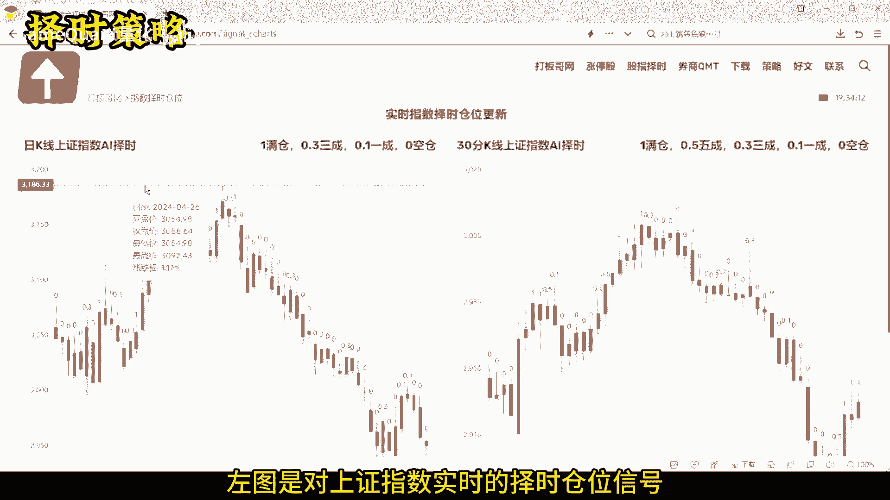
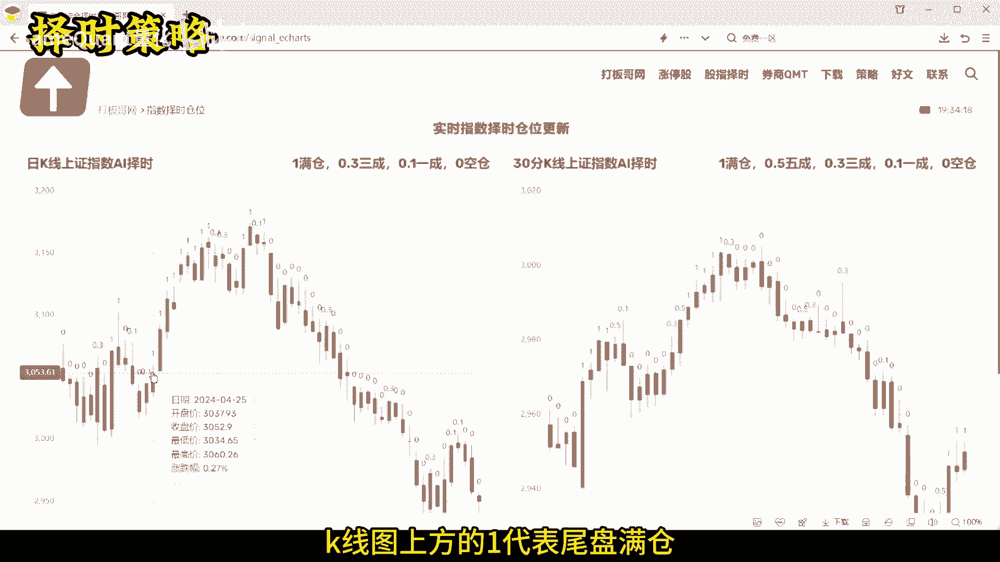
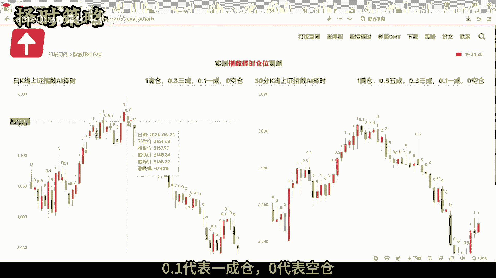
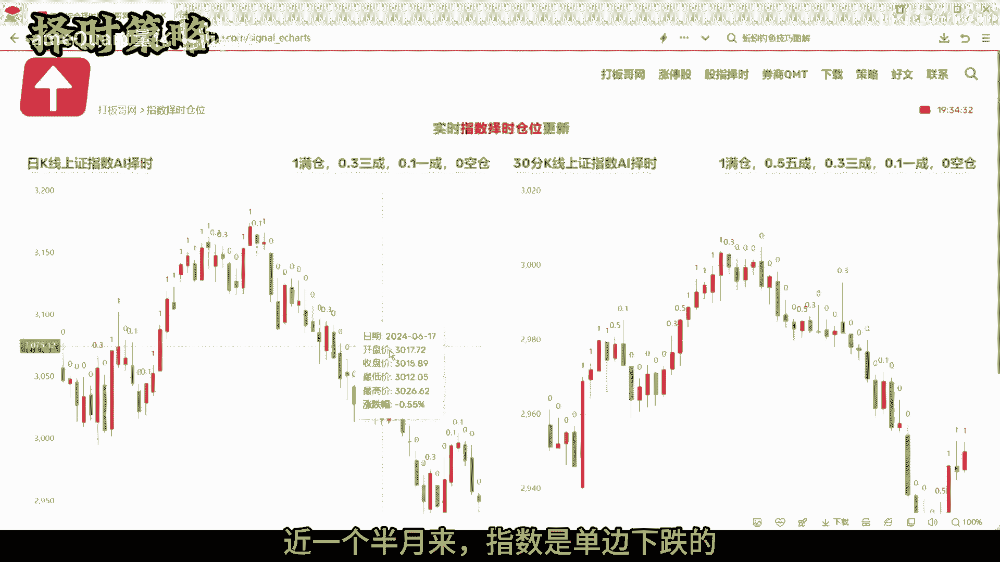
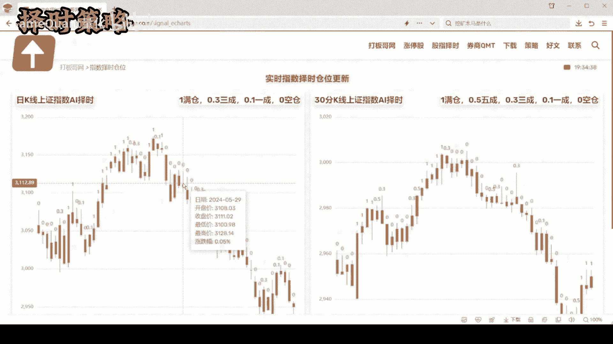
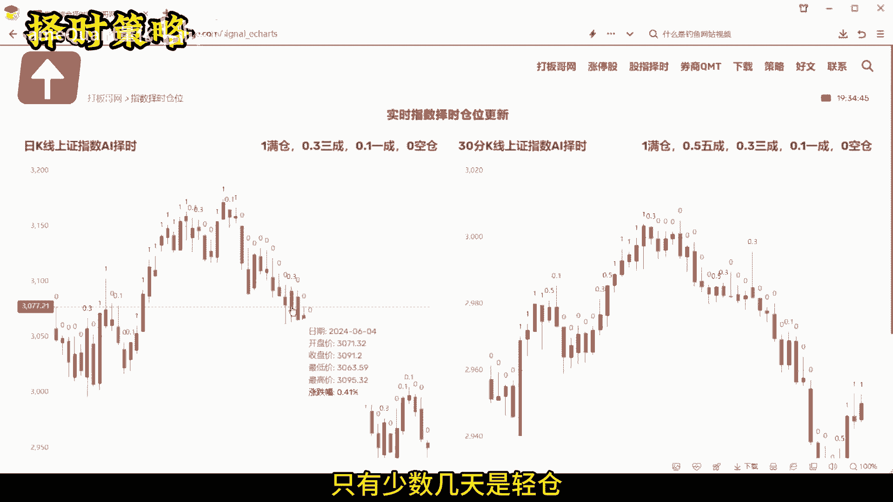
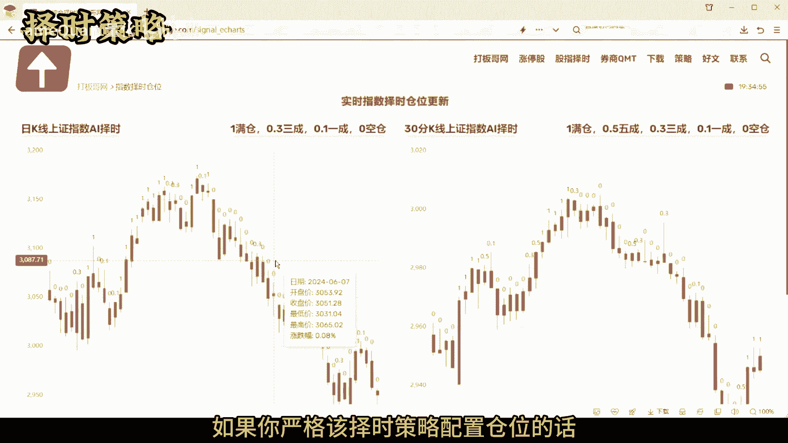
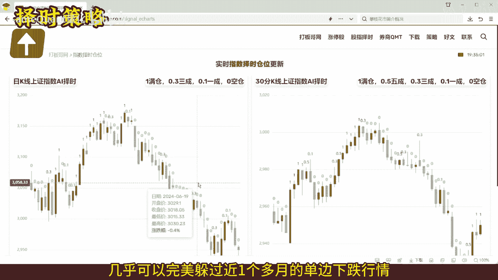
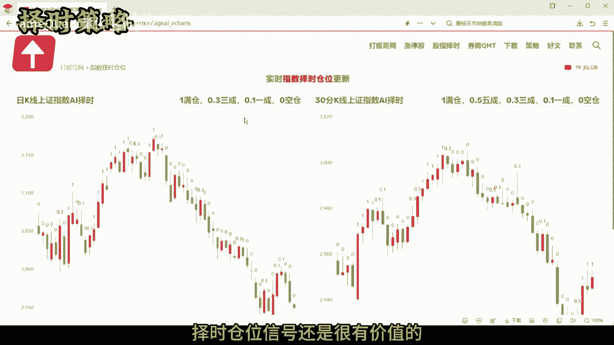

# 很好用的择时仓位策略，免费好用，值得收藏 - P1 - SameQuant量化 - BV17m421g7j9

这期分享一个很好的择时仓位策略，从历史的跟踪效果来看，该策略的表现非常优秀，上涨趋势时会满仓持仓，不踏空，下跌趋势时会空仓或清仓，规避风险不配套，我们先来对着K线图复盘下该择时策略。

左图呢是对上证指数实时的择时仓位信号。

那K线图上方的一代表的是尾盘满仓。

那0。3代表的是三成仓啊，0。1代表的是一成仓。

零代表的是空仓，我们可以看到啊，近一个半月以来啊。

指数是一个单边下跌的啊，同时可以看到该择时策略的信号呢。

绝大多数的一个交易日都是零红仓，只有少数的几天。

建议是三成仓，或者是这个一成仓，如果您严格按照该择时策略配置仓位的话。

几乎可以完美的躲过近一个多月的一个。

单边下跌行情，那对于主观交易的朋友来说，择时仓位信号还是很有价值的。

而且改择时信号是免费的，关于择时啊，必须还要知道两个一，一个核心要点和一个重大误区，一个核心要点是指啊，择时的目的一定是指导仓位配置，而不是简单的判断多空趋势，一个重大误区是择时策略。

用于判断个股的多空啊，这肯定是错误的，择时一定是针对整个市场的，所以择时策略应该针对的是具有代表性的指数，或多个指数，不能用于个股，关于指数仓位择时，如果您有好的思路，也欢迎来交流。

如果您需要该指数择时仓位的实时API接口数据，也可以留言好了，本期的分享就到这里，如果您也对量化交易感兴趣。

