# 微盘股还能买吗？量化轮动策略轻松跑赢指数12倍？ ｜ 只会买指数ETF也能做量化？｜ 量化投资邢不行啊 - P1 - 量化投资邢不行啊 - BV16t421g7gS

金融市场瞬息万变。

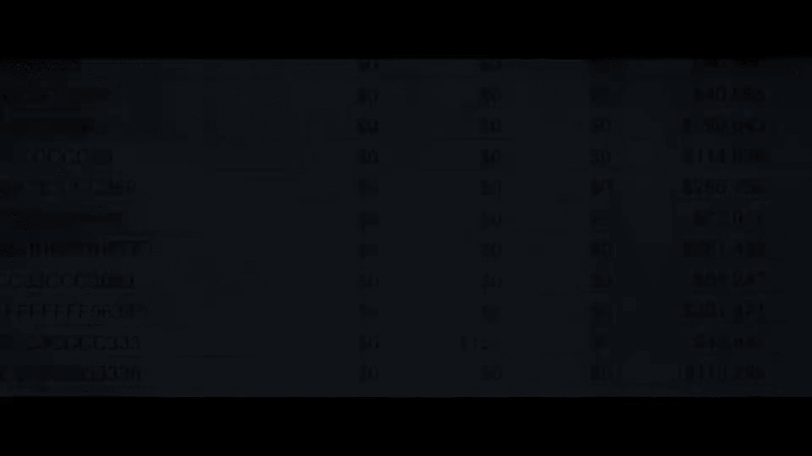

但唯独有两个东西是永远不会变化的，一个是人性，千百年来以及千百年以后，人类的贪嗔都不会有什么变化，另外一个就是周期，王朝兴衰，分分合合，家族起落，各种周期在不断的重复。

我们针对金融市场构建的量化投资策略，也要尽量从这种不变的人性和周期的角度入手，这样的话呢策略才能经得起考验，本期视频我们就从周期的角度出发，介绍一个量化投资策略。

大家好，我是专注于量化投资的。

行不行，2021年到2023年，其实严格的说啊，从2018年开始，就算小市值股票。

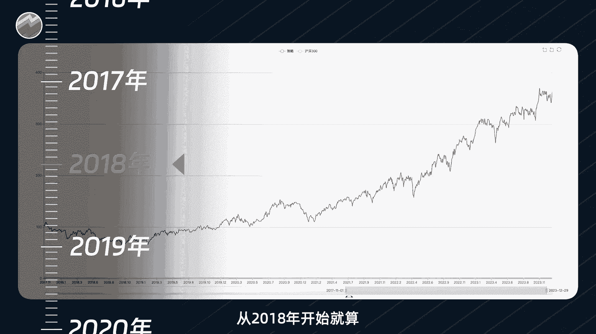

应该是属于大A被最炙手可热的板块了，小市值类型的选股策略不断地创下新高。

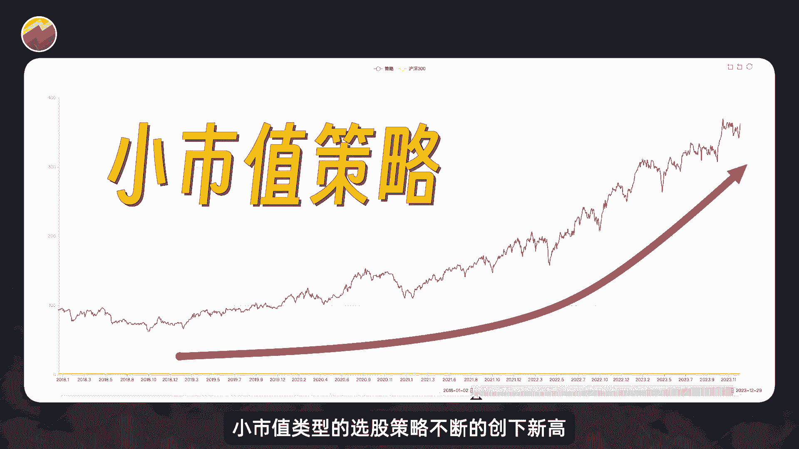

而代表大盘的上证五零连跌3年，总计下跌了36%，但是好景不长，刚刚过去的2024年，春节前的一个月，那被很多人认为是小市值股票股灾的一个月，微盘股指数就从1月初的29。2万，一直跌到15。6万。

最大回撤高达46%，很多人啊甚至就恰恰买在了小市值股票的顶点，并持有整个下跌周期，而反观同期的上证50指数不仅没跌，还上涨了2。2亿，帮助持有人规避了大量的风险。

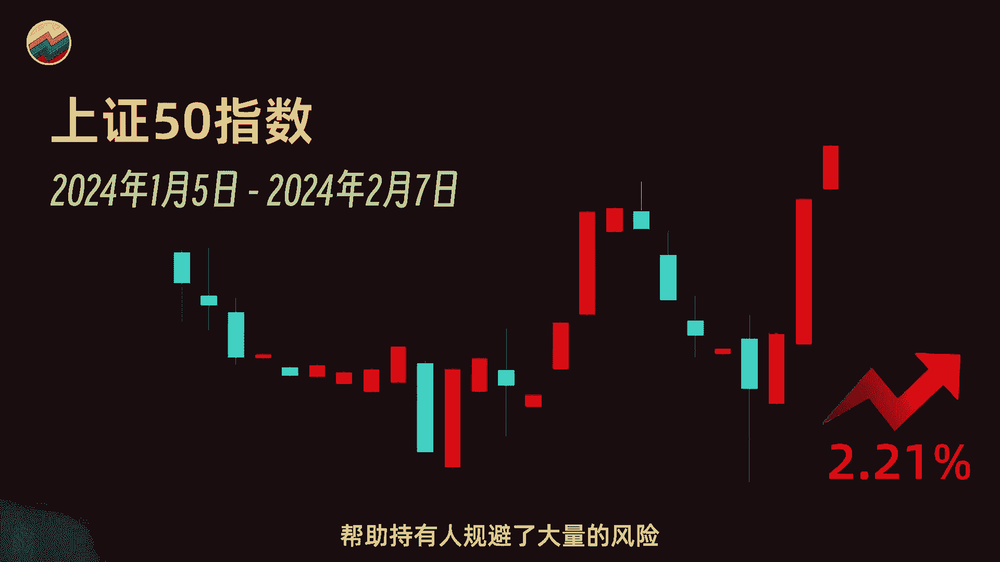

2017年以及2020年的时候，都有过类似大市值股票涨。

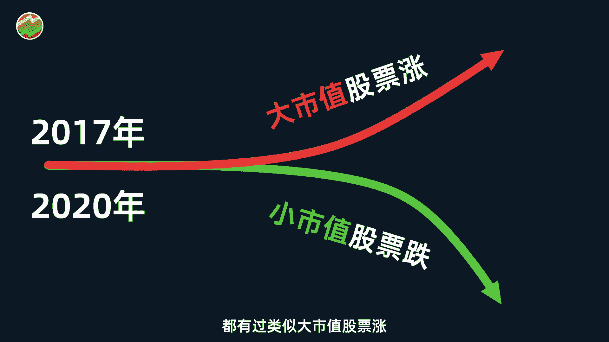

小市值股票狂跌的情况，比如说2020年，当时很多基金抱团的大盘股猛涨。

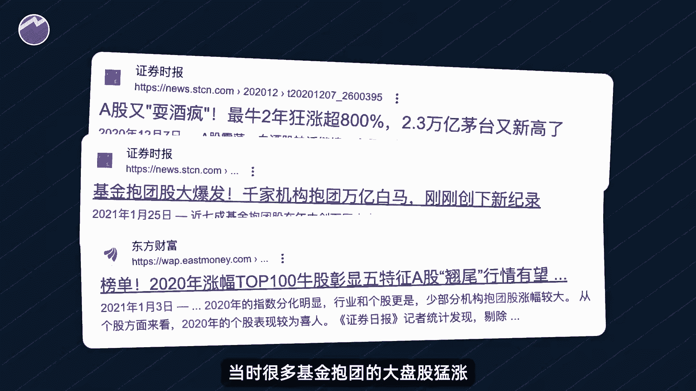

但同期小盘股则跌跌不休，但是紧接着来到2021年之后，抱团股就集体下跌。

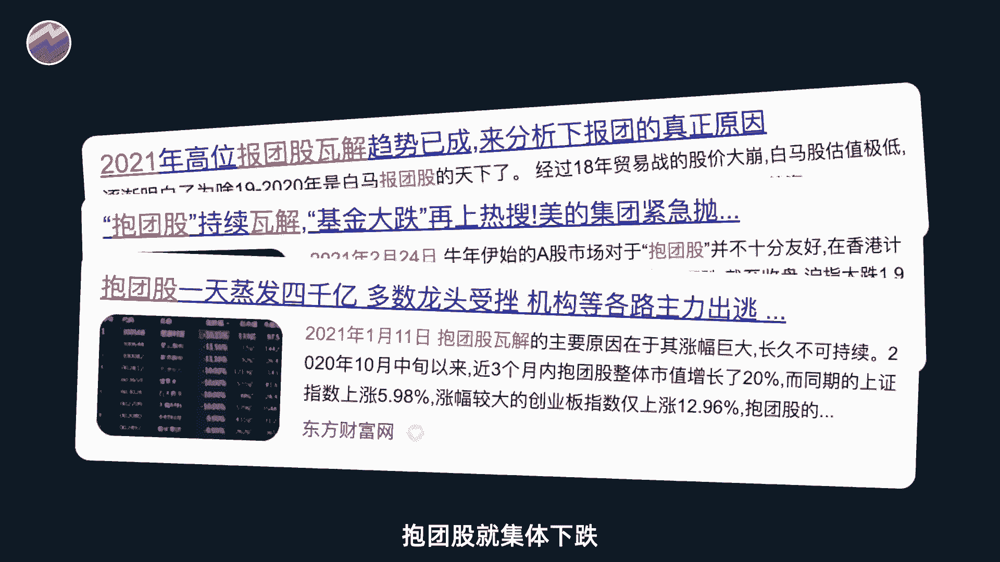

我相信在座很多看视频的朋友，这一波抱团白马股的下跌损失惨重，而同期经历了很长萎靡时间的小市值股票。

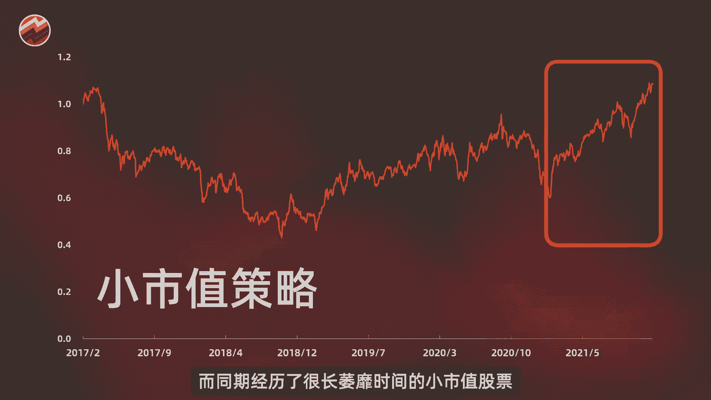

反而表现突出，以上的这些案例啊，其实都在不断的告诉我们。

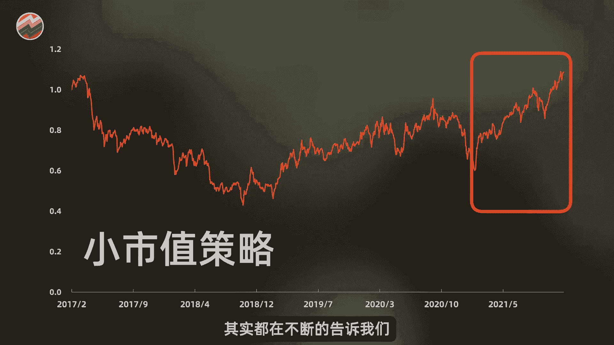

这个市场没有永远的优和差，有的只是不断的周期往复，其实不仅A股是这样的，美股也是如此，在美股股票市场的一两百年历史上，长期来看也是小市值的股票涨的更多一点，但是在60年代末到70年代初。

已有好几年的时间，整个美国股市，只有那些最大的50只股票正在上涨，其他股票都在下，历史上把当时的场景叫做漂亮五零行情，大家都会抱团买入那些最好的公司，但是美股历史上，这段抱团投资的热潮很快就结束了。

在1972年到1974年，这些抱团的漂亮五零股票开始下跌，最多的比如说迪士尼。

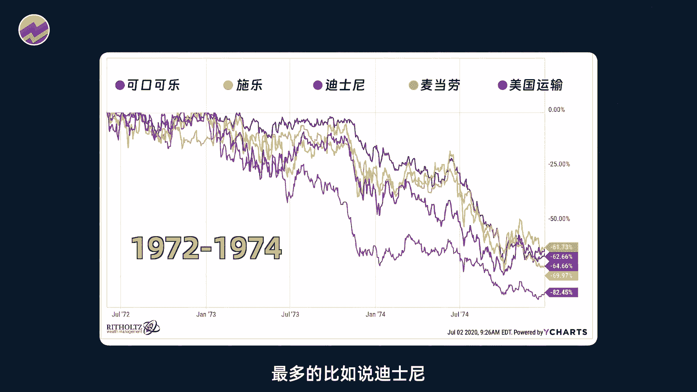

它从高点下跌了80%，还有麦当劳也从高点下跌了60%。

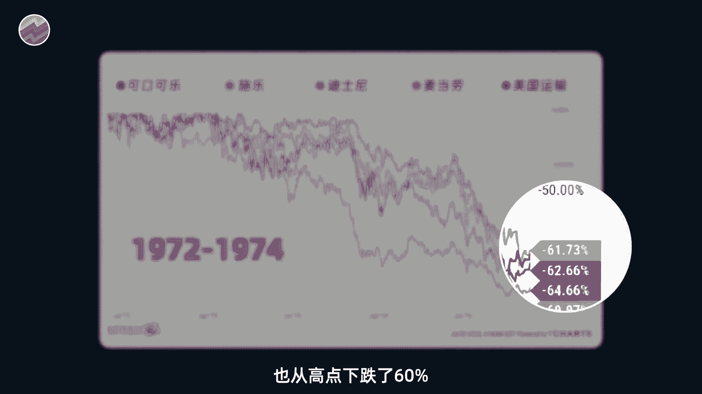

像不像你当年买的某安集团，而同期的标准500指数只下跌了37%，所以大家千万不要觉得，现在表现好的股票和策略，未来是只涨不跌的，就像我们的小市值股票，他之前世今年表现都非常好，不断的上涨。

但是也会遇到回调的时候，而且一回调就非常的猛烈，这一切其实都是周期的不断的重复，涨得多的自然要跌，跌的多的自然也要涨，而我们作为投资者要做的是什么啊，其实也很简单，那就不要一根筋的只买小股票或者大股票。

我们可以尝试对它进行轮动，所以本期视频呢，我们就尝试构建一个大小盘轮动策略，首先啊我们用大盘指数来代替大盘股股票。

这主要是为了简单一点，大家也好理解，那么我们这里面选择沪深300，上证五零，还有上证指数，这几个指数作为大盘指数的一个代表，然后同时呢我们也使用创业板指数，上证小盘。

中证1000这几个指数来代表小盘的股票。

当你不断的在股票市场中进行交易，其实你会自觉或者不自觉地，总结出来一些炒股的规律，比如说我自己就注意到有这样一种现象，我给大家举个例子，比如说在2010年在9月28号这一天，沪深300指数。

他最近一个月的涨幅是1。08，而同期的创业板指数是跌了30。93%，那么明显可以看到啊，最近一个月我们沪深300指数是比较强的。

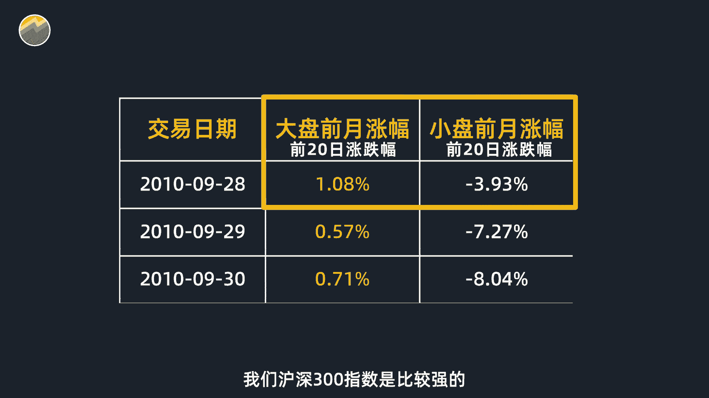

那么接下来的一个交易日，沪深300指数跌了0。21，而创业板指数跌了1。62，虽然两者都是下跌啊，但明显沪深300指数跌的更少一点，他的表现更好，也就是说这个大小盘的指数，它的次日的表现。

它延续了之前一个月的表现。

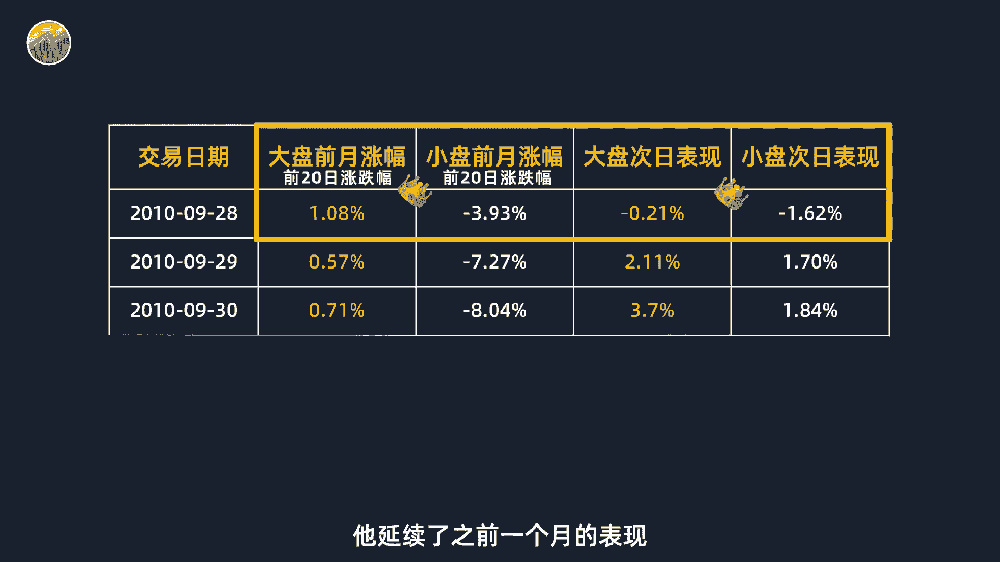

之前一个月表现越好，一天的表现也会越好，我们再把时间快进到2010年的11月，17号，在这里的七十八十九三天，这三天之前一个月的走势，发现是，创业板的走势反而比沪深蛋白指数要好很多。

那么在接下来的一天当中，创业板是涨了1。61，更好于沪深300指数的1。42829号，这两天也是，那么通过我举的这些例子，你会发现，当过去一段时间表现好的那个指数。

它在下一个交易日他的好的表现可能会延续，当然啊这个肯定不是绝对的，我这边举的这个例子都是我精挑细选出来。

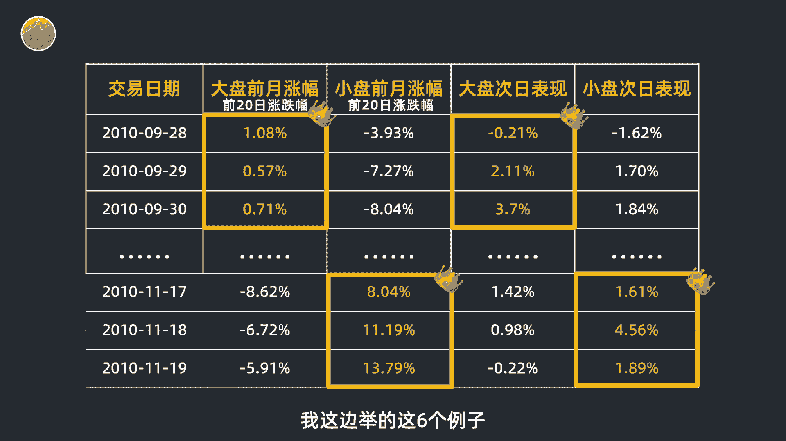

很多时候他并不是按照这个规律表现，但是如果你在市场上混久了，你会发现好像这个规律确实在，很大部分情况是会发生的，那么我们很多量化投资的策略，其实就是来自于我们实盘交易的一一些经验。

我们完全可以把这些经验规则化数量化，形成一套完整的研自动化的买卖逻辑，这样我们就把经验提取到了一个，量化交易的策略，那我们接下来就来尝试着这么做。

首先我们这个策略针对的是大盘和小盘指数，我们默认使用沪深300，上证50和上证指数来代表大盘，创业板，上证小盘，中证还代表小盘指数，每天收盘后呢，我们计算出每个指数之前20天的涨跌幅，每个指数涨幅。

我们就在接下来的一天持有哪个指数，如此循环往复，有人听了这个描述可能还不是完全的清楚，我这边可以再举个例子，比如说我们现在是2010年的9月15日。

这一天已经收盘了，然后我们统计到所有指数在前20天的涨跌幅。

如图所示，一比就知道上证小盘指数涨得最多，那么我就在第二天开盘的时候。

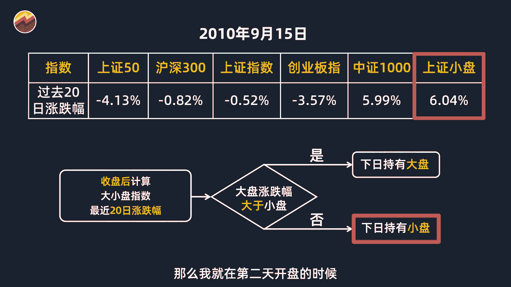

以开盘价去买入上证小盘指数ETF即可，可以想见，在未来几天，上证小盘指数仍然是过去20天，涨得最多的一个指数，那么我们可能在未来几天，持续持有这个小盘指数，所以这个策略虽然日频发出信号。

但它并不是那种换仓很频繁的策略，原理非常简单啊，这操作当中也是完全可行的，甚至你手工交易就可以，那这个策略到底能不能赚钱呢，这我们就需要借助指数的全部历史数据。

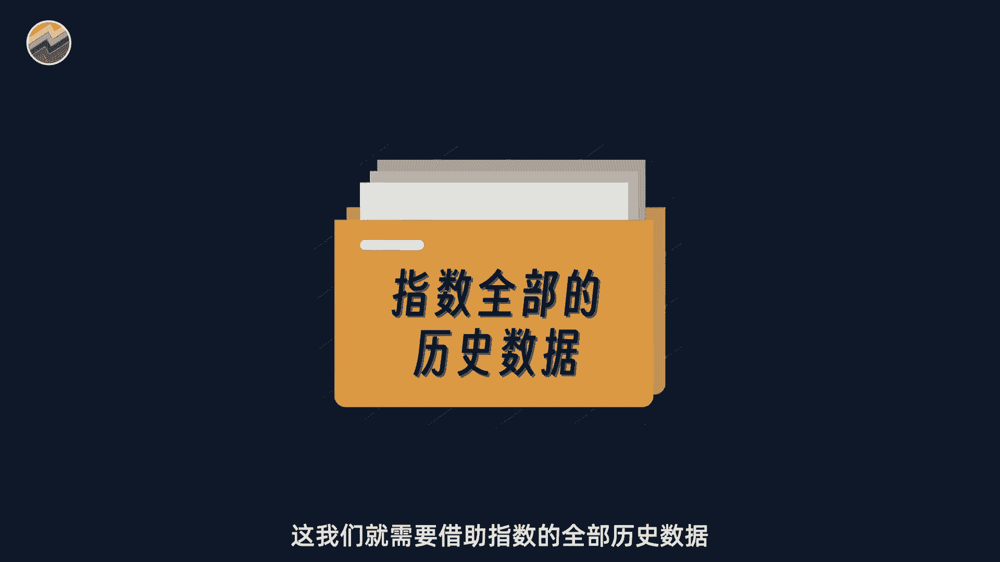

并编写Python代码进行验证了，数据和代码呢我都已经准备好了，如果你需要的话。

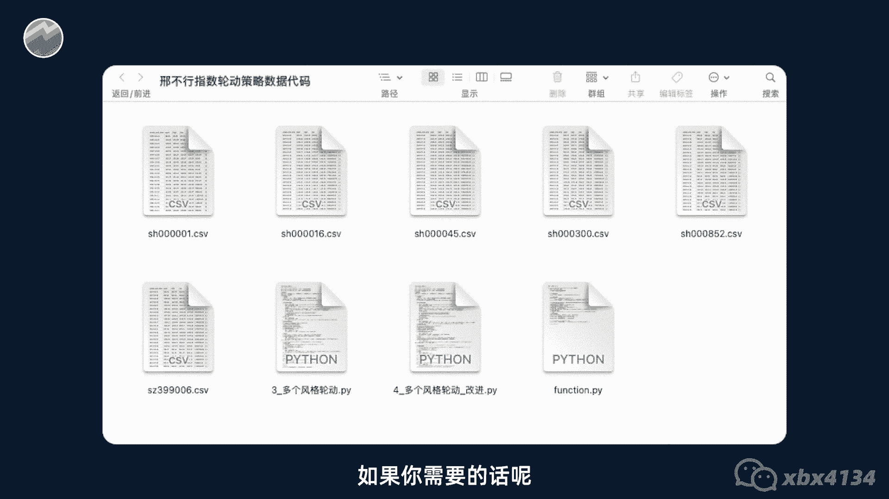

可以加屏幕右下角或者置顶评论区，我的微信都是可以直接发给你的，我们运行一下程序。

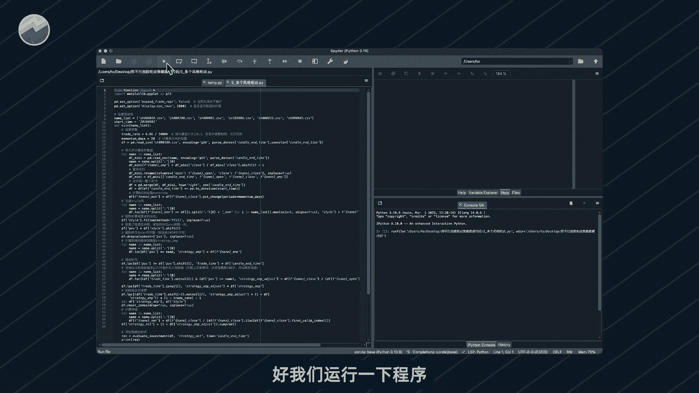

看看结果如何，在看程序运行结果之前，先插一个题外话，很多人问我小白如何入门量化投资，有什么资料分享，所以我特意为大家准备了一个量化投资，新手学习的大礼包。

你打开这个文件，它包含非常多的内容啊，首先这个word文档是我们自己总结的。

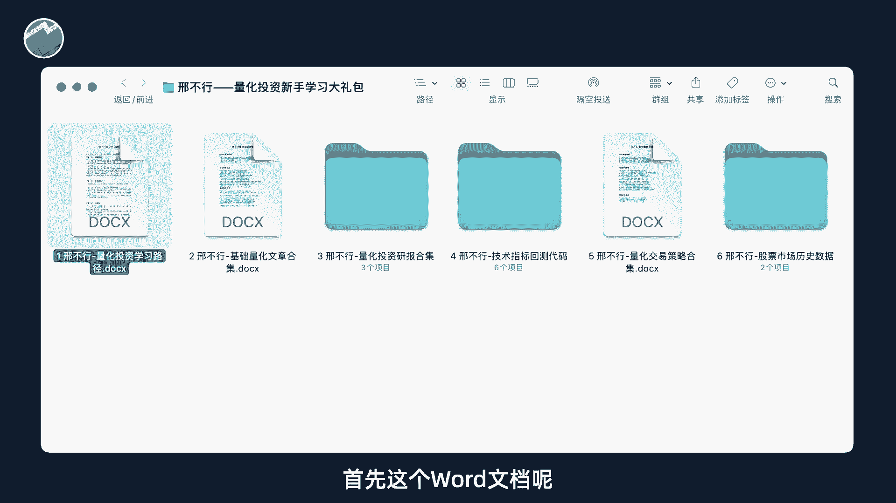

量化投资学习路径，很适合零基础的新手，让你知道自己一步一步需要达到什么样的阶段。

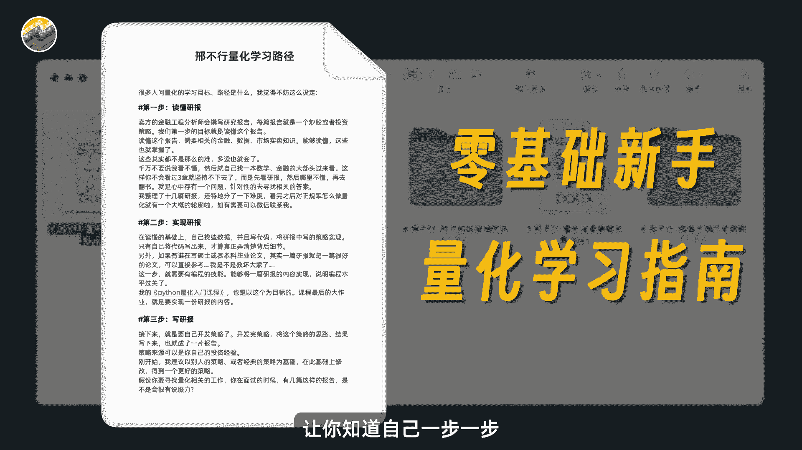

看完学习路径后呢，就可以通过我整理的量化文章合集，来更全面的了解量化投资到底是什么，然后呢，我还精选了适合各个学习阶段的策略研报合集，正如我一直说的，量化研报是很好的，量化实践项目。

深度研报可以显著提升你的量化水平，还有这一份代码呢，则适合所有喜欢技术指标的人，你可以跟着教程轻松计算出所有的技术指标，并测试这个指标是否有效，如果你有一定的基础，你还可以尝试回测一些策略。

我为你准备好了十几个不同类型的经典策略，和他们的代码，运用到实盘，当然最后也是最关键的，量化的基础就是准确的历史数据，我会送你一份股票，历史日线数据和一份财务数据，你可以用它来像我一样。

去测试所有的技术指标和财务指标，以及大部分的策略，所以这个大礼包的内容真的非常的丰富，如果你需要的话，可以加屏幕右下角或者置顶评论区，我的微信都是可以直接免费发给你的。

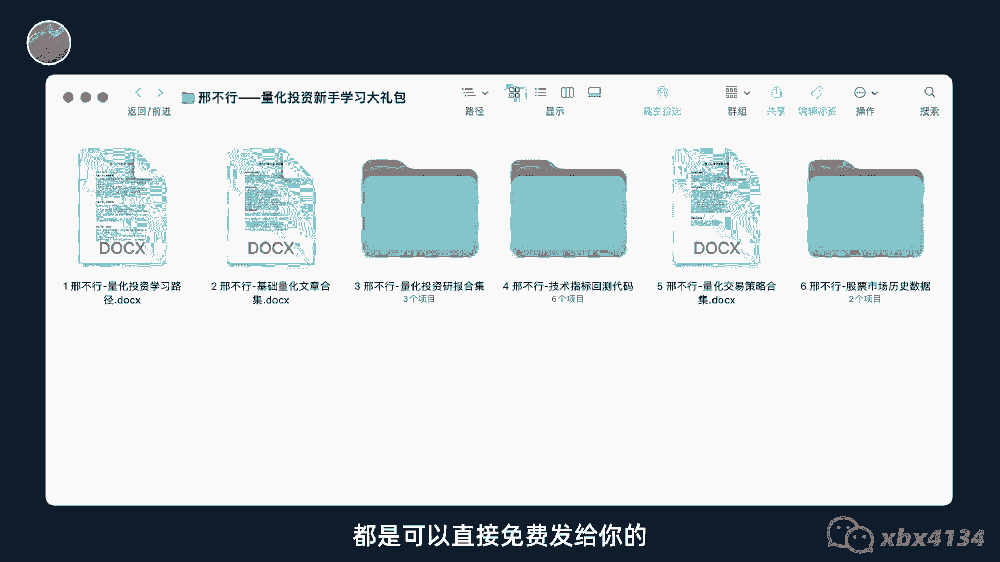

程序运行结果如图所示，代表策略的成色曲线，从初始的意愿涨到了10。64元。

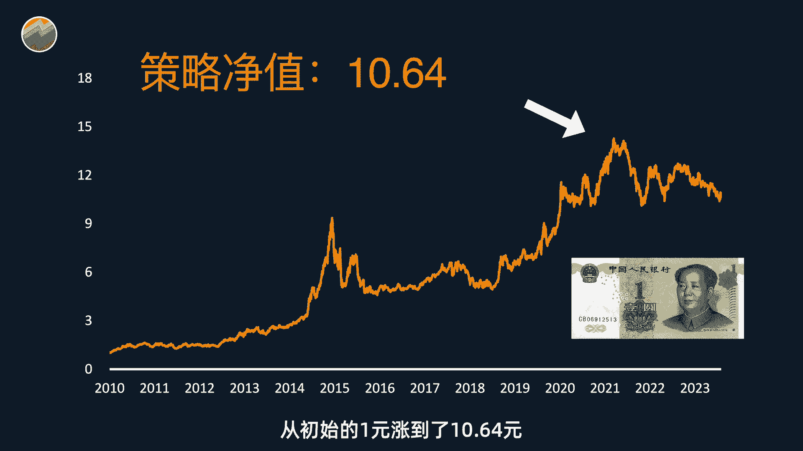

年化收益19。02，非常不错啊，远远的跑赢了所有的指数，如果大A本身的指数就长这样，那我相信大家也会真的相信国运定投大A了，但是作为策略来说呢，这个策略它的最大回撤有点大，高达百分分之51。

当然这个主要是由于这个策略。

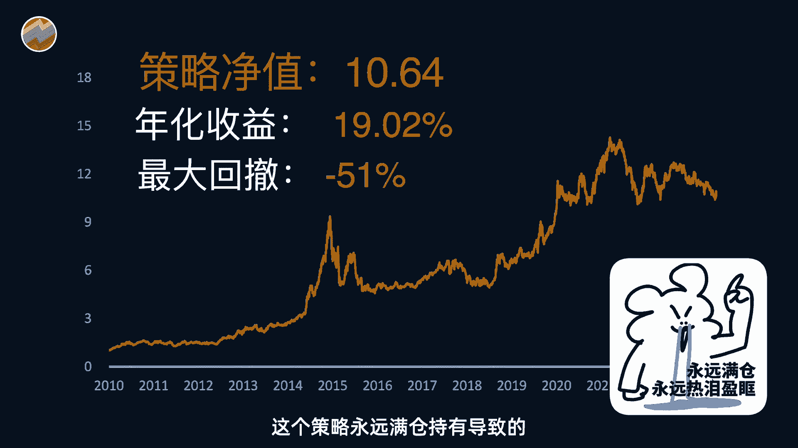

永远满仓持有导致的，不管当时的行情好坏，他都会满仓的去持有，但是呢作为一个实际放钱的策略，我们不希望他的回撤这么大，这个时候呢我们就需要想一个办法，是不是可以去尝试优化一下这个策略。

并且正好借这个案例去讲讲，我们是如何和产生优化策略的思路，以及最终的优化结果到底是什么样的。

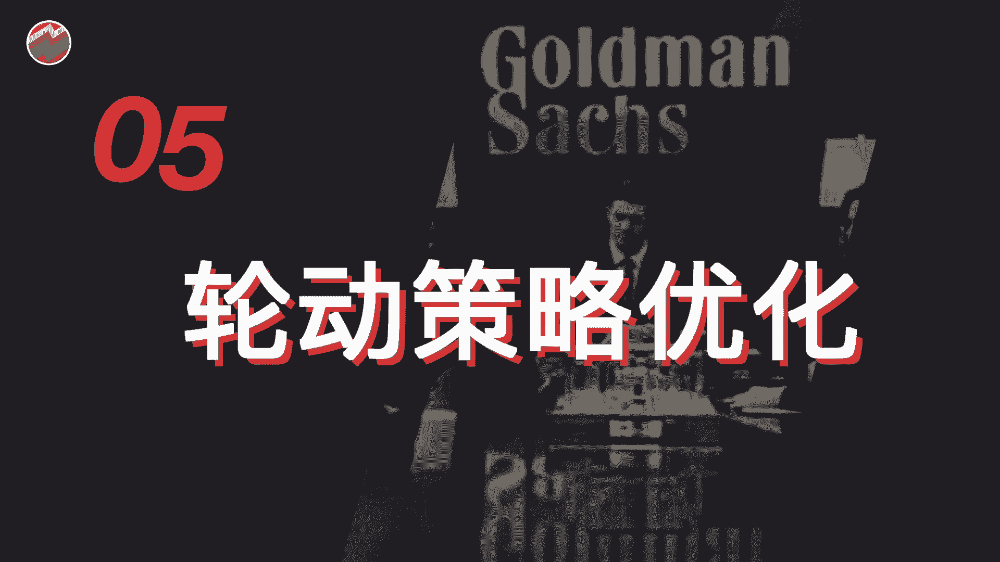

我们原来策略最大的问题就是它最大回撤太大，接近50%。

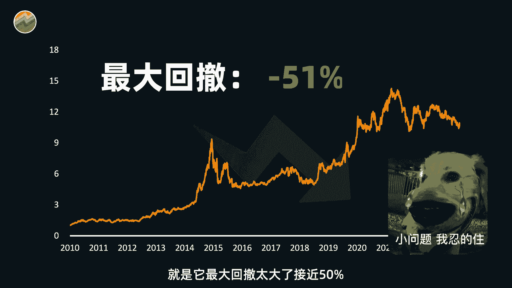

为什么我们会在意最大回撤呢，因为这个影响，我们实盘中是否能顺利的把我们策略执行下去，并且如果你的策略在第一年回撤50%，哪怕按照我们这个22%的年化收益，策略，也需要到3年或者4年之后才能回本。

非常亏的一件事情，那么想要降低回撤，我们就要去看一下我们原来策略，他回撤的开始时间和结束时间，是2015年的6月到2016年的6月，这段时间其实也就是2015年股灾的时候。

市场整体处于一个极度的熊市当中，我们来看其中一个具体的交易日，2015年的6月25日，在此之前的20天，大盘指数和小盘指数都出现了较大幅度的下跌。

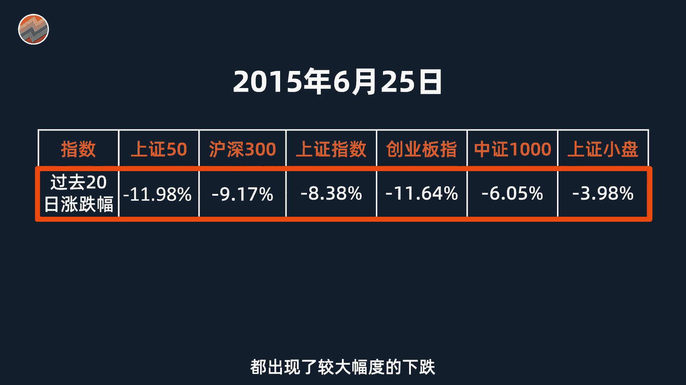

然后之后几天的表现也不是很好，按照这个策略跑之后，五天表现是亏了12。7%，那看到这里你可能就能发现问题，什么问题呢，就是我们在市场整体下跌的时候，这个策略还是只是在大盘和小盘之间。

就选择跌的少的去买入。

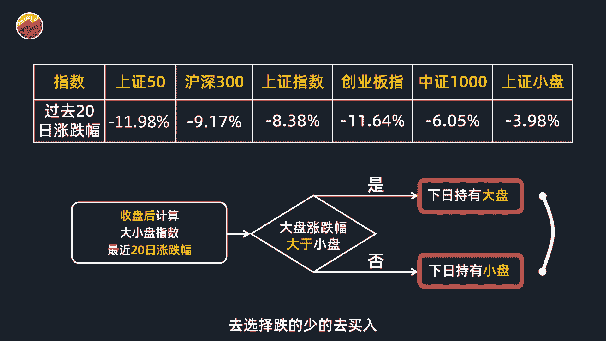

但是呢因为市场一直在跌，你不管选择什么之后，总归是下跌，这个就有点不合理了，当前市场明明处于熊市，但我们还在不断的买，那更好的情况呢，就是我们发现大盘和小盘指数，它都在下跌的时候，我就停止我们的操作。

比如说我们可以这样来改进我们的策略。

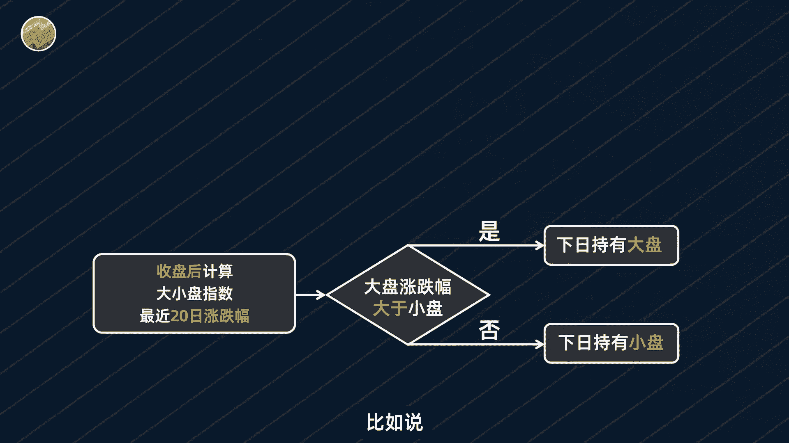

我们在原来策略的基础上呢，这样一个条件，我们看一下大盘和小盘的涨幅是不是都小于零，如果都小于零的话，我下一天我就空仓了，我就不交易了，我就持有现金了，这是一个很简单也很合理的修，那么我想知道这个修改。

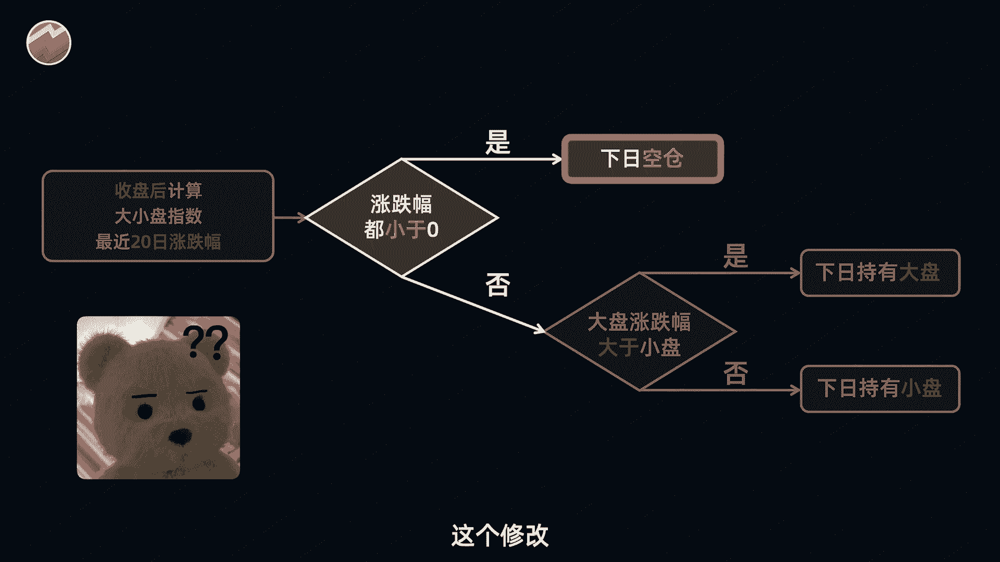

它到底会不会有更好的效果呢，如果你不会编程的话，那你可能统计起来就很麻烦，但是你会编程的话就很简单，我们只需要在原有的代码上修改几行就可以了，如果你需要这个代码和相关数据的话。

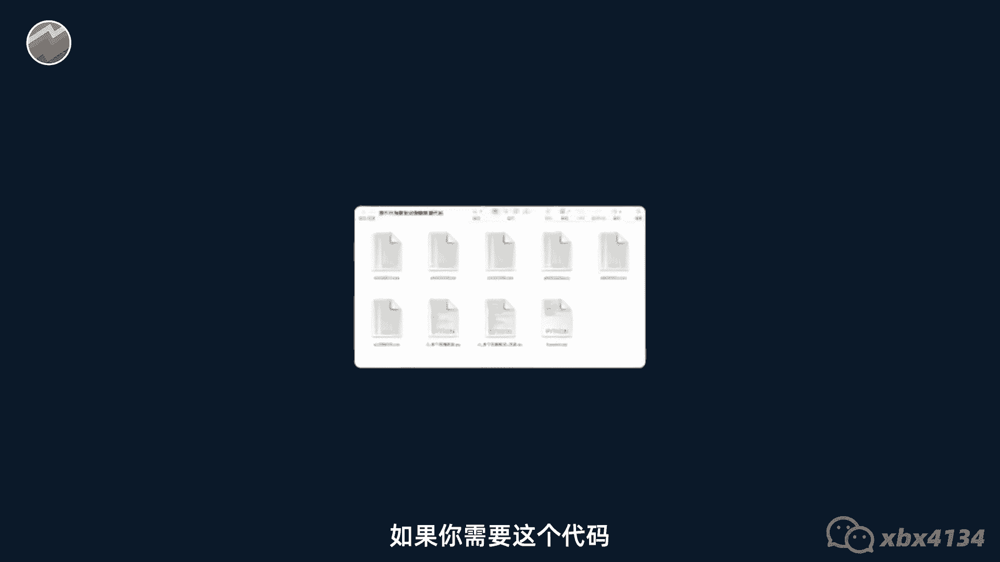

可以加屏幕右下角请评论区，我的微信都是可以直接免费发给你的。

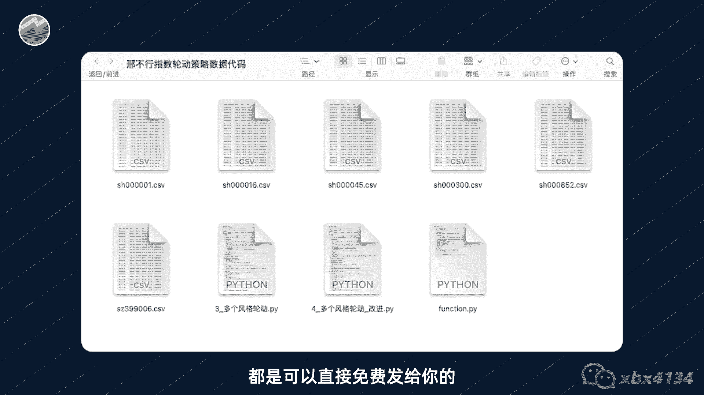

我们运行一下代码来看看结果如何，连续运行，结果如图所示，橙色曲线就是我们改进之后的一个结果。

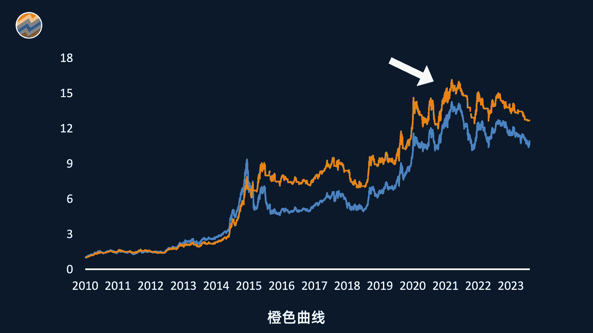

可以看到，相比对于原策略10。64的净值，改进后，策略净值变成了12。69，它的确是让我们多赚钱，更重要的是一侧有原来的51。1%，变成了26。8，这个提升其实是巨大的，他让一个不可能拿来实盘的策略。

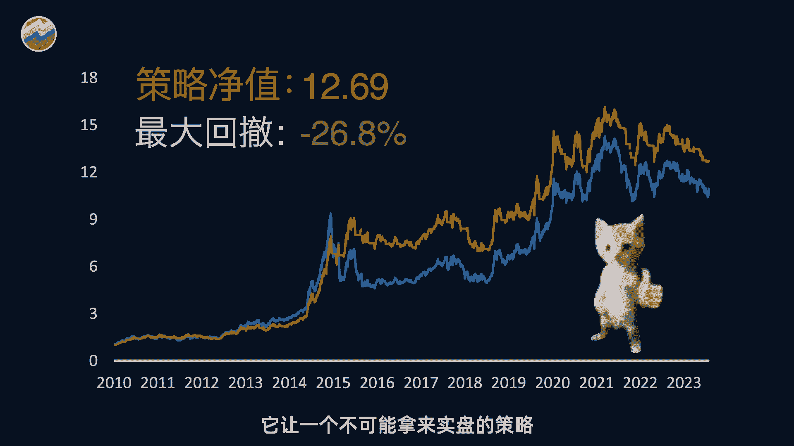

变得基本上可以进一步研究去实盘了，而且我们可以尝试进一步的去优化，比如我们之前是各用了三个指数，代替大小盘策略，那么我们是否可以增加更多的指数，一起来进行轮动呢，就比如说我们是看过去的一个月。

也就是过去20天的涨跌幅，我们是不是可以把这边的20改成过去的五天，十天40天呢，你都可以自己去试一下啊，其实有了代码之后，这个试起来都非常的方便，代码里面的这些都是参数，你改一下这个参数。

很快就可以得到相应的结果，并且如果你把思路开阔一点的话，可以把这个指数变成基金，那你是不是可以拿这个策略，在两个基金之间进行轮动呢。

当然其实我这个是不建议的，因为基换仓的成本太高了，或者有的同学他投资某马赛克市场，我们可以在之间做轮动，收益会非常的爆炸，就是使用我们这个简单的策略，再来讲一个更专业的玩法，我们之前讲的都是一些现货。

只能买入做多，但是如果我们能够交易股指期货的话，我们就可以构建多空的组合。

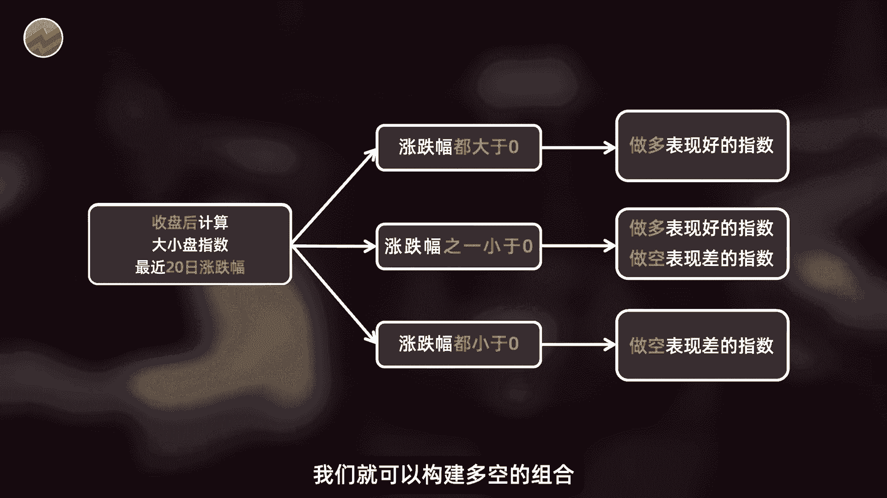

我们发现大盘过去一段时间，比小盘涨得多的时候，我们可以做多大盘同时做空小。

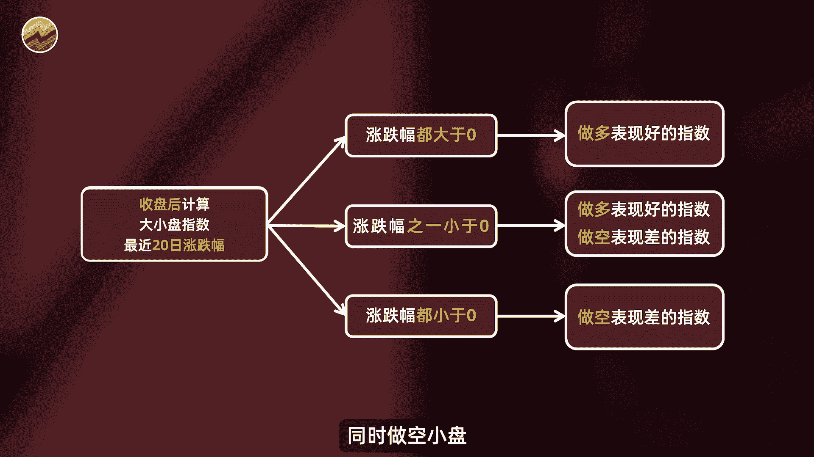

那我们的收益就完全来自于，两个指数之间的差异，然后我们整体的资金曲线画出来，就会非常的平稳，当然这个就比较复杂了，我们就不详细讲，关于什么是股指期货，你可以看我之前的这个视频介绍好。

那么本期视频就到此结束，很感谢大家的点赞。

