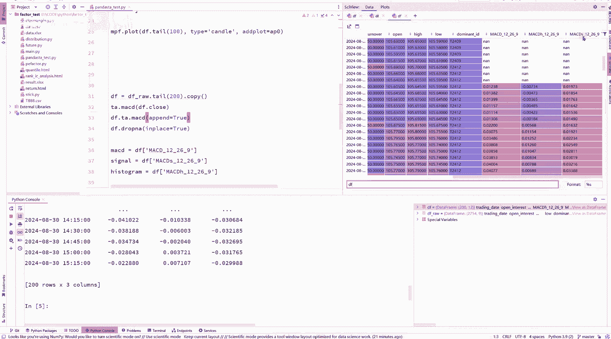
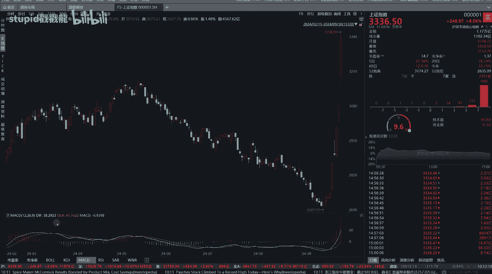
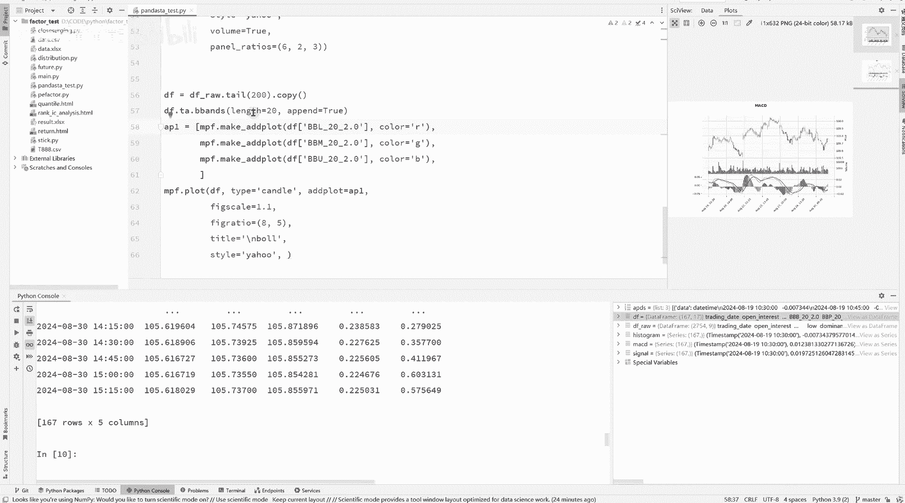
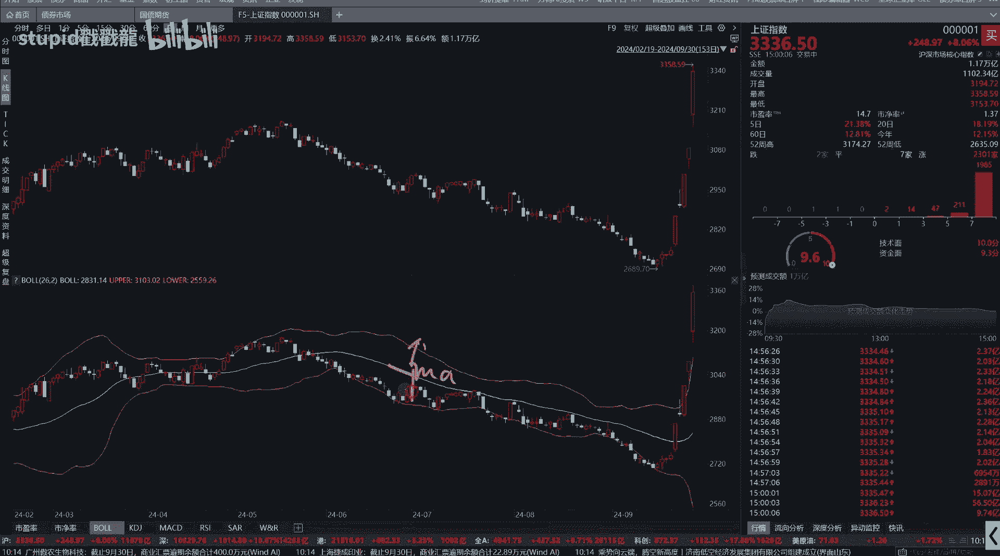
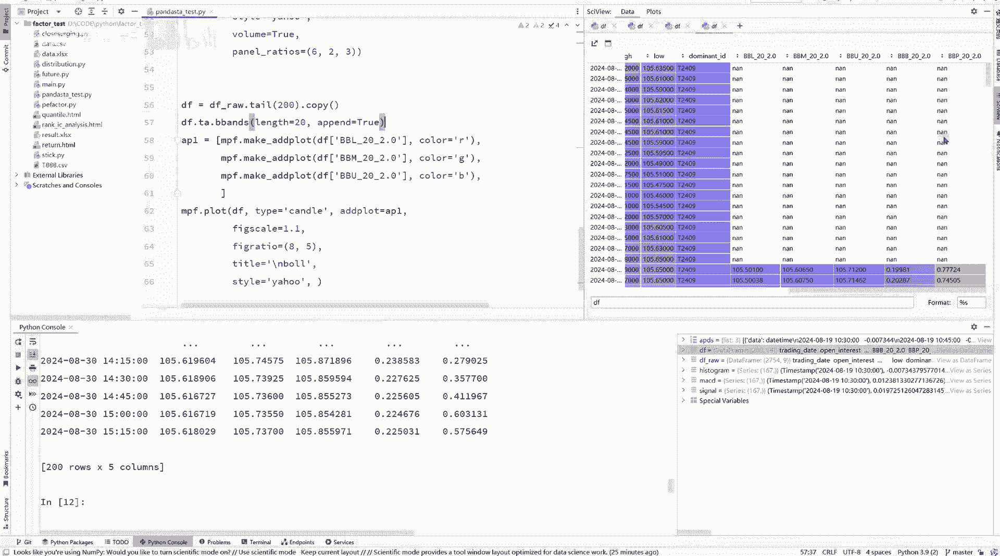
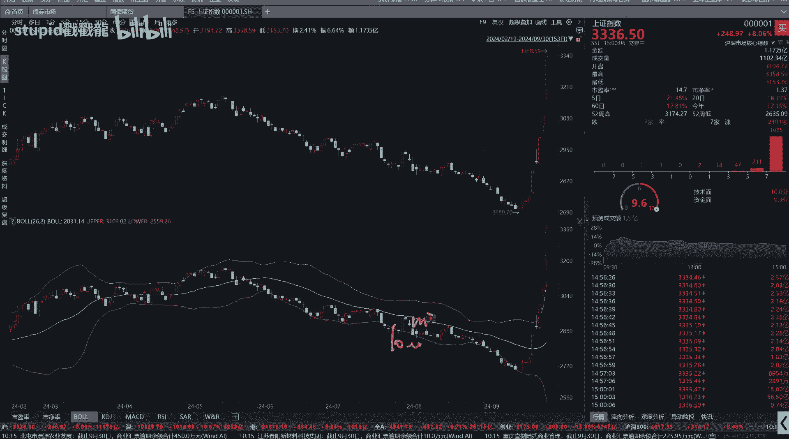
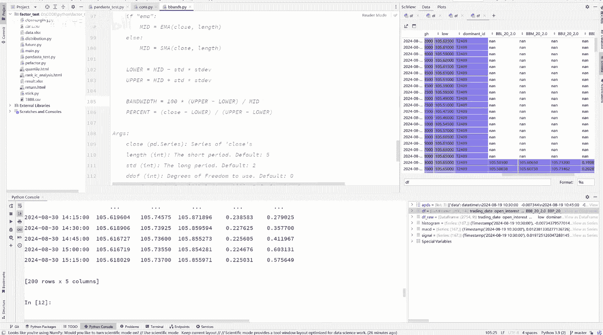
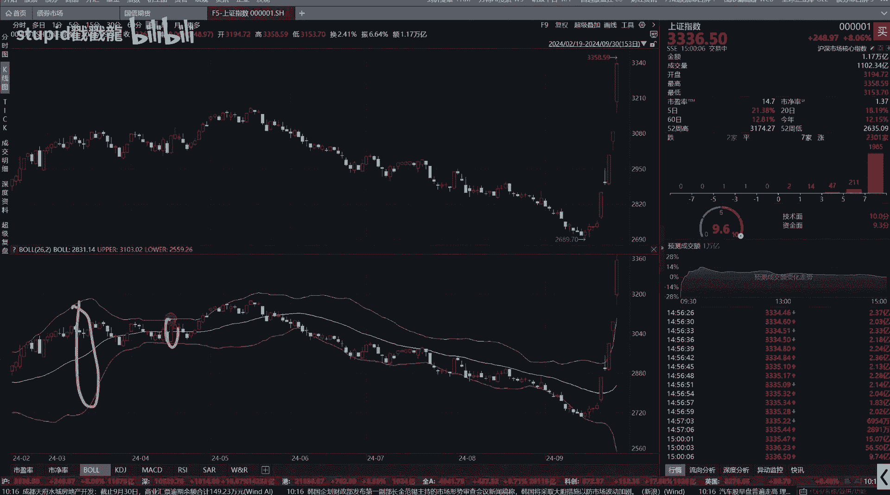
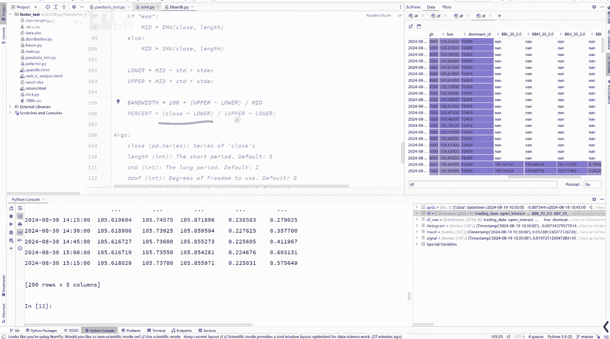
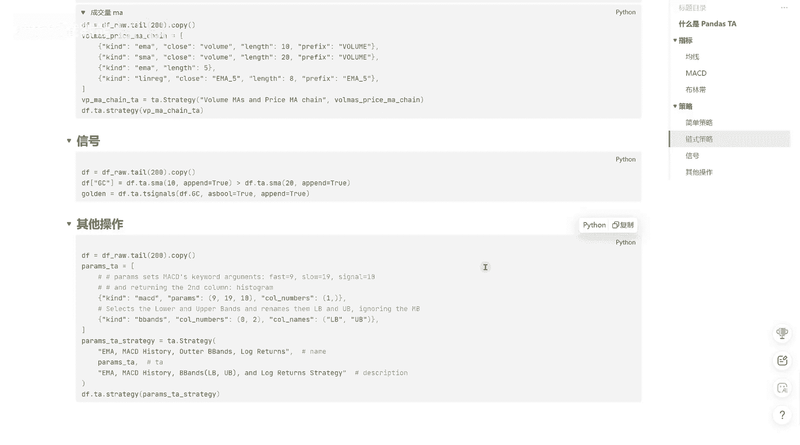

# 快速上手pandas_ta ｜pandas talib 技术分析 ta - P1 - stupid戳戳龍 - BV1nT4LeBEvF

各位小伙伴们大家好，今天我们介绍一个，能够提升我们研发策略效率的Python包，pandas是ta，那这个是它的一个官方文档，我们点进去先看一下它的官方文档呢，其实关于它的使用介绍的并不是非常的详细。

此外呢，它的很多功能是基于国外的一些使用习惯，比如说国外的一些行情员来设计的，所以有些内容呢，它可能并不太适合于国内的一些情况，那因此呢我就整理了一下他的一个文档。

把它常用的重要的一些功能给他总结了一下，那么我们下面先来看一下到底什么是pandas，as ta在Python里面进行数据分析和数据处理，非常重要，且常用的一个包是pandas包，同时呢进行技术分析。

比如说要汇日布林系，MACDRSI等技术指标呢，我们最常用的是ta lib包，在过去我们要研发一些技术类指标策略的话，我们一般是将pandas as包括ta lib包，结合起来用。

那现在呢pandas ta就对这两者做一个封装，能够进一步的提升我们的一个研发效率，下面呢我们看一下pandas是ta的特性，这些呢是我从他的GITHUB上贴过来的，我们挑一些重要的来讲。

首先它包含了130多个，技术指标和工具函数，能够满足我们日常的策略研发，那其次如果你之前已经安装过了ta lab包，那么计算技术指标就是直接调用ta lab包来计算，Python的ta lab包。

那实际上是对C加加的ta lab包进行了一个封装，所以用ta lab包来计算技术指标的时候，它本质上调用的是C加加来计算的，所以性能会比较高，最后我们也可以开启多线程，来提升我们技术指标的一个计算效率。

那重要的特性就这些使用前呢，我们首先得进行pandas，是ta包的安装，安装的话直接调用这行命令，因为我已经安装过了，所以这个地方我就不做演示，下面呢我们就直接开始panda，是ta的上手，使用。

pandas是ta呢最直接的需求就是计算技术指标，那其次呢，就是利用这些技术指标来构建一些交易策略，那么我们就先从技术指标开始，pandas tn的包含了非常多的技术指标。

我们可以通过TLAB的文档来进行查看，那么我们先从技术指标的hello world均线策略开始，这个地方我放了一个数据，然后大家可以直接下载到本地，我们先将代码复制过来。

那这个地方就是我们已经导入进来的数据文件，我们先导入一些包，这个地方要注意，panda是ta包，我们是这样导入的，import pandas是ta us ta，然后我们导入数据文件。

我们复制一份数据文件为DF，那大家可以看到这个数据文件，它的index是15分钟的一个时间序列，然后它的各列呢分别是交易日期，高开低收以及成交量，持仓量等数据，然后我们绘图看他的一个数据情况。

这个地方绘图我们用的是p l finance，也就是这个包，这个包的使用呢之前我也出过一个教程，大家如果有兴趣的话，可以点开这个教程去进行学习，panda是ta对技术指标的计算呢有三种方式。

第一种是等价于你直接用ta lab来计算，技术指标的方式的，第二种方式呢，就是我们pandas式和ta lab结合起来的方式，DF是我们一个pandas的data frame。

在我们导入了pandas k包之后呢，我们的DF就可以直接的显示调用，然后我们就有了很多的技术指标，比如这个地方我们就可以计算SMA，那同样我们也可以计算其他的技术指标。

为MACD这个地方append为true代表，当你计算完技术指标之后，我们的DEF，后面就已经将史莱梅来添加进去了，通过这种方式调用呢，我们思考它是如何知道我们要计算哪一列的呢。

比如这个地方我们是显示的，把收盘价这一列给传进去了，但这个地方我们并没有传收盘价，我们来看一下它的源码，在它的源码里面，它会自动的搜寻这个data frame里面的close这一列，如果有的话。

那么他就直接用close来计算，剩下的第三种方式呢，EF点ta的方式来进行计算，它其中有个can的参数，是我们填入技术指标的名称，我们除了计算周期为五的均线呢，我们也可以计算周期为十的均线。

比如这个地方我们用L为十，这个地方，我们多了一条周期为十的一个移动均线，那下面呢我们用m p l finance，来绘制一下它的一个均线走势，那首先呢我们添加一个5日均线，我们取最后100条数据用绿色。

然后我们再添加周期为十的均线，颜色为蓝色，然后我们绘制，那这两条均线就已经绘制出来了，下面呢我们就来看MACE的计算，我们同样先复制代码过来，首先我们复制一份原始数据为DF。

关于CD的计算其实也有三种方式，那这个地方呢我们就演示pandas是集成的方式，直接点MACD就可以计算，然后我们的DF里面就多了三列，那这三列呢分别是MACD。

MACD的hist和MACD的signal。

这个地方我们要注意a lab，它计算的ACE的返回，这三列呢，和我们通过行情软件看到的这三列不太一样，行情软件是叫DFDEA和MACD。

而这个地方却不是，那具体它这些列分别代表什么含义，以及当我们碰到一个陌生的技术指标，不知道它如何使用的时候，该怎么办呢，我们只需要点开它的一个源码，然后点这个地方，那么往下翻就有它的一个文档讲解。

在文档讲解里面，他给了一个网址来告诉你这个指标的使用，以及呢下面有它的一个明确的一个计算公式，首先是一个EMA就是指数移动均线，然后MACD的话，就是用指数移动均线的快线减去慢线。

然后signal呢就是对MACD，再进行一个移动均线，那最后呢hist就是AACD减去它的一个signal，也就是我们这个地方的一个柱子，那再往下翻，他就会告诉你返回的这三个指标，具体是代表哪一个。

然后我们计算好了之后呢，就把它的N值给删掉，然后我们再对它绘图，然后这个就是我们绘制出来的MACD指标线，下面我们看一下布林带，先复制代码，布林带呢我们是bb bench这个函数名。

这个地方我们需要用布林带的长度为20。

然后我们再看我们的DF，那它返回的是多列，但是我们知道布林带一般就是三条线，比如比如这个地方的，中间的这条呢是布林带的均线，上下两条呢是在这个均线的基础上。

加减它的一个标准差，那这个地方返回了五个数据列。

我们来看看它具体是代表什么，看它的文档，它分别返回的是low mid和up，那就代表这三条low me的和up。

那它多返回的这两个呢使我们的上限减去下限，再除以它的一个均线的一个变宽，也就是当这个值越大的时候。

代表我们的这个布林带就越大，当越小的时候。

代表我们的这个行情波动越小，这个百分比呢是我们的收盘价减去最低价。

除以最高价减去一个最低价，那它代表的是这个距离以上这段距离。

那知道它的一个返回参数的含义，以及计算逻辑之后呢，我们就对布林带进行一个绘图，那这就是我们绘制出来的一个布林带，刚才呢我们已经通过了均线MACD和布林带，来演示了。

pandas是ta关于技术指标是如何计算的，那如果想看更多的技术指标呢，我们可以通过ta lab的一个文档进行索引，下面呢我们来看一下策略构建，一般来说，我们是很少单独的利用某一个技术指标。

来构建策略的，很多时候呢我们是利用多指标，多周期一起构建策略，打一个比方来说，我们的技术指标就相当于一个一个的砖块，而我们的策略呢就是将这些砖块进行组合，来搭建一所房子。

在我们构建策略这所房子的过程当中呢，我们是需要很多砖块的，也就是我们需要很多个技术指标，那么如何去批量的进行技术指标的计算呢，那么这个就是我们panda是ta，提高我们效率的第二个层次策略的构建。

我们先来看简单策略，那简单策略呢就是对多个技术指标，进行批量的计算并组合，简单策略的使用呢，我们首先得实例化一个STRATE去类它，第一个参数是name，第二个参数是ta，ta的话就是一个列表，列表。

里面包含了你需要计算的一个技术指标的组合，每个技术指标呢我们用一个质点来包裹起来，质点的第一个参数是can，can的话就是你需要计算的技术指标叫什么名称，比如说这个地方我们是要计算简单均线。

就写MSMA，如果我们要计算AACD的话，这个地方就是ma acd，那后面的这些参数呢都是这个技术指标，它所计算需要的一些对应的一个参数，所以这个地方我们的CUSTOMA，就是计算了两个均线。

均线的参数，我们分别就给它定义为五和十，理好了这个策略类之后呢，我们用DF点ta点strategy，然后后面再把这个customer给传进来，那这样呢我们就已经批量的计算好了，这个customer。

那最后两列呢，我们的周期为五和周期为十，的一个简单移动均线就被批量的计算好了，然后我们再用第二个ISI和MACD，来演示一下，在这个列表里面呢，我们定义了SI和MACD两个策略，如果你不写后面参数的话。

那么就使用它默认的参数，我们将这个customer b放到这个strategy，这个实例化类里面，然后我们再计算一下，那这样呢就返回了我们刚才所计算的，RSI和MACD的一个计算结果。

在有了这些指标的计算结果之后呢，你就可以基于这些指标进行策略的构建，那这些指标呢就相当于一个一个的砖头，或者我们叫它叫特征feature，无论你是通过主观的一些逻辑，还是通过机器学习，深度学习的方式。

那亦或是通过遗传算法的方式，都可以通过最原始的特征呢，来挖掘出一个表现不错的策略，接下来呢我们看链式策略，我们同样先复制代码，首先复制一份原始数据，然后我们定义我们链式策略的一个指标。

首先呢我们计算了一个AACD的指标结果，然后呢在我们布林带的计算里面，我们用到的收盘价就不是原生的，原始行情中的收盘价，我们用到的是MACD计算出的这个结果，就把这个结果给放进来。

我们基于这个MACD值呢，再计算出它的一个布林带，那并且呢我们把这个计算出布林带的指标的，列的名称呢，前面加个前缀是MACD，然后我们再计算一下，可以看到前面的这三列呢，是MACED的一个原生计算结果。

后面的这六列呢是我们基于MACD的一个计算结果，来计算出的一个布林带，我们再来看一个例子，首先呢我们使用原始数据的成交量，来计算出它一个EMA，也就是指数移动均线呃，然后呢。

我们再利用成交量来计算出它的一个简单均线，然后我们再计算一个基于收盘价的，一个指数移动均线，最后呢我们再利用这个计算出的结果，进行一个线性回归，我们看一下它的一个计算结果。

那计算结果分别就是成交量的周期为十的均线，成交量周期为20的简单均线，周期为五的指数移动均线，以及周期为五的指数移动均线的一个回归，下面呢我们再来看一个交易信号的使用，那首先呢我们计算一个金差时差。

我们首先计算了一个周期为十的均线，和周期为20的均线，如果10日大于20的话，那么就是金差，否则的话就是死差，这一列呢GC呢我们就用true和false来给它填充。

那接下来呢我们如何利用这个true和false这一列，来给它发出一个交易信号呢，我们调用这个函数t s signals，首先它第一列它需要传入的是一个布尔类型的，true或者false的一个列。

在这个例子里面呢，我们传入的就是这一列，然后我们重点来看这后三列，当我们金叉的时候，所以这一列就变为了一代表开仓的意思，然后这个地方代表是enter，就是入场，当由true变为force的时候。

这个trade变为了一，代表空的意思，这一列为true代表出场，所以这个函数可以在一定程度上简化，我们的对于出场入场信号的一个数据处理，最后呢我们再来看一下它的一个其他的操作，在策略列表的构建的时候呢。

我们可以通过parameters这个参数，通过原组的方式传录策略参数，那同时呢可以通过column number呢，来返回我们需要的那一列，因为我们知道原生的MACD它返回的是三列。

那这个地方我们就可以只让它返回一列，那此外呢我们也可以通过这个参数来自定义，它返回列的一个名称，我们来看一下，那首先呢这个地方我们就只返回MACD中的第一列，而布林带呢这个指标呢。

我们返回的是第零列和第二列，那同时呢重新把它命名为LB和UB，那以上呢就是pandas ta一个常用的操作。

