# 快速找出历史上所有妖股，方便复盘找规律 - P1 - SameQuant量化 - BV15D42137mY

人人都能量化交易，大家好，这期分享如何快速的找出历史上的所有妖股，那便于我们总结出妖股啊，启动前的一个K线形态啊，均线啊，各种指标等的一个规律，用于量化交易信号啊，期望提升捕捉到妖股的一个概率。

我们先浏览一下，已经筛选出的所有的历史妖股的列表，的CSV文件好，我们双击这个CSV文件，我们可以看到这个文件是从2000年，一直到最近的一个交易日，我们统计出的所有的一个妖股好。

我们先从这个第一支看一下，叫隐匿的，它是2020年1月份的，你打开行情软件好，向前翻，翻到2020年，我们可以看到这个在这个行情出来之后，被标记为妖股的，我们可以看到他启动之前呢。

这个低位有一个长期的一个横盘，启动之前前几日啊有一个均线的联合啊，之后呢有一个均线开始向上发散，有一个首板，而且这个首板是创了什么，创了近应该有差不多两年的一个新高，这是引力传媒好。

我们再找一个最近的最近的一个非s st的吧，这个叫莱申通这个的啊，3900我们看一下，这是2024年4月份的一个妖股，我们可以看到他的话，启动之前也是有一个震荡啊，差不多是三角形的一个震荡。

也是一个手板，手板也是一个大幅的一个放量，放量之后呢，呃也是走出了一个妖股的一个走势好，接下来呢我们就直接来到这个Python代码里面。

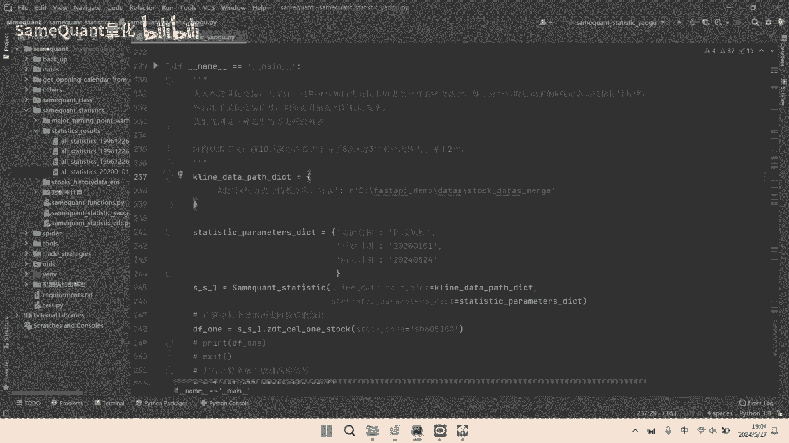

我们先运行一只股票啊，看一下5180。

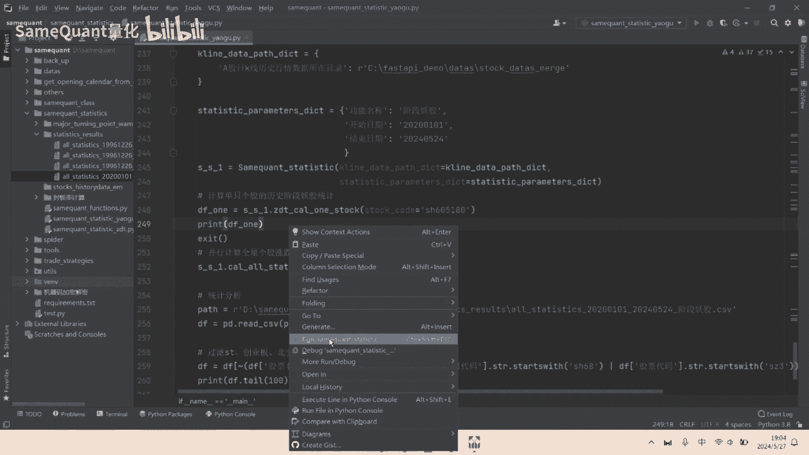

这支票呢也是今年的4月份被这个标记为妖股，也打开看一下这个区间啊，这个没有任何问题哈，我们接下来呢分享一下我们对妖股的一个定义。

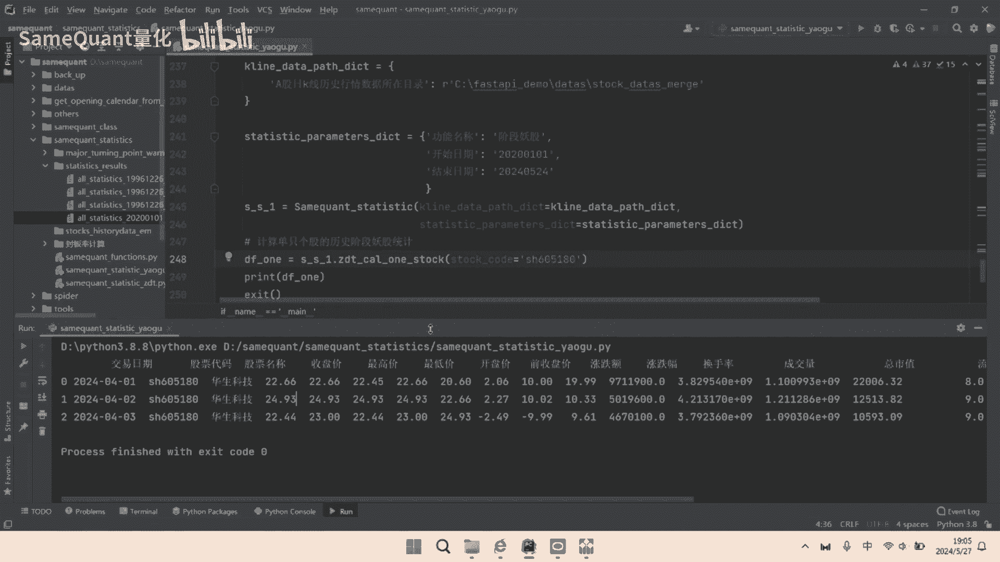

妖股的定义就是前10日涨停次数大于等于八次。

另外呢近3日涨停次数大于等于两次，好我们回到具体的一个代码啊，这个是计算单只股票历史中，出现妖股信号的一个代码的核心的部分呢。

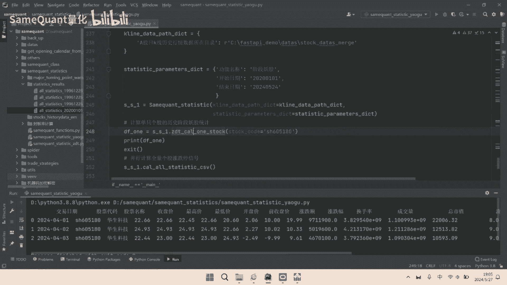

首先是这里是计算前10日，它的一个收盘涨停次数啊，这句代码的意思就是计算前10日涨停次数，这句这行代码的意思。

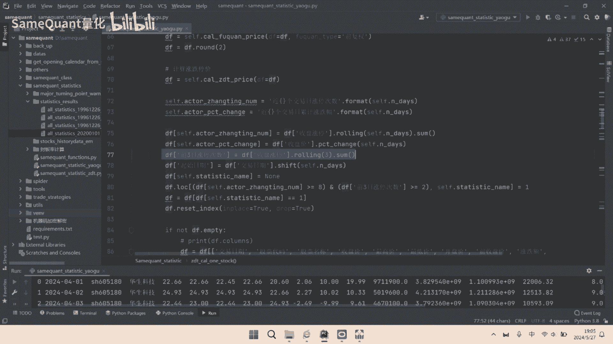

就是计算前3日涨停的一个次数，那证据的意思就是啊，他如果说他的前10日涨停次数大于等于八次，并且那前3日涨停次数大于等于两次。

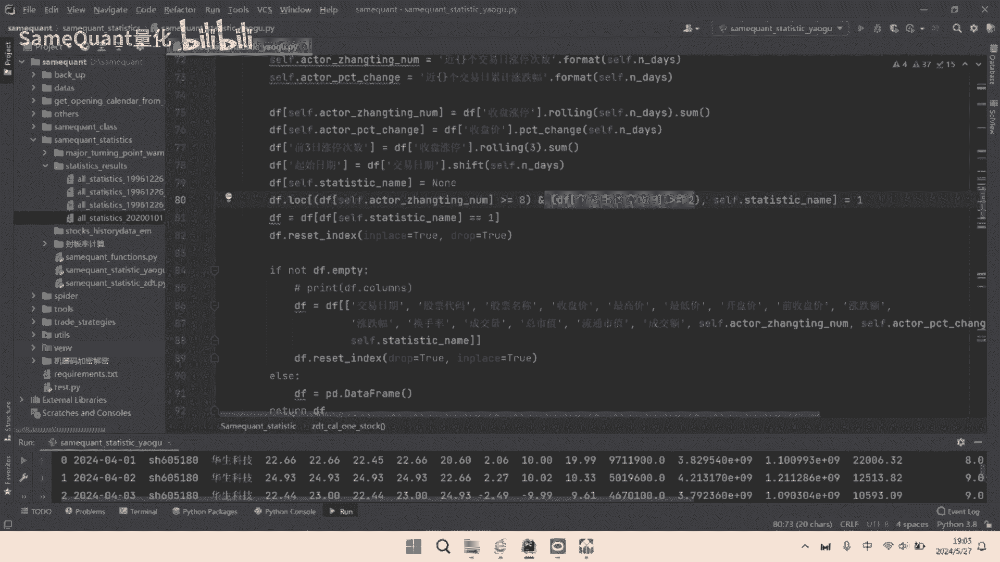

那么我们就标记他这阶段妖股了，就为一这个方法啊，Call out static dsv，它也就是把我们循环这5000多只股票循环计算。

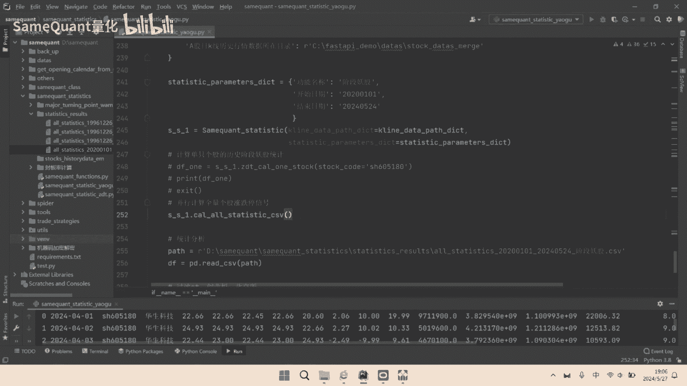

所有的历史的交股信号，生成这个CSV文件啊，也就是这个文件并存储到本机，那存储完之后呢，我们这里直接读取这个CSV文件，读取之后我们还可以对进行一个过滤哈，比如说我们这一行的意思。

勾勒掉s st科创板和创业板的。

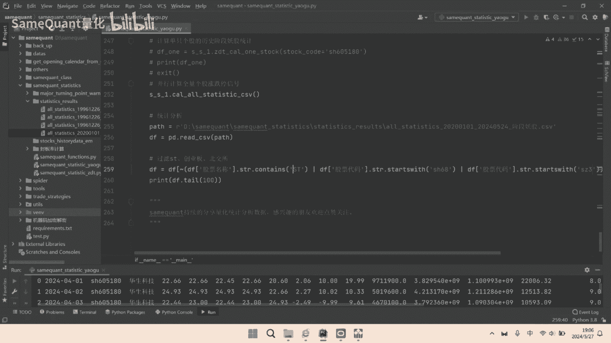

你过滤一下，运行一下，这里显示的是是倒数100行的一个数据啊。

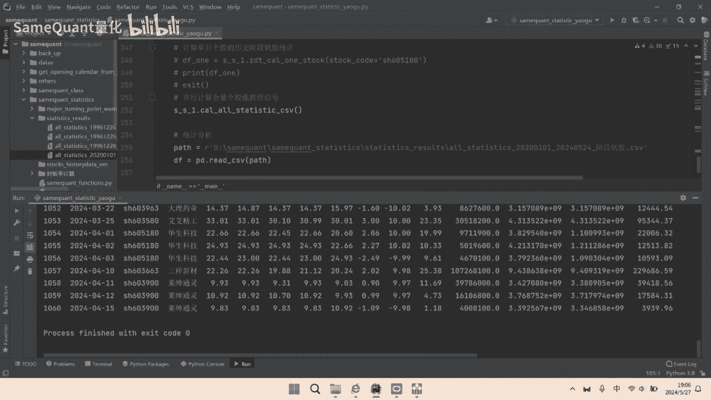

我们看到最近的就是在抬升的，再向前是华深，再向前是II，我们看一下玩短线的朋友啊，他们应该对这个是比较了解的啊，好这个呢基本上就是我们本期要分享的内容。

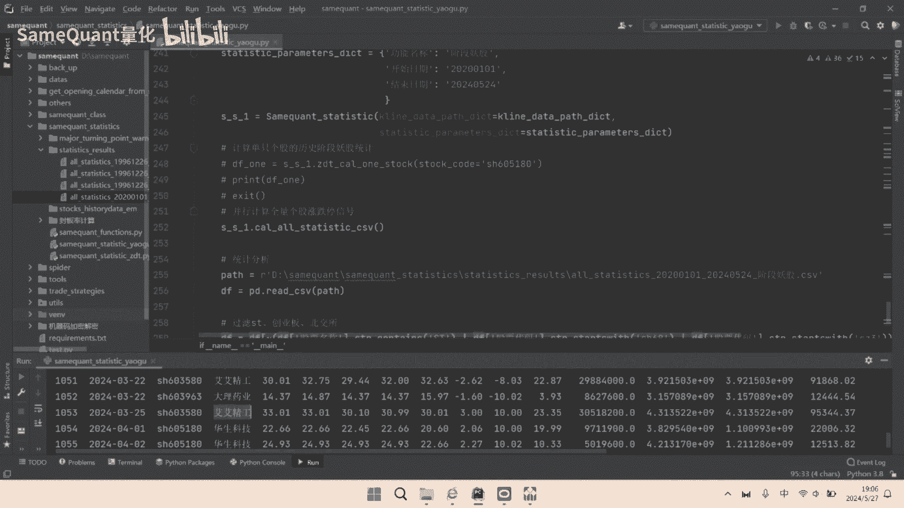

如果说对于历史的妖股的CSV文件啊，想要的啊，或者说对计算啊筛选幺五这个代码啊，需要的啊也都可以，我们直接留言私信好了。

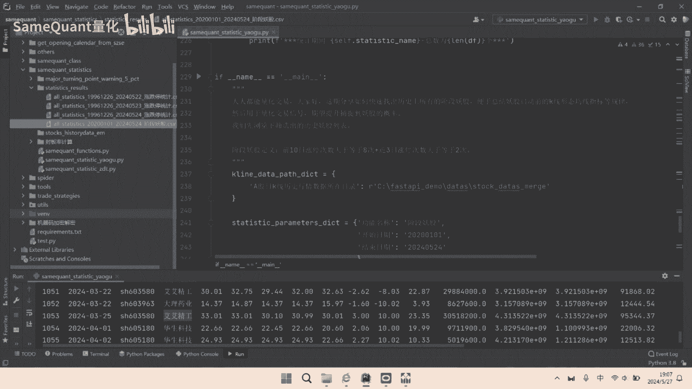

节目框架呢持续分享啊，量化统计分析数据啊。