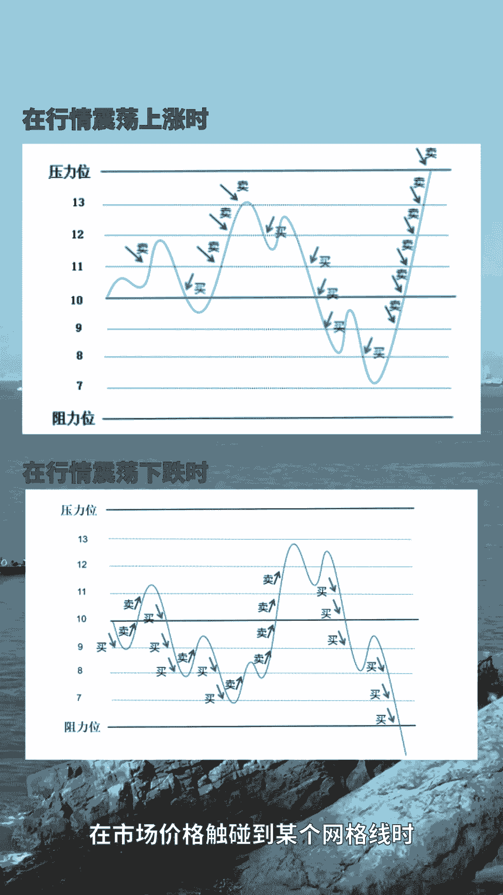
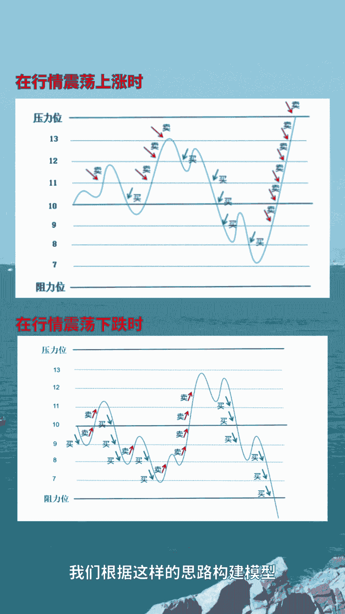

# 怎么做量化交易 - P1 - 多元量化 - BV1zoaDeUEpp

怎么做量化交易呢，我们除可以通过零代码策略模块，根据技术指标简单方便的创建策略。

我们还可以通过Python代码模式。

使用Python语言编辑功能更强大的量化策略，Python作为一款脚本语言，他的语法简单直观，即使不是编程高手，也能快速上手，Python代码策略支持功能强大的南派pandas，Tulip。

matt plot lib等库，帮助数据分析和模型构建，Python具有庞大而活跃的社区，这里有海量的资源和智慧，帮助你解决各种难题，我们通过Python来设计一个网格交易策略。

在标的价格不断震荡的过程中，对标的价格绘制网格，在市场价格触碰到某个网格线时。

进行加减仓操作，尽可能获利。

我们根据这样的思路构建模型，选择标的，打开Python编辑模块，我们通过Python语言来实现这个模型，编辑完成进行回测，我们可以看到，这个策略在震荡行情中获得了稳定的收益。

