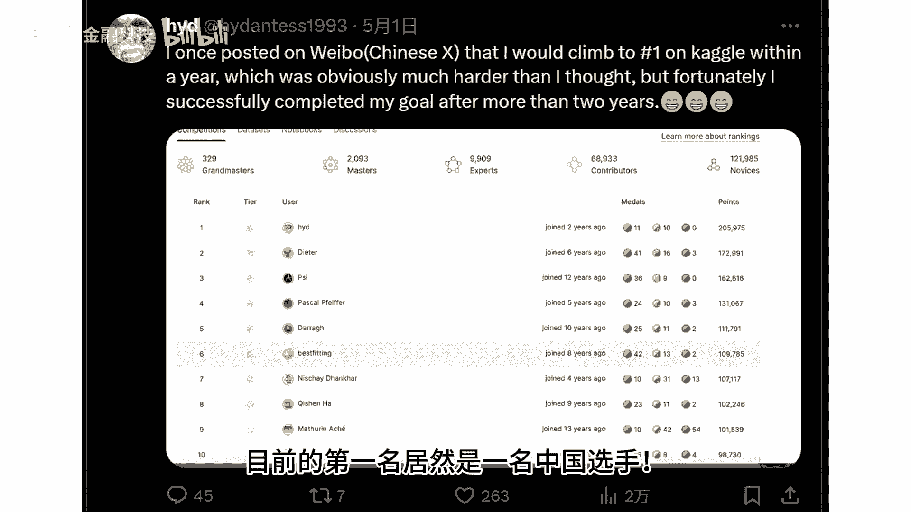
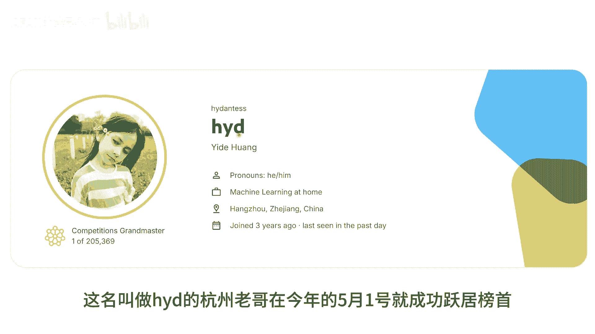
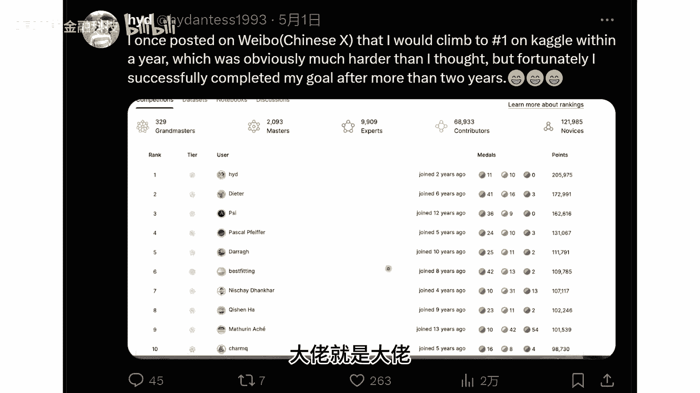
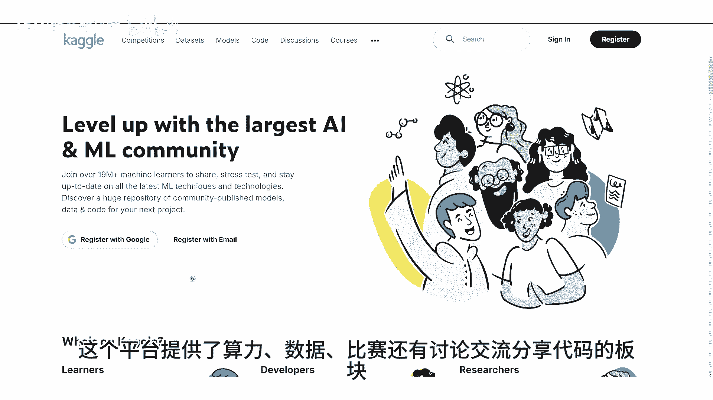
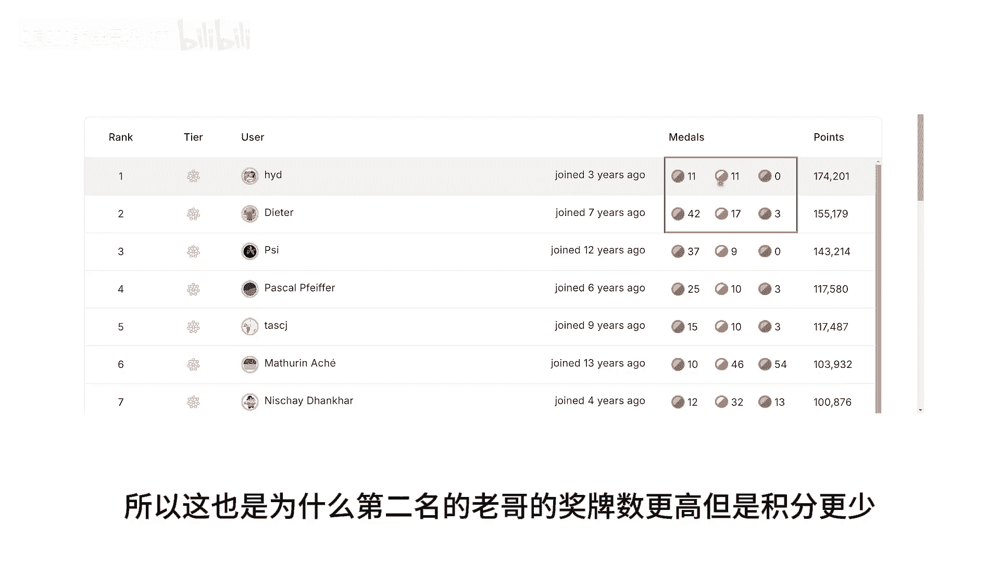
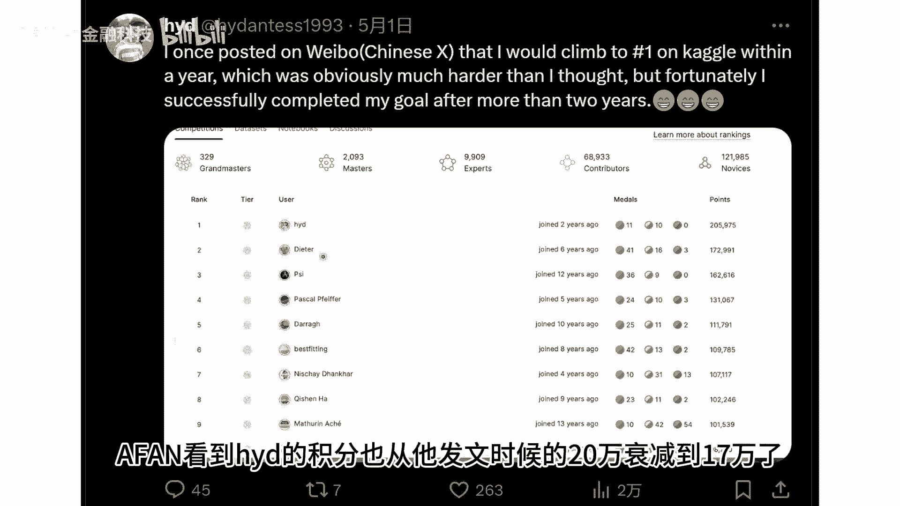
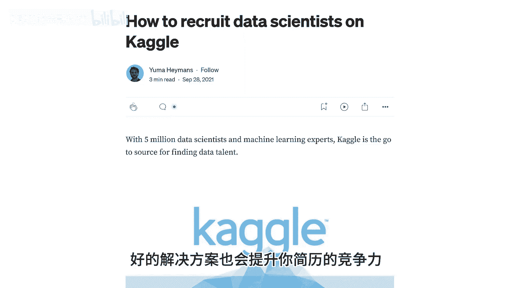
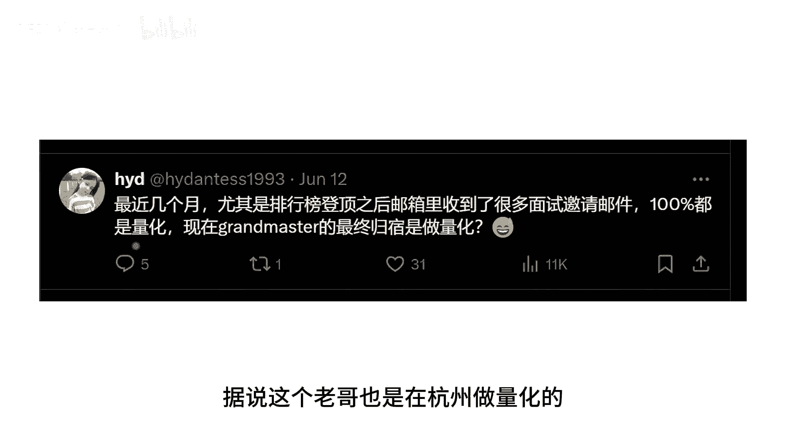

# 惊！全球最大的数据科学竞赛平台的第一名居然是名杭州老哥？｜ kaggle ｜ 人工智能 ｜ 数据挖掘 ｜  机器学习 ｜ 深度学习 ｜ optiver - P1 - AFAN的金融科技 - BV1pfsnenEbi

大家知道吗，全球最大的数据科学竞赛，cargo平台的竞赛榜单上，目前的第一名居然是一名中国选手。

这名叫做HYD的杭州老哥。

在今年的5月1号就成功跃居榜首，在20多万参与过cargo竞赛，的数学科学家中成功登顶，他在这一天的推特上面发了一条内容，引来了全球各路选手的一个祝福，大佬就是大佬。

还很低调的，在自己的微博，也转发了自己两年前的一个flag，并且还说自己还菜菜的，要学的还有好多，然后一个微笑脸，大家可能不知道这个榜单的第一名意味着什么，cargo在数据科学和人工智能领域。

享有极高的声誉，是全球数据科学家的集聚地，这个平台呢提供了算力数据比赛。

还有讨论交流分享代码的板块，在阿凡以前讲信贷风控vintage的那期视频中。

我们就用到了cargo平台的开源数据，然后呢，cargo会不定期的在上面举办一些，数据科学的竞赛，这些竞赛会给出数据和评分规则，并且一些大赛还有丰厚的奖金，因此经常吸引各路神仙竞相参赛。

比如这位HD的老哥，最近参与的荷兰著名量化公司optimal，举办的一个比赛，其总奖金超过了10万美元，第一名呢，也就是HYD这位老哥，也将会获得2。5万美元的奖励，每次参加比赛获得名次就会得到积分。

积分的公式表明你在参与人数越多的比赛中，获得更高的名次的话，将得到更多的积分，比如HYD在参与人数很多的比赛中，都获得了很好的名次，所以积分呢上的也很快，那这么多年各种比赛的积分累积下来。

就形成了20万人的一个榜单，那截止到24年的8月27日，这个榜单的目前的前十名中啊，第二名是一位英伟达的数据科学家，那第三名呢是H2O的数据科学家，第十名呢也有一位武汉的中国选手，那需要注意的是呢。

这个榜单的积分啊，它不是一成不变的平台，会有一个指数的衰减公式，每次获得积分后都会随着时间不断的衰减，所以这也是为什么第二名的老哥的奖牌数更多，但是积分更少。

从5月到现在，阿凡看到HYD的积分呢，也从他发文时的20万衰减到了17万了。

所以要维持这个名次，这位大佬还是得不断参赛才行，不过能登顶一次啊，也能够吹一辈子了，最后呢我还是想强调一下这些比赛的意义，对于数据科学的从业者来说呢，拿到好名次不仅意味着你能够获得奖金，好的解决方案呢。

也会提升你的简历的竞争力，比如这次的HYD老哥在登顶之后，就收到了很多面试的邀约，结果呢这其中都是量化的面试，这也可能和他的参赛的类型相关，据说呢这个老哥也是在杭州做量化的。

有朋友认识的呢，也可以麻烦给阿凡引荐一下好的，今天的视频呢就到这里。