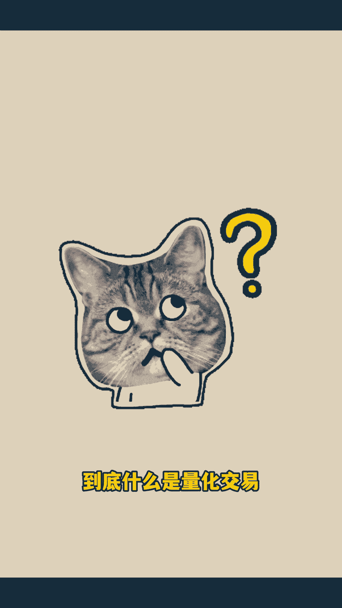
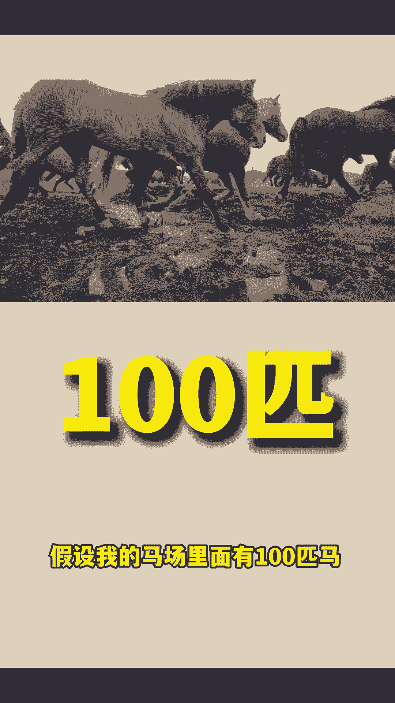
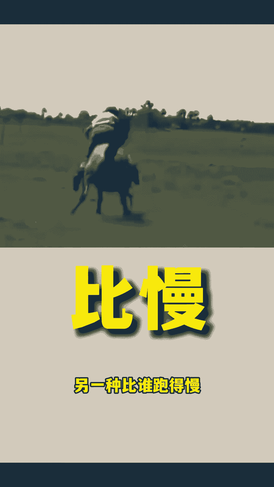
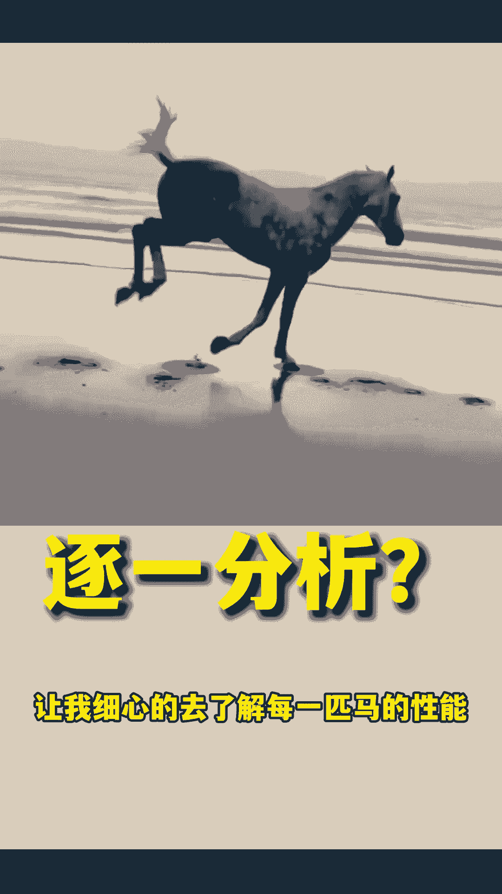
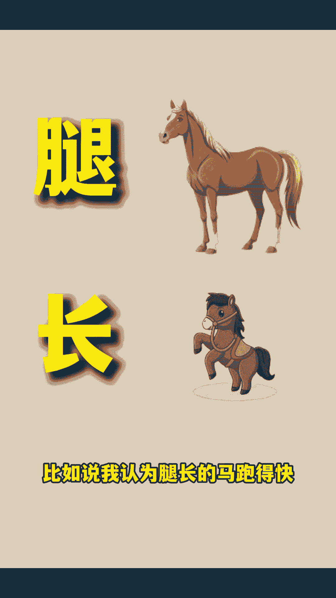
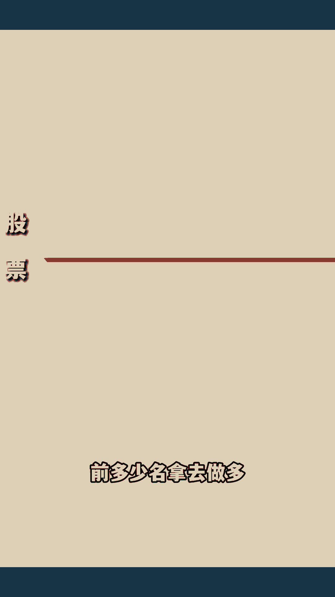
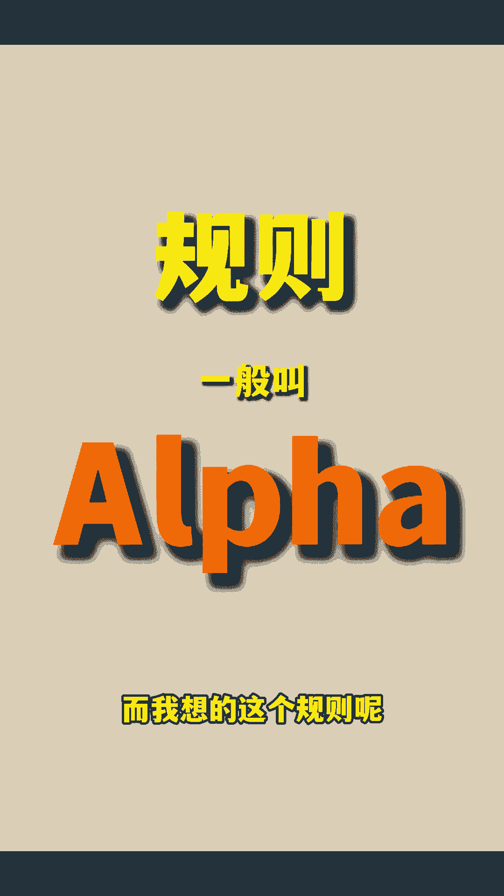

# 懂一点python就能做，躺平开卷两相宜，在评论区报名我会私信你 - P1 - 七摩尔的派 - BV1ap6aYUEg2

到底什么是量化交易。

坚持看完，你会获得一个兼职的机会，假设我的马场里面有100匹马。

市面上有两种赛马的游戏，一种呢比谁跑得快，另一种比谁跑得慢。

我该如何挑选参赛的马，让我获奖的几率最高呢，与其让我细心的去了解每一匹马的性能啊。

不如让我来写一个规则，比如说我认为腿长的马跑得快。

那么我就按腿长给他们排一个序，前50名去跑比快的赛道，后50名去跑比慢的赛道，整个过程全部由代码自动操作，放到股市里面呢，就一共是3000只股票，然后我灵机一动，按某个规则给他排序，前多少名拿去做多。

后多少名拿去做空，这个思维就是量化，而我想的这个规则呢就叫阿尔法。

挖矿的是一个跨国的量化公司，每年呢在全世界有几次招顾问的机会，而这些顾问就替他们公司找这个阿尔法，不知道他们是不是想要在国区内大力发展了，所以他们现在给推荐人，也就是我以及被推荐人。

也就是你有一个激励嗯，1400元左右的吉利，那么成为顾问的这个收益怎么样呢，每天呢会根据你提交的阿尔法的质量，以及你账号的权重会给到每个阿尔法，0~400块钱不等的回报，每个季度呢。

窝矿会把全球的这些量化顾问拿出来，按照一个规则排个名，然后呢会发季度奖金，大概是1400到14万元不等的，它有三个梯度不等的这么一个金额，然后呢他们还会定期在全球举办这些比赛啊。

比赛的过程和你在家里找这个阿尔法的过程，是一样的，不同的呢是前几名会有一个奖金，当然实际操作下来啊，可能前期呃一到两个月，由于你的这个阿尔法的质量不高，以及你账号的权重也不大。

所以收益大概在1~3000块钱每个月，但是呢也有大佬在度过了前两个月之后，随着它阿尔法的质量提升啊，他结合季度的奖金收益上万，甚至有几万，这就是一个大佬的收益图，你可以看到一条指数曲线。

总结下来呢就是吃饭很简单，但是致富要靠能力，那这个兼职耗时间吗，其实我每天都只花20分钟，真的累的呢是网上的一台云电脑啊，我把设置发到那个云电脑里面，然后他给我24小时不间断的跑代码。

然后产出这个阿尔法供我去提交，然后这个代码呢还是挖矿的，他们的培训课给的，所以呢真的很简单，他们把这个饭都喂到嘴巴里了，之所以是现在这个简单的情况，是因为这个事情还没有很多人来参与，所以还没有卷起来。

当然我一开始提到过的，那个1400元的新人激励，并不是说只要报个名就能拿到的嗯，首先要填写一个推荐码，他们的规则呢是如果没有填写推荐码，那么就最终也拿不到这个新人激励嗯。

可能是因为想要保护这个推荐者的这个权益吧，然后挖矿这个公司精明的很，毕竟是搞金融的嘛，那你得需要参加四节他的直播课，然后呢有累计十来天啊，提交这个阿尔法的记录，才可以拿到这个新人激励，不过也很简单啊。

因为如果按照他的那个直播的课程走的话，最终你会有成百上千个阿尔法等着去提交啊，每天还只能先提交四个呢，所以还提交不完，我把这个点说出来呢，就是想提醒那些想薅羊毛的人啊，要坚持坚持，最后呢。

这一次比我参加的那次还要稍微卷一点啊，他在报名的时候会要求你做一道题啊，提交一份简历，但是这个题呢你因为没有接触过，所以你看着会非常懵逼，但对于你了解了这个东西之后呢，其实非常简单，所以呢你可以进群啊。

然后我们可以一起探讨，播矿的操作呢是很正规的，成为顾问要签顾问合同，然后每天的收益很透明，在网页上面都看得到，每天更新，以及最后这个钱打到你卡里之前呢，还会帮你把这个税交了。

那如果你本来就想进入这个金融行业，那你就要更要注意了，因为成为一个优秀的顾问呢，有可能会收到挖矿的全职和，那么就祝你走上人生巅峰了，最重要的呢是啊，1月8号中午左右，这个报名就会截止。

所以呢如果你有兴趣，那就要抓紧时间行动了，相关的信息我会写到下面。