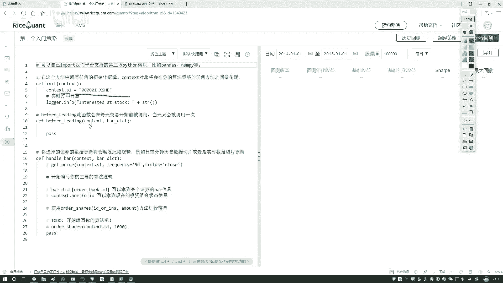
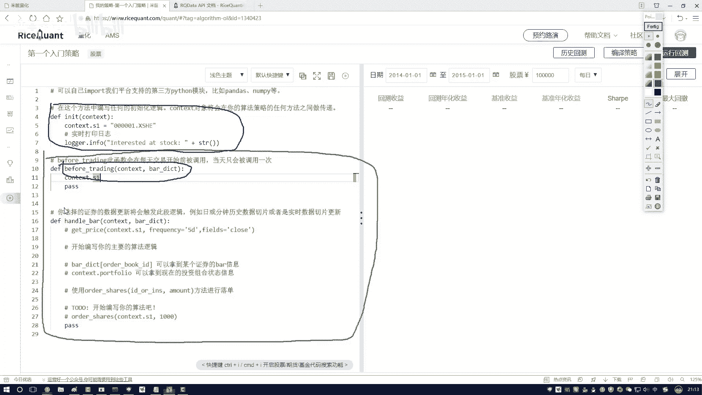
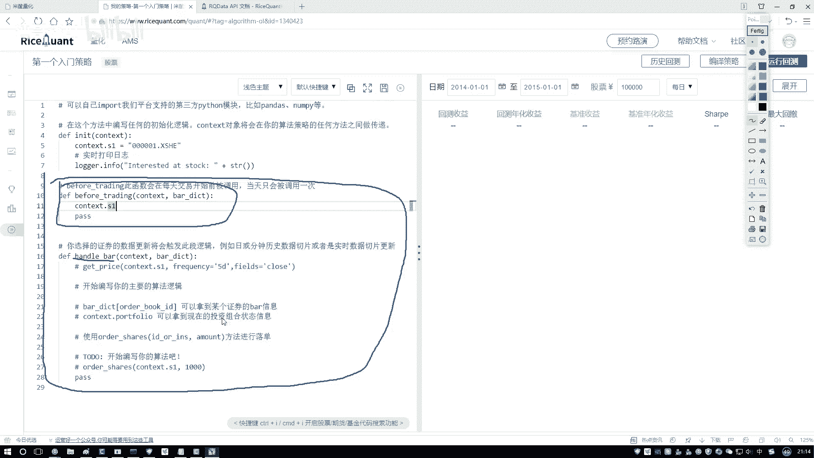
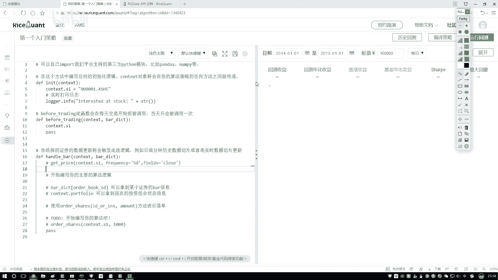
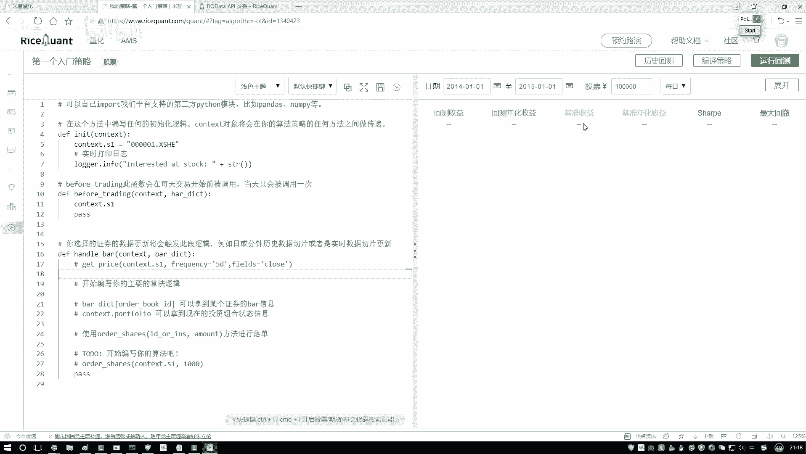

# 【2024版金融量化】AI结合金融如何做落地项目？迪哥手把手教你3天从入门到项目实战，学完即可做项目，少走99%的弯路，学量化交易看这套！人工智能／计算机视觉 - P22：3-Ricequant交易平台简介 - 迪哥谈AI - BV1NW421R7d7

这里啊咱们先给大家演示一下，就是这个电话平台啊，它的一个使用方法。首先呢咱们点一下就是电话平台。然后进去之后啊，有一个免费使用。我们来点一下，在这个免费使用当中啊，就是进去之后它会有一些策略。

相当于啊呃就是这个平台人家已经给你写好的一些简单的一个demo，方便你啊自己来去熟悉一下，就是这些策略，哎，大概是怎么去写。然后呢这样这里有一个哎这个名字啊不是我来起的，就是它默认会带的。

咱们点进来看一下，这里有一个第一个入门策略。

点开之后啊，它这个东西哎给大家感觉好像是像是那个note book是吧？在这里我们可以写一些python的代码，但是呢它是有一点要求的啊，我们所有的操作你看这一块。😊，给大家列出来什么？

首先我们可以看到这里啊，咱们有三个函数是吧？第一个，然后还有这个第二个，还有第三个这三个函数啊，不是我该写的，是默认都会要去用的啊。不是我指定的是这个平台，人家要求你啊，就是所有操作，你都需要围绕着哎。

最少吧围绕着这三个函数，咱们来一步一步去实现的。我给大家先解释一下，就是这三个函数都什么意思。现在看一下第一个函数这样啊，第一函数它是一个init函数。它的意思啊就是做一个初始化。哎。

那咱们写那个python的时候，哎，我们python里边是不是有一个类啊，在类当中我可以定义一个构造函数吧，构造函数当中啊一般都是这样。哎，你传建一些参数。然后我对这些参数哎就是。做一些复值操作呀。

然后做一些其他基本的操作。哎，这个inning的函数就相当于啊在python当中啊，我们写的一个构造函数啊是一样的那咱们既然说它是一个构造函数，哎，那你说你想去在pyython里边哎实例画出来一个对象。

那是不是得先走一遍，它的一个构造函数啊，这里它是一样的。就是做的操作当中，哎，不管你下面写了多么复杂的操作，不管你写了什么东西，首先当你去执行的时候，inning的函数会先被调用啊。

在这里它是会最先被调用的。然后呢，被调用了，哎，那你说调用里边它还有一个参数什么意思啊？这个参数啊是这样，就是咱来观察一下，你看啊就是在我们三个函数当中都有哎有一些共同的参数吧。

都有contexs这个东西，那它是什么意思啊？他表示啊就是你要全局当中啊，哎经常比如说初始化当中，哎，我用到一些对象。然后呢接下来预处理的时候，我也要用到然后实际数值计算的时候。

我也要用到在这不同的方法当中啊，我要进行一个传递。哎，比如说初始化当中，哎，你说你在这个权益对象当中，哎做一些什么操作，或者说指定一些哎咱们股票的代码，然后获取一些股票数据是不是都行啊。好了。

都存入到当前我们的一个权局对象当中。然后呢接下来接下来预处理，那你说预处理的时候啊，我也想去处理一下啊。

咱们之前指定好的一些就是股票或者是一些股票的一些数据之类的那是不是之前咱们已经存到了我的一个全局变量当中啊。好了，这里我说再把它传进来。他们之间啊是可以进行相互的一个调用的啊，相当于这个函数哎。

不是这个函数，这个参数帮助我们啊来去调用啊一些算法策略做一个传递的一个工作。比如这里这样。你看这块我写了1个S一啊，等于什么什么什么一个代码是吧？然后接下来呢，我说哎呀在其他地方，那我也想用到。

那怎么办呢？比如说在预处理的时候哦，我说预处理的时候，我想用到，那我可以直接怎么样把cont。😊。

把当前这个context参数是不是直接拿过来，是不是就行了。你看这块有个点点儿的意思啊，就是说呃你自己哎给它指定好一个名字就行了。然后接下来呢，我们调用的时候也是一样，也是点。哎。

当前你指定好的一个名字，或者说指定好的一个变量就行了。context啊，它主要是帮我们做一个传递的啊。那这里咱们说完了哎我们的第一块第一块呢一个因点函数啊，相当于就是一开始的时候，哎，它会被先被执行的。

然后呢，我们再来往下去看。😊，这一块还有这样一个事儿，这一块就是下面两个是这样一件事儿。呃，这个初始化啊，它是一开始的时候被执行那么一次。然后呢，接下来接下来我现在框且这个东西，它不是会被执行一次。

是会被执行很多很多次。那什么例子呢？给大家举个例子吧，比如这样。我说现在在我蓝色这个框当中，哎一个印典函数当中，我说我先去啊选择了一个股票啊，就在这里我就什么都不干啊，就选了一个股票。

那选这个股票是不是就定下来了，以后我就不需要了吧。好了，这是阴典函数当中，我说我就选了一个股票。然后呢，接下来接下来就是这个红色框。那你说我的策略啊。😊，是不是得对这个股票当中啊做一些操作呀？

那咱们经常是不是说我也对股票每一天我都要知道它的一些收盘价，每一天我可能都要做一些判断。哎，是我是买呀还是卖呀还是怎么样了，是吧？所以说此时啊有这样一件事儿，你每一天重复的都要去做一件事。我们想到哪了？

写到这个红色的框当中，我现在红色框里边有两个函数。第一个函数，在训练之前怎么样会被哎，不是在我们的一个交易之前会被执行的，以及呢这个handlebar就是每一天都会去执行的，它是什么意思呢？

给我们感觉像是这样啊。

每一天数据来之后，哎，如果说你想对这个数据啊，就是在这个呃它实际，比如说做买卖之前，你想做一些处理的操作，你可以写到当前啊我们做这个 trading顶之前，比 trading顶之前啊，先来去执行一下啊。

相当于你就当做是数据预处理就好了然后接下来呢这里我们是不是实际要去判断一下我们的策略，或者说在这一块实际去写哎，咱们的策略以及基于策略我要下单，我要买什么东西，我要执行后续要操作吧。

所以这个相当于这样一件事啊，就是比说 trading顶啊，相当于就是你的预处理啊，但是预处理每一天都会去做的，注意点啊，我该一定强调了这个淡蓝色框里边的。

每一天都会去做handle bar里边演示一下handle bar里边相当于就是我们算法或者说我们的一个策略实际的一个逻辑啊，实际它具体的一些判断也好，然后操作也好，都是在handle当中啊，咱去执。

😊。

行的那行了，简单给大家先介绍了啊，有这么三个函数，大家简单这样就行啊。就是一开始咱们简单这样就行，后期给大家举例子啊，因定函数啊做数始化的，比如说垂顶啊做一些预处理的。

让后handle做实际我们的一个策略，哎，实际买卖的那刚才既然咱们提到一点啊，哎，好像你说每天呢你都要去做这样一个操作。那每天这个事儿怎么体现出来啊，你看右边。😊，右外当中啊，这个也非常重要。

你需要选择啊就是咱们的几个参数。这几个参数呃，不是这右边我现在框眼这个东西，它不是你的一个结果，是需要你自己去选的。你既然哎或者说咱们既然要干什么，做一个回测吧，就是看看我们策略在历史数据当中怎么样。

你是不是得把这个股票啊，或者说你当前哎比如说我就指定的这个代码，这个股票你得把它的一些时间找出来，或者说把它的历史数据找出来啊，你要告诉我你回测的一个时间是从哪儿到哪儿吧。好了，这是一个起止日期。

后面呢是一个终止日期啊，从哪儿到哪这样一个时间段，然后他这里还有这样。这是什么？你看这块我写了一个呃10万10万这样一个事啊，就是你做这个策略啊，那你是不是一开始手里有钱啊，让你这个钱。

然后后来买卖买买卖怎么样了，做一些交易之后啊，反正每一天可能都做做完之后啊，大概过了几年，然后现在我要看我的一个回测收益率。哎，是不是要看这样一个指标啊。那这个就是我们的一个初始资金了，注意这一点。

这个是我们初始资金，你自己去写啊，具体你的一个实验当中，哎或者你的策略当中，你想准备的一个初始资金。然后呢第三个。😊，这一块还有一个每日和每分钟，每日啊就是说呃我每天啊做很多bar当中做一个处理。

然后呢，每分钟那就是每分钟执行这样一个操作，相当于啊就是我们啊每分钟去执行，还是每天去执行，这个都需要你自己啊来指定出来。咱们列个当中啊就按照每天啊来去做啊就行了。实际任务当中啊，你看你的需求吧。

但是它只有两种，哎，要么是一个每天，要么是一个每分钟啊，如果说你想指定一些其他的统计值。那这个代码当中啊就是所有哎跟panda相关的。你看这块他也说了，这个平I当中啊，你可以自己去导入啊。

导什么你像是你给自己导入吧，咱之前是不是讲了排怎么去做呀？那你导进来是不是也能做计算啊？而且就你看这块啊这个我们用人家的一个AP相当于用人家很多接口帮我们去做它的接口也是基去做的给你得到的一些返回值也是个或者是所以说就是人家啊。

或者是其他的像 learn之类的，都是能哎咱们结合在一起来一起去用的，不是说这里边你就只能用人家能去用别的相当于这里既能用咱们那常用的也能用人家，重点是他们之间会有这样一个结合。

这个大家先简单的说了一下，就是在咱们这个当中有三个非常重要的函数然后呢以及右边你需要指定好当前我们要用哪个参数然后才能去得到当前结果这些指标咱之前都说过了吧。就是一些基本的。😊。

我们的一个呃策略，还有风险的一些指标。

