# 技术指标消亡史：从独领风骚到泯然众人 ｜ 量化交易者如何看待技术指标，技术分析还能用吗？｜ 新手入坑指南，全网最细技术指标讲解 ｜ 附Python量化代码 - P1 - 量化投资邢不行啊 - BV1Zt421j7nG

不知道很早以前就开始炒股的朋友，是否还记得那时候的市场是什么样子的，在我的印象里，A股交易早期是以技术指标分析为主，题材炒作和打板为辅，一直到2010年后，价值投资才被更广泛的认可接受，量化投资。

更是在近几年才因为收益率和各种花边新闻，被大众所知，我自己刚接触股市的时候，也正是技术分析最为鼎盛的时期，甚至我自己刚开始做量化研究的时候，也是赋闲一些技术指标，那个时候无论是财经新闻。

券商报告还是民间炒股的老师，讲的最多的也是技术指标，甚至还衍生出了无数不同的流派。

什么K线派和波浪派，形态派到指标派，军信派和道士派等，当年围攻光明顶的时候都没有这么多门派，然后呢，技术指标在A股流行了这么多年，一直有一个问题是股民们津津乐道的。

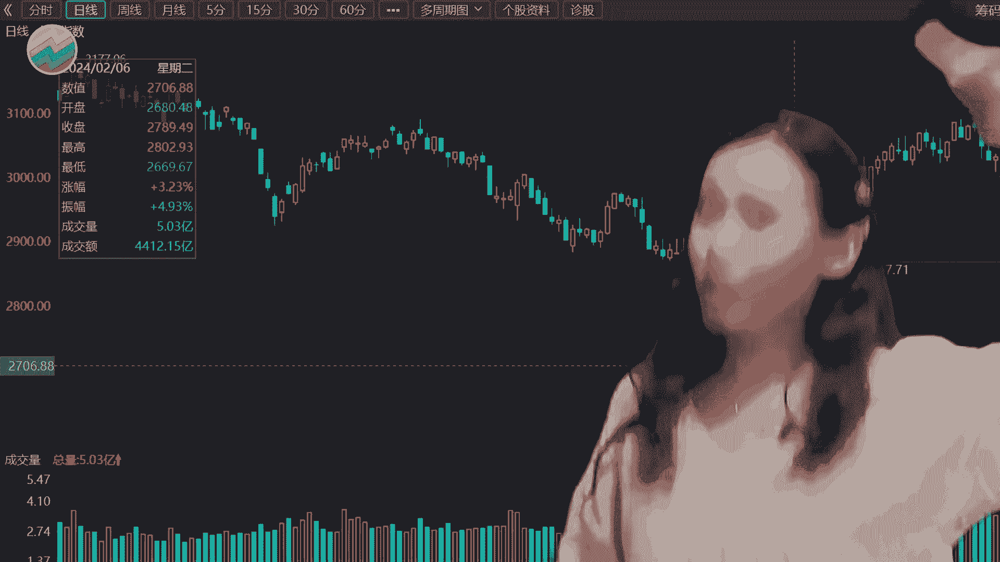

也是很多刚入市的小白很疑惑的，那就是技术指标在A股到底有没有用，应该怎么用，甚至毫不夸张地说，如果你把这个问题问得或者雪球去发帖。

都是可以引发盖楼论战的，那么为了帮大家能够全面了解，市面上通用的技术指标到底有没有效果，我花了比较多的时间，肝出了一份超级详细的两个G的技术指标。

大礼包，里面包括了我自己整理归纳的100多，一个常见的技术指标，他们的计算公式和用法，以及用于测试这些技术指标是有效的，独家的代码，我们甚至还为不会写代码的朋友贴心准备了，怎么写代码的解释说明文档。

以及最最最重要的股票的历史交易数据，有了这些数据，你才能够去测试这些指标是否有效，感兴趣的可以加屏幕右下角或者置顶评论区，我的微信都是可以免费发给你的。

也希望领到用它测试的技术指标的朋友呢，可以到评论区留言，还愿这是真的花了很多的精力，如果本期视频对你有帮助的话，请务必记得关注和三连。

话不多说，我们开始今天的视频。

大家好，我是专注于量化投资的，行不行，既然要讲技术指标，那么我们自然要先了解技术指标的，一些基本概念，大家不要觉得我在水视频，一些新生代的投资者对此了解可能确实不多，经验丰富的老手们。

可以自行跳到视频的这一时间观看，而我们言归正传，股市中的技术指标有着丰富和复杂的历史，他们是技术分析的核心工具，用于预测市场的走势和决定买卖时机，技术指标主要基于股价和交易量等数据。

通过各种数学模型来预测市场动向，当然以上内容都是GBT帮我写的，说人话呢，其实就我们可以通过各种数学计算，得到技术指标，将它用于预测市场的走势和决定买卖时机，比如我们随便找几个常见的技术指标来看。

就能够发现它们构成的公式，还相对来说是比较复杂的，然而呢这些公式的分析啊，大抵逃不过使用了量价时空这四个字。

量呢指的就是成交量，代表了一个股票一段时间之内成交的金额，价呢就是最常见的这根K线的开高收低的价格，实指的是股票价格变化的时间周期，比如说是分钟日线，周线月线，年线等，空呢指的是价格波动的空间范围。

也就是我们常说的振幅。

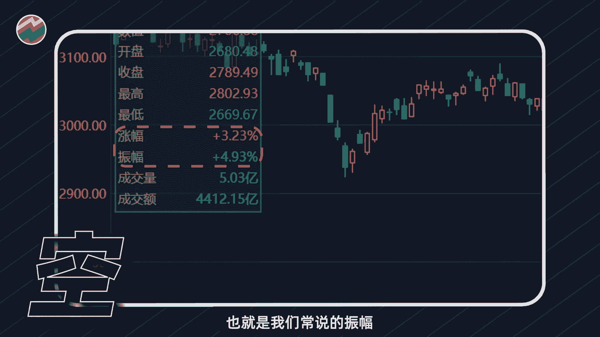

提到技术指标的历史啊，很多人认为是起源于欧美的资本市场，但实际上早在17世纪的时候，技术分析的雏形呢，首先是出现在日本，17世纪，日本曾出现过全国性的大米交易中心，大大小小的米商在此进行着。

大米的现货和期货的交易，掌握着全日本米家的命脉，然后在这些米商当中，有一个叫做本间宗久的大佬，实力最强，影响最大，他凭借自己对大米市场的深刻研究，积聚了巨大的财富。

据说曾经有连续100笔盈利交易的惊人记录，据他所说，他盈利的关键就在于，他在大米市场当中运用的技术分析，说实话，在那个年代交易中用上技术分析，也确实算得上是降维打击了吧，然后呢，本间宗久后。

用图表的形式将每个周期的米价都记录下来，并且进行相应的分析，最终形成的图是这样，由于每根K线长得很像蜡，又被称为蜡烛图，很多人细看一下就会发现，这不就是我们炒股行情软件上面，最常见的K线图吗，是的。

我们现在普遍使用的K线图，就是来源于日本米商使用的蜡烛图，感觉略有点魔幻，当然啊，尽管蜡烛图技术是起源于日本，但是呢直到20世纪80年代，一个叫史蒂夫尼森的人，写了本日本蜡烛图技术的书，通过书籍的大卖。

蜡烛图才被广为人知，这本书也是我们很多交易者的启蒙书籍之一啊，我看到现在为止还卖得非常好，特别是一些做技术分析的，毫不夸张的说，人手一本也不算过分吧，而在市场使用K线图之前呢，相比于日本啊。

欧美也有各种常用的价格分析方式。

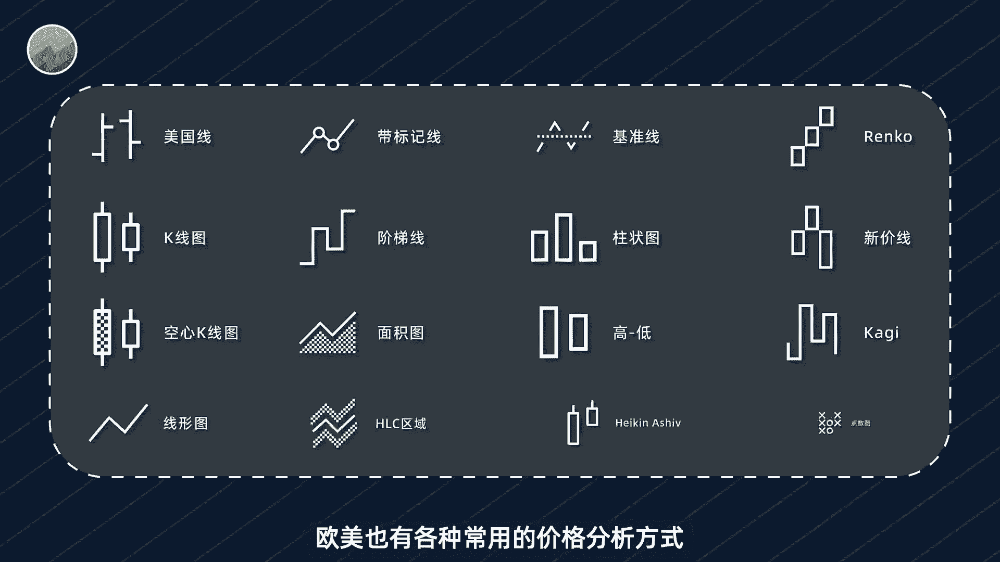

甚至很多方法，现在A股绝大部分的投资者都没有见过，但不管怎么样，时至今日，蜡烛图或者说K线图，已经成为全球金融市场上，不可或缺的分析工具之一，被用于股票，外汇商品等各种金融市场的技术分析当中。

至于K线图在中国又经历了一系列的奇幻漂流，至今已成数的分析流派，这里我就不详细讲，有课代表的话可以自己总结了，发表在评论区哈，除了日本蜡烛图外，技术分析另外一个绕不开的山头，道氏理论。

它是由查尔斯道在19世纪末首创，进入多代人的发扬光大，被称为所有现代市场技术分析的起源，比较有意思的是，查尔斯道还是道琼斯工业平均指数，和华尔街日报的共同创始人，道氏理论的主张。

市场行为有其固有的模式和趋势，这些原理后来也成为技术分析中，趋势跟踪和市场波动性研究的基础。

从此以后啊，技术分析就迎来了前所未有的辉煌，特别是在20世纪30年代以前，巴菲特的老师格雷厄姆，尚未将财务分析带入股市交易，当时的市场更多以投机而非投资为主，技术分析呢。

更是成为了交易者们判断行情的主流，大家熟知的利弗莫尔，江恩等为代表的人物也借此大放异彩，等到1952年，诺奖得主马科维茨首次将数学引入投资之后呢，又出现了更多基于更复杂的数学模型的，现代技术指标。

比如说MACD啊，KDJ啊之类的等等，这些指标，现在已经成为，大部分技术分析者的重要分析工具。

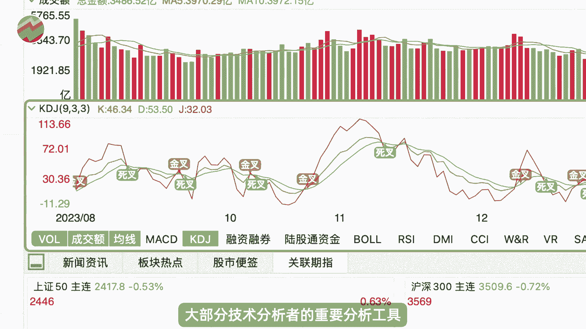

现如今，技术指标呢已经发展出很多不同的类型啊，大致可以分为大势型，超买超卖型，趋势型，能量型，成交量型，均线型，图表型，选股型，路径型，停损型等十大类型，比如说布林线呢就是趋势性的指标。

MACD呢就是均线型的指标，ISI指标呢就是超买超卖型的。

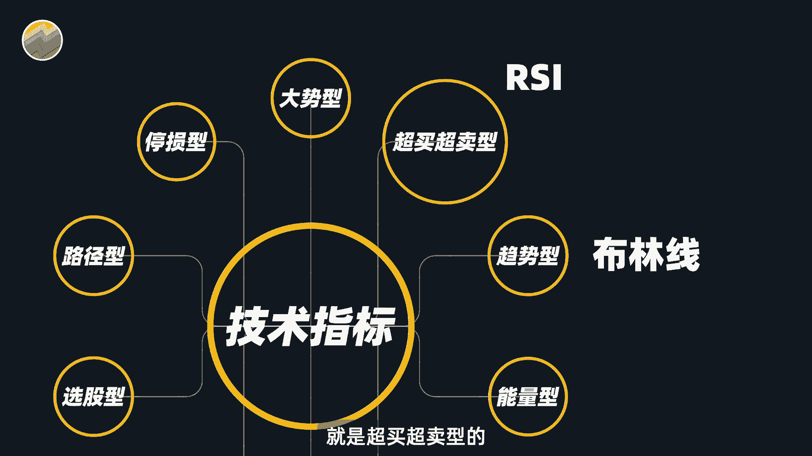

我这里给大家列举了一些常见的技术指标，具体介绍的我就不多加赘述了，感兴趣的可以暂停截图，我自己也做过一张表格，里面大概涵盖了100多种技术指标，并且写明了他们的计算公式和用法。

感兴趣的可以加屏幕右下角或者置顶评论区，我的微信都是可以直接发给你的。

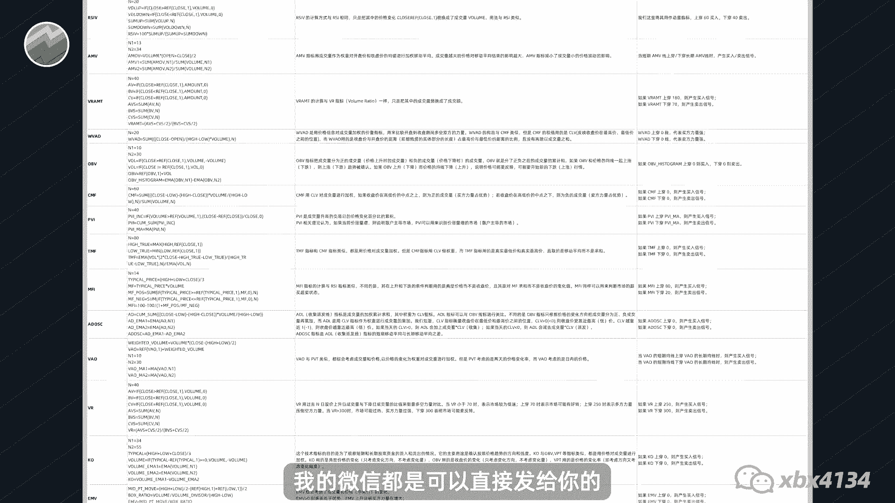

最后呢我想聊一下这些年纪技术指标的变化，特别是机器学习和人工智能的发展。

技术指标的应用和复杂性有了显著的提高。

然后正如我们前面说的，从只有技术分析到财务分析的加入，再到依托数学的量化投资，现在的二级市场明显进入了百家争鸣的状态。

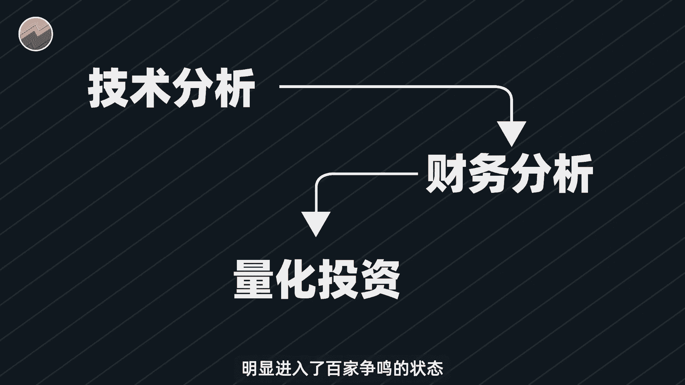

但很多人最早接触炒股时，从看K线，均线和各种技术指标开始入门的。

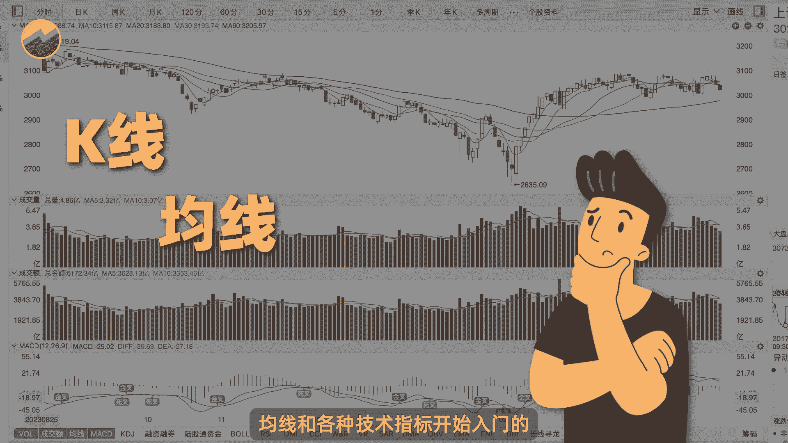

因为图表从来都是最直观的，当然技术指标到底有没有用。

好不好用，这就见仁见智了，近年以来相关的讨论呢，在网上也一直没有中断过。

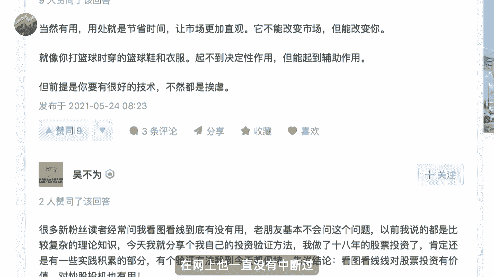

网上有很多炒股大师喜欢在各类行情图上划线，告诉你通过某某指标可以买到涨幅惊人的股票，并且成功率极高，说得神乎其神，让人有一种今日指标在手，明日财富自由的感觉，但学术界呢又好像不太认可技术指标。

对经济学有一定了解的同学，应该听闻过业内一个大名鼎鼎的专业名词，有效市场假说，有效市场假说的观点比较长，我就贴在视频当中，感兴趣的可以截图观看，翻译一下呢，其实就是他认为在完全有效的股票市场当中。

任何分析都是没有用的，比如说他认为，巴菲特一直以来这么多的超额收益，都是来自于运气，然后呢在此基础上，有效市场假说又可以分为三个不同的阶段，具体我也帮大家列出来了，感兴趣的可以看一下。

其中的第一个阶段就是弱势有效市场阶段，它里面明确说明了处于这个阶段的市场，各种技术分析就已经没有用了，无法通过此类手段获得超额收益。

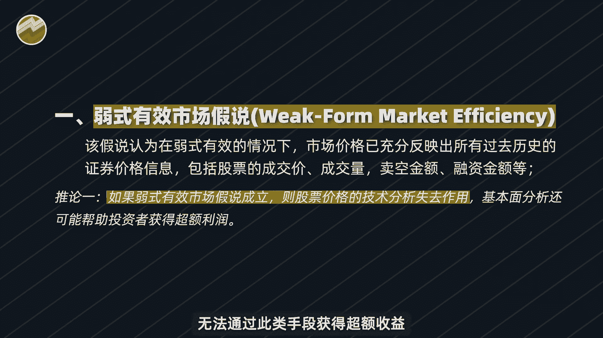

目前投资学术界的广泛地认为，现阶段的美股啊大概就处于这样的一个阶段，技术分析的损失去作用，无法在美股上面获得超额的收益，当然这只是说的是美股，毕竟人家是比较成熟的市场，那么在相对不成熟的A股市场。

技术指标到底有没有效果呢，这就需要我们自己去检验了。

考虑到很多人不会写代码，也没法自己测试，一些股评大师按图索骥选的案例呢，也迷惑性很强，并且不管是什么指标，听别人说的再多，效果好坏，也不如自己去亲自测试它的历史表现，看到结果来得直观。

我这边啊就花了很多时间，为大家做了一份全网最简单的技术指标，测试的大礼包。

即使是完全不懂学代码的新手小白，也可以通过这份资料实现技术指标的测试自由。

这份礼包里啊不仅有最常用的数据和代码，还归纳整理了100多种常见技术指标的计算公，式和具体用法，还有详细的说明文档，教大家如何用代码表达指标，你只需要根据我们说明去复线指标即可。

甚至你还可以尝试将自己的指标，或通达性的一些指标移植过来进行测试。

比如啊被很多人誉为技术指标之王，MACD指标他声名在外，一直也是众多股评家和炒股大师的心头好，很多股民心中的交易圣杯，那我们就可以借助大礼包中的工具去测试一番，MACD的计算公式。

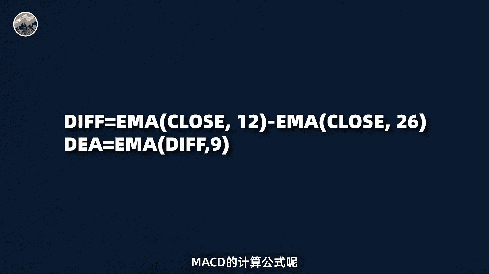

是这样的，我们按照这个说明，复制em的代码，稍作修改，即可以得到MACD中DIFF线和DA。

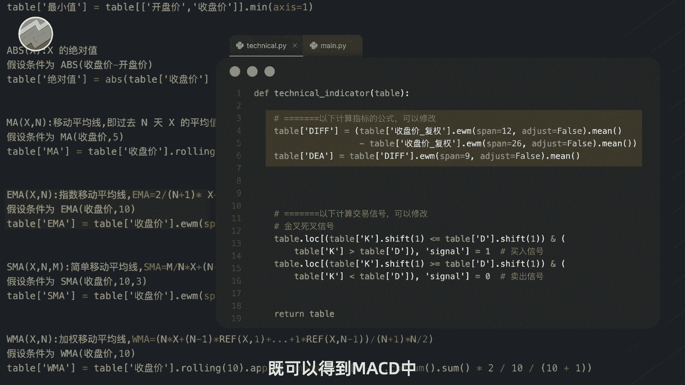

计算代码，一般用法中认为是DIFF线上穿DEA线，就为金叉，是绝佳的买入点，下穿DA线呢就是死叉。

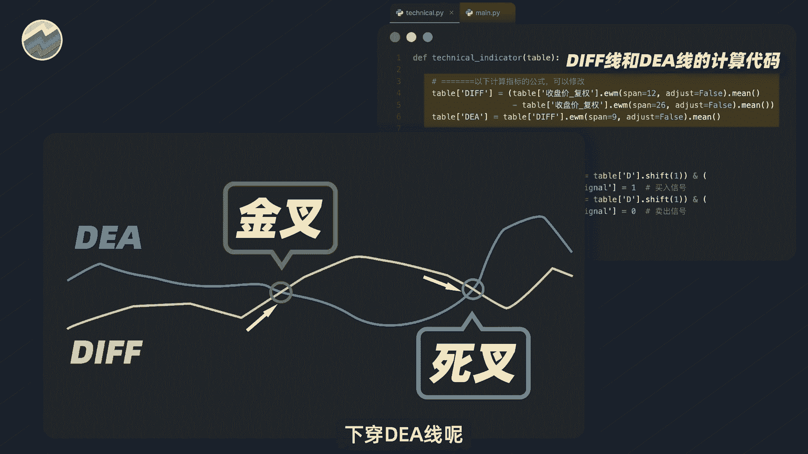

是很好的一个卖出信号，我们直接在已有的金叉复查代码中。

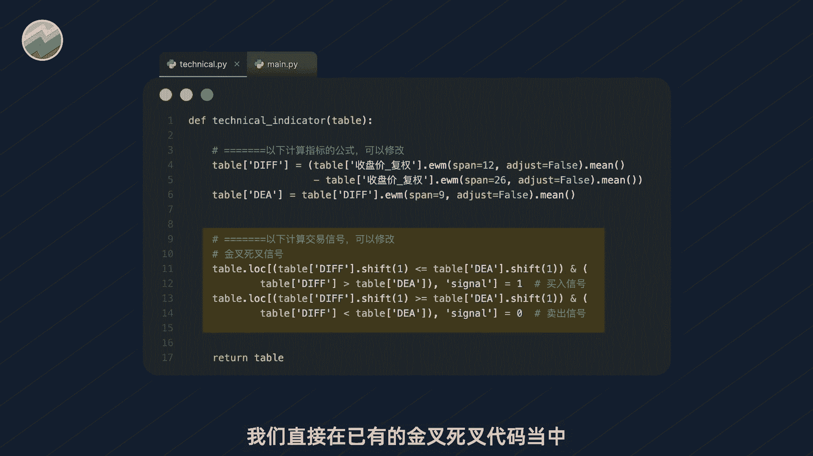

修改名称即可，完成后呢我们在这个main文件夹中点击运行，就可以得到相应的结果，运行结果如图所示，MACD死叉发生之后，股价涨跌幅小于零的概率基本小于50%，且收益中值基本都为正，和描述的完全相反。

金叉后。

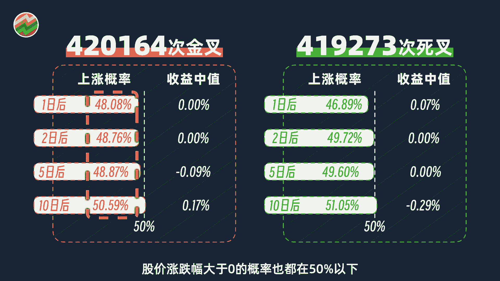

也都在50%以下，收益终止正负都有，但基本都较小，可以忽略不计，所以可以说从数据上表明了，MACD在A股个股上的效果其实很，甚至我又拿了我们的数据和代码照着编写说明。

连续测试了十几个比较热门的技术指标。

效果也是大差不差，都比较一般，比如说KDJISICCI等等等等，具体的就不一一公开处刑了，这个结果给人的感觉就是像技术指标，在A股个股上通通无效等等，我大A什么时候也成长为弱势有效市场了。

怎么我完全不知道呢，然后呢这里我也大概说下我对技术指标的看法，在大A的个股上面啊，其实绝大部分的技术指标都是五五开的，和抛硬币呢没有什么差别，当然对于部分有效的技术指标，我也没有迪士尼的意思。

如果你不认可我说的话，或者你有自己独有的技术指标的话，也可以问我要了相关的资料，自己去测试一下，我说的再多，都不如你自己拿的代码跑了试试看。

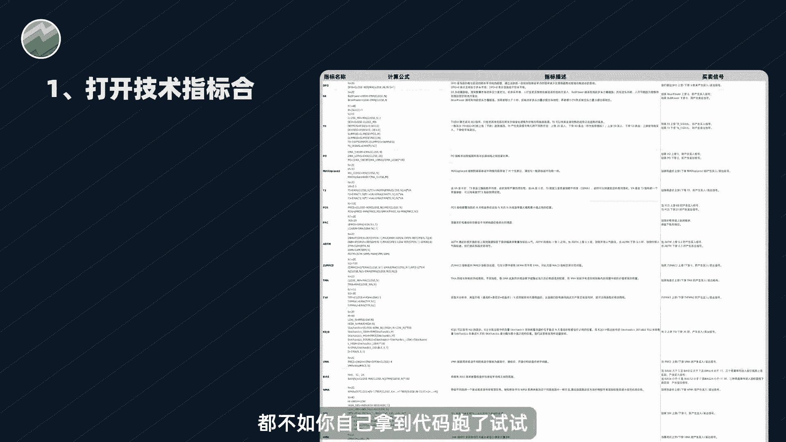

直观的数据比我直接告诉你结论更有意义，你也不用怕不会写代码就没法用它，即使是编程小白，拿到了我的大礼包，也能轻松地测试出自己的指标。

如果有人测出来了，也欢迎来评论区还愿哦。

最后透露一下，在我们自己量化实盘的策略当中，我们有时候确实也会使用一些技术指标，但是它绝不是我们策略的主要部分，而是我们通过其他思路选出股票后呢，有的时候可能会拿技术指标作为一个，短线的买卖点。

作为一个辅助。

也仅此而已，所以在我自己的量化策略当中啊，技术指标只是一个辅助，绝对不是C位，所以啊我也希望这个视频，叫醒那些还一直沉迷于用技术指标，炒个股的同学，因为相对来说啊，这个研究方向性价比较低。

当然我不否认啊，其实存在一些很独门秘诀的秩序指标，我有见过大佬靠着技术指标做到稳定盈利的，但是呢我还要说那句话，你想把它研究出来，性价比是非常低的，你可能要花很多很多的时间才可以。

但是同样多的时间你放到另外的方像上面，就可能很快就能出成果。

所以啊没有必要钻这个技术指标的死胡同，说了这么多，我就再给大家透露一点点内容，我们前面说的都是技术指标，在个股上面的效果并不好。

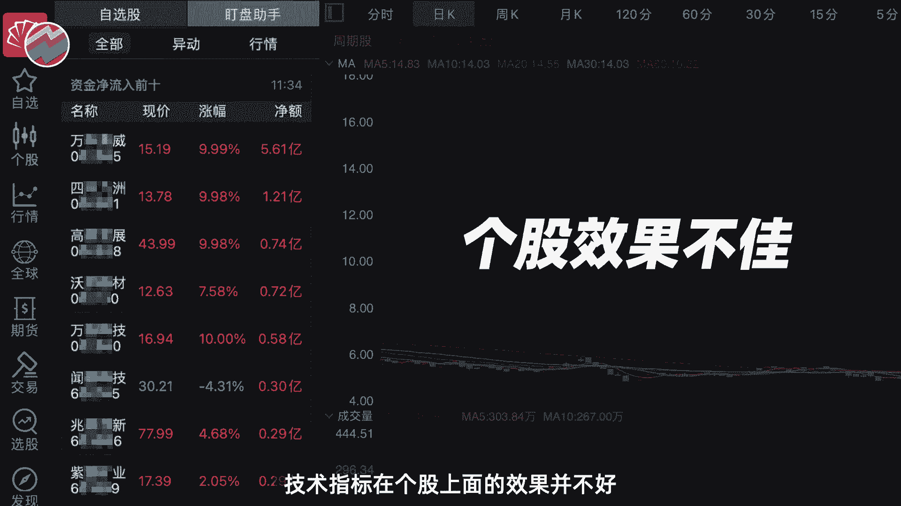

但是呢，如果你用这个技术指标，去针对大盘的指数进行增，比如说沪深300创业板指数呀，或者说一些行业的指数，你就会发现效果还是不错的，比如说最基础的KDJ金叉死叉的用法。

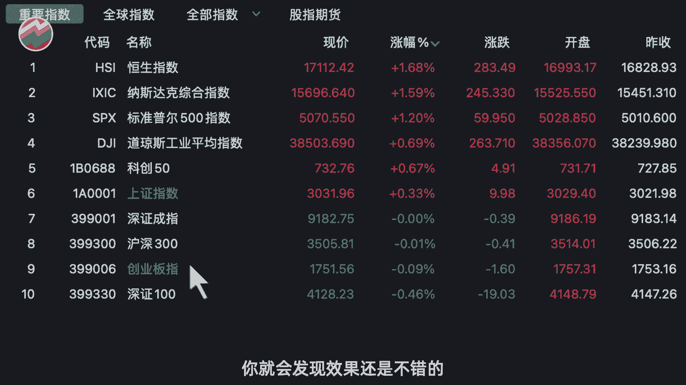

它在沪深蛋白指数上面至今出现过700多次。

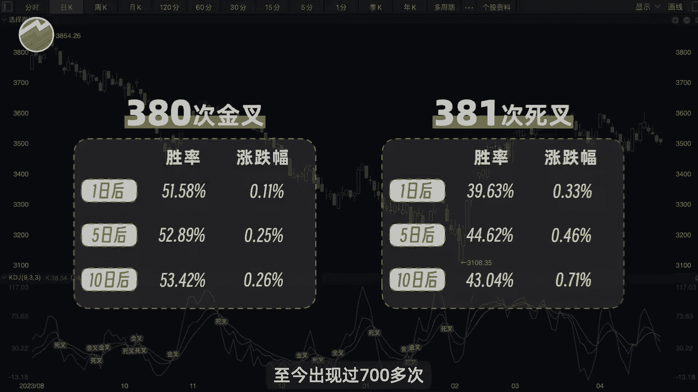

具体效果如图所示，至于效果的好坏，大家看了可以有自己的判断啊，我这边就不详细讲了。

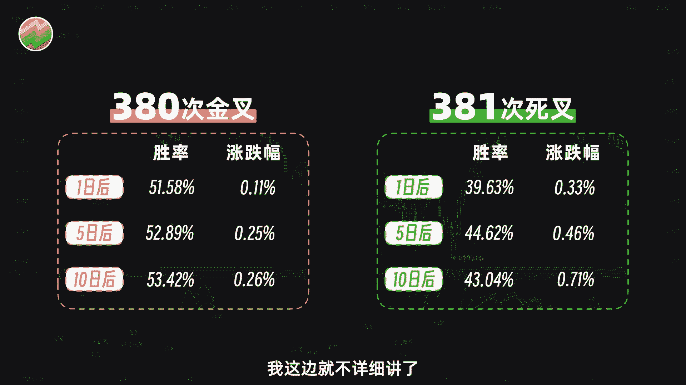

如果你也想要自己跑代码，测试指标在指数上面的效果，可以加屏幕右下角或者置顶评论区。

有的微信都是可以直接发给你的饭友啊，即使技术指标在A股的个股上面无效。

在其他更不成熟的市场是否有效呢，就像我经常说的那样，与其花时间提高牌技，我更愿意寻找对手更弱的牌局，这句话的意思就是，不要去高手扎堆的地方，要主动去找竞争对手更弱的环境，其实不光是做交易啊。

我们平时在工作生活当中，换一个对手更弱的牌局，也会让你更加轻松，这句话放在技术指标上面也是一样的，比如这是我们用最简单的均线指标，在某马赛克资产，又被称为大饼的资产上面测试，得到的数据效果好不好。

应该也很明了了，我们要用更科学的方式去投资，而不仅仅是你主观的去拍脑袋，根据一些似是而非的经验去做决策，归根到底一句话。

