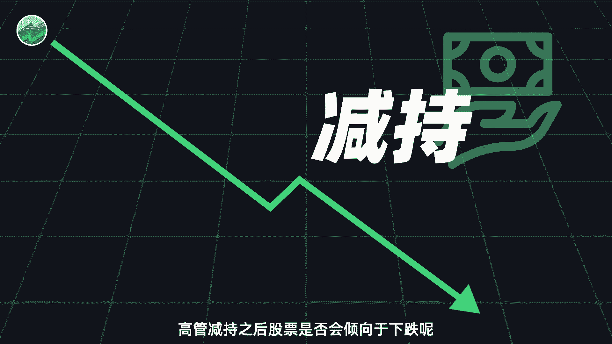
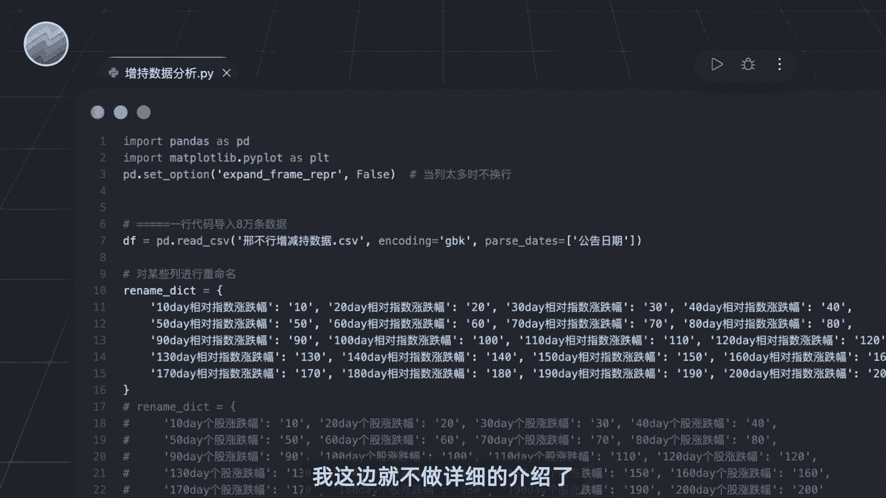
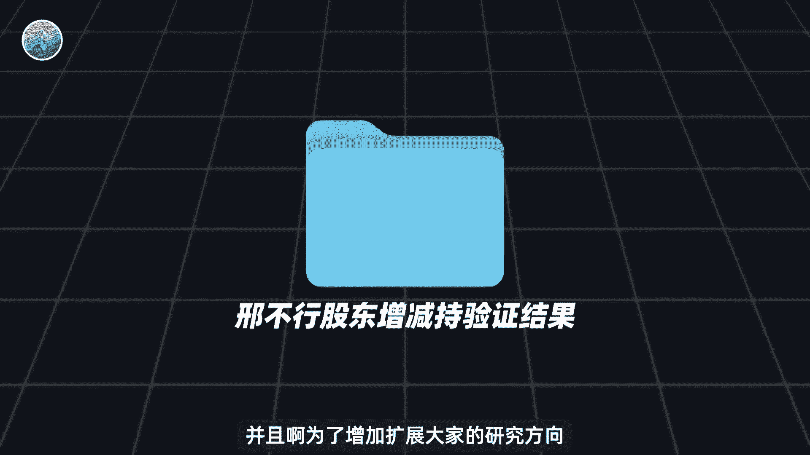
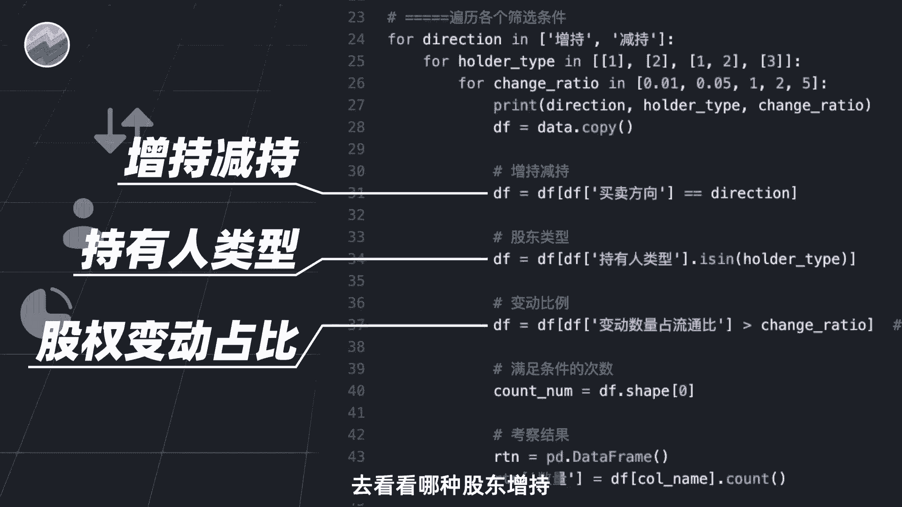
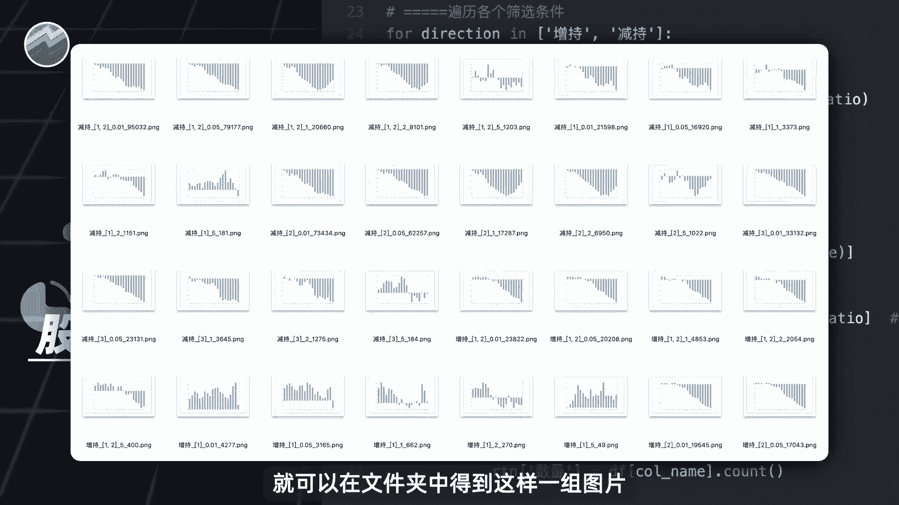
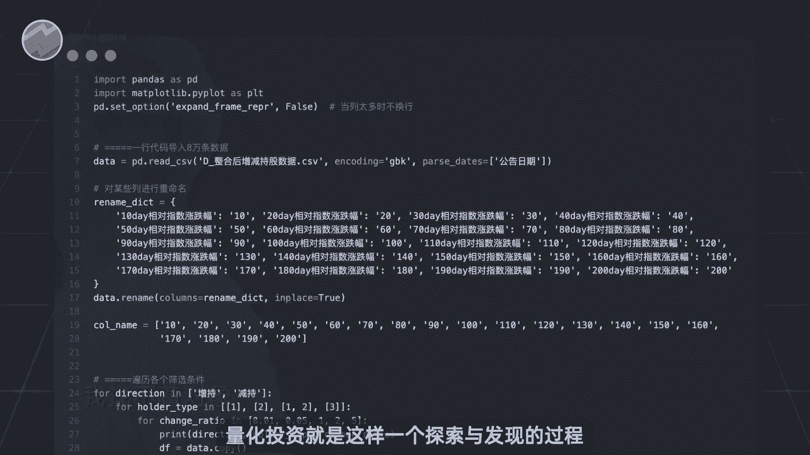
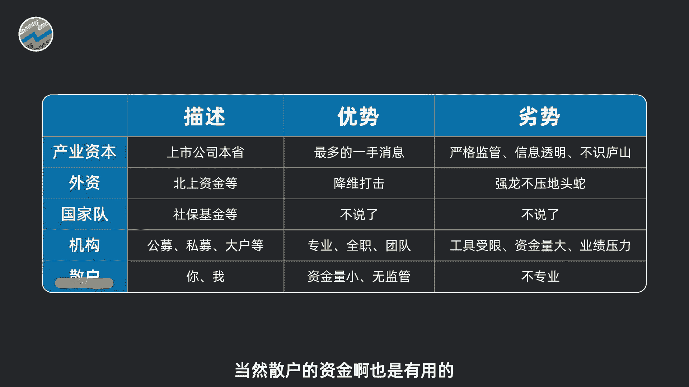

# 抄底逃顶高手？｜Python量化股东增减持数据【量化交易邢不行啊】 - P1 - 量化交易邢不行啊 - BV1tEeEeVERe

大家好。

我是专注于量化投资的，行不行，关注我科学投资，不盲目，高管增持是一个很好的买点，那么高管减呢又是否代表是一个很好的卖点呢，高管减持之后，股票是否会倾向于下跌呢。

那么想要知道这个答案，我们但只需要使用之前的代码，把条件改成减值即可，然后运行了就可以得到相应的结果，因为时间我这边就不做详细的介绍了。

我把相关的结果呢都输出成了图片，整理好后放到了这个文件夹当中，并且为了增加扩展大家的研究方向。

我还额外编写了一个程序，对增持减持，持有人类型股权变动占比，这些条件进行了一一组合，去看看哪种股东增持或减持了多少比例的股份。

未来股价会表现更好，只要你运行这个代码呢，就可以在文件夹中得到这样一组图片。

包含了所有条件组合的结果，我们也鼓励大家多试试不同条件的组合，去开发属于自己的量化策略，很多时候呢，量化投资就是这样一个探索与发现的过程。

如果你需要这个资料的话呢，大家可以在评论区留言，也都是可以直接发给大家的。

视频的最后呢，我们再提供一些新的思路供大家研究，比如说对于增减值数据可以分年份进行分析，考察不同年份的结果，考察在牛熊市的表现是否会有差异，还可以考虑增持人原先持股占比。

近期增持的次数实际迟到发公告之后的时间等，再比如啊，我们还可以看看市场整体增减值的资金金额，次数，这些都可以帮助我们针对大盘开发做择时策，强烈建议大家都可以去试一试。

从中呢其实可以发现一些很好的交易思路。

另外啊，增减持资金呢，主要是来自于公司的大股东和公司高管，他们所持有的资本呢，有一个专业名词叫做产业资本，一般包括以下几类，产业资本啊，之所以值得我们借鉴跟随，是因为产业资本最贴近行业本身。

了解很多其他人不了解的一手信息，产业资本之外，也还有机构外资，国家队，社保等其他资本，他们各自有各自的优势和劣势，例如机构资本呢相对来说更加专业，外资呢经验丰富，可以降维打击国家队就更不用说了。

当然散户的资金啊也是有用的。

不能正向跟随，还不能反过来买吗，对于这些资本呢，我们之前都做过相关的视频介绍。

感兴趣的呢可以去看一下，我是专注量化投资的，行不行，关注我科学投资。

