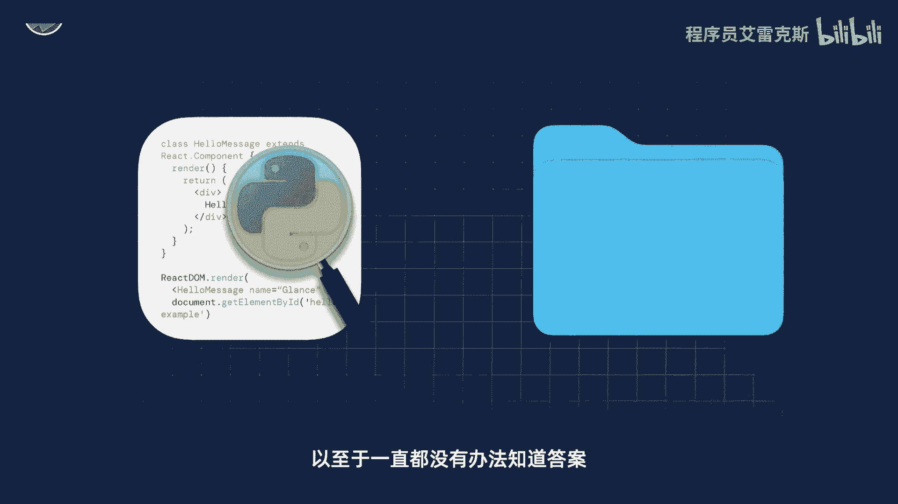
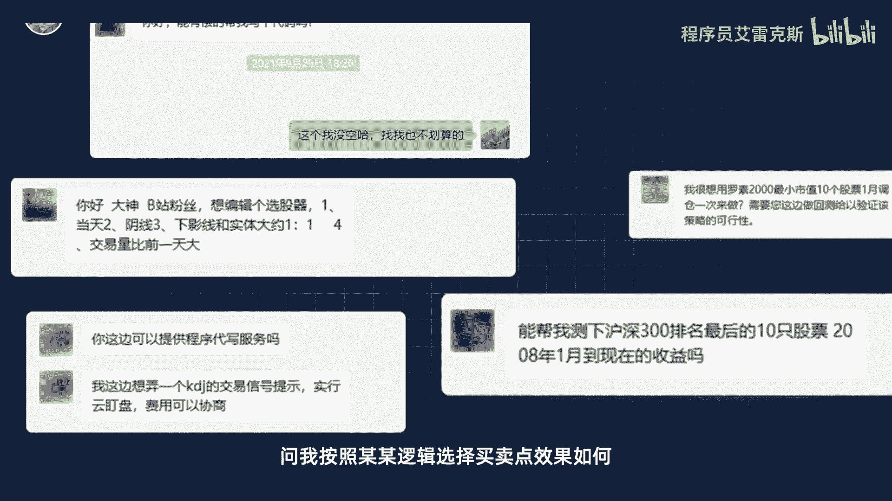
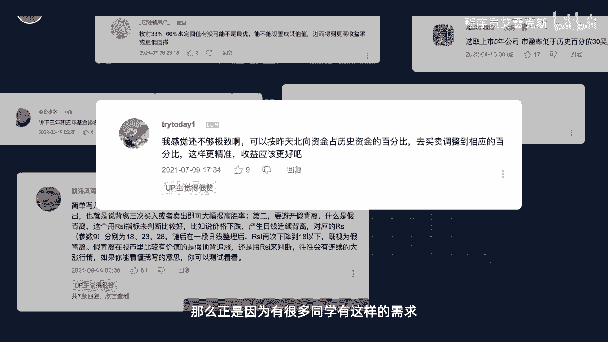

# 【Python金融量化投资分析与股票交易】14天拿下Python金融量化，股票分析、数据清洗，可视化Python金融量化投资分析与股票交易，附项目实战 - P1：前言 - 程序员艾雷克斯 - BV1d4U5YhETr

🎼另外投资最大的一个特点就是能用代码来实现你的投资逻辑和想法。然后在历史数据上面看看你的想法到底是好还是差。如果在历史上表现都很垃圾。那么这个策略我们就直接放弃，就不用浪费真钱和时间去做示范的测试了。

如果策略在历史上表现好呢，我们就会尝试去改进优化，然后投入实战使用。有历史数据的支撑，你赚钱的概率呢会高很多，但很多人会遇到这样的问题啊，他有一些策略和交易的想法，并想知道他们在历史回测的表现。

可是呢他苦于自己不会写代码或者找不到相关的数据，以至于一直都没有办法知道答案，所以既然会有人来问我相关的问题，问我按照某某逻辑学的买卖点效果如何，类似种种问题很多啊。

我们往期的视频评论区呢也会有很多同学基于我该期视频提供的策略思路，阐述他进一步衍生的策略想法，很多想法其实是很好的，并且很值得尝试，但是他们呢却无法自己实现。这个时候你就知道会编程的好处了。

那么正是因为有很多同学有这样的需求，所以我想着干脆做一期视频。

🎼你要点赞，你要投币。😡，🎼好宝点赞呢，投币刷下一个视频吧，你们B站以后刷不到我了，没关系，你要给别人投币啊，币啊。😡，🎼哎呀。🎼比奥，你每次都摆着我怎么活？比啊。🎼你这个兵占有我。Oh。あ。

