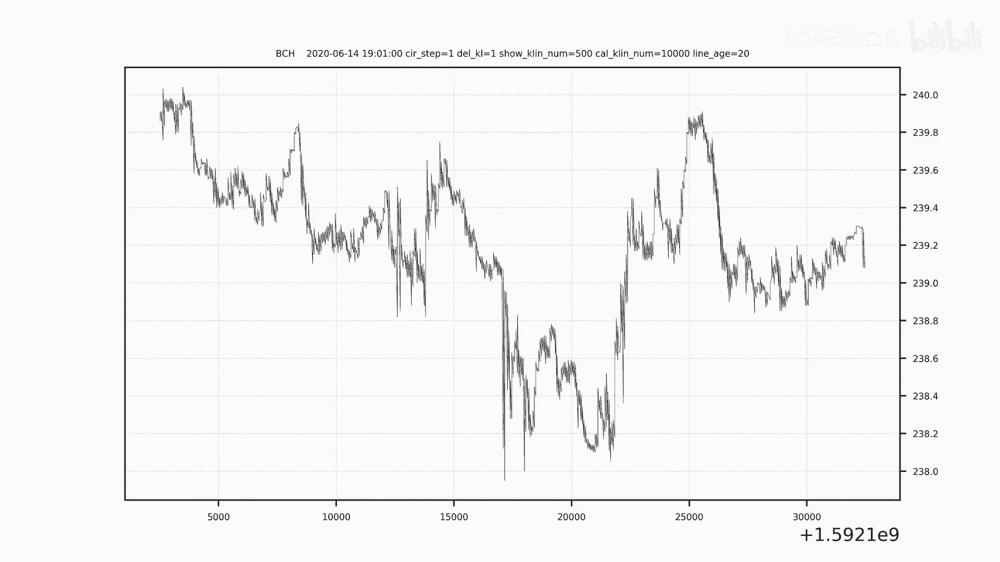
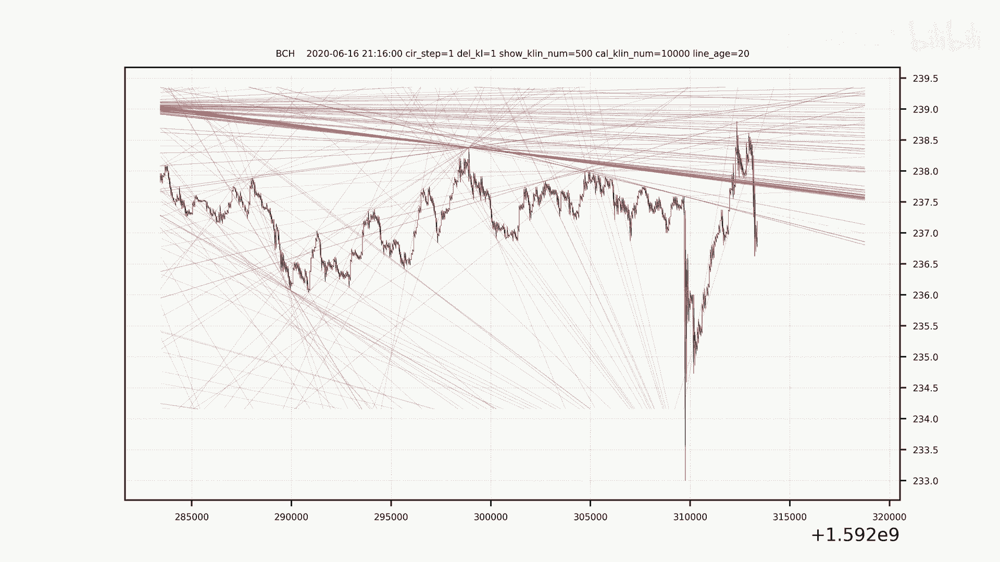
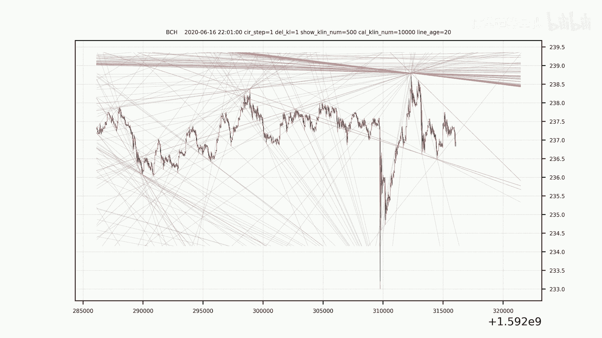
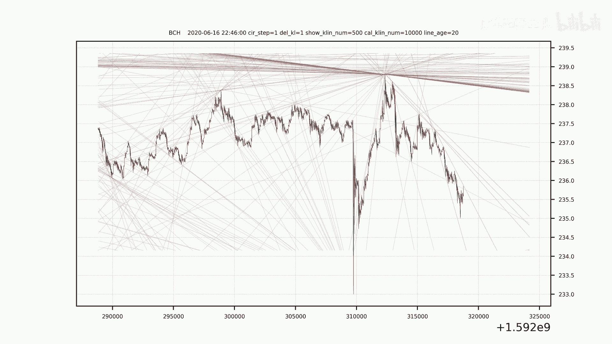

# 掌握市场走向：量化交易策略的科技驱动 - P1 - 体重趋势量化 - BV1kx4y1v7Bp

🎼。🎼。あ。🎼，🎼た。🎼，🎼一？🎼い？🎼あ。🎼，🎼，🎼。

🎼The。🎼，🎼，🎼。🎼，🎼，🎼，🎼，🎼。🎼，🎼，🎼，🎼，🎼The。🎼，🎼，🎼，🎼，🎼，🎼。🎼The。🎼，🎼。🎼。🎼叮嘟。🎼。🎼い？🎼The。🎼，🎼，🎼，🎼い。🎼，🎼，🎼。🎼。🎼，🎼，🎼，🎼。🎼。🎼。

🎼。🎼，🎼，🎼，🎼。🎼，🎼，🎼。🎼。🎼。🎼，🎼。🎼あ。🎼。🎼，🎼The。

🎼。

🎼き？🎼，🎼，🎼，🎼，🎼，🎼，🎼，🎼。🎼，🎼。🎼，🎼。