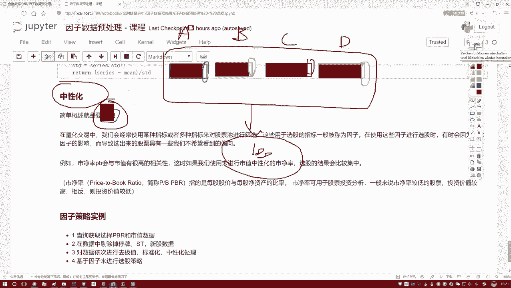
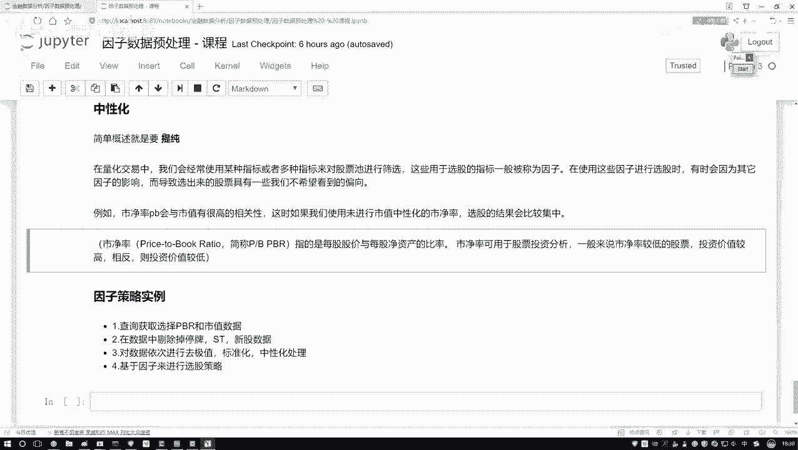

# B站强推！基于Python机器学习的金融分析量化交易实战居然被同济大佬老如此通俗易懂的讲解出来，三小时即可吃透！ - P33：6-中性化处理方法通俗解释 - 迪哥AI课堂 - BV1hZ421W7u8

接下来啊咱们来看最后一个知识点啊，叫做中性化，哎，现在大家解释一下这个中性化，他做了一件什么事，你看这里啊，我首先对它做了一个概述啊，我说它的目的就是一个提纯，那什么叫做一个提纯呢。

咱们先别看这些知识点，我先给大家举个例子，哎比如说现在我说我想去设计哎，有这么一个策略吧，然后呢我说啊在这个策略当中，那比如这个策略当中，我说有些因子，我说这个因子当中啊，诶有第一个因子。

然后呢还有这么第二个因子，然后我再画个黑色吧，然后第三个因子再来一个，再来一个黄色吧，哎就说我们现在有四个因子，然后好像说这样一件事啊，这四个因子啊，然后都会对我的结果产生影响。

然后呢我想去对比分析一下，哎比如说这里哎咱们就说了，有一个ABCD那么四个因子啊，把线拿过来，这是一个A因子，然后呢这是B因子，这是一个C因子，这是一个D因子，我说它们啊都会对结果产生影响。

我说A因子啊小的时候，然后B因子大的时候，C因子这个D因子那个时候对它们做一个筛选，然后呢好得到哎咱们哪些股票吧，这个说白了我们要在股票池当中选择一些股票，咱要去玩，或者说我要去买一些股票。

要通过一些指标来去观察吧，但可能有这样一件事儿，无论这个AABCD啊，哎我怎么去选，怎么去设计，我得到的股票呢，总是那几个哎，为什么会，比如说现在我说我做一次选股啊，选股之后。

那选了这些个里边有这么100只股票吧，然后呢我想我然后啊我做了一些判断和分析吧，我怎么选，每次哎我说这个策略在变的时候，每天在选的时候可能都是这100个，那大家可能会说哎呀。

这样咱们现在啊有这个AABCD啊，我们有四种因子，哎为什么咱总选到的都是一些相同的呢，那是不是说ABCE当中啊，可能有一些共同点啊，来我再画一画，可能这样一件事啊，我说在这个A当中啊。

你别看它是个蓝色蓝色，比如说A表示一个那个试镜率吧，好了，咱们说它是市净率，然后呢在这个A当中啊，可能绝大部分都是跟市值有关的，我现在拿这个呃，就是一个实就是一个实体的一个红色，表示的是一个市值。

那B这个特征呢，哎你看它虽然是另一个因子，但是它可能绝大多数当中啊，也都是跟事实有关的，C当中也是一样，D当中也是一样，诶给我感觉有这样一件事啊，你给我选出来的四个因子，但是呢这四个因子当中啊。

绝大多数的成分都是一样的，那既然你说他们绝大多数成分都是一样的，那我怎么玩儿，那相当于都是一个事吧，没法得到一个多样性吧，或者说这四个因子我没有把它自身的，或者说把它自身的一些数据吧。

或者把它自身一些指标体现出来，因为什么在它的内部当中啊，绝大部分哎都是一样的，你看A因子跟事实关系特别大，B因子C因子D因子都是跟市值关系特别大，那最终给我的感觉好像就是不管你用啥。

那都是市值决定最后的一个结果，那好像有这样一件事吧，那什么叫中性化呢，再来看这个我说的这个意思啊，你看这里我提出了什么叫提纯，那我问大家一件事啊，哎你瞅瞅，把它把它给盖，正好给盖上了。

调画笔这块咱们写了要做一个提纯吧，那你说啊在这个A因子当中纯的是哪儿啊，哪块是它所特有的呀，或者说现在我说哎呀，我想去找出来四个同学，那四个同学当中啊，我去观察他们。

你说我希望找的是他们的一些共有的特性，还是他们的一些个性啊，我希望是个性吧，把个性表现出来啊，都有的东西，那有什么价值啊，你有我有他也有诶，都知道个事，一个常识，你说对结果有什么影响吗，没影响吧。

所以此时我说在A当中，我要把它这个纯东西提出来，把它有价值的信息，B当中呢是不是也是一样啊，那C和这个D哎是不是方法都是一样的呀，说白了我们要做这样一件事啊，对于一些因子来说，把它独特的部分提出来。

把它有价值的部分提出来，这个叫做一个中性化啊，我先给大家就是直白的解释一下哎。

什么叫中性化，然后呢说完这个例子之后，咱们来看一看，说啊在这个量化交易当中啊，哎我们经常会使用一些指标或者多个指标吧，对股票池进行筛选啊，说白了我经常诶会做一些清仓操作，然后呢我去呃买一些不同的股票啊。

就是股票池，比如说固定十个，我今天买这几个，明天买那几个，我要做些筛选吧，然后呢我们筛选过程当中啊，有些指标我们就把这指标叫做因子了，所以说啊在我们使用这些因子选股过程当中，有时候会因为什么。

有时候会因为啊一些其他的影响，比如说刚才咱们四个因子，那都跟市值有关系，那是不是市值起绝大多数作用啊，从而导致啊咱们选出股票啊，有一些可能我们不想看到的一个倾向性，没准它都是一个哎都没什么变化。

是这样一件事啊，比如说刚才咱们看了我说啊这个市净率啊，这个值哎跟这个市值，那大家都知道肯定有很高的相关性吧，那如果说咱们不用不用什么，不用这个中性化的结果，那选股就会都比较集中了啊。

因为这里边绝大多数都跟事实相关的，没体现出来一些差异吧，啊有这样一件事，然后呢哎咱们说这个市净率啊，因为一会儿我们也是拿这个市净率，然后跟那个做这个策略啊，所以这块先给大家介绍一下这个市净率啊。

他就是说每股股价啊，每股股价它有一个价格，这咱咱知道吧，跟什么做一个比值啊，跟每股的一个净资产啊做比值诶，什么叫做净资产，就是它的一个总值减去它的一个债务啊，这叫做一个净的，是不是。

然后呢这个市净率啊它有个特点，一般情况下就是对于我们买股票来说，有什么特点，当咱们在买股的过程当中，哎我你说我们希望市盈率大点好的，还是小点好的，理论上情况下我们希望小点好的吧。

因为小点的啊它的一个涨幅空间可能更大，而它给我的一个就是我付出风险，他给我的一个回报的可能性会更高一点，相对来说啊就是指导投资哎，咱赚钱可能性会更高一点，这个意思先给大家就是概述了一下诶。

中性化是一件什么事儿，然后一会儿咱不在这个notebook当中去写代码，因为这里边我们需要一些因子啊，比如说现在我们得知道这个市净率吧，那比如说我还想知道哎这个市值，你得最少把这两个东西拿出来。

我才能去做中心化这个事吧，但是在我notebook当中啊，没有这两个值吧，你必须在平台当中哎，把用人API把数据把指标调出来吧，所以说啊一会在平台当中啊给大家进行演示，这里呢先这样。

我先给大家说我们计算方法。

一会儿呢在平安当中。