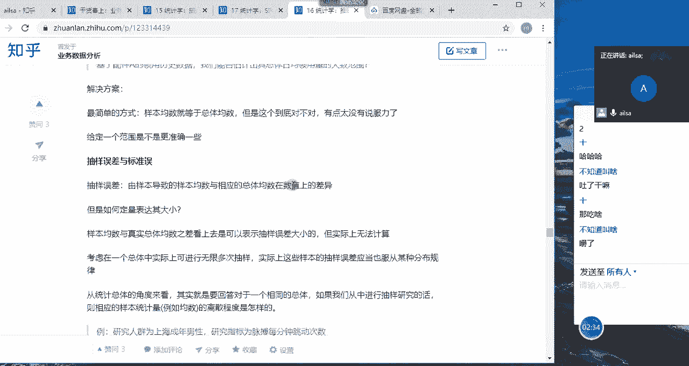
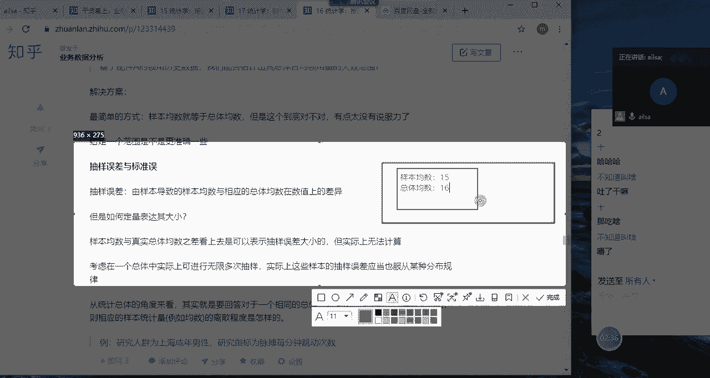
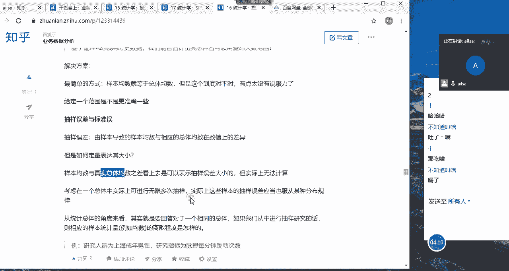
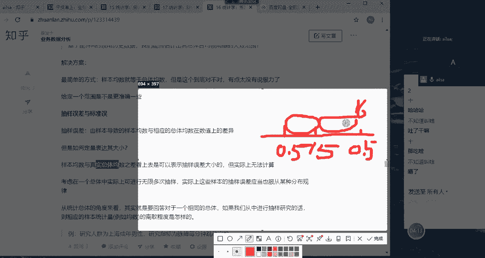
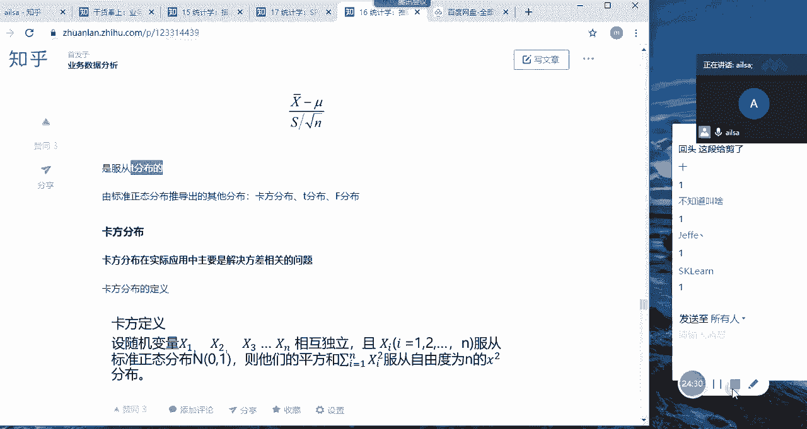

# 强推！这可能是B站最全的【Python金融量化+业务数据分析】系列课程了，保姆级教程，手把手教你学 - P87：07 抽样分布之中心极限定理 - python数字游侠 - BV1FFDDYCE2g

吃糖吗，嗯我们接下来讲推断统计啊，抽样啊，抽样分布当中的统计推断哈，你看我们先不说统计学上的啊，统计学上的知识，我们先说生活当中哈，我们都是根据我们所知道的信息，然后对我们的所看到的已知的世界。

然后进行某些判断，你比如说我们可以根据一个人的衣着，言谈和举止，然后去判断他到底是什么样的一个角色对吧，什么一个身份，然后我们看一个眼，看一个人的脸色，我们大概也能判断出来他的心情好坏。

然后以及他的身体状况等等，这些是吧，我们其实这个过程当中都是在推断，因为我们也有可能是错了，也有可能是对的，所以说那在我们的统计学当中呢，也要有推断，我们呃，它但是只不过它是需要依靠数据来得出一些呃。

我们猜测的一个结果嗯，那什么是统计推断，它就是呃得到关于现实世界的一个结论的，这个过程就叫统计推断啊，非常的官方哈，说了跟没说似的哈，其实我们就是说啊，通过样本数据对总体数据进行一个啊推测啊。

这样的一个过程啊，那呃那我们推测的一个指标和数据，都会有什么呢，均数中位数，标准差等等，这些都是可以进行统计推断的，你比如说你对样本的数据计算出来均值值，均值之后，你就可以推测唉。

总体的均值是不是大致也是这个呃，范围内的是吧，这就是一个统计推断的过程，那包括中位数，标准差等等，这些都可以进行统计推断，只是说目前啊比较成熟的，或者大家经常用到的还是最多的，是对于均值的推断啊。

也就是我们计算出来这个样本的均值之后，然后我们对总体进行一个推断，唉啊那我们看一下啊，那我们再进行整个的一个呃，推断的前提是要进行一个抽样的，对不对，那我们在抽样的过程当中，我们说过有一个标准误差哈。

比如说我们叫标准误，然后以及抽样误差，然后我们看一下，我们再回忆一下抽样误差就是由于样本啊，这就样本导致的样本均数啊，由于样本啊，因为我们是对样本进行一个计算，对不对，那是我们计算出来的。

样本的均数与总体的均数的差异，那我们刚才有讲过哈。

你比如说我们统计了一个数据的总体，但是我们没办法去统计所有的数据，所以我们摘取了一部分的样本，假设我们统计出来的样本均值啊，均数是均数是啊嗯15，然后总体的均数啊，总体的均数假设啊是16嗯。

那这个之间的一个误差差值16-15，是不是就是我们的抽样误差，我们称之为误差哈。

啊对他就是这样的一个结果啊，那我们既然知道有可能会存在差异，那这个差异的大小我们该怎么去衡量呢，其实很简单，对不对，就是我们的样本均数跟总体均数一减得出来的，不就是它的差异吗。

但是我们如果知道总体啊总体的均数的话，我们还要样本均数做什么，所以说我们因为我不知道啊，啊那我们既然不知道啊，不知道那个样本均数与总体均数之间的差值啊，那我们就需要啊，我们就需要再进行多次的一个实验。

然后把这个误差啊，然后我们去分析一下，它是不是存在某种分布规律，如果存在的话，我们就可以根据这个分布规律来去计算它的，整个的一个误差大小，也就是估算它这个误差的大小。

然后我们就可以这个样子的，你比如说还拿这张图而言哈，拿这张图而言，然后我们计算出来的这个值是我们的样本均数，15啊，现在我们通过某种概率分布，然后知道了它的误差范围大概是0。25啊，啊0。5啊的范围啊。

大概是0。5啊，那这个时候我们大致就能估算出来我们的总体，我们的总体的均数啊，大致应该是加减15，加减0。5，也就是说15。5或者是16啊，这样的一个范围，哎我们去估算出来之后。

这个数据相对来说就比较准确了，对不对，我们把我们的误差大小给他估算出来了，对不对，哎，那它其实如果说你这边假设你得分是16的话，那说明它跟总体这样的一个值。

还是比较接近的啊，这就是我们唉来啊，就是来衡量整个误差大小的一个呃一个方式啊，就是考虑一个总体，实际上可以进行无限多次的抽样啊，实际上这些样本的抽样误差，也服从某种分布规律啊，这样的一个情况。

唉那我们看一下啊，那我们看一下哈，从总体的角度来说啊，如果我们从中进行抽样研究的话，这对应的样本统计量，也就是均数的离散程度是怎么样子的，什么意思呢，啊是这个意思哈，是这个意思啊，我画个图。

我们新建一个，啊新建一个假设我第一次抽样哈，假设我第一次抽样啊，我计算出来的整个的一个呃误差大小哈，假设哈因为可能呃这样这样也是一个值哈，假设误差大小啊，好误差大小，这样是一个Y值啊，YX轴好，X轴啊。

Y轴啊，假设我第一次抽出来的一个误差啊，是0。1啊，0。1，然后最就是最大的误差是0。8啊，啊假设哈那位于中间的可能是零点啊，0。5啊啊这样的过程，然后它0。1出现多少次，0。5出现多少次，0。

8出现多少次，它这个大概可能也是符合正态分布的，那我们就可以根据这个概率分布的一个特征，来进行计算我们的误差，然后我们接着往下看哈，啊啊这边啊举的一个例子哈，举的一个例子说是啊。

比如说人研究人群是上海成年男性，研究指标为脉搏每分钟跳动的次数，假设随机在华东地区样本量为25，抽取的样本，并测量其脉搏，每个样本计算均数啊，样本的均数啊，呃呃就如果重复抽取1万次。

会得到1万次的样本均数对吧，哎我们进行1万次的抽样，那每次抽出25个，这样的话我们就会计算出来啊，1万次的一个样本均数，这样的一个结果值啊，显然样本均数存在随机差异啊，随机变异在大量重复的情况下。

可以证明，有一定的规律及样本均数的一个概率分布，OK那我们看一下，假设哎呀刚才这个讲的有点问题哈，这不是误差的一个概率哈，我们再重新挖，我们重新讲一下这个哈，重新讲一下这个啊，假设我进行了一次实验啊。

我进行了一次实验，然后计算脉搏跳动的次数啊，脉搏跳动的次数，如果说呃呃脉搏一般跳动哦，80次算差不多了对吧是吧，同志们，八十四应该是差不多吧，80~100都是正常的吧，70多好像也OK哈。

那我们就假设是80次好吧，那比如说我第一次啊抽取了25个样本，然后就是计算就是抽取了25个男性，然后嗯测量他的脉搏啊，测量他的脉搏呃，比如说有80的，81的，八十二八十三，然后整个是25个样本。

我计算出来一个均值啊，一个均值比如说是80啊，看第一次抽出来是80，然后我又进行了第二次的随机抽样，计算出来的均值哈，计算出来的均值是85啊，85，然后结果接我，我在进行第三次实验。

我计算出来的还是85，这是两次，只是一次，然后哎我又进行了第三次，比如说是90啊，然后它的均值是90，然后我们假设有十次啊，我们随机抽样当中有十次都是90，类似于这样的一个结果。

那我们就可以针对这个每一次抽样，所计算出来的样本的均数，然后每一个次数进行一个度量啊，进行一个度量进行一个度量对吧，唉大概能够发现说比如说这个是20次哈，大概能够发现位于中间这个位置的样本均数。

它的次数比较高，它大致也服从某一个分布的特征，类似于这样的一个结果，就是我们从抽样当中，计算出了一个样本的统计量，然后来去分析它的一个分布规律，OK同志们，这个听懂没有听懂，给我扣个一，同志们。

是卡了吗，OK哈，这什么情况延迟这么久吗，OK那我们在大量的重复的情况下，然后可以证明同有一定的规律啊，样本均数的一个概率分布，它服从什么样的概率分布呢，服从啊，服从正态分布，什么样的正态分布呢。

就是均值为缪啊，方差为西格玛平方除以N唉，这样的一个概率分布的特征哈，样本均数的一个抽样误差是随机的，也有可能相应的规律哈，那这个时候我们看一下，如果这是标准正态分布啊，或者是正态分布的话。

那就是缪西格玛平方这样的一个分布形态，那它的整个的一个样本均数服从的是比它，你看他是N分之西格玛平方，所以它比它更啊更尖一些，往里一些就是抽样啊，抽样的所得到的样本均数的一个分布特征，是这个样子。

是这个样子的哈，也是正态分布，只是它的均值为缪，方差为西格玛平方除以N，唉大家一定要记住这个啊这个东西哎，然后我们接下来呃，就分析一下中心极限定理是什么个意思哈，来中心极限定理就指的是设均值为缪C啊。

方差为西格玛平方的任意一个总体中，抽取样本量为N个样本，也就是我们抽N个样本，当N充分大时，也就是我们的样本量足够大，是样本均数，样本均数的抽样分布，什么叫样本均数的抽样分布。

就是我们进行了很多次的抽样，它的每一次抽样都会有一个均值，它这个均值的分布近似服从均值为缪，方差为西格玛平方除以N的正态分布，也就是我们刚才所说的，样本均数服从正态分布是方值二为啊，标准差。

均值为缪方差为西格玛平方除以N的啊分布，这就是我们的中心极限定理，嗯当它的就是当然了，这个N充分大时，我们可以定义为啊大于30啊，在统计学上就是有意义的啊，样本均数的抽样分布啊，什么叫抽样分布。

就是他抽了很多次啊，随机抽样了很多次，他每一次结果每一次都会有一个X的均值，它这个很多个X的均值，它服从均值为缪，方差为sigma平方除以N的正态分布，所以说它应该是啊，就是你随机抽样出来的结果。

然后它的分布特征啊，这个意思，这就是我们的中心极限定理啊，大家对于中心极限定理听明白了吗，同志们还能想得起来不，我们之前讲我们之前上学的时候的知识，Hello，感觉跟我是吃饭去了吗，同志们，嗯怎么回事。

反应这么迟钝，都不在别呀，你这个嗯，嗯这就是其实这是我们的中心极限定理，然后在这个过程当中，我们的西格玛平方哈，我们的整个的一个，它服从的这个西格玛平方除以N，就是我们的一个啊标准。

就是我们的一个方差嘛，大家想一下这个方差是什么概念呢，啊方差是什么概念，我们看一下哈，我们方差是什么概念，来啊我们方差就是说就是说你看这是一个X轴，这是一个Y轴，然后我这边对应的啊。

对应的是不是都是我的均值啊，对应的很多均值啊，对应均值，然后它服从的是啊，他服从的是均值为缪啊，然后方那个方差为西格玛平方除以N啊，这画了啊有点好，均值为缪啊，方差为西格玛平方啊，平方除以N啊。

这样的一个啊这样的一个离散程度，大家想一下这个离散程度其实就是每一次抽样，它的均值之间的差异，那这个差异是不是就是误差呢，对不对啊，假设哈嗯假设我们就假设啊，因为呃它中间这个地方肯定是出现次数最多的。

假设我们中间这个值，就是我们的总体特征的均值的话，那其他这些偏离的程度是不是就是误差，大家对于这个概念理解了，给我扣个一，就比如说假设我这个中间的呃总体的啊，总体的均值就是16啊，但是我第一次抽样呢。

我得到了15。1啊，那这个时候它跟均值之间的差异，那跟总体特征之间的差异，是不是就是它的误差呢，是抽样误差带来的数据不一样，就是我们的抽样误差的一个度量，那也就是说对于整体整个而言的话。

它整个的离散程度就代表是一个抽样误差，大小的衡量，对不对啊，如果听到这里没有问题，给我扣个一，同志们，别别别别啊，别放弃哈，能听懂一点是一点，我觉得应该应该讲明白这个东西了哈。

因为离散程度代表是距离中心点的偏离啊，偏离的大小它越偏离，这个代表离我们的中心点越远，那说明它误差就越大对吧，那我一减的话，是不是，就是不是，就在一定程度上代表了我这个误差的一个大小，是吧啊。

那我们再接着看，那既然它是它的一个方差，现在如果我想计算标准差的话，是不是直接加根号就可以了，那就把这个sim sigmm平方变成西格玛，然后这个N呢变成根号N就可以了，那这个我们就称之为标准物。

也就是说我们称之为它的样本，由于抽样误差所带来的样本均值，衡量的一个大小，我们叫样本均数的一个标准误差啊，大家记住一下，这是我们的标准误差啊，OK我们再往下走哈，影响抽样误差的两个因素，一个就是总体内。

各各个个体之间的一个变异程度，一个就是样本量N的一个大小，也就是哎我们这一个值，因为你看这个资料X的总体标准差，就指的是我们样本它的整个标准差的一个大小，如果它样本当中它们个体的差异性很大的话。

那就会造成它这个西格玛就很大，所以说那你整个的一个误差就会很大，其实很容易去理解我们怎么去理解，来我再给大家举一个例子，什么叫说我的样本啊，我的样本保存啊，我的样本数据之间的个体差异很大。

然后会造成我整个误差很大呢，你比如说你的一组数据当中啊，假设哈我们假设一组数据当中，你的值是123啊，四六啊，然后你从中随机抽取了三个值，比如说你抽取了二四啊五啊，然后你对它计算均值，现在我们计算均值。

OK现在大家动手去算哈，这个值应该都比较简单哈，我们如果计算均值的话，就是十一十一除以三等于多少，三四十二是吧，那大概是三点多哈，不到四，我们假设是四哈，我们假设是四啊，然后我们再计算一下123456。

它加起来的均值是多少，快点啊，快点告诉我答案，123456，它的均值是多少，同志们，123456它的均值是多少，嗯它3。5对吧，那我们的总体假设这一总体要举个例子哈，假设总体它的整个的一个标准啊。

均值是3。5对吧，那我最终抽样出来的啊，均值是四啊啊不到四，我们假设是四哈，因为3。9应该3。9多哈，3。9左右啊，那我们这个时候他们这类个误差，就是3。5-4，大概是0。5这样的一个误差对吧。

记住这是0。5的误差，现在我再给大家举一组数据，我们可以看到原始的样本数据当中，或总体数据当中，它们的差异性并不是特别大，对不对，OK接下来我们再来一个，再来一组，再来一组什么呢，再来一组数据是啊十啊。

二十三十四十啊，50，然后我们还是取235，二十三十五十啊，然后大家再计算它的整个的一个均值啊，哎我刚才取的是多少，我刚才取的是235，对不对啊，那现在是二十三十五十，加起来是100，100÷3啊。

嗯100÷3大概是33点多，是不是是吧，100÷3嗯，33。33啊，假设我们是33。33，那现在大家算一下啊，我们的总体的均值是多少，快一点，总体的均值，等于多少，32是吧，怎么是30呢。

我这边计算32啊，12345，那不是60+40，150是吗，哦sorry我算错了哈，150÷5是吧，OK那是30哎，来我们看一下嗯，那30跟33之间差多少啊，差3。33对吧啊，3。33，那刚才的一个啊。

那3。33跟刚才的0。5相比，是不是这个的误差会更大一些，那为什么呢，其实是因为它原来的啊，拉出来的样本数据之间的一个差异性比较大，哈哈差异性比较大，所以说它样本数据之间的差异性会比较大。

它就会在一定程度上去影响这个总体啊，所以你估计出来的值就会差异性大一些，大家明白这个道理没有，就是他这个数据原来的数据就比较离散，所以说你估计你估计出来的值呢，就会额差异性会大一些，如果都比较集中的话。

那他这个差异性就会小一些，OK这个道理听明白了，给我扣个一，嗯这个道理听明白了，给我扣个一哈，OK那也就是说，我们影响误差大小的原因主要有两个，一个就是我们的一个每个个体之间的变，什么叫变异程度。

就是它的差异性啊，差异程度差异越大，它变异性就更强，然后第二个就是样本量的大小啊，那如果样本量的越大啊越大，说明它整个的一个误差就会偏小一些，这个很正常，你的样本量样本量越大，然后你整个的一个跟一。

跟总体之间的数据就越接近嘛，对不对，这个可以理解哈，这就是我们的标准误差，但是我们都知道西格玛是针对于总体啊，总体特征，总体参数而言，但是实际当中我们都是用样本来实现的，所以我们样本的话啊。

我们使用的样本均数标准差就是我们的S啊，S作为我们的整个那个标准差的一个单位，所以是这么来写的，其实就是写法的不同，是样本的一个展示形式啊，OK啊啊我想一下哈，中心极限定理这一块我应该是讲明白了。

现在我们既然知道了它服从呃，就是方差为谬，然后啊标准差为啊，就这样的一个形式的话，我们就可以，我们就可以让它啊服从我们的标准正态分布，服从标准正态分布的话，我们的公式就是X啊，就是我们的均值啊。

每一个对应的均值减去它减去它的啊，减去它的总的这个均值，然后除以我们的西格玛，因为我们的西格玛这里面它是服从的，是西格玛平方除以N，所以说唉它的标准差的话，应该是西格玛除以根号下N这样的一个结果。

这就是我们的标准差，然后它这个东西啊，它这个东西就不服从正态分布了啊，他服从的是T分布，看到没有，他服从的是T分布啊，这样的一个结果啊，后面的话我们就会去讲什么是T分布，什么是卡方分布，什么是F分布啊。

