# 【比刷剧还爽！】Python量化交易+机器学习大数据全套教程，入门到精通 2024B站最好的量化交易课程！（数据挖掘分析／大数据／投资／金融／股票／算法） - P9：9.3-短均与长均计算实例 - AI课程搬运工 - BV1ps421T7ez

接下来啊咱们来做一个股票啊序列的一个分析策略。这个分析策略啊是让我们去计算一些指标，然后看一看我们什么时候该买，什么时候不该买。其实说白了就是一个比较常见的词儿啊，这个黄金交叉，还有一个死亡交叉。

那这里呢当我们要去计算啊这个黄金还有死亡的时候，我们是不是得有两个指标啊，啊，你得告诉我一个短期平均的走势，还有一个长期平均走势。然后我们看一看他们在哪儿出现了这样一个交叉吧。

那这里我们就得按照这个套路一步步去做啊。首先第一个啊这块这是我们第一个要去做的是一个短期平均，然后跌下来长期平均。最后画图给大家做一个展示就可以了。好，现在算这个短期吧，短期的话。

一般情况下就是5天比较常见吧，因为一般啊咱们的一个一周哎我这5个交易日，所以说一般咱拿5天来去算。但是啊这个数据。

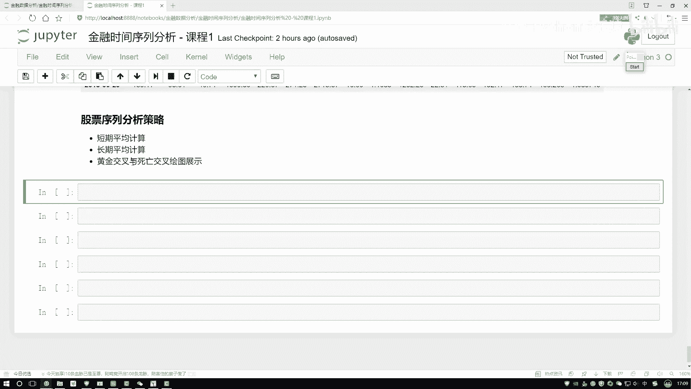

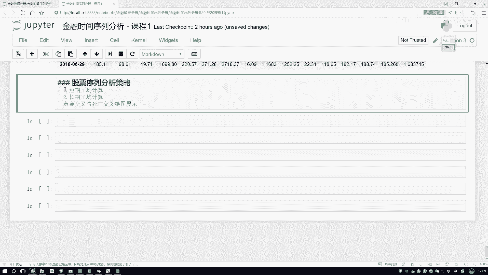

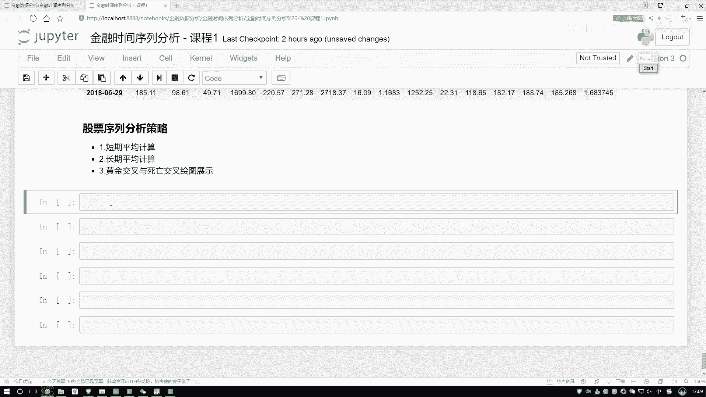

这个数据啊，你看它这个从这个10年到这个18年，这个时间有点太多了，是吧？所以说我们也可以相对的把这个短期和长期改的稍微的大一点。正常的短期可能5天时间比较常见。然后长期呢可能20天30天，哎。

这比较常见。比如说我们先写吧，先把这两个值给它计算出来，管了多少天呢？先算吧。呃，对我们data来说，我要指定某一个股价，算哪个看哪个股票呢？就看这个得了，就看咱刚才说的这个苹果股票得了。

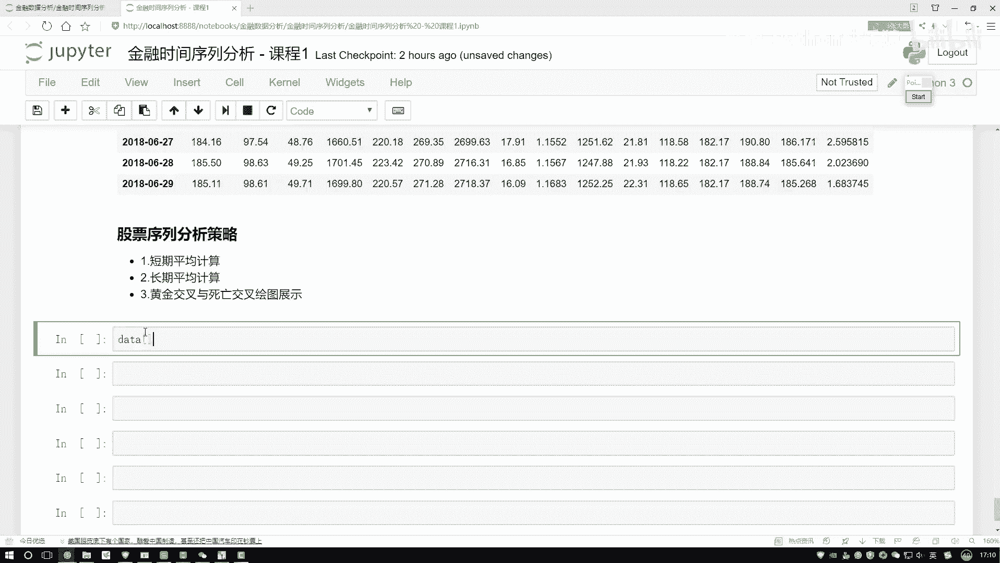

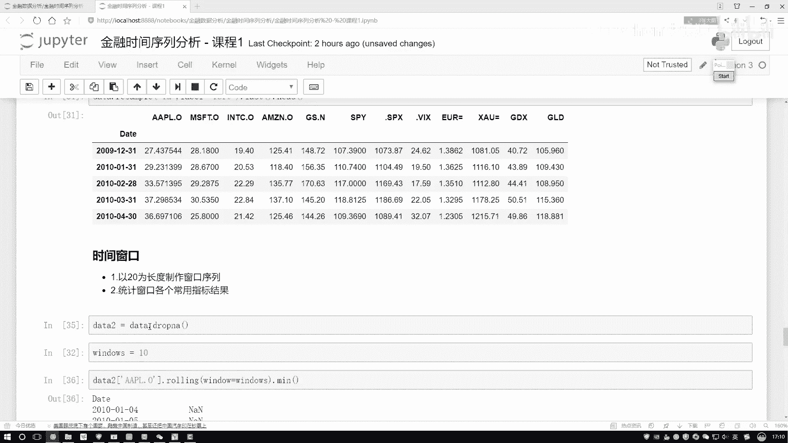

好啦，对于我们当前的这个苹果股票，然后呢，对于它做这样一件事儿，我们去算一个窗口是吧？算窗口它的一个均值。那我么算一个短期，短期当中啊，你自己指定一个windowwindow咱指定稍微小一点。

比如说呃就10天吧，就是一个10天做一个窗口。然后呢哦在这块我算了一个它的一个均值就可以了。这就是一个短期的平均很简单吧，以10天为一个窗口去算，哎，这10天的均值，然后把这均值拿到手。

传入到我的d frame当中指定一个名字哦，还没有指定名字。在这块，我得给他指定个名字啊，就叫做一个10天吧。得了啊，这就叫做一个时day。然后呢，我们再做第二个呃，比这个这个比较实在了。

叫做一个短期吧，叫做一个messd一。然后一会儿再做一个长期mesd2，然后再写一个M2吧。M2就是还是股票，但是我们窗口可能稍微大一点，咱指定成1个30吧。

然后还是算它的1个平均值给大家算完算完之后呢，然后呃把这个结果展示出来吧，这个股票当中。股票当中啊我看我要展示哪些指标啊，呃，我展示这个苹果就行了，就展示这三个吧，一个是苹果的一个哎。

这个多怎么多了一点东西啊，这个直接复制过来，一个是评委骨架。然后第二个就是咱们的1个M1啊，还有1个M2。还，这个是M1，然后再把这个M2给复制过来，把这三个指标显示出来就行了。

然后对于它我去呃点head一下。

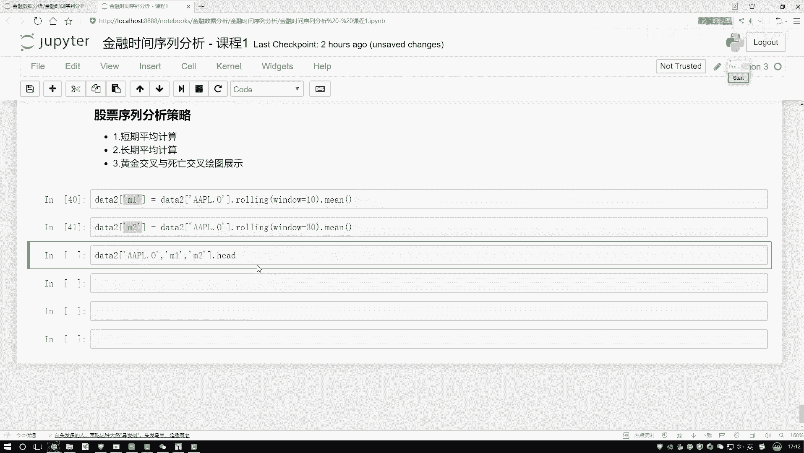

哦，这块我看出错误了，出。O error carry说明我传入的啊传入的有问题，少了一个中括号给它传进去。

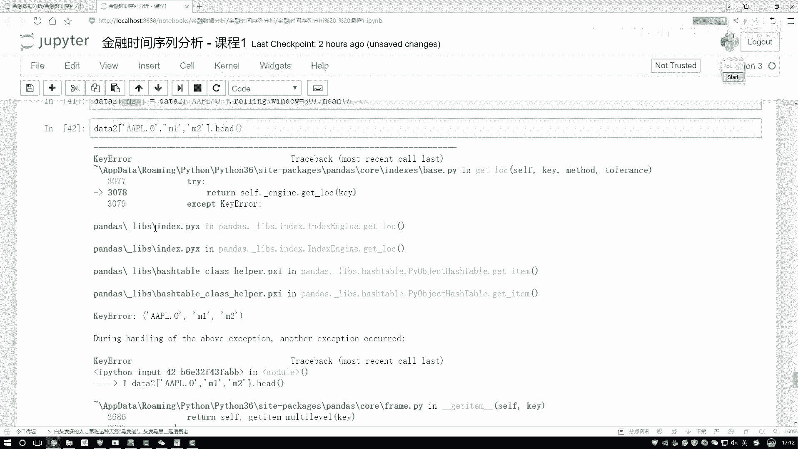

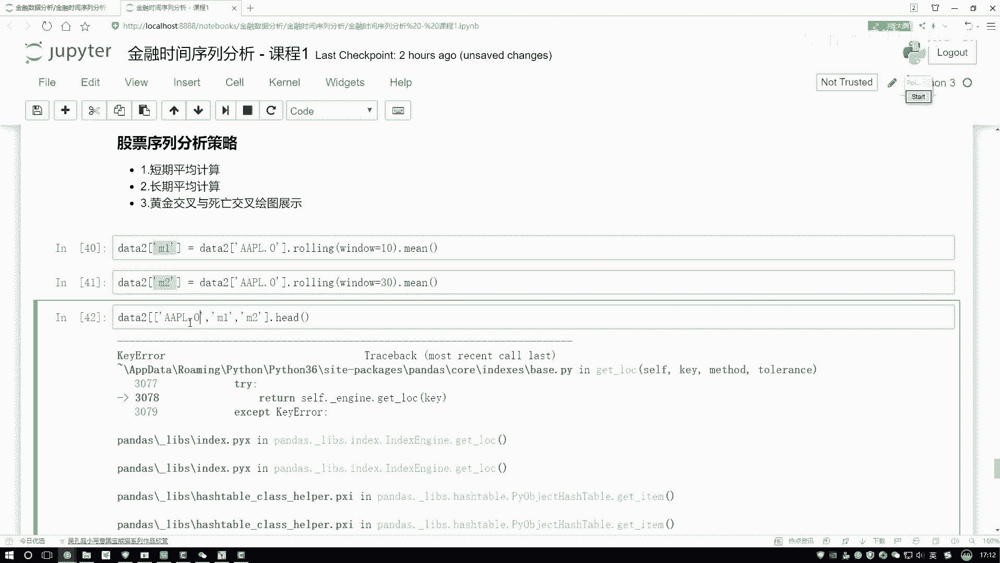

好，然后想hi一下哦，都是这样吧，害一下得了。行，这是咱们现在指定的三个指标。哎，我们当前苹果的一个股价。然后呢呃1个M1是一个短期的平均，然后M2它是一个长期的平均，这两个值，我是不是算完了。

那接下来那你是不是说呃在实际的数据当中，你可以把这个短期的平均和长期的平均，通过一种不是通一种啊，就在图当中画出来，我们不是要找那什么黄金交叉啊，还有死亡交叉嘛，所以咱画一画是不是就行了。

在我们的电脑当中，我这直接给以复制了。对于它。

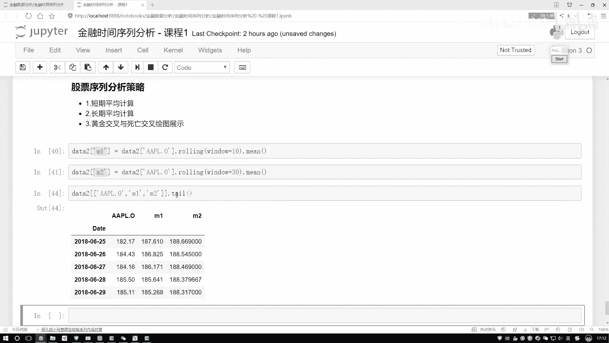

我去画一个那个折线图就行了吧，点一下，然后指定我这个图的一个大小，这就完事儿了。然后是一个6来展示一下。行了，哎呦，这个图看起来不是特别好看是吧？因为什么？因为咱们当前这个呃时间来说呀太长了。

然后时间要是单独选某一年还行，这样吧，就是我一定程度上把这个稍微的做一些变换吧。我说这就是30，然后得了，这是一年估计250吧，交易日吧，然后咱们这么来画吧，这是一个短期，这是一个长期。

要不然这一交叉太多了，咱们看不出来了。我把这个呃让它的幅度稍微大一点，这样式的取的就会比较少，画的可能会层次分明一点，再来执行一下。😊。

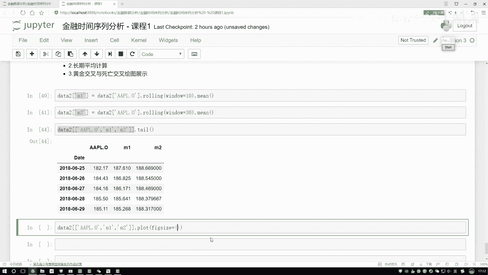

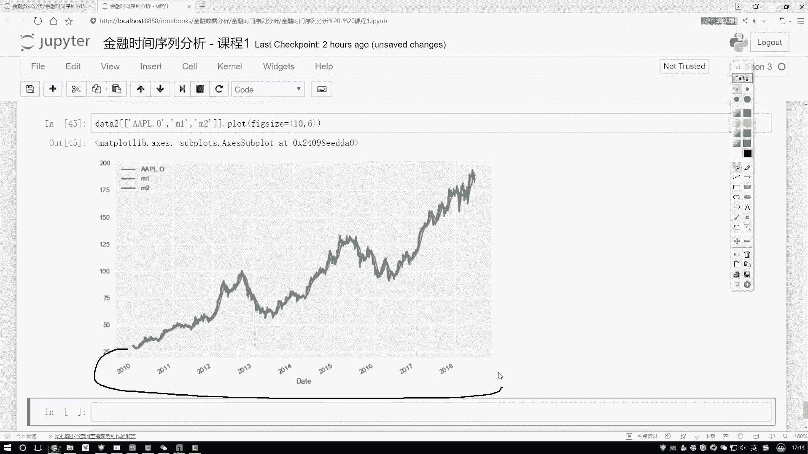

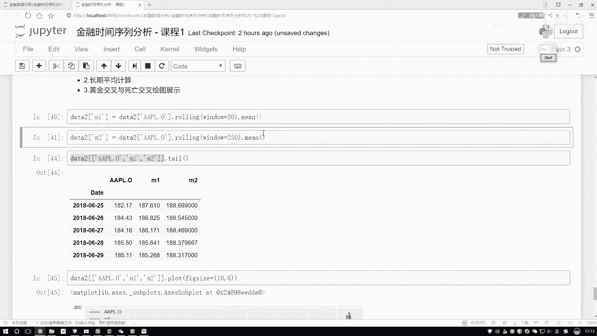

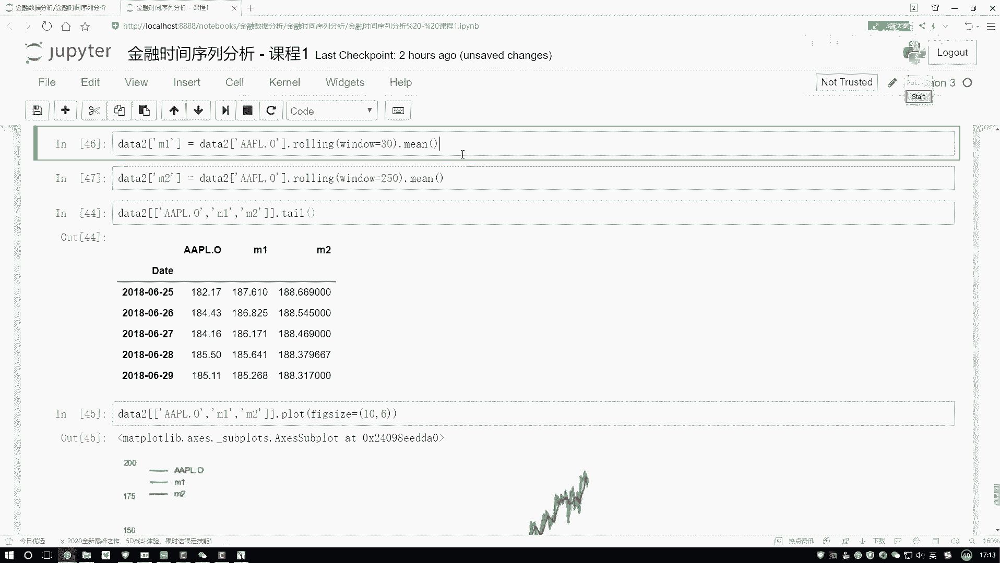

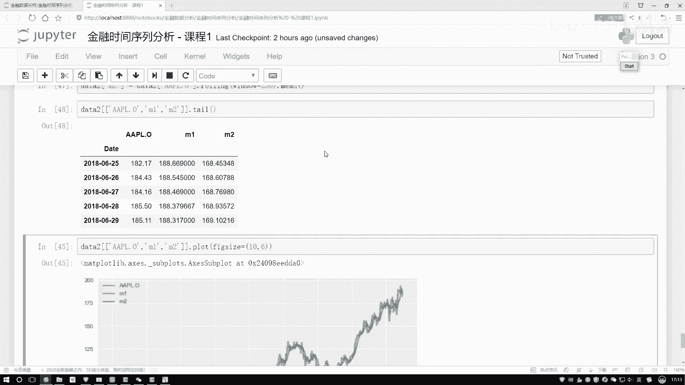

你看这回怎么样？这回更清晰了一点吧啊，咱们来看一下当前我的一个走势。然后这块有几个值啊，就是呃这个蓝色的是它这个拿红色笔，这个蓝色的是它的一个股价，然后绿色的是我们的一个短期。

然后红色的是我们的一个长期是吧？来观察几个值吧，先来找一找。咱们刚才说了几个点啊，就是一个死亡交叉，还有一个黄金交叉。死亡交叉呢就是说你要赔了。黄金交叉就是说你要赚了。咱们先来找啊，就是看第一个点。

出交叉完之后，那你看我们这个短期短期是绿色，短期怎么样，往下去都走了吧，穿越到哪了，穿越到长期的一个下面了。所以说这块你从这个走势来看，你说要怎么样了，要下跌了吧，所以说此时怎么样，不适合买啊。

赶紧把这个东西给它抛出去，别被套里边。然后呢，咱们再来看第二个再看第二走势，我看看这里。😊，再看这个走势，这个走势怎么样？短期这个绿色超越了我们长期这个红色，并接往上上升的吧。那此时说明什么？

这是一个黄金交叉，在这一块咱们就要赚了，可以去买了吧。啊，这一块给大家对比了一下，就是呃在我们的金融数据当中啊，就是股票数据当中有两个常见词啊，一个死亡交叉，还有一个黄金交叉，咱们该啊怎么样给它画出来。

其实说白了就是你自己哎去指定一个窗口，短期的一个窗口，可能咱这个指用太大了。因为这个数据它太太长了，正常你拿到近期的一些数据，你可以指定一个3天5天，那可能上海它是5天5天可能是比较常见的。

然后这块呢一个长期的那可能是20天，它是一个愿望，20天2020个交易日可能是比较常见的这个就是咱们的一个短期，还有一个长期的一个平均计算。注意点啊，这块我们写的什么值？😊。

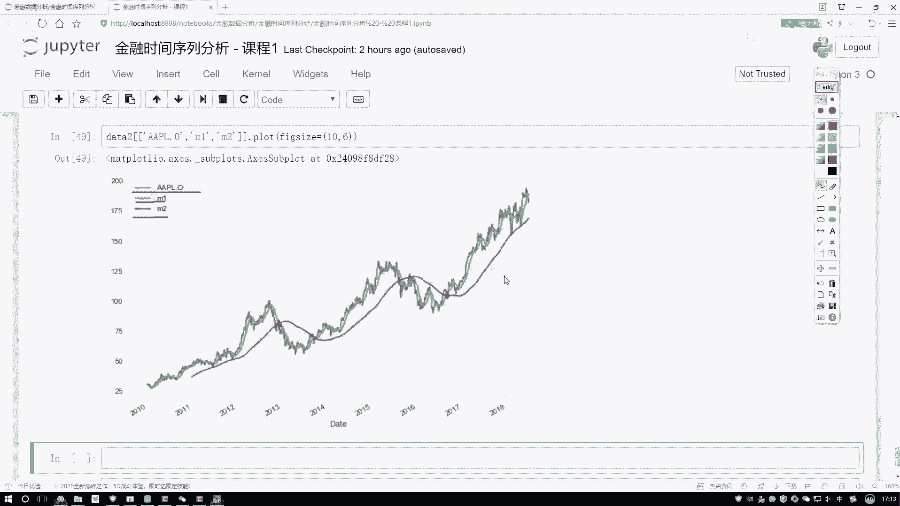

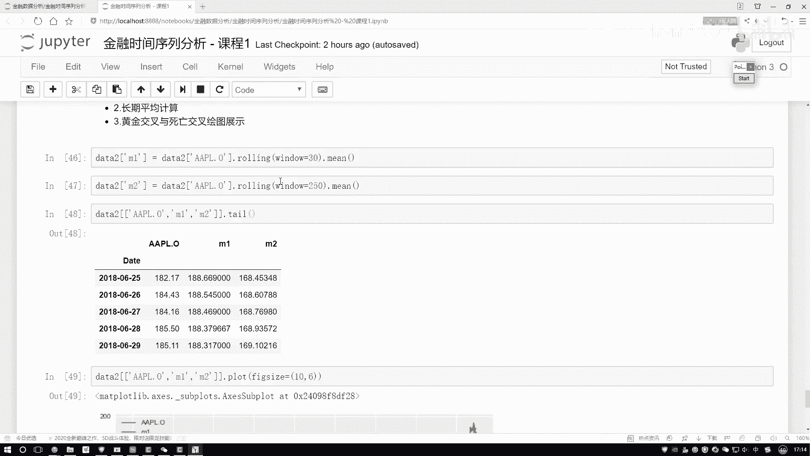

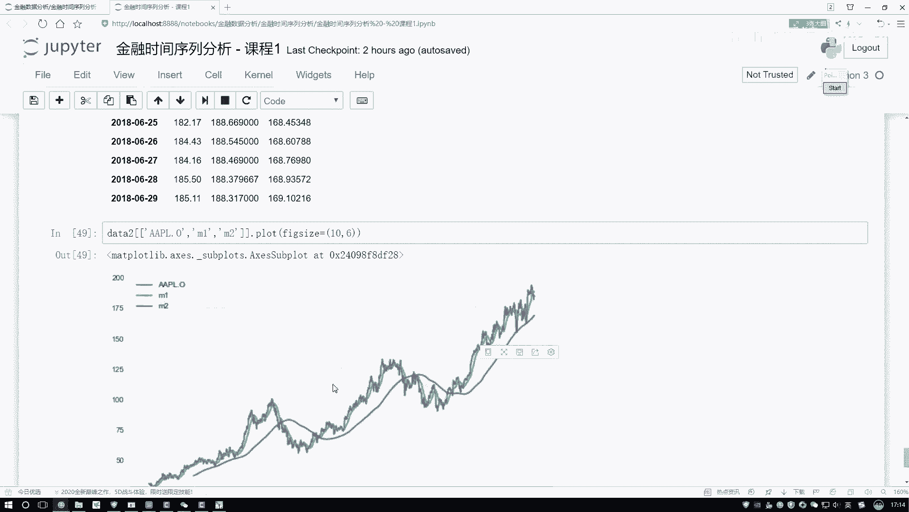

点幂啊，一定是一个平均值，其他值可能含义就不是那么特别明显了，这是一个均值。然后呢边看出现这样交叉。刚才给大家说了嘛，死亡交叉还有一个环境交叉是吧？那能不能把这个图啊，你说你给我画的更直接一点啊。

直接给我展示出来哪块啊，它是一个就是短期的是一个大于长期的，哪块短期是一个小于长期的，你再把这个交界点给我画出来，能不能把这个分析咱做的更到位一些啊，也可以，咱来指定一下吧。

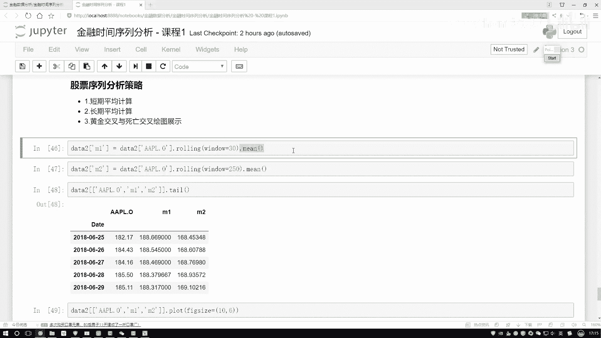

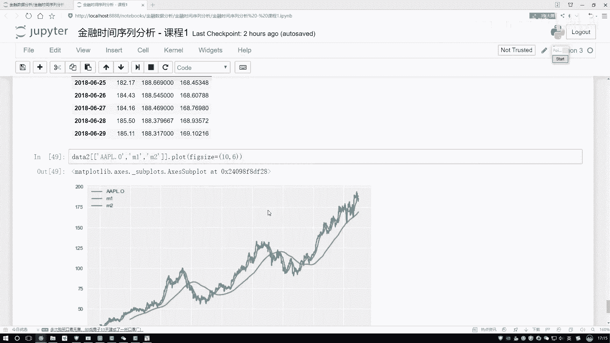

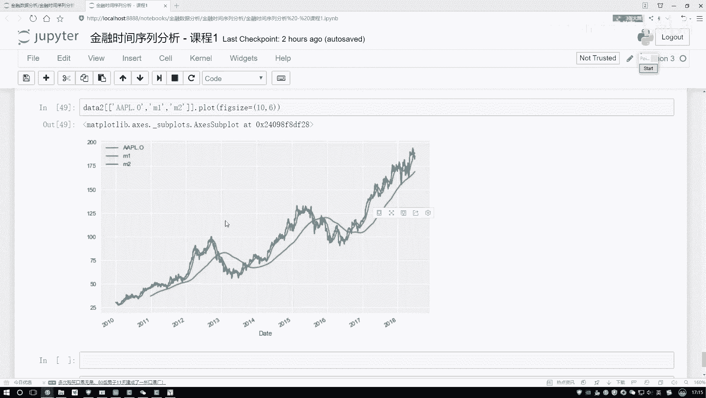

这块我可以指定一个n派函数啊，n派点威一下威什么意思呢？刚刚才不是要做判断嘛？你这个短期的跟长期的去比，然后它这个数值啊是大了还是个小了是吧？1个M1，然后去跟这个M2去比。排点威意思啊。

就是说哎你现在首先哎去比，然后呢，咱再说比完之后，你对这个结果该怎么操作。好了，第一个参数是要比什么东西。第二个参数呢就是一个条件。如果M一我的一个短期平均大于长期平均的时候呃，把值指定成几呢？

我看这个任务当中咱就指定一个一负一得了。如果大于指定一个一，如果小于指定是一个负一啊，就相当于两个分水领，就两个分界线的意思吧，指定一个一一个负一，然后现在就是大于的时候。

我指定一个一小于的时候指定个负一，那你把这个指标，你得告诉我它是什么，咱指定一个指标吧，指标当中你指定一个position，然后它的一个位置看是一个一这个标志位还是负一这个标志位。

它就描述了当前哎咱的一个短期和长期平均的一个就是计算结果吧啊，然后再折线一下，我看一看说出现了一点小问题。

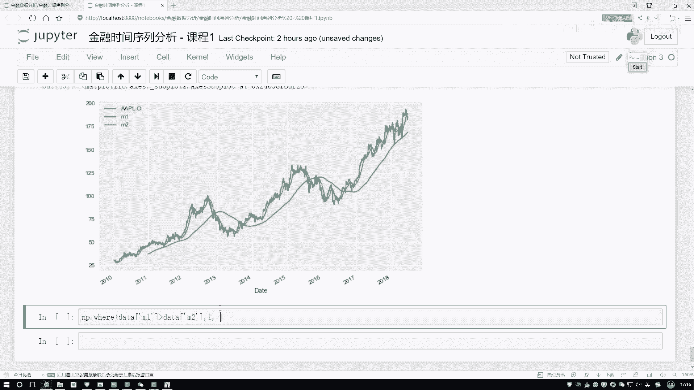

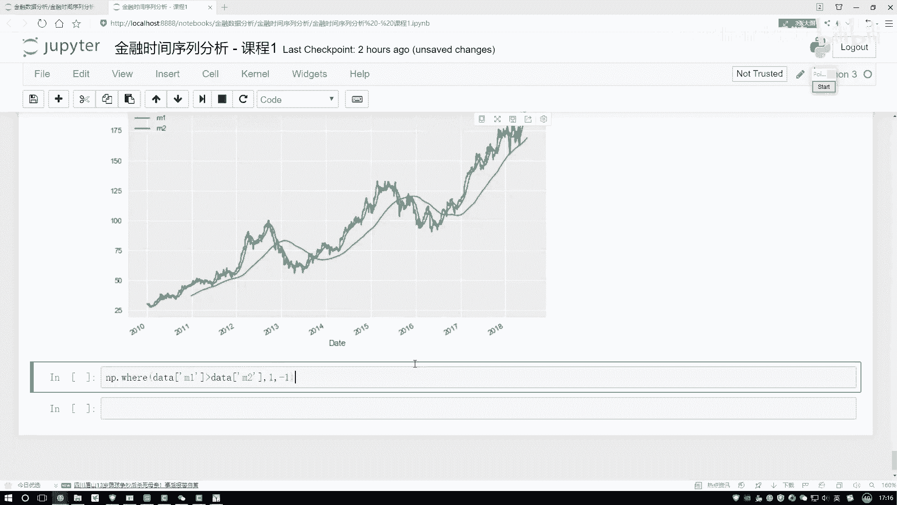

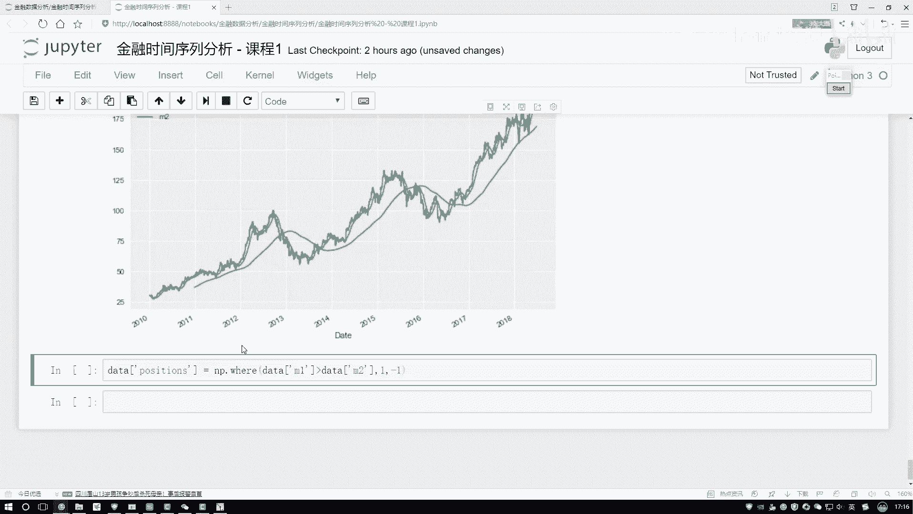

没有M1哦，这块咱显的示data2是吧？把这个data2传进去，这也是一个data2。好，直线一下。这里咱就有了啊，有了完之后呢，我们要把这个结果给它展示出来吧。呃，这个结果展示的过程当中。

我先给大家来展示一下这个这个数值结果吧，点艾一下。

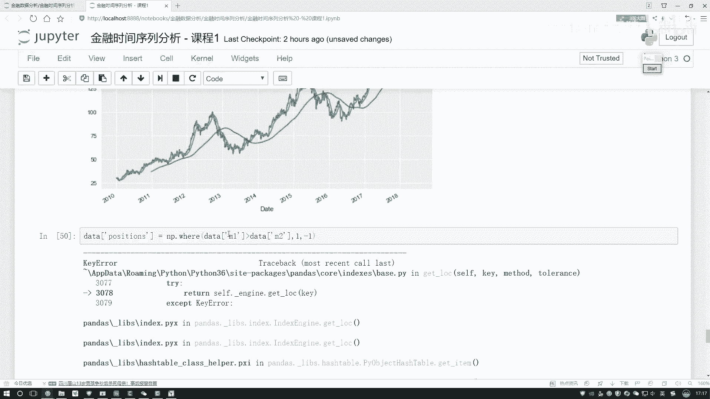

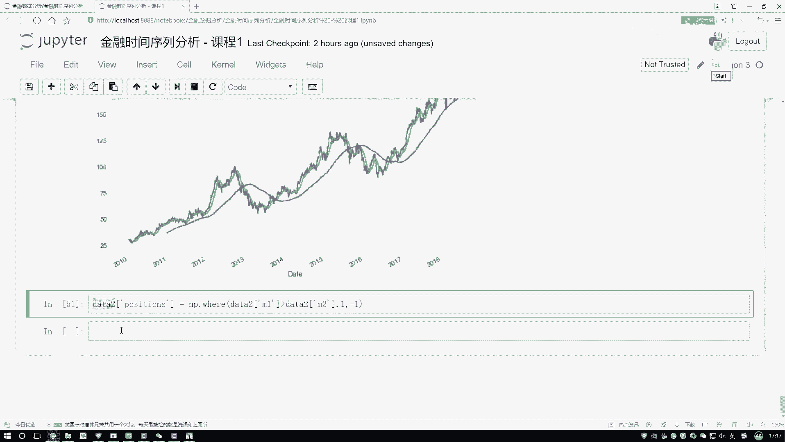

哦，从这个数值结果来说，看不出来什么太多东西，这-一-1啊，咱不看这个数值结果，直接画图吧。画物当中啊就是哎我要去对我当前这个data。d塔当中啊，da塔2当中啊我要画这几个指标嘛，有几个指标。

刚才我们是画了3个，现在咱又多了一个，我直接复制过来。

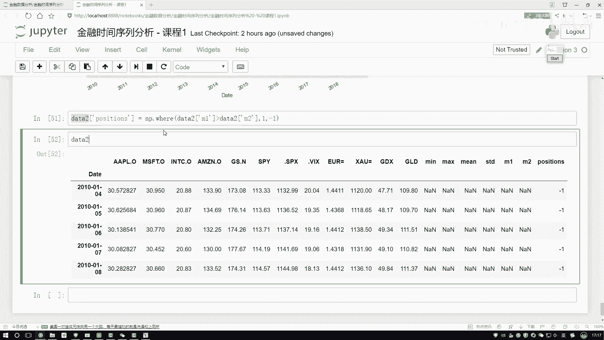

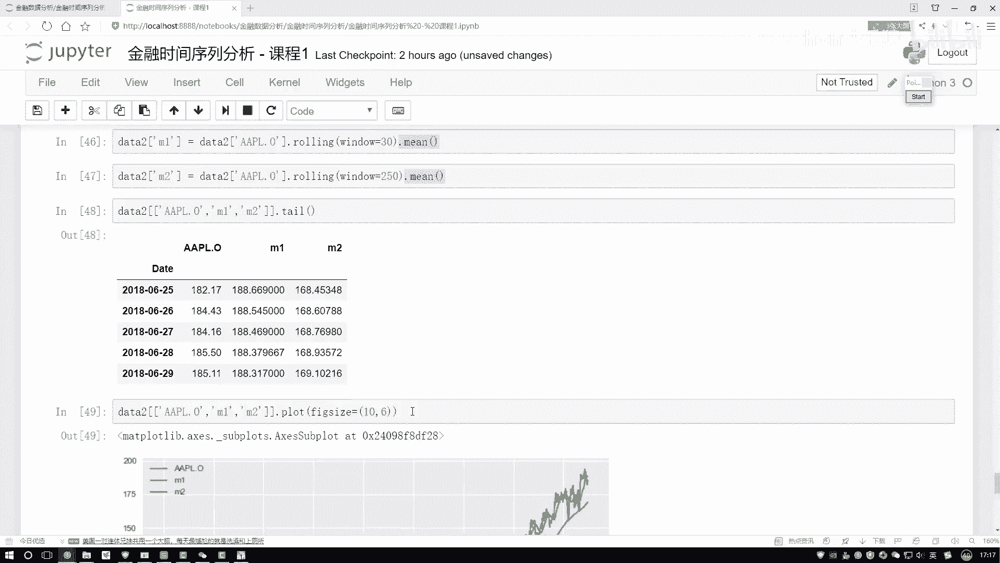

直接复制过来多了什么，多了一个position是吧？把position拿过来，这不就行了吗？把它拿过来，然后我还是直接点plot一下，然后这个结果是不是就有了呀？哦，这个结果。😊。

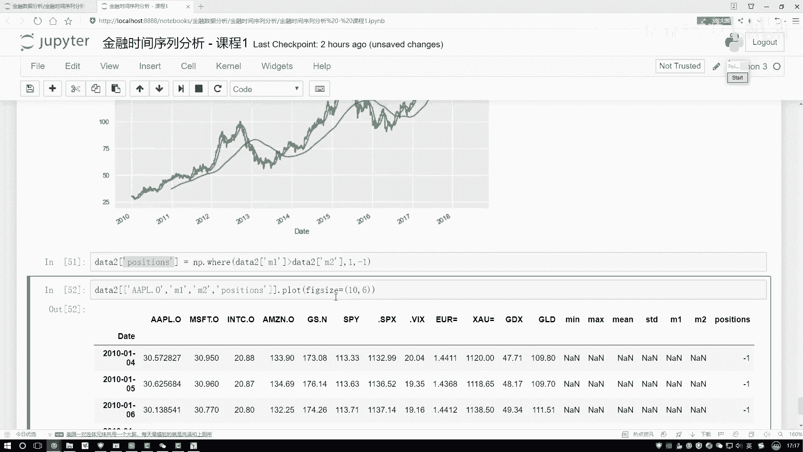

这个结果不行。哎呀，这个数值上左边来说呃，左边来说都是它实际的值的一个走势。然后我们这个值指定的一个一和-一看着不行，这样吧，咱把这个咱再咱再添个坐标轴吧。这一块blpro的时候。

然后我把这个坐标轴重新再再写一个，右边咱再画一个坐标轴，因为左边这个坐标轴取值范围太大了，不适合我这个-一和一，这都看不出来了，我在右边画个轴吧，右边我说这是负一，然后这是一，然后在右边这个轴来画。

这不也行啊，咱画一再画一个轴。😊，右边这个轴当中呢就是你点p的时候，然后第一个参数，一个feature size。第二个呢你可以指定就是我们第二个轴，第二个轴，然后它的一个坐标啊。

secondary secondarycondary当中我指定一个Y。把Y传进去第二个Y轴，第二个Y轴描述谁呀？把咱这个position传进去就得了。复制过来。第二Y轴是描述着它的哦给它去掉。

然后咱们再执行一下，呃，看一看这块出现了什么小问题。

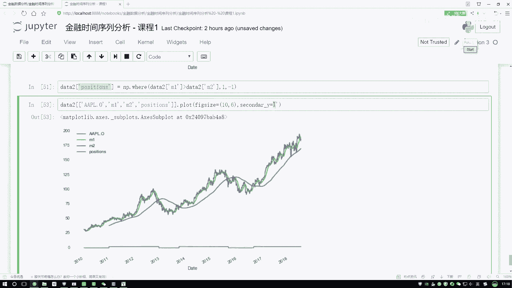

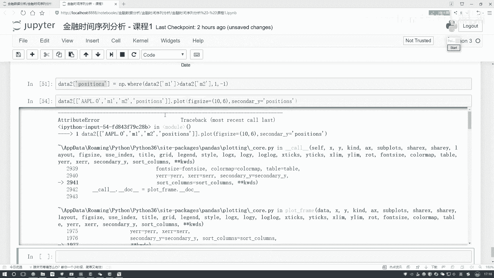

哦，这个东西sectarySEC。哦，少了一个字母是吧？SECONDSECONDAR哦，不是少了一个少了一个Y是吧？sory然后Y行，再画一下，这咱图就出来了。这张图什么意思啊？

像我刚说的这块是一个负一，这块是一个一。那你看这里。

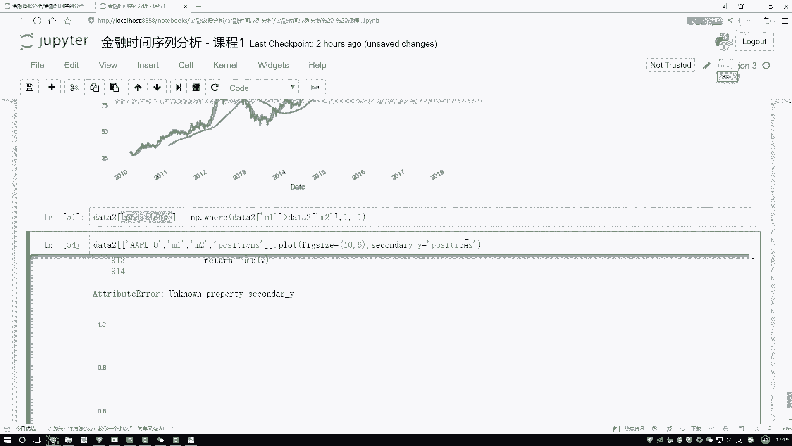

我们是不是多出一条线啊，多出一条线，什么意思？表示咱们这个position吧？我们的一个位置位置当中等于一的标表示什么？咱们的一个短期平均。你看这个绿色的，它是就是绿色这个东西是大于什么？

大于我的一个长期平均吧。所以说此时它在上面的，然后下面呢就是我的一个短期平均啊，小于一个长期平均。那你看这个趋势由这个E变到一个负E，那说明什么？这是一个死亡交叉吧，这一块就是怎么样，咱又跌了，是不是？

那看再看这里。😊，在这里啊是不是一个相反趋势啊，我的一个短我的一个短期平均，然后往上超越了我的一个长期平均，首不要涨了吧，你要可以买了吧。所以这是什么黄金交差吧，后边咱是不是一样啊。

这里啊咱就是啊基于刚才给大家说的我们的一个死亡交叉，还有一个环金交叉。咱在这个图像当中啊，其实就是不是在图像当中啊，在我们的一个时间区当中，你去指定好窗口，咱可以算什么，算我们的一个短期。

还有长期平均嘛。其实就是在当中啊，基本上能想到的这这些计算，咱是不是都能玩起来，画图展示出来啊，这个也是比较明显，咱当前的一个走势情况吧。好了，这里给大家说了一下，就是我们的一个分析的啊。

股票分析的一个小策略。😊。

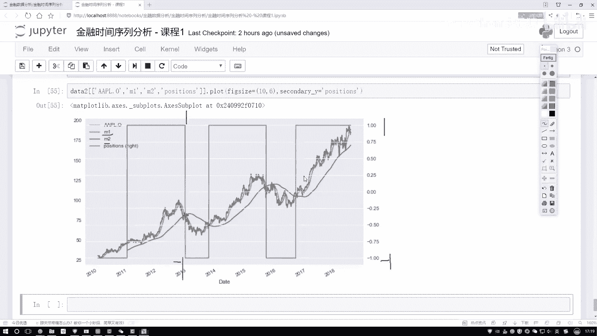

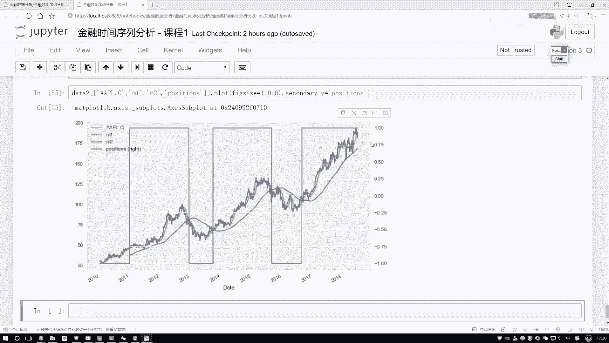

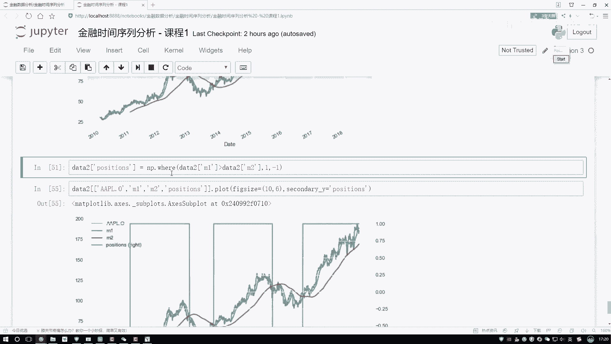

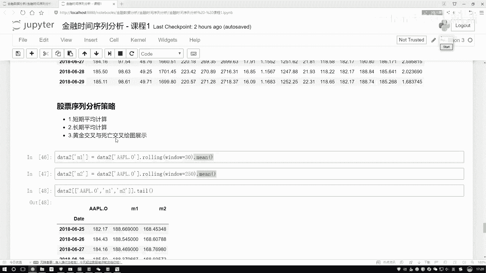

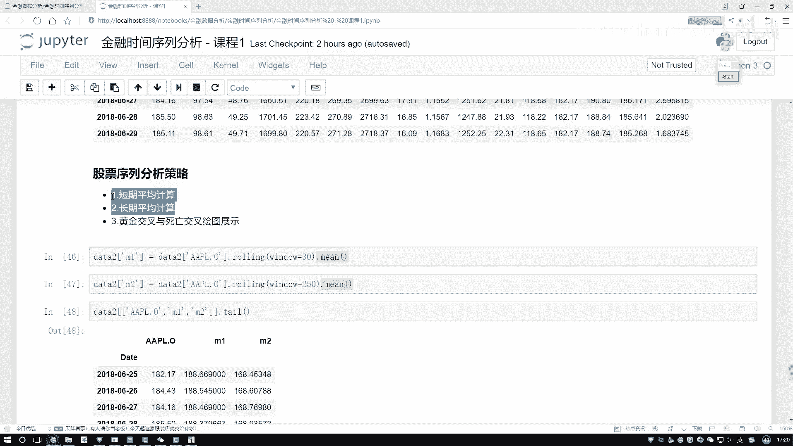

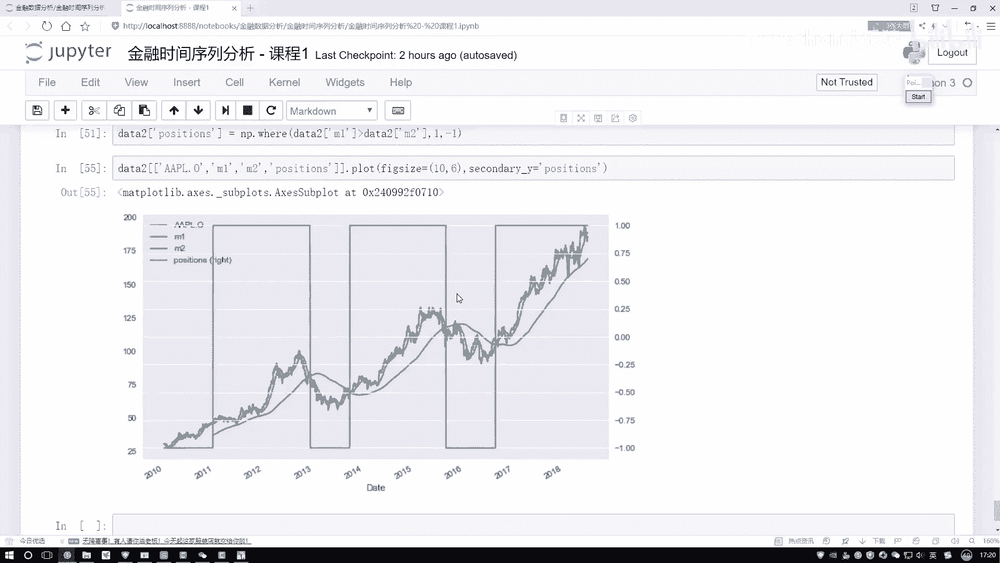

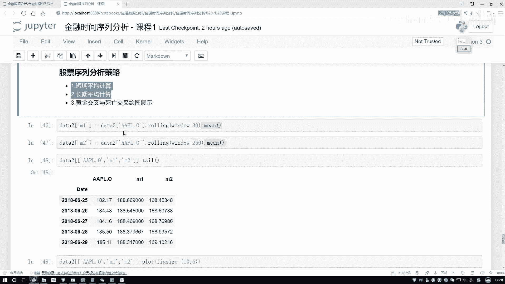