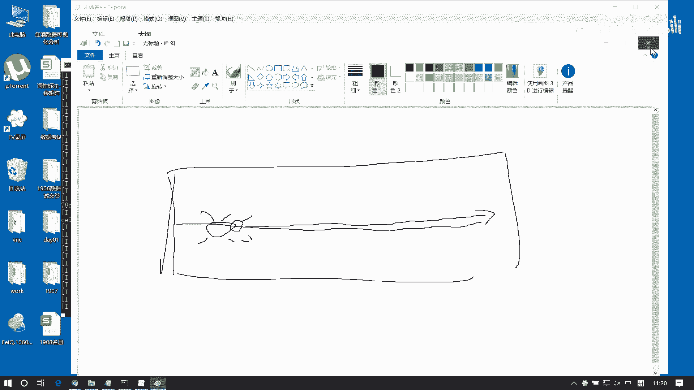

# 数据分析+金融量化+数据清洗，零基础数据分析金融量化从入门到实战课程，带你从金融基础知识到量化项目实战！【入门必备】 - P23：03 numpy基础01 - Senior数据分析媛 - BV1Ak61YVEYX

那么南派是啥呢，咱们做数据分析啊，逃不开数据啊，逃不开数据的处理，那么南派呢给我们提供了数据处理的一个基础，这个基础呢主要是运算的一些基础啊，那运算呢它包括的不只是加减乘除，还包括什么。

比如说我们创建呢，还有访问呐类型转换呐，集连呐，合并啊，聚合呀，排序啊等等这些操作啊，这呢还有包括它的这个运算机制，比如说广播机制等等，这呢都属于南派给我们提供的一些基础啊。

那么我们如果想去做这种业务分析，那他必须要依赖于南派啊，所以南派是基础中的基础，我们来看一下啊，那么南派是个啥，我们可以先把这个南派做一个导入啊，做一个基本的导入，这块呢我们先在这啊新增一个单元格。

我们去import n派，一般我们会把它命名为NP，用NP来表达南派，不然名字太长，啊咱们这个能动手，尽量给我动手啊，然后我可以查看一下这个当前南派的版本，可以杠杠version，咱们数据分析啊。

就是基本上前期的东西都是靠记的啊，都靠记的，没有什么逻辑性可言啊，所以说呢这这段的学习学习技巧的话，你就是跟着我敲代码，你尽量能多敲一遍，那么你就学的更好一点啊，你少敲一遍啊，那可能你学的就不好啊。

你记不住啊，你记不住的话，那自然就不会用是吧，所以说咱们尽量动手啊，这玩意跟什么HTML啊，跟那个SQL语句啊，其实差不多对吧，就是得多敲，你不多敲的话，光听光听个热闹是没用的啊，你听个热闹的话。

晚上你你第二天就忘啊，所以就让你得多敲多练啊，嗯好，动起手来啊，南派他给我们提供了运算基础，它呢主要是通过一种类型来做这个运算的，这个类型呢叫数组，注意这个措辞啊，它叫数组，而不叫列表。

数组一般我们用array来表示，而列表一般我们用list来表示对吧，那array array跟列表有什么区别啊，这知道吗，我要强调几个概念啊，这个我们Python的列表，大家先先明确回忆几个问题啊。

Python列表他的对字对这个数据类型有没有要求，第二个问题列表是不是有序的，这两个问题第一个是有还是没有有吗，有什么要求，反正写个处能听啊，写个TRU进不去啊，能不能进去，这是不是列表，有要求吗。

没有要求啊，没有要求里边你可以存放任意类型，比如说我还可以存，字符串hello，我还可以存整数，我还可以存小数，是不是没要求啊，对数据类型没有要求啊，也就是说它里边可以什么，可以是任意类型，的组合啊。

他俩是不是有序的呢，有序啊，它是有序的序，也就是说列表呢它是一个有序的这么一个集合，这个集合里面呢可以是无序的啊，可以是任意类型的一个数据，但是呢对于数组不一样啊，数组有什么要求呢，数组的话啊。

数字一般来讲它对数据是有要求的，数据类型必须统一，这是数组啊啊，而且呢，也必须是有序的集合，数据类型必须统一，那也就是说，这种情况我们就不能称之为数组了啊，它就不能称为数组了，因为什么呢。

因为这俩类型不一样，这种是布尔类型，这是字符串类型，这是整数，这是浮点啊，那么数组的话，那必须要把这些数据进行统一的，我们才能进行一个统一存储，你像这个像这个东西，大家可以了解一下啊。

就是说咱们咱们这个数据结构，它有这个什么顺序表啊，链表啊，链表啊，然后还有什么站呢，队列大家知道吧，那这里面其实就是管理方式不一样对吧，管理方式不一样，比如说链表它跟顺序表有什么区别呢。

这个有没有知道的列表和顺序表有什么区别啊，链表是什么，它是存储结构，是是这个什么线性的，而且什么呢，这个逻辑结构也是线性的对吧，而链表呢，存储结构非线性，而逻辑结构是线性对吧，那这样有什么区别呢。

他在查找啊，还有插入啊，还有包括删除啊，这种你在用这种操作的时候，效率它就不一样了，比如说我们这个顺序表啊，那顺序表它是怎么的，它是它就是首先他们都是线性表啊，线性表是什么，强调的是这个顺序。

就这个逻辑结构是是线性的，什么叫线性的，比如说啊爷爷爸爸，我儿子孙子这个之间是线性的关系对吧，这个这个线性关系是逻辑线性啊，这是逻辑线性啊，那么比如说123456，这是逻辑线性对吧。

但你在计算机当中存储的存储的方式上呢，可能是非线性的，比如说你在这存一个存一个一，你在这存个一，然后呢我再在这再存一个二，然后我在这儿再存一个三，那么这三个值它是它逻辑上是线性的。

但是存储结构上是非线性的，明白意思吧，但是如果你是顺序表的话，它是呢他除了就是这个123，它怎么存，它是紧挨着存，这是一，这是二，这是三啊，他除了逻辑结构是线性的，它存储结构也是线性的，那对于链表来讲。

像这种情况就链表哦，它列表一般会有一个数据域和一个指针域，啊有个指针域，这个指针域呢它记录的就是什么呢，它就是记录的下一个那个表的一个地址，就下个节点的地址，他可能能找到它。

然后呢那这个指针域呢会记录的是它，然后这个指针域呢可能会记录的是另一个啊，可能还有一个啊，这是四啊，好那我们看啊，那么对于这两种两种表结构的话呢，它在这个，比如说在这个增删改查的这种逻辑处理上呢。

它就不一样，比如说你对对于这种啊这种是顺序表顺序表，大家想啊，如果我想在这个在这个位置啊，我想插入一个插入一个一个九吧，行程固然，这是四，这是五，这是六啊，我想在这个位置插入个九，那你怎么做。

你是不是得先把这个六移过去，把五移过去，四移过去，三移过去，把九往这一放，对不对，所以呢整体来讲，你需要把这个位置，后边的所有数据都要做一次转移啊，但如果你对于链表来讲，你想插入一个九。

我只需要把这个这个链给它断开，让它指向它，然后让它指向它就行了，是不是我只要动两个节点就够了，所以说在插入这种处理上，那我显然我列表的处理这个处理逻，处理这个效率是要高于顺序表啊对吧，那换个换个方式啊。

比如说我们想去查找数据，我想查，比如说我想查这个四，我想把它找到，那我对于顺序表来查找怎么查呢，我会挨个比较对吧，查一看跟它比是不是相等，但查二查三查四，这样就完事了对吧，但对于列表来讲怎么办呢。

我需要依次找到指针域，然后指针域再去找到下一个节点，读取它的内容，不是然后再通过这个指针域找下一个节点，然后再比较不是再找，所以他的查询逻辑是要比它效率要低啊对吧，所以就是说不同的数据结构啊。

他们都可以去实现列表或者是数组都能实现啊，但问题在于它的查找啊，排序啊，这种逻辑是不一样的啊，所以说那比如说你要，比如说你现在想写这个算法，你要去侧重的是查找还是侧重的是这插入对吧，如果你要查找的话。

那你用顺序表来查会快，你要插入的话，你用列表来存会快对吧，所以取决于你的数据是什么样子的啊，啊那这块相当于给大家做个拓展啊，那一般来讲呢像这种数组来讲，它一般都是顺序结构啊，顺序表结构，而像链表来讲呢。

它一般都是那种就是那个啊列表来讲，一般都是列表那种结构啊，它就是增就是这个增加呀，或者删除这种逻辑来的很快啊，但查的话呢可能效率比较低啊，所以这个数组和列表它是有区别的，但大家一定要注意啊。

千万不要把把数组当成列表来用啊，那么最明显的区别就是什么呢，就是他的这个对数据类型的一个要求，还是不一样的啊，好，那么我们南派里边给咱们提供的都是数组类型，南派提供的是数组类型，所以说我们一定要注意。

这个数组类型里面的类型是统一的，好我们现在来看怎么构造这些数组啊，南派的数组第一种方式最简单的直接，咱们拿Python的列表来构造，我们先写一个列表啊，比如说来一个呃L1等于一个呃，12345。

这是一个列表啊，然后呢我们去构造这个南派的array，我们一般用啊N1来表示啊，叫NP点array，我们把这个L1传进去，这样呢它生成一个N1对象，这个N1对象呢我们可以直接给他输出N1，可以看一下。

这呢就是一个NTARRAY了，就是一个数组了啊，但是呢这点我要注意一个问题，如果咱们这个L1啊，他如果我们再写一个啊，写个L2等于一二，3。14，然后2。68，那这里边是有整数，也有浮点对吧。

咱们对于列表来讲的话是没有任何问题的，整数就是整数，浮点就是浮点，但是如果我把它构造成南派arr的话，咱们再看啊，N2等于NP点array，我把这个L2写进去，然后我们再来看这个N2。

你看一变成什么一点一点数，不就是一个浮点的表达方式啊对吧，比方说小数位没有值，是不是就是用1。2点来表示，所以它会干嘛呢，他会做强制类型统一加类统计，为什么，因为列表它可以是类型不同。

但数组的类型必须相同，如果它发现我构造数组的元素类型不同，它会强制把你的数据进行类型统一操作，那么统一操作的优先级怎么看呢，是这样的啊，对象类型大于浮点类型，浮点类型大于整数类型啊。

因为这里面浮点类型的优先级要高于整数是吧，所以我们把整数转成了浮点，同样的，如果这里面你有字符串，我们再来一个啊L3，它等于一个hello，再来个一二，再来一个3。14，现在这里边有整数，有浮点。

有对象，我用它再来构造一个N3，等于NP点格瑞NLL3，我们把这个N3做一个输出是吧，变成什么都有单引号了，是不是对字符串类型了啊，那注意啊，这他这个字符串类型它会用U小于U5，这种方式来表达。

那以后我们看到这种东西，就知道它是字符串就行了啊，非常悠久了是吧，取决于你这什么字符串的一个长度啊，好这是一个基本的构造方式啊，这种方方式，那么我们一般不会用这种方式来构造number派和ray。

我们这么去构造它，无外乎想告诉大家，南派array的数据类型是必须一致的，如果不一致就会给我们统一啊，大家把这个信息牢牢记住就OK了啊，大家千万不要轻视它啊，很我们很容易在这个地方栽跟头。

啊啊啊一定要确保它是类型一样的啊，那么我们一般惯用的方法是什么呢，是用如下这些个快捷方式，帮我们去构造各种各样的数据类型，南派主要提供的数组呢是做矩阵运算啊，做矩阵运算，那什么是矩阵啊。

我们描述一组数据是吧，比如说1234挂机打个括号，这是什么，这就是一个矩阵，啊这就是一个矩阵啊，那还有比如说1001，这是什么呀，这是一个单位矩阵，还记得吗，哈哈这个是应该是我们上高中时候接触过。

但是主要是在大学讲的啊，主要大一的时候讲的，啊不过大家也不用担心啊，高数应该一般学都不好对吧，像咱们咱们考高数基本就是背背题嘛对吧，背数字啊，考试啊基本上话题是吧，哪个老师给咱题话的多，那老师就好啊。

基本都是这个套路啊，哎我那会儿上课最喜欢什么，我那会儿上课啊，你像我们我们院有个老教授啊，有个老教授，然后我们都特别喜欢他，为啥喜欢他呢，因为我们这个老教授他上课，他经他他这个他讲课呢。

他经常是会以那个就是生活当中的段子，去给我们讲一些点啊，所以我们就是喜欢听这个热闹啊，要听听热闹，然后基本上那个只把段子记住了，然后这个知识啥都没记住啊，然后呢再一个还有好好处，就是它虽然是一个教授啊。

但是我话题画的特别精致啊，既然他画啥题，我背啥题就够了啊，基本上基本上不会超过太多啊，就是你把那个题全背下来，肯定能过，而且就是不会像别的老师说，上上来一上来一话题，说这个咱们今天画的题啊。

整本书全全是那个考试大纲啊，那没有是最坑人的是吧，那有老师先虽然很负责吧，但是不太招人待见是吧，你看现在现在中国大学不在改改革嘛是吧，昨天看一个新闻说以后没有98521了，以后都叫双一流大学啊。

就是98521全都全都改名叫双一流啊，就没有这个称这个概念了，还有包括最近好像大学都搞，搞得挺火的是吧，有个大学生作弊被抓到了，然后开除了，是不是啊，想想我们多么幸运呢是吧，我们马上要走出这个地方了。

咱们还有没有那个大四没毕业的呢，别作弊啊，别到最后啊，翻跟头啊，现在抓的紧了是吧，嗯嗯矩阵啊，这呢只是一个嗯，这只是个二维矩阵啊，那么其实我们可能有更高维的矩阵，可能有三维的矩阵，有四维的矩阵。

有五维的，六维的，七维的，八维的，九维的啊，那我们这个南派呢不论你是多少维，我都能帮你构造啊，就很厉害啊，多少维度万能构造，比如说我们先看第一个啊，NP点vans他呢就是我们用一用一来填充一个矩阵。

其实就是个数组啊，就是个数组矩阵就是数组啊，只是高维数组而已，比如我再写一个NP点ones，然后这个shift呢很重要，shift指的是个形状，这个形状一般我们用元组来描述。

描述是你你的每一个维度的数据量啊，比如说我想创造两行两列的啊，那第一维是两个，第二维是两个对吧，这样我生成是一个两行两列的一个二维数组啊，那也可以写，比如说比如说三行两列。

那我得到就是三行两列的一个二维数组，比如三行五列，就是三行五列的二维数组啊，所以主要是取决于这个shape啊，那另外呢是这个d type，d type是什么呢，它是确定我们这个数据的类型的。

默认是什么一点数浮点啊对吧，我可以通过这个d tab来限定我的类型，比方说写上一个int，我把全变成整数，但是呢我们最好不要用这种Python的数据类型，咱们用NPD数据类型。

NP点int它这个类型写的更详细啊，其实一个道理啊，都是整数，咳咳另外还考虑兼容性的问题，所以咱们尽量用这种方式来处理啊，因为其实在不同的操作系统这个int类型啊，就是你像Python还好。

Python已经优化了，它都优化成对象了，那你像你像C啊，C加加这种语言，你在不同的操作系统上，其实int的位数是不一样的啊，有四位的，有两位的啊，像还有什么double和float。

它的位数也有不一样的，有八位的，16位的啊，就是操作跟操作位置有关啊，但你看现在一般都是64位的吧，但也有一些电脑是32位的，所以它会有有一些兼容性的问题啊，那南派呢它之所以要提供这种类型。

就是为了帮我们解决这个兼容性的一个，优化的问题啊，所以我们尽量用它，用它更更保守啊，更保险，然后最后一个order c啊，这个是跟我们的内存存储方式有关的，这个值我们不要动啊，咱们默认值就可以了。

他可不是排序啊，他不是排序啊，咳咳，它也可以构造更高维的，比如说我们再写一个NP点ones，那shape我们等于三行五列，然后这个二是啥意思，不是不少了啊，总之是什么是三维的啊，352，就这样一个东西。

那这个东西咱怎么看呢，你看我们先说二维数组啊，二维数组比较好看，比如这个数组，那么我们把二维数组数，可以看成一个特殊的一维数组啊，对吧，咱们讲二维数组是这么讲的，你一个二维数组就是什么。

就是一个一维数组的数组呗，是不是你每一个元素数不都是一个，每一个元素是一个数组数，就构成了二维数组了，对不对，所以这个三说的是谁啊，说的是我有三个元素，对不对，那么这个五说。

谁说这个里边这个小数组有五个元素，对不对，同样道理啊，再来看那这个三说的是最外层的，就这样是一个二维数组啊，这是一个二维数组啊，这是一个二维数组，比如这个三是意味着什么，是三个五行两列的二维数组。

构成的一个一维数组，对不对啊，所以你这么看啊，那这个三也就是说如果我们取第一个元素的话，能取的就是这个二维数组对吧，取第二个元素取的就是这个二维数组呗，对吧啊，那我现在如果想取第一个元素当中的这个。

第一个值，那取的数据是这个值啊对吧，那就是相当于这是什么，这个形状就是五行两列呗对吧，五行两列，我取第一个元素是取的第一行了，对吧啊，就是第一个一维数组嘛，啊所以我们这么这么看啊，这么看的，那再一个呢。

如果高维的话，你理解不了的话，你可以把它映射到一些现实场景，比如说我们一个人就是一个点，那么一排就是一个一维对吧，整个班级就是二维呗是吧，那什么是三维呢，N个班级就是三维，对不对。

那四维呢楼上楼下就是四维，是不是，那五维呢这栋楼和那栋楼就是五维对吧，六维呢这个小区和那个小区就是六维是吧，七维呢这个城市跟那个城市是七维对吧，八维呢这个国家跟那个国家就是八维。

九维呢这个星球和那个星球就是九维对吧，那十维呢这个星系和那个星系就是十位对吧，啊你你可以这样去理解啊，就是以一个你能理解的方式去理解啊，啊所以这个维度高，确实太让人难以难以难以理解了啊。

你家现实现实生活当中，这个维度我们能理解几维呢，四维是可以理解的对吧，思维可以理解的，如果我们能够，如果我们能够去看到第四维，第四维肯定是时间呗，对不对，这是一个三维空间，我们在这个空间当中活着呢是吧。

这个是咱班长是搁这学习呢是吧啊，然后呢我们加个时间轴是吧，这是这是上一秒啊，然后11点钟的班长，还是20啊，然后那个九点的班长，九点班长这躺着呢是吧，睡觉的是吧啊，九点的班长，十点的班长。

11点的班长啊，如果我们能能拿到什么，如果我们做一条线，就是比如说这个这个红线它是一个时间轴的话，如果我们能够能够去在这个时间轴上，我们去做事，三维空间我们可以上下左右，可以来回动对吧。

如果我们能够在时间轴上左右动的话，那我就能穿越时空了，是不是我能回到过去一盒啊，嗯穿越未来对吧，所以说如果我们我们人类啊，如果能解开四维空间，那就很厉害了，你就可以穿越了啊，这是穿越了那五维空间是什么。

有多个时间线，这就是他们所谓的那什么平行宇宙对吧，平行宇宙，平行宇宙啊，你像这个四维空间，有一个就是三维世界当中有一个四维的，有一个四维的产物，叫什么什么瓶，你们听你们有听过吗，就有个叫什么瓶子啊。

就是那个四维空间的那个瓶子，给你找一下啊，有个四维。

瓶子叫什么来着，这个瓶子啊，看这个瓶子特别神奇。

就这么个瓶子啊，看着像肾一样啊，哎对叫克莱因瓶，这个瓶子啊，你从一端往里倒水，然后呢就都到都到外边到外边去了啊，就是你从里边倒水就到外面去了，这个大家可能理解不了啊，我们可以这个维度来说啊。

他其实就是对这个东西做一个扩展，比如说你你拿一张纸，你去让一只蚂蚁在上面爬，蚂蚁可能看到的只它只能在平面上爬对吧，蚂蚁它不会跳，是不是蚂蚁是不会跳的，大家知道吧，嗯啊他他不会跳的，不像不像蚂蚱。

他只会跳，对吧他不会走啊，跳了他只会跳，他走就是跳跳走是吧啊，蚂蚁是不行的，蚂蚁它只会爬啊，他只会爬，那比如他你拿一张纸，这一个你一个纸条啊，一个纸条，你在上面画画，你放一只蚂蚁的话。

那么他他只能这个从这往往这边爬爬爬爬爬，一直往这爬是吧，但你想象一下啊，你把这个纸啊给他给他扭一下，然后再对接上，明白意思吗，扭一下再对接上，这个蚂蚁就会什么，就会在这个线上永永无止境的爬。

它永远爬不到头，那实际上他就在二维它，但是它事实上他在二维平面上行走啊，但是他做的是三维空间的事，是不是能理解这意思吧，你给它扭扭转一下，它就它就在三维空间当中不停的在爬他，他但他感觉他是在二维空间盘。

事实上他爬的是三维空间，所以那个课外音频就是这个例，就是通过这个东西给它给它，给它又展现成了，把这个二维平面给它扩展成三维平面，就成了个瓶子，所以这个瓶子你只要你永远永远，什么永远走不到尽头。

就你沿着个屏屏屏壁走的话，你永远都找不到尽头，所以他说就是这个科学家说这个克莱因瓶啊，它就是可能是我们打开四维空间的一个钥匙啊，如果你能把这个瓶子研究研究透了，我们可能就会解决这个四维空间的问题啊。

啊这个很神奇是吧。

克莱音频啊，大家可以到时候可以看自己去找找看啊，就是哎就这么这个东西，你看啊，你看这瓶子啊，瓶口就是评委，评委就是瓶口，从这进去走走走走走走走走，走出来了，是不是走走走就进去了。

就这个瓶子特别神奇啊，而且这个好像有一些科技馆啥的，他也会有，他会做出那种特别大的那个克莱因瓶，然后你就从一端爬进去，爬着爬着，你就爬出来了是吧，你这明明是进进到那瓶子里去了，但是你永远进不去。

你爬着爬着就出来了，因为它平底，因为他那个平就是平里，就是平外。

平外也是平里啊，所以他他是这是四维空间啊，嗯然后还有那个还有那个，就是你要看那个什么平行宇宙，它就是它到底存不存在，就是有一个就是在这个统计学上啊，还有有这么一个定理，就是有人说了一句很著名的话。

他说你让一个猴子，你你让一个猴子给他无限长的时间，让给他一个打印机和打字机，你让他不停的敲，他总有一天会敲出什么呢，会敲出什么，那个莎士比亚的那个什么一个文学名著，他一定会敲出来的，他为什么呢。

他这是概率问题，就是任何低的概率，只要你这个分母足够堆的足够多了，这个概率都可能会发生，就比如说你比如说你，你觉得你跟林志玲可能之间没有什么关系对吧，但只要你活的时间够长，林志玲活的时间也够长。

那么总有一天你可能会成为她老公啊，她可能会成为你媳妇啊，就是因为你他只要有概率，只要你的概率不是绝对的零值，你就一定能够实现这个事，能理解这意思吗，嗯嗯啊就是但是你得有实现的是吧。

人不可能说你你活那么长时间啊，可能你得活个几万岁或者几10亿岁是吧，你才能可能跟这个林志玲比啊，才能成为啊成为这个恋人是吧，啊那他这个这个原理说什么呢，就是他那他他如果如果这个道理是对的话啊。

这个道理一定是对的啊，这肯定是对的啊，就是他他是一个概率概率学的一个道理，那比如你宇宙我们也还知道宇宙是无限大的，对不对，宇宙是无限大的，我们现在所谓的宇宙的大小是什么，是我们可观测距离是这么大。

我们可观测的宇宙这么大，但宇宙之外呢，其实还有一些一些距离我们是看不到的对吧，我们怎么观测宇宙的呢，是根据远处传来的那个光线对吧，我们去计量了啊，那如果你的可观测宇宙是以地球为圆心的，那大家想象一下。

如果我在月球上观观测这个宇宙的话，那这个宇宙是不会有一个偏偏差呢，嗯那就说你在月球上看到的宇宙，其实跟你你在地球上看到的宇宙，它不是一个宇宙，对不对，如果这个距离足够远的话。

你在这个位置你再观察这个宇宙，那这个宇宙可能跟你，我们现在在地球上观察的宇宙完全就不是一个，如果你的宇宙是无限大的，那么我们其实我们如果我们就能画出无限多个，我们我们可观测的宇宙。

就可以有无限多个这种宇宙，对不对，你在任意地方可能都能画出这个宇宙，那前提一定是宇宙是无限大的啊，因为你我们能看到的，我们能看到只是这么大，但是这个之外还有你在这个点上，你还能看到这么大。

这个点上你还能看到这么大，如果这个五宇宙是无限大的，那我们这个可观测宇宙就是无限多的，如果它无限多的话，那么一定会存在，某一个宇宙跟一个宇宙是完全一样的，那这个宇宙跟它就是平行宇宙。

这个这个这个世界发生的事情，可能在这个世界也会也会在发生，但是太远了，我们根本看不到啊，这个光线传过来，可能地球都已经炸了，或这个这个宇宙已经不复存在了啊，所以他还是从概率的角度来来说这个事情啊。

所以你要想找到这个平行宇宙的话，我们只能证明它存在，但是我们却没有办法，就是用事实证明它它是真的存在的，我们只能说通过理论去假想它存在，但是没有办法证明啊，但这是一种，这是一种平行宇宙的一个一个论点啊。

它是通过这种方式来论论点的啊，那你像如果你是多个宇宙的话，这种就是解决空间啊，这就是五维空间了呗，对吧，每个宇宙都有一个自己的一个时时间轴吧是吧，都有一个时空啊，嗯啊这个是多维空间哈，不扯了。

咳咳其实呢你如果你理解不了这种高维度啊，那你就可以去结合一些你感兴趣的，或者你能理解的方式去理解它啊，当然了，这个这个东西啊，大家也就是当一乐着听了，因为实际上我们做数据分析的话，主要还是处理二维表格。

因为业务表啊，业务表无外就是列方向是字段行，方向是数据嘛，比如说我想统计整个班级的成绩，我统计Python java c o c啊，C sharp，然后横行方向什么是每一个人对吧，比如ABCDEFG啊。

每一个同学，所以他这他业务表一般都是二维的啊，不会说那种太高维，那我们可能处理的高维无外乎就是那个图片，图片或者是那个电影，就是这种动图，因为你图片的话一般来讲它是三维数据，因为它它只要是彩色的。

它得有行有有高，有宽有高对吧，然后还得有一个有一个维度来表示颜色，那如果是四维的话呢，那就是加上时间线了，那就成电影了对吧，一个电影每一帧都是一张图片对吧，每一帧是一张图片啊，那么可能一一秒钟有30帧。

或者一秒钟60帧啊，那一秒钟有60张图片刷出来，所以这种情况他可能就是一个啊四维空间啊，那如果你在高维的话，那可能就是N部电影了对吧，N部电影了啊，所以可能我们最多处理就是这种复杂的结构。

但是对于一般的这个业务表来讲，都是这种二维二维数据啊，咳咳，Once，然后还有这个zeros跟这个for，那这两个函数跟once其实是一样的，只是什么呢，只是它是以一填充，而它是以零填充。

而它呢我们可以指定一个值来填充，我们来演示一下啊，NP点zeros，然后shape我们指定为三行三列，默认值是浮点，而这个NP点four呢，它是，Shape，我们指定为三行三列。

然后那我们需要去用fill value来指定它啊，比如我们以六来填充啊，这样我们就得到了三个666是吧，嗯啊所以他们三个都是一系列的，就是说他能帮我们去处理什么，处理这种高维的数组的创建啊，嗯好了。

