# 数据分析+金融量化+数据清洗，零基础数据分析金融量化从入门到实战课程，带你从金融基础知识到量化项目实战！【入门必备】 - P24：04 numpy基础02 - Senior数据分析媛 - BV1Ak61YVEYX

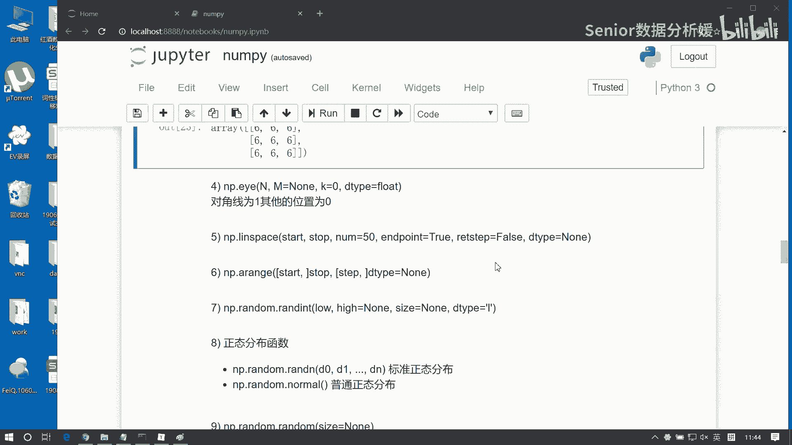

我再看下面这几个函数啊，那第四个这个是NP的IMPKI呢，它是帮我们生成对角线为一，其他位置为零的这么一个矩阵啊，那么它在生成这个二维矩阵的时候呢，其实就是一个单位矩阵啊，我看一下啊，NP点I。

然后比如说写个三啊，那它生成是100010001是吧，单位矩阵啊，那他这里边这个M和K呢，是来控制咱们这个单位矩阵的一些变化，第一个参数是N啊，然后那我们把这个M比如写一个二三是什么。

就是两列是不是取了取了两列啊，如果你没有这个M的话，那默认就是M等于N，然后呢这个K值是干嘛的呢，K是来调我们这个对角线的位置的，比如它等于一，那我这个对角线是往右偏移一位对吧，如果等于一呢。

就是往左偏移一位，看清楚了吧啊，单位矩阵是干嘛的呀，是吧，就是就是这看看我哼单位矩阵。

你像我们求我们说这个求这个除法运算啊，比如说一个数除跟一个数相除，A除以B是不是就相当于是A乘以B的倒数啊，对不对，那同样的，如果一个矩阵A和一个矩阵B相除的话呢，也是相当于A乘以一个矩阵的B的倒数啊。

那当然矩阵的倒数呢，那不叫不叫倒数，叫什么叫逆矩阵啊，相当于求它的逆矩阵啊，那这个逆矩阵就是我们得用单位矩阵来求，单位矩阵相当于这个一啊，这是相当于这个一啊，然后所以说这个单位矩阵呢。

它是帮我们去去做这个矩阵的除法运算的。

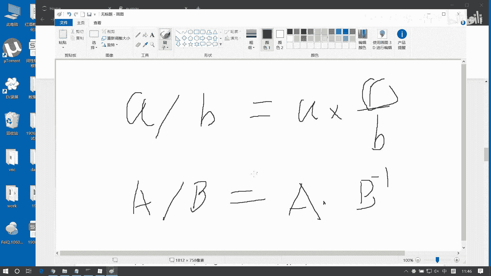

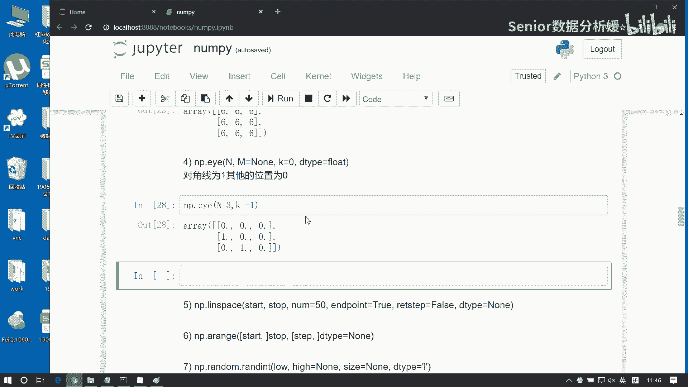

因为矩阵没有除法啊，所以他得通过这种方式来求，通过单位矩阵来求出这个逆矩阵。

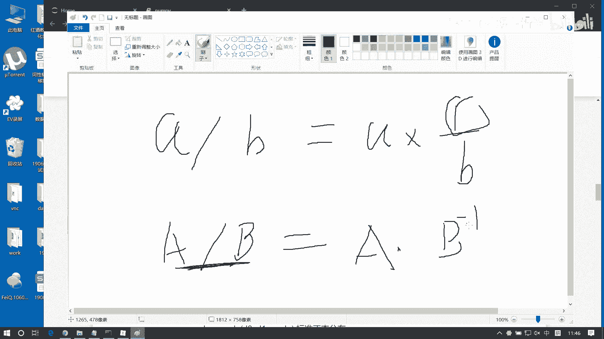

然后再算这个值啊，然后下一个NP点LSPACE和这个arrange，那么这俩函数呢，它主要是帮我们生成等差数列啊，第一个等差数列呢它是通过个数来控制的，而第二个等差数列呢是通过步长来控制的。

比如说我们生成嗯，从1~10的这么一个等差数列，我们start可以给一个零，然后中值呢给个十，然后number让它等于一个十啊，那这样的话是从0~10啊，生成一个等差数列，如果你想取整数。

那比那你想取整数的话，那因为0~11共是11个数对吧，是不是0~10数11个数啊，嗯是吧，所以你要想想取整数的话，你可以把这个and point给它设置为false，就是我不取零不取十啊。

and point设置为false，这是0~9啊，当然或者你可以取最后一个值，然后把这个number设置为11也行是吧，把它设置为true啊，那这样就是11个数，零到十十一个数。

咳咳然后另一个NP点arrange，它呢也是生成这种等差数列的啊，但他呢是用通过步长来控制的，NP点arrange也是一个起始值，一个中值，然后我们把步长设置为一，这样就是每隔一我们取一个值。

每隔一取个值也可以设置为二，每隔二取一个值啊，一个是通过个数，一个通过步长取得到十吗，9~10啊，只要十，那你取俩呢，就是，你这样把这个十取出来啊，那取不了，那你想取十的话，你再往后再再取一下。

让12站台有十是吧，嗯嗯这两个这两个函数常用啊，less space跟个range，这两个大家记住啊，啊这等差数列，然后下边这个random点RINT生成整数，这是整数随机数了啊。

NP点random点RINT啊，这样的话那是我们能给一个区间，给1~10这样一个区间，然后size得给个值嗯，random写错了啊，RINT啊，这样去啊，嗯这个size其实跟我们那个前边那个shift。

是一个道理啊，跟shift一个道理，然后他这个size我可以写成二维的，比如说我写成两行两列，那它是1~10生成两行两列这样一个二维数组，然后呢，每一个值呢都是从1~10之间的一个，随机整数啊。

也可以是三维啊，跟高维都可以，size就是shape啊，这是随机整数用的啊，那它只能帮我随机输出整数，那另外呢，我们还可以通过其他的方式，来生成一组随机数啊，还可以这个啊，正态分布函数，正态分布。

什么是正态分布啊，什么是标准正态分布啊。

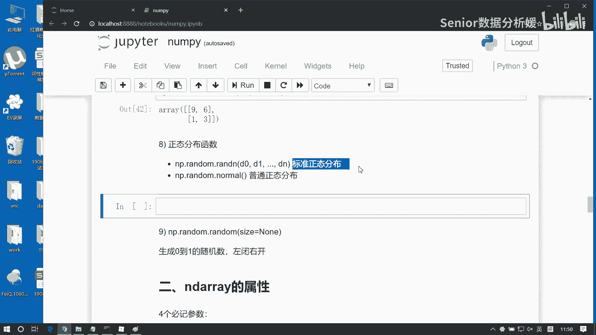

正态分布，它是描述的是一组数据的分布状态，的这么一条曲线啊，那么横轴呢表示数值表示值，纵轴呢表示的是个数个数啊，那么它这个曲线呢表示，比如说我这块写的是175啊，然后呢这个曲线呢就说明什么呢。

说明我们在175这一处的取值是最多的啊，比如这块是两两百，然后这块是130，那么在这两个这个线之外呢，取值就会越来越少，几乎为零啊，那它描述的什么，描述的是我们，比如说一个一个人的一个身高的一个。

分布规律是吧，其实是我们这个有很多数据，它都是成这个正态分布的，比如说我们想统计这个一个国家的，或者一个地域的一个收入状况，它是正态分布的，肯定什么呢，肯定最就是就是这个一般的人是最多的对吧。

一般人最多的，然后那个比如收入超高的很少，然后收入超低的也很少啊，你再比如说你这个鞋子的尺码是吧，也是这样的是吧，一般就是40号到45号，地区间的人比较多是吧，然后你低于40的，还有大于40。

大于45的可能就会越来越少啊，那很多数据呢都是成这种正态分布的啊，那什么叫标准正态分布呢，标准正态分布就是他这个期望值啊，就这个这个值叫期望值，这个值呢是零，然后呢这个点呢叫标准方差。

标准方差呢也是固定的，是这是一，这是一，这就叫标准正态分布了啊，就它是一个数学模型嗯。

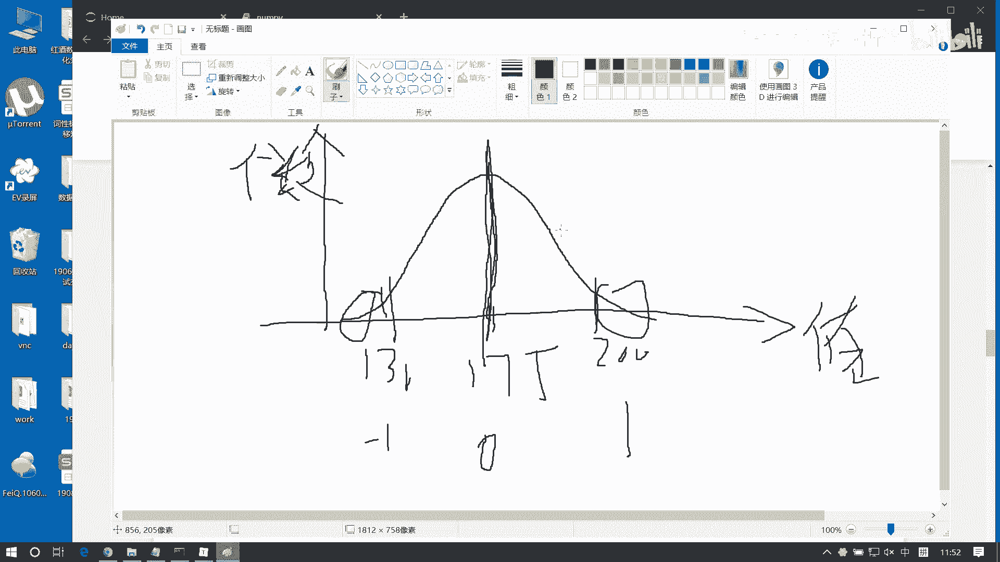

那我们这个函数就是可以帮我们生成一个标准，正态分布的数据，我们可以来生成一下啊，NP点random点RN，这个run的N里边，接收的参数要注意跟其他的规则不太一样，它是第一维，第二维，第三维，第四维。

第五维，一直到第N维，比如说我们只生成一组一维的数据，我可以生成100个，那这100个数呢它们就符合正态分布的规律。

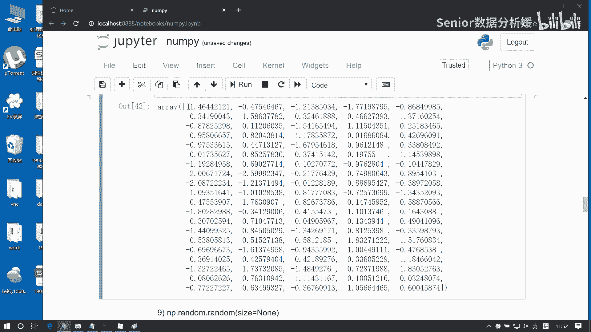

他们都是在零左右徘徊，然后呢方差啊，方差呢是一到正一啊。

这么一个区间我可以把它画出来啊，我把这个数据记为D，我们可以看它这个分布规律，当然这块呢会有点超纲啊，因为我们要用到一个绘图函数，我主要是为了说明咱们这个数据，它为什么是标准正态分布啊。

在呢我们去导入一下啊，Cbn，然后as s sn s，然后再导入一下这个，Matt plot lab，然后in line，呃然后SSS也可以画一个这个直方图。

dist plot可以把这个data给他啊。

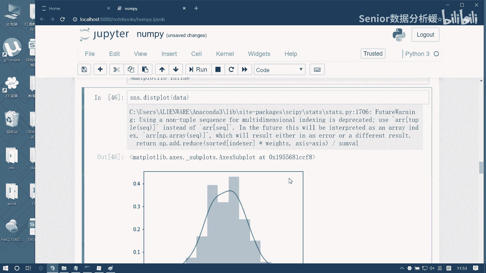

这个数据就是它的分布规律了，你看数在零的附近的这个值是最多的呀。

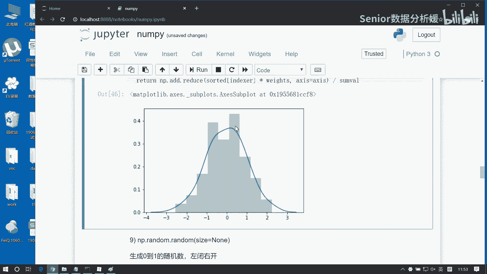

嗯对吧，然后越往两侧越少啊，这两侧越少，这个值不论你怎么变。

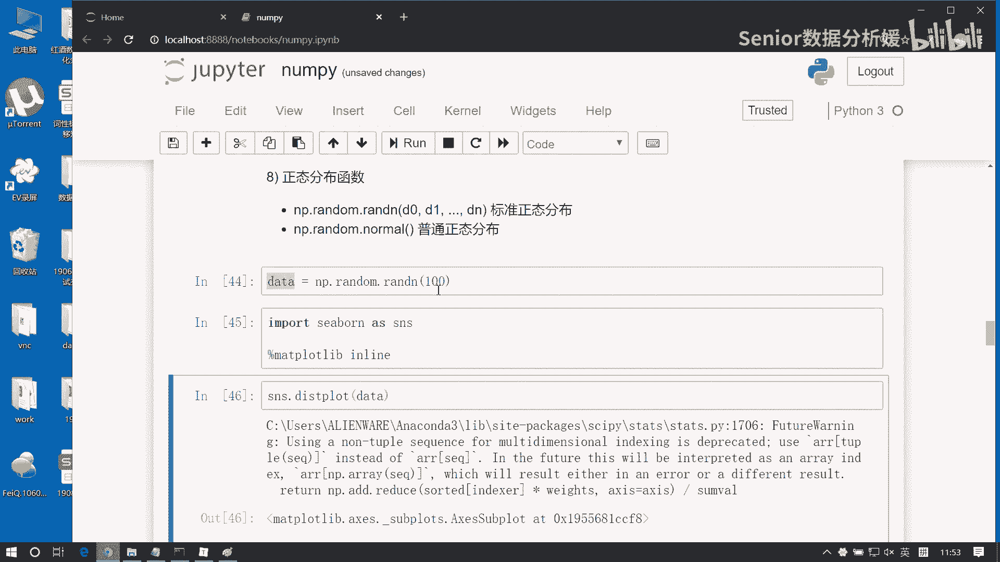

比如我变成1000个，那我画出来的曲线还是差不多这样子的，对不对，还是这样子的，还是什么零，这个位置的数据是最多的，越往两侧越少啊，这是一个正态分布啊，然后呢除了这个标准正态分布之外呢。

我们也可以生成一些我们定义的一些，普通正态分布，那比如说我想去生成人类身高的这样一个，正态分布的话，那我们的期望值跟方差，我们可以给给一些值了啊，我们date1等于NP点random点normal。

那么这里面有两个值啊，一个是lock，一个是scale，这个lock呢就是我们的期望，如果你什么都不写啊，你什么都不写的话，那么它生成的这个数据呢，就是符合标准正态分布的一个规律。

但这玩意呢你要想生成多个值的话，这个size你还得给啊，size我们给它个100，那么这一组数据呢它依然是一个标准正态分布，我把它画一下啊，SNS点，Dist blood，这个date1是吧。

还是在零值左右啊，然后数据成这样一个正态分布的状态。

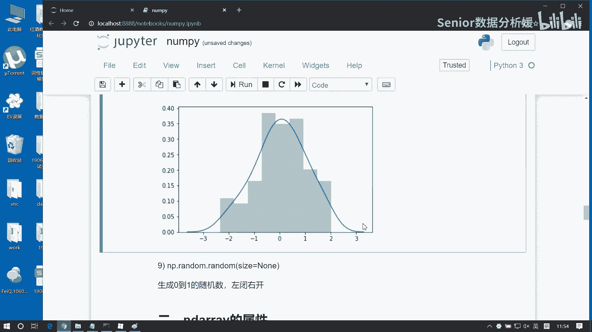

那我可以调整它啊，怎么调呢，这边首先我可以把这个loft，就是这个期望值我调到175，然后scale我们写个一啊，也就是说呢我们是在175这个值左右徘徊啊。

就是这个期望值把这个零变成了175，然后方差还是一再运行一次，然后我们再来展示这个数据对吧。

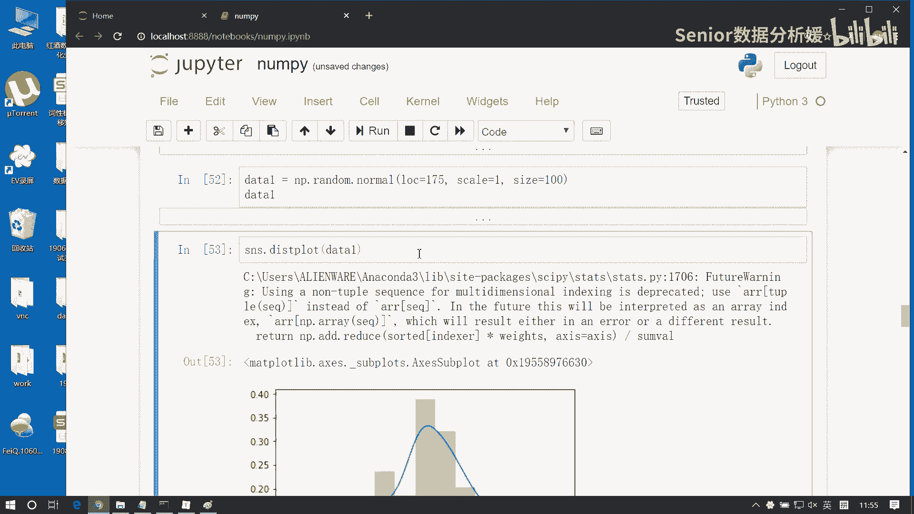

这样我们这个它就在这个175左右了啊，那我们可以可以把这个方差调大一点。

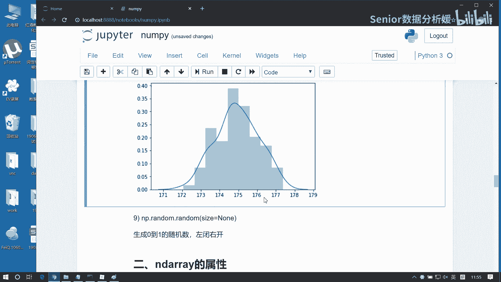

比如说它我们变成了五。

那我们再画这个曲线是吧，这个范围就变得大了啊。

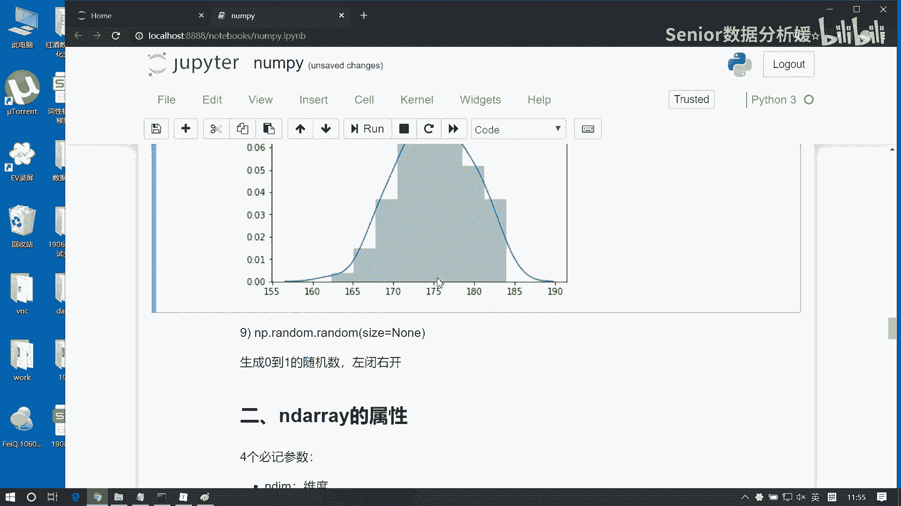

185，然后165左右啊。

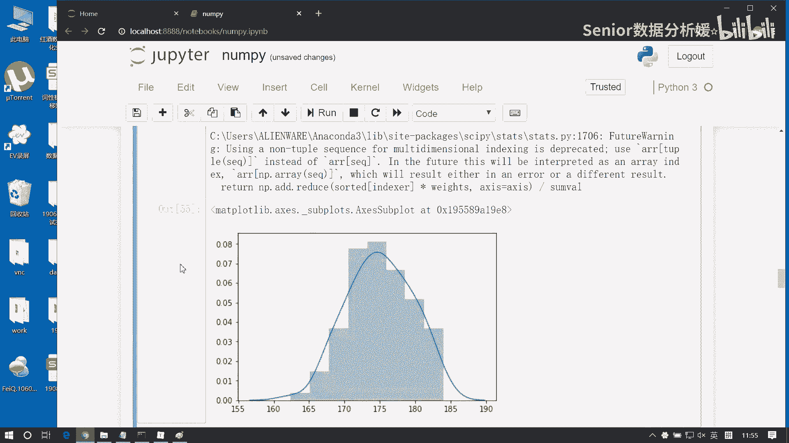

那么这个标准正态分布啊，我们在机器学习当中呢，它是有很有意义的啊，因为标准正态分布的数据呢，一个是它的量级都是在零左右啊，并且呢这个数据量这个数据小啊，它能够表达我们数据的分布规律，那除此之外呢。

我们还能够啊，算法一般通，就是对这种这个符合正态分布的数据呢，它的运算上这个迭代次数会少，而且这个呃这个准确度也会有所提升啊，所以说一般我们都会去做一些，正态分布的一些转换，包括什么指数变换。

对数变换什么啊等等一些变换方式啊，可以把它变成这种符合正态标准态分布的啊，然后另外呢，还有一组是我们生成0~1的随机数啊，0~1这个数呢在数学上也很有很有用啊，因为0~1可以表达很多事。

比如0~1我们可以表达这个比比值对吧，可以表达概率啊，然后呢也可以表达一些这个色差，或者是透明度之类的啊，很多事都可以用零和一来表表示，还有一些噪声啊，也可以用零和一来表达，比如NP点random。

点random，它默认就是生成0~1之间的数，然后你想生成多个的话，我这个size可以给他指定一个，比如说三行四列啊，那这些数呢都是0~1之间啊，当然一般我们可以使用它做一些变化。

比如说我想生成-1~1之间的数，我们怎么是怎么变呢，-1~1，我可以用它呀去乘以一个，你看它的，因为它的取值是0~1嘛对吧，它的取值是0~1，那我想把它变成一的话，如果如果是一的话啊，如果是零的话。

我减个一是一了，那如果是一的话，我减个一的话就是零了呗是吧，就是也说我取最小值的话，这因为这个值是0~1嘛，如果我取最小值的话，那么我减一的话生成的是一，如果我这个取最大值的话，我减一生成是零。

所以我想把它调到-1~1之间，我这边可以乘以一个二是不可以啦，乘以二的话，我取我这个最小值，如果是零的话，那么这是00-1是一，如果是一的话，那么2-1是一对吧，这样我生成这个数就是-1~1这个区间啊。

当然这个地方呢可能大家会觉得奇怪啊，就说我一个数组跟一个二相乘，那得到的结果是啥呢，对吧，大家可以看一眼啊，其实这是南派的一个特性，南派的数组啊是可以直接跟数据直接运算的，这个是广播，下午我们会说啊。

可以先来了解一下，比如说我们来一个NP点ones啊，这个shape让它等于两行两行两列啊，你看我们生成是四个幺对吧，他如果乘以个二的话呢，会变成二二，就是可以对每一个元素进行一个乘法运算。

对你同样也可以，比如说我做一个减一操作，那就变成了零零啊，他这种叫广播机制的运算啊，这个这个大概可能需要适应两天，好声音不同的嗯。

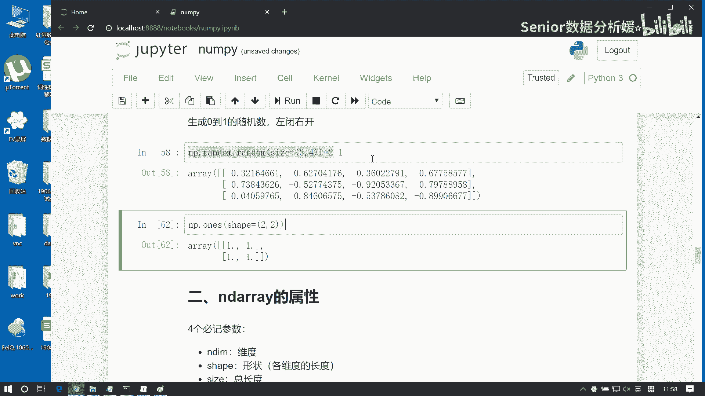

好那另外呢咱们这个南派array呢有几个属性啊，我们要要记一下啊，我们额生成一个数据啊，我ray等于NP点random点rando int，我们从0~10，我们生成一个三行四列的数组。

啊这是三行四列的数组，然后呢它里边有几个属性啊，就对于这个南派克的对象，那么第一个属性是维度，维度是二，为什么是二呢，因为这是三行四列对吧，那如果你再写一写一个维度，写个二，这是几维了。

是不是三维了对吧，这是三维了啊，然后形状那顾名思义就是这个值啊，我们用博瑞点shape是吧，这是它的形状，然后总长度呢那就是元素的个数的总和，size相当于求那个length对吧，元素个数的总和啊。

然后另外一个就是我们这个元素类型d type，它是整数是吧，为什么，因为我们这是run int生成的是整数啊，那比如说我们再换一个，比如说a arr等于NP点格瑞，我们生成一个一二，然后再来一个字符串。

Hello，那这时候会会什么类型啊，它是什么类型啊，是不是字符串类型啊，因为为什么，因为他会强制类型统一对吧，我们把这个array点d type求一下，是不是啊，这是一个字符串类型啊。

我们看到这种U打头的是吧，这就是字符串的啊。

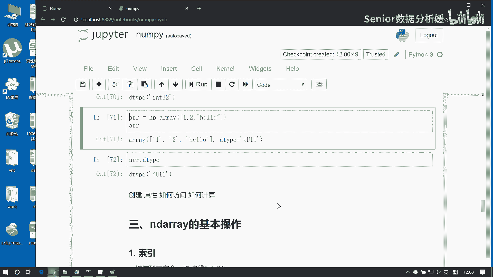

嗯好了。