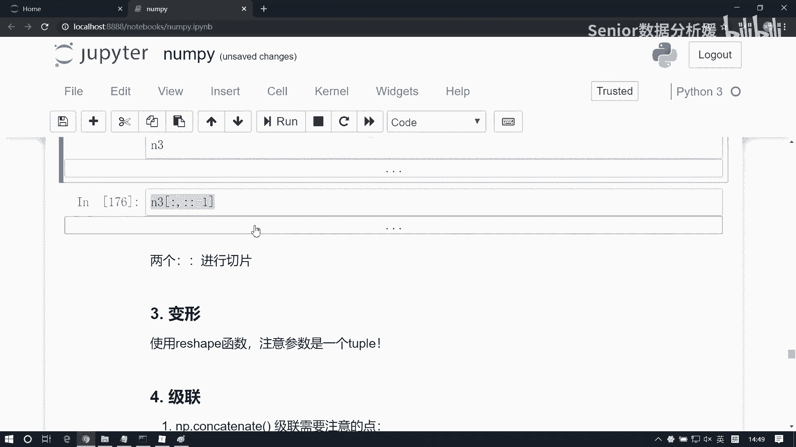
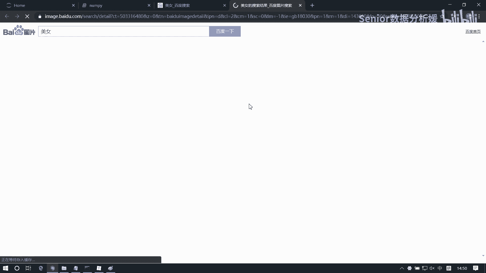
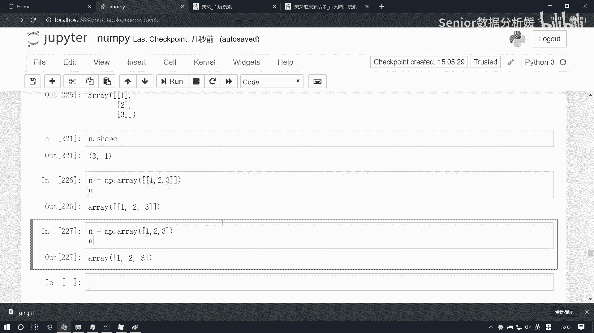

# 数据分析+金融量化+数据清洗，零基础数据分析金融量化从入门到实战课程，带你从金融基础知识到量化项目实战！【入门必备】 - P25：05 numpy基础-数组访问 - Senior数据分析媛 - BV1Ak61YVEYX

好困的，想想招啊不行，旁边捏下大腿啊，要是那个女孩子就别别捏了啊，咳咳啊，互相那个照顾一下啊，照顾一下啊，同你同学困了啊，你好你同桌困了，然后你在那听着特别这个，如果那个对你听特别起劲，这是你的罪过啊。

啊你得恨他，你知道吧，你看你一个人困的丢当的，然后你看你旁边听的特别认真啊，这不气你的吗，是不是没法精神一点啊，精神点啊，这个我们接着看啊，这个南派葛瑞的一些基本操作啊，上午我们主要是介绍了几个。

咱们这个南派格瑞的一些构造方式啊，那么构造方式我再强调一下啊，这里边呢我们要要必须要记住几个呃，一个是我们我们它基本的构造方式，以及它的一些特性，就是它呢有一个这个类型强制统一的特性啊。

这个大家必须记住，然后我们一个列表怎么去转成一个南派array啊，然后另外呢这个我们还要记住几个，咱们常常见的构造方式啊，一个是我们NP点vans啊，用它呢我们可以去生成一个。

就是它主要是侧重于形状的一个一个测试啊，就是我们生成这样一个形状，然后呢值呢可以你做一些这个修改修整了，然后另外呢就是我们这个两个啊，这两个这个等差数列的构造方法，一个是length space。

一个是arrange，这两个函数啊，必须得记住，然后另外就是我们下边这几个这个随机函数，一个是随机整数random点RANDOINT，以及我们这个random点random啊。

那么这两个函数都比较常见常用的啊，其他那个正态函正态分布的话，你可以慢慢记啊，另外呢还有我们南派array呢有四个属性，四个基本的属性啊，一个是获取维度，用NDM，一个获取形状，用shape。

还有获取总长度啊，相当于我们用line求它的长度啊，size元素个数，然后以及元素类型用d tab，那接下来呢，就是我们这个南派的一个基本操作啊，首先说访问的问题啊，先说访问的问题呃，那列表怎么访问的。

列表是我们根据索引访问对吧，嗯就来个L1啊，等于一个list好，A b c d e，那我们想访问第一个元素，我可以用L1，然后然后这个中括号零啊，这是访问元素啊，呃那这个列表呢。

它的像就是但凡我们能够提供这种索引访，是索引访问的啊，像这种结构呢啊它呢我们又叫做什么呢，又叫做这个，叫这个叫隐式访问，叫i lock，这个这个所谓的i log呢，它指的是什么。

指的是这个索引位置的一个访问方式啊，那为什么可以用01234来访问呢，这块啊我展开说一下啊，其实我们这个任何的数组啊，它在内存结构当中呢，它是以这样的一种方式存储的啊，是存储的，然后那这个01234呢。

它其实记录的是一个什么偏移量问题，所以你会发现有个有个奇怪的现象，就是计算机为什么是从零开始插入的啊，01234是吧，这个可能比较反人类啊，你正常人类，你看我们从从小学学习的时候。

都是从123456789是这么学的对吧，查数也从一开始查，那计算机为什么反其而行呢，为什么从零开始查呢，这是由它的设计原理来来说的啊，因为我们这个任何一个数组呢，它的它是有一个地址的这样一个概念的啊。

当然像Python里边我们把这个地址这个概念弱化了，基本不提啊，不提它为什么不提它呢，就因为地址这个玩意特别恶心，特别难难学啊，所以为什么说C语言和C加加难学呢，其实很大程度上呢。

因为是他在操作这个物理地址，所以他比较难学啊，那地址的话其实你要是想简单理解的话，很很好理解啊，但一旦这个涉及到一些复杂操作，可能就麻烦一点，我，所所以呢我们可以这个简单理解一下，这个地址啊。

什么是地址呢，就是我们这个内存条啊，它在出厂的时候都会有一个编号，这个编号一般都是用16进制来表示的，比如零X1100AF等等啊，是这样一组数字，一个16进制，16进制啊，那每一个计算机呢有两个单元啊。

有两个基本单元，一个叫什么呢，一个叫这个处理数据的基本单元，然后还有一个叫什么呢，叫，存储数据的基本单元，这两个有什么区别呢，这个位不一样啊，统计的单位不一样，处理数据的基本单元呢。

我们把它称之为bat，我们说我们常说那什么1024啊，251啊，256啊，512啊，还有什么1G2G3G4个T，八个T的这种是吧，这个指的什么呢，这个单位指的是这个bat字节啊，bat字节。

然后呢我们存储数据呢，一般我们用beat叫小字节，贝塔啊，那这个这两个之间有有什么换算单位啊，知道吧，八倍的V8倍的贝塔就等于什么，等于一个beat对吧，那么八个贝塔是什么呢。

相当于是一个在C语言当中叫差类型，那么我们其实我们像我们那个，像Python里面存储一个字符，存储一个字符，那么他用的是什么，他用的就是一个就是占了这个，啊不不是啊，就是就是相当于是一位啊。

就一位来存一个字符对吧，一一位来啊，一位来存一个字符，那这个位指的是啥呢，指的位就是这个bat，而不是这个小B这个bate它是个二进制单元，所以我们说说一位能把表示多少数呢。

你像我们阿斯科码表里边那个表示符号，那边一共有多少个，是不是256个呀啊为什么呢，因为二的八次方就是256个是吧，为什么28次方，因为这是一个位，一位能表示一个字，一个符号。

一个一个一个这个英文符号的话，它它是什么，它是用八个二进制位来存储的，所以说它能表示二百二百五十六个啊，最多可以表表示256个啊，所以说阿斯玛表示他不会超过这个数的啊，那这是一个基本的啊。

一个基本的前提，我们理解这个之后，那我们才能知道这个地址，这个地址指的是啥呢，它指的是这个每一个二进制位，它都会有这么一个地址啊，每一个二进制位都会有这个地址，那比如说我们想表示一个字符的话。

那它不是要占八个位吗，对不对，他占八位吗，那八位的话，也就是说你这应该有说有这个八个二进制位，这是八大进制位啊，那这个八大件之位呢就会有八个地址，但是呢他不会用八个地址来表示，这一个一个字符。

比如这里面就存了一个A，他不会用八个字节来表示啊，它指什么，他只用这个第一个位的这个地址，来表示这个八个字节啊，那那你那就是说如果你要存的是这个，比如说四个字节。

比如我们说int int类型是不是在四个字节啊，那四个字节的话，那它就是每每一个每一位的话，是每一个字节是八位的话，那四个字节就是32位呗，对吧，所以说我们说一个int能表示多少数据啊。

这是二的32次方这么多个啊，当然了，还有个表示范围的问题，因为你还得扣掉一个正负号的问题对吧，所以你扣掉正负号的话，然后那它应该表示就是这个这个应该多少啊，应该是负的二的30一次方。

到正的二的30一次方减一对吧，因为还有个零，是不是零得扣掉一个，所以得扣掉这一个数啊，所以这是它的一个表示范围啊，那如果是用整数的话，那显然它应该是占四个字节，那这四个字节的话应该多大呢。

应该是这么大对吧，这一共是32位，那同样的这个整数，它它表想表示这个地址的话呢，他也要用这个就是第一个位，二进制位字节来表达它的一个地址啊，那么有了这个前提呢，我们就能理解这个它是怎么。

为什么用01234来表达数据的啊，他那个01234呢，所所谓的01234，指的是我们每一个元素，距离首地址的一个偏移量啊，那比如说我们现在是这个一个字节的那个int啊，它只占一个一位啊，就一个BT。

那比如说这是一一个数组，这儿一个这儿一个这儿一个这一个啊，那我们知道每一个字节呢它里面占了八位啊，占八位，那我这个我的首首位的话呢，它的地址应该就是你比如说0X1100啊。

那这个首位呢就是0X110几啊，是不是零八呀，是零八啊对吧，因为这边还有七个是吧，那他的首地址呢就是0X11，比如那就是零就是幺幺几了，要六了，对不对，幺六了，那我就简写啊，简写。

那它的地址就是就是就是零，他就是八，然后他呢就是16，那这就是24，然后再往后就是32啊，都这么表示的啊，那它是比如它是第一个元素，它是第二个元素，然后呢我们想想去找到第二个元素的话。

那么数据是应该是我，我第一个位置跟第二个位置我算一个什么，我算一个，我找只要找到地址就找到这个元素了对吧，那他俩之间我就算个什么算个差啊，我8-0，那得到几啊，是八对吧，得到八。

那偏移量就偏移量为什么不是八呢，这是零，这是一偏移量的话，我们得这个这个地址的一个差啊，再除以什么呢，除以我存储这个数据的大小，那它占几个几个位啊，是八位啊，所以它的值就是一，那你这么算下来。

它的值就是二，它值就是三，它就是四，那我第一个元素的话，那就是0-0呗，对吧，它再除以八，它就是零啊，所以说我我第一个元素的话永远是零，为什么呢，因为它距离我第一个元素的首地址偏移量是零。

那第二个的话偏移量就是一，第三个偏移量是二，那这个这个道理你你在任何的，比如说你八个字节的或者是四个字节，然后16字节道理是一样的啊，那web就这个倍数会可能会变一些，如果你是四字节的话。

那它的首地址就是零，它就是32，那它就是64对吧，你减，然后那你最终除的数，也是也是会随着它会变化的啊，所以最终得到偏移量永远是统一的，就01234啊，所以呢这个数组的访问方式呢。

都是以这种方式存储的啊，所以说呢只要是我们以能够用这种，顺顺序的方式来表来表达数据的话呢，我们都是用01234可以直接访问到元素，这个东西呢，它可以拓展到二维数组上，因为你二维数组。

它的存储逻辑呢跟逻辑结构是不一样的，比如说我们是一个两行三列啊，两行三列，那么这是它的位置是000，这是零一，这是零二，那这块呢就是幺零，然后幺幺，然后幺二对吧，从这个逻辑上讲的话，它应该是一个什么。

应该这样的一个矩阵，两行三列对吧，但是从存储上讲的话，他们其实依然是一个顺序结构，那对于这种结构来讲，你依然可以通过指针的办法，通过偏移量23456，依然能找到它啊，就依然能找到它。

当然这个是在这个C语言的语法层面上，是支持这么做的，它得用指针来干啊，但是我们Python里边不支持指针，所以这么干呢啊可能拿不出来啊，但是呢如果我们在这个写这个，如果你在做这个数组访问的时候。

如果有的时候你发现越界了，却却能拿到拿到值的话，尤其是在这种高维数组上啊，那么你就要知道原因，为什么能拿到，就是这个道理啊，因为它是顺序存储的好了，这是一个扩展啊，大家去了解一下。

那咱们这个Python的列表呢，它是被优化的，它呢也可以通过这种方式来进行访问，但是array的话呢是完全是因为它是顺序结构，所以它也能这样访问啊，我们把这个L1生成一个南派瑞L1，我们得到一个N1。

然后N1他想访问第一个元素，我依然是用零啊，一样能拿到它，好，嗯好这是一维数组啊，他的访问呢其实这个就比较简单了啊，那难在什么地方啊，难在我们这个多维数组的访问，我们来看啊，多维数组，那怎么访问。

比如我们先构造一个多维数组NP点，我们用这个random点，Round int，我们生成一个二维数组啊，我们从0~100，我们去随机生成一个五行五列的数组，我把它保存为N2，然后这呢我做一个展示。

size等于啊，这是一个五行五列的数组啊，现在呢我们如果想访问这个，比如说想访问这个32啊，访问62吧，访问62，你怎么访问呢，二维数组是怎么访问的呀，二维数组是这么访问的啊，这个N2。

我们说我们是不是可以把二维看成一个，特殊的一维啊，你想找到62，是不是得先找到这个这个数组的第二个元素啊，对吧，那我们先拿到第二个元素得到的就是什么，就是913262595这个元素是吧。

那这个元素因为它同时又是个数组，所以我想访问里边的62，我在后边接一个二，是不就拿到了，这样就访问到62了啊，那这种访问方式呢，是是这个Python列表的访问方式啊，是这样一种方式。

那咱们南派呢有更更简单的办法，可以直接这么干，N2，也能拿到看了吧，我直接写个幺，写个二，那这个东西怎么去怎么去理解呢，啊这个因为我们这个数组它是一个二维的啊，它是一个二维的。

那我们这种方式来表达索引的话呢，它属于一个复杂的一个索引表达方式啊，我们之前的索引是01234，这个东西很好理解，那这个东西它第一个位置的数，表示第一维的位置，第二个位置的数表示第二维的位置啊。

所以我们访问的是你这个你这个数的什么呢，就是第二行，第三列的数其实跟这个道理是一样的啊，但是呢虽然说拿到的数据是一样，但是呢这个本质是不一样的，这个是什么访问呢，这个是这种属于间接的访问方式。

为什么间接访问呢，因为这里面你是先拿到了谁啊，你先拿到了这样一个对象对吧，我在这个对象基础之上又拿到了，又拿二才拿到62对吧，所以相当于你是先找到这个人，然后通过这个人再找到他啊，是这样找到的啊。

那这种方式不一样啊，这种方式我直接就访问了啊，他描述谁，我就找的就是N2这个数组的第一，这个就是第一维的啊，这个索引为一的位置，然后加上第二维的索引为二的位置，我直接找到那个位置啊，这是不一样的啊。

这个逻辑上是不一样的，这种叫直接访问，在这访问元素啊，嗯所以以后呢，我们可能会常用这种办法来处理啊，而不用这种啊，间接访问呢往往是不靠谱的，为啥呢，因为间接访问他跨了一个对象出来啊，这边有什么问题呢。

我还是解释一下啊，我们这个上面那种方式啊，他是大大概是这样子的啊，比如说这是我们原来的那个二维数组的内存，然后呢这里面有两个数组，那这是一个数组，然后这是一个数组啊，这是个二维数组啊。

然后现在呢我们间接访问什么呢，比如说我想访问里边的啊，想要访问这个元素吧，我想访问这个元素呢，我是先这么干，我呢先去把把这个对象啊先找出来，得到一个引用对吧，拿到一个引用，然后呢我再对这个对象啊。

再去访问一下，我拿到这个引用，啊这个值是我取出来的啊，而我们第二种访问方式是什么呢，是直接找到这个对象，给他就拿出来，这叫间接，这叫直接访问，上面这叫间接访问，间接访问会有什么问题。

这个对象是从这引用过来的，这个对象从这引用过来的，所以这里边如果中间环节出了问题，那可能会导致你这个对象也会出问题对吧，而这种不会这种不会啊，你这种这种的我就是直接访问的，是你没有那个中间环节啊。

没有中间商赚差价对吧啊，所以有了中间商，他里面做了什么动作啊，咱就不知道了对吧，咱也不知道他怎么赚的的钱是吧啊，其实特别坑是吧，中间商赚差价啊，像有一次我那个我那个之前卖我那个二手车啊，在这上面放啊。

说你这个车就那个可以给你摆到那个多少钱，我就不说了啊，想想先富一样是吧，不到100万啊，不到100万啊，3万也是不到100万啊，然后然后他那个税扣的特别狠的，有我那辆车如果在上面摆的话。

那个他他得扣我多少呢，这差不多是10%的一个费用啊，差不多10%的费用啊，如果你20万的车相当于扣了你2万，知道吧，30万的车扣你3万是吧，你正常你车，你要是比如你要是22万能卖的，卖的出去的话。

那么你到手只能20万，所以他那个中间商就特别特别讨厌是吧啊，天天说什么不中间商不赚差价，不赚差价，他就是最大的中间商是吧，你还不如找中间商呢，找找中间商赚1万5啊，他不是中间商，他赚2万。

他赚你服务费赚2万啊，啊大家要明白这个道理啊，就是我们不要这种间接处理啊，因为间接处理的话，这个中间环节会会出问题啊，尤其是我们Python里面各种引用对象对吧，各种引用啊，那你说比如我想操作它。

我操作它的话，那么它对这个原始数据是不是有有修改呀，这个取决于什么，取决于你这个对象是引用对象还是副本对象，对不对啊，还有还有个问题就是就是咱们这个门派里面啊，如果你这个引用层级特别多。

他会告诉你会有潜在风险，他会不支持你这么干啊，所以说我们尽量用什么，用这个他给我们提供的方式来处理啊，那我提供一个原则啊，就是什么时候用直接，什么时候用间接啊，这个道理在任何情况下都适用啊。

任何时候都适用，任何语言都适用啊，间接访问，如果你是只读只读，可以用间接，怎么怎么得劲啊，你怎么合逻辑，你怎么写啊，那如果你是要做赋值操作，必须用直接访问，啊必须用直接访问的办法，咳咳咳。

这还有包括像我们那个面向对象编程里边，像什么什么这个啊对象的属性啊，对吧等等啊这种东西啊，那么我为为什么要提供一些属性访问的方式，那有一些提供属性访问的机制。

你为什么要额外提供一些什么set get函数啊，为什么要这么干呢，就是因为为了去避免一些间接和直接访问的一，些问题啊，所以他都是有有这个原因在里面的，所以啊那这里边呢又涉及到这是元素的访问啊，元素访问。

那这里边呢又涉及到什么呢，还涉及到这个行访问和列访问，行访问很简单了啊，比如说我们还是拿这个二维数组为例啊，这个N2，N2，现在呢我想访问其中的，比如说这一行，那我直接去拿这个二就行了对吧。

我直接得到这一行啊，那如果我想做列访问怎么办呢，我想访问某一列，比如说想访问八十八三十二九这一列，这个怎么访问呢，你用那个二维数组的话，怎么访问的，怎么弄啊，咳咳这里面我们可以借助切片的办法啊。

我可以什么呢，这样干啊，冒号逗号一拿到就是八十八三十293 15，看清了吗，是这一列啊，那这是什么道理呢，切片大家知道吧，那它也是一个维度的问题啊，你看啊，这个我们用这种逗号间隔的方式呢。

表示的方式就是我第一维怎么取，第二维怎么取，第一位怎么取的，从头取到尾对吧，然后第二位我取什么，我只取索引为一的这一列对吧，所以我拿到就是第二维啊，那像这种情况呢，也可以套用这个机制啊，它怎么取的啊。

我只取了第一维的索引为二的那一行，第二维数没动啊，没动就默认全取了，是不是，那同样这个也是一样的，我第一位只取了什么索引为一的那一行，第二维呢我只取索引为二的那一列，所以我得到的是一行和二列交叉的。

那个点的元素是吧啊，这都可以套用的啊，好访问列访问啊，那这呢是比较简单的，那还有一些复杂一点复杂一点的啊，比如说我想访问多个元素，访问多个元素啊，那这里边比如说我想访问，看看啊，比如想访问3262。

然后9~12，这这四个数怎么办呢，还是借助这个道理啊，记住这个道理，依然依然利用切片的方式来对它进行处理啊，那么低维我怎么办啊，低维我说从这一行切到这一行啊对吧，那么这个咱们索引切片一般都是什么。

是不是都是避开这个左闭右开啊，是吧，索引切片啊，都是左闭右开区间，所以说这边那零一我们从一切到二切到三吧，是不是一切到三，那这切的是谁啊，是不是中间那两行啊，是吧，九幺和四幺这两行，然后呢。

紧接着第二维你还得表示用逗号隔开是吧，第二维我们从这是0123，他是不是还是一三啊，一冒号三，这样我们拿到这个元素了啊，多个元素访问啊，那除了这个之外呢，我们比如说我们再换个需求啊，再提升一点需求。

还是拿这个N2，现在我想拿32和五这两个值，或者我想拿三十二五，还有96这几个值，这时候可就麻烦了对吧，那这里边呢我们要介绍他另一个机制啊，这个我们先说一维的啊，先说一尾，从一维开始理解。

比如说ABCDE，这里边我们如果想去拿B和C这两个值很好拿，直接我们去做切片就行了，比如我们从这个一切到三，这样是把BC拿出来了对吧，但如果这里面有有跨度的，比如说N1，我们取B和D这两个值。

B和D这两个值啊，怎么拿呢，我们可以这样干啊，我们使用一个列表作为索引，取值，那么B的索引是几啊，一是吧，D的索引呢，三是吧，我们在里边放一下一和三，一个三，但你这样写不行，这样写表示什么是第一维的取。

取这个索引为一的那个位置是吧，这样是是二维数组元素访问，你要把它变成什么呢，变成列表，我们拿一个列表作为索引啊，把这个拿过来，这个index我们叫这个啊。

然后把这个index function我们取出来，就是B和D等到三还可以再放啊，比如你再放一个放一个放一个2BDC是吧，那比如你再换一个，比如再放个一行不行，BDCD看了吗啊，你发现什么这东西有意思啊。

有什么意思呢，你这边可以随便去取值，可以调这个顺序就再换一下啊，index1等于121212，然后我们拿这个index1去取BCBCBC，看到了吧啊，那同样道理，这东西呢它也适用于二维数组啊。

二维数组我们来看二维数组取取法啊，N2，比如这里边我想取88和五，这两这两列的里边的额，这个好吧，取这两行吧，取这两行里边的，比如32和九这两个值这样子啊，那这边呢我可以借助这种办法来处处理啊。

那第一维我们放什么呢，放一个列表，那这是索引为一，这是索引为二对吧，我可以写个一，写个二，然后再加个逗号，比如说第一为我现在不是切片了，我是取两个值对吧，然后第二位我取谁啊，零一就取第一列对吧，写个幺。

能看明白吧好那么，现在如果我想取这个，329和五和16怎么选啊，不还是一二，后边是什么，三二和九是第一列对吧，五和16是第几列，三是不是，这是一和二，然后我们要取3295和16，那这里边应该是。

零幺取它的第一列对吧，然后再取它的第三列是吧，哎怎么又是这个，很好啊很好，这我得放一边了，然后呢TMMP进入我，一和二，这样是能取的哈，看这个啊，四一和三哎，一和三取不了啊，啊，这样能取是吧。

嗯这个还得变通一下啊，直接选F行，读不出来，那我们先可以先把这个二维数组取出来是吧，然后呢再去做什么，相当于做这个列方向的这个处理啊，就是第一第一维就是不动对吧，然后我们第二维取这个一列和三列啊，好。

这是我们这个用列表来做索引，的一种取值办法啊，这个列表呢还有一种变化，就是用什么呢，用布尔型的列表来访问，我index3，用布尔型列表啊，我看一下啊，还是比如我们拿先拿这个一维的来举例啊。

这里面有ABCD有五个值，那我这个数组呢它也得写五个值啊，就这个几个处false，然后true false，再来一个false，好好拿这个index3，我们用它去访问这个N1啊，你看会发生什么。

主要是什么，A和C为啥是A和C呢啊，因为我们这个A的位置对应的是true是吧，然后B是false，C是true，D和E都是false，它会怎么样，他会把这个true对应的值给我们返回，他会被直接返回啊。

那这样的话呢，比如说我们拿这个N2为例啊，以N2为例，那N2的话，如果我们把这个index3给它，会得到什么，那就把对应行拿回来了呗，是不是就把这个是不是第一行和第三行啊，第一行27这行对吧。

第三行是不是41这行对吧，那如果前面我接个冒号呢，这位拿什么是第一列和第三列啊是吧，用布尔列表来处理啊，那这种处理逻辑呢大家一定要注意啊，这边有几个问题啊，首先就是我们这个布尔列表。

必须在你访问那个维度上，它的长度必须一致，比如这块我变成了四个，我这样在访问是不是不行了不行了，为什么呢，因为我这个N1有几个值啊，有五个值对吧，就是我在访问这个数据的维度上有五个值，还有五个值。

而我这个index它只有四个是吧，所以它对应不上啊，这块必须得是整齐的，这样我才能访问啊，才能正常访问，所以这我们要加个注意啊，注意啊，在访问的，维度上啊，这个布尔列表的长度必须和该维度匹配。

那比如说我们现在把这个N2N2，先是五行五列对吧，我们再来一个N3啊，N3等于NP点，random点，Round int，然后0~100，我们生成size等于五行四列，N3524列。

那现在我们那个index3，它是五个值，它能访问行还是能访问列嗯，它可以访问行还是可以访问列啊，他说只能做行访问啊，因为它跟跟一维的这个长度是一样的啊，一维它是几啊，说1234是五行啊。

二维是123444列啊，所以这时候我们N3你直接去写这个index3，这是能访问的对吧，但是如果你你做列访问冒号逗号，这样是不是就不行了，嗯就是因为什么，因为你现在访问的是列，你这个N3N3。

它的shape第一位是五，第二维是四，而我对一代人是五，所以我只能访问第一维，是不能访问第二维啊，看明白了吧啊，这块可能变化比较多啊，废话比较多，然后呢我们梳理一下啊，说一下啊。

总结一下我们这个访问的机制啊，总结啊，第一条，这个，呃，南派array可以，保持与这个Python列表，的访问方法啊，但是呢要注意这个高维数组的访问，可能存在潜在风险，那么这里边我们用什么呢。

我们应该用这个第二种方式啊，就是用什么用直接访问，直接访问怎么访问呢，直接用以列表的方式，表示索引，这个地方怎么表示呢，这表示，D0的lock，然后表示第一的lock，然后第二的log点点点。

明白我的意思吧，就是第一维的索引位置，第二维的索引位置，第三维的索引位置，以这种方式来表达索引啊，来表示索引，这儿呢是多维数组啊，直接访问元素的办法啊，那另外呢就是这个行访问和列访问，三这个多维数组的。

在这个行或者是列访问这边，当然也包括更高维的啊，那但是更高维的话我们就不讨论了啊，没有意义，因为我们一般就是访问行和列，那如果是行访问的话呢，就是第一维呗对吧，我们直接来一个N，然后直接给出一个。

roll index好，如果是列访问，就是N我们直接写这个call index啊，一个是行的索引，一个是列的索引啊，如果你想访问多行，怎么访问呢，N然后写个列表，Roll index1。

然后roll index2，如果访问多列，里面依然是以这个列表的方式啊，这个是call，Index1，然后call index2嗯，这能看懂吧啊，然后另外呢，我们也可以支持什么布尔列表访问啊。

布尔列表访问它也支持行和列啊，那道理是一样的啊，行访问，N直接写上这个布尔列表，如果是列访问，N然后什么冒号在逗号再写这个布尔list，那这边我们要注意什么呢，要注意的就是，咳要注意这个啊，那基本上呢。

精精髓都就是在这一个总结里边了啊，把这些搞清楚就行了，那这里边呢可能哦一个是我们元素的访问，用逗号隔开，然后如果是多个元素的访问，用列表啊，多元素访问云列表，然后还有知识就是这个布尔列表的访问啊。

布尔列表访问，它是把这个true对应的值直接给我们返回，然后也一定要注意，布尔列表的一个与访问那个维度，值的一个长度啊，它它这个在这个高维数组当同样适用啊，那我们简单简单举个例子啊。

比如我们来个三维的N3等于一个NP点，random点RINT从0~100，然后我就size等于543嗯，这是我们N3啊，543，现在呢比如我想访问这个，想访问这个77，那你怎么访问呢。

77这个在哪个位置啊，第一维他在哪个位置啊，第一维索引应该是几，是不是第一个元素啊，你这个数字怎么看呢，它第一维是五，那它就是你应该把它看，把这个整个这个数组，看成是长度为五的一个列表呗对吧。

那这数数第一个，第一个二维数组就是第一个元素，第二个就是第二个元素对吧，然后这就是第三个元素，这是第四个，这是第五个，现在我想访问的77，是不是在第一个元素当中了。

所以我们是应该先把第一个元素先拿出来对吧，然后这个元素基础之上，我们在访问诶，H值怎么变了，啊我又随机了一次是吧，嗯啊又又变了啊，这样拿过来啊，N3现在我想访问这个13啊，访问13。

那我现在是得先访问第一个元素啊，是把第一个元素拿出来了，然后在这个元素基础之上，我想访问那第二维它是在哪个位置啊，第二维这是就是这第一行，这第二行，这第三行它它的索引数就是二啊，找到二是不是找到它了。

然后第三位又在哪个位置啊，这是零，这是一，这是二，是不是在在一呀，再写个逗号一是不是出来了啊，啊01021啊，嗯啊就是更高维的话，那道理也是一样的啊，就你找到那个索引位置就能把它找出来了。

我再来个练习啊，我们看看啊，比如说现在我想访问这个六八和四零，这两列怎么写，怎么拿这值呢，怎么写啊，N4，然后里边写什么写什么冒号对吧，第一维我全留下对吧，每一行都留下，然后第二维怎么写。

我可以写一和三，是不是把这两例拿出来了，或者什么呢，还没有别的办法，可不可以用布尔列表访问，冒号逗号，这写个先写个false对吧，第一列不要，第二列要，第三列不要false，第四列要true。

是一样的啊啊嗯，呃那比如说我现在想访问这个21和和八，这两个值怎么访问呢，我可以先把这一行拿出来，对不对啊，那就是N4，我先拿这一行，这就是0123143啊，把这行拿出来啊，这行里面我在干嘛呢。

我再做一个，这是012，是不是一二，就把这个值拿回来了是吧，或者怎么样，或者做切片一冒号三，啊这是不应有括号啊，应该是一冒号三是吧，啊切片没有括号啊，嗯好了，那这样的话我们这个切片也就好办了啊。

切片其实道理是一样的了，那我们比如说我们还是拿这个值来看啊，看到切片一维数组的切片和二维数组是一样的，N1那它切片我们从B切到D的话，怎么切，直接冒号一切到四，是不是，就是你记住什么这个左闭右开就行了。

对吧啊，索引都是左闭右开的啊，什么时候是左左闭右闭呢，标签才是左B右B，但目前我们接触不到标签啊，因为咱们Python列表是没有标签的，只有字典有对吧，字典能不能切片啊，咱们这也能切片，不。

最后写一个字典啊，比如说这个Python，199，Java200，然后C30，这是个字典，这个字典能切片吗，啊C冒号java不行是吧，字典是什么，An hash able type sedence。

字典是不认这个东西的，所以咱们其实以前是没有接触过，这种左闭右闭区间吧，啊但是我们嗯很快就要接触到了哈，列表因为没有标签啊，所以说我们之前的其实我们之前的所有的切片，他都是左闭右开啊，都是左闭右开。

其实都不用强调啊，都是这样的啊，但是数据分析里面必须得强调，因为他切片方式会有变化，这是一维的，那二维的道理是一样的啊，我们这二维切片，那无外乎就是什么，就是你把这东西再加一维呗，对不对。

我先接前两列行，再切中间两列，前两行我们从零冒号到二，这两行拿下来了，然后呢再从一切到三，把中间两列也拿出来了，对吧啊，这是嗯切片啊，那切片呢有一个有一个这个方法啊，就是我们可以做什么呢。

用两个冒号来指定一个波长来做切片对吧，比如说我们这个来一个长度为十的啊，啊NN1等于NP点random点RANDOINT，我们从0~100，然后size等于十，这是N1，我们对它做切片。

我们可以间隔的取N1冒号冒号二，这怎么取啊，是不是每隔一个数取一个呀，步长为二，对不对啊，11取一个，隔一个数83取一个，再隔一个数26取一个，再隔一个四六，再隔个数50啊，这这是一个切片方式。

另外还有一个方法就是什么可以用那个冒号，冒号一啊，一这什么啊，这是倒的取，对不对，所以相当于是一个倒序输出啊，啊那那像这种切片的话，你不论是在二维还是三维，其实都一样的啊，我们举个例子啊。

比如说以三维数据为例啊，NP啊，N3等于NP点呃，这俩咱换一个吧，random点random，这是什么呀，这生成啥呀，是不是0~1之间的小数啊，我们指定一个size，指定一个，893，这是N3啊N3。

那么这个东西是个啥玩意呢，哈可能不太好看哈，对于这种数据来讲的话，我们比如说我们做一个切片冒号冒号一，这是这意味着啥，第三组，这意味着什么，相当于我们在低维上取了一个倒序输出对吧。

这样我们先用整数吧啊run int，然后0~10嗯啊在第一位上来个倒序输出，那这是什么样子呢，啊啊这太多了，我们三四吧，343啊，这样啊，那我们先先把这个N3先拿出来啊，N3是这样的。

然后呢我们对N3来一个冒号，冒号一，你看啊，这是这个是我们我们第一维，如果从第一维看的话，这就是一个一维数组，这是第一个元素，这是第二个，这是第三个对吧，我们把第一维做这个倒序输出的话。

那么就是把它放第一个位置呗，是不是，然后把这个690这个放到第二个位置呗对吧，然后呢，把这个721，这个二维数组是放到第一个位置啊对吧，那如果我们在第二位上做倒序呢，第一维你得有所交代啊。

第一位我们说不动啊，然后第二维我们取方方一，这意味着什么，我们在第二维上取倒数，你看啊，那第二维上，那我第一位数就不变了，它们这些值还不变，你看第一个数是721这组数据啊，是不是721这组数据为什么。

因为我这个行，这个第二维数组，现，说白了，就是我们对每一个这个二维数组，来做倒序输出呗，是不是，那时候我们需要把每一个二维数组都变成，上下颠倒，也就是说应该是592441，591在721，对不对。

你看是不是这样的，592441591721对吧，然后同样的这个元素是不是也要倒序输出啊，024632024632对吧，然后这个呢也是大于输出，632149632149啊，啊这样可能看的不明显啊。

那我们来个明显的啊，这个要炫技了啊。

来个明显的啊，找一个。

找一个我们都喜欢的哈，大家都快乐的美女，哎百度又不正经了啊，嗯哎呀好难啊，哈咳选哪个呢，啊这个吧。

啊。

来个腼腆一点的啊，照顾一下女同志啊，女同志感受啊啊放到B01里面啊，然后女孩子说不要照顾我感受吧，哈哈啊，这个是个girl啊，开玩笑啊，girl啊，公交不要不要生气啊，志哥虽然看起来不正经。

但其实志哥真的很真的。

我们先把这张图片导进来，其实一张图片啊就是彩色图片呢，它其实就是一个三维的一个数组啊，这个数组啊我们可以看一下啊，我们想导一张图片呢，需要导一个包，这就是一个扩展的东西啊，大家不用记啊。

大家可以先看着啊，然后上午我们说导了一个那个CBN，我导入一个这样一个东西啊，Matt plot lab，In line，我找了这么东西啊，那这个东西呢是可以让我们指定，就是我们的图像往哪绘制啊。

我们说了这个主Python notebook啊，它除了可以及文本代码，还有什么，还有图像啊于一身的这样一个文本编辑器啊，所以它很强大，那么现在我们就要去秀他的这个，展示图像的能力了啊。

我们先把这张图片读出来啊，这不叫个等于PLC点image read，girl们还是这个图像啊，咱可以看一下这个girl是什么东西，这是啥东西，就是一个南派array，对不对，然后类型是什么。

UINT8对吧，我们可以看这个girl它的形状，600×54乘三，那这是三维数组，对不对，三维数组数据是这样式儿的啊，然后那它的第一维第一维数就是行数啊，行数就是就是高啊，图片的高啊，对不对。

第二维数就是列数啊，就是图片的宽啊，第三维是什么，就是颜色，颜色呢是以RGB3个颜颜色来表示的啊，咱们计算机表示颜色呢有两种方案，一种呢就是啊但不论哪种方案都是RGB啊。

那第一种呢就是以这个JPG图像为代表的啊，那么他们的图像表达方式是由三个0~1的，浮点数叫float，32小数来表达来表示颜色啊，0~1这个区间表示颜色的一个饱和啊。

就是那RGB表示三元素的一个饱和程度，然后第二种表达方式呢，就是以这个PNG为代表的是三个，0~255的u INT8的来表示颜色，显然我们现在这张图像虽然不是PNG的。

但他这个表示方式跟PNG是一样的啊，是不是就0~255啊，就这样一组数啊，不会超过二五的啊，是这样的一种表达方式啊，那么这张图像呢我们可以把它画出来，我有PLT点A每日show，是吧，就这张图片啊。

这是那个姑娘啊，但是你可以让他大一点啊，我可以调一下这个挂布大小，像素不像素的问题啊，加小点六六，啊这是这个这个图片是吧，那这张图片啊，比如说我们现在想做这个，像刚才我们做那种倒序是吧。

比如说我们想要在行方向上来，来做倒序输出的话，那我们可以这样啊，这个我们叫GL1等于GL，我们对它做行方向的倒序怎么处理啊，冒号冒号一就行了，对不对，然后我们把这个再展示一下，Gil1，G r i l。

一是GIRLE是吧，是不是倒过来了，然后呢你想在二维上去变变化的话，那你怎么办啊，你加一个逗号就行了，对不对，第一维是不动啊，第二维冒号冒号一，哪个地方啊，再少个冒号啊，是左右变了，是不是左右变的是吧。

那你第三维如果变化会怎么样子，这个这个可能有点有点吓人了啊，有孩子报警了啊啊第三维的变成了第二维，变成什么变啊，是不是RGB在变啊，RGB变成了什么BGR，对不对，是这么变的啊。

所以你知道鬼片特效是怎么做的了吧是吧，很简单啊，啊这样看起来会直观一些啊，就我们知道这个数据变换意味着啥是吧，但这个图片展示啊，大家可以这个东西大家先不用负担啊，这个咱们咱们那个后续会讲这个绘图操作啊。

绘图操作我们再去详细讲它的一些，记它的一些详细用法啊，好然后我看下一个啊，这个变形啊，变形receive函数来变形，那这个变形也是比较常用的啊，有的时候呢我可能为了迎合需求。

不得不把一些数组做一些变化啊，嗯比如说来个二维数组吧，好N2，NP点random点，round int0到100，然后size等于嗯四行五列，4250，那这是一个什么，它的形状就是四五啊啊四五。

然后我们可以对它做变形，N2点reshape，那这里边四行五列的20个元素，我们可以变成十行两列，对不对，比如我可以写上这个括号，十行两列啊，这样就变成了十行两列，你也可以变成两行十列，是吧。

或者是五行四列随你怎么变都行啊，但有一个原则不能变对，就是20个数不能少也不能多啊，一个都不能少，一个也不能多，多的话就有问题，比如我变成五行五列行不行啊，不行，对不起啊，没有办法给你变成这个样子。

就是你得你得能变是吧，比如说你说你长成这个样子啊，长成我这个样子，我要变成林志玲，对不起，变不了啊，啊零件不够是吧啊，但你要说林志玲，我想变范冰冰啊，好像可以啊，好像差不多啊，你首先你自己得够啊。

自己的东西得够啊，然后呢这里面有一个有一个这个就是高级用法，怎么用呢，这么干啊，比如说可能我们经常会想把它们变成一列，变成一列或者是一行啊，我会这么干啊，我们那比如说像这种情况，我想把它变成一列的话。

肯定就是我可以直接点receive成这个20行，一列，是不是可以这么干啊，啊这边加个括号啊啊那你得算是吧，你得把这个东西算出来，就是那我我这个如果变成一列的话，我们应该是多少行，对不对，你得算一下。

那其实这个值你不用算，你直接写个一就行了，这一样的能理解这意思吗，哈大家真干脆啊，就是你现在想变成比，你现在想把它变成一列的话，那么你如果那列数你是固定的对吧，列数是固定的。

而且这个数数量也必须是固定的，所以这是不是个解方程啊，问啊现在有20个数是小学应用题啊，现在有20个数，我现在想把它变成一列，那么问他一共需要多少行，怎么答怎么算嗯，20÷111=20是吧。

是不是20行啊，对不对，你得算这个值啊，这个比较简单，比如说我们先换一个需求啊，比如说假设现在你有这个啊，你现在有一个这个三，有一个这个立方体啊，有一个立方体，然后这个啊换个魔方吧。

啊这个魔方呢是9×9乘九的啊，9×9乘九的一个魔方，现在呢我想把它变成这个一列给它排开，那我问需要排多少行，你说得算啊，是不是得算，啊那这么说吧，来个N3啊，NP点random点RANDOINT。

这个20啊，这个0~100的，然后这个size等于呃13，然后三，然后七好了，现在我让你把它变成一列，怎么搞，边上一列怎么搞，说得N3点receive啊，Receive。

然后括号前面是个未知数X然后后边是个一，对不对，我是不得把X求出来，X怎么求啊，是不得它一乘啊，13×3乘七啊，得到这个值对吧，这个值你不用算，你直接写一就行了，明白意思吧，它会自动帮你算。

是不是所有玩的扣一都能好看啊，挺帅的是什，我算一个哈，我算一个这个值啊，我把它保存一下啊，N4，那一样的啊，你等会我们再比上一下啊，看他的shape多少，273对吧，这值怎么来的，这值13×3乘以七。

多少73，我在你说四维数组是吧，还是怎么着，你说你说20啊，随便写，这样随便写，然后这块我再去receive，你看他的这个多少，七百七百怎么来的，20×5乘七是不是700啊，这个值是不是不用变了。

能理解这意思不还理解不了啊，这个三是吧啊，你们有什么疑问提出来，如果要求1339614，就是当你生成一列的时候，你就这么写就行，知道吧就行了，如果是一行的话也是一个道理，如果我把你生成一行的话。

N这个N3点receipt，那我这个我要把什么，我先确定行是一对吧，后边那个直接用一代替，这是一行对吧，你看他的save是什么，把它保存N5啊，看这个N5的shape是不一行700列啊，看完了吧。

就是这个一相当于是你自动自动联动啊，就是你你先想想变化的值啊，你只知道一个维度它是一列或者是一行，那么另外一个维度你就不用管了，直接写一就OK啊，它只适用于二维数组的转换啊。

那另外呢有一点我们需要注意啊，就是注意这个形状的表达，你像这种表达方式，它是几维数组啊，这是几维数组，一维还是二维啊，这是二维啊，是不是二维，你看是两个括号对吧，就是你只要你这个形状你求出来它是俩数。

它是俩数，那它就是二维，那对于二维数组为什么强调这个，因为二维数组你读取元素的办法是不一样的，比如说我想读这个八，你怎么读，你能直接读零吗，你得读零和零才能读出来，对不对，嗯得这么读才行啊。

但对于一维数组不一样啊，你看一维数组是啥，N6让它等于NP点，random点，Ran int，比如写个size等于等于十吧，啊0~10，然后sin等于十啊，你看N6的形状啊，N6点shape。

这是一维数组，看到吧，只有一个数，二维数组有两个数，看到了吧，一维数组和二维数组啊，这个访问方式不一样，那我现在想访问N6的第一个元素怎么访问啊，我直接写个零就能访问对吧，但对于二维数组不行。

二维数组是俩零才能访问到，1000，然后，比如这是12345，这是几位数组啊，这是一维数组对吧，那这种这个123这是几位数组啊，二维数组，这是这个形状是什么，什么形状形状形状是一三还是311。

是一行三列还是三行一列，这是三行一列，这不第一个元素，第二个元素，第三个元素吗，每个元素都是一个值吗，对吧，所以我一维数组有三个元素，第二维数组有一个元素，是不是三行页啊，N点shift是三幺啊。

那换个写法啊，再减上几列，第一这个第一维有几个元素数，就一个元素啊，那第二维有几个元素，1233个元素是不是在写上几列，是不是一行三列啊，对啊，那这个呢，这个形状是啥，忘这写的啥是啥，三逗号是吧。

这是一维数组是吧，这是二维数组，这是一维数组啊，他们输出的样子都不一样啊，比如这个我们输出一下是不是竖的啦，这是三行一列对吧，这个呢一行三列对吧，而这个呢一行啊，这是两个括号，这是一个括号啊。

强调这个就是告诉大家啊，在访问数据的时候一定要注意什么啊，注意它的元素的这个啊，这个数组的形状啊，因为不同的形状访问的方式是不一样的啊，嗯嗯好了。

