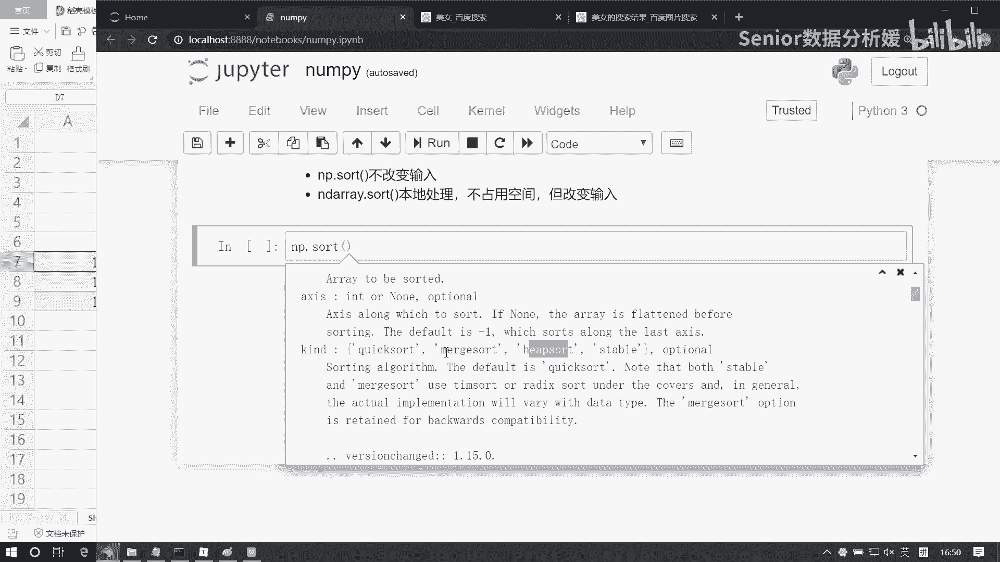
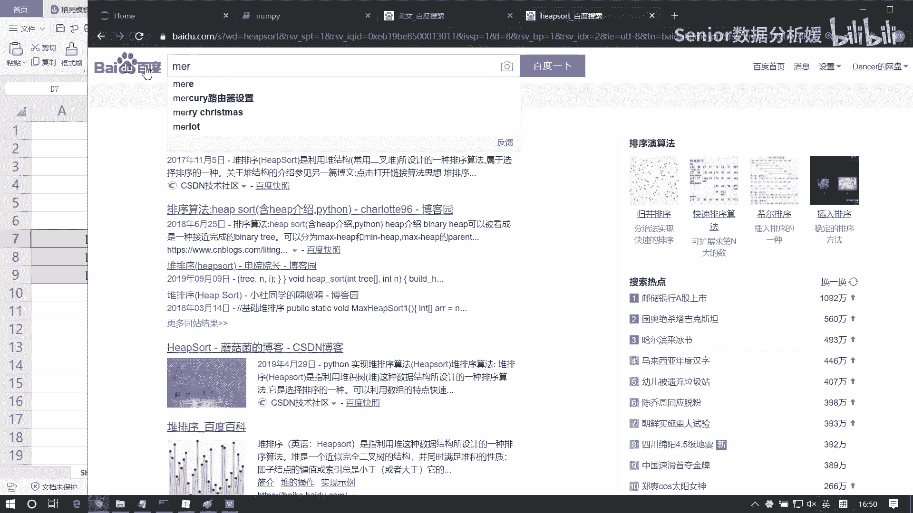
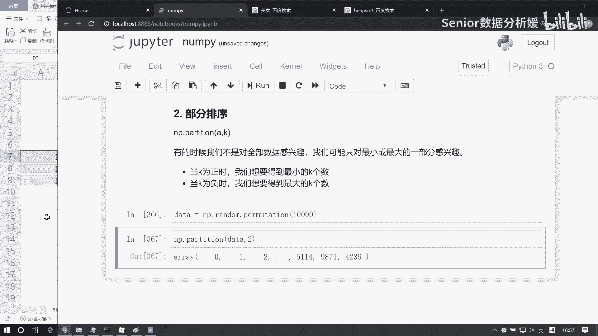
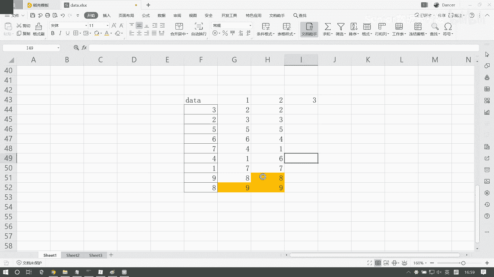
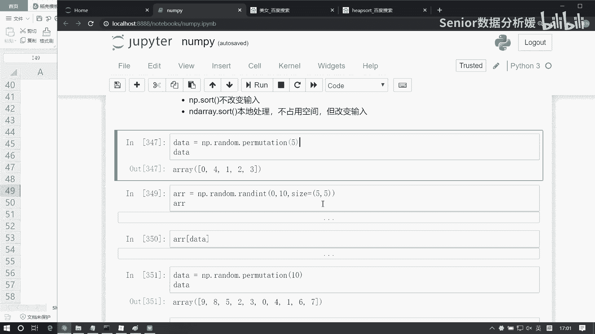

# 数据分析+金融量化+数据清洗，零基础数据分析金融量化从入门到实战课程，带你从金融基础知识到量化项目实战！【入门必备】 - P27：07 numpy基础-排序 - Senior数据分析媛 - BV1Ak61YVEYX

这个南派里边的排序呢就比较简单了，就是函数调用啊，但是呢我们我们还得这个得下点力气干啥呢，得把这个咱们就是几种常见的算法，咱们得一个花点时间给他捋清楚，因为这个面试啊，面试的话不论你是做什么啊。

你做web也好，做数据也好，这个算法肯定是要考的啊，就是数据结构的算法啊，像什么冒泡排序啊，选择排序啊，快速排序啊，堆排序啊等等啊，那这些算法呢他这个面试肯定是要考的。

所以说咱们这个今天给大家布置个作业啊，就是我们去呃把几个算法看明白啊，呃我们看啊，这我们首先我们这个salt函数啊，它支持哪些排序，其实这个排序呢无外乎就是我们用哪种排序。

那么它你你无外乎是看你想要的是哪一种效果，你是想求速度啊，还是想求节省内存啊之类的是吧，然后这里边呢，他给我们提供了这么几种排序方式啊，一个是快排，一个是堆排是吧，然后这个have salt。

这是什么牌。

这是堆排序，然后have salt是什么什么来着。

啊这是对排，那那个默认排序是规定啊。

对那是归并排序啊，咱们把这这几个像这两个排序呢是不太常见的，常见就是那个快排，还有什么冒泡排序对吧，然后我们把这几个排序算法啊，咱们那个花点时间自己去整理一下啊，然后看一看这个东西，你迟早都得整理啊。

像这种算法啊，还有就是那个冒泡排序，冒泡排序肯定是必然必须得会的，这是最简单的排序了是吧，还有那个选择排序，选择哪些这几种算法啊，这个大家都得会啊，就是你至少你不会写，你也得能说个思路啊。

这样的话我们面试的时候就不怕了啊，这个这个肯定是考的啊，就你面试的时候肯定会问啊，就是你可当然不不不可能是每家都问，但是基本上你面十家得有六七家，一定是问这玩意儿的啊，这个反正你你看不看啊。

自己看自己看着办啊，哈哈自己看自己看着办啊，反正话已经话已经说到这了是吧，言尽于此，哈哈不啰嗦了啊，那那我们在南派里边呢，其实就是一个调用了，这个就比较简单了，它有两种方式啊，一个是改变输入。

一个是不改变输入啊，那不改变输入的话，那就是我们它会返有一个返回值啊，那我们可以有有这样一个函数啊，新增一个函数叫NP点random点commutation，这个函数有什么用呢。

这个函数啊你可以给它一个值，它会帮我们生成一组随机索引，随机索引也就是说是从零开始的啊，从零开始的0~10这个区间生成一个随机索引，每次运行的都不一样，知道吧，好NO，那我们可以用它来做一个排序啊。

D它有它有个用处啊，你可以用它干嘛呢，可以结合它来做这个你数据的一个重新排列啊，举个例子啊，比如说我们把它生成为五，是这样子的是吧，然后呢，我们用它呢可以对我们的数组进行排序啊。

比如这个是arr等于NP点，random点，round int0到十，然后size等于五行五列，然后我们可以结合这个date可以做这个随机重排，这样你看不出来效果啊，这样啊，这是array原始的值是吧。

然后array我们结合这个date就是以它做索引，它会按照这个顺序啊，来我们取取第一个就第一行呗对吧，25858，然后四就是取最后一行呗，11647是不是，然后幺呢取第二行就是80819对吧。

就这个值啊，所以可以结合它来对这个数组，进行一个随机打乱，嗯好那我们用它呢生成一组数据啊，那边有DNP点random点computation，我们生成十，这个数据是不会重复的啊，不会重复的。

我们现在用NP点salt来对它进行排序，data生成一组新值，这个呢叫不改变原始结构啊，比如你这个data呢是没变化的啊，它产生个新值，所以一般你要接收一下啊，叫salt values接收一下。

然后这个salt values是你排序过后的值，这种不改变原始输入，那另外一种呢是你希望改变它，改变它的话就没有返回值了，NP一点salt，然后把data给他，嗯他不是这个啊，是data点salt。

啊这样没有返回值对吧，因为它是什么，它在这个date这个内存上啊做的排序，所以这样你看data就变了啊，0123456789啊，这种叫改变内存，这种情况呢适合我们做什么，做这种小量数据集的一个排序啊。

那我需要我需要让他以什么，比如说我我以姓名排序，或者以这个Python成绩排序啊，我们我们这种情况可以用它，那另外一种呢，比如我们只关注它的前几个值或者后几个值，这种情况我们可以用部分排序。

比如你的数据量很大啊，你有1万个数据啊，那我没必要全排啊，没必要前排，我们可以用这个部分排序来处理它呢，主要是能提高一些效率好，咱们做数据分析的话，那动不动量级就是可能是几几万条，几10万条是吧。

那这种情况，有的时候，我们可能没有必要去做那种全部的排序啊，如果你只是想关注数据的一些局部特征啊，那我们完全可以用它，它里边主要是给相，相当于给一个分界点啊，就给这么一个K啊，这个K是个分界点。

那这个K呢就像像什么像索引一样啊，你可以前几个数还是后几个数啊，然后呢，那么你如果这个K是正数的话，那我们就是得到的要最小的K个数，如果是负数的话呢，就是得到最大的K个数啊。

那最小的数呢你肯定是在后边找，最大数呢肯定是在啊，最小数在前面找，最大数在后边找，比如我们来一个这个NP点啊，random点commutation，我生成1万个遗忘数啊，把它保存为一个data。

好先展示一下啊，这是一组随机打乱的数啊，然后呢我们去用NP点partition，这边呢把data给它，这是我们要排序的数组，然后K为正数，比如说我们想取最小的两个数，我可能把把它设置为二就行了啊。

那么前两个数就是最小的，后半数呢肯定还是乱序的啊，乱序的，也就是说你从第三个数开始取就不靠谱了啊，啊比如再随机一次，再随机一次，是每次都不一样对吧，但是呢这里边这个这个二啊，可能就是巧合啊。

每次我们运行时候，因为他的排序啊，你比如说这个冒泡排序原理是啥。

这你们还记不记得了，123456789都有了是吧，那比如我们对这样一组原始数据做排序啊，这是我们的data，我对它做排序，那么我会经历第一次排序，第四排序怎么排呢，冒泡嘛对吧，大的往下沉。

小的往上浮对吧啊，那怎么比呢，两两比较对不对，他俩一他俩一一比较三比二大，三下来二上去是吧，然后呢再两两比较三跟五比三比五五小，那么不动对吧，然后五跟六比五，五比六小不动，六跟七笔不动。

然后七跟四比四上去，七下来对吧，然后七跟一比，然后七下来一上去，然后七跟九比不动对吧，然后九跟八比九下去八上去，经过第一次排序，我们能得到什么，能得到一个最大数九对吧，然后再经过第二次排序。

第二排序这个九数就直接拿过来就行了，他就不用排了，我们只排这个区间对吧啊对，这个区间我还是排二跟三比不动，然后三根五笔不动，五跟六笔不动，然后六跟四比六下去，四上去对吧，然后六根一笔六下去，一上去。

六跟七笔不动，七跟八比不动，这次排序我们又得到了一个值是八对吧，然后经过第三次排序，排这一部分是不是对吧，那比如说你现在想找找最大的两个数，九个麦数出来了，后边是不是不用再再管了，也就到这一步就为止了。

就不用排了，对不对，所以说节省了很多次啊，明白吧，但是你在排序的过程当中，这里边的数据数都是随机的呀，比如这一次你我们虽然找的是后两个数，但这个七也出来了，但它靠谱吗，不一定对不对，他不一定靠谱。

因为我只经过两两次排序，我们能确定的就是八和九是确是一定是最大的，但七是不是最大的，不知道Y有7。5，对不对啊，所以他就是这样一个道理啊。

所以它会节省次数，所以说可以节省就是提高我们这个排序效率，但是呢你你这个边界之后的数，它不一定可取的啊，啊所以不用看它，那这边前两个数就是最大的了，那同样的道理。

我们想取最后想取这个最小这个最大的K个数，我把这个值设为负就行了啊，date然后比如写个二啊，那这样的话你肯定是最后这俩数是最大的，而前边呢还是混乱的对吧啊，所以说这个它就是可以这个高效啊。

来来节省这个咱们的运行时间啊，那我们其实你也可以去比较一下啊，比如这里边我们想求最后的两个数，我们做一个百分号，嗨猫艾特是吧，可以看他的时间一共花多久，66。6微秒对吧。

那如果我们对它整体做一个排序的话呢，摆放time it，然后这个NP点salt d好，615微秒是吧，这个时间它就会有一个比较大的一个区别啊，所以这种这种方式适合我们找这种小小的。

数据集的一个找啊寻找啊，好了，那这个我们今天的作业，除了你去把这几个排序算法自己看一看啊，看看原理，然后能写就这样写一写之外呢，咱们不聊别的了啊，咱们把今天的代码熟悉一下啊，咱们这个数据分析啊。

就前几天就是很多都是用函数的学习，所以这个地方没什么技巧，你就是你多敲你自然就熟，你少敲自然就不熟对吧，这里面所有涉及到的一些理论，什么正态分布啊，什么矩阵乘法这种东西啊，大家不用太在意它啊。

不用太在意它，因为它不会影响咱们后续的数据分析工作啊，所以那东西呢你能了解就了解一下啊，你要是想起来了，然后呢想会回顾一下，你就回顾一下，但是呢它不会决定说我数据分析学不好，知道吧。

所以你也不用有太大负担啊，目主要的目的还是要把咱们的函数啊，都理解透彻，然后能做到熟练运用，怎么能熟练运用，先熟才能运用啊，你要是不熟的话，没法用啊，我一说啥，你得反应半天，这函数干啥的。

那你怎么能熟练运用呢啊那做不到的啊，所以咱们就是尽量尽量多敲代码啊，你能敲两遍，你就别敲一遍，能敲三遍就敲，别敲两遍是吧。

尽量多敲啊。