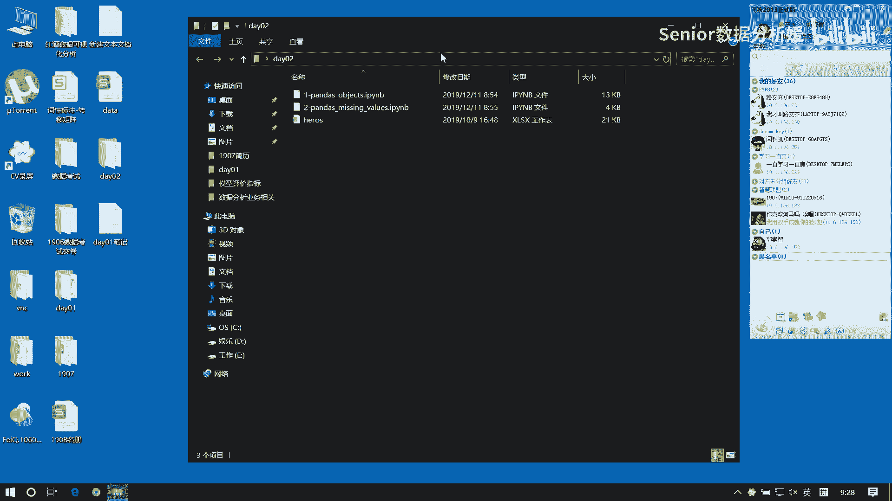
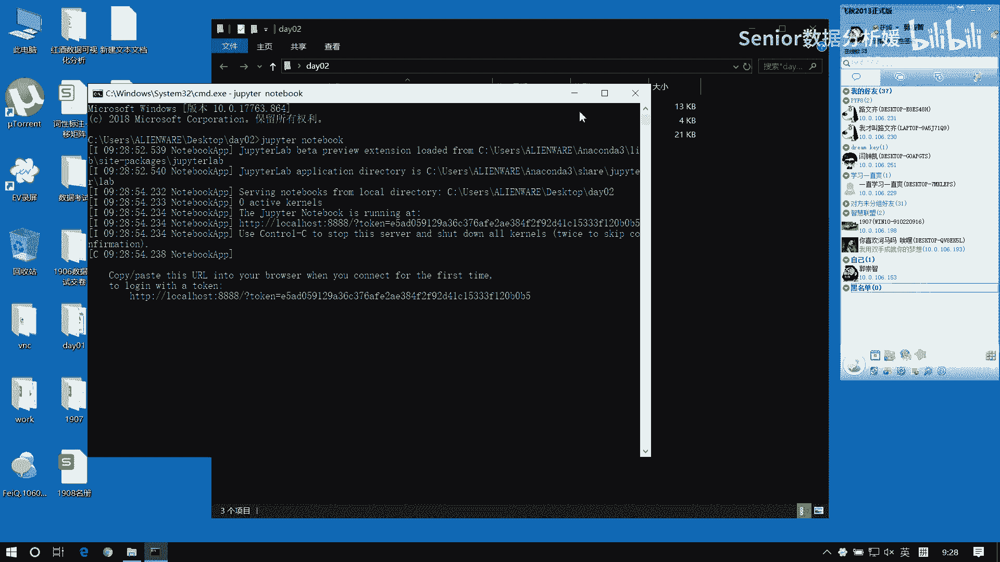
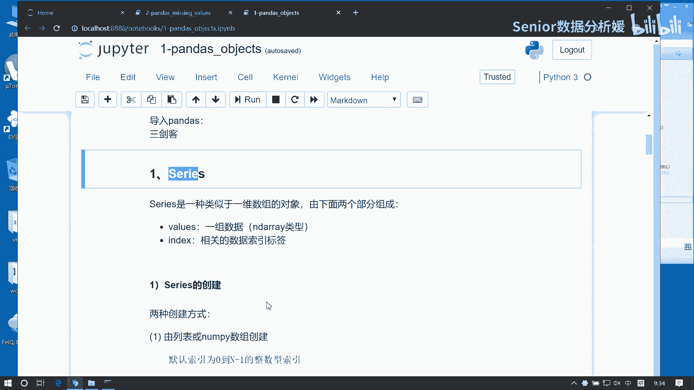
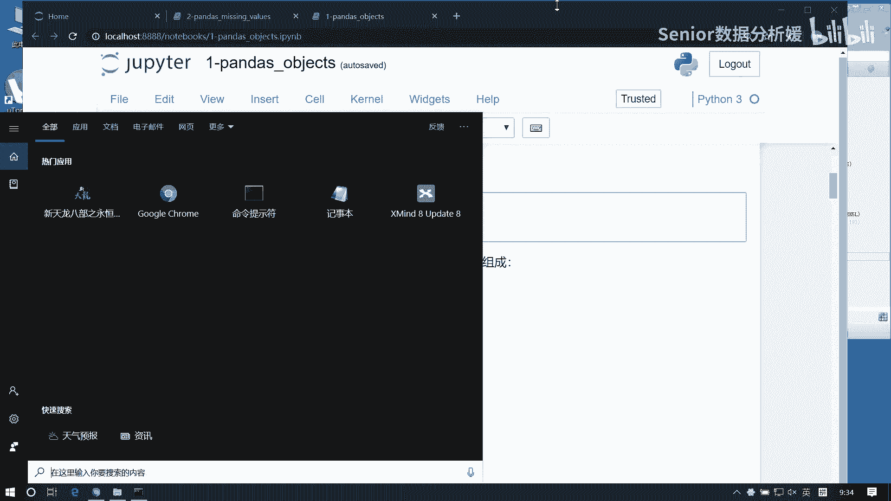
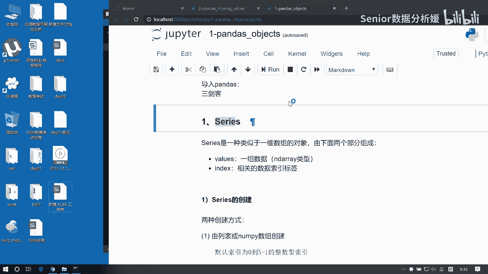
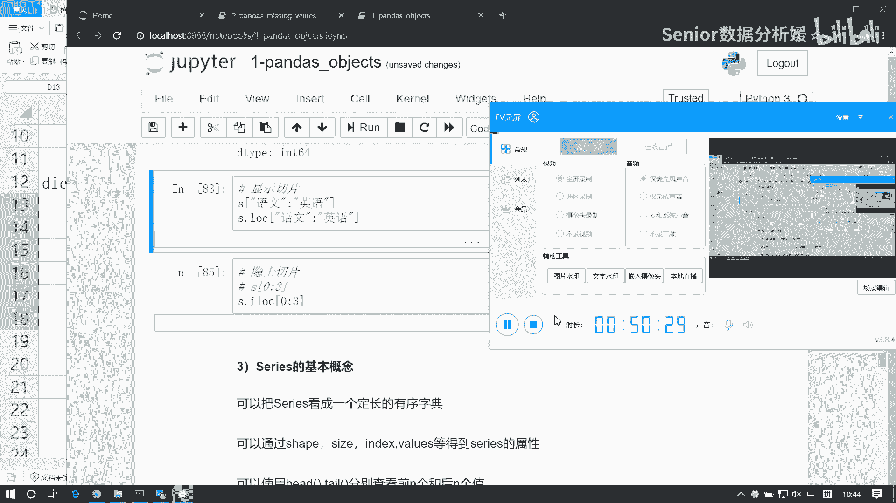

# 数据分析+金融量化+数据清洗，零基础数据分析金融量化从入门到实战课程，带你从金融基础知识到量化项目实战！【入门必备】 - P28：01 Series基本概念及访问 - Senior数据分析媛 - BV1Ak61YVEYX

进入选择。

咳咳今天我们要了，了解一个新的两个新的类型啊，那这两个类型呢都来自于pandas啊，可能我们以前都听过是吧，说这个Python做数据分析就是什么，就是南派pandas matt power lab。

就这么几个东西啊，那这仨东西呢统称为叫数据分析三剑客啊，我们所谓的三剑客指的就是一个是，man派，还有一个是pandas，一般把叫做pd啊，然后呢我们在pandas当中呢有两个类型，一个是series。

一个是data frame啊，那么这两这两这两个是两大件啊，还有一个大件是什么呢，是这个matt groud lab，这是一次项目标，啊所以一般我们做数据分析，就这几行代码肯定一点就先敲出来啊。

就是必须有的啊，那今天我们要学什么呢，我们今天学这两个东西啊，啊一个是series，一个是data frame，这这两者呢都来自于pandas，那pandas是什么呢，pandas跟南派啊。

这两两者啊属于这个并驾齐驱的，但是呢pandas是基于南派的啊，那么南派仅仅是提供了数学运算，但是呢你要处理日常的业务，还得用pandas，所以可以说pandas啊，它主主宰了啊。

或者说这个主要这个撑起了这个Python，在数据分析领域的这个地位，如果没有pandas，那么你Python他搞不了数据分析，所以就这么重要啊，那这里边呢主要是两种类型，一个是series。

一个是data frame，他们为什么能够处理业务呢，因为这里面提供了很多跟业务相关的，一些操作啊，首先从数据的类型的描述上啊，就有有很大的一个进化啊，那今天我们就要看这些东西的特点啊。

以及包括它的一些基本操作啊，简单梳理一下有什么呢，有series它的构造，然后访问索引切片，然后常用的一些方法的运算方式，然后呢就是data frame，它的构造访问以及这个索引切片。

然后以他的一些运算函数，另外呢我们还要了解一下这个pandas当中，对缺失值的一些处理的逻辑啊，包括呃NN的处理，然后NNP点NN的处理，以及我们如何去啊去过滤或者说去查找。

或者是填充这些空值的一些操作啊，那基本上数据分析你拿过来干嘛呢，首先第一件事就是什么，先去找空值，先找空值，把控制找到了，然后该填填，该删删，第二步干嘛呢，第二步就去做异常值处理啊。

所以我们今天来先先来干第一件事啊，但是呢我们必须得先学会这几个类型是啥呃，那那我们先看啊，先看这个第一个类型叫serious，这个serious呢来自于pandas，Pandas，从这倒过来的啊。

大家可以把这段代码先敲进来，我简单给大家加个标注啊，pandas呢提供了数据分析，业务处理的函数和类型，然后matt CD lab，这呢主要是提供数据分析可视化的函数，而它呢提供数据分析的运算基础。

那至于最后一项这样代码它干嘛呢，它是一个魔法指定对吧，他主要是帮我们去指定指定绘图位置，为当前文本文档，大家能动手，一定要跟着啊，第一天你可能不跟你就不跟了，但是我跟你说，这东西特别容特别有迷惑性啊。

其实你要是不是熟练的敲的话，就是你根本就分不出来这到底要这怎么用，你会越学越难，你觉得你会觉得步履维艰，走不下去啊，这东西你必须得熟啊，我也没什么办法，我不可能说通过三言两语，让你觉得你就全都记住了。

然后你还能会灵活运用，这不可能啊，我是神，我也做不到，而且我又不是谁，所以只能靠你的勤劳勤劳的双手啊，不停的敲，你才有可能做到熟练运用啊，我那我先解释一下这个series啊。

首先series s是什么呢，series啊，它从概念上去讲，它是一个类似于一维数组的对象啊，类似于一维数组对象，那为什么要加类似呢，为什么这么不严谨呢，啊因为这个类型它就不严谨啊，利用不编辑。

为什么呢，这个我们正常来讲。

我们去我们接触过两种类型啊，就主要是这两个类型。

一个呢是就是数组这种类型，一个就是字典这种类型，当然数组有很多跟它相似的类型，比如什么集合呀，什么原组啊，对吧，这我们都都统一归为叫类数组类型吧好吧，那么就大致是这么两个类型啊。

这么两个类型的无外乎就是就是几种组合啊，就是有序的还是无序的，无序的，然后呢就是有这个有索引的，还有是没索引的啊，然后呢就是有键值对的，没键值对的，对吧，无外乎就这么几个角度，比如说有序的。

有哪些数组是有序的对吧，列表是有序的，array是有序的啊，元组有没有序，元组也是有序的吧，要不然你不能用01234来访问，对不对，元组TPLE啊，那什么是无序的，字典是无序的对吧。

然后什么集合是无序的，对不对啊，他只强调有或没有啊，那字典呢它也是无序的，它但它只是强调访问机制不一样啊，有索引没索引的啊，那像这种谁是有索引的，还是这样的是吧，他他们都是有索引的对吧。

但这个set有没有索引，没有set有索引吗，set无序，对不对，你就01234能访问元素吗，访问不到吧啊有键值对的，比如这个什么DICT对不对，它是有键值对是吧，然后那像这些都是没有建立对的对吧啊。

其实我们就这些类型其实无外乎就是列表，数组元组集合字典对吧，那为什么说我们这个series是一种，类似于一维数组的对象呢，因为它这东西特别特殊，它呢是在我们这个数据的基础之上啊。

比如这块我写一个嗯等于run return0到100，这是一个函excel的函数啊，excel函数，然后它可以帮我们去生成一组随机数，这大家也可以试一下啊，这是一个round between啊。

然后我把它把这组数据我复制，然后选择粘贴啊，excel很强大的啊，这样一组数据啊，那么这个呢可能是我们原来的一个列表，那么它呢会有一个位置对吧，这是一个lock啊，log或者叫index。

那我说那么它的索引是012345对吧，为什么呢，因为它的具体首这个元素首地址的偏移量为零，它是一它是二，它是三，它四它是五对吧，一般来讲这个有序数组呢就是有序的这种类型，这种集合类型呢。

我们都可以用索引的方式来访问啊，而且呢如果你能用索引方式来访问，那它一定是有序的，它一定是有序的啊，不然你访问不了，那不论你是逻辑有序还是结，还是那个那个那个存储结构有序啊，总之他一定是有序的。

那有一种情况你像那个像那个字典字典的话，它就无序的字典，因为什么呢，因为它它就是个链表对吧，字典就是个纯链表啊，它只强调什么呢，只是通过那个索引值来查找这个数据啊，所以它是无序的。

那对于SERRS来讲呢，它跟字典很相似，为什么呢，因为他除了这个index，还还多了一个key，比如这个是啊，这个是lucy marry，汤姆杰克，靠托尼啊，托尼老师，然后还有，还有谁呢。

还有ERROMAN吧，就他那会有这样一种，那这边是什么，这边是这边是建，然后这边是索引，这是值整个这东西共同构成了一个类型，这类型叫什么呢，其它就叫SERI，啊serious正式出场。

哈哈就是这样一个东西，那它呢会有什么特征呢，首先它具备这样一个访问方式，说明它是有序的，有序的，有序啊，然后能用电子对访问，说明它是类似数组，它不是数组，也可以说它类似字典对吧。

而且呢这个server是一个一维的数据，它只能表示一维，但是从语法上讲，它能不能存，二维也能存，但是没有人这么干，知道吧，就是它的设计的初衷就是来表示这种一维数据，但是呢引入key的这种方式来访问。

那为什么要引入K这种方式访问呢，因为可读性高啊，因为可读性高，因为你的数据会有含义，因为更贴合于业务，你拿01234，你说零十五是啥呀，不知道，但你说LUCY它对应的值是15，那这个值就有意义了对吧。

所以呢我们用这种方式啊，它更与这个业务的操作更结合的更紧密，所以说pandas是从数据类型的设计上去讲，它就是为什么为数据分析业务，提供的一些操作啊，所以它既有序，又可以通过键值对访问。

所以它不是字典啊，因为它有序有序就不是字典啊，但是呢它能用键值对访问，所以他也不能是数组是吧，所以它是什么，它是一个类似于数组的，或者是类似于字典的一个一维的数组对象啊，类似于一维数组的对象对吧。

所以呢就是我们从这个东西来看到，有两个特性，就是它能够通过建设的访问，也能通过索引访问，它呢能表示一维数据，这就是我们series的一个基本含义了啊，三个要点咳，能键值对访问二，能索引访问三啊。

这个有序一维，啊这么几个要领，你记住了就完事了啊，这就是series，那我们先说series，它两部分啊，一个是values，一个是index，哪个是index呢，这个key叫index。

在它的命名上啊，命名的处理有一个小小区别啊，要注意它叫index，那它叫什么呢，它叫隐式索引，就是隐藏着的啊，就它有隐藏功能啊，你可以隐，你可以激活它好，你可以激活它，但是他没有给你暴露出来。

就是正儿八经的访问，你应该是去通过我的index来访问我的数据的啊，但是呢它还有隐藏功能，你也可以通过它来标签的访问我的数据，没有问题啊，所以这是它的两部分的一个表示啊，那我们就看创造啊。

怎么去构造它一定要注意啊，它是个一维啊，一维必须有序啊，那么先说第一种啊，由列表或者是南派数组来构造一个serious，这个series就是一个对象啊，构造方式呢很简单，这个形式我们非常熟悉是吧。

我们构造一个任何一个对象，是不是都把这个类名写出来啊，然后里边再写入一些构造函数的那个，初始化那个值是吧，那这边两个值啊，一个是data啊，还有什么呢，还有是index啊，后边先不用动，不用管它啊。

就主要是这两个值，那date是谁呢，date就是这个这个数据啊，index是谁呢，index就这个索引啊，那我们可以先不考虑index啊，如果我们没有index的话呢，第一种啊就是如果没有显示，咳咳咳。

指定index啊则以演示索引，来填充显示索引，也就是填充index啊，in index也就是说如果你没有指定这个值，会就拿012345来填充它的索引啊，那我们先先搞定一个data啊。

这data1那等于一个我们先来一个列表啊，等于一个中号12345，再来个D好，就这么着吧，Data1，然后呢我这个data让它等于data1，这样生成一个series，那你注意注意他这个out啊。

这是输入输出历史对吧，那这个这个主pyter notebook，它在输出不同类型的时候呢，会以不同的样子来展示，比如你看到这种形状，它就是个series啊，那比如说我们那个NP点array。

像这种东西他说出来的是这样的形形形状，那这个形状一看就是什么，就是南派array对吧，因为为什么要强调这个呢，不同的类型它访问的方式是不一样的，不同的对象它的属性也是不一样的。

不同的对象能调用的方法也是不一样的对吧，所以说我们在访问的语法形式上啊是有区别的，虽然数据的类型，但这个内容是一样的，但是访问方式不一样啊，所以大家注意，通过这就能看出来你这个对象是什么东西。

然后你就知道怎么访问啊，好那我把它保存为S1，这是第一种创造方式，直接用什么用列表，然后还有第二种方式方式，可以用一个南派array，data2等于NP点，random点，round int0到十。

size等于五，这是我们data2，我们拿data a2来构造S2等于series，data等于data2，啊只要是个数组都行啊，但是又会有个区别，有什么区别呢。

就是这个呃你用number派数组构造呢和列表构造呢，它得到的对象啊，一个是引用，一个是副本，谁是引用呢，那MAD RGE构造的是引用，那么如果他构造是引用对象意味着什么，快来快来对你意味着我我修改它。

我这个是不是也被修改了，那我比如说我现在这谁，我这个data2是不是跟单派克瑞啊对吧，那我现在去把这个data2修改一下啊，现在我把这个data a2，我写到下边吧。

在那我们现在我们想把这个里边第一个值吧，比如第一个值我们变成一个100啊，现在我看S2S2是不是也变了对吧，就是什么，就是因为S2是是data2的一个引用对象啊，所以呢它会被修改啊。

那另外一种情况就不会，比如这个data1，data1我把第一个值给它修改一下，变成100，它变100了是吧，那S1呢是不是没变啊啊所以这个要注意啊，所以说一般来讲呢。

我们其实在这个就在pandas当中啊，在操作这种数据的时候，因为有的时候可能你读的是什么，就是你可能就是这个各种类型之间在互相转换，比如说我们从pandas是读出来的对象，就是sales。

从serious里面读出的对象，可能是个data frame啊，可能是一个南派啊，然后IPAD之后你加载完之后呢，又可能成为一个这个SERI啊，他们就是类型之间可能会互相转换啊，那么在转换的过程当中呢。

就有可能出现这种引用的问题，如果一旦你存在这种引用问题的话，那么可能你在修改某一个值的时候，可能就不小心把另一个值也给修改了，所以这个这种情况会有一些风险，那我们用的时候要注意知道吧，啊咳咳。

你注意有这么回事就行了，然后如果发现有些值会异常，那么你不妨想一想，是不是因为引用的问题导致的这个错误啊，好这是普通的构造啊，那我们唯一要注意的是，这个副本和引用的问题啊。

那么另外呢我们还可以可以写个全一点的，比如说我们想写写这样一个想写这个数据啊，我们想指定这样一组数据，然后加上这个索引，我少写几个，我先写个index啊，它等于啊，比如LUCY，然后MARY。

然后汤姆杰克，然后托尼，咳咳咳，托尼啊，然后这个啊data，然后等于NP点verr random点RANDOINT，从0~100，然后size等于五，这是五个人啊。

然后五个成绩我用它来构造一个series s，三等于serious d，它就等于data，然后index那这个index是什么，就是这个东西啊，这是它index就等于index，这样我们得到S3呢。

它就有显示索引了是吧，就是lucy mary com即可啊，对应的值啊，所以这个东西明显就比什么，比这个可读性要高多了对吧，这么一看就知道咋回事啊，而对上面那个咱不知道啊。

另外呢我们这个service里面还可以加一个属性，叫什么呢，叫name，比如我们可以加一个scar，这样你就知道了这个series啊，它表示的含义是啥，就是个scar是一个分数。

好但是你啊一我还是再强调一遍啊，一定要注意啊，SERI啊，咱们不能拿它创建二维的，有同学可能好气啊，说我要告诉构造一个二维数组，看行不行啊，带你写一下吧，你也不用好奇了啊，能不能构造能构造啊。

2525行五列，装能，exception啊，不行了啊，版本更新了，以前是行的啊，那你也不用耗气了，啊那这个语法给给给他处理的更好了，但以前的话是能构造出来的啊，构造出来的话就就很很奇很尴尬是吧。

一直在强调说能只能做到一维啊，只能一维二，让我同学吧唧来个二维拍我脸上说志哥，我创建出二维的了啊，我说你给我退下啊，哈咳咳嗯嗯嗯，就是按照按照这个规范去做啊，有一些比如说比如说这个。

你说这个你你去买一辆车吧是吧，买一辆车的话，然后别人说你千万别往沟里开啊，你说不对，我要试一下哈啊你刚提车吧唧就开沟里了，结果就问4S店是吧，为什么不能往沟里开，我开进去了对吧，像这种东西。

很多时候你像在那个咱们一般你交付，你把你的项目写好了，把交付给甲方了是吧，交付完之后，然后这个那边那边出问题了是吧，那边一用就出问题了，然后你就你就开始程序员的思维，一般都怎么想，这个这个用户太了啊。

用户不按套路，不按套路去那个什么，不按套路去用那个用都用这个程序，比如说你他脑子里画面就是那种什么，比如你骑个自行车，你非要拿个棍子往那个链条里面插是吧啊，你去这样去检测的我的程序。

那程序肯定会出问题啊对吧，他总会去想说这个你没有按照这个规范操作，那导致程序出了问题啊，这是程序员的逻辑，但是呢对于测试来讲，或者说对于那个甲方来讲，他他们就会想这什么程序员的。

那我随便一操作就就出错了对吧，所以这是一个很矛盾的一个问题啊，啊总之我们要知道怎么回事就行了，serious啊，如果你要处理高维的，有咱们有高维的处理方式，就是data frame啊。

所以你不要拿series来处理，你处理高维的没有意义啊，好那这是这个基本操作三个参数，data index和name，然后另外它也可以指定一个这个d tab啊，d tape是吧，也可以指定一个类型。

比如我们可以给指定npr float，也可以的是吧，它自动会帮我们把这个数据给他，优化成一个浮点浮点类型啊，这是一种方式，那么另外一种方式呢我们可以用字典来构造，但是用字典构造的话，大家注意。

因为字典本身是无序的对吧，字典本身是无序的，但是它构造完之后呢，就变成有序了，那这个有序呢它会按照我这个索引值啊，给我进行排序啊，比我们来写一个啊，写一个字典DICE等于，然后来一个LUCY，冒号60。

再来一个呃，Marry，冒号80，再来一个汤姆，来个76，来个tony，冒号92啊，就写咱就写四个吧，啊不多写了，哎冒号这是一个字典，那我用这字典也可以构造一个series，这个时候呢。

我们就直接把这个data设置为这个字典就行了，那索引呢你就不用写了，它会默认把把这里边的这个字典的那个键啊，直接给你设置成索引，但是这边有个有有意思的地方啊，就是如果你指定了索引会发生什么呢。

比如我指定索引啊，我指定lucy marry，发生了什么，他只取了这两个值，对不对，只取两个值，那如果你放一个没有的呢，比如说一个NO key，他给你填充一个空值进来啊，所以说它你用字典构造。

它最终还是要依赖于你的索引的啊，如果你只仅仅是拿字典构造，那么你没有必要再指定这个索引，除非什么情况，比如我想在字典当中，我去选择几个留出来是吧，那这种情况你可以再显示指定这个索引啊。

这个如果如果显示指定index啊，会什么，这个index的优先级会高于字典的键，咳咳他会以他为准，好那我们往下看啊，看下这个练习，使用多种方法来构造这个series好，给大家2分钟时间。

大家熟悉一下语法啊啊那这个这个练习啊，简单写一下，你有几种方法构造它呀，首先第一种我们可以用给一个date，再给一个index，是不是嗯date呢等于就是三个150，一个300，然后index，语文。

然后我们再把这个往里面一套就完事了，它等于data，然后这个index等于index啊，这样完事了是吧，这是第一种啊，然后还有什么，还有你还可以用这个字典，对不对，给个字典。

那字典这个顺序就可能就会有变化了，对吧啊啊，不能光了，然后直接我们把这个DIC给它设置为data，就可以了，是这样的吧，啊但是这个排序会乱，是不是啊，他他怎么样，他是按照这个阿斯克码数排序的啊。

啊两种方式啊，不说了，往下看啊，series的索引和切片它是一维的啊，所以我们只好用一维跟高也没关系了，那servers如果是索引的话呢，有两种方式啊，一种是显示，一种是隐私隐视。

所谓的显示索引呢其实就是用index，就说白了就是这个key啊，用key来访问，那他用K访问呢，它跟字典它是不是类似典啊，所以它可以像字典一样啊来访问啊，所以第一种方式啊，字典的访访问方式，我这样啊。

咱们创造一个serious，这个data等于NP点，random点，render int0到100，然后这个size等于五，index呢我们等于一个，List a b c d e，然后S。

等于一个series，data等于data，index等于index，好，这是S啊，咳咳第一个字典访问字典怎么访问的，是不是直接做用中括号啊，里面写上你的键，对不对，这是不是字典访问啊，资源访问。

那第二种方式呢，用属性访问，S属性访问怎么访问啊，把它看成属性对吧，那就是S点A啊，这也可以访问，咳咳，然后另外一种呢是这个我们service啊，它提供的叫series的访问方式啊，用什么呢。

用S点lock点lock，然后里边写上你的索引A，用这种方式来访问啊，那我们推荐用这种啊，推荐你别嫌麻烦啊，因为一旦它拓展到二维的时候，这就不麻烦了，因为你这样写会会比较整齐，不然的话很乱。

因为一旦二维的话，又涉及到行标签和列标签的问题啊，所以用lock啊，用log来访问这种是最靠谱的，那另外呢它也可以像那个南派一样啊，也可以什么呢，也可以这个多元素访问访问多个元素，这边不是切片啊。

切片那个说多个元素访问就是什么，用列表，用列表做索引，比如说S我这边写上一个A再写一个B，这样拿了两个值，但这里边我们要注意啊，返回值类型是不一样的，他返回的就是一个元素对吧，但你用列表访问得到什么。

是一个子series对象，相当于一个子数组对吧，子数组子数组嗯，然后呢同样的，那我们这种像那个南派他访问，说还有一个是布尔列表啊对吗，布尔列表访问啊，也一样的，那布尔列表访问的话，要注意什么呢。

注意个数要对齐，对不对，True false true false，false是吧，可以把这个true对应的位置的值给拿回来啊，然后呢他也可以做一些变化，比如说这里边我们可以。

也可以用点lock的方式来处理这个问题啊，点lock s，点lock，然后里边写上一个A再加上一个B是吧，这是一样的啊，那这边呢我把这个复制一下啊，S点lock嗯啊这都一样的哈。

那比如说我现在给大家提个问题啊，我现在想干嘛呢，问题，找出找出呢大于60分的这个学生啊，比如说ABCDE是学生啊，然后呢我们这个右侧这是分数，现在我要找出大于60分的学生，怎么找呢，怎么写啊。

写个循环啊，for i in是吗，嗯in润泽嗯嗯嗯我们的思，我们现在思维逻辑已经是这样子的是吧，给个列表，ABCDE对不对，然后呢拿出可以拿到这个索引的，这玩意是不是就index啊。

嗯啊这是我们的逻辑哈，然后呢这块我可以什么做一个啊，S然后是不是index啊，然后它如果大于60，对不对，就做一个判断是吧，if它大于60就怎么样，我就把这个值给它做一个输出。

是不是输出这个s index是这意思吗，八十二八十对吧，是这么干的吧，那你呢这是谁呀，AB呢，那个值是值呢，我们只把这个值找出来了，但是那个index是没有啊，你现在要的谁。

我现在找的是大于60分的学生姓名，咳咳啊，那这个姓名就没了，你只是把这个分数找到了好，所以呢这个逻辑啊不对啊，不要这么干，这是我们以前的逻辑，太太low了啊，这是1。0版，我们看2。0版怎么干的啊。

我们直接拿这个S，S点values啊，这是个南派AGRAY对吧，南派克R啊，但是这个这个values它是一个啊，他是我们的一个属性啊，属性就是value，就是这个data啊，然后index呢就是这个值。

知道吧，这是一个属性啊，比如这块我可以通过values呢，来获取到我们的所有的值，获取这个series对象的值，那这个值呢就是一个南派克瑞，这个南派克R他如果跟一个60去做大于运算，会得到一个什么类型。

是不是不是也是一个南派array啊，只不过变成了布尔类型的南派array，对不对，是不是得到这么一个东西啊，那我拿这个类型，我再去，访问它是把值拿出来了，能看明白不，咳咳，还有同学会有疑问是吧。

那你这个东西它不是个南派克瑞吗，这不是南派克瑞吗，你上面访问这不是列表吗，这不一样啊，对不对，好，NPC位数也是数组啊，就是说这里边啊，这个里边只要你放的是array like类型就行。

就只要是类数组类型就行，元组或者是列表或者是南派array都可以啊，啊只要这东西就行了，咳咳啊，这是一种访问方式，其实我可以更直接一点，我们直接拿S跟那60做比较，得到这样一个值。

然后S再去直接中括号啊，但这儿呢稍微复杂一点了，因为这里面又涉及到一些series运算啊，其实series运算跟南派的运算差不多的啊，只不过就是多了一个索引问题，这个我们后续再说啊，如果理解不了这个。

我们还是拿这个value来来算，这是可以理解的，对吧好啊，注意这种用法啊，就是我们可以可以什么呢，就是这个布尔列表它有什么用，因为一般来讲，这个布尔值呢，都是我们通过一些关系表达式得到的值。

所以用它我们可以去筛选出一些，我们感兴趣的数据给它找出来啊，这块要注意灵活运用啊，嗯嗯那现在同样道理，我现在想想找的是我换一个问题啊，找出啊分数高于全班平均成绩的学生，这怎么找呢，S大于点。

S就是问题还在这啊，这是我们的数据对吧，那它的平均值数可以直接求一个面就行了，这是平均值吧，那时候我们要做的是什么，就是把这个60替换成这个均值呗，是不一个道理啊，S点values让它大于这个均值。

是不是这样就得到了，然后再用这个布尔列表再去访问，我这个S这个指数就拿出来了，这都是大于均值的是吧，好，很灵活，这东西啊嗯好这是显示索引啊，显示索引这这几种办法，我们再简单回顾一下。

第一种用字典的方式访问，里边给的是你的显示索引的值，第二种属性访问啊，直接显示索引，然后第三种是用lock，这是我们推荐的办法啊，点log啊，那你将下边这地方都可以变成点dog对吧，这都没问题的啊。

然后另外呢就是我们去结合列表，列表或者是布尔型的列表，访问数据都是可以的啊，这是显示，那么另外一种是隐式索引，隐式索引呢就是用左边这这个东西了啊，就是说根据它的位置来进行访问啊，那隐式索引的话呢。

你可以啊，以这样两种方式，第一种直接给一个数字，这是可以的啊，这叫什么，这叫数组的访问方式，用数组的方式来访问，那么还有一种是用serious的隐式访问，影视访问呢正常访问是叫lock隐式访问呢。

我们把这个log前面加一个I表示数字访问是吧，lock那里边写零访问的是第一个值，i lock啊，上面那个叫lock是吧，那这个i lock呢是我们推荐的方式啊。

同样的影视访问呢也可以用那个列表来做索引，访问多个值S点i lock，比如说访问这个012房前三个，嗯我随便拿一个013，再来个腰是吧，可以可以这样进行一些重组，这是演示啊。

然后就是这个切片这边没有二维啊，没有二维，所以涉及不到什么行列的问题，呃，如果是切片的话呢，一个道理啊，它呢分两种切片啊，一种是什么显示索引切片，一种是隐式索引切片，如果是显示索引切片，这玩意注意了啊。

它是一个闭区间，啊就是左闭右闭，那对于隐式索引切片呢，它是个左闭右开，左闭右开，这个跟咱们南派的，或者是那个列表的切片是一样的对吧，他们都是左闭右开的，就是默认都是左闭右开，或者你也可以这么记。

就是但凡是用数字这种索引来访问的，都是左闭右开啊，那如果是用这个像这个键值对的这种方式，ABCD啊，像他这种方式来索引的话呢，那么它就是闭区间，比如说我们现在想访问这个S它的AA到C啊，这三个值。

那么我们用显示索引的方式来切片的话呢，是S点lock a，然后冒号C不用写到D啊，直接把A到C就全拿出来了，但是你用之前一定要确保它什么，这个东西是标签啊，他是标签，咳咳。

因为因为有的时候你这个series啊，它可能标签就是01234啊，比如再来一个S1等于额serious，然后data等于NP点random点RINT0到100，size等于等于五，这是S1啊。

那你看对于这个S1来讲，它的显示索引是啥呀，是不是01234啊对吧，所以这时候你要是用S点lock来访问的话，你要写零冒号二这几样哎，哎，type error啊，0of class index。

啊这不是S啊，是S1啊，写错了啊，S1因为S没有那个那个索引对吧，你看这个零和二，你看他把是012是全拿出来了，为什么这样啊，因为因为你现在用lock用log访问，相当于是用用什么显示索引在切片。

而这里面的显示索引是什么，是数数字啊，能区分吧啊是数字啊，所以要注意这个问题啊，就是，lock啊，默认传递的是显示索引啊，那么，注意当显示索引与隐示索引相同时的，这个切片嗯，方式区别在于什么呢。

区别在于这个lock啊，如果你这块不是lock，如果是i lock的话，那就变成演示索引了，S1点i lock，你看啊，我们这时候呢在写这个零冒号二得到什么，得到数零一啊对吧，因为就是什么呢。

就是就是你的显示索引跟隐示索引一样的，但是呢你用lock这表示用显示索引访问，你用ALLOCK这表示用隐式索引访问，演示索引是什么，是索引那个位置啊，所以它是一个左闭右开区间。

所以它这两两种方式取值是不一样的，咳咳那同样的对S来讲，咳对于S来讲，它的演示索引数也是012345啊，啊01234是吧，所以它如果你去挨log访问的话，也只能用零二，那它只是返回零和一两个值啊。

就是AB，这能能分清吗，好，那另外呢它这种东西也支持那个倒序啊，比如冒号冒号一是吧，倒序输出也可以啊，是一样的哈，就是这种不长，不长的方式切片，你好好，我们这个简单梳理一下思路啊，加深下印象。

那么这个访问啊，访问呢包括两种形式，一个是显示访问，一个是隐式访问，那么显示访问呢主要是用这个index，也是那个键值对里边那个键来访问啊，那他有这么几几种情况，一种是你像这个字典这种方式。

直接用中括号里边放箭的方式来访问，另外一种呢是直接用属性来访问，然后呢那推荐的方式是直接用点log函，这也不是函数啊，就是它提供的这么一种访问机制，因为它后边接的是中括号，而不是圆括号啊，如果是圆括号。

那是函数对调方方法啊，所以它不是函数啊，就是就是一种访问机制点log，然后呢也可以支持我们这种多元素访问，可以用列表来作为你的键啊，但是你要注意呢，我们多元素访问出来的结果呢是这种。

也是一个serious对象，也可以用布尔类型来访问啊，然后呢另外就是这种隐式索引，隐式索引的话呢，我们是用i log访问，或者呢可以像数组一样啊，给他这个数据的位置，然后来访问咱们这个数据。

那么隐式索引呢，一样也支持用列表来进行访问啊，然后就是这个切片切片的话，要注意，我们用lock跟用unlock的意义是不一样的啊，这种情况，尤其在如果你的显示索引，也是用隐式索引来填充的，这种情况啊。

尤其明显，如果是log的话，一定是给什么给的，这个是数据标签，就是给的那个这个标签啊，就是这个显示的标签，如果是i log的话呢，直接给只能给数值，不能给标签啊，然后呢。

要注意这两种这个切片的范围是不一样的，如果你用这个咳，就是这个标签啊，就这个标签来访问的话，那么它是一个闭区间，如果你用的是左边这个隐式索引访问的话，它是一个开区间，注意些区别好。

现在我们来看这个练习啊，呃对这个S1进行索引和切片，我把这个拿过来啊，好现在我们要去访问访问这个数学成绩，想把这个数学150拿出来，你怎么拿呀，对我可以写上这个，先写个S1是吧。

这样我拿到的是数学的150，如果我想把数学150这一行拿来怎么办，结合啊，怎么写，S点i lock1加对吧，还是没有索引啊，我想带个索引出来，你可以借助这种办法用列表，因为你用列表访问得到的是什么呀。

列表访问得到的是不是个series啊，对不对，如果你拿到的是一个series，那么service就有索引了，对不对，如果你拿的不是这个series，你这样拿只是什么，只是一个值，对不对。

这拿的只是一个值啊，这一种或者是这种也可以是吧，把它变成列表就行了，数学150或者呢还可以用什么，是不是有属性啊，但有属性的话得到的只是一个值了对吧，如果还可以用lock吧，显示索引S点。

lock里边是不是可以写上这个数学啊对吧，注意啊，这用的是什么用的列表啊，还可以用什么可以用字典的方式来访问吧，直接给一个，数学是不是啊，你注意啊，就是你什么时候用用这个列表，什么时候不用列表。

要你要值的时候就直接用一个一个值，如果你要一个service的时候，你就用一个列表来传，咳咳啊，这是访问值，那么另外一个我们要去做语数英的切片操作，语数英的切片操作，这三者，那我们有两种办法。

一种是显示访问，一种是演示访问对吧，显示切片的话是什么闭区间，显示切片S，我们可以用这个，语文冒号英语是吧，或者是什么呢，或者是这个S点点lock，从语文冒号的英语，啊那还有一种是隐式切片。

它是什么开区间了吧，那这012是不是得到三呐，就是零冒号三，这是一种是吧，这种是数组的方式。

