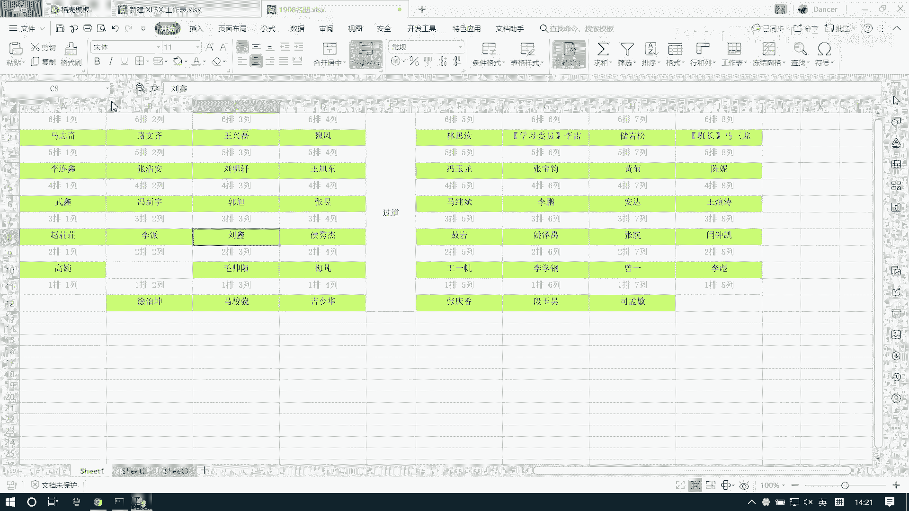
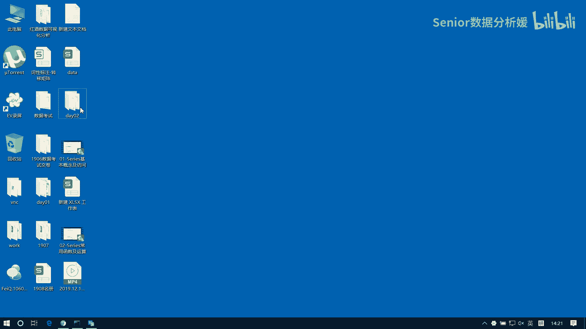
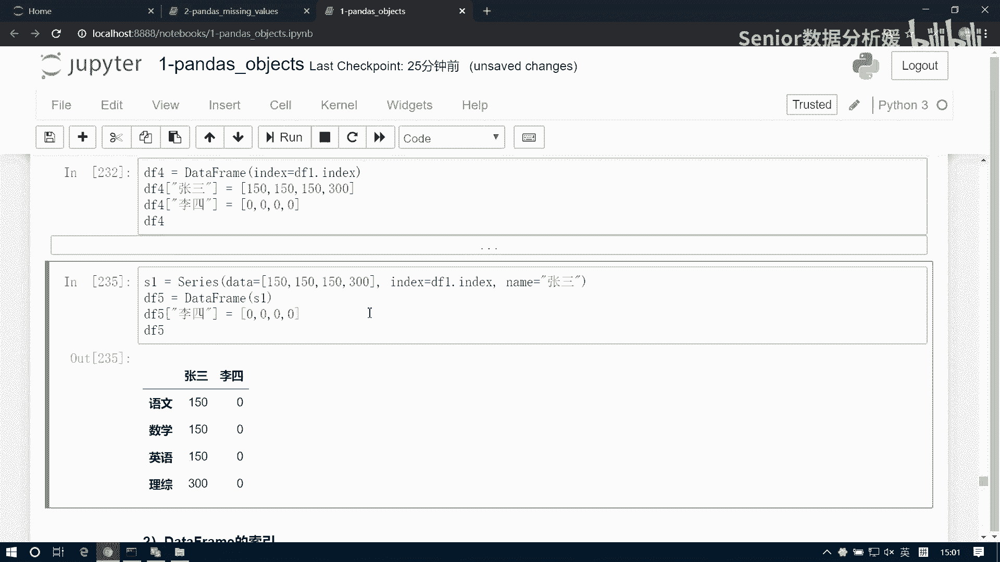

# 数据分析+金融量化+数据清洗，零基础数据分析金融量化从入门到实战课程，带你从金融基础知识到量化项目实战！【入门必备】 - P30：03 DataFrame的构造 - Senior数据分析媛 - BV1Ak61YVEYX

我看这个呃，像我们来说一下这个data frame啊，这是第二种第二种数据啊，panda提供的第二种数据类型，这个data frame呢它其实是基于SERI的吧，基于serious的，当然了。

serious是基于那个n d arr的，对吧啊，所以说这个data frame，为什么说是基于基于serious呢，因为series我们说它只能处理一维的啊，只能处理一维数据。

所以说那如果我们想处理这种多维的数据，比如我们现实的业务表啊，业务报表呢它都是二维的，要办法一般都是二维数据，那二维数据有什么特点呢，数据的报表呢一般它行和列是固定的，这个行一般是什么呢，行是数据是吧。

然后列是什么呢，列是字段，包括我们写这个数据库是不一样的呀对吧，就是你一行是什么，是一行是一条数据，对不对，然后一列什么是这个数据里面的一个字段，比如说我们去比如你构造一个数据库是吧，比如说组建id。

然后名字，然后这个啊这个这个什么什么年龄，然后这个地址，然后电话等等等等，对吧啊，他都是这样的啊，所以我们谈论这个数据表呢，就是业务表呢都是指的是二维数据，业务表我们一般是涉及不到三维啊。

那我们这个data frame呢，它就是帮我们把series，从一维的操作逻辑给它扩展到二维，扩展到二维之后呢，就会多了一个属性，这个属性呢就是列字段啊，列字段，那这东西怎么看呢。

这是咱们的series啊，就是我们上午说这这画了一个一个表啊，这是东西，这是一个series啊，serious呢我们主要是存的这组这组数据，然后呢他有这个有这个index对吧，那对于这个东西啊。

如果我们给他做一个拓展，我们得这么拖啊，把这个拿过来放在这啊，这说serious，然后隐式索引我就不写了啊，我就不写了，然后我们知道啊，这个每一个series它是不是都有一个名字啊，都有名字对吧。

有个name属性，比如上午我们写那个练习，说这是一个Python成绩是吧，一个Python场景，那么这个呢表示的就是我整个的一个这个Python的，那个是成绩啊，成绩一个成绩单。

然后呢如果我们把这个java成绩也放进来，那咱们上午写那个Python和JA成绩，是不是这个索引是一样的啊，这是Python，这是Python，然后这个是java，它们的行数也数完全一样的对吧。

只是什么不一样，只是这个name不一样对吧，这个是Python，这个是java啊，如果呢我们把这个java给它扩展进来的话，这个是啊，等于run by turn，0~100，然后我们做一个复制拖下来。

然后来格式刷刷一下，哎一刷，然后呢这边我们复制再来一个选择粘贴好，那现在呢我们相当于把这两个series，一个Python，一个java，把这两个series呢给它相当于并列到一块了。

这时候就从一维给他拓展到二维了啊，这个形状是什么呢，形状就是这几行几列，123456就是六行两列行吗，标行两列啊，那这样的话呢，我们每我们这个每之前的每一个series呢，这个它的名字啊。

他的名字呢就成了我们的列标签，这叫列标签啊，然后呢这两个标签啊，那么这两个series他们共用的这个index呢就叫行标签，这叫行标签，这样的会成为两个结构了啊，那这里面我们要强调一下啊。

就是我们这个data frame呢，我就可以把它看成是一个series的容器，这个容器呢它怎么去存放这个service呢，竖着放啊，是竖着放的啊，竖着放的。

那么每一个series呢它共用相同的这个行索引，也是行标签啊，那么每一个series的名字呢，就成为我们这个data frame的列标签，整个这个结构就成了一个data frame结构。

所以说data frame结构呢就是一个二维表格啊，它就是把series从一维拓展到了二维啊，这这就是一个data frame，所以这里面引出了几个属性啊，那么像这块这个行它是什么呢，它叫行索引。

然后这呢叫列索引啊，这叫行索引，那边叫列索引，然后呢中间这一部分呢叫做值，这部分是值啊，那这个我们一般我们叫date啊，data然后属性呢暴露出来的话应该是values啊。

但是我们设置的时候参数叫data啊，跟那个server是一样的，但是你我们在设置的时候呢，一定要注意这个data它的形状啊，跟我们这个行列标签组成的形状得保持一致，才可以啊，那另外还要注意一点什么呢。

咱们是因为data frame它是series s的容器，那么它每一列series的这个值的类型可能不一样啊，比如说这个我们上午没有强调一点啊，就是说这个series它的类型是什么。

就虽然里面数据类型是不是统一的啊，比如我们先确认一下啊，咱们知道南派array的数据类型是统一的对吧啊，比如说我们生成一个啊NNP点array，然后中括号1234，然后来一个字符串汤姆。

那么它出来的类型是什么，是不是一个字符串类型啊对吧，因为它会被强制统一啊，那同样的，比如说我们拿这样一个列表，我们去构造一个，data等于这样一个列表，它什么类型，是不是也是一个对象类型啊。

也就是说他也是也会跟那个南派一样，也是会做强制类型统一啊对吧，但是不同的series他们可能类型是不一样的，比如我再来一个，我把这个汤姆删掉，我这边来个五点啊，4。5，他是不是float呀，啊。

那如果这两个series是它们共同构成，一个data frame的话呢，那么这两列数据就不一样，类型就不一样，它可能就是对象类型，它可能就是serious类型，明白吧啊所以这要再强调这一点啊。

就是说每一列数据可能是不一，类型是不一样的啊，他不会做这个强制统一好，那我们先看这个最基本的啊，就是这个data frame它如何进行构造，它里面三个参数啊，一个index，一个columns。

还有个叫date date啊，我们把它写一下data frame啊，在这写啊，看参数啊，第一个参数是data，这个data指的是什么，就是这一部分数据，然后第二呢是index，第三个是columns。

比如说我们现在想创建这样一张data frame表，怎么构造呢，它是列索引，这是行索引啊，行索引啊，或者叫列标签，行标签，那我们这个index呢就是行索引，columns呢就是列索引，index行索引。

然后columns列索引，然后这个date呢指的是数据，这个data呢它一般是个什么，是一个南派的R，说南派格瑞啊，然后可能我们看这个笔记上有我有的地方，我写的是NDAGR。

其实NDAR就是南派克瑞啊是吧，我是这么写的，对吧啊，就这名字我就是那块写，那会写的时候，那个就是就是以前喜欢习惯这么叫啊，就是你知道一个东西就行了啊，get就是南派有R好，那我们先来构造这个东西。

先对于这张表来讲，那么我们这个行索引，是不是就是这这一列数据啊，啊我给他写进来啊，这个是LUCY，Lucy mary，汤姆杰克，哎我又想到一个新名字，rose啊，Rose rose，有站牌站牌，哈哈啊。

再来一个托尼啊，不能不能把托尼老师忘了是吧，托尼老师是每个人心中永远抹不去的疼痛，是不是，每个理发店都有个托尼老师啊，ECONOMASCOYMAN是两列，有个Python，有个java对吧。

来个Python，那来一个java啊，那date呢是几行几列啊，写个几行几列的，南派瑞啊，几行啊，1234566行，对不对，列呢是两列呀，所以我们是生成一组NP点，random点，Randoint。

我们生成一组0~100，然后size等于六行两列好，然后我们把这个data设置为date，Index，设置为index，Columns，设置为columns好，这是我们生成一个data frame。

就是这样一个结构了啊，一般呢我们会用DF来表示一个data frame对象，好，这是最基本的构造方法啊，最基本的额，那这里边呢我强调一点啊，就这个类型的问题，我们可以通过一个d type思。

DETAPES属性，这是它的一个属性啊，来查看什么呢，查看每一列的数据类型，每一列的数据类型啊，因为它是什么，因为它是一个容器嘛，它是每一个series的容器对吧，series是竖着放的。

所以他其实看每一个series的类型，为什么是d tapes，而不是d type呢，因为每一列数据类型可能不一样对吧，所以它叫d tapes，它返回的是一个来看一下啊，DF点d tapes。

他得到的是这样的一个series啊，Serious，然后那这里边呢Python这一列它是int32类型，然后java这一列也是个int32类型啊，这是第一种创造方式啊，那这种方式呢它有个什么问题呢。

就是我们如果刚开始接触的时候，你可能会会觉得，那可能我data frame里面的数据应该都是一样的，都是统一是一个整形或统一是个浮点，对吧啊，所以你不要不要陷入这样一个误区啊。

这块呢我们是为了迎合这种构造方式，我们生成了一组假数据啊，这样创建比较方便，但是事实上呢我们真正在读取数据的时候呢，这个DETAPES可能是不一样的啊，那还有别的方式，我看看啊，这是第一种。

然后第二种呢我们是可以用一个字典，以一个字典的方式来进行一个构造啊，那如果是字典怎么构造呢，字典的话，它是把这个字典字典的键呢作为我的列索引，字典的键，作为列索引字典的值呢作为我的每一列的值。

所以一般来讲我构造二维表格的话，我这个键对应的都是一个一维数组啊，是一个一维数组，如果你只是一个值的话呢，那也建议你写成一个一维数组的方式来表示，这样你构造的才是二维的啊，那比如说我们还是构造这张表。

那怎么构造呢，我们得先来一个字典啊，先写列标签，Python这是一列，那它里边有几个值啊，上面这个表里面几个值，123456有六个值对吧，那我生成了六个值啊，NP点random点random int。

然后0~100，然后size等于等一个六，然后再写一个java np点random点round int嗯，也等于六啊，当然这块你可以换一个类型，比如我们给它变成一个浮点。

那我可以用random点random，然后零啊就不用写零了，直接写个size就行了是吧，这个函数干嘛的呀，是不是生成0~1的小数啊，对吧啊，然后里边就一个size是吧啊，这两个形状都一样的啊。

都是长度为六的一个一维数组好，这是一个字典，我们用这个字典呢可以直接构造成一个data frame，贝塔等于dc1，啊那把它我们保存为DF2，那这边少了一个什么，少了一个行索引，对不对，行索引啊。

行索引的话我们可以给他加加出来啊，这个index等于谁啊，是不是就等于这个呀，等于这个啊，那我直接拿过来用就行了啊，或者我不用，我直接写也行啊，然后把这个index我们设置为index。

这样的话呢我们就有行索引了啊，而这里边呢我们我们这个字典的键，字典的键啊，直接就成了我们的列索引，好那这时候你再看啊，这个DF2它的类型是什么，d type是不是java是float。

然后Python in在这了对吧，还有一种写法啊，像这种的，我们是拿名字来做索引，其实正儿八经，你要你要读的这个数据表的话，他不会拿这种名字做索引的，一般是把名字作为字段来处理的。

所以我们可能是这么去干啊，再加11列name，然后这个name是什么，是这个，这样的话呢就没有index，是这样的，知道吧，有name列，有Python，有java啊，那你可以再继续往里加。

比如加个地址啊，加电话号啊之类的是吧，那每一列的数据类型是不一样的是吧，有float，有有object，有int，所以说你要从这个字典的构造方式啊，你要能看出来就是data frame。

它到底是怎么对servers进行管理的，好一列作为一组数据啊，作为一个字段，为什么这么设计呢，因为大家可以想象一下是吧，比如这种我名字那肯定都是字符串的对吧，比如我的收入，那肯定都是浮点的。

我的年龄呢肯定都是整数的对吧，所以他他如果要符合这个逻辑的话，那我不可能说把所有数据统一处理成一个类型，这样太浪费资源，因为我们能用数字，尽量不应该用对象对吧，因为对象这种东西它太耗资源。

运算起来也不高效啊，所以说肯定我们都希望它是以数字的方式来，进行存储的啊，别迷糊啊，精神点儿，你喝口水啊，我先喝一口啊，咳想想想想兴奋的事情啊，啊比如说啊再有一个月过年了是吧，可以回家吃好的喝好的。

然后被迫相亲是吧，懂哥啊，被迫相亲是吧，多闹心是吧，我就我就很遗憾没有相过亲啊，一下就找着了啊，对一下就找着了，是很难受啊是吧，像你像这个大家能不相亲，尽量别相亲，我跟你讲啊，因为你相亲的话。

你会怀疑人生的，你别看我没相过亲，但我对相亲还是挺有心得的，因为我一哥们相亲相了好多次，相亲40多次，现在在他眼里四四十多次，40多次啊，5年期间相了40多次亲，所以你要是知道这个频率。

他他给人感觉就是每天不是在相亲，就是在相亲的路上啊，然后在他的在他的眼里，女人是分类型的啊，是这种类型和那种类型就跟d tab是一样的，是吧哈哈有float类型，有object类型。

还有int32类型啊，各种各样的类型，所以他在他的眼里就是女孩子，就已经就已经不是那种，就是不是健不健康的问题，就在他看他看待这个事情，就已经变成了一种可以量化的东西来了啊。

嗯就是那么那我就是他要相亲的时候，我就会就会直接就会开门见山，他不会先找感觉，你像我们谈恋爱一般都找感觉对吧，就爱一个人不需要理由对吧，啊哈哈哈啊啊小明同学还是很有很有心得的哈，爱一个人不需要感觉对吧。

爱不爱一个人不是不需要感情，不需要原原，不需要理由对吧，只需要感觉就对了，感觉对了就对了是吧，比如你你心目中想的是我，我心爱的那个那个女孩子一定是黑长直啊，身高1米75啊，不用那么高啊，身高1米7。

体重不过百，然后一头飘逸的长发，然后这个天使脸蛋魔鬼身材是吧，收入过百万是吧，年收入过万，然后操建我别的男人在他眼里都是一堆屎，就我在我我他眼里就就是如表跟珍宝一样，对吧啊，很理想的状态。

然后有一天你突然看见凤姐在边上走，你发现哇这姑娘好漂亮啊啊好符合我的胃口啊，一定要搭讪追上他啊，后来你发现一见钟情是吧，谁都挡不住，爱情来了，潮水一般啊，嗯然后别人别人别人问你说你为什么喜欢他。

你说没有理由，就是感觉对了是吧，只因为那一刻他穿了我喜欢的衣服是吧，嗯你像那个你像那个当年，我像那个像那个像九几年的时候是吧，九几年的时候，那会儿谈恋爱，跟你们现在谈恋爱是不一样的是吧。

九几年谈恋爱是不看房不看车的啊，看你家里有多少地哈，有几头牛哈哈要看这个啊，不有一句话说的好吗，说我喜欢你，不是因为你有有房有车，是因为在那个阳光明媚的午后，你刚好穿了一件白衬衫啊，啊咳咳。

那个年代的爱情观啊，跟你们现在不一样的啊，然后就说什么呢，大家千万不要去相亲，要相亲的话，怕是你看不中啊，如果你看侥幸，你看中了别人可能也看不中，你不还是靠自己真本事啊，好好学学技术啊。

拿份高薪完是不是，然后这个打造点自己的，这个这个打点自己的情商啊是吧，言行举止啊，给自己形象唯物唯物，然后好好正儿八经找一个对吧，找一个跟自己门当户对的匹配的对吧，这比较好，嗯嘿嘿嘿，非要你好。

这个往下往下走啊，往下走啊，看我说到哪了，怎么配钥匙了，不贴膜啊，我们这个刚才说到这啊，说我们这个data frame呢，它一般描述的是业务型的数据啊，业务型数据呢肯定是每一列啊，每一列的类型是不同的。

一般来讲呢，我们也不会说拿这种东西来做，你的这个行索引啊，原始至少原始原始的数据表一般都不是这样的，除非什么呢，除非我们有特殊需求，比如说我必须要以以这种方式来展示，然后比如说我要做绘图啊等等。

我可能推对表格呢，做一些这个其他的一些外观上的一些处理啊，那如果正常来讲，我们处理数据的话，肯定字段都是要被处理的，一般名字肯定是作为一个字段，而不会作为说一个行数也存在啊。

所以说呢那我们可能用的最多的，还是去从文件当中去加载一张表格对象啊，那呃比如说啊我们想去加载一组数据，这个，比如说这个吧啊这个不太好啊，这个不太整齐啊，我看看啊，你怎么能给他修理一下呀，你来重新做一下。

我看看啊，我看看能不能拿出来啊，它等于，这个，啊这样不行，可以拉完之后删一个呗，嗯嗯算了。

我给你们发了一张表，你们可以拿那个表啊，在那个。

有一个英雄列表，Hero，看第一页啊，我天厉害，就是装了子弹，然是真的啦，你别管怎么来的啊，肯定是真的啊，但英雄不全啊，一部分啊没更新啊，没更新啊，这明显就是英英雄联盟嘛，诸葛夏侯惇吗，钟无艳嘛。

张飞牛魔吕布亚瑟的乱七糟的是吧，是不是啊，比如说我们我们想读这样一一个表，想读这样一张表怎么读呢，那我们知道这一张表格呢，它有数据数据啊，数据表，然后数据表里面还有这个各个sheet对吧，各个啊。

通常我们读的最多的两种格式，一个就是excel表格，一个就是CSV表格，当然有的时候也会读这个TXT啊，差不多道理一样的啊，那我们就是说这个excel这个读取吧，读它的话呢怎么读呢，我们在这边啊。

我们之前是不是导了一个pd啊，就是那个啊import pandas as pd啊，对不对，这个玩意啊，它指的是pandas，我们用这个pandas呢，它可以直接去读取各种格式的数据，看到吧。

直接你read能看到啊，能看到有各种各样的数据，那如果你想读excel的话呢，那显然我们得用read excel，然后这个里边呢，第一个IO就是我们要读取的文件路径啊，文件路径这玩意呢全路径啊。

或者相对路径都行啊，那这样呢我们可以读一下这个相对路径，就是这个hero，HLS点XSX哎这么一读，我就出来一张data frame，咱可以读一下啊，我可以把它保存为叫heroes。

这就是一个data frame啊，那其实我们通常处理的业务表，都得都得这么大啊，字段很多，然后呢数据量也一直很大，这个量很小，这个只有666 19条是吧，69条一般来讲可能几万条啊，几千条。

几万条甚至几10万条啊，都有可能啊，因为如果你就是就是几个千八百条的话，excel直接就干了啊，一旦量级上来的话，比如你你这个上万条的啊，那你就得你就应该用这种Python的。

这种数据分析工作工具来处理了，因为你用excel的话，那个那个玩意儿你处理起来就比较慢了，啊但是这个但是呢可能有些中小公司，他们的数据量真的没那么大啊，可能有的时候我们用excel就能搞得定啊。

所以说好多数据分析岗位的话，他要求我们也得会excel啊，但后续我们会讲这个excel的一些用法啊，那前期呢我们还是玩先玩高端的，咱们再玩low的啊，其实HEROS也不low啊。

你要是会玩他的话也很像很炫的啊，啊这是一个基本读取方式啊，当然你也可以自己构造一下，比如我们去写一个啊，咱们写一个excel，比如说我现在在在第二部分啊，在这个地方我们在这儿我们创建一张表。

比如先来一个姓名姓名，然后这个年龄，然后分数，然后这个，等级嗯等级啊，给大家稍微稍微这个秀一下啊，比如这个呃姓名，我们随随便给几个啊，Lucy marry，汤姆杰克，Rose cony，Tony。

然后MIKEY好这么几个人吧，然后年龄呢我们给他，run r的培训，我们从10~15岁啊，随机生成一下好，这块呢我们复制，然后选择粘贴一下数值，然后分数呢run北between，从0~100，知道啊。

然后等级就可能就这分有点低啊，怎么都这么低啊，再来一，复制一下粘贴，要不然它会更新啊，总会不更新，所以我这个做一个选择粘贴，然后等级的话，那比如这块我可以给他设置一个大于60，我就给他写个写个A好吧。

大于60我就写个A，然后小于60，那我就写大于80，我就写个A，然后如果大于60，我就写个B，如果这个嗯123啊，三四，等级啊，照着这样写啊，我先写一个，90是A，然后80是B，70是C，然60是D。

然后60以下就是零，就是一啊，我先做这样一个处理啊，那这块呢我可以做一个V，We look up，查找值，这个值，然后数据表，列序数写个，哦应该写反了，删了重来一下啊啊，那咱用过这个函数吗，没有嗯。

就我们电脑上连office都没有，那没装过软啊，好第一个啊，这个是查找值啊，这个数据表是什么，为需要在其中查找数据的数据表，可以使用对区域或区域名称的引用，查找值是为需要在数组第一列中查找的数值。

可以为啊，这应该是他嗯把这个选中，分数第一我不选第一个，我不选分数了，不准进一空难，诶真乖啊，你要，反向写，如果有人有一年看过不能过，序列数应该是二对，这应该是二，0。2，回车好，这就对了。

然后这块得限定一下啊，嗯嗯好了，这样的话他就给我们加了一个等级是吧啊，就是什么呢，就是小于60的，就是A这要改得改回来啊，EADCBA啊，额是吧，这样就改过来了，那么比如说这样这样一张表的话。

我们要先给他读出来的话啊，那怎么办呢，嗯这张表啊，但这里边不能有它了啊，他得他最好用放到另一个位置，我把这个剪切一下，我放到放到这边吧，好了，现在我们先来读这个表啊，它是叫partition对吧。

parsons啊，那么这个parsons呢，就是我们这个工工作表的一个名字啊名字，那我们现在如果想读取它的话呢，你要用这个pd点，Read excel，然后这个里边还是你要首先读到。

我们这张整个excel表格的一个路径，然后呢后边有个叫 name，set name啊，就它呢可以帮我们指定你的，这个就是那个的一个名字啊，那这边你可以用索引来指定它是零，它是一对吧。

所以这样我写个一的话也可以，我写个一是吧，就把这个读出来了，咱也可以用什么呢，可以用party sense，是不是这么写的，PRTITIONS啊，是这样的是吧，这一样的啊，你说这个 name是干嘛的。

就是来帮我们去读取这个表的啊，当啊当当前怎么读取当前，啊那不行不行不行，他只能读，他必须得指定位置来读啊，那个读不了，啊索引或者名字啊，然后还有一种情况啊，还有种情况是什么呢，就是比如说我们想去读这个。

你想读这个列标签啊，比如说这个header，比如我们如果没有这个列标签，比如把它给删了啊，把它给删了，那这是我们的一组值，这一组值的话，如果我们直接读的话呢，它保存一下，然后再读说那个就没有那个什么了。

没有那个列表差了对吧，那显然这里边LUCY十五五十一这种值，它应该作为值存在，对吧啊，那这种情况呢我们可以通过header啊来设定它，比如设定为nine，就是什么呢，就是我们不要把任何行当成这个列标签。

给它读进来啊，那他同样他也可以指定，比如我想把第一行给它指定为列标签，给它进行读取啊，那比如这第零行啊，LUCY是吧啊，那这边我们再退回来啊，比如往上面插入一行，我插入一行，然后这时候我去读。

啊默认就是在这是吧，默认空值就不读了啊，那如果这块写个1234呢，是不是1234了啊，那我现在比如像想把它作为我的行标啊，这个列索引读出来的话呢，我可以用header等于一来进行设定，看明白了吧啊。

还有一个跟它类似的就是这个call，Index call，index号也是一样的啊，比如我把它指向一相当于什么，把这个年龄是不作为索引读出来了是吧，把这一列读出来了，如果是零呢。

相当于把什么把姓名读出来了对吧，那如果是none呢，那就是不把任何一一列作为索引进行读取，看明白了吧啊这是header和index call的作用啊，写进来，header就是指定哪些行作为列标签读取。

然后这个呢是指定哪些列作为行标签读取，啊那这个函数咱们用的时候啊，注意啊，因为这个不同的版本，可能这个参数名字会有一些细微的变化啊，然后我这个版本看一下啊，pd点杠杠version，我这是0。22。

0的，你确认一下自己的版本啊，如果不一样，你你要以这个里边的参数名为准啊，你看看你的 name是不是叫杠name是吧，你要自己要确认一下再用啊，别往下直接抄啊，好这是一种啊，利用这个文件读取。

这种是比较常用的啊，然后另外一个是什么呢，就是我们直接把series构造成data frame，那如果是series构造成data frame的话呢，它就成一维的转成二维的了。

比如我们生成一个serious啊，比如一个Python吧，Python我们等于一个SERI，然后data，等于NP点random点，Random int，呃0~100，然后size等于等于五。

然后这个index啊，这多了啊，123456，然后这边我们加个名字啊，这个name等于Python，嗯嗯好，这是一个series啊，这个series呢我可以直接给它封装成一个data frame。

我把这个data设置为Python，是吧，那这样的话呢这个Python是从哪来的啊，就从这来的是吧，我把这改成大写的，你看一下啊，现在呢它叫Python啊，我运行这个值是不是Python啊，啊。

也就是说你这个series的name属性，其实就会成为我的列索引啊，列索引存在这种情况也比较常见啊，就是为什么要这么干呢，因为我们目的还是为了转换转换类型，因为转换类型之后呢。

我们就可以利用data frame的函数来做操作了，因为不同的数据类型，它有不同的操作函数的对吧，比如service有service的操作方法，那data frame也有它自己的操作方法。

有些东西可能不是公用的，所以你我们需要做一些转换啊，好这是我们的基本构造方式啊，四种方法啊，那么简单梳理一下，第一种，直接给定data index和columns，那要注意的就是。

这个data的形状和我们这个行列组成的形状，要匹配啊，如果这块变成了两行六列，那还行吗，直接报错了对吧，好，然后第二种方式用字典来构造，字典构造的话呢，每一个每一个键值对呢。

它是由一个键对应一个数组组成的啊，因为呢每一列数据它不能只有一个啊啊，字典的键就是一列数据，然后那另外要注意的是，我们拍这个data frame的，每一列数据的类型是不同的啊。

然后呢第三种就是从文件当中去读取一组数据，然后第四种呢就是我们直接把一个series对象给他，转成一个data frame啊，除了这之外呢，还有一种方式，咱们这个data frame呢它是支持扩展的。

比如我生成一个空的啊啊一个，DF等于一个data frame，然后给它加一个值DF，比如Python，是吧，他是可以这种拓展的啊，那其实包括咱们那个server是一样。

就是也是支持这种扩展的方式来往里面写新值，比如说series也是一样的，比如我们现在这个S，这个Python我们想往里面加个人怎么加呢，我可以直接中括号访问，比如说访问一下tony，然后他等于99。

啊这样就给他加进来了啊，这种叫拓展，当然这拓展的话，就是你就相当于你正常访问赋值啊，也就是说你给一个不存在的这个键啊，做赋值操作的话跟字典一样啊，就可以拓展，那这块你要是用lock是一样的。

比如lock tony等于啊换一个换一个啊，Micke，是吧，也可以拓展啊，那data frame是一样的啊，嗯嗯好看下下面的练习啊，根据以下考试成绩表创建一个data frame，然后等等等等啊。

好给大家几分钟时间，大家写一下，来我们一块写一下啊，来先说第一种，第一种方法啊，最简单的，我们直接用那个data frame的构造函数写啊，data frame这个data呢我们等于一个二维数组。

是不是这减上几列啊，嗯四行两列，对不对，四行两列的话应该怎么写，第一个1500，这是一行对吧，再来个150两行，15003行，再来一个30004行对吧，这data完事了。

然后COLUMENTS呢说等于哪个是列标签，哪个是啊，张三李四是列标签呗，对吧，张三李四，那语文数学英语理综，这是行索引对吧，index直接等于语文，英语理综，好这样就完事了对吧，好这是第一种办办法啊。

然后这个还有什么呢，还有我们可以用那个pd点read excel，这种方式来读对吧，我可以随便找一个，就比如说以他为例吧，我们在sit3当中啊，生成一下，这个是呃，那它这里边他有个列标签。

是语文数学英语理综是吧，所以这块我们得把这个写上语文，数学英语理综啊，然后这个上边是行标签是吧，张三李四咳咳，然后这是150对吧，然后这是300，然后这就是零，好保存一下，别忘了啊保存啊，CTRL加S。

然后我们再读，Read，这是读heroes，Heros，然后呢，我这个 name是不是要去设定一下呀，这是几啊，这是0123，是三啊，这完事了对吧啊，这是第二种方式啊，Df2，啊然后还有什么呢。

还可以用字典，对不对，用字典来构造啊，那么它等于一个data frame，那这边data让它等于一个字典，字典的话，那么字典的话，这个列标签应该是谁啊，那这就是我们这个字典的键是谁啊，建是谁啊。

是语文数学英语还是张三，李四是张三李四啊对吧，因为他他字典是每一列啊，作为这个一个SERI的对吧，这是张三啊，张三冒号，那他是150，150，一百五三百，然后李四，0000000啊。

然后那这边我们是不是还得给这个index，index可以给谁呢，是不是可以给就是这个呀这个东西对吧啊，其实他可以直接拿出来啊，可以拿DF一点index啊，这东西它就是它的一个属性啊，我们没讲。

不过大家就记下就行了啊，index是不是直接拿出来，还有包括他的那个，Columns，这是列标签对吧，然后它的值values是不是啊啊，他可以直接拿这个东西啊，然后看这个DF3，这样就构造完事了啊。

这第三种，然后还有一种办法啊，这个可能大家想不到了，我可以创建一个DF4，等于一个data frame，我先给他指定一个index，指定index，为什么呢。

为我们这个里边的index df一点index，那我现在这个DF4它是没有值的对吧，没有值我可以，我可以往里面加值啊，比如加一个张三，然后让它等于这样的一个数组嗯，是不是有了啊，然后同样的道理。

再加个李四，这就是什么，这就属于扩展是吧，啊这么几种构造方式啊，然后或者还有一种这种这种办法，可能比较潜潜在啊，就是你先可以创造一个series，Sales，然后这个date，date等于等于这个值。

然后这个index等于这个值，然后这个name他等于张三，然后把它整个直接转一下data frame，把S1给他，是吧，这样得到一列是吧，然后呢在这个基础之上我再去新增啊，比如DF5，李四。

然后让它等于这个，习惯内容啊这样一样的啊，就是呃主要是我们要去就是灵活的，能够对咱们这个data frame操作啊，那这种方法呢肯定没有这么构造的啊，就是那那我们比如说我们在操作的过程当中。

可能会需要借助这些办法来进行一些处理啊，这个大家也要那个这个要感受一下啊。

