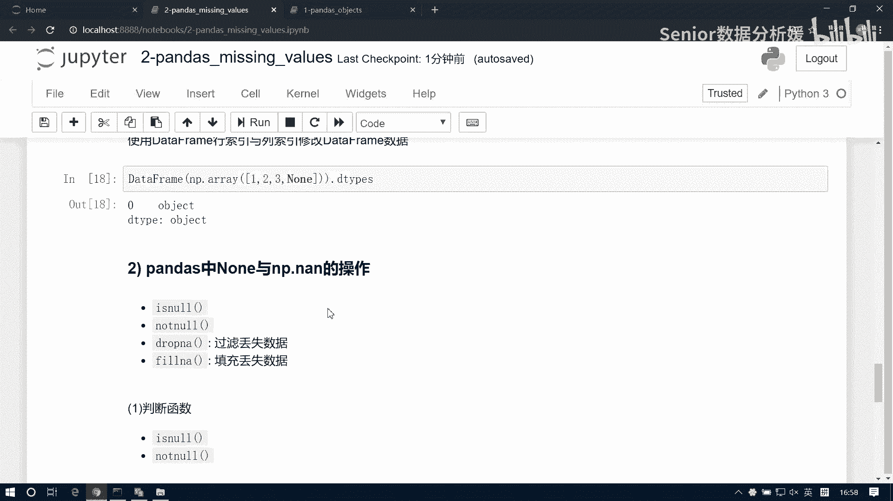
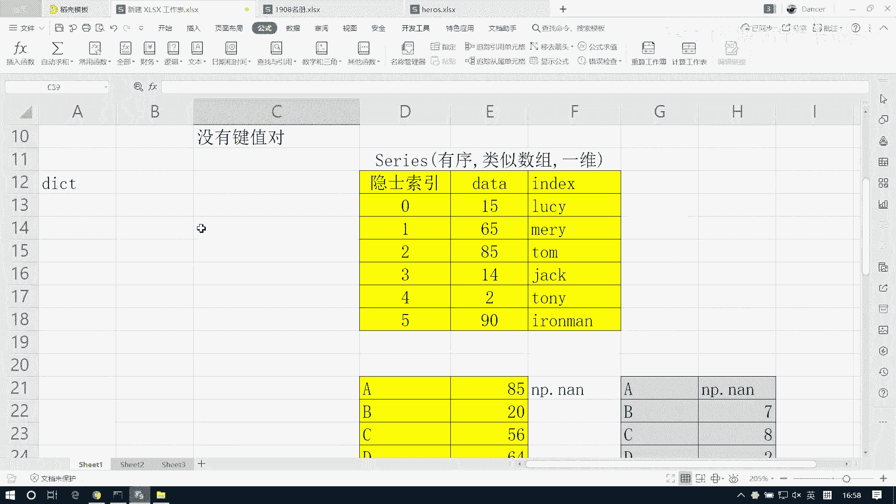
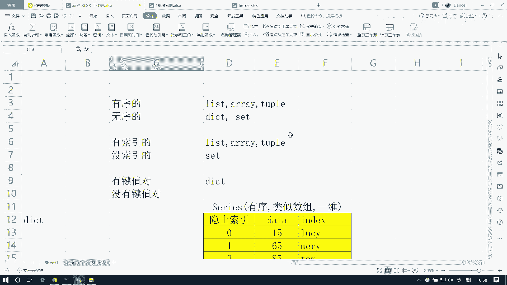
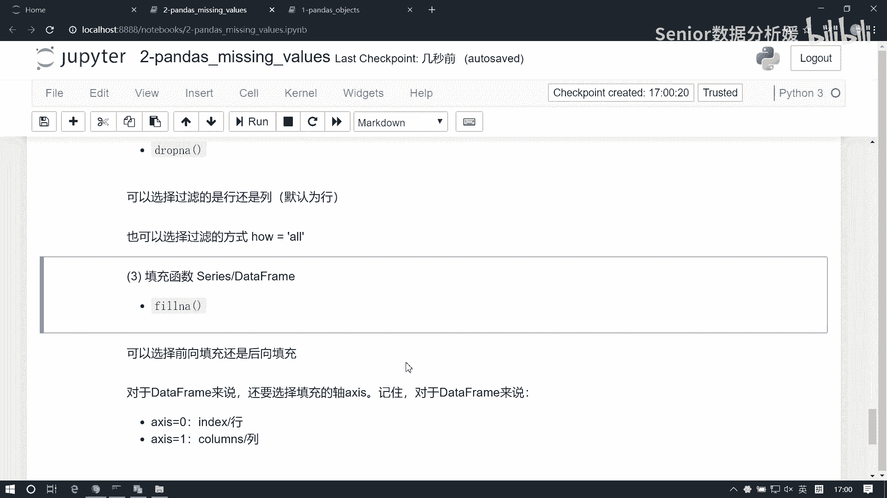

# 数据分析+金融量化+数据清洗，零基础数据分析金融量化从入门到实战课程，带你从金融基础知识到量化项目实战！【入门必备】 - P32：05 DataFrame空值处理 - Senior数据分析媛 - BV1Ak61YVEYX

这个缺失值处理啊，缺失处理，然后这个，我先那个简单说一下啊，然后那个有什么不明白，我明天再细说，因为一会要开个例会啊，所以我先简单给大家过一下啊，对啊周六上课啊，周六上课啊，周周二分。

所以周三对你来讲就是周二啊，对先说一下这个缺失丢失数据处理啊，这个缺缺失数据处理是我们做数据分析，处理数据的第一步啊，我们有这么一个说法叫数据的清洗，数据的清洗操作，所以清洗操作呢啊其实主要是两大块。

一个就是缺失值处理，还有一个呢就是异常值处理啊，其实主要包括这么两块，当然还有一些其他的啊，其他的话呢那就都是细枝末节的小地方了，那么每一组数据进来之后，肯定这会要要弄的，那确关于缺失值处理啊。

异常处处理也好呢，他们都有要有什么，首先就是你判定，我们怎么判定的问题怎么判定，然后第二步才是怎么处理，那怎么处理呢，处理有两种情况，一种是什么填充，一种是过滤啊，所以大大概就这么个逻辑啊。

那首先我们得了解什么是空值啊，什么是空值啊，当然控制就什么都没有对吧，但是呢类型上啊，在类型上它是不一样的啊，南派的南派的空值它应用在pandas当中啊，pandas主要是应用在就是这个pandas啊。

主要是啊使用这个南派的控制，而不是Python的控制，那Python的控制是什么呢，Python的控制就是N就是NN啊，而南派的控制是什么呢，是NP点点NN啊，那我们之前接触过这个NN是吧。

这个NP点NN它有什么特性呢，它是跟任何数据运算都得NN对吧啊，这玩意很倔，那对于他来讲又有什么特性呢，我们看一下啊，这个NN我们加个一会怎么样会报错，对不对，为什么会报错呢，因为我们这个NN啊。

它的类型是不一样的，它是什么类型，它是个nine type类型，而对于NP点NN它是什么类型的，啊没写单派啊，把单派导一下啊，三派as np嗯，它是什么类型，它是个float类型，看到吧。

所以说这个为什么处理成float类型呢，因为我们pandas啊还是做数据分析的，数据分析说到底就是数据运算，是不是数据运算的话，那么对于浮点类型的运算，它的效率肯定是要高于对象类型的。

我们可以做一个做一个这个比较啊，比如在这儿啊，用它啊，我们来处理一个这个问题啊，我们去去对一组数据求和1亿的五次方，这相当于10万对吧，这数10万呢科学计数法知道吧啊10万10万。

那这块呢我们可以把它写定为叫object类型，我看他的时间多长啊，然后再把它变成这个NP点，float类型就看它的时间多长，这是9。49ms，走这么慢，这是多少，就是微秒是吧。

所以说从从这个运算的效率上讲，那float类型的运算效率是远远高于对，象类型的，所以说pandas它是特热衷于用这个NP点啊，NP点NN来处理空值的啊，所以空值的，但是我们在判断当中呢。

如你读取这个空值的话呢，它都是以NAN来展示的，NN它只是一个展示方法，它并不能作为一个值来用，比如说你可以对一个变量A赋值为没问题的，你对一个A赋值为NP点NN是没问题的。

但是你不能对一个A赋值为NAN，知道吧，它只是展示用的东西啊，它只是一种展示形式，它并不是一个数值，而数值是什么，是NNP点NN啊，那那我们这个pandas当中呢，它在展示空值的时候呢。

它是以NN来来展示的，比如说我们来一个serious啊，啊随便写个data frame吧，我把这个data frame导一下啊，啊那就不要了啊，先等展示这个，在这我们构造一个data frame。

DF等于data frame，好我们给它赋一个空值啊，比如这个DF我们去点lock，然后零，然后B啊把他的给一个NP点NN，然后再来一个点lock一个二，然后C让它等于慢，然后我们看这个DF。

他都什么都是除以成了NAN对吧，然后这时候你再访问啊，比如DF点lock2，然后C我们当时复制的是NN，对不对，NN我们知道是什么类型，是不是对象类型啊，啊那我们在这读出来什么是不是NN啊。

啊DF我们去看DETAPES是不是都float呀，对不对，说明什么，说明pandas会自动把main优化成NT点，那对吧，pandas会自动把NN优化成NP点NN类型啊。

嗯但是呢有有一些情况呢不会被优化，比如说这种情况，我们先来一个NP点array123，那，看什么东西说NN呢，我看他的DETAPES什么类型是object啊，为什么呢，你不是能帮我优化吗。

为什么NN不是优化，不是这类型啊，因为这个NN啊先被谁引用了，先被一个列表引用了，列表是不具备优化的能力的，所以它依然会怎么样，他会把这个man当成对象来读啊，那我当我构造nd array的时候呢。

n ni array的时候呢，它呢为了强制类型统一，因为NN是一个高级类型对吧，所以他把这个所有数据都优化成对象类型的啊，然后呢然后呢你再用这个number派array。

再去构造data frame的时候，所以他们多数都是对象类型了，对吧，所以你要注意啊，就是你在列表里面如果使用name的时候，那它会有这个问题啊，但是呢这不并不能说明。

那pandas是没有把man做n n man派类型优化，因为它已经没有机会再优化了，对吧啊，就是他已经成为别人的女朋友了啊，你再努力也没有用了啊，啊嗯是吧，已经一起看日出了啊，那没有机会了哈好了。

那那么无论是哪种情况啊，还有就是包括我们读取表格，表格里面，如果你你这个比如说有空数据。

你读出来的时候，它也是一个读出来的，也是那种空类型的啊。

这个我就不展示了啊，就是以后我们读的时候我们能看到啊，那如果你有空类型的话，那我们就可以用is now和NL，这两个函数来进行判断对吧，但是呢我们要注意data frame当中的。

它里边的这个is now和not now啊，跟我们那个npd is not和not n不太一样，它呢是对每一列啊，对对所有数据进行判断是吧，而我们series呢也是对所有数据判断，但是不一样什么呢。

server是一维的，而它是二维的，所以它返回的是个二维表格，而SA是只是一个一维表格啊，那我们用它可以干嘛呢，用它我们可以结合这个any，any和all来干干事啊，结合ANNA和二呢。

它是做聚合这个i name默认是什么呢，它默认是列方向的聚合，Any any，any对这个data frame处理啊，默认是列方向的聚合，而不是行方向，也不是所有，对吧，所以他给我们什么是每一列。

哪一列存在空值对吧，如果你想看是行啊，如果想查看哪些行有空值，怎么办呢，我们可以用DF点is now，然后点any any，改成一，这样看什么，看的是行了，知道吧，就是改xx等于一。

那默认方向就是xx等于零啊，它是列方向的查看，这个是行方向的查看，所以啊用它呢，我们可以帮我们查看哪一行存在空值，用它可以帮我们查看哪一列这个存在空值啊，这是查看的方法啊。

我们可以用is not和not all结合来使用，结合这个any any和all来使用啊，那然后就是这个过滤和这个填充啊，剩两函数先不讲了，明天再说啊，晚上大家可以自己自己看一看。

