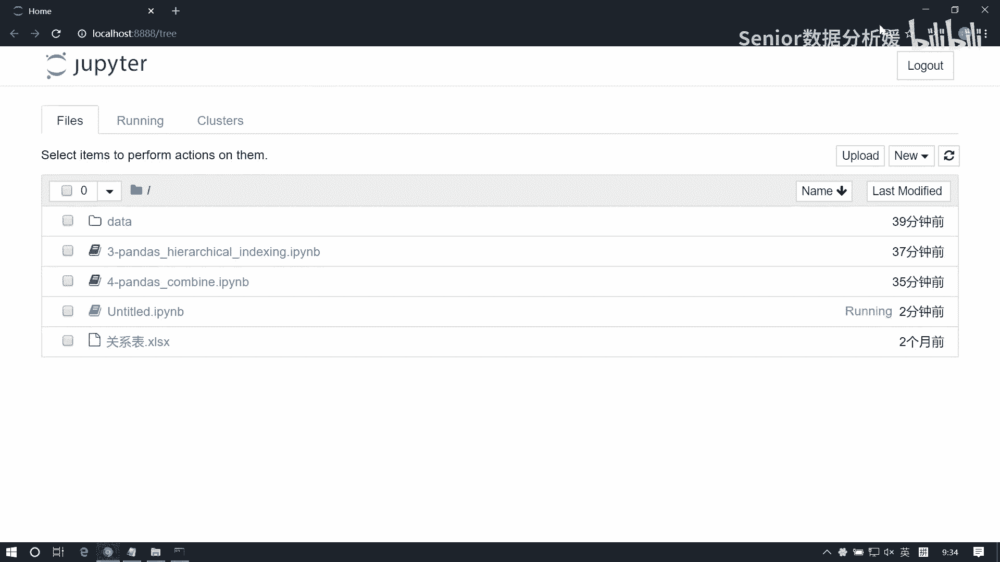
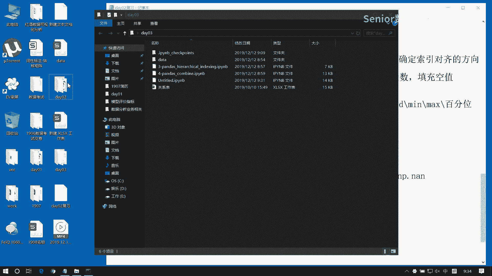
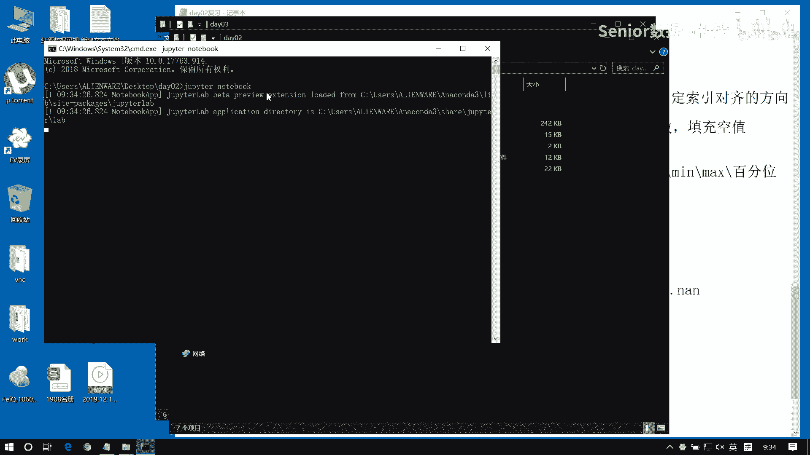
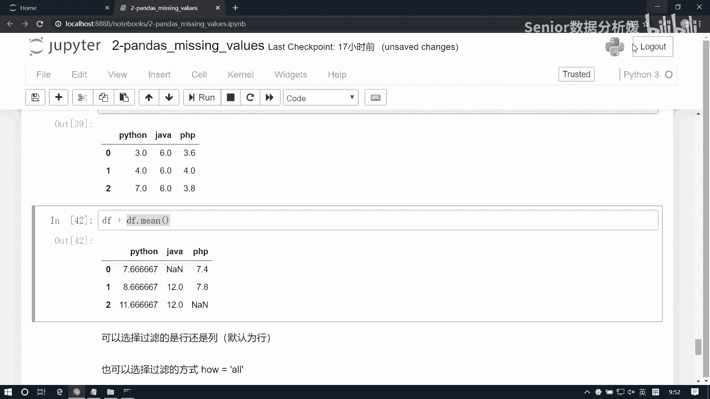
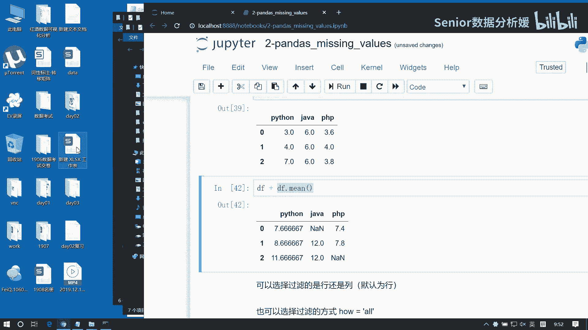
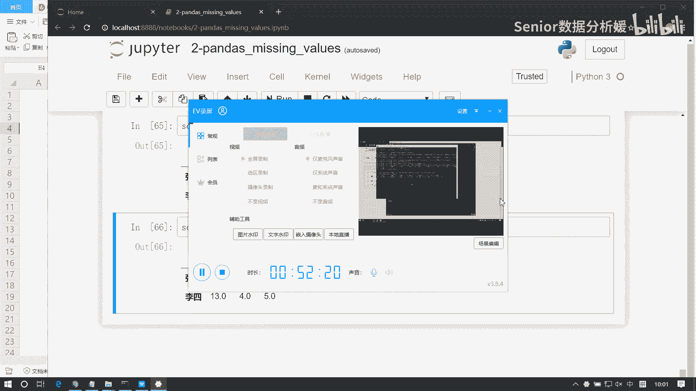

# 数据分析+金融量化+数据清洗，零基础数据分析金融量化从入门到实战课程，带你从金融基础知识到量化项目实战！【入门必备】 - P33：01 day2复习+空值处理 - Senior数据分析媛 - BV1Ak61YVEYX

比如说我我先随机生成一一个这个series啊，呃那它的值呢，我们从那个NP点random点，RANDOINT里面生生成了0~3，然后这个size等于1000，那这样的话我这个data是1000个数对吧。

现在如果我想看这里面，一共出现了哪几种值的话啊，你像我们昨天那个value cos，我们先把它封装成series啊，Series，然后括号括号，然后S昨天我们那个那个value cost。

干嘛能能帮我们去计算这个012，它们出现的次数对吧，如果你你想只想要左边这个012的话呢，有一个很快捷的方式，就是直接对它做一个unique去重，这样的话，那就是整个这个数列当中出现的值一共就三种。

二幺和零，看明白了吧，这东西也很有用啊，就是我们想看我们整个数据的一个构成啊，一个构成可以通过这个方式来查看啊，这unique这大家可以这个可以记一下啊，因为这两个函数都是我们每天必用的啊，肯定要用的。

除此之外呢，我们之前还有一些函数啊，这个比如说我查看前几项，后几项是用什么，后面head和这个PLE对吧，嗯还有还有啊，那head和tail默认前就是前五个和后五个对吧，然后这里边我可以指定一个N值啊。

来自指定他的一个个数，还有没有什么函数啊，还有salt，对不对，salt values和salt index，啊sun values就是根据值来进行排序，SAINDEX就是根据索引来进行排序啊。

这两个东西也比较有用啊，好这是我们的series，那么series之后呢，就是这个data frame，我们的data frame是什么，它是series容器对吧，series容器啊。

然后呢每一列是一个series对象，啊那每一行是不是呢，每行也是一个server对象啊，但我们不能这么认为对吧，我们说它是容器，这个容器一定是这个server，是一列作为一个容器的啊。

因为每一列的数据类型是不一样的，而但是每一行的话数据类型一定是一样的对吧，因为你一旦读出来的话，其实你是相当于破坏了我series对象的，那个原始的结构对吧，还记得吧，我跟大家强调过这个事啊。

所以说一般来讲呢，这个行方向读取的只是一些临时读取啊，那列方向的读取呢，它才是你你这个正儿八经的就是我们data frame，它去管理serious的一种逻辑啊，所以说server是管理server啊。

这个data frame啊，管理series它是以这个列着放的，竖着放的，series的每一个name属性是变成什么实力标签对吧，啊它是默认的列标签，当然你可以修改它，但它默认是这个啊。

呃然后还有个什么问题呢，这个server这个data frame啊，data frame处理二维业务表啊，每一列，数据类型可能不同啊，因为字段不一样啊，第一列可能是name，第二列可能是姓名啊。

第二列可能是年龄，第三列可能是电话是吧，所以这个数据类型是不一样的啊，然后呢，我们这个想获取它的这个每一列的数据类型，用什么DETAPES来获取是吧，获取每一列的数据，数据类型临时性。

然后data frame呢有这么有几个属性啊，有什么属性，有这个index是吧，还有这个columns，还有values，当然也有shape，还有size之类的这种这种东西是吧，那主要还是前三个啊。

index是什么行索引啊啊列与列之间不是没得走，你说什么意思啊，就是每一列的数据应该能想到每一列的数据，啊啊这样我表述我再优化一下啊，就是各列数据可能类型不同是吧，是这意思是吧，好。

那这里边主要是index，columns和values这几个属性的这个应用啊，我们经常会用它，那我们什么时候读index呢，你想去拿到你你感兴趣的一些行索引是吧，你可以通过index。

然后column呢是拿到你想要的一些列索引，而values呢我们一般是用来，比如说如果有的时候data frame无法运算，那我想拿到它的那个值的话，那这个value是读出来的，一般是什么什么类型啊。

是个二维数组对吧，是个南派克ray啊，这data frame，然后data frame的构造，构造有几种方式啊，这个就有点多了对吧，这个首先第一种直接用构造函数来写，那就是data frame。

defer一个data，一个index，一个columns对吧，主要是这么几个啊，然后呢第二种呢用字典来构造data，它等于一个DIC，然后呢那我得给一个index是吧，但是不给也行，不给的话。

index就是01345，是不是啊，然后呢这个字典里边它这个结构啊，注意啊，这建结构怎么写呀，字典结构是什么，是这个key，然后对应的value是什么，是这个value是不是是一个列表啊。

一般这么写的啊，那这个key呢就成为什么成为我们这个列标签啊，然后index如果你不写的话，那么它就是01234默认以隐式索引来填充，其实这个index就是就是谁。

是不是就是series index对吧，series为什么叫index啊，跟它跟它其实是统一的啊，那第三种方法是什么，pd点read excel对吧，其实不应该只是excel，应该是一系列办法啊。

只是这一系列办法，那么其实我们碰到最多的就是一个是excel，一个是CSV，还有就是那个TXT文件啊，其实这几个文件呢啊咱们都会都会用到啊，如果将来我们想需要读取其他文件的话啊，那你就查一下啊。

咱们昨天看到了这个整个pd里边有很多函数，对不对，pd read是不是很多呀，说这么多呀是吧，每一个函数啊，你要你要需要用到哪个的话，你去搜一下，知道吧，这不用讲了，这玩意是吧，不用面面俱。

到时候都得说老师告诉你才能才能用吧，都一个道理的对吧，你去查一下就知道了啊，你知道有这么一个思路就行了啊，pd read excel啊，然后里边参数啥意思，咱自己搜的，我现在咱们都能解决掉啊。

然后这个这是一种，那么它也是我们最常用的一个办法啊，因为我们一般数据量都很大啊，像这种的一般都是可能临时构造一些实验数据，我们会用它啊，真正的业务操作起来都是用它来读的啊。

然后还有就比如说直连数据库什么的的，都是硬盘啊，然后还有什么呢，还有就是我们可能在运算的时候，有的时候会做一些类型的转换处理，那我们可能会把一个data呃。

一个series直接转成一个data frame对吧，这是可以的啊，给它转成一个data frame啊，好这是构造函数啊，那这个构造完了就访问了啊，访问的话呢就麻烦一些啊，但是F的访问呢。

还是要分显示和演示两种角度啊，我们先说显示访问啊，其实一般都是用显示访问啊，如果显示访问搞不定了，我们才会用隐式访问啊，显示访问啊，那么我们又分访问行和列对吧，访问行的话，访问单行怎么访问啊，先说列吧。

访问列怎么访问啊，直接直接用索引，是不是中括号像字典一样啊，像字典一样，比如我想访问这一列数据，是不是直接把K给他就行了对吧，其实这就是那个column name对吧啊，或者你访问多列怎么办啊，Df。

这里边就写个列表就行了是吧，hallman name子是吧啊，这个，啊少就写个S吧，就这个意思啊，哎明白就行，然后如果想访问行的话，访问行是得用lock呀啊访问行得用lock lock，然后怎么样。

先就直接写这个roll name就行了对吧，访问多行呢，DF点log中括号，Roll name，列表啊，防元素呢，元素也是啊，也是得lock，对不对啊，其实就是列就是列访问特殊，其他都是先行后列。

都跟二维数组的逻辑是一样的啊，先来个肉，然后再来个HOLYMAN啊，这是访问元素，然后布尔列表能不能用啊，能不能用布尔列表也可以啊，可以用布尔列表，这是显示访问，那隐式访问的话。

那就是我们用i log处理了，也是访问列怎么访问，他得他得先行后列对吧，冒号逗号像切片一样，对不对，然后这写什么COLLEMAN，这不是name了，Contrerman index，对不对。

就不是name了，也是访问嘛啊，然后呢访问多列的话跟道理是一样的，对不对啊，你把它变成列表或者是布尔列表就行了啊，但但你要注意隐身访问的布尔列表，是不是不能带那个索引啊，对吧啊。

用那种纯的南派克瑞的列表啊，然后访问行呢，咳咳那就简单了，直接点LOLL就行了是吧，写roll index啊，然后访问多行呢跟他一个道理啊，用列表来处理，那访问元素呢一样的，先行后列。

DF点i lock，然后先写行行的索引，再写列的索引，好在访问那切片呢，切片的话，那你要注意的是什么呢，就是显示切片跟也是切片的区别是吧，这个显示切片是什么，是闭区间，而隐式切片是开局键嗯。

那这个切片的道理跟这个访问是一样的对吧，那无外乎就是你要是做列切片是什么，链接变我我我这个直接用它冒号，那个行不行啊，能不能直接用这种方式来写，还有个口诀呢，忘了，直接使用中括号会怎么样，索引是行索引。

然后切片是好索引是列索引啊，哈索引是列索引，切片是行切片，记不记得这个了，所以切片会特殊一点，切片不支持这种形式对吧，你如果用这种方式来切片的话，那么这里边要写的是什么，因为你直接用中括号。

它相当于是行方向的切片，对不对，记不记得了不记得了是吧啊，加深下印象啊，记住啊，这是为师传授给你们的这12字真言啊，十二十二字真言啊深深刻在你在脑海里啊，就是切片切片你要注意特殊一点啊。

就切片你要注意就这这个东西不能直接用是吧，就其他就是但凡你就是你，你就记住一个窍门，你只要用点log来处理，它都是先行后列，这玩意你怎么干都不会有错的，你就当当二维数组的用就行了对吧。

所以你就是最靠谱的，就是用点log来处理，不论是访问呢还是切片呢是吧，都没问题，那如果是行情变很简单了，这个，行，这变我们直接这个DF，我们点lock，然后这个roll name1冒号。

roll name2对吧，或者什么，或者DF直接中括号，Roll name，一冒号，roll name2对吧，这都可以的啊，那如果是列切片呢，点到也要从行方向左手啊，DF点lock。

点到好像第一维不动是吧，第二维在call name1冒号，Call name2，那那个隐式索引是一样的对吧，引索引只是把这个东西替换成那个index就完了啊，好在800多好，或者DF点i log对吧。

i log行斜线直接是index1冒号index2，但你就是注意这个区间是吧，区间是不一样的，点O点i log也是第一维不动，第二维是index1冒号index2，访问好，这是访问啊。

呃访问完了就是属性了呗，嗯应该是一些方法了，属性已经说完了是吧，index集啊，那就是运算了，好它是怎么运算的呀，他要分三种情况来说是吧，第一种是云南派运算，广播，与sales运算。

这怎么样要分行和列对吧啊，要使用ADD函数，就是ADD这一系列的函数对吧，那这里边有一个参数是other，这就是你要跟谁去运算，第二个参数是什么，用来指定我们行方向还是列方向啊，就使用这系列函数啊。

来确定这个索引对齐的方向，默认是什么对齐啊，是跟行索引对象还是列索引对齐，默认是列索引对齐是吧，以列朝列的方向对齐啊，这是默认的，就是嗯这个pandas里边很多的设计啊，它都是默认是以列方向来处理的啊。

因为列方向是业务，就是字段啊，他他习惯是以列方向来处理，然后呢另外就是data frame之间运算，大都不放，那这个呢还是使用ADD函数对吧，这一系列的函数，那它就不存在这个access了。

因为它默认都是行列对齐，但它有什么，它有个fail value，对吧啊这系列函数啊，来干嘛呢，来去，填充这个空值，为什么填充空值呢，因为它这个是要怎么样索引对齐对吧，还有索引对齐。

所以你对如果对不齐会怎么样，是不外补充值啊啊如果一旦补空值的话，222运算就会得到空值，所以我们可以通过fl value这个函，这个参数来这个处理你的空值啊，就填充的空值你怎么填好，可以修改它啊。

这是我们的运算啊，运算还有什么，然后这个data frame呢我们也是新增两个函数啊，有一个叫DISCRIBE，还有一个是info啊，这么两个函数啊，他干嘛呢，他查看一些常规的数学指标，它包括什么呢。

有这个个数相当于一个数据报告了啊，count然后这个最大值啊，不这个均值，然后方差还有这个最小值，最大值，还有这个百分位数啊，有几个百分位数，所以他是一个数据报告，那它有什么特点呢，就是这个这个函数啊。

它只能查看，就是给我们报告那些可运算的数值类型啊，比如说如果你是那个字段是name，或者你字段是地址，那这种东西它是求不出来的对吧，但求不出来这么多这种数学指标啊，所以他只能给我们去报一些数学指标啊。

那info干嘛呢，info来查看所有所有字段的信息，所以这两个东西呢，都是我们用来去了解数据集的啊，一个常用的办法好，可以简单演示一下啊，比如我们生成一个data frame。

NP点random点RANDOINT100，size等于六行六列，然后这个音呃，Columns，我给他一个list a b CD e f好，这是我们的一个数据啊，那我看啊，第一个函数describe。

describe啊，它呢就可以帮我生成这些值，知道吧，每一列数据啊，看count有六个是吧，然后呢均值是这么大，然后标准差是这么大，最小值这么大，最大值这么大，然后这几个百分位数，百分位数是啥，知道吧。

啊就把就把它分成这个几等份啊，他占25%的那个高度，这个50%的高度它就是中值呗对吧，这是75%的那个高度啊，这个值是多少，它可以用来帮我们衡量，就是这个数据的一个分布的一个指标啊。

好这是一个常规的数学指标，然后另外一个函数呢是info，info它可以帮我看什么呢，每一列数据他们的一些信息，比如这里边我们可以看整个数据集，它有啊，有这个多少列啊，一共六列对吧。

然后呢内存占用是224，bet bet24字节对吧，然后呢这里边的每一个数据是每一组啊，是六个啊，然后类型是int32啊，当然你可以调整它这个这个数据的类型是吧，那他报的这个结构就不一样了啊。

所以这两种这两个函数呢，都是可以看一些基本的这个指标啊，那除了除此之外呢，其实它也有那个什么，也有那个head和那个tail这个函数啊，查看前五行啊，也可以查看前两行。

来帮我们查看这个数据的一个基本结构啊，pad还有tile，把它比如查看三最后的三个啊，好然后呢最后就是我们那个空值啊，首先我们这个这个了解一下这个空值，那这个空值呢它有两种情况。

一个是Python的空值是吧，Python的NN，还有一个是我们这个NP的空值，这个NP点NT啊，NP点NN，它的它的这个表现形式啊，就是这个输出形式是NAN是吧，note number啊。

那类似这种形状，还有啊，比如说NT啊，NF等等啊，他们都表示什么，就not一个什么not time啊，什么not number啊之类的，就这个意思啊，那他们呢不能当当这个数值来用啊。

他们只是我们pandas在输出的时候，是以这种方式来展示的啊，那这两种类型有什么区别啊，首先说NN它是什么类，什么类型啊，WIF它是nine type，其实就是object呗，对吧，就是对象类型啊。

而我们这个NP点NN它什么类型，它是浮点类型是吧，float flow类型啊，所以它的运行效率要高啊，而且呢还有个问题，就是我们pandas的时候会怎么样呢，会，自动把NN优化成为NP一点慢是吧。

给它自动变成浮点类型来来处理啊，但这里面要注意啊，就列表不会对吧，列表不会把nine处理成NP点NN啊，这是要注意的地方，然后呢，另外呢我们说可以通过这个is now或者是not now。

我们来查看一组数据，每一个值是否为空对吧，然后这个东西呢去结合我们这个any和这个all，就可以来帮我们去检测哪一列或哪一行，数据存在空值，是不是啊，这叫什么，这叫空值的检测，空值检测。

那么检测到空值呢不是目的，目的是要解决它，解决它，我们首先是两个办法，一个是这个空值填充，一个呢就是空值过滤，啊就这两个办法，没别的办法啊，肯定逃不开，要么是填，要么就是删，这是两件事啊，那我看看啊。

这两个函数都是什么。

看这两个啊，那这个这是我们检测空值的办法，然后现在呢我们想去过滤它啊，那第一种情况过滤啊，我们这个拿这个DFA为例，它如果我们想去过滤，那直接点DPN，啊job nn，那么注意啊。

我看如果你直接照BNN，会发生什么，会得到了，本来是这样子的对吧，这个第一行和第三行是有空值的，然后我们过滤完之后只剩下第二行了对吧，那你说它默认是过滤的是是行还是列呀，默认过滤过滤。

啊然后呢还有一个问题，默认过滤是有空值就过滤，还是全为空滤过滤啊，有空值就过滤，这是默认的情况啊，那么这个这两个条件呢，我们都可以对他进行处理啊，那怎么处理呢，JP这个里边啊。

是我们来控制这个行列变换的，零是默认的是行对吧，Y改成一，这样呢，labels index or columns啊，这不是jump，是jump nn啊，写错了啊，它等于一的话，是不是就是删除列了对吧。

那你看我这个B这一列和C这一列是有空值的，所以我把B和C列过滤掉了，对吧啊，这个东西来控制方向啊，X控制方向，那另外呢还有一个方方法叫jump哦，JUPN这里边有个号，这个号啊。

我们展开看它里面有any any和all两个方式，这个any any和all跟我们那个那个聚合函数，any any和all是一个道理啊，如果是any类的话，什么有空就删，如果是all什么的。

全为空才删啊，所以说如果我们把这个号啊，这个号我给它改成一个all，这样的话是没有一个都没删啊，那我可以把这个A和C啊，这两个值都给它替换为空值，我可以改一下啊，DF点lock这个零。

然后逗号A把它设置为NP点N，再把这个DF点lock0，然后C把它也替换成NP点N，好现在我是不是第一行全为空了，那我现在呢我DF再去DPN，那xis默认值就是零是吧，就是我删行啊，行方向，然后呢。

我把这个have就是删除的方式给它设置为all，这样的话是什么是全为空，我才删啊，所以这样我就只删除了第一行对吧，其他的就不动了啊，嗯啊这是我们过滤空值的办法啊，过滤空值，那么还有一种情况呢。

就是我们填充空值啊，比如说现在我们我们对于这样一组数据啊，这个嗯这个我让他撤回来啊，这个东西我不要它了，我把这个再拿过来，嗯口圈里是随机数啊，NP点random点RANDOINT，0~10。

然后size等于一，然后取个零，为什么要取个零啊，错嗯啊，后边为什么要取个零呢，为啥呢，因为它产生的是什么，是不是个数组啊对吧，它生成是个数组是吧，这个数组我必须要怎么取一下值，才能拿到这个值。

对不对对吧啊，所以我取个值啊，好现在我把它重新生成一下这个DF好了，现在变成这个样子了啊，那现在呢比如我想填充啊，我想填充，比如这个B啊，这个B假设ABC是三个成绩啊，我把这个索引给替换一下啊。

有同学可能好奇我这索引怎么替换呢，其实很简单啊，它是不是有columns啊，这不是它的属性嘛，对不对，得给它一组值啊，比如说Python java，然后，P2P是不是替换过来了啊。

但这样这种替换比较麻烦，因为如果列数少还行，如果你有100列或者是35列，那这样写就折腾了，对吧啊，我们后续有这个专门替换索引的办法啊，不着急，但你要知道这种方式可以替换的啊。

假设我们现在想去填充这些成绩啊，将这些成绩，那比如我现在想填java，那012呢，这三个同学啊，三个同学我想把这个java这个程序填充了，那你觉得这个值有有几种可能呢，怎么填呢。

那无外乎就是我参考你个人的成绩，来给你填对吧，比如说啊比如说马三龙啊，每次考试倒数第一是吧，然后呢他java没考啊，他非要拿咱们第一的那个成绩填，那你你干嘛，那肯定不干，对不对对吧，肯定不干，那怎么办。

有什么是最公平的呢，你拿你自己的平均分给你填，对不对啊，你Python考了25分啊，P2P考了三三十六分啊，你拿你自己成绩填啊，这个没没毛病对吧啊，或者另外一种一种逻辑是什么呢，就是这个人可能他是一个。

比较符合大众的值的啊，比如说我们先统计一统计了一组数据，统计一组数据呢，然后某一个人呢身高丢了啊，就是这个身高这个这个数据没了是吧，那么我我就可以填什么，我说可以填这个数学期望值啊。

这一组数据的期望大概多高啊，比如175或者172是吧，那我可以拿172来填填它对吧啊，这样的话呢会保证你的数据呢不会出现异常，也不会太离谱对吧，所以说那个这个值是什么，是列的方向。

那比如这里边我想填java，比如这个同学呢，他成绩一直是属属于中等生，那我就可以拿什么，我可以拿全班的平均成绩来填充它的值，这样呢不会影响我这个数据的一个，总体的一个一个值的变化对吧。

比如说我想老师想去参与测评，说我想看看我的java哎教的怎么样啊，这个课上课的平均分我要比较一下，那它不会影响这个数值对吧，所以说我们填填空值呢，常见的就是两这两套方案啊，最常规的两套方案。

一个是呢拿我值，拿我这个值的横向之间做比较，然后填值或者是呢拿我纵向之间去做比较，去填值啊，或者拿左值填充，拿右值填充，或者拿上边的值填充，拿相邻值填充啊，咳咳再就是一些特定值填充啊，主要这么几个思路。

但是具体的具体的填充办法还得要去结合数据，也要结合业务去看啊，但这几几种方式方案都是可行的，可能最常用的就是拿列方向的那个，平均数去填啊，这可能是最常见的能看啊。

我看他这里边给我们提供的这个fil nine函数，是怎么来处理的啊，啊DF我们去费用，那嗯嗯非常大，这里边有一个什么啊，有个value啊，这个value呢给个值啊，比如我们给一个100吧，我们一填。

我发现怎么样啊，是不是把所有的空值都填上了啊，把所有控制都填上了啊，那这是一种方式，就是如果你的所有控制都可以统一处理的话，用它就完事了啊，但是呢往往现实不是这样子的。

现实呢我们不可能把所有数据统一处理啊，因为每一列可能数据形式是不不同的啊，嗯那第二种情况怎么填呢，好它有个method啊，有个method，我们来看这个method有什么用啊。

method我们展开看的话，它里边有这么几个方案啊，我把它拿出来，放到这啊，这个BFILL什么意思啊，向后填充，b fail跟back fail是一样的，pad跟f fail是一样的。

F费用什么for word费用啊，向前填充啊，所以说呢这个method呢，它是给我们指定了一种填充方式，所以如果你一旦指定了填充方式，比如说我咱先不考虑横纵的问题啊，比如说就行方向啊，我如果是向后填充。

那就是我拿四来填这个值，明白吧啊那这个值显然它前面没有值是吧，他前面没有值，所以他没有办法向后填充，所以这个值就不会被填啊，那如果向前填充，那就是拿三往右填啊，往右填啊，拿三往右填。

那么就是拿三把这个控制填了，然后呢这个控制呢就会被六填对吧，那什么叫前，什么叫后呢啊从左往右叫向前，从右往左叫向向后，如果是列方向，从上往下叫向前，从下往上叫向后对吧，这个应该比较合合自然而然的逻辑了。

应该不算反人类吧，是吧啊，向前啊，向前就是向右下啊，向向后就是向左上啊，就这么一个一个道理啊，那我们这块呢比如说我指定一个向前填充啊，F file，那谁把谁填了看看啊，这里边这个这个难值啊，它是四。

这个四从哪来的啊，说是从这来的呀是吧，那你说他这个方向是怎么来的，是从上往下拉，对不对，从上往下的对吧，那我可以证明一下，如果我们把它调成back fill的话，那应该是六把它填了，对不对。

把这个换成b file，是不是六把它填了啊，所以说默认方向是什么呢，默认默认的这个填充方向是列方向，又是个列是吧，又列方向，如果我们想横横着来填呢，可以改轴向，轴向用什么来改，我们已经碰到过很多次了。

对不对，那我们method我们还是指定为b file，这时候向向后填，对不对，那从右往左是向后吧，那这个空值是不是被四填上了，是不是再向向后啊，那如果是向前的话，那说三把它填上，六把它填上。

把它改成F是这个值变成三了，这个值变成了六，对吧啊，填充控制的方向啊，然后呢再比如说啊，比如说我现在想去，想去用每一列的这个平均值来填充，这个值怎么办呢，嗯这怎么搞呢，那你现在把每一列的均值算出来。

对不对啊，怎么算这个均值啊，这边呢其实要用到一个，又有一点这个聚合的这个思路了啊，聚合我们虽然没有讲，但我们昨天讲了一下那个IIC和all any eon，我们来来这个简单回顾一下啊，any那个on。

我们是在这个is now和not now里边说的对吧，那你看啊，我们说你你先对这个DF点is now，其实你得到这个数据是什么类型的，是series还是data frame还是南派啊，这什么类型啊。

这明明明明显是个data frame吧，对吧啊，这个data frame啊，那我们说这个any类函数是不是聚合函数啊，这个any内得到什么，得到是不是列方向的聚合呀，那你从这一点上能看到什么呢。

就是说这个聚合啊，就是这个聚合函数，应用在这个data frame当中，默认是对列方向的聚合，是吧，那还记得我们南派的聚合吗，南派聚合怎么聚合的，给个DNP点random点RINT。

0~10size等于五行五行三列吧啊再清楚一点啊，啊我们对data做聚合，比如说我求啊，我求这个和吧，它得到什么是不是总总数的和啊对吧，但这个南派的聚合是默认是全部数据的聚合。

data frame聚合是默认列方向的聚合，那data frame man派的聚合我都当给大家说了，如果你想控制它的行列的话，如果是零算的什么，是不是列方向的聚合啊，如果是一算的，就是行方向的聚合。

对不对，是一个道理啊，能搞清楚吧啊就是说他其实是data frame，其实对这个聚合他做了控制啊，他做了控制，因为什么呢，因为有很多时候我们我们算行方向的聚合，是没什么意义的，你说你行方向有名字。

有地址，有年龄，有收入，有性别，有电话号码，你说这把这个词你挂机加一块有什么意义呢，是不是没有意义对吧，而列方向就不一样了，列方向首先你名字这种它是字符串类型，它没有没有加的必要，它加不出来呀，对不对。

但你但凡是数值类型，比如说我这个考试成绩有Python啊，有java啊，那或者有年龄或者身高，那我就可以算出一些什么均值啊，或者标准差啊之类的对吧，我可以算一组数据的一个平均水平，之类的东西对吧。

所以说一般来讲列方向的聚合是这个意义，是比较有个这个常规的啊，比较有用的啊，但是豪华站也不是没有，比如说你这个表就是一张成绩表对吧，成绩表的话，然后我就想算每个人的平均成绩，那这种就是行方向的聚合对吧。

那也可以用，但是更多的还是列方向的聚合，所以说data frame它不是不能做，它只是说它更贴合业务啊，他他呢就直接帮我们优化这个事了，所以说他这个any啊，它的聚合呢都是直接对列方向聚合。

那我们再举个例子啊，比如说我们这个DF它能不能求和呢，一样的直接sum，你看求的什么，是不是列方向的和啊，求均值能不能求呢，求个M是不是一样的啊，也是这样的啊，那有个什么问题呢。

data frame它是有空值的，看到了没，是不是空值啊，那我们这个做聚合的时候，空值跟数据与运算不得空值吗，是不是那data frame会帮我们优化这样一件事情吗，他会帮我们优化。

比如说他除了帮我们优化了一个运算方向，之外的问题呢，他会帮我们去解解决这种空值的问题，空值不运算，那他解决这个问题了，啊所以这个聚合啊就是我们可以这样去求啊，那现在呢现在的话就好办了，现在如果想去。

我想去这个填充，以这个每一列的平均值来填充的话，那我第一件事是不是还得算出来，每一列的平均值啊，那我就求一个面数据，自然就出来这个这个数了对吧，这是个什么什么类型，data frame还是series。

啊是不是个series啊，现在我要让干嘛，我要让我这个data frame跟我这个series运算，是不是运算啊，看我们直接来个FNINE啊，这个value我给它等于一个DF点min。

看能不能出来这个值啊，Z值是六P2PZ值是四，是不是，那我把这个值改一下啊，我们去怎么改一下呢，这是DF啊，我们把这个改个小一点的数啊，DF点lock，然后0PSP不让它等于一个3。36吧，好这样的话。

我这个看下我这个点min啊，Python是均值4。6，然后java是6P2P是3。8，这个值是3。8，这个值是六，对不对，就可以这么干了，知道它会怎么样呢，它其实跟我们的运算是一样的。

Python这个你看我们这个data frame，他如果跟这个series如果直接相加的话，比如这个DF点M，现在怎么加呀，是不是就是默认就是列方向相加呀，是不是就对应位置相加呗，现在相当于什么呃。

我把我这法宝记出来啊，Excel。

现在你这是这个123，然后这个这个421，然后这个352啊，然后这是嗯，这是A这是B这是C，然后现在你的series，这是ABC，然后这是一个121个三，现在这两个东西相加是怎么个加法啊。

咳咳他是怎么加的，这就是还是一样的，就是我我这个series是会什么，会把每一列数据跟他的每一列数据相加对对，就说白了就是他跟这个一加，他跟这个二加，然后他跟这个三加同样的，421呢也是跟123加对吧。

352呢也是跟123加，对不对啊，啊它这个data frame跟series不是行列可以变换吗，对吧啊，那它默认就是以列索引对齐来进行相加的啊，所以说道理是一样的，那费用那的话会怎么样呢。

费用那也是我会拿对应的值来填你的空值，比如这个地方我是空值，然后这个地方是空值啊，现在我拿这个值来填它，那我第一个值不是空值，所以它我就不用取了对吧，但这个值是空值，那我就取这个对应位置的值。

把这个二填进去对吧，然后这个值不不是空值，不用填，然后这个不是空值，不是空值，不是空值，它不是它不是它是空值，它是空值，是哪取啊，说去三，那这边取啊，把三拿过来填进来了，是不是就填完了，明白吧。

所以他这个东西跟我们的运算逻辑是一样的啊，啊那你要注意的是什么索引，注意对齐就行了啊，所以这是一种填充方式啊，就是这种方式啊，你可以直接拿我们的想要的值给往里面填啊，how好，那我们来看看这个练习啊。

减速慢与NN的区别，NN是什么，NN是什么，man是对象对吧，NN是什么，NN只是个符号，是什么都干不了对吧，他是谁，他是NP点慢的符号，是吧，而这个NP点NN它是个是浮点类型，float类型啊。

它是对象类型，然后呢，那它的运算效率高，它的运算效率低对吧，还有个什么问题呢，就是pandas会自动把NN这个优化成NP点，来对吧，就这样啊，那二三啊，假设张三李四参加模拟考试。

因为张三突然想明白了人生放弃了英语考试，因此即为N，请根据此进制创建一个data frame，命名为这个这个表，咳这里边是张三李四来参加考试啊，然后呢这里边呢他没有提一共有哪个学科，那肯定有数学。

有英语加个语文吧是吧，三个学科咱们来写一下啊，那columns等于语文，然后数学再来个英语，然后这个index，那显然他是要用这个人物来做行索引的对吧，人物姓名的，我这边写一个张三，然后再来个李四。

然后data frame我写一个scar啊，它等于一个data frame，然后这个data data不就随机生成就行了是吧，这一共几个几行几列呀，加上几列两行三列嘛是吧。

那我们这块NP点random点RINT啊，0~100，然后size等于二三，index就等于index，然后columns就等于这个columns好，这是我们的scar啊，现在什么呢。

现在是要张三张三想明白人生放弃考试，我把它记为N英语考试对吧，那我就访问张三的英语成绩呗，是不是，那这个办法很多啊，如果用显示索引的话，直接lock，先来个张三对吧，然后再来个英语是吧。

把它记为man这一种办法对吧，那替换成功没，哦这是死杠啊，尴尬啊死杠，是吧，他这就成功了啊，那如果你有隐私索引怎么办啊，i lock行是几零列是几二，是不是这个是空值是吧，我把它复制为NP一点不一样的。

咳咳一样的啊，好他放弃英语考试了啊，老师决定用数学的分数来填充张三的英语成绩，用数学分数来填充张三的英语成绩，那这个是个什么填充，咳咳嗯，你可以这么干是吧，比如我先把数学程序取出来，对不对啊。

就是DF点log先张三，然后英语，那这个赋值我们必须要用log这种方式来取对吧，但是如果说你想你想获取一个值的话，这个办法就随便了对吧，就是只如果你是读数据，无所谓，用啥对吧，如但是如果你要做赋值操作。

就用写操作，那么一定要用标准的这种lock方式来访问元素啊，那这边我们想把数学读出来，太好办了，直接先来一个，数学可以吧，是不是读出一列啊，多出一列，得到一个series series。

我们再去访问这个张三，可以吧，啊不是DF啊，是scar，哎呀搞搞错了，是吧，这是一种办法啊，给它填充了，那或者怎么样呢，把这再换回来啊，或者用那个method来处理对吧，那用数学程序来填充。

英语显然就是什么向前填充，横向的向前，对不对，那我就FNN，然后我这个method是不是得改一下呀，这叫f fail是吧，这样填过来了，那如果你想替换原始值的话。

你把这个in place加上等于true，Not employment，Playment，没有这个东西吗，刚刚啊有啊，嗯in place等于true，Fill nine value，Limit。

啊他这不让这块还不让用啊，不让用算了，不让用，那你重新保存一下吧，然后替换一下就行了啊，这样处理也一样啊，咳是吧，这样就可以了啊，因为他操作内存上可能是冲突了啊。

好那下一个这个李四的英语成绩来填充张三的，然后再回来啊，再让他变成空值，再变成控制，李四来填张三的，那显然是什么向向上的，属于向前还是向后啊，好向后对吧，那它得是纵向的，向后的吧，那默认就是纵向的。

不用改那个access了是吧，我们直接这个FN，我把这个呃method给它设置为b file啊。

