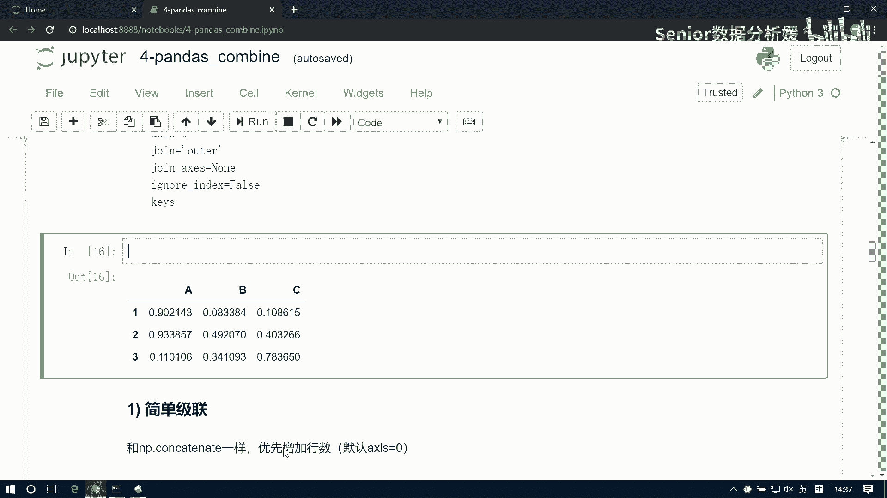
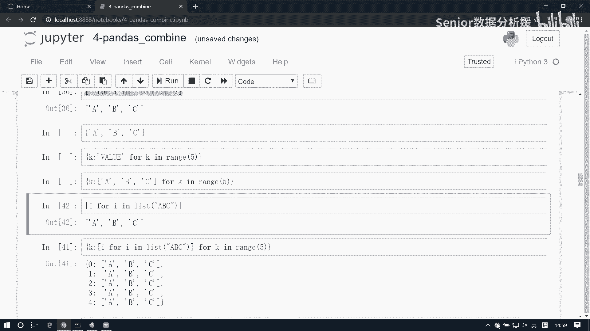

# 数据分析+金融量化+数据清洗，零基础数据分析金融量化从入门到实战课程，带你从金融基础知识到量化项目实战！【入门必备】 - P37：05 DataFrame级联-01 - Senior数据分析媛 - BV1Ak61YVEYX

打起精神来啊，呃pandas的拼其实不能叫拼接，应该叫汇总，属于一种数据汇总，数据汇总呢除了我们今天讲的节点和合并啊，还要有分组分组处理，然后呢还有一些分组分组表的一些，这个就是运用啊。

有比如什么交叉表啊，透视表啊啊，那基本上我们做数据分析呢，就是基本上就是用这些东西在做这个处理啊，就基本离不开这个东西啊啊那除了他之外，其实后边也就是一些绘图绘图的东西了。

所以它其实占了我们整个数据分析里面，很大的一块啊，很大一块除了这个业务上的逻辑问题啊，基本上你用的技术就这些啊，先说第一个啊，几点节点的话，这个词并不陌生，我们已经接触过了啊，那我们接触的是南派的节点。

那派怎么节点的呢，回可以回顾一下啊，呃咱先生成两个两个数组吧，N1等于NP点，random点RINT100size，323列，一个三行三列，一个三行四列，南派的节点有两个原则，还记得吗。

首先这个南派这个节点，可以多个数组一起接连啊，然后第二个呢这个吉连的方向上是吧，这个形状必须一致是吧，比如说我三行三列跟三行四列，那我只能在行方向起点，不能在列行向节点对吧，它会报错是吧，直接就报错了。

所以这是它的弊端啊，但我说了，我说这个丹麦子点呢它并不常用啊，它只是提供了一种节点的基础，实际上我们这在真正的业务表上的，节点的逻辑呢，它是我们应该用pandas来处理啊。

那么现在我们说的这个就是pandas节点啊，它要比它远远要高级很多，那这个东西啊它怎么连的，语法是NP点CCINNATE对吧，里边接收一个ARRELA类型，就一个集合就行了对吧，这边我给上一个N1N2。

默认值是几啊，是不是零啊，零是方是列方向连，对不对，连网也连接错了，为什么，因为它是三列，它是四列，所以我就把我们想连成功，横着连就没问题了，对吧啊，这是他的他的问题啊，那派节点有问题额。

那我们这个pandas级连是怎么连的啊，pandas几点呢就要要灵活一些了啊，比如说还是这样，两组数据，我们给它做一个封装，封装成data frame df1等于data frame，data等于N1。

然后columns它一共是几列三列，那我就写个list a b c，然后第二个DF2等于data frame，data等于N2，columns4列是吧，给一个ABCD，输出一下DF1DF2好，他们俩啊。

咱们在pandas里边呢，想连的话很容易啊，直接pd点COCAT，它不叫CCAT，NE一样也是要去接收一个array like类型objects，这是个复数是吧，复数呢就是一个数组啊，给个数组就行了。

那这边我把这个DF1DF2给它，默认是纵向连啊，怎么连的，看这是全是0~100的，这里到十个，他会什么，他会给我们补空值，对吧啊，会补空值，然后呢它会保留什么，保留我这个所有的字段啊。

就是列方向的这个列标签会全部保留啊，因为我们的正常的业务表，比如说你你今年啊，你今年统计的是这个AABC3个指标，然后明年你多统计一项是吧，比如今年是啊身高体重年龄啊，第2年身高体重年龄。

女朋友的年龄对吧，那你不能说因为我今年有了女朋友，去年数据就没有没有用了，对不对啊，你还得留着啊，所以它会更适更适合这种业务的处理啊，那他同样也可以也能够帮我们干嘛呢。

也能帮我们去解决横着连还是纵的连的问题啊，如果那默认显然是纵的连对吧，默认是竖着连，如果想横着连呢，可以用这个好，DF2axis等于一说行方向连了啊，那有个什么问题呢，这里边啊。

呃这个我们南派默认连的就是行对行，或者列队列对吧，它这里边啊也看着也是行对行列对列，但他这边是有索引对齐的问题的啊，顺应对齐的问题，比如说我现在把这组数据我变成我再来一个吧。

DF3等于data frame，data等于NP点，random点，random int0好十到到零，size等于三行，三列三行四列，然后compliment等于list b d a c4页啊。

这是DF3，好了，现在我这个DF1它和DF3如果连接连，你看DF1啥样的，DF1是ABC是吧，ABC他是BDAC啊，那他怎么连，他不会说这个B跟这个A连啊，他是怎么连它是。

所以要对着连NP点contact at不是NP啊，PD啊，pd点COCAT不要小括号啊，Df1，然后再来个DF3，默认纵的脸是吧，看A列列979十十六，979十十六，这没毛病啊。

然后看这里边他的a-7七负七，好巧啊，那这边复习复习复习对吧，然后这个B呢七七呃，十二七十二，然后九负十负四，b-9十负四对吧，所以这个东西呢它是以它的几点啊，是以以这个索引对齐，以索引对齐为原则的。

其，为原则啊，那如果索引不存在，怎么样呢，就补上啊，就补空值，啊比如这个D是吧，D它是不存在的，DF一点不存在，它就补上这个空值，啊这是它的一个基本的一个连接思路啊，那么，两个3×3的矩阵。

分别对进行两个维度上的检验，这就不写了，好吧啊，这个比较简单吧，啊要不要练一下呀，啊那那你写一下吧，给你2分钟啊，就2分钟啊，写一下啊，先来一个DF，一等于NP等于pd啊，等于data frame。

然后两个三行三列嘛是吧，那date应该是NP点random，点点random，然后random点random，直接给个size就行了是吧，这是323列，这是浮点，对不对，0~1的浮点。

然后columns我们等于一个ABC，然后index也也设置一下吧，index等于一个，123嗯，然后DF2，然后保，345啊，我这胡乱写写两个是吧，跟他跟他不太一样啊，不太一样。

然后现在我们来给他做几点啊，pd点，Contact at，现在我我这个默认是什么，是不列方向啊，默认就是NO xx就是零啊，就是默默认就是列方向ABC做做连接啊，结果变一个整数吧，Round int。

123345，这是列方向，然后行方向几点，pd点COCATDF1DF二xx等于一，那为什么变成这样子了，因为我这里边有123，这边有345，那它里边没有一二，它里边没有四五是吧。

所以说他这个一二第二第二张表就要去补空，而第一张表呢四五也要补空，所以对应得到的结果就是这样子啊，所以对齐啊，那大家其实可以思考一下，就是我们这个节点啊，他什么场景要用呢，啊什么场景要用这种级联呢。

比如说你的注册用户啊，你今天有有有这个100个新用户注册，明天有100个，后天有100个大，后天有100个，那这种情况你就得给他连到一张表上去啊，是不是啊，这种表是用几连啊，对吧啊，就是这个什么。

就是我们这个业务表它的结构相近或者是相同，业务表的结构，这个这个所谓的结构指的什么，就是字段结构对吧，咱们说表的结构就是说的是字段是吧，你比如说说的是什么时候就列啊，就列方向是否相同。

比如说我们采集一组数据，我们采集的是姓名，性别年龄身高体重变化，这叫表结构，对不对，包括我们数据数据库，我们去构造表时也是create table，If not axis。

然后什么primary key，什么in department，什么是吧，呃name什么什么is什么什么，是不是，那叫构造表结构吧，改结构就是什么，就是构造字段啊，就说一般来讲。

我们字段如果是相同或者相近的情况啊，相同或相近，可以使用吉联来处理来数据汇总啊，所以说这是它的一个应用场景，好然后呢嗯我们再说其他参数啊，今天我们只说了objects跟access。

那么另外还有几个参数啊，一个john，一个是join axis，还有一个是ignore，还有个是kiss，这东西是干嘛用的啊，我们来观察这个特性啊，现在是这个是DF，一是这个啊，这样吧，我们生成一组啊。

我们生成一组这个辨识度高一点的data frame啊，咱们用写个函数来生成它啊，嗯比如说我们生成这样一组数据啊。

这个。

咱们可以思考一下，看能不能写出来啊，比如我给个列标签ABCD，然后再写个1234，我这就能生成嗯A1A2A3A4，然后这就是B1B2B3B4，后边就是C1C2，然后D2D2是吧，就是我给你。

我给你几个列标签，几个好标签，你就能给我组成这样的一组数据，明白意思吧，啊这个合不合逻辑啊，这是A1，一般都是先行后列是吧，XY是吧，那应该这样来啊，A b c d，这是1234。

那这是A1A2A3A4B一，明白这意思吧，我们可以试一下啊，现在看能不能不能写出这样一个函数来，我们可以给定这个函数名字啊，就叫这个我给大限定一下啊，我们这叫，Create df。

我们给定一个index，给定一个columns，你就能返回这样一个data frame，好咱们思考一下，看能不能写出来啊，比划一下，行列标签拼成一个字符串，给它填充为值。

这样呢产生一个data frame表格给它返回是吧，这是我们的需求啊，那最简单的方式，你想你在没有没有学这个南派之前，我们构造二维数组怎么构造的，二维数组怎么怎么去填充的，我们一定做过这种题啊。

一定做过这种题，让你呢去手动实现一个这个二维数组，对不对，生成一个二维数组，那么你是不是得是就是两两个数组嵌套呗，对吧，你先别说我想想那个来个两三行三列的数组，我说放i in range3啊。

然后里边再来个for jin range3啊，是不是这样，我把这个数据我这边来个数组，比如这是一个tap呀，这是外层外行内列对吧，一般都是这么排的对吧，外层是行列行列，比如说我去，那我这块应该是有一个。

那这样吧，比如我们输出一个矩阵吧，输出一个矩阵，这是最基本的需求啊，一个一个我们用星号打印一个矩阵，然后这个and我们设置为空格，是不是，然后呢内层循环结束以后，我们做个换行，是这样的啊。

然后这块这是个这是个矩阵啊对吧，那我现在做的是把这个星号给他替换成值呗，对吧，我想变成字符串的话，那就是一个接上一个对吧，然后后边我可以写上这个点，format先行后列，那谁是行啊，外层行内层列嘛。

对不对，那应该是I接呗，是这样的，000102101112202122，是不是矩阵就出来了对吧，那我现在只要把它替换一下就完了呗，嗯这当然这只是输出，我们得保存，是不是保存的话。

那我每一我内层额外层行内层列，那么里边的每一列数据，是不是都得做一个存储啊，这块我们是一个roll array做一个初始化，然后呢这里边的值就这个字符串这个值啊，等于这个。

然后我们这个roll array点append得把它存进来，是不是给他存进来啊，然后存进来之后，我外层数还得有个有个这个号ARRA，还有一个列表对吧，然后这个列表负责干嘛呢。

负责把每一个roll瑞做一个存储，是不是COARRAY点append roll r，是不是这样生成一个一个call array，是什么玩意儿，是二维数组啊对吧，这就是个二维数组啊。

那我们现在要做的是什么，把这个range给他替换成一个list，比如说它是行吧，行的话，A b c，然后这个是列嘛，把它替换成list，123，是不是出来了。

那这个东西我们再用它做一个data frame，然后column是谁啊，column就是我这个list123呗，是不是，然后那列呢，List abc，嗯是不是啊啊，然后把它封装成一个函数。

把这个放到里边去，加微信啊，那你你不能直接加呀，Create df，这写一个一个index，一个columns，那我这边干嘛把这个替换一下是吧，这个是什么，这是in外层数行嘛对吧，这是index。

那这个呢就是，啊然后咱们这块它是什么123数，就是哪个列啊，Columns，然后它就是index，好了，然后我可以测试一下啊，比如给一个呃index，让它等于一个，List a a b c d e。

然后comments，我们等于一个list，012，是不是就完事了，是吧，双层循环，嗯嗯啊同志们都忘了吗，啊啊还有一种还有一种更更那个更简洁的办法，我们说有一个咱们Python里面是可以这么干的。

比如说我i in for i in range10，它是不是可以直接生成一个列表，有这语法吧，记得吧，集合这个字典数也可以这么干啊，字典这么干行不行，最后变成个变成五吧，这是个五啊。

然后那我这个I数可以拿到外面来用啊，这个放这个，就这个K啊for k，没看到啊，可以嗯，所以刚才这边没有接入进入进入啊，如果是个字典的话啊，如果字典的话，我这块可以写一个呃。

K for k in range5，它也可以生成这玩意是吧，但我这玩意可以变成这个，比如可以给个键，比如这个是K，来一个冒号，然后我这个看看这个值的话，我可以给他替换成一个，01234给替换掉了。

关键是在在这啊，可以反过来写啊，K冒号value是吧，零座键一作键，二若键，三分之键，四座键，五座键，对不对，那我这边可以把这个指数替换啊，啊这个值我可以可以怎么来呢，我可以这样来啊。

就是可以把它变成这个，它然后接接上它，然后这块点format这块是一个K1个I，那这个I从哪来呢，For i in range，嗯这样把这电脑下次去，这个是I这是K，这个稍微混合一下能理解的意思吗。

嗯可能不太好理解啊，我们给他简稍微简化一点啊，这里边是什么，就是首先我这个K从哪来的，就是如果你不看这个啊，比如就比如说没有它啊，我把它拿一边去哪边上，正好就写一个值啊，我就写个幺。

那那这是个固定值对吧，然后我这个K是从这取的，这能看懂吧对吧，它然后那我我这个时候也能看懂啊，比如说我这块就写一个I，然后for i in，然后list abc这个I就是从这取的，就从这个I从这取的。

对不对，是不是啊，这也能看懂吧对吧，那我我这个我这两个东西如果套在一起，我把这个值，给它做一个替换，那这就看不懂了是吗，这个就看不懂了是吧，好相当于把什么把我那个把我这一个值，把我这一个腰。

一个腰是一个值，然后这样value吧，一个字符串是值，难道一个数组就不是值吗，他俩定位不一样吗，它是一个值，字符串是不是也是一个值啊，这俩东西不一回一回事吗，我现在相当于把这个字符串替换成value。

能理解不，就是把这个因为他因为这个东西，它是不是就帮我生成一个AABC这样一个数组啊，对吧，相当于什么，我用一个数组来替换这个value，能能理解不，用这个数组来替换这个value，是不是这意思啊。

能明白吧，那我现在把这个数组变成一个自动生成的，怎么就看不懂了呢，我把它变成这种方式，I for i in range，而不range list a b c，这样就看不懂了吗，能不能看懂。

咱把这一过程一步步写着，写在这啊，这一步步来问啊，如果他能看懂，那么他你也能看懂，是不是，如果他能看懂，那么再加上这个你能看懂，唉还是放下边来吧是吧，如果这个你能看懂，并且这个你能看懂。

那么这个你就应该能看懂，你是不是一回事啊，一步步来的，来给给你们几秒钟看一看能不能看懂，这是一个值，这是一个值，我把这个值给它替换了，就变成了这个样子，嗯嗯嗯不能，嗯啊嗯啊。

