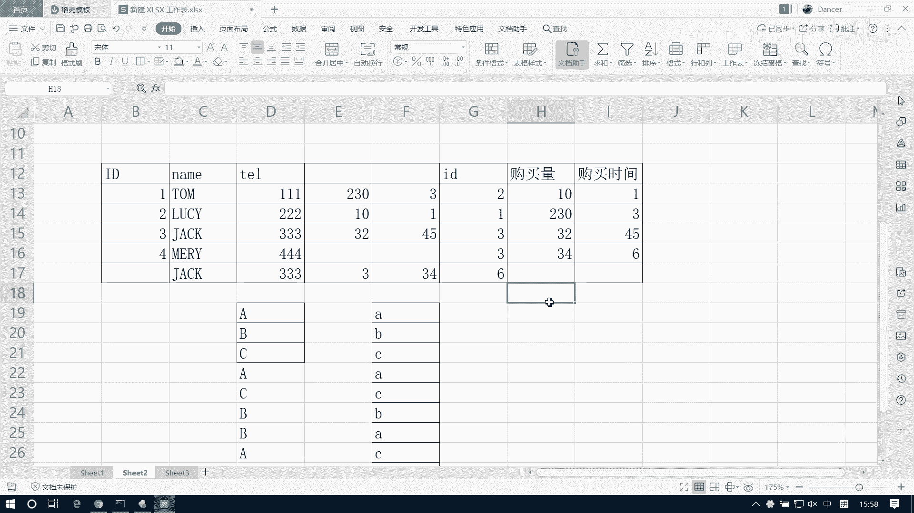
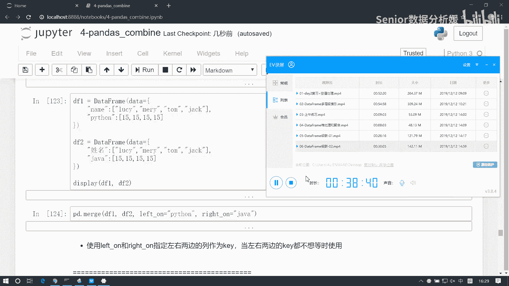

# 数据分析+金融量化+数据清洗，零基础数据分析金融量化从入门到实战课程，带你从金融基础知识到量化项目实战！【入门必备】 - P39：07 DataFrame合并 - Senior数据分析媛 - BV1Ak61YVEYX

说一下合并啊，合并它也是一种数据汇总，但它的汇总逻辑呢跟吉连是有挺大区别的，那么吉连是什么，吉连就是这个，比如我这是一个表，啊这两张表我怎么呢，我给他就相当于是一个几何边界的一个空，接对吧。

或者是我这么连，这叫集连，对不对啊，这种这种级联呢就是一个简单的一个汇总吗，那么我们这个合并是什么呢，合并是这样子的啊，比如说我们这有一个name，然后这有一个age，然后呢这边有一张表是name。

然后加上这个，address就这那位有这个汤姆，然后18，然后LUCY19，然后MARY20，然后这边呢也是啊，比如说是LUCY，然后北京，然后汤姆这是上海，然后这是呃merry深圳，嗯对于这样两张表。

我们如果说聚合的话呢，那比如说我我想我要集连的话，那它怎么连，我纵向连的话，是不是相当于这个address我得给它移到这来啊，那这样的话我这个地方是不是都是空值啊，是不是啊，对吧，它都是空值啊。

然后同样不能我AH这一列它是也是空值啊，这合逻辑吗，这不合逻辑是吧，合逻辑应该怎么样呢，应该是这样的，应该是什么，应该是我对应的，我生成一张新表，一个name age加上一个address是吧。

然后汤姆18岁，他对应的是谁，对应的是上海是吧，从上海拿过来，然后LUCY19岁对应谁啊，北京拿过来，然后MARY20岁对应的是深圳拿过来，这才是一张总表，对不对，所以这叫什么，这叫合并合并。

我们看到什么呢，它不是简单的这种这个两张两张表的一个节点，它是根据我们表的内容，根据表的内容，然后呢来找到匹配项，生成一张汇总表，那它像他这种这种这个合合并呢，它一般是什么呢。

是这种不同结构的不同结构的表，但是呢有相同这个数据项目啊，我们可以依赖相同数据项，进行一个相同数据的一个汇总处理啊，所以所以说它的这个一般的这个使用场景呢，是多种多种表之间去做汇总的。

比如说你的费用表跟你的支出表，或者你的销售表跟你的利润表啊，或者你的用户表和你的用和这个销量表对吧，你这个之前是可以做一些汇总的，比如说你的用户表里边有这个有id，有name，然后有这个有tile是吧。

然后呢你的销量表里边呢可能有这个id，然后有这个购买量，然后这个购买时间是吧，这种情况你可以怎么样呢，我可以是可以依据id来进行合并啊是吧，可以把这个用每一个用户，他的购买量和购买时间给他汇总到一块啊。

所以在这种逻辑下，我们是用合并来处理的，那合并它必须要有什么呢，必须要有这种可以依赖的这种字段，嗯哼啊可以依赖，如果他没有id，那这两东西没法合的对吧啊，那么这个它有id，比如他不叫id，叫大写id。

那那也得是什么也得这两项内容得是有重复的，比如三四，然后他是这个二，比如幺这个三，然后这是三，这是可以合的对吧，比如它是汤姆，Lucy，杰克MARY，然后tel11122333444，然后这是十二十。

好随便写一组织啊，那么它我是可以什么可以根据这个id来合的，也就说跟我这个标签名字叫啥，其实没什么关系，主要取决于什么，取决于我们有没有一个字段里边的内容，是相同的是吧，代表相同含义的啊。

那像他这个怎么合呀，我这个一汤姆，那他的购买量是不是可以把这个拿过来给他，放这来是吧，然后这个二呢是把这个购买量拿过来放到这，然后三呢把它买过来放到这，但是还有个三怎么办呢，还有三怎么办呢。

你说再加一行呗，对不对，再加一行就说明这个人买两次嘛，是不是是不是这意思啊，这是一次，这是另一次，对不对啊，然后呢还有一个四没，这边没有四吧，那他就没有购买呗，能明白吧啊那这种像这种情况啊。

他也就说我们首先你要想合并的话，得有一个有一列数据，或者是至少一列啊，或者一列或者多列，它呢得是内容是可以用来合并的啊，那怎么叫可以用来合并呢，就是它们之间存在一种对应关系啊，存在一种对应关系。

这对应关系现在有三种情况，一种是一对一，一种一对多，一种是多对多，这几个词应该不陌生吧，什么叫一对一，什么叫一对多，什么叫多对多呀，比如说我ABC，然后对应的是哦小A啊，这两列数据它就是一对一的关系啊。

它也是一对一的关系啊，如果在另一个表当中，比如有这个多个啊，再来个A然后C然后B，然后ACAB，那这样的话它俩之间就什么是不是一对多呀，这是一对多啊，那还有一种情况，比如说ACBBAAC或者C吧啊。

这叫什么叫多对多的关系，对吧啊，就是说你只要这个某一列的数据内容，它们是代表相同含义的啊，并且具备这种一对一或，一对多或者多对多的关系，那么这两张表，就能够依赖于这一列数据进行合并，能理解这意思吧。

啊好了，那我这边呢给大家整理了一张有一个关系表啊。

给大家发的那个date里边有一张表叫关系表。

这个表啊，我们可以把这个表打开，先看一眼。

这边呢从C2到C5啊，这是呢每一个表，每个表里边都有一张表啊，然后我们可以把这些表呢，都给他拿到C1里边啊，大家可以看这，这些都没用了就删了，啊先看啊这个表一和表二，那这两个表呢他们看啊。

是不是有一列叫手机型号，这一列它们之间是存在什么关系啊，是不是一对一的关系啊啊这表里面没有NN啊，这个当时加的，它里边windows phone一个安卓，一个IPHONE一个。

然后它里边是windows iphone，安卓各一个，还有other对吧，他俩之间就是一对一的关系，就是手机型号这一列存在一对一的关系，那它俩就能合并啊，比如说我现在想什么，我想给这两表汇总成一张。

那我就是可以得到一张表，手机型号重量加上一个参考价格了，是不是，那他俩关系怎么合呀，我去找windows phone去这找找它的参考价格是2500，拿过来放这是吧。

然后IPHONE呢去找他这里边的参考价格7500，放这安卓呢去找它的参考价格4000，放这other没有没有，怎么办，那这是我们的总表，对不对啊，这是一种合并合并逻辑啊，这这是最简单的逻辑了。

那还有什么呢，还有比如这个啊，那这张表和这张表呢，他们俩哪一列存在关系呢，手机型号和手机型号这一列是不存在关系啊，它里面每一个只有一次，而它里面可能是存在多次的对吧，比如IPHONE存了两次。

问安卓存在两次，所以这一列和这一列是不构成了，一对多的关系啊，啊因为都关系，那他俩如果合并的话，那我我要把这张表里面，是不能合并出一个重量啊，那这边多了个重量，那多了重量的话，我就可以取值了。

比如IPHONE的重量是什么，是0。4拿过来放这对吧，安卓的重量呢0。45拿过来放，这IPHONE的重量呢，0。4拿过来放这windows动呢0。5拿过来，安卓呢在这0。45拿过来。

最终是得到这样一张总表啊，好这是一对多的这个对应关系啊，那么还有一种是这个多对多的关系，比如说这个啊，我这个表三或者表四，他俩之间你看是不是还是手机型号，这一列存在对应关系啊，它有多个参数，也有多个呀。

除了这个之外，你会发现这个生产地区和发货地区这两个东西，它之间算不算是多对多的关系，算不算，算吗算我国就是400多米，那么可能我们质疑的原因在于这个他的列，他的列标签跟他的列标签不是一个名字，对不对啊。

那你这样也是有道理的啊，但是事实上呢我们如果在做合并的时候，他是不看标签的，它并不会以标签为准，它只会什么，它只会以你的数值是否是对应的，来判断，你是不是有一对一或者一对多，或者多对多的关系啊。

因为这个标签我们都是可以改的啊，那都可以改的，所以它主要是看数值，所以他俩之间也是构成什么呢，也构成了这种多对多的关系啊，比如说这个这个两组数据之间到底有没有关系，我们就看什么，看内容，不用看标签。

知道吧，跟标签没什么关系啊，那这里边呢，比如说我如果我们想想，以手机型号这一列来合并的话啊，那它是可以合并的，如果我想以生产地区和发货地区，这一列合并的话，也是可以合的，为什么呢。

因为它们两者之间都是存在这种多对多的关系，明白吧啊但是呢我们这个merge函数呢，它默认是找这种这个名称相同的，但是我们可以配置这个东西，可以改啊，那没关系啊，然后呢我们就以手机型号这一列为例吧。

如果他们俩之间去做合并的话，那怎么处理呢，那我可以这么干啊，这个逻辑呢稍微稍微有点绕啊，稍微有点绕，比如说我们可以先固定一行，把它先固定啊，我们就我们就找这个数据，在这张表里边的相同数据。

我们现在呢只以手机型号为例，就是只以它为基准来进行合并，那是其他数据呢都是没关系的是吧，那如果以手机型号为这个，这一列为这个基准来找的话，我们先找IPHONE，那IPHONE在这边能找几个呀。

这一个是不是两个呀，我们先找到第一个IPHONE，这经销商和和生产地区就都出来了，啊那么我们可以先找到第一个dancer，北京是吧，这是一个，然后说还能找到一个呀对吧，这个IPHONE刷还能找到一个。

那这俩一个怎么办啊，不得加一行啊，插入也行啊，然后那么它又会多一个，这个是汤姆广州，然后把这个我们可以复制一下下来是吧，还有没有了，往下没有了对吧，没有了，我们现在在查第二行，查这个啊，那这个是什么。

找windows phone，Windows phone，去这去这边找对吧，就这一个把它拿过来放到这好，那这个数找完了对吧，这张这个这个数据在这张表里面，对应的所有数据是就一个是吧。

然后同样我们在找这条，那么这一条数据我们在上边，所有与它对应的是有一个安卓，把这个拿过来对吧，然后说还有一个这时也得拿过来，那拿过来的话，这块说得新增一行啊，把这个安卓也拿过来，好那把这个再放下来。

那这样的话我这一行我在这个表里边的对应项，是不是两个都拿出来了，然后呢再找下一个把它固定白色，那这个IPHONE我们得找IPHONEIPHONE，这有一个把它数拿过来啊，然后这是一个。

然后是不是还有一个这个也得拿过来说，同样道理，还得新增一行啊，放这对吧，那把这个呢也给它落下来啊，那往后是不是都一样的呀，那这个东西我固定了，给它固定住啊，然后我要找什么。

我要找这个里边就是跟这个值windows phone相同的，这个表里面的所有数据，windows phone是不是一个，那把它拿过来放到这儿来，这样的话我这张表就找完了是吧，然后再找这个。

现在是广州这个安卓，那我就找这个安卓，安卓这有一项拿过来，这是一项，那这还有一项也拿过来，然后这个呢再落下来啊，然后IPHONE就是两个值吧，IPHONE我们先找到这个，这是IPHONE把它拿过来放这。

然后又多一个这个，放这这个落下来，然后深圳windows phone是不是就一个，然后最后一个安卓，那这是一个拿过来，然后这还有一个，拿过来，然后把它再复制一份，那这时候我们得到的就汇总表。

就是这样子了啊，就是我们依赖手机型号来进行合并的啊，那这是一种啊，这是我们依赖某一列，那有的时候呢可能我们需要依赖某某多列啊，比如说还是这两张表，我把这个再撤销回去啊。

还有时候比如说我们是两两条线索他都得匹配，比如说你的用户id跟用户姓名他都得匹配啊，或者说你用户姓名和这个手机号码必须要匹配，我们才能确定他是一个人对吧，所以我们就要依赖两列数据。

或者说更多列的数据来进行匹配了，那这里边，比如说我们想想去依赖手机，型号和这个生产地区这两列，它两列跟这里边的这两列如果必须完全相同，我们才能合并的话，就相当于依赖两列来合并了对吧。

那我这里边北京IPHONE那跟这个时候能对应上啊，我可以把这个经销商拿拿过来，那我就能拿到这个dancer对吧，然后windows后北京这边能不能找到windows phone，北京是不是没有这个值啊。

那就说明这个值是没有的啊，然后再往下找，那下边这个北京安卓有吗，这个是吧，那他就是LUCY，然后这个IPHONE广州有吗，这儿呢，那他是汤姆，这windows phone广州有吗，没有吧，没有。

只有一个深圳是吧，然后再往下安卓广州就有是吧，这把MARY拿过来，然后IPHONE深圳有啊，没有是吧，你再往下找，然后windows home深圳这有把PTER拿过来，然后下边安卓深圳，没有是吧。

所以说那我我们如果是依赖一，在两列来一起合并它这个相同的值的话，只能找到什么，只能找这几个对吧，那么这个表就变成了，这个隐藏，就变成这个样子了啊，这是依赖两列来一起合并的结果啊，好了。

这是我们合并的一个基本逻辑啊，那我们先来看函数怎么用这隐藏取消，嗯我们先把这几个表先读出来啊，这表里面shit2345这四张表啊，给他读一下。

pd点read excel，关系表啊，然后我们去指定这个sheet name，那这是第一章是吧，好我们先把这些表先做一个展示啊，Display，table1啊，没有P了啊，Table 2table3。

然后table4嗯啊在市场表看看啊，先看结构有没有问题啊，好了这样基本没问题了啊，然后那我们先说啊，这个前两张表table1和tb2，这就是一对一的关系啊，他俩直接合就行了啊，pd点merge。

我们通过这个merge函数啊来进行合并操作，merge呢不同于节连接联是可以多表操作的，默认只能是俩表，所以它这个第一个参数呢它是分开写的，一个是left，一个是right，表示左表和右表。

那左表我们把它记为table1，右表呢记为table2，这个左表和右表有什么区别呢，其实结果是没什么区别的，但是呢它会取决于说谁往谁身上合，那左表右边是往左表身上合的啊，右边往左边身上合的。

所以我们可以看一下这个结果啊，这是table1和tb2，然后如果我反过来写，嗯嗯嗯table2和table1啊，其实结果结果内容是没没变化的，无外乎就是什么，就是这个这个值是有个顺序的颠倒对吧。

因为table1是什么，table1它是手机型号参考价格，所以说如果我们拿table1做做这个左表的话，就是手机型号参考价格，以这个基础再去和重量对吧，那反过来讲的话就是手机型号和重量。

然后把价格合进来了，所以他这个没有本质区别啊，就差在这插在这啊，然后呢我们我们观察这两个两个结果啊，不论是哪一个结果呢，我们都发现都少了一项数据，这是table1table2里面是不是个other啊。

是不是other啊，我们结果里面是不是没有other啊，那这个other哪去了呢，这个other啊，它是被自动舍掉了，这里面有一个how参数，这个have参数呢它决定了我们合并的方式，看看啊。

how有几种方式，这个have跟那个我们吉连的那个join参数很相似，但是它会比join参数要多一些，转换参数只有inner和outer，表示内级联和外极点对吧。

而我们这个呃how参数呢有四个有左连左合并，右合并，内合并和外合并，那这个内合并和外合并和我们那个JN呢，它是有本质区别的啊，我们这个have呢，它这个所谓的内合并也是取交集，但这个交集跟标签没关系。

它只取什么，取的是内容的交集嗯，have它默认值是inner是吧，是inner啊，那这个inner为什么得到这个结果呢，因为我们现在合并的是什么呢，这个合并啊，合并默认是查找哦，或者应该是依赖列标签。

相同的列进行，那么现在我们KV1和KV2，谁是相同的列标签啊，手机型号是相同的列标签对吧，所以它默认是以这个列标签相同，来进行合并的啊，嗯那我现在合并的话，我就是依照这个列标签的内容。

那列标签第一个table1里边是，它里边有有这个windows phone iphone和安卓，对于我这个table2，它有windows phone iphone和安卓和other。

那我这个inner取的是什么呢，取的是两个内容上的交集，是不是啊，它有windows phone iphone安卓，他有windows phone iphone，安卓和other。

所以他们两个内容的交集是什么，是windows phone iphone和安卓，就没有other，所以我把other就直接舍去了，那如果我们取alter的话呢，那就是把所有内容都保留。

所以这里面就会得到一个other是吧，但是呢因为什么呢，因为other有重量对应，却没有参考价格对应，所以我们这边这个参考价格就是一个空值，能理解吧啊这是alter啊，那除了alter之外呢。

还有left和right，我们可以依据左表的内容来连，或者是依据右表的内容来连，如果是左表的话，left那就说你左表当中有什么，我就保留什么，那左表现是table1是有有三项啊。

所以我得到的结果就只有三项，哎啊这是table2哈，table1把它改成table2啊，table域有三项，所以我只保留三项啊，那如果我把它改成write呢，就是以右边所有的内容来这个为基准啊。

那右边的话table2里面有四项，所以它保留的是四项嗯，那我们那个吉连的那个john是干嘛的呀，他是取的谁的交集啊，他有inner和outer对吧，他也取交集并集嘛对吧，他的inner。

他的inner取的谁是交集，他取的是标签的标记啊，取的是吉连方向上标签的交集和并集啊，所以是不一样的，而我们合并什么，指的是内容的交集或者是并集啊，合并列的内容的交集和并集，而对于left和right。

它是取什么的，它是以左表，或者是右表，的内容为保留结果，为参考保留结果，啊这是一对一合并啊，那我们再看一下这个一对多，那table1和table3，就看到可以构成这个一对多了是吧。

table3它里面也有手机型号，然后这个table1UO手机型号啊，那我还是一样的，两张表合并默认就找什么呢，就找这个列标签相同的嗯，嗯他俩之间一合并，我们可以以table3为基准。

然后把table1合进来是吧，因为这个内容多嘛，我们把多的往左放，少的往右放啊，这样比较方便查看，左表table3，右表table1，012340234啊，没有新增啊，都一样，这个是一对多的关系。

然后另外就是这个多对多的关系了，那table3和table4啊之间构成这个关系啊，这table4发货地区手机型号价格，然后上边这个是发货地区手机型号table3是吧，那他们两个两个之间做合并的话呢。

还是一样的啊，默认还是查找什么呢，查找列标签相同的列，但这里边麻烦一点，因为它有两列标签都相同对吧，所以呢它会默认把两列都一块作为合并称号，所以这样的话我们得到的结果，我看一下pd点墨子KABLE4。

然后再来个KABLE3，你发现这个结果是不是少了呀啊为什么少了呢，跟我刚才那分析是一样的，你如果是两列一块参考的话，那是一个两个三个四个数就五项啊，这边是几个01234数据五项对吧，那那像这种情况。

比如说我们我们这个table3的这个发货地区，跟table4的发货地区，比如说虽然名字一样，但是表达的含义不一样，那你说我们不能让它两两，就是相对于就依赖于两列一块合。

能明白我意思吧啊那这种情况怎么办呢，啊，这种情况呢，我们就需要借助其他的参数来进行控制了啊，这块啊这块我们先加个标注，就是说这个如果，两张表有多列这个标签相同啊，则默认已多列为参考，进行合并。

那如果我们需要去指定哪一列，我们可以通过on参数来处理，比如现在我们想要table3和table4只，仅仅依赖于手机型号来合并，Table4，然后再来个cable3，我们希望它仅仅以这个手机型号这一列。

可以通过一个on来显示控制啊，那这样的话我们得到的结果就多了是吧，而且你会发现发货地区，两个指数都被我们保留下来了啊，因为如果我们指定手机型号的话，那他会认为两个发货地区是不同的含义的。

那么你它给我们自动添加了个后缀XY，你可以对它进行一个标注，这个后缀我可以修改它，是fixes，比如第一个是呃，上半年，然后第二个是下半年，是这样的话，我们就把这个地区给他改过来了。

我们可以对它做一个额外的标注，那这种情况你也可以适用于什么呢，就是如果你有三列或者是更多列的数据相同，你只是依赖于其中某几列，我这里边可以列表的方式给啊，我再给一个，比如说这个发货地区，啊是吧。

那这样我就依赖于手机型号和发货地区，这两列了来进行合并啊，因为其他项目没有了，所以这两个后缀它也就没意义了，因为没有相同的列，我们可以再填充值了啊，那除了这种之外呢，我们还可以分别去指定。

比如我们先改一下啊，这个，这是table1，然后这个是，table2啊，现在呢我们把这个手机型号给它做个修改，比如它的这个columns，让它等于，型号和重量，这table2啊。

现在table1和table2还能合吗，它是手机型号，它叫型号对吧，我们函数默认数查找一个标签相同啊，所以这时候你再合的话，它就不行了，pd点merge，我们左表table1，右表table2好了。

先一合merge error是吧，合并错误，为什么错误呢，因为语法上啊，语法上是什么，是查找列表上相同，如果你这个两个表它不一样，但是内容是可以合并的是吧，这个内容是存在这种一对一的关系的。

那我可以显示指定它，我可以显示指定什么left就是左表，我依赖于哪一列，左表我依赖于哪一列，依赖于手机型号这一列，然后write on又表依赖于什么呢，又表依赖于型号这一点，这样来合是吧。

这样我们拿到了啊两组数据，但是呢因为你的名字不同，所以它这个在合的时候呢，他没有把这个数据自动删除是吧，啊两项都给我们保留下来了，但是你要想不想要的话，你可以把它删掉啊。

嗯这个我们把它保存为一个叫TYT吧，看到啊，那如果你想删这个数据的话，怎么删呢，我想删一列啊，删删的话呢我们用一个函数叫DP，我们之前讲过一个DPNN是吧，它是帮我们删除空值的行或者是列。

那jump函数呢就更加的灵活，我们可以指定索引来删，这个里面有一个参数叫labels啊，这个labels呢就是你要指定的索引，比如这边我们要去把这个手机型号哦，把型号删了吧，把型号这一列删掉啊。

那么我这样一删它会得给个方向啊，它默认是删行啊，这样这样就删掉了啊，默认删行，当你想删行也行，虽然你这个里边你只需要写这个什么，写这个行标签就行了啊，删除一列数据也可以是多列啊，里边多写几个就多列了。

嗯好了，这个是我们什么，就是你要想去，如果两张表它没有相同的列标签的时候，我们要通过这种方式来灵活的指定它啊，但是你不论怎么指定，有一个前提，就是你这个手机型号和型号，它俩之间啊。

那得有得有这种对应关系对吧，比如说我拿参考价格跟重量来合，那能合出来吗，能合出来吗，合不出来，因为什么，因为他没有同类项啊，对不对，两千五七千五四千，这是0。5，0。4，4。25，他之间没有相同的东西。

所以没法合啊，所以说也就是说我们要要明白一个道理，就是说合并它到底是依赖于什么，合并合并是依赖于内容是否存在一对一，一对多或者是多对多的关系来合并的，其实跟什么跟你的列标签是否相同，没什么关系，明白吧。

它没关系啊，只是语法上是默认这么找的，但是呢列标签相同决，并不能决定说你这两个数据就能和，比如说我把这个重量改成手机型号，我把这个重量改成手机型号，那它就能合了吗，内容还是不行对吧。

这个是windows phone iphone安卓它是0。50。4，所以他俩之间是没法合的啊，所以说跟立标签是否相同没有太大关系啊，列标签只是我们函数的一个使用规范而已啊，所以这要注意区分嗯。

那另外我们还要注意一个问题啊，就是两组数据合并，那么你最好要用什么，用这种离散型的数据来合，什么叫离散型，比如ABC红黄蓝大小多少叫离散型，什么叫连续型，我们从一组，我们一组数据在一个范围内可以随机。

可以无限随机取值，比如我们考高考的分数啊，从0~750，你可以无限取值对吧，你可以考73。5，可以考735。5，可以考一一百三十二。8是吧，你可以无限取值，这叫什么叫连续值啊，那我们合并的时候呢。

最好不要用这种连续起来合，比如说像这种重量，因为数值呢往往是没意义的，尤其是你在取一些这个连续值，可能随机取的一些值，它们之间和是没有什么道理的啊，而离散值是有意义的，比如说我这就是姓名。

那姓名话大家不可能说差太多对吧，你你这个用户就是就那些啊，比如我们举个例子啊，啊我写一个data frame，DF1等于data frame，然后这个，来个字典，data等于一个字典啊。

先一个一个name，然后lucy marry，汤姆，杰克啊，然后来一个嗯Python，十五十五十五十五，这是DF1啊，然后再来个DF2，这个变成一个java啊，然后这个叫姓名，好了。

对于这两张表我们能不能合并嗯，能合并对吧，合并的话，那肯定是选什么选name来合，对不对，我可以把Python和java的成绩都合到一块，那我们能不能用Python和java这两类数据来合，合。

是肯定能合出来，但合出来没有意义对吧，你看我们合一下啊，pd点末日，那我们左边放一个DF1，右边放一个DF2，然后我们左边是得left on啊，左边left on Python。

然后右表我们write on java，它一核桃是什么呀，这什么东西啊，是不是没有意义啊，所以说就是我们合并的时候呢，不要用这种数值的东西来合，因为数值的时候数值很容易重复对吧。

重复的话它是没有相同意义的，比如说我我中午花15块钱吃了个包子，你中午花15块钱吃了个啊喝喝了杯咖啡，数值是一样的，但这两项你合在一块有什么意义呢，对吧没有意义啊，所以说我们要注意就是尽量不要用数值型。

尤其不要用连续型的数值型啊，那么合并的依赖项项目啊，那么最好是选择离散型，也是，或者是这种这种对象类型的啊，因为一般对象类型都是离散型的啊，啊而不是那种那个连续型，连赢数值，来参考啊。

因为它会它会有产生歧义啊，因为数值很容易重复，啊这是left on和right on，内合并和外合并，咳咳哦好了，我先休息一下啊。

