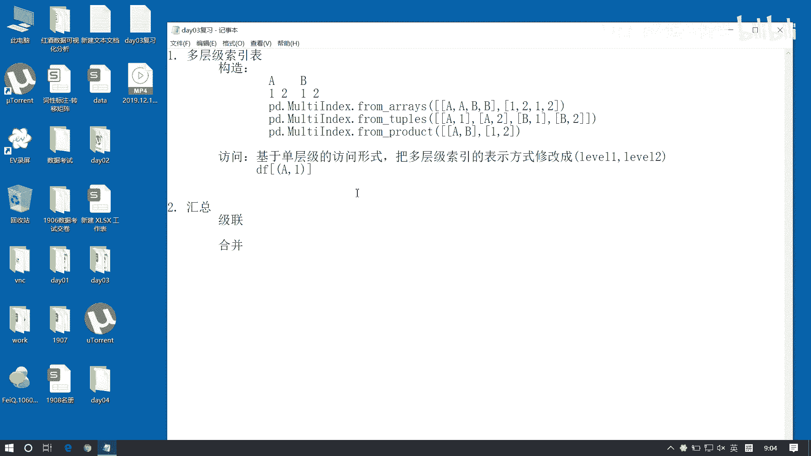
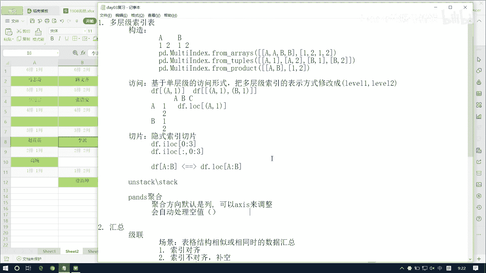
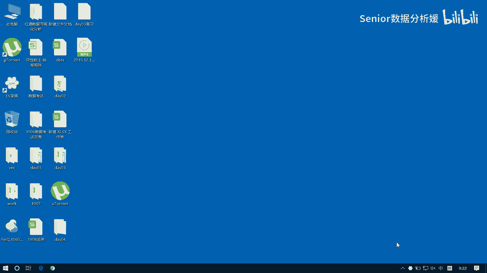

# 数据分析+金融量化+数据清洗，零基础数据分析金融量化从入门到实战课程，带你从金融基础知识到量化项目实战！【入门必备】 - P41：01 day03复习 - Senior数据分析媛 - BV1Ak61YVEYX

首先我们主要是两部分内容啊，那第一部分是我们这个多层级索引索引表啊，然后第二呢就是我们这个汇总汇总包括两块，一个是吉连，一个是合并，嗯啊先说这个多层级索引表啊，那么它的构造呢，构造有这么几种方式啊。

一个是都是multi index是吧，Index，然后呢它主要是用from3个方法，一个是arrays，还有一个什么products，还有一个是tables是吧。

然后呢那个我们主要是记那个product，然后另外两种方式呢，大家就是知道一下他的形就是那个形式就行了，那这个是TOPPOS啊，这个是products，product啊，然后对比对于这个东西来讲啊。

它它这个形状是什么，比如说我想构造这样的二级索引啊，比如这是啊A然后B然后下边这是一二，然后一二我想构造这个索引，这样一个二级索引的话，我这个array怎么表表现的，AAB是一个二维数组啊。

A a b b，然后后边是1212对吧，然后呢至于这个元组呢还怎么写的，A a1，然后A2是吧，然后B1，B2啊，是这样的啊，那对于我们这个这个product来讲是什么。

用的是AB然后再来一个一和二是吧啊，这是它的构造啊，那么它也分显示这种都是显示构造对吧，如果隐式构造，我们可以直接拿这样的一个二维数组，作为你的行列标签来进行设置就可以了，是吧啊，那另外就是这个访问。

访我们怎么去处理这种访问呢，访问的原则呢，我们基于这个一，就是那个单层级索引的访问方式不变啊，就它基于我们这个单层级，层级的访问形式，但是只是做一个修改啊，就是把这个什么把这个多层级索引的表示方式。

这个这个这个修改成什么括号，然后这是level1，然后逗号level2这样一种表达方式，对吧啊，这是一级索引的名字，这是二级索引的名字啊，我们用它来表示表示我们这个多层级索引，嗯啊那只要用它的话。

我们就可以任意的访问了是吧，那比如说我想访问这个，比如说对于这样的索引来讲啊，这样这样的一种索引来讲，我想访问这个A1怎么访问啊，这是访问列吧对吧，访问列是不是DF，我们直接用中括号就行了。

然后里边是不是用括号啊，是A1啊，是不是这样访问的啊，啊那我比如说我想访问这个多列的话呢，我想访问A1和B1呢。

怎么怎么办呢，看看啊王一凡，来说一下，我想访问A1和B1这两列怎么办，B11列嗯，括号括号A1啊，一逗号括号B1，是这样吗，对吗，对吗咳，就是我们访问多列的原则，是不是用列表来访问啊对吧。

列表里面放多个那个列标签，是不是你这时候少个列表啊，是不是还得套在列表里啊，请坐啊，嗯嗯我们在再换一个，比如说我现在想，那他要是想要访问行的话，是不是没就就没什么变化呀对吧，因为行方向还是单层级啊。

那如果我是这样一种形式呢，比如我是这个，这是A啊A然后一二，然后B标，二现在我想访问第一行，你怎么访问啊，嗯刘鑫，刘鑫走啦走啦，李派呢，啊李派没走，那那尴尬了，来吧，李泰说一下，哼咳咳。

我访问第一行A1怎么访问点点点V点lock，括号加括号A1是吧啊，好非常好啊，能回答出来就不尴尬啊，反而还很秀啊，咳咳那我看看啊，那也没啥的了啊，反正就是我们基于单层的访问方式就行了是吧。

单层访问方式是什么，行行访问就是log列访问，就是直接中括号对吧啊，如果你想做这个元素访问，就还是从行方向着手，那对于切片来讲怎么干呢，切片的话，我们注意这种这种索引表达方式就不适用了。

是不是这个记得吧，啊切片不能用这种方式来表示啊，那切片我们怎么干，一般是借助隐式索引的方式来处理啊，隐式索引来切片咳，那比如说我们先想从A1切到B1，这是行方向啊，行方向从A1切到B1。

我问大家一个问题啊，比如这么写行不行，DF点i lock，然后，A1冒号B1，这样行不行啊，这样行不行不行，行还是不行不行，是不是啊不行，他不认这玩意是吧，那我这么写呢，我这么写呢，这行不行啊，冯玉龙。

行不行，我这么写啊不行，为啥不行，得用IO，啊哈哈，又I拉胯了，刚说完是不是刚说完啊，我们说这这种表达方式，这种多层级索引用元组来表达，多层级索引的表达方式，它不适用于切片，对不对。

所以我们这种方式是不行的啊，这样是不行的啊，啊请坐啊，呃这是行切片，行切片的话，我们得是这么来干啊，I lock，然后怎么样去从这个呃零，然后冒号到几，这012是到三啊啊到三，这样全切出来了。

那如果对于这样一个结构，这列方向的亮方向的话，我我直接这样写行不行啊，比如说这个咳嗯DF点啊，I lock，然后零冒号三，我切列方向，这样写行不行，这样行吗，这是零，这这这这是一，这是二，这是三。

我切到这0~3，对不对，行不行，为啥不行，因为我这是列方向的切片对吧，所以我行方向数得全保留啊，然后再去切列，是不是啊，好不错啊，这竟然都没有迷惑住你们啊，哦我觉得很没有面子，我要再来个增加点难度啊。

看看啊，比如他这个索引是，a DC好嗯好，这这是一个表格啊，这是列有三列啊，ABC3列，然后呢行呢有A1A2B1B24行啊，现在呢我现在想访问这个，我DFDF，然后中括号A冒号B这是什么意思，列子。

这是啥意思啊，首先说他是切片还是还是索引，肯定是切片对吧，肯定是切片，那切片是行切片还是令切片列切片，S类切片吗，我我我教你们那12字真言是不是给我忘了啊，12至尊严是什么，直接使用中括号是怎么的。

索引是列索引，行切片是行切片，记不记得了，就是我这么我这样这么写，我写个DFA，这肯定是访问A列对吧，但如果你变成切片的话，这就不是访问A列了，这要访问A到B行AB这是切片是吧，行切片，这表示行切片。

它的价值等价于什么，等价于DF点lock a冒号B跟这等价的，记不记得啦，想起来没有，嗯嗯嗯啊中套了哈，就是这块这块唯一一个需要我们注意的地方啊，就是做这个切片啊，切片直接用中括号。

它切片是切的是行方向，跟着等价的啊，好了，这个是多层级索引表，这个不说了啊，然后我们说这个吉连和合并啊，吉连的话呢语法是什么NP点啊，不是NP啊，pd点什么CONCAT是吧，Contact at。

然后里边第一个参数OBZS，就是一个列表对吧，还有什么参数，我们吉连的方式是可以控制的对吧，比如说我是内级联还是外籍连，是什么，是how吗，有inner和outer对吧，有inner和outer。

内接连和外接联，但是呢他叫john是不是转啊，转然后还有一个是我们可以指定连接轴啊，就是这个保留的轴，保留的那个标签跟这儿是类似的，用什么我帮你john axis是不是啊。

然后还有是我们吉连的方向用什么，还有没有了，后面还有我们吉连的时候，它会有一个问题，就是这个索引会重复，是不是重复重，所以重复的话，我们可以从两个两个方向上去做不同的处理，我我昨天跟大家说的是。

如果是列方向重复了，如果是列方向的索引重复了，那么列方向的字段我们一般是要保留的对吧，因为列八项一般都是有具体含义的，所以那种情况我们可以用什么来处理啊，是不是可以用kiss啊，给它变成分区表啊对吧。

多层级索引的那种分区表是吧，给他加上二级索引啊，那如果是行方向的这个重复了啊，那行方向有有的很多时候是没有意义的对吧，比如说他就是个id，0123456789逐渐自动增长，这种是吧。

那这种东西我们可以重排，可以用什么用A个n index啊，但我们要注意acnore index它重排的时候是用什么，用整数对吧，用整数啊，昨天我给大家那个强调了一下啊，就是它生成之后是整数。

但有些时候可能我们的标签它不是整数啊，可能是字符串啊，所以你不要光从外观上去看它是什么类型啊，还得具体去去实践啊才行，然后吉连呢它的它的原则是什么呢，它的吉连原则其实就是什么，就是索引对齐，对不对。

所以对齐啊，所以它不会像南派那样，就是第一列就跟第一列连，第二列跟第二列连，第三列跟第三列连，它是还是要看你这什么，看你这个索引的对吧，比如A列就跟A列连连接啊，或者我一我第一行就跟第一行。

一行就跟一行里去接连是吧，所以这个顺序它对它是没影响的，那还有一个问题是什么呢，就是如果我们这个索引它不对齐是吧，就就是不对齐会怎么样，会补空值补空值啊，那这一点是比南派的起点高级的啊。

南派如果索引对不起，就是你列列或者行它对不起的话，我们就直接节点会失败是吧，但是南派不会啊，pandas是不会，pandas是直接给我们补空啊，那我们节点一般什么时候用啊，什么场景用。

就是表格表格这个样式啊，分量加样式要结构啊，就是表结构相似或相同时，的数据汇总是吧，这个时候的数据汇总我们要去用体验，比如说我上学期的成绩，然后下学期的成绩，然后第二学期的成绩，第三学期的成绩。

第四学期的成绩对吧，这种情况呢人数几乎不变，考考试的分数也啊，这个科目也不变是吧，这种情况我们可以去做这种级联操作啊，那另外一个就是合并啊，合并的话，首先它的场景在什么情况下，我们什么时候用合并呢。

大家可以举个例子，比如什么表跟什么表，我们可以做合并操作，比如说这个销售表跟费用表，是不是不会有合并啊对吧，销售表里面有有商品，然后有销售额对吧，费用表里面有商品，有费用对吧，这时候就可以把什么。

把商商品销售额和费用给它整合到一起，是不是啊，这种情况就可以做合并了，所以说合并一般什么是这个不同的业务表啊，且有相同的字段，那可以进行合并操作啊，啊那合并的语法是什么呢，pd点merge merge。

然后这里边参数有left write是吧，然后有have，对不对，这个have是不是类似于这个JON是吧，他有有几种选择是吧，有这个inner outer，还有什么left和right，还有什么。

除了have之外还有啥，还有个on参数是吧，on参数什么时候用啊，就是你有多个字段相同对吧，你有多个字段相同，我只想要其中的一个或者某几个来合并啊，依赖这几个来合并，那么这时候我可以用on来指定它啊。

还有什么，left on和right on是吧，这时候什么用啊，如果你两张表当中的字段名字不同是吧，我们需要手动去指定，我们要依赖哪两个字段去进行合并，还有什么，还有跟他一系列的。

有那个left index和WRINDEX是吧，这是什么，这是我们如果希望以一个行标签，作为合并项是吧，我们可以通过它来进行设置，还有吗，说话有个the fixes啊，是吧，添加后缀的是吧。

添加后缀它一般会跟on连用是吧，比如说你有多个字段，然后你只选了其中某一个或某几个字段合并，那么其他的这个相同名称的字段就会重复是吧，重复的话，它会通过surface is这个东西来给我们添加后缀啊。

然后来解决这个列名冲突的问题啊，这是它主要一个东西啊，那这里边呢也是要注意几个几个问题啊，首先第一个，我们合并它是以行方向还是以列方向嗯，合并是以列为基准的啊，所以我们不要去企图说我要拿行来做合并。

没这个道理啊，你非要用拿行合并的话，你可以怎么样，你可以用我们那个昨天说的那个堆栈操作是吧，按steak和那个steak对吧啊，通过这两个东西来先做一个变换之后，你再处理啊，合并是以列为基准的。

然后第二第二条，这个我们合并的列当中，必须要满足一种关系是吧，什么关系啊，合并列的列在内容上啊，必须满足一对一，一对多或者是多对多关系的一种是吧，必须要有这个关系存在才行啊，然后还有什么呢。

还有我们在这个选择合并列的时候，我们应该选什么样的数据类型，是离散的还是连续的，散离散的对吧，是对象尽量选对，选对象对吧，然后不要尽量不要选数值啊，所以说这个在这个选择合并列的时候，应选择离散型数据。

而不是连续性，不是联型数据啊，好这是几个原则啊，这个我们都得记住哦，然后是还少了一个那个聚合是吧，这聚合就比较简单了，聚合的话，那我们就是注意什么呢，聚合的话有也是两个原则。

一个是咱们pandas的聚合的话呢，它一个是聚合的方向的问题，他是给我们自动设置好的对吧，聚合方向默认是列对吧，第二点呢聚合会怎么样，它会默认帮我们处理空值，所以我们我们不用说去那个单独的去用。

什么man su，什么N面这样的一种类似函数对吧啊，但虽然它能帮我们自动处理，那其实我们原则是什么呢，我们我们在做聚合之前，原则还是应该先自己把控制处理掉啊，他只是说不会运算是吧，他的控制不会运算。

但是我们应该先把控制给他处理了，你是填充还是过滤对吧，先给他先给他处理完之后，然后我们再去做聚合，就是从业务的角度讲啊，虽然说语法上是没问题的，但是从业务上讲，我们还是应该先处理，然后再聚合。

不管说这学生考没考试，我都不知道，我嘎叽就来个这个班级的一个平均分，万一人家考了个零分呢对吧，那你平均分可能就下来了是吧，万一他超常发挥，考了100分，是平均分，我就上去一点啊。

所以说应该先把它处理完之后，再去做聚合，好这是我们昨天的一个主要内容啊。

然后我们看一下昨天咱们那个作业。

