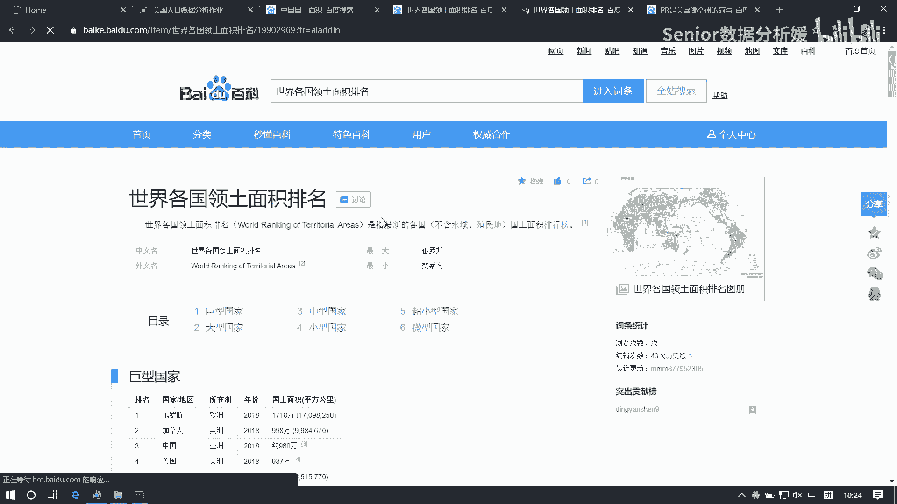
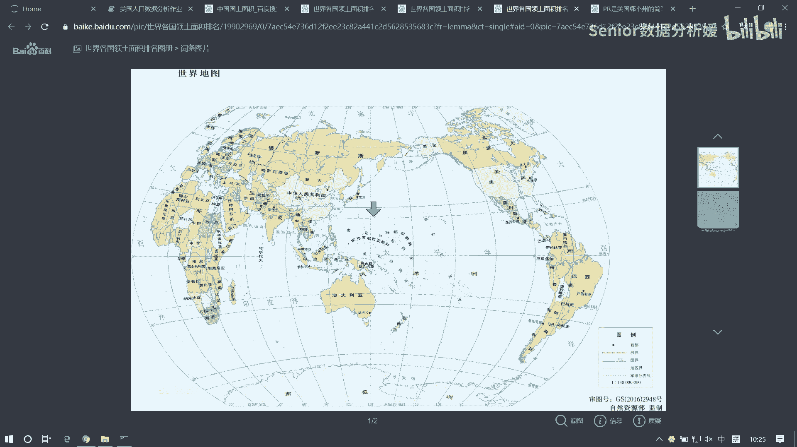
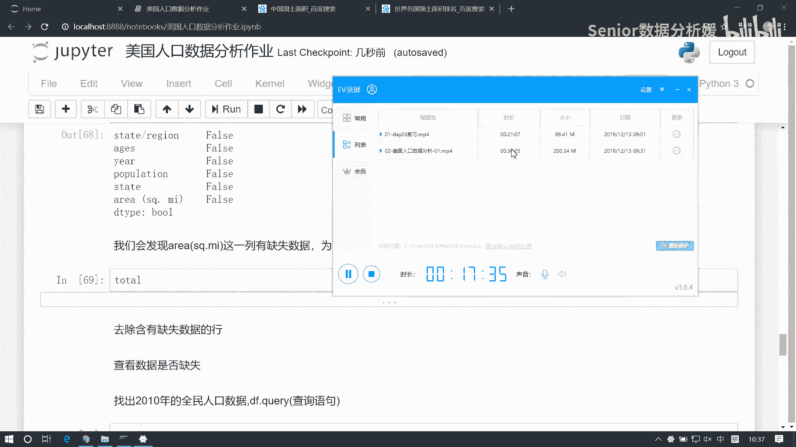

# 数据分析+金融量化+数据清洗，零基础数据分析金融量化从入门到实战课程，带你从金融基础知识到量化项目实战！【入门必备】 - P43：03 美国人口数据分析-02 - Senior数据分析媛 - BV1Ak61YVEYX

处理这张表啊，现在我们人口表和这个州的缩写表，已经对应起来了啊，那么接下来呢我们就把这个呃，把这个面积啊也给它做一个合并啊，现在我们要把面积合到哪个表里，合到我们这个AABB这张表里是吧。

嗯因为我们要想求这个密度吧，我们得有人口，还得有这个面积，现在没有面积啊，那我看面积这个结构是什么啊，areas area啊，是这样的啊，它有周和这个周的这个面积是吧，那让我们刚才分析了。

我们这个我们这个面积表里面它一共有多少个，就是多少个周名啊，做52个还是55，52个，是不是啊，是53个吗，他在unique，然后点size，是不是它是52个对吧，而我们这里面有多少个这个周缩写。

中国现，在没有空值了，现在我们已经把这个填充完了是吧，所以说他其实也看它也一样是吧，那看它吧啊那就是state了，就删了他的unique，然后点size，它是53个对吧，那肯定是我们还得把这个多的保留。

少的不保留，对不对啊，少的保多的保去弄，所以说他俩两张表合并，要么我们就是外合并，要么就是以它为准来合并，对不对啊，两种方式都行啊，那这边我们叫我们用左合并，其实都一样的啊，那用左合并吧。

pd点merge merge，然后把这个pop app放进来，然后右边是area，然后我们要把这个号设置为left，然后那它根据哪一列和呀，说不得先看一下呀，呃ARER里边是是缩写还是什么啊，他是全称。

它是全称，然后我们这个pop a p p里边，嗯它它是全程，那我们只能是根据这个state来合对吧，那这就不用再指定了，对吧啊，默认就是相同的列索引，来和其他的都都不同是吧，好了那直接合就行了。

好这是张总表啊，我把这个记为我们叫total，这张总表啊，然后我们来看这个total，看有没有空值是吧，点is now，然后点any any行，那有空值，面积里面有空值，那还是一个道理。

我们看哪个州的面积是没有记录的对吧，那这样就变成了一个行方向的一个查找，那就是偷偷is an now，然后再来个any，把这个方向变成行，然后再用这个布尔列表，我们去，找啊过滤我们这个total点好。

是哪些没有数据，USA是不是UIC不都是USA啊啊那为了确保它是USA，我们可以怎么样可以把这个state拿出来啊，把这个拿出来，然后做一个去虫，是不是只有USA是吧，只有USA啊，它的面积没数据。

那USA是啥呀，不就全国吗，对不对，全国数据，那这个数据你是要填呢，还是要删呢，肯定是山啊对吧，因为首先我们求的是周面积是吧，另外一个什么全全国的面积的话，你要硬想往里塞的话也能找到对吧。

你可以在这找你，比如说这个美国的国土面积有多大，是不是看看多大啊，937万平方公里，没有中国大洋啊，中国多少，哎中国国土面积963万平方公里啊，不行啊，但你看地图，你感觉好像美国美国大，是不是。

你看你看地图的话，肯定是美国大，因为他那个因为地图是什么。

因为地图是最靠谱的，嗯比如这是全球地图对吧。

看这个啊，你你按地图看的话，你看这是美国啊，这是中国，这是美国再画一块，对不对，你感觉镁光比较大，但是实际上这你得看纬度，因为它的纬度是什么，是在上边的，所以它会被拉伸啊哈会被拉伸。

而中国他是越靠近赤道越吃亏是吧，所以你看这个好像缅甸什么越南，你感觉好像不大点，其实它挺大的，它跟日本，你看好像差不多，比日本大多了对吧，因为他是越往越往吃到又吃亏，因为他这个。

你你想把一个3D图像变成二维图像展示，本身它就是会有一个误差在里面的啊。

美国还是不行是吧，国土面积也不行。

啊那我们就我们就处理方案就是把它删了吧，好吧好，就是因为我们什么，因为因为这个啊，因为是美国这个全国的面积缺失啊，所以采取删除的策略啊，嗯那删除的话对谁对，偷偷来删是吧，那偷偷删的话。

那其实可以直接过滤了，要不你比如说你可以删，删的话是找到空值的索引给它删掉对吧，过滤什么，找到非空行给它过滤出来就完了对吧，两种方式都行啊，那我们比如说我们现在想要去过滤出来的啊，找到非空行。

找到非公行怎么找呢，偷偷点not now，这是什么，不是空值返回处对吧，不是工程返回数，然后我们要找什么，找所有行都不是空值的，对不对，所以说得是点点out啊，是不是这意思啊，好。

那么他他现在那个我们通过这种方式，把这个所有非空行都找出来啊，然后我们再通过它再去过滤这张表，好然后把它重新记录一下，把它记录为这个total，这样我们再来看一下缺失值啊，total点is now。

然后点ending好了，现在没有空值了哈，哎这玩意是不是没有电，又犯病了，等我调试一下bug，啊哈擦呀，哎哎还真是啊，插上就好了啊好了，现在这个每一列都没空值了，是吧啊，那没空值的话。

我们现在就可以来求这个密度了对吧，但是现在啊我看这个表啊，他想求密度的话呢，还有一个问题啊，嗯我们可以直接拿这个面积来求这个好吧，这个人口除以面积就可以得到密度对吧，但现在问题是我们每一每一个城市啊。

每一个州它有好多年份，对不对，而且呢又有好多这个年龄段，有这个未满18岁的和总人口对吧，那我们现在想求的是哪一个呢，我们比如说以这个10年为例啊，以10年为例，我们想去查询10年的全民人口数据啊。

那这里边呢可以用col语句，也也可以不用啊，不用它的话，我看怎么办啊，想查10年的全民人口数据，那也说我们需要过滤两条信息，一个是我们得找到year等于2010的这些行，对吧，还得找到什么呢。

这个AES等于total的这些行，是不是啊，好，那就说我们需要让这两个条件来作为，我们的过滤条件对吧，那我们比如说我们先来个简单的，我们说这个我让涛涛这个啊这个页啊，页这个信息让它等于。

2010我直接这样写行不行，可以啊，那你应该怎么样呢，你应该这么干啊，就是你应该在用之前先确认一下它的类型，是不是可以用DETAPS来查看类型啊对吧，你看页是什么类型，是整数啊对吧，它如果不是整数的话。

那你就还是得用字符串啊对吧，先确认一下啊，确认这个类型它是int，所以我可以直接写2010，那这个是什么，这个是我我通过它能够去这个过滤出来的，就是2010年的所有数据，但是这个数据里面又包含了年龄。

分为未满18岁和全民人口对吧，我还得在这个基础之上，是不是再做一次过滤啊，或者说我可以直接把这个条件给他再加一个，是不是啊，加个什么加一个，并且呗，是不是啊，就是这个啊这个首先偷偷页，它等于2010。

然后，再来个并且是吧，并且什么呢，并且有这个total的ages，它等于什么呢，它等于total是吧，那这个total是什么类型，AIS是不是object类型啊，所以这块我们是得用字符串来表示啊。

计划就是total是吧，这个是我们的一个把这两个东西综合一下，成为我们的一个条件，然后我们再用这个条件来查啊，这个我们叫condition，然后把这个condition放到这来，哎再往我们查的是什么。

就是每一个州2010年的一个全民人口数量，是不是啊，那这时候我们就可以求密度了啊，那这时候我用谁求求谁啊，是不是用这一列除以这一列就行了是吧，我读出population这一列是个serious。

读出area这一列是个serious啊，我这样一除就行了好了，我把这个表啊，这个我们叫嗯，我们叫data杠2010，然后我们用它里边的人口population，然后除以，data2010里边的面积。

好得到这么一个值好，那这个值是啥呀，哈啊那我们只能说对它做个排序是吧，咱们可以对它做个排序，这是个什么，这是不是个series啊，这个series啊，serious呢，我们把它啊做一个排序。

我们是有一个点salt values啊，这是个降序，我们可以把这个额3ding设置为false，这样就是降序好了，我们现在能求出这个人口密度最高的，23456N个周对吧，你就算做个切片。

那就前五个就出来了，但是这些州是谁呢，说不知道啊，我们不知道这个周是谁，那这怎么办呢，啊有个小技巧啊，我们发现啊这个这个series的排序，它的索引啊，索引是不会随着值联动啊，对不对。

那我们如果想把这个周名保留下来，可不可以把这个周名设置成索引呢，有了索引，周明如果能变成索引的话，那这样的话我们就知道每一个周，他们的这个数据到底是归属于哪个州的了，对不对啊，那我看能不能干这事啊。

现在我看这个date2010，现在他有没有周名啊，是不是有周名啊，我想把这个周名设置成索引的话，怎么办，咱们讲没讲过这函数啊，说set index啊，对吧啊，咱们说过这个函数啊，可能忘了没关系啊。

怎么做呢，我们set index我们可以指定其中的某一列，把它设置成我们的索引，那这样的话呢我们这个表就变成这个样子了，是不是哎，然后把这个值我们更新一下，data杠2010等于它好，那对于这个数据。

我们再去用刚才这个逻辑再处理一下不就行了，嗯这样就可以看到每一个周的面积了，是吧啊，这个密度了啊，那这样的话我们去求出前五个，做个切片就行了，这是最高的五个州。

第一个是这什么district of column ban，这啥轴啊，8898这个数值怎么算的呀，一平方公里内8898个人，那这个密度应该没有北京高哈哈，北京也分片区的是吧，你看看西二旗一个。

你看看天通苑是吧啊，或者看看沙河，或者看看大兴那个什么天宫院是吧，这都是还有那个什么国贸是吧，这几个地方啊，这这几个地方就是早晨没有什么就生生死的事，不要往里面探这种地方是吧，就那地方基本上进不去。

像那个就是真的北京有几个几个点，你像西二喜就是程序员的聚集地吧，就是程序员的圣地，朝圣大草啊，就是那个地方一个分叉路口啊，一个40一个十字路口，阿里腾讯哈，然后几家公司全百度是吧，全都在那块C2喜啊。

你如果你如果你是搞互联网的，你说我没没去过线二喜啊，那不行啊，说不过去啊，怎么着，你得去说去吧，要去那边面过试，然后也也算去过了，然后呢这个是这是一种方式啊，那其实除了这个这个查询方式。

我们还有一个就是用这个query语句来查啊，这个coy语句是我们data frame里面，支持的一种查询方式，它就比较简洁啊，用COOKY怎么查呢，呃这个poo这个表我们去query括号里边呢。

就是接收一个字符串啊，那比如说我们现在查页等于2010，AZ等于等于这个total好，可以直接写成这样子的啊，写一个字符串，然后这个页等于等于2010，然后并且这个AIS等于等于，透透啊。

你这样查也一样，知道吧，不是很方便啊，就是你要注意什么呢，注意就是我们这个字段啊，这个字段呢直接用一个就是一个值写就行，因为它整个都是在一个字符串里边嘛对吧，但是呢字段里边的值呢。

我们必须用用那个字符串来表示啊，所以它是一个嵌套的一个用法啊，这样也能找出来，这种查找方式会比比我们这种效率高一些啊，啊，那比如说我们想查这个2012年的人口是吧，201年12年的这个。

under18啊，看看这个人口密度怎么样是吧，然后把这个我们记录为data杠，2012，然后呢我们再去做一个设置，Date2012，我们去把这个周明设置为索引，set index state好。

然后呢这个数据我们更新一下data杠，2012，然后再求一下这个密度，那密密度跟他一个道理是吧，把这个复制一下，把这个一零改成一二，第二啊，这是未成年人口，这就少很多了哈，但还是这个州最大。

如果变成10年呢，14898千多人当中有1500人是小孩，1500多人小孩啊，咳咳嗯好了。

