# 数据分析+金融量化+数据清洗，零基础数据分析金融量化从入门到实战课程，带你从金融基础知识到量化项目实战！【入门必备】 - P45：05 map函数+rename函数 - Senior数据分析媛 - BV1Ak61YVEYX

这个map函数呢，它主要是来帮我们去做一列数据的映射的啊，所以它其实是一个批量处理的，它跟rename不一样啊，这个replace不一样，relax呢主要是针对某些值去做处理，它呢可以去针对一列处理啊。

所以说它并不是data frame的函数啊，map函数它是serious的函数啊，他是series s能够响应的方法，这我们大家注意啊，它是一个serious，它只是逗对一列啊，SERRA的函数嗯。

那我们什么时候用呢，比如说我们现在想去对整个成绩啊，成绩做一个映射，我们生成一组成绩啊，呃假设这个有一有一个死score，有这么一个分数，然后这个里边呢呃我们有一个Python，Python。

然后我来个NP点random点run int，然后0~100，然后size等于十，等于十二十吧，等于20啊，然后这个写上个data frame啊，啊这是我们一个成绩表啊，成绩表，然后我们想对这个成绩表。

比如说我想去把他这个成绩呢划分成这个，比如说及格和不及格啊，做这样一个映射啊，那么这种情况我们就可以用ma，但map呢我们不能直接拿score来来干啊，那score我们直接map，这样是不行的。

他会给我们报错一个attribute error是吧，这什么意思啊，属性错误是吧，就没有这个属性啊，所以说我们必须得读出一列数据啊，所以说这是我强调的第一个问题，就是它是serious的函数。

而不是data frame，尽管它只有一列啊，但也不行，我们得把这个Python读出来，那现在这是个series对吧，我们对这个series再来一下map哎，少了一个参数，不是属性错误了对吧。

显示缺失一个argument啊，那这个map里面能接什么参数呢，它里边接收的参数啊主要有三种方式，一种呢是接字典啊，另一种呢是接栏目的表达式，也可以去接自定义函数，这什么使用字典啊。

那我们先说这个以这个函数的方式吧，因为这个比较用适合用函数来处理啊，然后呢我们要写一个判定函数，就是我们这个值它如果是小于60，我就给出不及格啊，大于等于60呢就是给出及格，我可以先定义这个函数。

这个函数比如我们就叫。

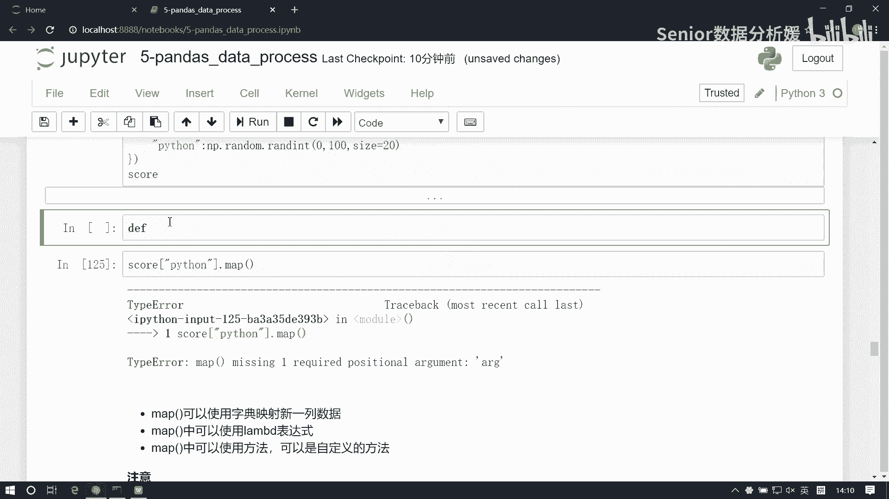

叫看我搜一下单词啊。

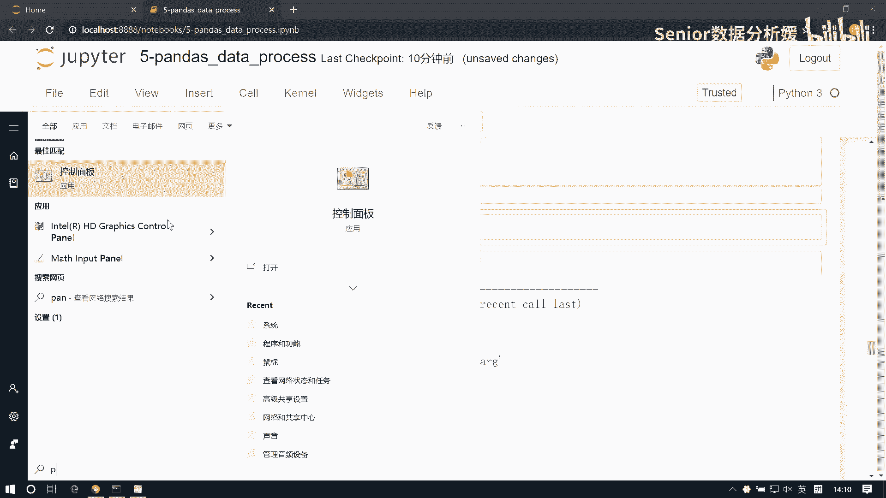

有道，判断判断是不是价值是吧，住址。

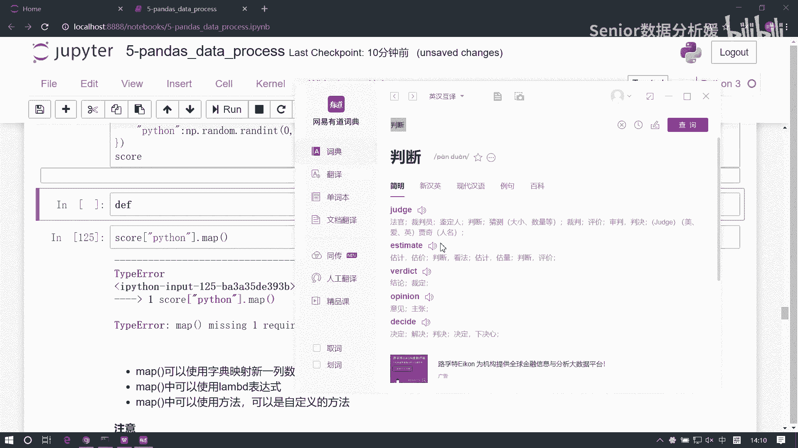

价值啊价值，这样子死SCR啊，那么他接受一个值啊，接受个值，然后我们就做个判断，如果我们这个X这个X就是SCR啊，这就是分数，我把它叫scar吧，哎别叫score，score名字有点冲了哈，叫S吧。

如果S它小于60，我们就返回一个不及格，else我就可以直接返回及格是吧，几个啊，现在有这样一个函数啊，那这个函数的功能，比如我们可以用它来做一个判定啊，这是一个SCR，我们传入一个57。

这样我们会得到一个不及格对吧，这是一个基本的映射逻辑啊。

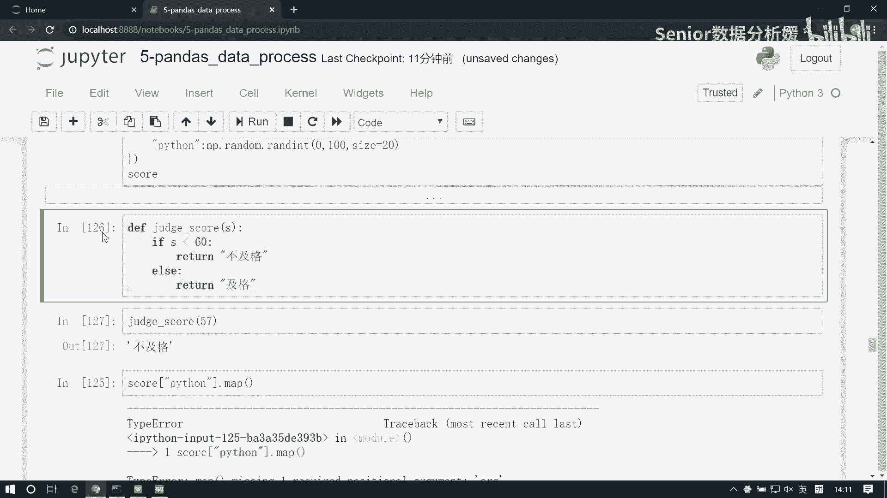

有了这个逻辑之后呢，我们就可以把这个映射逻辑呢，传入到咱们这个map函数当中，也就是说现在我们传的是一个什么一个函数，指针对吧，把这个价值scar啊，这样的scar我们给他传进去，但这样你要注意啊。

不能带参数啊，你不能再喊，不能带括号啊，带括号就成什么是成函数调用了对吧，那我们传函数名，现在传把函数作为一个对象传进去是吧，好我们传一个函数进去之后呢，然后我们再去运行，说得到这样一堆新的数据啊。

知道了吧，那这个数据是怎么来的呢，哦我说下他这个调用逻辑啊，这个map函数啊，它会他会把这里面的值呢挨个的传给J的score，所以说呢在这死Scout里面呢只能设置一个参数，只能设置一个参数啊。

那这个参数呢就就是不停的在去接收，这个集合当中的每一个数值，明白意思吧，它是不停的接收啊，比如说我我这个score Python里面有多少个值，它一共是有20个值对吧，每一个值呢它都会被迭代一次。

迭代一次，拿到一个我就会传到后边map函数当中一个一个，然后呢返回一个值，然后然后再拿第二个，然后再传给他，然后再返回一个值，再拿第三个再传给他，再返回一个值，所以说这个函数会被调用24啊，他V调24。

我比如说我们可以先把这个把这个S啊，我在这里边我做一个输出，print一个啊，比如这个我们叫score冒号，然后把这个值写进来，来一个百分号啊，百分号D，S啊，先要把这个值输出啊。

那我现在呢再用它去做一个map，是不是会依次输出啊，是不是依次输出啊，说明什么呢，说明每一个值它都被调用了啊，能理解这意思吧啊就不会被迭代啊，那我们它会得到一个返回值啊。

下边这个out就是我们的返回值啊，这就是一个新列。

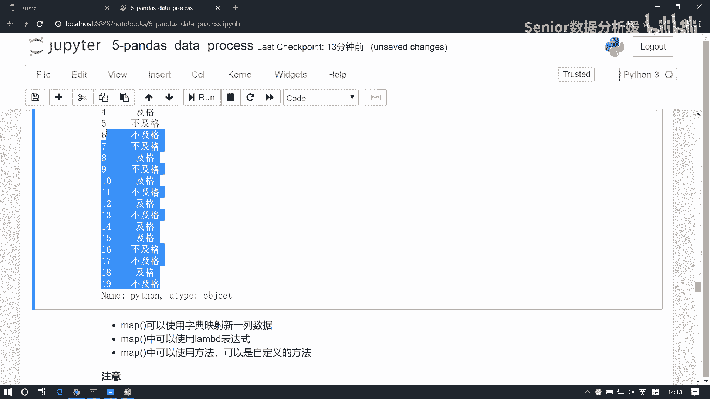

这个新列啊，那这个新列一般呢我们会给它保存起来，怎么保存呢，我可以把它保存到我这整个这个score，这个data frame当中，现在我只有一列对吧。

那我们知道score这种data frame它是不支持扩展啊，我可以写上一个这个状态吧是吧，有个状态让它等于什么呢，等于我这个他的这个返回值，就把它把它保留下来了呗，对吧哎好。

然后上面这个我删掉删删掉了啊。

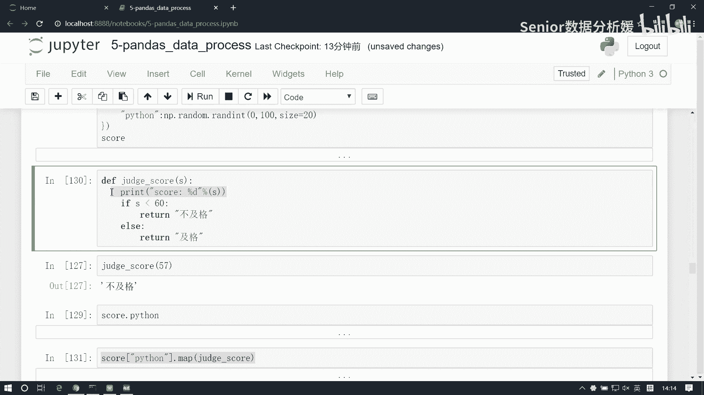

没用了，好再来重新来一遍，那现在我们再看我这个死score呢，它就多了一列，是不是就可以得到这个及格和不及格的，这个状态，这能理解吧，好那我们先变一下，变化一下，比如说我现在想把我这个成绩。

把我的Python成绩啊映射成五分制成绩怎么弄呢，什么叫五分制成绩就是大于90A是吧，80就是B，然后70就是C，60就是D，然后小于60就是E，明白吧，这就五分制成绩啊。

那我们现在如果想去实现这样一个功能的话，怎么办呢，根据Python说还要做映射呀，做映射，那我们依然是你得先有一个这个逻辑函数对吧，先把它写出来啊，这个我们叫比如说five score啊，五分。

那我们这边还是有一个分数接收一个分数，在这里边，我们对这个分数做一些判断就行了是吧，如果我这个S它大于等于90，我返回一个A然后LF，S大于等于80，我返回一个B，然后LFS大于等于70返回一个C。

然后再来一个LOFFS大于等于60，返回一个D，然后呢else是吧，else我就返回一个E，这样可以吧，没毛病吧啊好，那么现在我就可以拿这个函数，作为我的一个映射函数了，现在根据谁来映射呀。

根据score里面的Python来映射，是不是根据它映射，我们对这个service对象去怎么执行map映射，map里面传谁啊，传我这个file store这个函数名是不是传它。

我们就会得到一个一组新数据，这是一个五分制成绩对吧，然后把这个成绩我给它保存下来啊，怎么保存啊，我十杠这个表我做一个扩展，是不是做一个我们叫什么什么五分啊，五分制，等于这个这样就保存下来了呗。

然后看这个store嗯，看懂了吧啊，所以主要是根据列啊，根据列来处理，除了这个这个函数之外啊，它呢还有一些就是常用的办法，比如说呢还可以用栏目的表达式，那栏目的表达式其实跟函数是一个道理对吧。

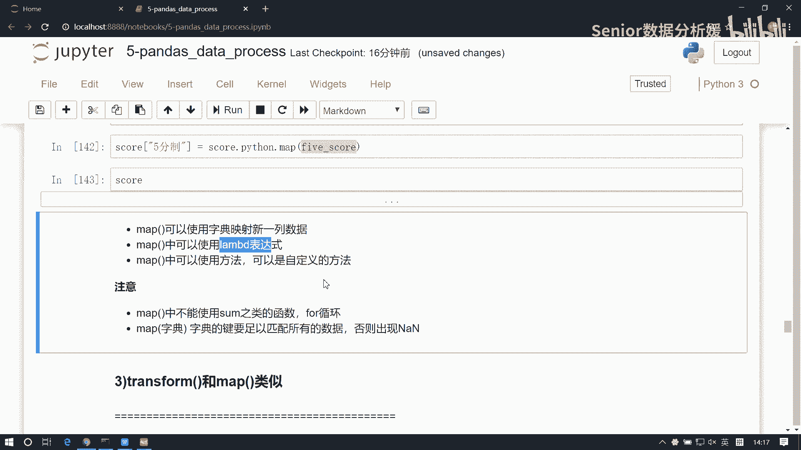

那我们知道栏目的表达式，它就是一种减轻量级的一个函数呗，对吧啊其实跟它一样的，比如说我们现在想想去那个去呃，把这个Python啊，Python成绩呢统一加个十分，统1+10分。

我们现在通过这个映射函数来处理的话，怎么处理呢，可以用栏目的表达式，那栏目的表达式我想对一个数加十的话怎么写，栏目的xx作为参数对吧，然后返回的是X加十，是不是这么写的，这是个兰姆达表达式啊。

然后呢我现在也一样啊，我把这个栏目的表达式传给这个死杠，根据Python这一点来映射，把F给他，我就可以得到一个加十的一个值是吧，那我再把它保存进来，这块我们就叫加时，看这是加时的吧，啊。

所以他就是如果用这种轻量级的，轻量级的逻辑是吧，就是不是很复杂的话，那我们可以用栏目的达式，来做这种轻量级的处理，那除了这个蓝的表达式跟函数这种体系之外呢。

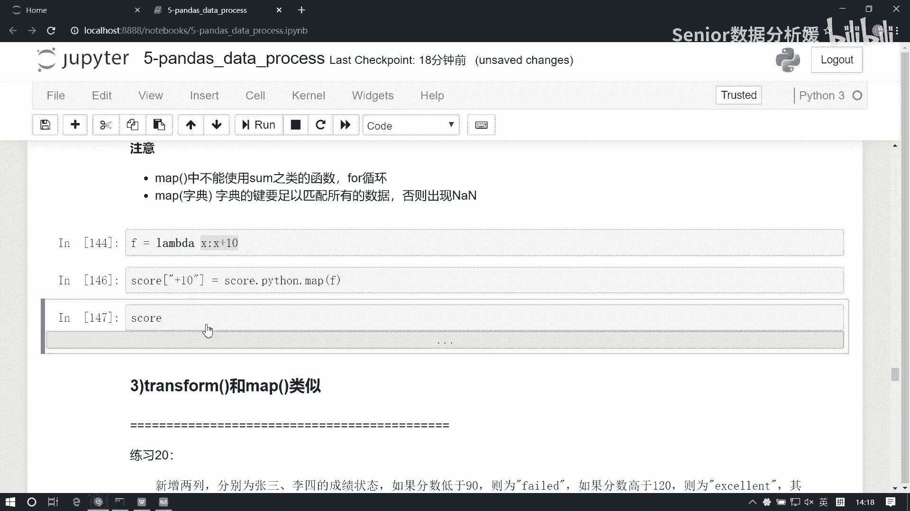

他也可以去用这个字典。

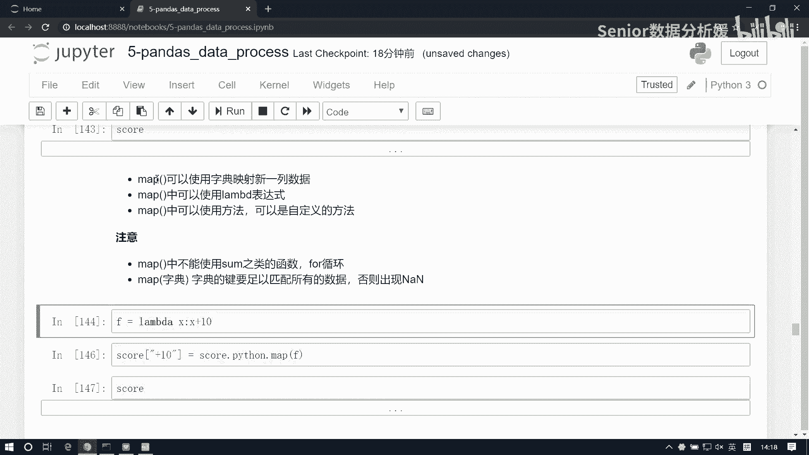

使用字典来处理，这个也是比较常用的啊，那什么时候用字典呢，比如说我们这个，比如说这种像这种id啊，他和这种这种名字的映射关系啊，或者说比如说这个名字啊和这个啊，或者说这个身份证号吧。

和这种这个名字的关系，或者是什么像id啊，他跟什么电话号啊之类的，像这种关系呢，我们都可以，他们都是固定的对吧，他们没有什么规律可言，就是比如我我的名字，我我这个人我的身份证号，就是那个我的电话号码。

就是那个对吧，那像这种一般不是那种那种那个有规律的，就是一些定固定的一些映射逻辑的话。

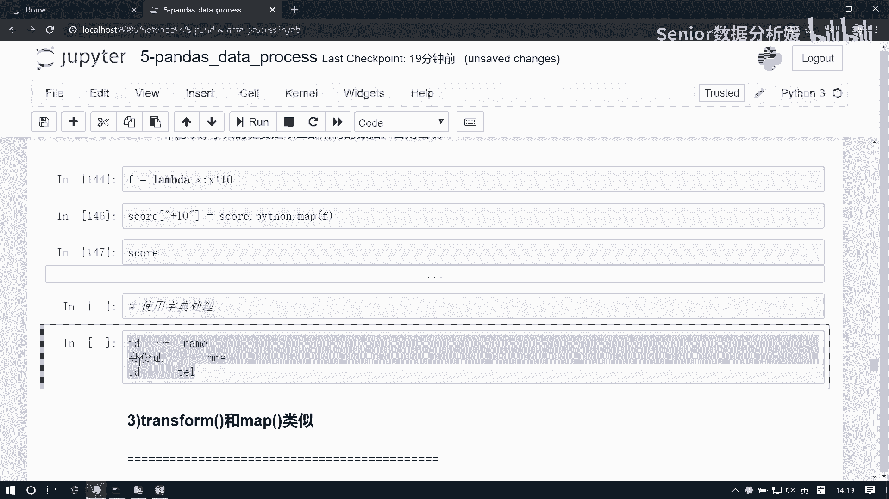

这种我们完全可以用字典来来处理啊，那我们现在假设啊，假设我们加一个假设这个我们对对名字啊，对名字呢我们去做一些映射，我们生成一个新的啊，这个我们叫叫user，叫user df啊，这是一个用户的一个表。

Data frame，嗯然后这边我们先也给个字典吧，date等于一个，这是name，然后给几个值啊，给一个lucy marry，汤姆，杰克，然后再来一个tony好，只有五个人啊。

然后呢我们再给他加一个edge吧，NP点random点RANDOINT，从15~19，然后size等于12345个人哈，啊对于这个表啊，假设呢我们先要去给这个每一个人呢。

去做一个从层面层用名的一个映射啊，曾用名的一个映射，那现在呢我们有可能有一张表，这里面是记录了我们每一个人的一些层层有名，那我们可以用一个字典啊，我们叫old，我们叫name di c e。

这里边呢比如说LUCY，他曾经的名字叫LUCY是谁来着，张二，然后这个MARY的名字是是是刘诗诗啊，然后这个汤姆曾经的名字是是郭德纲吧，郭，郭德纲，然后杰克杰克的名字是啊，于谦啊哈好吧，1200吧。

那就1000啊，然后tony tony名是，呃杰森杰森斯坦达好咳，杰森斯坦达啊，这这是他的一些他们的一些常用名啊，那假设我们现在有这样一组字典啊，有这样一组点，我们就可以拿这个字典呢。

去对这组数据做一个映射啊，这个name哎不是name啊。

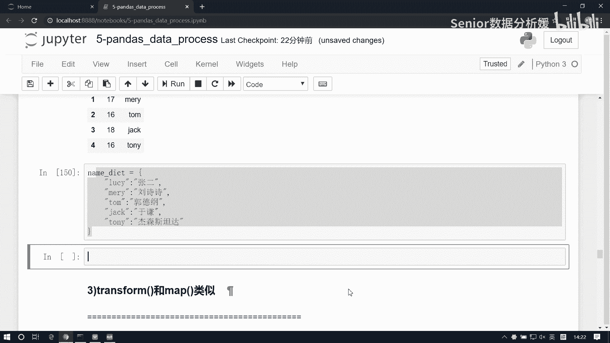

是这个叫啊user user df，那我先要根据谁呀，我是根据我的名字这一点来映射呀，他我去map，我把这个name d i c t传进去，我呢就可以得到这样一组对应的值是吧。

那我把这组值呢我保存到我这个user df里面去，我可以给它添加一个新的字段，我叫叫order name，啊，这样我们就把这个每个人，他对应的名字就拿出来了，是不是啊，Lucy mary，汤姆杰克。

tony啊，然后呢比如说我想给他们做一些性别的映射，做姓名的运是吧，从名字能分，比如说杰克汤尼跟汤姆都是男人是吧，LUCY和MARY，这是女，我想做这种性别的映射，这怎么干呢，我也可以用字典来处理。

对不对，比如我把这个拿过来啊，我放一个字典，这个我们叫sex sex d i s1啊，那她是女，然后这个是女，然后这个是男难，难好了，现在拿这个字典，我们现在呢根据说还是要根据我们这个name。

这一列来做做性别映射呀对吧，我们现在就可以把这个user df先把name拿到，然后去map我们这个spx DC，这样我们可以得到对应的这个男女是吧，然后把它再去记录到我们这个user df当中。

我加一个sex，啊这样就男女出来是吧，那比如说我现在再问大家啊，我现在想统计男女的一个比例怎么统计啊，统计男女的比例怎么统计啊，嗯统计男女比，那我说不可以根据这个sex这一列来去计数啊，可以吧。

我user df，我拿到sex然后做什么点，它是不是个serious，serious是我们是不是可以用value counts啊，是不能拿到男女的比啊，是三比二，知道了吧，那我再问大家啊。

比如说我们现在这个你这个年龄我想统计啊，这个满15啊，满16岁，满满17岁吧，就是这个啊还是满18岁吧，这个成年人和未成年人的比例，你怎么统计呢，我想统计成年人和未成年人的比例，怎么办啊。

好我们加这个需求啊，咱们来做一个小练习啊，这个，练习这个生成一组一组用户，用户这个信息表啊，然后名字呢名字的这个这个不要名字了啊，就字段，指只包含这个年龄，然后这个年龄呢从，16~20岁随机啊。

然后呢包含20个数据，然后我们要求什么呢，求其中这个成年人和未成年人的比例，大家试一试啊，看这个需求怎么实现，我们这个需求就得用，用咱们这个映射的方式来处理啊，这个题啊就是一个面试题啊，然后可悲的是。

当时我们那个同学竟然没有答出来啊，咱们看看能不能把这个问题解决啊，试一下嗯，嗯好的，把这个表先生成啊，我还还有有有有局部同学啊，这个表还没有生成生成例子啊，那么啊你如果表还没写出来啊。

那么问题就在于你代码量一定不够啊，我绝对我绝不相信是因为你的智商问题哈，肯定是代码量不够啊，咳这个当然手速也是一方面是吧，同学打字确实还是慢一点，这个英中英文先切换还不利索啊，所以说还是练的太少了啊。

像像这些你你表没没弄完的同学啊，你得注意点了，你得得多写，写了啊，嗯这个我们先先去生成这张表啊，这边呢就一条信息，就是一个年龄是吧，那我们就直接给一个年龄就行了，这是一个叫user，你就user吧。

然后呃data frame，Data，edge冒号NP点random点run int，从16~20岁，那就是16~20，然后size等于20个数据是吧，嗯然后这是user，然后呢，我们现在需要干嘛呢。

我们需要先把它，因为如果你想做这个做统计的话啊，统计的话，如果你直接对这个统计是不是没有意义啊，我们只能统计出每一个年龄有多少个人，是不是，我们现在要做的是统计的是成年人和未成年人。

所以我们必须得先对它做一个映射处理是吧，所以先添加一个函数啊，我们判断他是不是成年人啊，那就是安DER18是吧，安德18，然后啊那是这A然后这儿给一个X，然后这里边我们判断如果X它小于18。

我们就return一个，未成年是吧，然后else return一个成年啊，你要写零一也行啊，这个都可以啊，写零一的话是数字，然后其他就是字符串是吧，然后那我们说要对这个user的edge列做映射呀。

我把user的edge拿出来，对它做一个map，把这个安德18做一个映射，然后把它保存到user里面就行了是吧，user我们增加一个字段，我们叫，如果是是否成年的话，那就得写零幺了啊，这个字段。

还写个状态吧，状态啊，好再加进去，然后这个user现在有状态了对吧，然后那我就可以根据状态来判定，成年和未成年的一个比例了吧，我把这个状态拿出来，对它做一个什么value counts好。

这样就拿到他的一个比例了啊，那如果你要算比例的话是吧，如果是算比例的话，那应该是什么，应该是我们把这个把这个值和这个值，做一个除法运算，是不是啊，呃11，那怎么这怎么算，它是一个series对吧。

server那就是它里边的这个，lock这个啊，这样啊，我们把这个值先记录一下，这个是我们的state，11，是吧，它去除以一下这个，未成年是吧，是这样写啊啊这样我们可以得到一个比例是吧，就是1。

22啊，这样一个比例嗯好了，然后这个下一个啊，这个transform transform的话，它和咱们这个map函数是类似的啊，就是说我们直接用map就行了咳。

但这个transform跟map呢还有一点点不同啊，他也是干这个事的，比如我们先对刚才那个需求来讲啊，我们来一个user点age，我们去transform好，它不同之处在于什么呢。

在于它里边只接收函数是吧，transform只接收函数，而不像map，它里面接字典是吧，那接函数的话跟他状态是一样的，比如我这边传这个安under18，是吧，结果是一样的啊，我比我也可以把它保存下来。

user我们加一个，是吧，这个结果没什么两样啊，所以这边我们就用这个map就行了，但如果你看到transform的话，你也知道他是什么意思就可以了啊，好看这个啊，新增两列分别为张三李四的成绩状态。

如果分数低九是记这个高于这个记这个，其他只会pass这个好好弄了是吧，就不写了啊，这个咱们回去自己练吧。

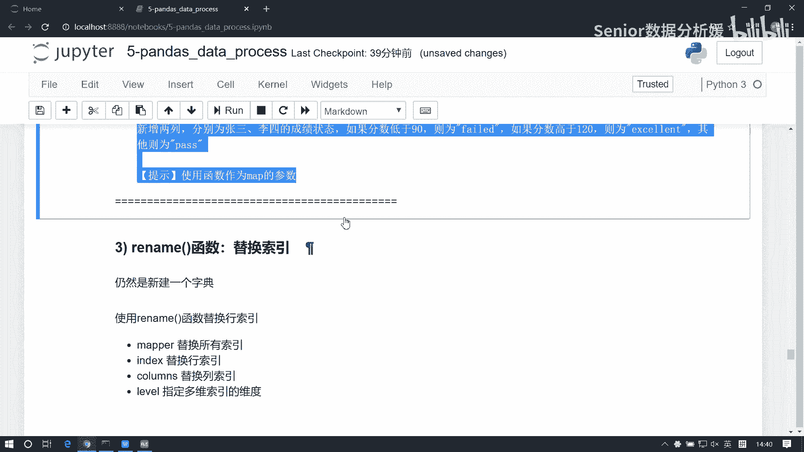

然后下一个rename函数，那map呢是对列做处理的，然后上午那个replace是对内容做处理的，咱们这个rename呢它是对索引来进行处理的，嗯那我们看一下啊，这个rename怎么用。

比如我们生成这个一个嗯两行，这个五行三列的吧，五行三列的这么一个数组，take的NP点，random点，Randoint，0~100size等于五行五行三列，然后这个columns呢我们等于三个学科。

然后索引的就不用了，默认的啊，然后让它生成一个SCE1，Data frame，哎索引还得加一个index，我让他等于这个，五个人，123455个了哈，index啊，现在呢我只想做什么呢。

我只想做一些这个名称啊，这个就是列标签或者是行标签的一些处理，比如我现在想把这个C啊，C我想给它替换成C加加啊，把它变成C加加，那么我对他处理的话呢，我不用说把整个都拿拿出来，然后重新赋值啊。

直接用这个rename就行了，score一点rename，然后这个里边的参数挺多的啊，但是呢其实有些是冲突的，我想替换列标签，那就直接用columns就行啊，用columns。

那我这个columns怎么用呢，columns等于啥，看看啊，它是个什么类型，map index compliment是一个什么，是一个类字典类型或者是一个函数，对不对，是个类似点啊。

那你说我们这边就可以传个字典，那字典怎么写呢，字典就写你要替换的值，比如我想把C这个C啊，我替换成C加加，那键就是C值，就是C加加，啊这就替换成功了啊，但是你要想在原始值上修改的话。

它里面有个参数叫in place，好in place是什么，就是在原始值上直接修改，那这时候我们这个它就没有返回值了是吧，那这个SCE1就被修改了啊，它就变成彻底变成了C加加了啊，这是列方向。

那当然你也可以多多次换啊，比如我们再去再来啊，rename还是我们想换列索引，我们就直接把参数设置给columns，我可以多换几个啊，比如我换一个C，然后C加加，然后再来一个Python。

我把它换成这个，Good python，嗯是吧，咱就换过来了，可以都可以支持这个这种多个换啊，呃那如果你想换行一样啊，换行一样，你比如你在这里面去写的话，是没有用的。

比如我想把这个杰克给他换成换成这个张学友，是吧，这没有用的啊，为什么，因为我们现在这个参数它指指指的是什么，只指的是这个列索引啊，你要想换行索引，那我们需要换个参数，用这个index。

叫index它也是一个字典好，那这边把这个杰克等于张居勇做个替换啊，然后那么这个还有一个参数叫map，map有啥用呢，其实mapper它的作用跟index和column是一样的，只不过什么呢。

就是这第一个参数啊，map map只是提供一种映射关系，但是呢你要到底是对行映射还是对列索引，就他这个map必须要跟ALEXIS配合起来啊，比如那我我这个啊对于这个字典来讲，它里边既有行数引。

也有列索引是吧。

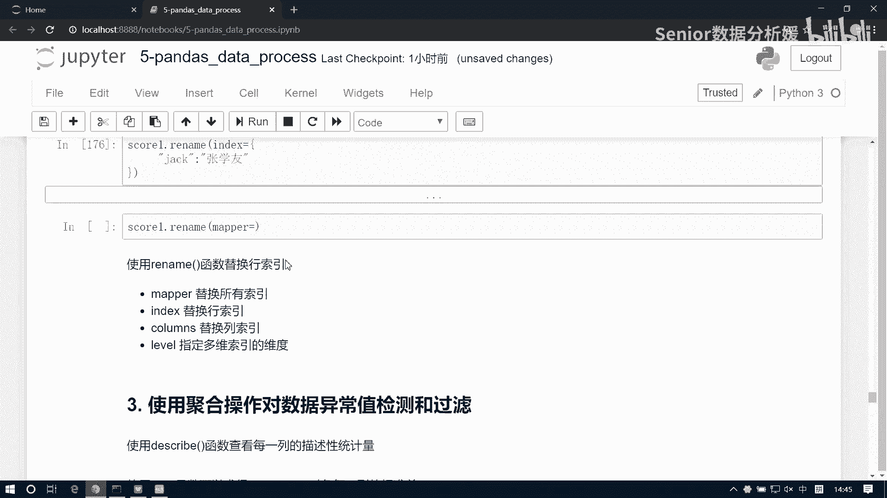

它有行有一列啊，我直接这样换的话，是把谁换了，把行换了，列没动，对不对啊，这样是什么，把列换了，是不行，没动啊，嗯啊那如果你说我想行内同时换呢，那你写个index，写个columns是吧。

呃除了这个之外还有什么呢，看看啊，还有就是这个有个level有个level啊，这个level是干嘛的，它是帮我们解决这个多层级索引的，一个指定问题的。

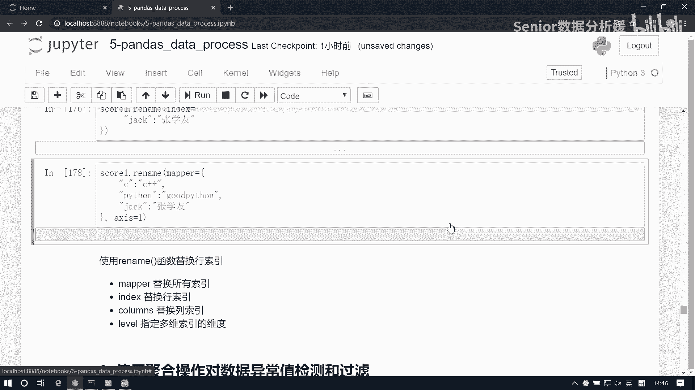

看看我们这个score1啊，Score 1python，现在呢我们把这个把它给变成一个多层级索引，怎么变呢，咱们这么干啊，我们来一个pd点contact at，10SC1再来一遍死scout1。

然后我们可以加一个kiss，是不是，那等于，上学期，再来一个下学期加速成多乘几了啊，如果你想让它这个列变成多级的话，最好可以来一个，嗯是吧，在上一期下一期了啊，那这个东西呢可以，这个。

如果我们想去替换这种多层级索引的时候呢，我们需要指定层级这块我们先保存一下啊，这个我们叫，Rename，假设我现在要替换列索引是吧，那我是不是应该指定这个columns啊，Compliments。

然后我这边指定，比如我把这个Python我替换成最好的语言，然后上学期，我替换成这个期中考试好了，现在两个都有对吧，Python也有，然后上一期有就是一级索引和二级索引都存在。

那么它直接换的话会把谁换掉呢，上学期变成了期中考试，Python变成了最好的语言是吧，好那如果我们先先需要需要去区分，我现在只希望去把这个地方给它替换掉是吧，那怎么办呢，你可以啊，直接用这个level。

哎应该是二啊，这里边是一，这是二是吧啊，嗯对通过这种方式来处理啊，那有同学可能会说了，那你把这个删了不就完了嘛，对吧啊，或者你把这个删了不就完了嘛，对吧啊，但是但是最好是这样子的。

但是很多时候是是这个问题啊，就是为什么不这么干，因为有很多时候其实我们的映射映射字典啊，它可能涵盖了你整个文档，甚至说你整个工程是你，甚至你整某一个工作区间，工作时区内的所有的映射信息在里面啊。

那这样有什么好处呢，比如说我们以我们在写框架的时候，你说一一般会把一些这个一些这个，这个可能是公公用的一些变量给它集中管，理成一个setting，setting文件或者之类的这种东西啊对吧。

就是为什么要这么管理呢，你这样管理的话，我们这个资源比较集中，然后比较方便维护是吧，要不然你东一撇子，西一榔落的，你搁那找找起来也很麻烦对吧，所以说其实很多时候我们的映射逻辑呢，可能是一张业务表。

可能是你给外界提供的一张业务表，因为你可能不知道这些，比如说业务员在采购或者是在录入数据的时候，或者你的用户再去录入数据的时候，可能程序那端没有给你做到很好的一个监控。

那我们可能需要对这个数据质量做一些，这个处理啊，所以处理那这种情况的话，只能说我们在数据这这个角度，再去对它进行一个软处理，那这个时候呢，可能我们就需要去提供一些业务方，给我们一些支持。

比如说啊比如说这个，比如说年龄啊年龄，那我们想统计的字段叫年龄是吧，那可能我们在业务员在采集表的时候，他就写成了年纪是吧，这是这是那这个表可能是user user表是吧，然后可能还有一个其他表。

比如这个费用表，我们说这个销售这个销量，销量可能被他统计成了这个销售量对吧，这很有可能对吧，然后那可能这是一个销量表，这是CEO啊，然后那还有可能是嗯呀，刚才这被一个hello给我给我打没了。

那个咋想不起来了呢，哎等等吧，我不举例了，大家明白我意思就行是吧，就是我就是这两张表，它不是一张表，对不对，它不是一张表啊，可能你有很多的表需要维护，然后呢，很多表。

它里面可能都会有这种这种这种映射关系啊，那你可能你要去统一这些字段的一些管理，那这种情况呢，可能你要维护一张很大的一个字典，或者是一个很大的业务表，可能你给你给外界提供的是什么呢。

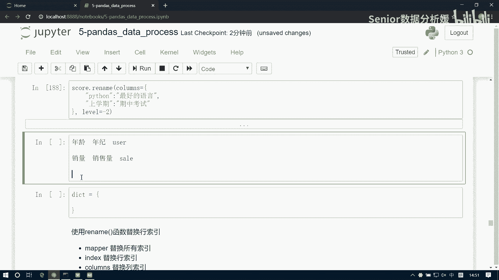

是一是一个excel，比如说你说我说那个现在这个是我的，我的一个一个业务表啊，业务人员能看懂的，就这个东西啊，比如说这个是字段啊，这个是字段，然后这个是这个比如别名之类的啊。

然后你让他可以把你这些词给你做一个填充，那这个可能作为整个作为你的一个映射的一，一个数据集来进行维护，那也就是说它就会产生什么呢，因为你整个数据集是应对你所有的表的，所有的工作的。

所以这里面可能就是这个值特别多，特别冲特别冲突对吧。

然后呢我就要去对它进行维护，维护的话，这可能就会产生什么呢，就会产生你这个字典里边啊有很多的信息，很多信息，可能这个信息对于这个数据来讲是有用的，对另一个表是没用的，所以我就需要在里面去进行一些筛选。

进行一些甄别，明白我意思吗，就是我们维护的这个字典可能很大，可能很大，而我们每一张表，可能它只是采用这个字典当中的，某些局部的信息来做映射，所以我们需要去对它进行一些额外的控制，能理解吧，好。

你像我们就是我我们将来工作也是一样的啊，你要学会什么呢，就是你怎么去跟你的业务方去对话，你跟业方对话，你说字段或者说变量或者说函数，你跟他这个东西他会他会打你的，知道吧，他听不懂的对吧，那最好是什么。

比如说你你把什么东西说，你把那个字段给我设置成什么名字，那个字段给我设置成名什么名字，然后跟他说完了，他一脸懵逼的走了，说这是个傻子啊哈那你莫莫不是怎么样呢。

你给他一张表是吧，你给他提供一张表，你说你就照着这个东西给我填啊，比如说你你你这个嗯，比如说姓名吧啊比如说这个姓名的话，然后呢你你把这个，比如本来你你的姓名，然后你把它别名叫name是吧name。

然后你你就说以后你这个采集字段的时候呢，你就姓名不要叫姓名了，你叫name是吧啊等等吧，就是有任何任何的方式，就是你都可以把它统，就给它规范成一个业务表的方式去给他。

主要按照这种方式去跟跟你的业务方去对话，这样他能看得懂，你要是拿代码跟他去聊的话，他是看不懂的对吧，就是把它转换成一种人类能读懂的语言啊，啊这是我们需要做的事情啊，这样的话会提高你的工作效率。

不然的话你你跟那个啊，就是你尤其像你这个写写程序，你写久了啊，就是可能会潜移默化的，就程序员这个写程序啊，写的太久了，你的思维方式可能真的会跟别人不太一样啊，真的很很诡异啊。

就是你你看那个就是你看那种二审吧，咱别说20年啊，20年还针对了于老师在20年成年啊，咱就说你说那种老程序员啊，老程序员有的时候他的思维方式，真的是会被程序所洗礼啊。

就比方说有网上有很多段子就特别有意思，说什么说这个说那个那个老张，你借我1000块钱，我就应个急，是吧，给你凑个整吧，给建个1024了是吧，有时候可能很随意就说出来这么一句话对吧。

或者或者当然这种都是段子嘛，段子很多都极端的，比如还有那个还有那个特别著名的段子，说那个啊，说你媳妇让你出去买买那个西红柿对吧，让你出去出去买西红柿啊，说你去买两斤西红柿。

哼如果看到了有卖西瓜的就买一个啊，然后后来她老公买了买了一个西红柿回来哈，为什么是这样啊，因为看到了卖西瓜的了嘛对吧。

因为他他应该他的逻辑是这样子的吧，他的逻辑是这个这个条件是什么，是买西瓜啊，买西瓜不买两斤，买两斤西红柿，然后if这个卖西瓜嗯，西瓜等于true是吧，等于true，然后呢我就怎么样。

我就买一个买一个是吧，然后if if条件成立，哈哈成立，买了一个是吧啊，谁是无敌的，所以是吧，你写的程序，你这逻辑你看很清晰啊对吧，没毛病啊对吧，那你你要是有时候你绕不出来圈，你搬到现实生生活当中。

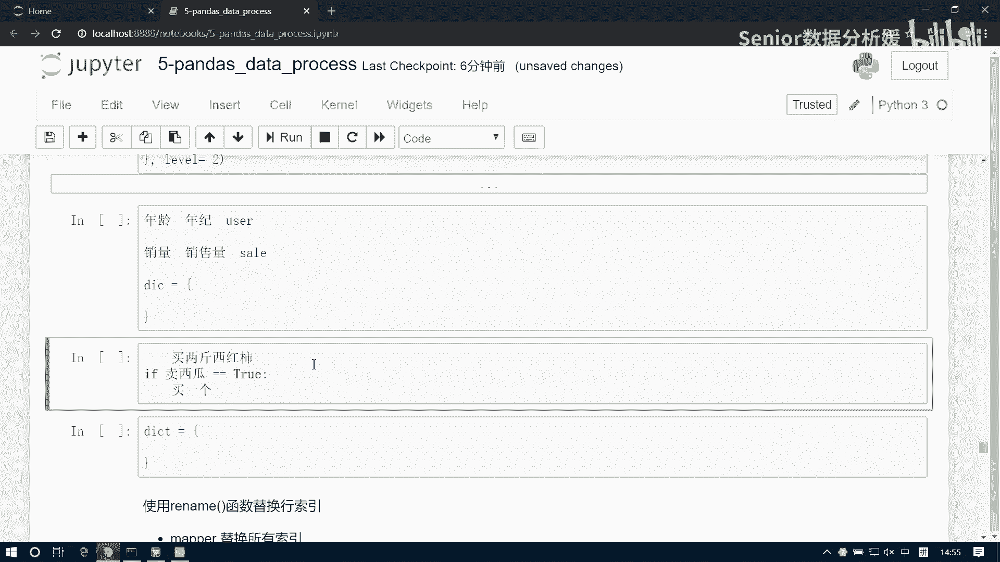

你可能就会产生这种笑话对吧嗯，所以说我们其实程序员的思维，程序员思维，你我们在跟业务业务这个沟通的时候啊，你一定要注意这个问题，可能有时候你觉得很正常的东西，就像有的有的时候可能咱们同学说靠老师讲课。

我听不懂是吧，当然了，你可以你可以给老师提醒是吧，那有的时候可能他就是觉得这东西，你就应该知道了对吧，可能你就会就会陷入这个沟通的一个，断崖式的这种沟通方式上，所以我们家也是一样的。

我们去跟业务方去聊天的时候，也是你一定要注意我，我现在跟他说的话，他能不能听得懂啊，他听不懂怎么办啊，听不懂怎么办，听完得让他等下，等下能听懂，如果你没有办法让他听懂的话。

那么他肯定是就开就可以告你黑状了之类的吧，或者说给你一些误导了，嗯啊所以说这是一一种沟通方式啊，就是我们我们去跟业务人员的一种沟通方式，把它尽量转化成一种业务方能读懂的，我们哪怕费点劲。

咱们读文件给它读出来，再转换成我们所用是吧，这样才可以的，就是我们可以间接的使用文件的方式，去跟对方对话，而不是通过口述啊，口述的话可能会产生歧义，你把这个表设计好了。

能填就不会出现歧义的，嗯好那说来说去，其实说到底还是什么呢，还是回到我们这个字典映射这个位置啊，那字典映射就是这个问题，因为你的字典里面是一个大字典，它要应应对所有的这个表的，或者是数据的一些映射处理。

所以说呢我们需要去做筛选的来处理啊。

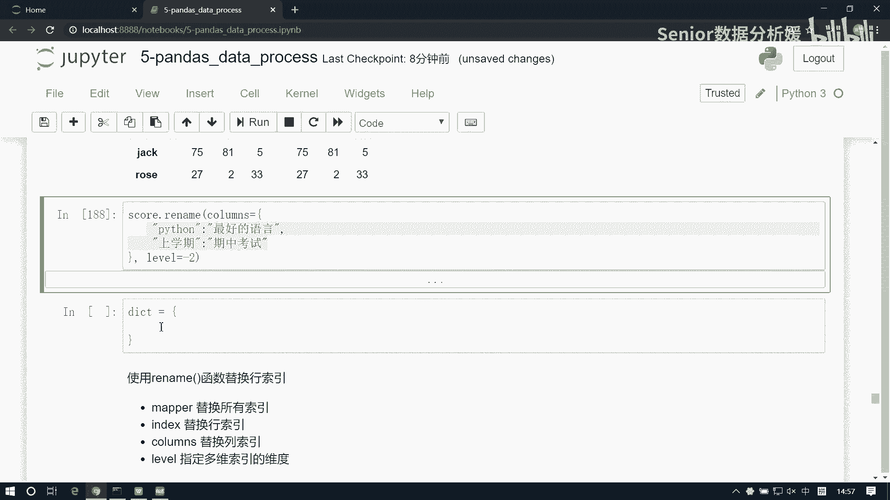

啊这是这个rename。

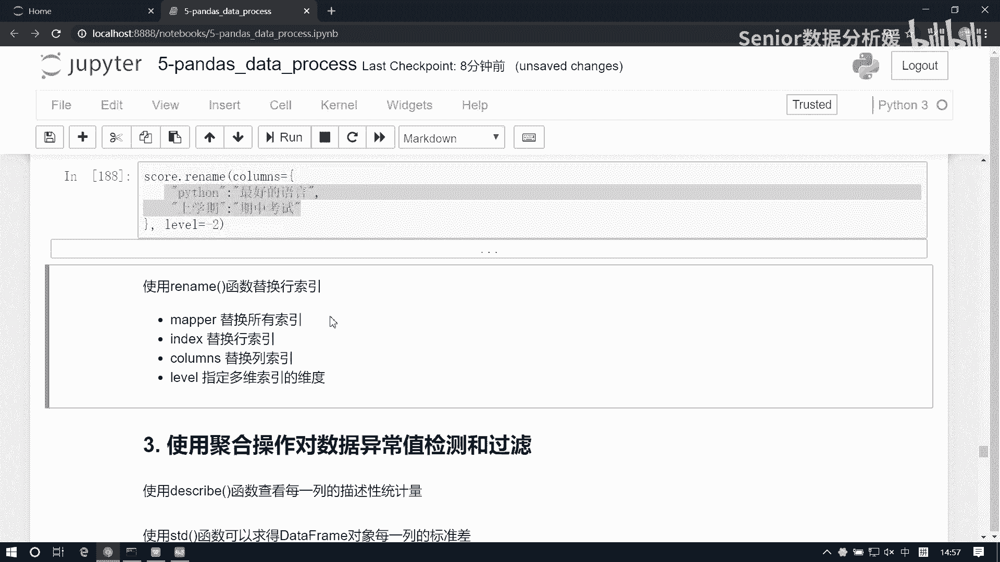

那这边还有一个小问题啊，有一个小问题就是他呢不是rename，它是关于字典的一个问题啊，这个里边大家可以思考这么一个问题，它比如说在这个map里边啊，在map里边它也有这个它可以用字典来映射啊。

如果我们这个字典里面没有你要映射的数据，怎么办，看看啊，我把我把这个表拿出来嗯，这个表吧，这个user df啊，比如这个里边啊，这边我们现在呢已经对这个LUCY，他们做了一个映射了是吧。

他这个映射我们用的是哪个是那个，是old啊，哎是name di c t是吧，这个啊我们是利用这个字典来做映射的，我把这个字典我们做一个修改啊，拿过来。

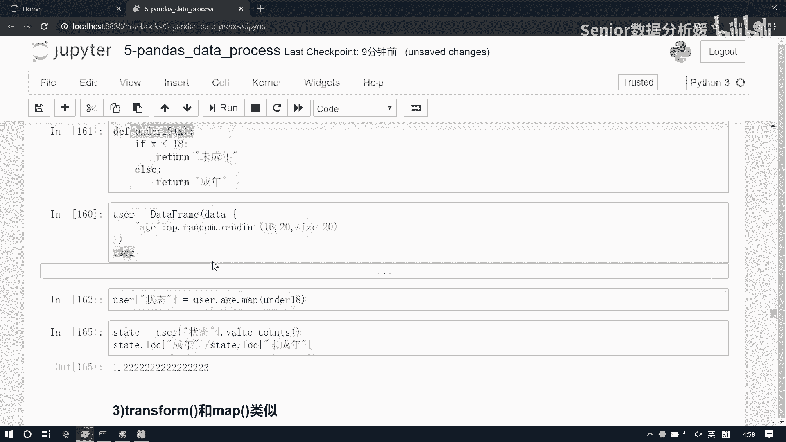

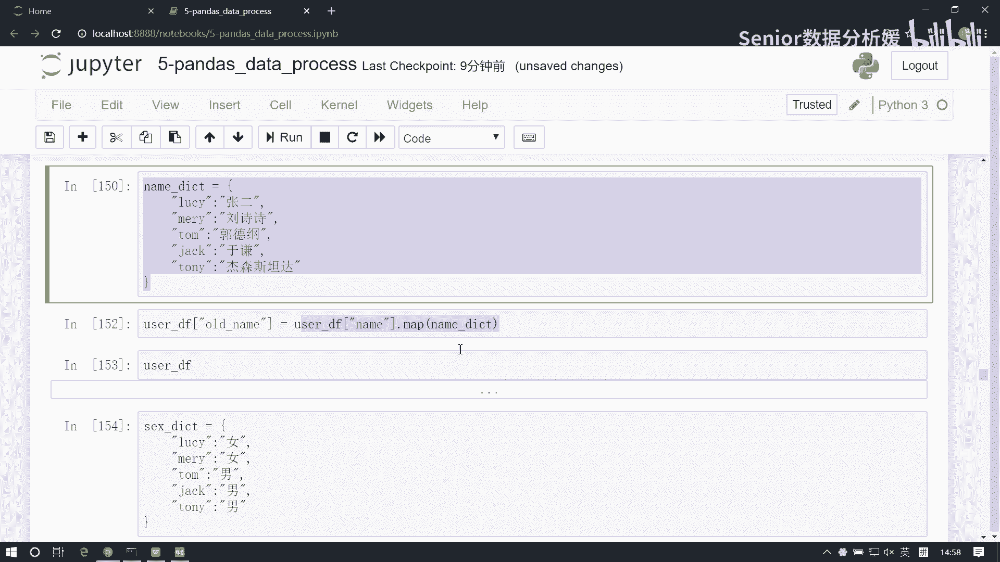

这边我们把这个tony啊给他删了，三类会意味着什么呢，意味着你的映射字典里边没有办法满足。

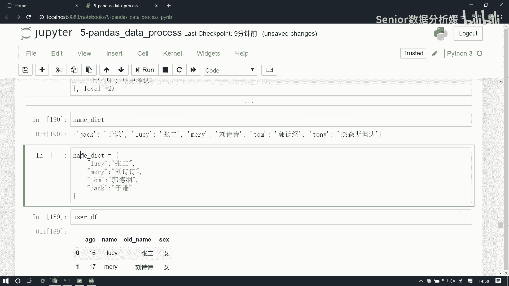

我所有的数据项目，明白意思吧，就是tony找不到答案了，是不是如果这样的逻辑我们来映射的话，会怎么样呢，啊我把这个old name啊，这块这一列我先给它删掉，点DP一下。

然后这个labels等于old name，然后in place等于true，好现在对这个信息啊，我先要对这个name啊，做一个曾用名的一个映射处理，但我还是这个逻辑啊，他的name我们拿到。

然后点map，我根据上面这个字典来映射是吧，Name di cp，现在你会发现啊，如果你对字典信息不全的话，是不是直接会返回一个空值，相当于什么，相当于我我这个name我拿过来去找这个键值，对匹配。

找到键我就给值，找到键我就给值找，找不到键就没值，没值就自然返回慢了，是不是，那这个情况怎么办呢，如果如果他没有曾用名，那我就用原始名字来填充，如果你想满足这个需求的话，有没有办法解决呢。

有人说我加一个是吧，我把这个啊那个谁啊，谁没有啊，tony是吧，我把这个tony写上啊，他没有层数名，我就写写这个原始名字是吧啊，你可以这么干是吧，但是啊问题在于，比如你你真的在统计你的用户表的话。

你们你们公司，比如说有每天有这个300个注册量，每天300个，每天300个，你写得起吗，写不起对吧啊，写不起，那怎么办呢，就不能写啊，所以这个问题可以这么干啊，咱们字典呀，字典这个对象啊。

它有一个方法叫get记得吧，这个还是怎么用的啊，它里边是不是可以给一个一对一对值啊，比如说我后边可以给一个值，比如说叫没有，这样没有啊，那我现在根据这个name里面谁没有说托尼没有啊，啊X没有啥的。

比如我先查了这个LUCY，我查LUCYLUCY是有有键值，对的是吧，我是不会返回张二啊对吧，我我查这个杰克说不会返回1000啊对吧，那如果我查tony呢，是不是没有啊，就会返回这个值，没有对吧啊。

那这个我们可以利用这个特性干什么呢，可以来封装一个函数，我们叫get name x这里边啊，我们根据这个字典，我们去获取这个X它对应的值，如果没有的话，怎么办，把X给你返回，这能理解吧。

我们通过X如果在这个字典当中能找到值，我就返回这个值，找不到这个值，我就把原始值给你返回是吧，这么干啊，然后那现在呢我们再去做这个映射啊，user df点name，点map。

我们把这个get name函数传给他，这样呢哈尴尬了啊，哎name lucy啊，然后他让我们去map把get name传进去，哎你全是那样啊，没写返回啊，没return是不是参数有了，他们都有了。

那tony没有直接把TOMMY就返回了对吧，通过这种方式来解决什么，解决这种字典不全的问题啊。

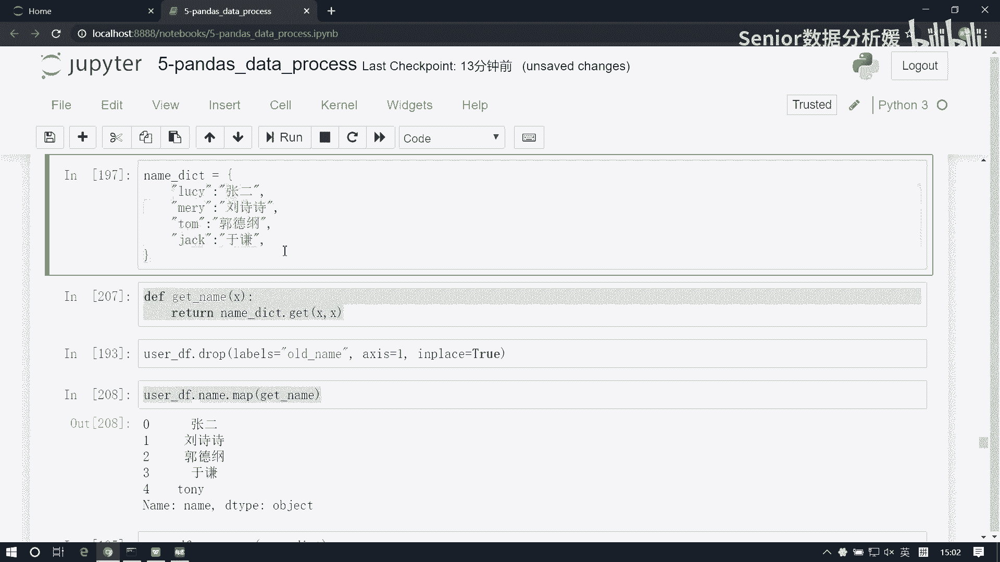

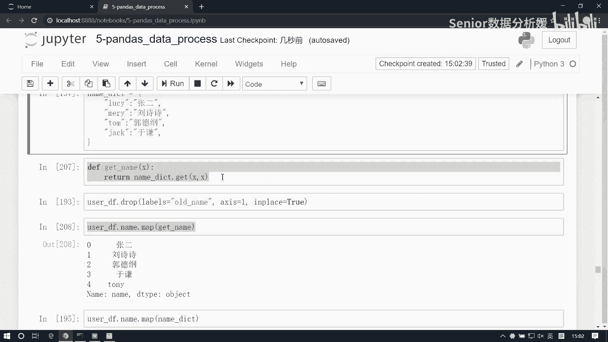

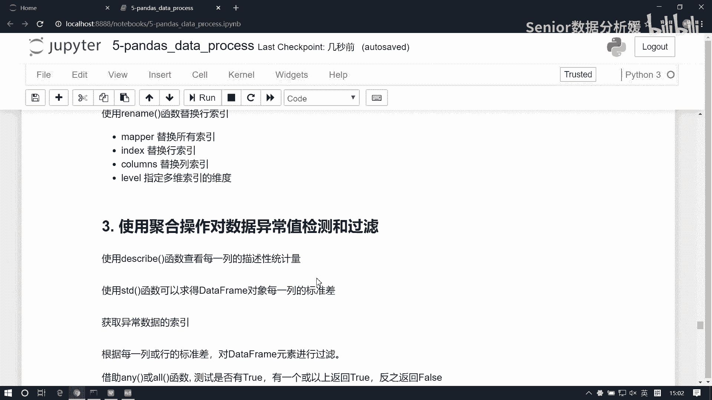