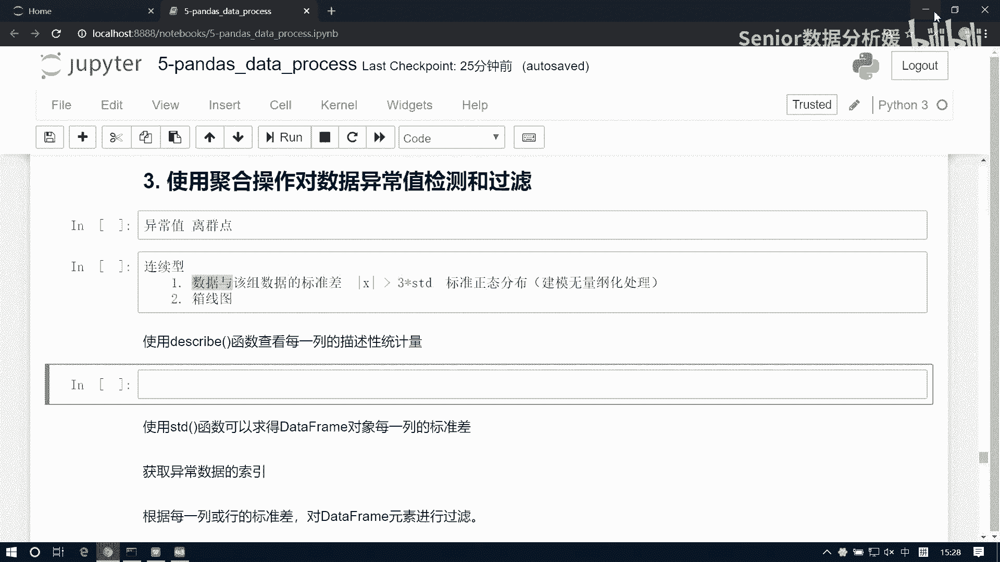
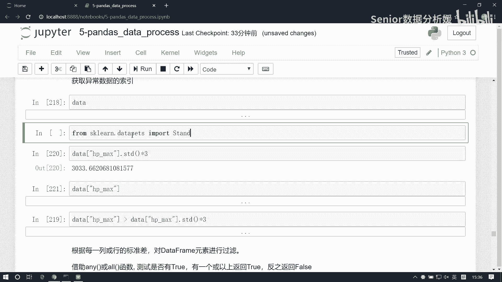
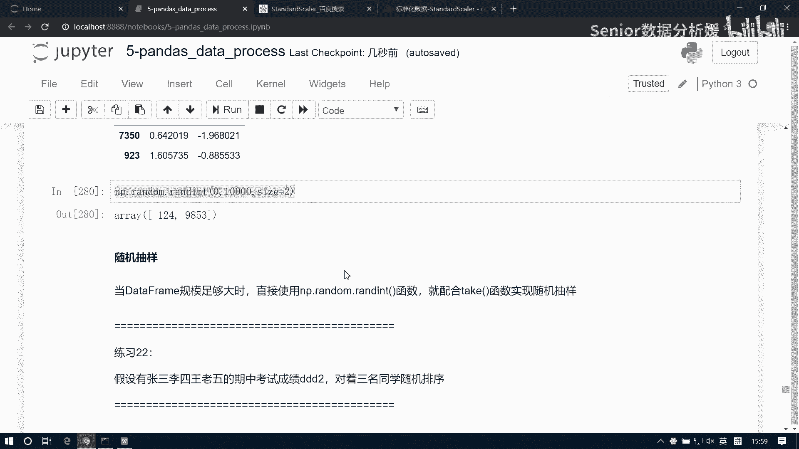

# 数据分析+金融量化+数据清洗，零基础数据分析金融量化从入门到实战课程，带你从金融基础知识到量化项目实战！【入门必备】 - P46：06 异常值检测和随机排序抽样 - Senior数据分析媛 - BV1Ak61YVEYX

那接下来就是异常值的检测，咱们咱们这个就是数学分析呢，异常值检测和空值过滤，它是我们做数据清洗必须的要走的两步啊，一般来讲，这个异常异常值呢又又把它称之为离群点，异常值也要离群点，那什么叫异常值呢。

就是它它这个普遍就是就这个值啊，它超过我们数据的一个普遍的一个分布，这样就可以定义为异常值啊，但异常值的限制条件呢这个是多种多样的，但是呢有有这么几个通通用的，就是异常值的过滤的一个方案。

比如说首先一组这个你像这个就是异常值，通常我们指的是这种连续型连续型数据啊，连续型数据是有这个异常值的，那如果是离散型的话，我们我们是不涉及到什么异常值的问题的啊，这主要是连续型，连续型数据的话呢。

它有有这个两种两种，这个就是筛选异常值的方式，第一种呢就是看什么呢，看这个数据与该该组数据的标准差的关系，那么它的关系怎么表达呢，就是如果我们用这个X来表达这个数据的话。

它如果大于这个数据的三倍标准差啊，当然这是绝对值啊，这个是绝对值，这个他如果是大于这个三倍标准差的话，这是一个通常的啊，就是国际国际标准，我们去认定异常值的一个办法啊，那么还有一个方式是什么呢。

就是用这个呃，这个我们得后边说啊，这个要用镶嵌图的来方式来处理线线图的话呢，它会有几个百分位数，然后还有几个上边界和下边界，然后我们会把那个超上边界的一个值，或者超下面这个值呢给它认定为离群点。

也叫异常值啊，那这个我们得在那个咱们讲绘图的时候，再说这个事啊，我们今天就先讨论这个啊，这个是一个办法，那如如果我，当然你还是要以这个具体的业务为准啊，就是通常是这样子的，如果你你觉得这组数据。

它就是一个标准正态分布，如果是标准正态分布的话，一般来讲就是三倍德尔差啊，就是这个标准正态分布，但是正态分布的数据，我们就是以这样的方式来认定这个离异群点，或者是异常值的，这是一个条件啊。

那如果不是标准正态分布的话呢，你就要把它变成标准正态分布之后再处理啊，那这种属于这个就是我们在那个建模的时候，会会用到一些方式啊，建模里面我们会把会这个对这个数据做一些，什么这个无量纲化处理。

然后他们就会把数据啊给他做，做成那个就是变成这种标准正态分布的，这种分布区分布这个这个特征啊，然后我们再去做这个离心点的检测啊，然后这个无量方法处理呢，其实还有还有一些其他的办法，比如说什么去缩放啊。

或者说归一化啊等等啊，那这些都都属于一些办法啊，然后那我们先先说最简单的这块啊，就是这个基本的逻辑，如果我们知道这个就是这个异常值的一个线，一个这个认定条件的话，那我们怎么把这个数据进行过滤的问题啊。

然后这里边这个首先啊有一些便捷的方式，比如这个describe呢，他就是给给出一个数据报告对吧，那这个东西它可以帮我们查看一些基本信息，但它只能查看一些什么呢，就是这个数连续型的数据的一些一些。

这个报告啊，呃比如说我们拿这个数据啊，咱们这个之前是不给大家发过一个那个heroes，那个那个文，就是那个excel文件啊是吧。

咱们可以把那个文件读一下啊啊这个文件。

哦放到这了。

pd点read excel，然后hero好这样一组数据啊，然后那我们就简单取其中几列吧，啊比如说我们去先把它记为heroes，Heroes，然后呢我们先查看一下这个heroes他的列啊。

或者我们这么看也行，点info是吧，这个我们可以查看每一每一个字段，它的一个个数以及它的类型是吧，它类型啊，那这里边如果比如说这个数值，他总个数是69个对吧，然后如果这个数值小于69的，说明什么。

说明里面是有空值啊，对吧啊，然后这边还有个叫date time64，这是什么，这是咱们pandas是里边的这个时间类型啊，就是用来处理时间的类型，它其实本质上就是一个浮点数啊，它是可以运算的好。

那我们在这里面呢就取出一部分，比如说这个id是我们英雄的id，然后这是英雄名字，这是最大的蓝蓝上限是吧，然后mp的是血上线哎啊SP是血上线是吧，这是蓝上限，然后这个是攻击上限。

是不是attract max是吧，然后这个the defences是什么玩意，防御防御上限，然后这是回五秒回回血，五秒回蓝对吧，然后这是攻击速度的最大值，这是攻击范围，然后这是职业是吧，这是副职业。

这是生日哈哈生日哈，应该是上线时间对吧，有英雄的上线时间啊，好那我们在里面取出一部分啊，这个数据上这么多没没有意义啊，我们只取几个啊，我们取一个，额从heroes里面取取一部分的话。

我们可以直接用列表来取吧，取我们先把这个name取出来，英雄的名字，然后再取name是是什么，是对象类型对吧，然后再取一个血上限，Hp max，Max，然后再取一个mp max，再取一个，攻击啊。

Attract，Cheattrack max，然后我们再取一个攻击攻击范围吧，攻击范围是个对象是吧，他是怎么表达的，它是近战远程啊，他这么来看的，我们可以看一下啊，嗯heroes，点head。

这是我range是吧，他说近战什么远程之类的啊，就他是一个对象类型，我把它也拿出来啊，这是attract range，然后我们再拿一个roman吧，roman啊，roman这是他的主职业是吧。

那我们知道英雄联盟里面他他是啊，王者荣耀是吧，他有一些有一些是可以有多种职业的对吧，看你怎么穿装备是吧，然后我们把它保存为叫data吧，好这是我们的一组数据啊，这边有对象有有这个数值型啊。

然后我们可以用这个describe呢，可以来查看它的这个基本指标，Describe，那这个指标呢只能看什么，这种连续性的数值型数据是吧啊，这是他的个数均值啊，标准差最小值最大值，然后这个100分位数。

200分数，300分分数啊，百分位数啊，然后那这是一个基本的查看查看指标，除此之外呢，如果我们想去求这个标准差的话啊，求它里面的每一列的标准差怎么求啊，是不是可以直接做聚合呀。

data我们直接去STD数不就是每一列的标准差，是不是默认的对吧，那这个标准差数给的也是什么可运算的，像这种对象的，像这种对象的这种值，他是不是没有标准差呀对吧，所以他不会给这个东西啊。

他只是做这种这种可运算的数据啊，给我们算出来额，那比如说我们现在想去想去找什么呢，比如我们现在想找这个，我们假设就是这个数据如果跟大于三倍标准差，作为我们的异常值的检测条件的话。

那么这个检测条件我们可以写成这样啊，可以让这个date它大于，它大于这个data点STED，然后乘以三对吧，是不是可以这么表达呀，啊这里边我还得做一个筛选，因为因为我那个他这个data里边说。

还有一些对象类型是吧，这还有些对象类型啊，我得把这些东西先给他拿掉啊，我就先只只以这几个这几个值来来做处理啊，那我就以一列吧，以其中一列啊，比如说我们想去检测这个血量啊，血量上限能超过三倍标准差的。

我们就认为是异常数据，然后这边也是我们把这个血量拿出来，哎怎么都是啊，不是不减啊，就是他就是这样一个条件，这个数据不太对呀，达到标准，高三看看这个标准差是，这是3033啊，确实是多大的啊。

那这个条件用它来判定不太合适是吧，那这个值都大是吧，标准差是这么大啊，所以说对这种普通普通的数据来类型来讲的话，还不太合适啊，那我们这种就得给他做一些转换了，转换成那个标准正态分布啊，因为如果不转的话。

这个值还是有问题的，想转成这个标准在分布怎么转呢，我们这有一个办法啊，这样一个办法，这个聊，我们得用到那个就是机器学习的方式了啊，这个稍微有点超纲啊，不过它就是一个转换逻辑啊，这大家可以先不记它。

那它里边有一个叫叫feature，Attraction，然后里边有一个叫，嗯没有了啊，是在那个。

诶怎么找不到了，等我找一下啊，这报名我忘了。

就是standard的，啊这这个啊process process processing啊，pre processing当中有一个叫standard scalter，的这么一个东西啊。

它们可以帮我们把数据转换成这个标准，正态分布好，然后他得先这么干啊，就S我们先构造这么一个对象出来啊，然后呢就用S去fit transform，把这个date，然后hp max，做一个转换。

然后这块得是一个列啊，还得给他转成一个列，所以这块得是一个二维数组，然后呢这边什么意思啊，嗯它我们读出来数是不series啊，Series，然后我读出value是不是读到那个南派array啊对吧。

然后那麦格瑞呢，我得把它转成那种就是二维数组，它才能够训练啊，这是他这个函数的一个格式要求，那这个数据呢就是我们的一个数据了啊，我把它哎这不能叫data了啊，应该叫hp，那个date我们得重新读一下了。

这啊这块我们拷贝一下，好SC是SP啊，那这个hp它就是一个正态分布了，还记得我们那个，我之前就给大家画过那个数据的一个分布，分布方式啊，分布规律啊，那现在这两个东西都都超纲的啊，这个大家先不用管它啊。

我现在这么做的目的是什么呢，就是因为我们hp，我现在想在这个数据集当中去筛选一些，这个异常值，然后呢我们用原如果你用原始数据来筛的话呢，一般来讲是不合逻辑的，所以说我们这个就是数据大于三类标准差。

它一般是在这个标准正态分布的，这种数据上去进行选择的，所以我们想我们利用这个方式去选择，异常值的话呢，都是应该是先让我们的数据是符合标准，正态分布，所以呢我就需要给他做一个做一次转换啊。

然后那我现在转成这个标准正态分布了，我为了为了证明它是标准正态分布，我现在需要把这个数据的分布啊，给他做一个绘制，绘制的话呢我们需要导又导两个包了，bro啊，Import matt plot lab。

点pipe lot，As pll t，然后还要导一个魔法指令，in line啊，然后再去导一个啊，这包太多了哈，import这个CBASSS，这样我就可以画那个曲线了，hp我画一下是吧。

这就是一个什么是一个正态分布啊，他是不是在零零这个位置啊是吧，就这个标准正态分布，但是它不是那种极标准的，但是他他已经把这个数据，转换到这种形式上了啊，那么现在我们对这组数据来做一个异常值，检测啊。

现在有对hp检测，那我们先算这个hp它的标准差是这么大对吧，然后呢三倍标准差的话就乘以个三呗，这种标准差啊，然后那我整个这个hp的这个数据有多大呢，这么大对吧，那这里边只要是大于这个值的。

我就都认定是这个异常值，是不是，那这边有没有异常值，2。993，这个看起来好像挺大啊，是0。299，好像咱这里没有异常值是吧，没有异常值，那也没办法，那就没有了啊，不过没有没有都无所谓。

我们得先把逻辑先走通啊，我们会一一会生成一组假数据，一定是存在的啊，那怎么去认定呢，我们可以对这个NP点abs，我们对它做一个绝对值的处理，hp然后它大于hp点STD，然后乘以三。

这个会得到的是一个布尔列表啊，啊那这个布尔列表呢，它就是我们的异常值的筛选条件，也就是说我们先去根据，根据异常值的判定条件啊，然后呢来来这个生成一个布尔型的列表，然后第二步在干嘛呢。

我们再利用这个列表去选选择这个值啊，在使用这个布尔列表咳，去这个筛选异常值，那这个布尔列表它是一个二维数组对吧，这是个二维数组，二维数组能不能直接用到我们这个这个data里啊。

这个data能不能用到这里边啊，我们说点log，可以把我们这个condition给他，参数不行啊，所以这个二维数组，这个condition我们是不得给它转成一维数组啊，是吧，那他现在是二维数组。

我想转成一维数组的话，怎么转，receipt呗，对吧，receipt成什么乘一负一逗号加数一尾了，是吧，一逗号啊，那这个一什么意思啊，就是自动给我们乘出来的一个个数呗，对吧。

如果我从那个二维数组转成一维数组，如果那我应该一共是多少个，这个值是帮我们自动算出来的啊，我把这个值更新一下condition，然后我再用condition去筛选这个值，那我发现什么说没有异常值啊。

所以这个得到结果就是空的，对吧啊，但是呢因为这是数据的本身的问题啊，这是数据本身的问题，它本身就没有异常，那我们可以这个去生成一组有异常的，比如说我们去这样啊，咱们去生成一个，等于NP点random。

咱们直接生成一个标准正态分布啊，点RANN这玩意是不是标准正态分布啊，Return sample from standard normal，是不是生成一个标准态分布，我们生成比如说1000个数。

这里面应该有异常了啊，那我们先根据我们这个判定条件啊，我把它先变成一个data frame，Data frame，然后这个data就等于data，然后comments呢我们给它设定为。

比如说就叫Python，好这是我们Python的值啊，1000个数，现在呢我们要去做异常值筛选，我们先找条件对吧，condition等于什么呀，这一列数据是吧，它怎么样呢，它大于这一列数据的三倍标准差。

然后这块我们要取一个NP点，abs取个绝对值，这玩意有没有出啊，可不可以检测一下啊，点is now啊，不是is now，应该点any呗，就行了是吧，是不是有TRU啊，返回true就说明有TRU，对不对。

好有处就好办啊，有TRU有true的话，我们用它去筛选这个data frame就行了对吧，DF点lock condition就一个啊，只有一个异常啊，那我再重新跑一下这个再运行一次，然后再来一下，好。

这就多了是吧，只有三个异常嗯，啊那那现在我们拿到这个异常值数据之后，怎么办呢，是得用它的索引啊，我们找到这个索引才能过滤掉它嘛对吧，那这就是DP index，我们把这个照片index留下。

然后再怎么样呢，再去DF里边，我们去JOP把这些个行索引给它过滤掉，那什么是不是就是labels等于jp index啊，然后access有没有设置了，jump函数默认是不是删行啊，如果你想删列。

是把xx设置为一是吧，三行是不是不用了，直接就把这个行给删除了，好这就是过滤完异常数据的了，我们看看它里面多少个997个数据，是不是，我可以把这个DF啊，这个这个这一列数据啊，我们可以做一个展示。

看一下它的分布状况，这是一个标准正态分布是吧啊，但是异常值没有看到啊，就是在这两两侧的呗对吧，就超过这个边界线的应该就是了，是不是超过这个点的啊，因为这个点不就是三倍标准差嘛是吧。

就是在差不多在三那个位置是吧，所以他再往左或者这个点再往右有值的话，那这种值就属于异常值了啊，所以说你看为什么是三倍标准差对吧，变成三比较差，就是因为已经很极端了。

你基本上超过这个边界和这个边界的值是吧，就非常的极少了，这相当于什么，说我们正常人身高都是1米7是吧，然后比如这个成员身高是1米2，然后这个成员身高是2米四对吧，那这种数据显然就是异常数据了啊。

好那我们总结一下，其实这个异常值的剔除呢无外乎就是这么几步，第一步你要什么，你要先确定你的异常值筛选条件，通过它我们得到一个布尔列表，然后第二步呢根据这个布尔列表，把异常值的索引找到。

第三步呢再利用造B函数把它直接弄掉是吧，这么三步啊，第一步确认异常值的条件，然后我们这个大于三维标准差是国际标准，当然你可以微调啊，比如你可以调成二倍或2。5倍，或1。5倍等等啊。

看你这个业务上怎么去怎么去处理这个事情啊，然后第二步是获取异常值的行索引，然后第三步，根据行索引删除异常数据，嗯这样就完事了啊，好那我看这个练习啊，这块我们要去生成一个1万×3的。

1万行三列的标准正态分布的data frame，我们要去掉所有满足以下情况的行，其中任意元素的绝对值大于三倍标准差，这怎么实现，那我们先把它这个数据生成啊，1万行三列的，Data frame。

那date就等于NP点random点RN10000行三列是吧，然后这个columns呢我们给一个list abc吧，三点啊，然后行色也就不动了，所以这是我们的data frame嗯，现在我们是干嘛的。

它的它的认定条件是，任意一个元素的绝对值大于三倍标准差，那意思就是说我这个值，这个值如果大于这一列的三维标准差，或者是这个值大于这一列的三维标准差，或者是这个值大于这一列的30点差，任意一个条件成立。

我这一行就认定它是包含异常数据的，我就可以删掉对吧，就这个逻辑啊，那我们怎么去写这样一个逻辑呢，呃今天咱们都是光明的，那我们先对这个data frame先求一个标准差，得到了什么。

是不是每一列的一个标准差呀，每一列的标准差啊，那如果我用这个DF和我这个DF点STD，去做比较，这是怎么个比法呢，现在它相当于这样子啊，我这是1万行啊，1万行，这个是A，这个是B，这个是C。

然后这里面都是些数据啊，然后呢这是我的标准差STD，这是A这是B这是C啊，这求出来个值，这是一这是一，这是一吧啊，开始啊，那我现在要干什么呢，我先这个是我的DF是吧，我这个DF跟这个值去做比较。

他俩做比较，这是不是一个data frame跟series之间的运算啊，嗯data frame跟service运算的规则是怎么来的，默认是不是列方向运算，那列方向运算C老师怎么跟它运算是不一。

每一行跟它的每一行都对应位置相运算啊，比如说我先这一行，我跟这一行对应位置先运算，它跟它运算，B这一行列也跟它运算，它是和它运算，然后呢对于第二行来讲怎么办呢，说它要拓展到第二行。

然后拿这个数据跟它运算，这个数据跟它运算，这个数据跟它运算对不对，所以说也就说我们这个，如果我拿这个DF跟STT运算，其实就是什么，本质来讲，就是拿拿每一个值跟每一列对应的数据，去都做运算对吧。

这能理解吧，啊那我我这个条件是不是就可以写成乘以三，然后前面写个上一个NP点abs啊，我这个条件是不是这样子的，看看是不是每一个值跟每一列的标准差之间，是否满足大于三倍标准差的关系啊，这个条件是对吧啊。

那这个就是我们的条件啊，那这个条件我们现在想通过这个条件去干嘛呢，我想找到每一行，每一行只要有一个是true，我就输这一行就要删掉啊，那我现在就相当于是我对这个data frame，是要做一次聚合呀。

我聚合求什么，求哪一行包含至少一个处，是不是，那是不是就是any name啊，不求行方向啊，那等于一对吧，这样我得到这个结果就是我的认定条件了对吧，这里面只要有处的，就说明这一行至少有一个数。

是跟他那一列三维标准差之间，是构成大于关系的对吧，那这是我的认定条件啊，Condition，然后那我条件有了，有了条件之后，下一步干什么，找那个包含异常值的行索引，是不是。

那我就DF点lock condition，然后再点index，说这么多啊啊，然后呢，我拿到这个索引之后，干嘛呢，再删除呗，第三步DF点drop labels等于DP index就不用写了啊。

这个in place我可以写上一个，好了，现在我看我们删除之后的这个data frame有多少个，9934个，本来是1万个是吧，我们滤掉了66个数据啊，啊这主要就是这个判定条件的一个处理逻辑啊。

这个大家注意，然后看下一个排序，排序和随机抽样两个啊，那不论是排序也好，还是随机抽样也好，其实我们都我们的目的是啥呢，目的就是为了让我们的这个样本及数据呢，它属于无序的，自然的，不不是排序这种状态。

那这个有什么好处呢，因为如果你排序的话，可能会影响到我们对数据的一些分析，比如说我想看一个班级的一个成绩啊，然后你是做过排序的啊，这样我一看前五个数据啊，可能是最高分的，一看这个班级学习真好，是不是啊。

那你应该什么，应该让你的数据是混乱的，你看到一个数据最原始的状态，比如我们是按照姓名排序对吧，或者按什么其他的排序啊，然后这时候我看我的分值有有高的也有低的啊，那还有什么，还有一种情况呢。

比如我想研究一组数据集，它的一个平均状况，那可能会涉及到一些采样啊，统计学校经常会采样，因为你比如说我想统计全国的这个，人口的一个收入，或我想统统计一些地域地区的人口收入。

如果对于这个你你这个规模不大的企业来讲，你是没有办法说把所有的数据都收集到了是吧，所以我们只能去抽样啊，抽样检测，所以那那有的时候可能数据集很大，我们没有必要说对整个数据集都去分析。

因为我们可能就是随机选几个，就能看到一个基本的情况了，所以这种情况也需要做到这个随机抽样啊，这是我们的一个目的，那我看他怎么怎么用啊，用的话主要是data frame呢，去结合咱们这个tag函数来处理。

第一种啊，如果我想做随机排序的话呢，我可以用take函数，结合咱们这个computation函数来进行一个处理啊，比如说我们生成一个二维的表格啊，呃等于一个data frame，五行五列的date。

等于NP点random点，Random int，然后0~10啊，0~100吧，size等于五行五列，然后我们给一个columns list，A b c d e，嗯现在我想要这个数据啊，随机重排。

那随机重排肯定有列方向的重排，还有行方向的重排对吧，有这两种情况啊，那通常呢可能是行方向的重排啊，列方向没什么太大意义啊，因为你字段的话，你放前放后只是一个观测的方方便而已啊，对数据没什么影响。

但列方向是数据的组组合会发生变化，它一般会对列方向处理，那怎么处理呢，嗯嗯这个computation，这个函数是帮我们生成随机索引的对吧，我们可以用它啊，NP点random点computation。

我们先生成一个随机索引，在12403啊，然后这个索引呢我们可以结合tag给它传入，Data frame，点take，这个里边可以直接接收一个indicates，这样一个列表，比如说我想把它这个数据啊。

把他这个数据按照这个这个顺序来排列，那我可以把这个12403我这样去处理是吧，就12403了啊，那如果你想在列方向上去按照这个顺序排列呢，B就是索引为一对吧，C就是索引为二，这就是索引为四。

那那那他俩结合到一块的话，我就可以做到随机重排了，把它放到里面去是吧，这样每次都不一样是吧，这是随机排序啊，那我们还有一个方式，就是这个take呢跟他可以随机取，比如我可以DF点take1122是吧。

我就取得什么，我取的行方向的是D索引为一的那一列，两次，索引为二的那一列两次，同样的道理我也可以取列方向等于一，那我就是索引为一的那个那个B列，我取两次索引为二的那个C列，我取两次。

是不是配合函数可以这样灵活运用啊，那他呢如果想做随机抽样的话呢，我就可以这么干了啊，假设我们现在有1万条数据报名行，觉得俺们都要用再报，Run n，1万行两列啊，然后我们这个columns等于list。

来个A来个B，现在我想在1万条当中，我随机抽出来五条，随机抽五个，那我他说还是可以结合take个函数啊，比如我就想抽一个呃，五抽个九是两个数据啊，啊那关键就在于这两个数据我们还要随机产生。

想随机产生它太容易了，我们直接用这个NP点，random点RANDOINT不就行了吗，我一共索引不就是从零到1万吗，对吧，那就是零到1万，我只要取几个数啊，size等于二数不就行了，是不是俩数啊。

我把这个索引给它放到这里边，不就成了这个随机抽样了吗，嗯是吧，每一次都是随机抽取，对不对啊，所以其实无论是随机排序还是随机抽样啊，就是结合take个函数啊，如果你随机排序的话。

那我们用这个computation结合使用。

