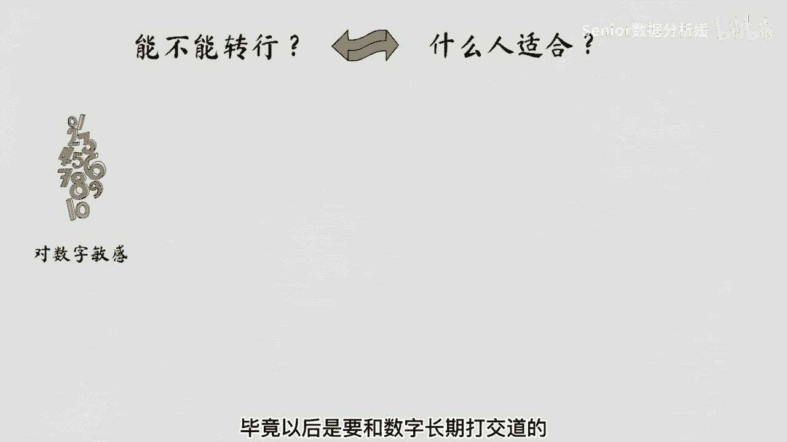
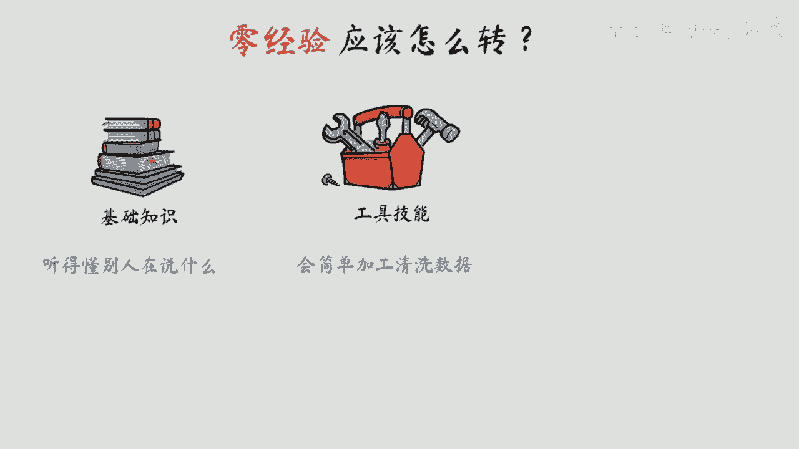
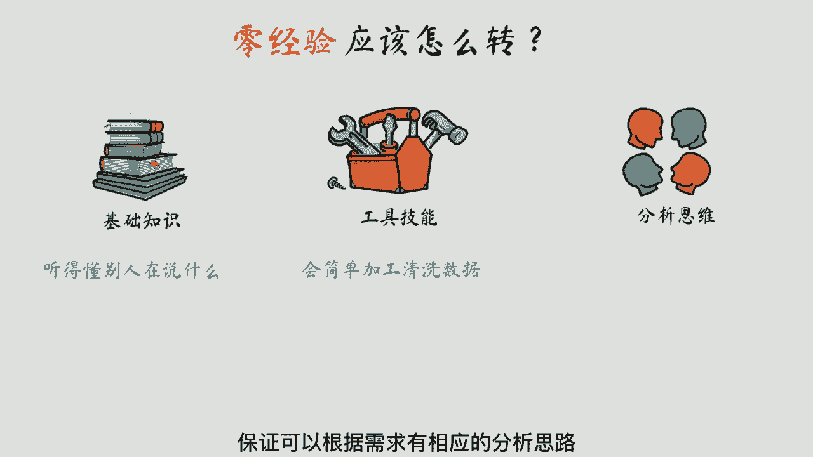
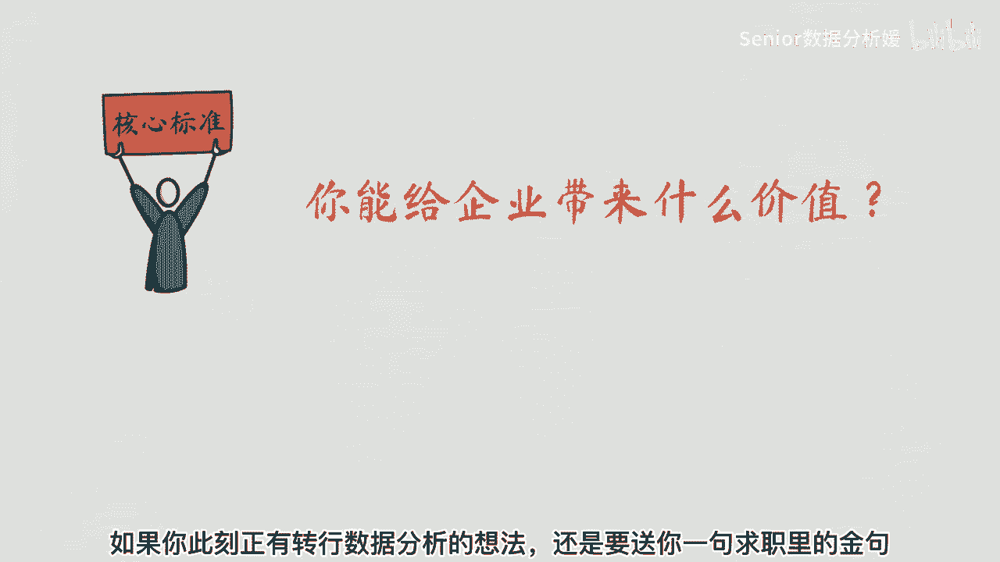
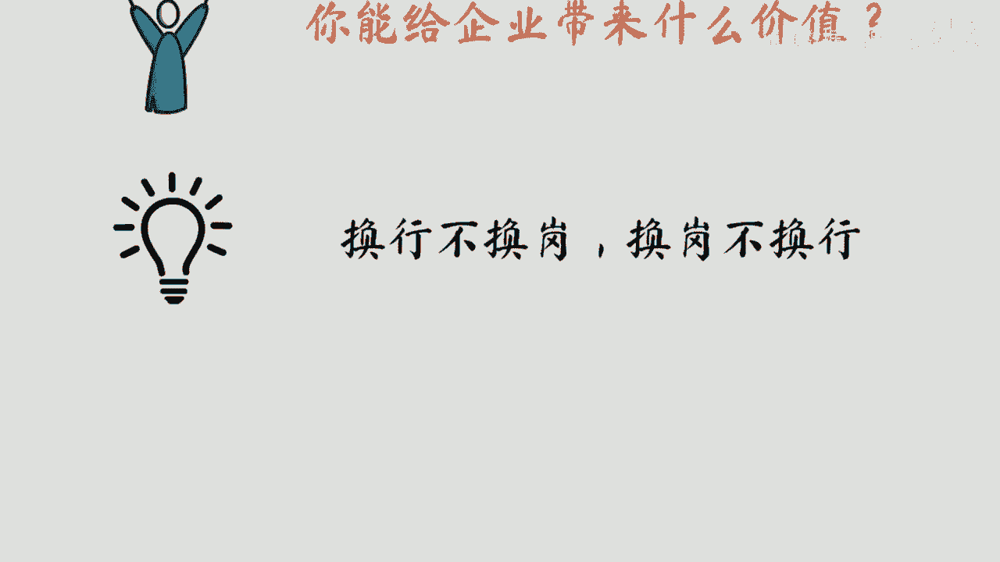

# 数据分析+金融量化+数据清洗，零基础数据分析金融量化从入门到实战课程，带你从金融基础知识到量化项目实战！【入门必备】 - P1：数据分析-必看！ - Senior数据分析媛 - BV1Ak61YVEYX

最近很多人咨询如何转行数据分析的问题，提到转行问题，我们不禁要问两个问题，能不能转和怎么转。

能不能转行，换个问题就是你适不适合数据行业，数据从业者普遍会有以下几个特点，首先你要对数字比较敏感，毕竟以后是要和数字长期打交道的。

其次你要有足够的细心和耐心，大概率你会花费大量的时间处理数据，如果你处理的数据有问题，那得出的结论肯定也是错误的，第三点是你需要有相关的行业经验和业务经验，毕竟数据分析的目的是为了能给业务带来价值。

最后是需要你有比较好的沟通汇报能力，如何包装你的分析结果，让别人知道是非常关键的能力，你可以结合自身的优势进行分析判断，从内心上去感受你是否适合做数据分析，那具体应该怎么转呢。

这里我们讨论的前提还是针对零经验的人群。

之前对数据分析的了解几乎为零，你需要了解这个行业的基础知识，保证你能听得懂别人在说什么，具备互相沟通的条件，你还需要学习相关的工具技能，最常用的工具，比如像SEQUE保证你会简单加工清洗数据。

这是必备的基本功了。

最后你要了解一些常见的数据分析方法，保证可以根据需求有相应的分析思路。

而不至于有了数据也不知道怎么分析，当然不是说以上内容你全部要学的很厉害，才能去转行，大部分人的工作能力都是30%，在工作外学习，70%都是在工作中学习成长的，以上分析了这么多，其实有一个核心的标准。

判断你是否能转行成功，那就是你能给企业带来什么价值，在企业里都是以结果价值导向的，如果你此刻正有转行数据分析的想法。

还是要送你一句求职里的京剧，换行不换岗，换岗不换行，这样可以最大化保证自己的转行成功率。

如果你真心热爱，请一定坚持自己内心的想法。

