# 数据分析+金融量化+数据清洗，零基础数据分析金融量化从入门到实战课程，带你从金融基础知识到量化项目实战！【入门必备】 - P21：01 jupyternotebook基本操作 - Senior数据分析媛 - BV1Ak61YVEYX

的路径，然后在这个地方我们去输入主PTERNOTEBOOK，然后我给它打开。

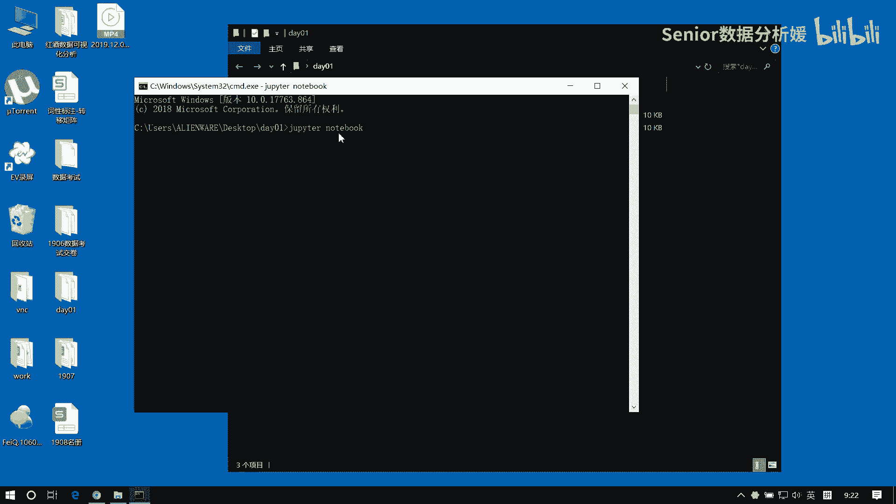

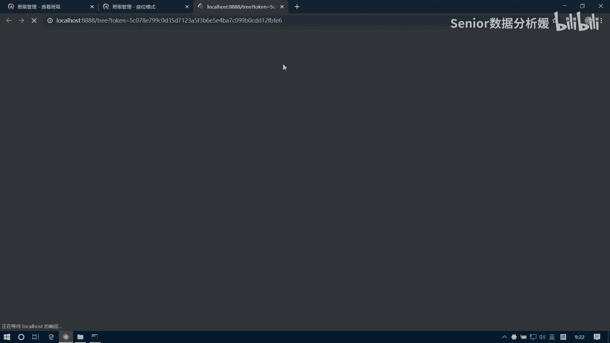

那么现在我们看到的这个东西呢，就是我们主PTERNOTEBOOK，这个编译器的一个可视化界面，这个界面是以web，以web界面作为这个外壳的外壳的，那么它内核是啥呢。

内核是件是一个IPYTHON这么一个内核啊。

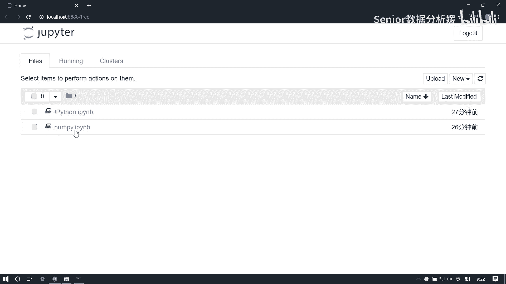

这个里边啊，我们注意我们打开这个编译器的时候呢，我们就是开启的这个终端窗口啊，你不要关啊。

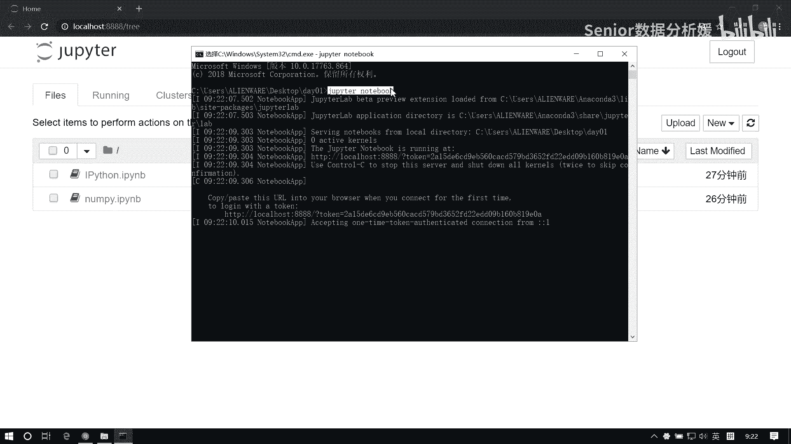

因为这个就是它的后台进程，你这个玩意一关了，我这边就没法用了，知道吧，所以这个装窗口一定要留着啊，这个终端别动它啊，哎我先把这个这两个文件给大家发一下啊。

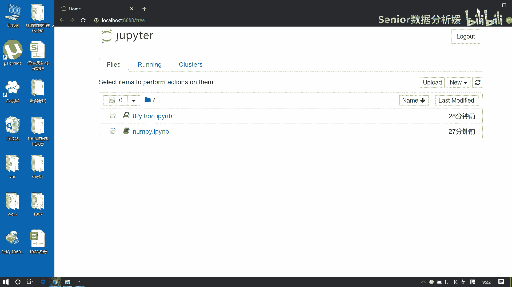

大家把废修上一下，还有什么，你看老六不行，然后点开八点开，在这个好难啊，说话所有高中专一。

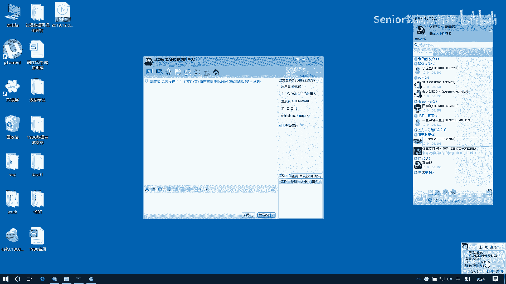

嗯收到了吧嗯，一二说完了吗，好了，我们先来说这个编译器啊，先说编译器啊，那我们做数据分析的话呢，主要就是用咱们这个主pyter notebook这个编译器，这个编译器呢有几个好处啊，什么好处呢。

因为数据分析的话，一个就是我们要去做这个运算，一个呢就是要去做可视化，另外一个呢可能还要去写一些业务分，析上的一些思路，或者得到一些结论，也就是说呢我们其实做数据分析有三个需求啊。

咳咳主要就是这三个需求呃，呃第一个我们需要对数据能够运算是吧，然后第二个呢，我们能去这个添加这种这个文字描述，第三个呢可能需要去做可视化的图表展示，对不对啊，基本上做数据分析，这就三块啊。

你逃不了这三块，一个数据运算，一个是文字描述举例，比如说我们随便去找一些软文，现在这网上这种软文太多了，很多公司他也会做这种软文是吧，比如说像我们公司也会做啊，比如做一些这个行业资讯啊等等这种。

那他其实也属于一种数据数据分析的一个报告，还有包括比如说其他的行业，比如说你看那个咱们淘宝，淘宝里面有有，总会有一些什么精选的那种那种购物，大家有没有看过，就是做那种商品的介绍的，看过没啊。

然后呢你他一般都是小编写的对吧，写一堆文字，写一写一张图片，然后说什么这个好那个好，然后又便宜，赶紧买吧，不买你就亏大了，这种对吧，就基本就这种文文章啊，还有一些其他行业的啊，也会做这种软文推荐啊。

那么这边可能也会涉及到一，些什么数据的展示啊，比如说我们想分析整个今年这个某个行业，他们的一些数据的一些变化啊，也都会做这种这种这个数据的分析啊，那么基本上呢都是有这么三个三个项啊，你像我们公。

如果你如果将来我们工作的话，你公司如果有这种需求的话，那我可能也需要你去做啊，别人做不了，你不用期望说什么Python啊，这个java啊或者H5啊，或者移动端啊，或者其他程序员来做。

其他程序员根本做不了，如果你公司没有这个数据部门，或者没有还没有建立出来的话，那么这个事肯定是落到你头上的啊，所以这种事啊，那么我们用谁来做呢，就用这个主Python notebook来做，刚刚好。

为什么呢，因为它是集编码文本及可视化于一体的，一个轻量级的超文本编辑器啊，它这么一个东西啊，就可以编码，可以运算，可以图标展示啊，不是表，是表啊，他能干这些事啊。

比如说给大家看一个这个一个数据分析报告啊，我们找一个。

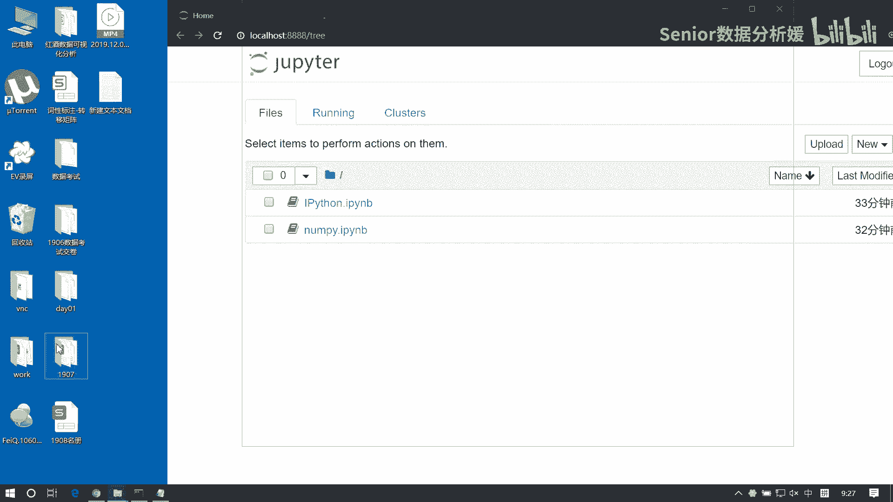

咱们大致看一下他是什么样子的啊，比如说这个，比如这个吧。

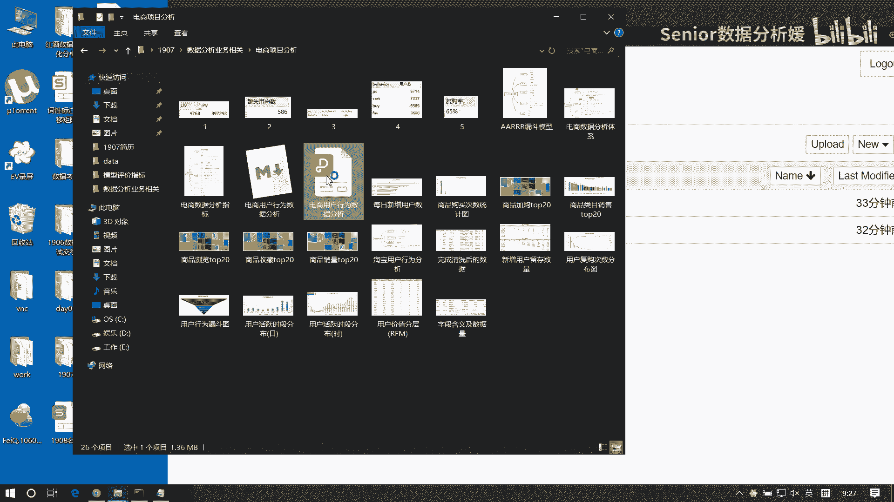

是吧，这个就是我们做做的一个数据分析的报告，你看它大致的形式啊，看个热闹就行了，你看这边有有字是吧，有字，然后有这个图，然后呢还有一些数据的一些说明，然后包括一些数据的一些处理，然后数据的一些展示。

然后以以以及这个图表的展示，然后各个指标的一些运算呐，还有一些商业模型的一些绘制啊等等啊，然后最终呢是吧，你看这都是代码对吧，然后最终得出一些结论，是吧，得出结论啊。

也就是说我们一个数据分析报告的结构呢，它一定是包括这几项的，那么这几项的话，我们直接用这个主pyter notebook来干啊。

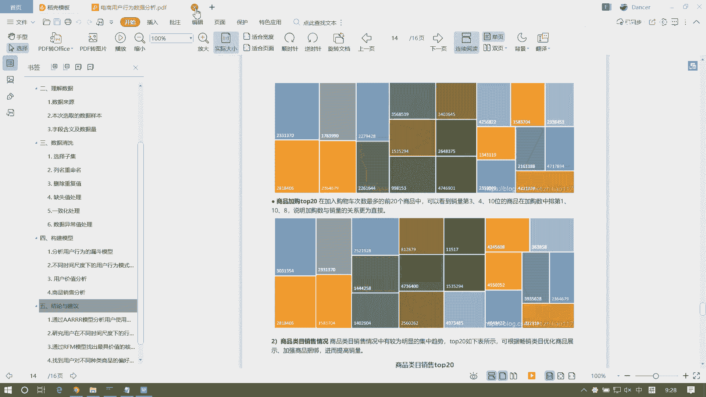

就全都能够满足啊，所以我们选择用jupyter notebook来做数据分析啊，当然也有用PYTHARM的啊，但Python有点low了啊，因为PON不是不是干这个，他主要是侧重什么。

你有什么模块的管理啊对吧，干这种，所以你用它写web项目之类的可以啊，但是用它写数据分析就没有意思了，因为它很多功能是不需要的啊，而我们需要的功能它就没有好了，那我们看这编译器怎么用啊。

最基本的一个用法，现在我们已经打开这个界面了吧，现在呢我们在右侧啊能看到有个new，在这呢我们去点击python3来构建一个新文件，都动起来啊，别光看热闹啊，怎么卡了呢。

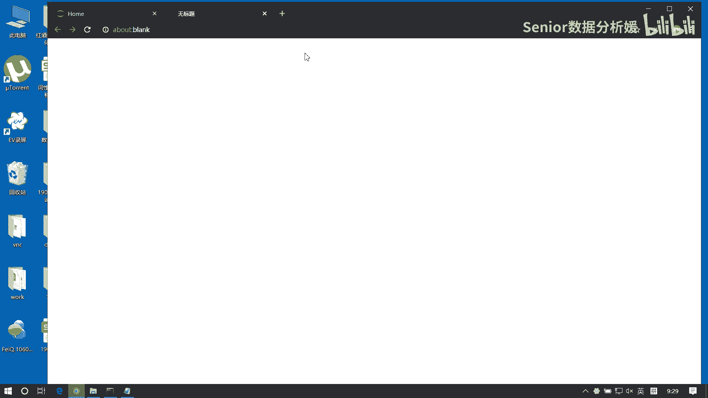

等我重启一下啊，你们能创建出来不，等我一下啊。

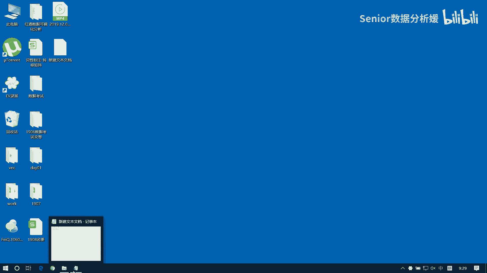

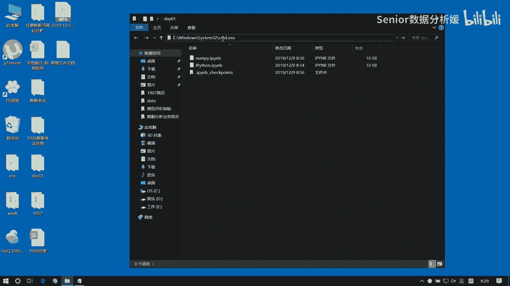

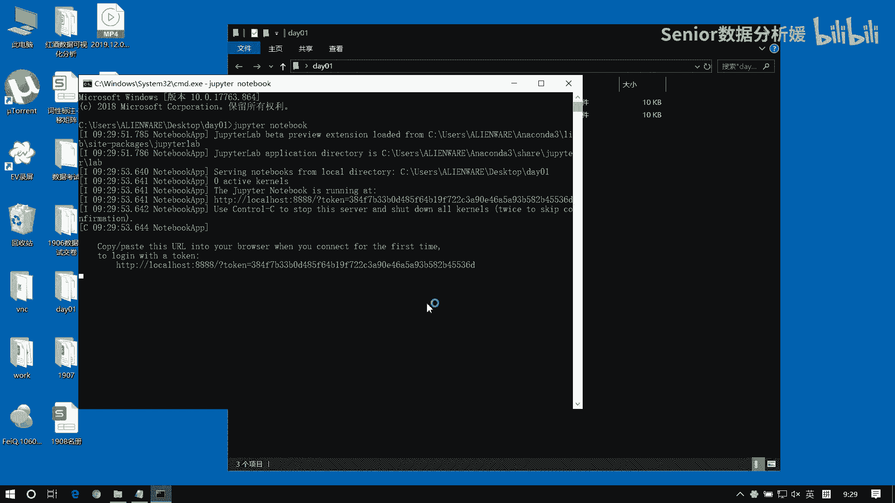

点击new python3构建新文件是吧，好了这是我们这个界面啊，然后呢这个这个文件啊，这个文档呢它其实构建完之后，就跟我给你给你发那个文件的后缀名一样的。

这什么i Python notebook是吧啊，Python notebook啊，就这玩意啊，叫IPYNB。

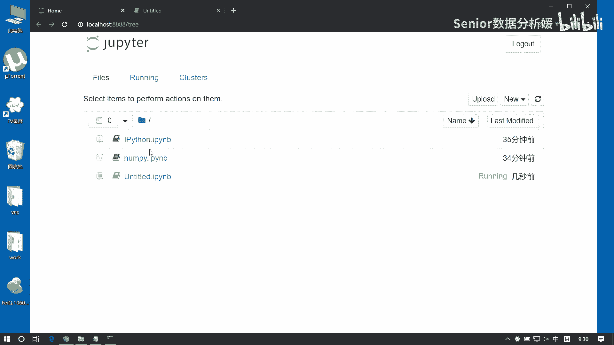

然后我们构建就是这个UNTITLE的，所以这个地方我们可以给它命个名啊，这块我们点击上边我们可以去写个名字啊，写个你心爱的名字啊，比如说你心爱的姑娘啊，dancer对name。

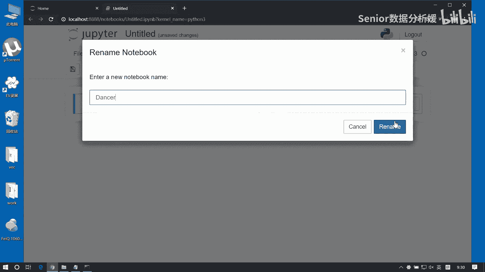

我随便起起个名字啊，自己起吧啊，嗯这是重重命名了是吧，然后呢我们看下边啊，下边上面这块呢有一些功能功能，大家先不用管它啊，先不用管它，我们先看下边，先说主体这部分，那这个东西叫什么呢，叫单元格。

也叫sell，我可以直接在里边呢去敲代码，在这可以敲代码啊，然后这个单元格呢有两种模式啊，有两个模式，什么模式呢，一个叫边界模式，一个叫选中模式啊，要选中状态啊，两种状态我给大家这是记下来啊。

那第一个叫编辑状态，第二个是选中状态好嗯，那我们现在所处的就是编辑状态，就是这个有光标在闪动啊，有光标闪动，那么什么是这个选中状态呢，你按一下ESC键，就没有这个光标闪动了。

你会发现左侧这个边栏变成蓝色了对吧，按ESC键啊，或者呢你鼠标点击一下左边这个位置，点击一下左边这个空白处这个位置啊，点这一下它也会进入选中状态啊，往这一行可以用那个ESC，或者鼠标点击左边空白空白处。

嗯那这个嗯你这个编辑状态啊，怎么切换过来呢，你可以直接敲回车键，这时候就变成绿色了对吧，或者呢简单一点鼠标直接点中这个单元格内部，嗯如果是就切换进来了啊，两种状态，那么这两种状态呢干什么用呢。

这个编辑状态下啊，我们是干啥的呢，我们是写代码，或者写文本，如果是选中状态呢，我们是，对单元格进行编辑，比如什么呢，比如增加单元格，删除单元格之类的这些事啊，或者复制啊，或者粘贴啊，是干这种事的啊。

这两个状态啊，第一步，那我们先说单元格的操作啊，先说单元格的操作，单元格怎么操作，第一个啊，我们我们如何去新增一个单元格，这个单元格操作呢都是必须要先处于什么呢，先处于选中状态啊，嗯你怎么了，三回了。

我们先按一下ESC键啊，新增我们可以有两种方式新增，一个是直接按一下B嗯，还有一个是呢直接按一下A，那如果是B键是在当前选中，单元格的下方新增一个单元格，如果是A呢。

在当前选中单元格的上方新增一个单元格，好这是新增啊，那第二个我们说删除，删除单元格，比如我们现在想把上面这个删除了，那我是得先选中啥啊，然后按双击你的D键，DABCD的D，双击D啊，DD哎。

12542667123，然后第三个我们说复制单元格，直接按C键啊，直接按C键，这是复制选中单元格，比如我在这里边我敲了一个，就是这个是一个单元格，然后呢我选中它，我按一下C键，这样我就复制出来了。

那怎么粘贴呢，按一下V键，后一直可以发下，81119完了，然后打下，还数啥时间要包括，还有一个单元格叫剪切啊，剪切单元格剪切有什么呢，用X啊，剪切选中单元格，比如这啊，我们直接按一个X就没了啊。

所以说这个东西我们一般也可以用来干嘛的，用来删除，还有一个是撤销操作，直接按Z键啊，23336668，嗯我自己做人的，好，这几个都是单元格的操作啊，这个简单吧啊，这应该是你过一遍应该就能记住了啊。

然后再下一个啊，这是单元格的问题，然后另外呢单元格呢还有两种，刚才我说的两种状态，单元格还有两种模式啊，其实不止两种，还有还有好几种在这能看到啊，那我们要我们用的就两种，一个是cold。

一个是markdown，code模式和markdown模式，这两种模式有什么区别呢，code模式呢是敲Python代码的啊，这是可以可以执行Python代码，而这个呢可以执行markdown语法。

格式的文本markdown大家知道吧，这个会用吧，有没有不会用markdown的啊，markdown不会用啊，这个工具大家用过没，这个这个没用过啊，这个都说不过去了啊，我给你们比量一下啊。

markdown语法这个必须得会啊，这是你你干互联网行业，就这个玩意不会不行啊，不是TX器啊，你比如说你写这是一个大标题，是不是，那他怎么呢，我们可以写一个这个，它是用这种符号来来个什么的。

是不是用这种符号来就是修饰我们这个样式的，知道吧，这个东西就是就是markdown语法，它有很多种很多的东西，比如说常常规的就是什么标题啊，段落呀，还有这个等级呀，还有一些什么链接呀，图片呐。

还有代码等等等的，比如我们想敲个代码，敲三个三个那个单引号是吧，然后这样可以选个语言，比如PYPYTHON，然后这样写一个define my function。

然后在这写个print hello world对吧，然后比如说还要写写，比如写个段落之类的，那其实这里边就都有，也有各种那个就是处理方式啊，比如这我这这是一个段落，啊然后我们以这个，源码模式。

那这是什么，这就是你这个markdown语法了，看了吧，这个一个井号表示的就是一个一级标题，两个井号就是二级标题，井号井号，这是二级标题，啊比如说你再换一下，变成这个，是不是，这就是二级标题，知道吧。

这个这个语法大家得会啊，大家可以晚上回去自己查一查，就MADOWN，语法很简单啊，就是一些基本的标记比数还简单，知道吧，就是几个格式，我要写代码的话就得这么写，然后写段落的话，普通写就行。

然后写标题这么写，还有一些其他的格式，这个嗯，什么1234567级标题啊，段落，然后标题级别表格，代码块，公式块，引用等等，就这些东西啊，嗯哼猫当于板干嘛呢，就是我们我们比如写博客啊。

或者写写一些这个网上的文章啊，他呢可以像就像word一样，可以帮我们去规范一些格式，这样看起来更好看，那他特别擅长就是写咱们这种技术博客，因为他有这种代码的这种编辑方式是吧，就是所以说我们写博客的话。

用它写就比较好看啊，所以你看比如说你去网上随便搜一些博客，我们搜一些随便搜一些技术博客，比如说搜这个jungle吧，是这个看看这有没有啊，这个不行，比如菜鸟教程吧，他这玩意就是就是用那个什么写的。

你看他这个东西为什么这么好看呢，它这玩意就是markdown，知道吧，像这就是一级标题，这就是段落，然后这是有level的，然后这个是标题，这是段落，这是代码是吧。

那我们如果你会这个markdown的话，你写出来的这个博客也像他这样一样好看对吧，这东西必须得会啊，那我们说了，我们做数据分析要干什么呀，我们要去写一些注释信息，所以说呢。

那你注入信息不可能像写注释这样一写，乱七八糟对吧，那这样领导一看太丑了对吧，所以我们可以用markdown来加这种东西啊，所以它有两个模式啊，如果你想去以这个markdown的方式来呈现。

你的这个文字的话，你就可以可以把这个把这个单元格在右上角，这个地方，把这个code给他改成markdown，现在它就是markdown格式了，看这主要是啊，但是呢这边有一个快捷的切换方式啊，怎么切呢。

这个，选中状态下啊，按一下什么呢，按一下这个Y啊，按一下Y键，你试一下啊，现在变成选中状态，然后按一下Y键，这样就变成了扣的，然后那你想切markdown状态呢，你可以是在选中状态下按一下M。

先选中状态再按啊，现在你可能看这个效果吧，还不是明显，还不太明显啊，因为你没有运行，你得运行才行啊，那我们怎么运行呢啊单元格的运行，运行的有好几种方式，我们先说一种最简单的control，加enter。

运行并选中当前单元格，我问你在下边这块为例啊，比如说我我现在这个模式它是个code模式对吧，在这啊，现在我在编辑这个单元格啊，它是个code模式，我可以在这写代码，我写一个函数啊，define啊。

My funk，X冒号print这个hello，这样呢我CTRL加X啊，不CTRL加回车，相当于是把这段代码呢做一个运行，做了个运行啊，然后呢我新增一个，我新增一个单元格，我还是扣的啊。

我在这块我调用这个函数，My function，我传入一个dancer运行，这样就输出了一个hello dancer是吧，都是用CTRL加enter运行，那么为什么呢，因为这个是code模式。

所以它会运行代码，但是如果我把这个东西啊，我变成M模式是markdown了，我再运行呢，你会发现这只是一个文本，而不是那个代码的执行，这是区别，大家可以试一下，来试一下啊，那这呢是代码模式啊。

那如果你想用那个markdown模式的话呢，我们做一个切换就行了，那切换的话呢，你这个你要是光写这种普通的文本的话，比如这是嗯，这是一个普通的文本段落，那你这时候运行的话呢是什么呢。

就是说你这个拷它运行是进入一个预览状态，就像这边一样啊，那我们现在它有用两个两个模式，一个是原版模式，我们现在写出来的东西，这是原版模式，知道吧，就跟这个是一样的，然后呢我要想看它的效果的话。

那我得CTRL加enter运行，这是它的效果，比如说我现在在这里写一个井号井号，然后下边我这边写上啊，这是一个标题，现在这是源码模式对吧，然后你CTRL加enter就进入了什么呢，进入了这个预览模式。

就跟我这边是一样的，这是源码模式对吧，然后我试图我去把这源码关掉，这样看到就是预览模式对吧，所以说我们如果是markdown语法的话，那你注意啊，这东西你写的是不是那个原段落啊啊有同学说。

那我为什么写出来没格式，没格式是因为你没用markdown给他标记格式，你标记它就有格式了是吧，这就有格式了，所以我们可以用这个模式呢，来写一些注释信息啊，那这种一般我们写什么注释呢。

可能写一些你的分析的思路，或者一些分析的逻辑，那像代码的注释的话，肯定你还是要写到代码里面去啊，比如这个这个啊输出一个值，这是代码注释啊，要分清分开啊，这是什么，这是你整个分析的过程的一个注释。

我觉得我能买单的感好，这大家再尝试一下啊，我主要整理一下笔记，Ctrl enter啊，运行这个运行有两个情况啊，这个markdown，模式下啊进入预览状态，而这个code模式下。

除了除了这个CTRL加enter，还有两个，还有两个运行方式，这俩大家了解就行了，一个是那个shift，加enter，还有一个是alt加enter，嗯你不能指数加空格，锁完一个。

一方法就相当于你写个D啊，就过来，M4是好，我会找回来，下课后，这两个大家那个了解就行了啊，第一个，那个预览吗，预览模式啊，CTRL加回车呀，那是你格式不对啊，你得先看他是不是markdown格式。

然后再去预览，嗯嗯是要怎么找回这个好。

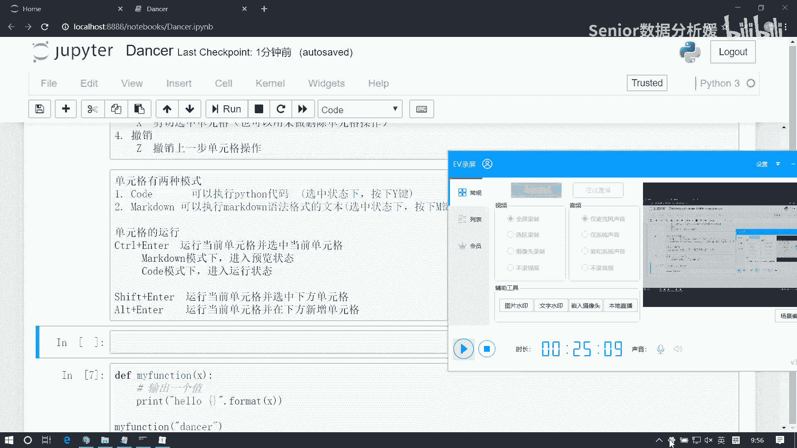