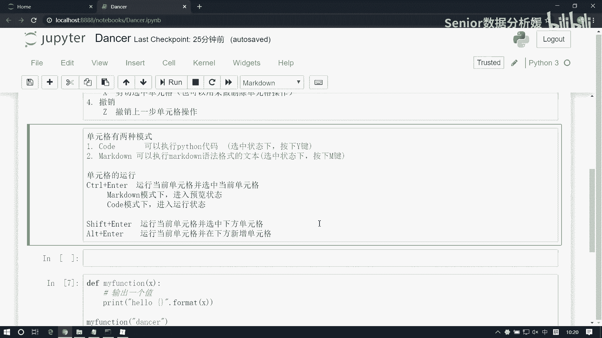
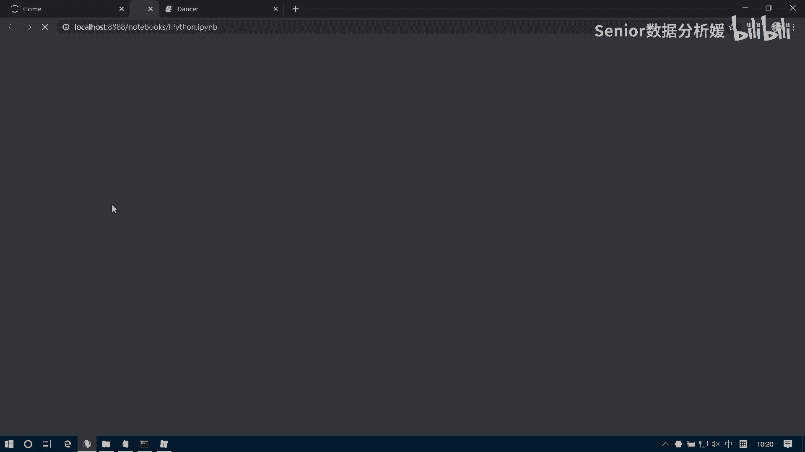
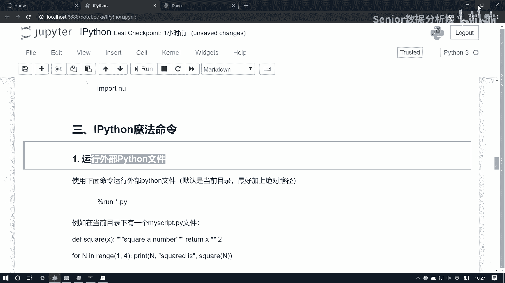
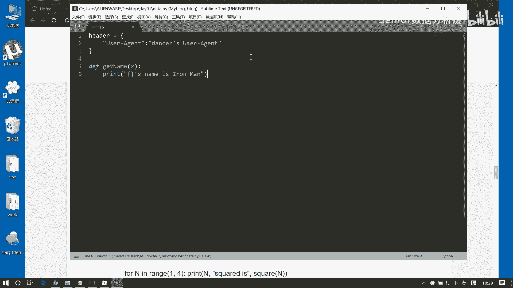
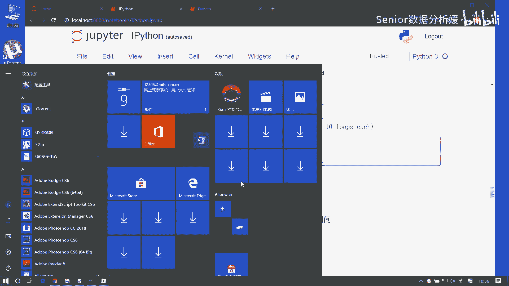
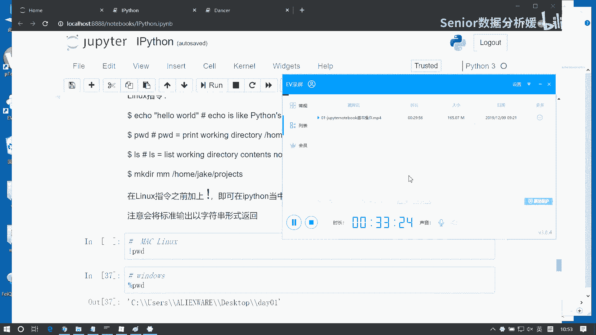

# 数据分析+金融量化+数据清洗，零基础数据分析金融量化从入门到实战课程，带你从金融基础知识到量化项目实战！【入门必备】 - P22：02 Ipython基本指令 - Senior数据分析媛 - BV1Ak61YVEYX

来看屏幕啊。

别闹了。

我们看第一个文件啊，看这个i Python这个文件，别闹了，同学们啊，给智哥个面子好不好，别闹了啊，我来看啊，这个我们除了刚才我们介绍，那几个单元格的操作啊，我们看看我们i Python。

这个我们还能了解一些什么东西啊，这个i Python跟主pyter notebook啊，先搞清楚一个关系，哎Python呢是我们运行的这个内Python内核啊，它前边加了一个I表示的是数字是吧。

跟数字相关的啊，比如它是一个运算内核，这个运算内核呢是我们写这个数据分析，要用的一个Python内核啊，它属于这个包装过的，然后呢这个主Python notebook呢。

它是基于这个内核的一个web编译器啊，他是呢把这个web的功能，就是这个以web的方式来进行可视化展示的啊，所以他两个呢其实是绑定一块，然后组成这么一个编译器的啊，然后呢我们看啊，那这里边提供的功能呢。

主要是i Python给咱们提供的一些基本的功能，它主要是辅助咱们做编码的第一个启动程序，不说了，我们已经会了是吧，直接在终端找到一个指定目录，交那个主派生的和不可启动就行了，然后往下看啊，帮助文档。

我们怎么获取这个帮助文档呢，我们有这么几种方式，一个是使用help指令，还有一个呢是直接在后边写一个问号，然后还有一个呢是用tab键，用这个shift加tab键啊来查看。

比如说哇我们现在呢去查看一下这个，比如这个line函数是吧，那我们知道他是求这个列表的一个长度的对吧，我们可以用help，插入一个line，这样我们可以看到这个line这个它的一个文档啊。

就这个函数的一个文档，这是第一种方式是吧，然后这个第二种方式呢，是咱们直接用问号来查看，我可以在这个LAN后边接一个问号啊，这时候你得注意啊，你注意就要全屏展示，因为它是在下边弹出来的啊，有可能看不到。

啊还有一种方式呢是我们最常见最常用的啊，怎么呢，我们可以啊，你加入一个函数之后，如果你不知道这个函数有哪些参数，你可以用shift加tab键来打开这个文档啊，然后这个文档呢还有个加号，我可以给他展开。

那么有一些函数呢，它里边会给我们带一些那个demo啊，就是一些案例，他会告诉我们这个函数大概是怎么用的啊，所以说他这个基本的这个就是编译器的一些，查看文档的功能啊，是通过这几个方式来处理的。

另外这个这个也可以用两个问号，来显示更详细的信息，啊那这个烂函数的话，它体现不是很明显啊，就是一个问号跟两个问号都可以用啊，比如我可以查看一个变量或者是之类的，什么东西啊，比如我定义一个A等于九，是吧。

我们可以看到这个A是啥啊，它是一个int，然后呢它的值是九是吧，然后这是他的一些描述信息，这是双问号三种方式啊，大家记一种，大家记住shift加tab键，记住了吧啊shift加tab，查看那个文档。

另外呢它也支持这个自动补全功能啊，可以直接用tab键来进行补全，比如说我们去敲一个一个八啊啊，比如说咱们的这个啊南派吧，南派啊NUM，你可以tab键，然后这边可以看到，就是所有的这个是以NUM打头的。

这些个包是吧，我们这边呢可以导入这个南派，那我们咱们写写这个代码啊，尽量能用tab键，就用tab键是吧，咱别像写文本编辑器一样，因为用用这种方式的话，一个是呢不容易出错是吧，再一个呢咱们敲代码也快啊。

所以高效啊，这是补全功能啊，好了，那除此之外呢这是基本的，一个是股权，一个是这个文档查看是吧，其他的也就没啥了，你看这里面不涉及到多文件编译之类的，这种事啊，也不是什么模块之类的事儿啊。

然后另外呢就是他给我们提供了一些魔法指令，它里面其实摩擦指令特别多啊，但是我们不用全看啊，因为没有没没什么用啊，并不是那都有用的，这边呢我们捡几个，可能我们用得到的，说第一个是什么呢。

我们可以直接去运行外部的文件啊，运行外部的一个Python文件，然后这个我们在运行外部文件之前呢，我们先来了解这样一个机制啊，就是说我们整个这个主Python notebook里边呢。

它每一个cell啊都是独立运行啊，都是独立运行，然后呢这个左边这个in啊，它叫输入历史，这个输入历史呢，它告诉我们，就是你的代码的一个运行的先后次序，那么我们肯定是后运行代码。

能够读到前之前运行代码的数据，比如说这里边A等于九，我们做好赋值了它的输入率值四是吧，这个时候比如说我想引用这个A，我想引用这个A啊，那我在其他单元格内部是可以使用它的，但你必须保证什么呢。

保证我这个A它已经运行过，然后这时候比如我输出这个a print a，是这样把这个值就输出了啊，但比如说我现在来个B等于一个十，我没有运行的话，如果你这时候输出输出B的话呢，是没有值的，对不对。

为什么呢，因为你这段代码没有运行，啊没有运行啊，然后比如说现在这个B是十啊，然后现在呢我我这边输出B那它就有十了，那我再来一个啊，比如说这个B等于11，B等于11，然后现在我们再输出这个B。

那它的值是几呢，还是十，为什么，因为这块我没运行，对不对，它一旦我运行了，是他是不是变成12了，他变成12的话，那这个位置你还得你要想拿到这个值的话，你是不是得得更新它呀，因为现在你的输入是11。

它是12，也就是说它是后运行的，它是先运行的对吧，只有我它我再运行一次，它才是11，明白吧，就是这个输入它只是帮我们一个参考，为什么呢，就是因为它这个机制，因为每一个cl独立运行啊，每一个cl独立运行。

但是这个资源呢是共享的，另一个SL的资源，我们可以在另一个CEL当中去使用，所以你必须保证，你在引用另一个cl里面的资源的时候，你要保证它已经运行过了啊，那这是我要强调的问题啊，那我们再来看啊。

这个我们如何去运行外部文件呢，我们运行外部文件，就意味着那个文件内的所有的代码呢，在这边也都运行过了啊，比如我们现在去写一个外部文件啊。

我们去用sublime去写一个写个Python文件啊，嗯data点派保存一下，我们给它保存到桌面，然后day01当中，啊我这样改一下，比如这块我们定义一个，比如说header吧，啊我们再写个爬虫是吧。

这边写一个啊，User agent，然后冒号这写一个dancers ua啊，UION好，这是一个变量是吧，然后呢我们再写一个函数，比如说写定义一个函数，这个我们叫嗯你get name。

啊这个人的名字叫钢铁侠好吧，这我们写了一个函数啊，也写了一个变量啊，那么这个这个文件呢。

我们可以给它直接加载进来啊，我们可运行它可以用直接百分号run，那百分号呢，意味着我们就激活了一个魔法指令啊，run然后run谁呢，我们去把这个这个data点PY给他做一个输出好，这样就运行完了。

前面有一个14是吧，那么我们可以看啊，那这个data点PY里边是不是有那个有一个header，还有一个那个get name函数啊，我们可以输出这个header啊，这是我们这个header，对不对啊。

这也是一个特性啊，就是我们在主PTERNOTEBOOK里边，你要想查看一个变量的值，不用就是用这个控制台这个输出啊，不用它，你直接这个输输出这个变量就行啊，把这个变量放在这。

然后直接CTRL加enter直接运行就能输出啊，那另外呢还有一个叫get name函数，我们传入一个这个啊三次啊，这块没给那啥是吧，算了，不管他了啊是吧，也就是说呢，我们在这里面可以。

什么一个外部Python文件被运行之后呢，相当于这个文件内的所有资源都被运行过一次，那我们这样的话，我们在这个主Python notebook里面，就可以使用它这些个变量了啊，那另外呢我们也可以查看。

就是我们当前文文档当中一共有哪些变量，这边呢我们可以用下面这个指令叫百分号户，百分whose和百分hols s，要不在这啊，百分号who这我们可以看到有A有B有get name，有header。

还有N派，这都是我们的之前用过的一些变量对吧，然后我们可以通过who s，来查看这些变量的详细信息啊，A是整数，B是整数，get name是一个函数，header是一个字典。

然后呢南派呢是一个model，啊它的类型包括它的数据或者它的这个信息啊，都在这能查看到，然后还有一个这个霍LS啊，那他那是返回一个列表，直接得到这么一个列表啊，就我们可以对这些变量啊。

统一进行一个批量操作，比如我们再加一个，我们再加一个C等于100，那这样的话我们获取的就是多了个C啊，看who s也多了个C是吧，好那我们再看这个前边的啊，就是运行外部文件，然后还有个运行计时。

这个运行计时呢，它可以帮我们看一段代码的一个运行时间，它呢有这么几种方式啊，有几个思路来做运行，一个呢是直接去查看一段代码的运行时间，直接用百分time，比如说我们写一个函数啊。

define我们就叫求和吧，我们叫开，然后我们写一个number嗯number，然后这里边我们写个循环，For i in range number，然后呢我们去写一个result，让它等于零。

我们在这个里边呢去把把这些个值啊，做一个累加result，然后加等I，然后最终我们再返回这个result，那这是一个求和函数，对吧好，那我们就可以看啊，可以看我们这个求1万或者求100万个数据。

我们电脑需要多长时间，我们可以用百分号time，然后后边写这个CALCULLATE，100万，这玩意一共是96ms啊，他可以帮我们去记录这个东西啊，那么这个代码呢你你要注意啊，他必须是写到一行里面。

必须得要同一行，计算一行代码的运行时间啊，必须写在同一行，但是我们我们这样去记录时间，会有一个什么问题呢，因为这个代码啊它运行时间是不靠谱的，你看我再运行一次是143ms，我再运行一次是172ms。

再运行一次193ms，190，176，153是吧，这个值是有变化的啊，有变化的，因为它取决于你当前的计算机的一个状态啊，比如说你这个计算机，它现在任务量特别繁重是吧，他又得看。

又得帮你去这个放播放一个电影，又得帮你去播放歌，还得帮你去去那个去运行其他代码，那可能他的这个内存占用就会比较大，他状态就不好，再一个有可能你电脑比如说太热是吧，或者太冷，或者内存大小可能都不一样对吧。

就导致你的运行时间可能是不太一样的，那其实我们一般会怎么怎么干呢，一般我们会这么干啊，我们用这个百分号time eight，我们来算这个时间，100 12341百万，这个代码啥意思呢。

它是取多次运行的一个平均时间好，啊多次运行的平均时间，那这个逻辑呢其实大家要注意啊，就是我们在统计学上一般处理问题呢，他都不会去取一个值，比如说我想说咱们班机的，我想去衡量几个班级的一个。

比如说场地水平是吧，那你不能说只看一次，比如说期中考试，这个班考了平均成绩是89分，然后那个平均成绩是87分，那你就说这个班就比那个班好对吧，因为某一次成绩是它会存在偶然的。

所以一般我们统计学生呢会取多次的值，然后去看他什么，看他的这个平均值啊，或者是看什么看这个方差，你要是看大小的话，就看均值啊，就是我们一般统计学上啊，他是这么看数据的啊，统计学啊。

这个不会只只看数据的某一次的取值啊，然后来衡量该数据的水平，那他怎么干呢，他要看两个指标啊，那一般查看两个指标，一个就是平均值，一个就是标准方差，这个平均值应该都都记得是吧，标准方差还记不记得啦。

标准方差怎么算的呀，怎么算的。

去掉一个，然后那是标准方差吗，我们标准方差应该是我们初中时候学的概念啊，大家记不住呢，也难怪啊，谁记性那么好啊，对吧啊，初中的事还记得啊，像你像一般来讲，咱们巅峰时期应该就是高考，高考那阶段对吧。

啥都会是吧，懂生物，懂化学，懂物理，然后还要懂历史，懂地理，懂英语，懂数学，懂语文是吧，出口成章啊，写写文章都是成套成套的对吧，你像我当我当年写作文，最最喜欢套用就是诗句啊。

我的我的套路永远都是开篇一句诗，然后内容全靠编的，哈哈哈哈啊，因为我发现这个套路老老师特别喜欢啊，每次你写你写，就是每次你你写这个文章的时候啊，第一句如果是以诗诗句开篇开篇。

基本就奠定你这个你这个基调啊，当时我记得我写过一篇文章，当时被我们老师全校朗诵了，我还记得至今为止，我还记得就我那篇文章的开头是啥呢，离离草不是梨园园草，开头开头第一句特别有气势啊。

很有很有那个就很大气，你知道吧，一看就是男孩子写的文章，我写的是男儿何不带吴钩，收取关山50州，这就是气势，这就是豪迈啊那一句话啊，然后当时我们老，当时我们老师因为育老师，他本身他他读文章也很有气势。

你知道吗，我那文章我写的时候我觉得不怎么样，他挂机一读，然后当时我们全班掌声上来了，然后自此啊自此我就养成一个毛病啊，原来写作文以诗篇开头是这么取巧的一件事情，然后所以大家就喜欢干这种事情啊。

那当然这个初初中时候是吧，初中时候我们也会的这些东西也很多，比如说生物课，大家都特别喜欢什么生理课这种是吧，男性跟女性的区别是哈，当时我记得，当时当时当时我记得我特别爱生物课。

就是因为我们上生物课的老师特别漂亮，而且她给我们讲生理课特别刺激，哈哈啊，我来送你啊，然的还是初中啊，还是初中初中啊，情窦初开的年纪啊，然后那初中时候我们讲这个标准方差，他讲的什么呢。

我还记得我数学老师给我们给我们是这么说的，我们数学老师说，你想衡量一组数据的稳定程度，那么一定是用标准方差来衡量，然后那什么是标准方差呢，就咔咔咔一堆给我说了一堆数字啊，比如说比如说你啊。

比如我想看你的成绩稳稳不稳定，你今你这个今天考考了这个75分，明天考了呢79分，后天考了个80分，后天又考了个啊这个81分，然后呢又考了一次85分，85分好了，那么这是你的成绩。

然后另一个人呢考的都是这个应该多少分呢，第一次考了80分，第二次考了80分，第三次考了80分，第四次考了80分，第五次考了80分啊，然后你你发现如果你要是算这个算平均值的话，这两人是一样的，对不对是吧。

A同学他的平均成绩是80分，B同学他的平均成绩也是80分，那谁好谁坏呢，肯定是B好，因为B成绩很稳定嘛，对不对啊，B场地很稳定啊啊啊，这样你把把考到第一也很稳定对吧，但是这时候你光你光靠稳定也不行。

你还得看均值，对不对啊，所以说你一般我们衡量数据啊，你不能只看均值，也不能只看方差对吧，所以你要从两个角度上来看呢，那么他其实画的图应该是大概是什么样子呢，就比如说我这一组成绩。

那么我们两个成绩他都是80分，如果我画一个柱状图的话，这个是A这个是B啊，那么这条纵轴呢就是我的成绩就是S啊，那么这条线呢就是80分，平均成绩都是80分，那你呢你你现在根本看不出来谁好谁坏。

所以呢我们一般会加一个什么呢，叫置信区间，A成绩呢是有这么一段的一个置信区间，也他可能是从75，75~85，这个区间会有一个变化，而B呢可能这个资金区间几乎为零，所以这说明什么呢。

说明他的这个成绩要比他的成绩稳定，能明白这逻辑吗啊，所以说我们我们这个在统计学上啊，我们需要表表达一组数据，一定不能拿偶然数据去表达全部数据啊，你像现在这个就是就是我看过一本书啊，这本书叫什么呢。

叫简单统计学也推荐给大家看啊，就是特别有意思，他会把很多这个就是现实上的一些一些数据呢，就是以以那个就是以真实的案例呢给你，就是把那个统计学的那些原理啊给你表达出来，你像现在这个炒的。

就是现在这个经常会有人说，有一个概念叫什么呢，叫幸存者偏差，大家听过没有，我发现最近抖音特别特别喜欢，有些人爱爱那个卖弄这个这个概念，说什么叫说这叫幸存者偏差，幸存者偏差，那什么叫幸存者偏差呢。

啊这是个统计学的概念啊，就他其实说的就是一种偶然数据，偶然数据的问题啊，比如说那个他是这样，他是这样举例子的啊，我是借用这个书上的一个原原例子啊，来给大家解释这个问题啊，那么什么叫幸存者偏差呢。

他说的是二战时期啊，二战时期呢有两个国家在干仗啊，然后有些国家呢有空军，然后另一个国家呢就拿着机关枪，咔咔扫射那种的，就是能把机枪把飞机打掉的那种，对吧啊，肯定不是中国干干那个什么，肯定不是中国啊。

在中国的话，基本上这个肯定是你飞机是有来无回对吧，我全给你扫下来，就这样，那它是怎么它是怎么举这个例子呢，他说这个飞机啊飞过去之后呢，会被受到，受到对方的这个地面的这个武器的攻击。

然后呢可能就会有一些损失，然后呢那我们想降低这个损失，我想降低损失怎么降呢，那我就给给这个飞机啊装一些甲板，像坦克那样是吧，加一下这个防防爆这种这种板子啊，这种板子，然后但是呢这个板子很重。

我飞机本身他那个年那个年代啊，飞机它他那个造那个就是那个制造，制造那个原料，可能也不是那么清的，像现在这么轻对吧，他那会儿还还飞机挺重的，所以他承受不了太重的这种甲板的这种防御，所以呢那我就想。

那我们应该找一些比较这个容易中弹的地方，我们去给他添加这种甲板啊，那这样的话，你也可以去降低咱们这个飞机的损耗是吧，所以呢他们就派出了20架飞机啊，然后做了这个统计，那我派出去飞机之后呢。

然后呢他们会把这个飞回来的飞机啊，都做这样一个观测啊，然后他们他们他们做了一些绘制，大致来讲呢这是个飞机啊，这飞机挂的给宝一生有你不用，主要是精髓嘛对吧，画的精髓是吧，这一看就是个飞机嘛，对不对。

那你当然你加上个这种五角星就是战斗机了，对不对，好，再加个三个三个小小圈圈，对不对，这就是战斗机了，这是驾驶舱啊，加上好了，我用红色的小点来表示它的着带部位啊，我们做了一个统计，做一个统计啊。

这个飞机啊，它所到这个着弹点的一般是这个位置，这个位置会比较多，然后这个位置会比较多，然后这块这个位置比较多，这个位置比较多，然后包括这个位置也比较多啊，然后呢那我们就做了统计啊。

我们发现这个飞出去的飞机啊，回来之后呢，这些这些着弹位置呢都是特别密集的啊，然后呢我们就得出了结论，我们要在这些地方啊加上我们的防护板啊，加上防护板，然后我们在这块打一个补丁，在这块打一个补丁。

这块打个补丁，这块整个打个补丁，然后这个时候呢有一个将军就出来说话了啊，他说我们这么打补丁不行啊，他说你这么打补丁的话呢，会有个什么问题呢，他说因为你飞回来的飞机啊，都是没有被致命攻击的对吧。

你没飞来飞过来，飞机才是被致命攻击的，你飞回来的飞机，这些这些地方中弹特别严重，那说明什么，说明这些地方不致命对吧，那真正致命的地方呢应该就是什么，应该就是着弹部位比较少的地方，因为没飞飞完的飞机。

一定是那些地方重弹多了，所以他才没飞回来，对不对，所以这叫什么叫幸存者偏差，所以说我们如果想打甲板的话，这些不致命的地方你可以不打，反而是什么呢，反而是那些弹孔不密集的地方，你才应该打上甲板。

比如说驾驶舱啊，比如说发动机啊，这些个位置，你猜大家来明白吧，所以这是统计学上的一个道理啊，叫幸存者偏差啊，不是新的平台哦，对这叫幸存者偏差啊，嗯啊，当然现在有很多人会愿意拿这个东西，来举例子啊。

那这个其实那个统计学上有很多，就是我们在统计上有一些的一些技巧啊，这个大家可以去了解一下啊，这样的话我们在这样的话，我们在统计业务指标的时候呢，你可以把这些问题考虑进去啊，所以说同样道理。

我们其实在统计数据的时候呢，也应该是看什么呢，看一些均值来看看平均水平啊，不能只看偶偶然的某一个值啊，因为偶然他可能是个幸存者是吧，所以当你看不到他的一个真实的一个情况啊，那这是摆放time mate。

我们来计算多次的值啊，多次的取值，那你看他这个表达方式是什么，是一个61。3加3。64，为什么是这样一个概念呢，那它其实就是我几次测量的一个综合结果，我最终画出这么一个平均水平，那这个平均水平就是什么。

就是61。3ms，那这个加减3。64是啥呢，就是我算出来的这个标准差，这就是加3。64，这呢就是减3。64，所以我们的数据他应该是在这个区间，有有这样一个上下浮动的啊，在这个区间这个数据都是合理的啊。

比如说你这个人多少斤，你说我100，你说我90斤啊，你不应该这么说是吧，你应该说我90斤左右是吧，怕我那天吃什么了是吧，我那天要吃的大鱼大肉的话，可能就九十一二斤啊，我那天要是吃的什么小米小康啥的。

可能就少了一点是吧，你像那个，还有比如说这个有很多，可能大家觉得痛苦的问题吧，男生一般会比较在意身高，女生一般比较在意体重，对吧啊，你像男生一般，你要是没超过1米7的话，一问那肯定都1米7打底对吧。

所以叫叫异常值剔除呢，女生的话也是一样的，超过超过100斤的话，人家都外网100说是吧，你要没到一百一一百二的话，都会往100往里边说是吧，嗯嗯但是你真正表达表达你的身高也好，体重也好的话。

那应该怎么讲呢，你应该科科学一点的讲话，你应该说，我历史的平均平均身高是1米6 19啊，那今天我是1米72，为啥呢，因为今天我穿的鞋3cm啊啊，鞋跟高3cm是吧，然后比如说女女孩子是吧。

你说我的我的体重应该怎么讲，你说我平均体重应该是100斤是吧啊，我最近最近胖了点，然后变成130斤了，啊哈哈，最近吃多了啊，知道了，这因为我小时候60斤，所以我取了个平均值是100斤。

你这样去介绍自己是不是好，好那这是我们看一行代看一行代码，如果你想查多行代码的话呢，我们可以这个用双百分号来执行啊，比如说我们现在算两个，我们算一个100万，再算一个10万。

两两组数据的一个平均运行时间，我们可以用双百分号time，先来一个calculate，来个100万，100万，然后再来一个calculate100000，这是87ms是吧，然后你想算这个平均值的话呢。

你可以用双百号time i date calculate，啊这样他会取这个平均值啊，还有一个置信区间在里面，所以你其实我们学这个time mate，你要学会一种思想对吧，就一种表达数据的一种一种思维啊。

是这样一种思维，好嗯好，那么这里面有有这个，我们在如果你要用这个time的时候呢，你要注意啊，这个短的时就是如果你的时间很短，才可能这个偶然性才会高啊，比如说你就一秒钟以内，那可能这个落差就很大。

比如有的时候我是啊0。5秒，有的时候0。7秒，有时候1。2秒啊，那这个偶然性会大啊，因为它它一旦有变化的话，可能是就是相当于增加了20%，或者减了50%，所以这个量就很大，那这种情况呢。

我们就可以用这个那个平均运行时间，来取均值啊，但是如果你这个代码运行时间很长，比如说你一个算法跑了两天，那你还有必要去去多次运行吧，就没必要了对吧，因为你两天的话，这个这个实际上它偶然性就很少了。

你就算是多次运行的话，有无外乎就是快一小时，慢一小时的事，这个他对你的整个的这个数据的变化的波动，影响是小的啊，所以说如果是时长耗时长代码，咱们用百分号time耗时短的，咱们用time mate啊。

长的算一次，短的多次算，同样的道理，我们在计量数据的时候，那么不稳定的数据应该是什么，应该是取均值，然后加标准方差，那稳定的数据呢我们是取直接取值啊，不需要怎么改啊，比如他就是个定值啊，比如我的年龄。

比如说某一个人的年龄是吧，我的年龄就是32岁啊，那么你就不用不用去取什么平均值了对吧，这没有意义啊，但是对但是不稳定的数据呢，比如说我的年收入是吧，那这你就要去稳，你就要去平衡一下了。

因为你可能今年收入跟明年的收入，或者跟后年的收入可能不太一样对吧，所以你可以看，比如连续3年的你的收入，或者你的企业的营业额是吧，你可以这么看啊，看你的营业能力。

另外呢它也支持直接执行我们这个LINUX指令，如果你用的是那个就是LINUX系统的话，那么你可以直接用这个用叹号啊，用叹号来执行，如果你是用Mac用windows的话啊，windows的话。

那你直接用百分号啊，比如说我们执行这个PWD，我们可以看当前的工作路径是吧啊，那你如果是Mac或者是LINUX的话，你直接用叹号就行了啊，叹号PWD啊，这是Mac系统或者是LINUX系统。

这是windows，好除此之外呢，还有一些其他魔法指令，我们可以通过ls s列出我们的魔法指令，来查看它，这么多啊，这些都是啊，那么其他的就不介绍了啊，大家这个感兴趣的话，可以自己去查一查看都干啥的啊。

另外就是我们这个输入输出历史，那么输入历史大家已经明白了，它呢主要是帮我们看，就是你的整个数据的一个输出，输入的一个先后顺序，就是说白了就是你代码的运行先后顺序啊。

那么输出的话我们要强调一下什么叫输出呢，比如说我们说这来一个print a这个东西，它不叫输出啊，这个不叫输出，什么叫输出呢，有前面有out的才叫输出，这才叫输出，看到了吧，有out才叫输出。

这种不叫输出啊，他说的输入输出历史指的是这种啊，那么输出历史呢它也是有一个编号的，你可以帮我们去查看，就是整个这个数据它是何时输出的啊，何时运行的，那我们也可以通过如下这几种方式呢。

来查看我们对应的一个输出，比如说我杠40，我查看的就是我对应着编号为40的，这个输出的内容是啥，那我也可以通过呢下划线来直接查看，我上一次的输出输出内容是啥，啊然后其他这些东西我们都说过了啊。

这就不说了，这些呢就是我们这个基本的一个i Python，给我们提供的一些帮助啊，那么这里边主要一个是我们如何查看文档，还有一个是呢我们这个tab自建自动补全功能，以及我们常用的一些魔法指令。

百分号run以及百分号time运行计时，还有这个百分号who查看当前变量啊，其他的话呢就是一些基本操作了啊。

