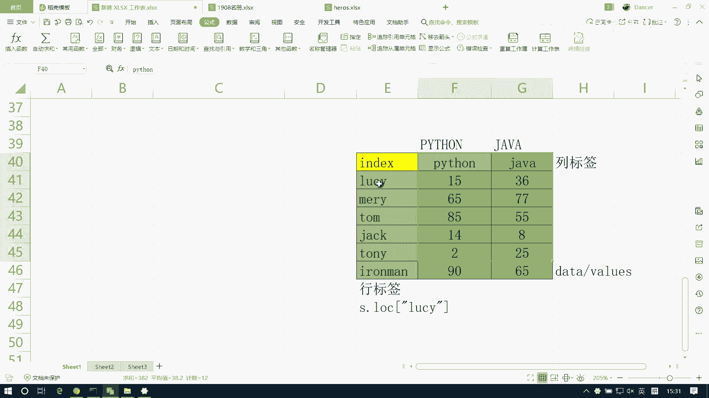
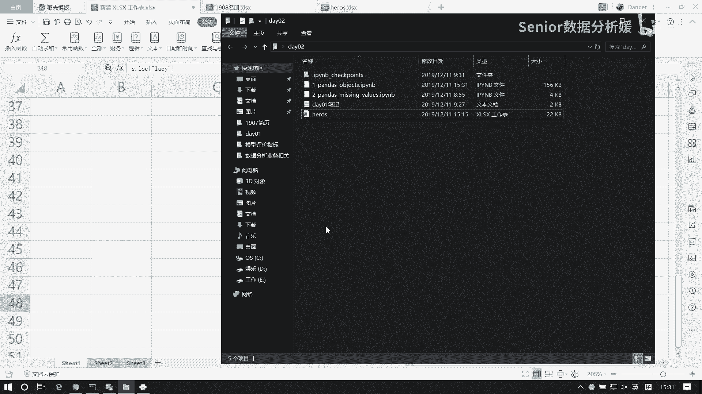
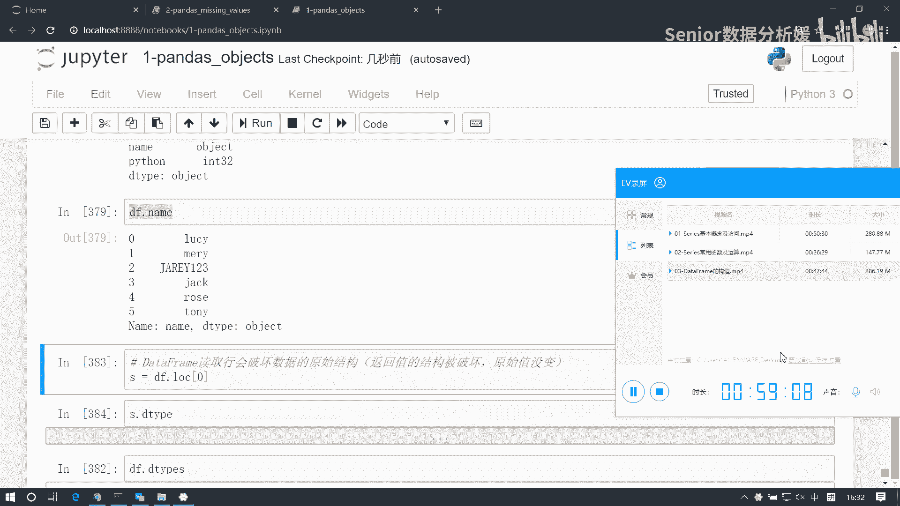

# 数据分析+金融量化+数据清洗，零基础数据分析金融量化从入门到实战课程，带你从金融基础知识到量化项目实战！【入门必备】 - P31：04 DataFrame访问 - Senior数据分析媛 - BV1Ak61YVEYX

接着往下看啊，我们看这个data frame的访问啊，data free的访问呢，它也像series一样，分好这个分显示访问和影视访问啊，但是呢它跟series又不一样。

不一样在于data frame它是二维表格，而series只是一维表格，所以呢我们要从行和列两个角度去看，他的访问啊，有什么不一样，那首先呢data frame呢，它我们就要先去理解它的结构啊。

它就是什么，它就是一个service的容器嘛，对吧，它是个series s容器，那我们就可以把这个data frame看成是什么呢，可以看成是，一个serious的字典，series的字典。

所以说那么它的它的这个键是什么，值是什么呢，这个键，就是列标签，那么值是什么呢，值就是每一列的值，啊这是我们从这个结构上去理解它，如果我们这样去理解它的话呢，这个data frame想访问列就很简单了。

字典是怎么访问元素的呀，通过键去读值对吧，通过键读值，所以说我们如果想访问一列，那这个一列数据不就是值吗，那我们就通过列标签就能拿到这一列数据了，对吧啊，这个DF，啊，我们换一个啊，我们拿哪个呢。

拿这个吧，啊对于这样一个对象来讲，我们想读取name这一列数据，像字典一样访问是吧，他如果是字典的话，那我们读键是不是就读到这个值了，我读这个name，我就拿到了这一列数据啊，嗯那同样的我想读这个呃。

Java，也可以读出来啊，这是这是访问列啊，那这个访问列的话呢，我们可以用字典这种方式访问啊，这种叫字典访问，也可以呢通过属性访问，它可以把每一列看成一个属性啊。

那这个属性访问直接可以用这个DF点name，啊然后呢那他也支持这个，就是这个多多层级的访问，就是多数据的访问，比如说我们可以在这里面用一个列表的方式啊，以列表作为建，作为索引啊，索引访问。

那我DF比如我想访问java，再来一个Python，我拿列表来访问啊，那别忘了给它写成列表的方式啊，这样的话我们也能得到数据啊，但这种数据返回的是个什么，是个data frame。

啊也就是说我们从列的角度来看的话，你就把它看成一个字典就行了啊，看字典就可以直接访问了啊，啊那除了这个普通的这种这个叫什么，这叫显示访问啊，那它也包括这个隐式访问，隐式访问呢就是用这个点。

i log是i lock，那如果你我们可以看一下，如果i log直接写个零，它访问的是不是列呢，Java name python，你发现这个东西是不是列啊，java name Python得到的是0。

41109，LUCY和三，是不是啊，比如说你如果用这个i log访问他访问的不是列，访问的是行，为什么是行呢，这个跟二维数组的逻辑是一样的，大家想象一下，你先如果对一个二维数组访问。

给我来个这个data啊，等于NP点啊，random点，Random int，然后0~100，然后size等于五行五列，那你说我这个D我直接读个零，读的是啥，是行还是列啊，是不是行啊，读的一定是行啊。

跟他的逻辑是一样的啊，如果你用IOG访问他是把什么，它把这个数据看成一个二维数组，所以说它ALOG直接访问的就是一行，而不是一列，那我想访问列的话，我这个二维数组是怎么访问的，冒号逗号零，这才是第一列。

对不对，记得吧，然后大部分同学都忘了，是不是啊，有人有人仰头看天了，还是咳，啊这是一组数据是吧，我们先访问一行data，直接零是吧，这二维数组想访问一列呢，data冒号冒号逗号零，这是第一列对吧。

20 852是这样的是吧，所以说他这个道理是一样的，如果你用隐式访问，那么其实就是影视访问的逻辑是这么干，这么想的，这个隐式访问是把data frame看成普通的二维数组。

啊所以访问逻辑与二维数组相同啊，所以那你要想访问列的话怎么办呢，所以得得像他一样啊，冒号逗号零啊，这才是第一列，是不是先访问这个呢，name呢那就是冒号逗号一冒到二，同样它也支持零一访问两列，是不是啊。

这样的啊，咳咳这是i lock啊，这是列访问，然后另外还有一个访问方式叫那个IX啊，IX那按X访问的话，这个是一个过过气的一个访问形式啊，那大家知道就行了，IX其实就是现在的i log。

只不过他是aloft的上一辈上上一辈啊，啊就是上一代产品啊，1。0版啊，2。0版是i lock啊，所以说这个i is i了解下就行了啊，不用不用管它，然后这是i lock，这是隐式访问。

那么我们这个访问数据的话，还有一种方式是使用什么使用这个lock啊，使用lock，但使用log访问列呢，访问列呢一般这个他是这么干的，这个稍微稍微复杂一些点lock啊，这个log是什么呢。

它得用显示索引来访问啊，显示东西访问，那么它访问的话呢先做一个切片，然后再访问这个，比如name是吧，这样得到的是name，跟那个i love是一样的，它也是什么，把它当成一个二维数组。

你第一维呢不动啊，第一位不动，然后呢从第二维开始处理啊，那这个log其实我们理解它的话，最好是以行的方向来访问，会比较好理解啊，为什么是行呢，就是说我可以先把这个log记，为什么呢。

它是行访问的一个标准方式啊，就是这个lock，log访问是访问行的标准形式啊，那么像我们上面这个办法是借助行访问，再去访问列这样一种途径啊，所以说我们行方明方向是全取，然后再取其中一列啊。

那我看行访问怎么访问的啊，为什么用lock这个lock咱们已经见过了，series里面是不是用lock呀，是不是serious用lock呀，我们来一个啊，我们读一个啊，比如说我们这个DF。

我们读这个name，这是不是个serious啊，是个series吧，我把这个读保存为name啊，这个name是一个sales对象，你看这个东西就这个展示的形形式就看出来了，对吧，name里边。

比如说我想访问汤姆怎么访问啊，name点lock，然后写上一个二，是不是加个二，我就把这个汤姆拿出来了啊，那这个log为什么是访问行呢，因为我们这个series啊，它是一个，哎我的那个数据呢选哪去了。

我这个data frame啊，他是不是个series容器啊，是不是series series里边，每一个series都是共用相同的行索引。

这个series这个行索引是不是就是我一个serious index，是不是index啊，那我访我这个service访问这个指数得用这个S点lock，然后写LUCY啊，是这么来的，对不对，我想访问。

比如你现在不看它啊，把它隐藏一下啊，现在这是不是个serious，这是个series啊，serious想访问这个15数据是S点lock lucy啊，同样的这东西如果你你扩展开的话。

我想访问访问这一行的话，是还是点LUCY啊，对不对啊，所以说它这个它其实这个log，他是为了跟那个series做统一的啊，所以说呢那我们data frame呢想访问行，其实就是想访问什么。

就是访问所有serious的行索引啊。

就这个索引啊拿到这一行啊，所以lock呢它是访问行的一个默认方法。

也就是说呢我们记住啊就这么一个特点，也就是说这个，访问行使用lock2访问列，使用中括号行是log中括号啊，那log里面写什么，log里面写row index，写行索引，然后列列表写什么。

写call index，写列索引啊，就这样一个原则啊，这样一个原则，那你你要把这个原则搞清楚了就好办了，这事啊嗯嗯那我看啊，现在我们这是访问，现在我想访问这个data frame的一行。

我想访问一这一行，那我就DF是不是得点lock1啊，这拿的是一行，如果想访问多行呢，我写个列表是可以啊，写一写二少个括号，是不是两行啊，那同样的他这边也可以用这个i love，I love。

是访问零是第一行啊，如果想访问多行呢，中括号零幺访问的是两行对吧，那同样的如果想访问列的话，我记住loft和ALLOFT都道理是一样的，点lock我第一维全取下来，是不是做切片全取下来。

然后第二维指定一个java java，访问的是java这一点，如果我想访问多个的话，我把这块做一个扩展，java再来一个Python加上是哪两列啊，这这有点绕啊，能不能分清啊，其实就是这个原则啊。

就这个原则，其他的东西都是我们service也好，还是南派也好，里边的逻辑啊，把这逻辑呢往这边再一套啊，就一样了，log访问行那个访问列啊，这是那我们如果想访问元素怎么办呢。

访问元这是这是行列的访问方式啊，如果访问元素记住一个原则，访问元素一定是先行后列，先行后列，这个原则跟谁跟，跟二维数组的逻辑是一样的对吧，二维数组也是先行后列，你访问一个元素啊。

那比如说我现在想访问我这个，我想把这个汤姆给他读出来，com读出来，那我是不是先行后列啊，行那你要想要访问行的话，是得用lock呀，这肯定是lock对吧啊，lock先写谁先写二对吧，这是汤姆的索引。

然后列呢是后边接个逗号，然后写个name啊，难道就是汤姆，那你反过来写是不行的啊，比如说你这样写，我写一个name，然后再写个二就直接报错了，对吧啊，这样是不行的啊，就是先行后列就没毛病啊。

那同样的你用隐式索引也是一样的，换到这个事，如果用隐式索引来访问的话，那我就得用点i log对吧，那么这是012，然后列方向呢零一对吧，得到了汤姆，啊然后是切片啊，切片的话呢也分两种情况啊。

一种是显示切片，一种是演示切片，显示切片的话，那就是用用标签来切标签，切片的话那就是闭区间，使用标签切片，闭区间啊，另外一种呢就是演示演示切片，用这个索引键，这是左闭右开区间，好那我演示一下啊。

对这个DF来讲，现在比如我想切出java和name这两列数据啊，先说行吧，我想从零切到二，这三行怎么切呢，显示切片我可以用这个DF点lock是吧，点lock，那么它的索引是什么，是012，对不对。

012的话，那它是一个闭区间是零，直接冒号到二就行了，012啊，如果是用隐式来切呢，DF点i lock从零那就得到三了吧是吧，因为它是什么，它是左闭右开啊，开捷键，那在这呢，行切片嗯，这是行切片。

切片的逻辑跟二维数组的逻辑是一样的，也是要先行后列，列切片DF点lock，那么你要有交代啊，先行后列这个逻辑，与二二维数组类似，先行后列行方向是不是全留下呀，我要做列切片啊，全留下。

那就是直接一个冒号逗号，然后呢列方向我想切name到Python，我给一个name，然后冒号Python，这样子到两列，同样的我用隐式的方式来切的话呢，i lock还是行先行后列行方向全留列方向从哪啊。

01~2到三是吧，或者直接写一个冒号就完了，写到最后是不是，还有就是我们用布尔值也可以访问，布尔列表啊，那我们先来一个啊，现在我们这个DF是额六行三列啊，比如我们现在想去访问其中的，几行吧。

那我比如想访问其中几行的话，那我这个布尔列表是不是得得是一个，得这长度为几的布尔列表啊，先访问其中几行，那是不是得是长度为六的呀，现在我们把一二和四，把这三这三行拿出来，那我可以直接用这个DF。

我想访问行，那是不是得点lock呀，是不是lock啊，然后把这个布尔list传进去啊，第一行第二行和第四行拿到了，那同样的，我现在如果想拿这个第一列和第三列，那我这个布尔列表我是不是写成三个呀。

第一个是true，然后第二个是false，第三个是true，那它我想访问访问列的话，还是要去先行后列啊，第一维全留下，第二维用布尔列表来处理，这样得到的是两列，那这边比如我们我们做一个处理啊。

假设我们现在想取Python成绩大于十分的，怎么这么惨啊，我要把Python大于十分的成绩取出来，怎么取呢，你是不是得先找到这个布尔列表啊，对不对，找到布尔列表怎么做，Python成绩大于大约十分的啊。

那你说得先拿Python这个这一这一列，来做一个比较啊，是啊DF点Python先把Python读出来，是不是这个series干嘛呢，我们做一个十分的比较，是不是得到一个布尔列表啊对吧。

然后再拿这个布尔列表去访问我们的行，是不是拿到了，嗯看明白了吧啊，这是我们的条件啊，然后再去塞点log啊，那还有没有别的办法用i lock行不行，ILODF点Python大于十。

Allocation based bulin indexing on a integer，Type is not available，这个不行啊，所以对不上，这玩意是有索引的，这样就行了对吧。

这样就可以了，为啥呢，因为你i love，他这个我这个DF我我点lock，它其实是要基于索引对齐的来来取值啊，你看我这个我这个这个东西啊，他算出来这个布尔列表啊，它不是普通的布尔列表。

它是一个service型的布尔列表，是不是它是个series，这里面有什么有索引在干扰你啊，那他跟我们那个普通的布尔列表它是不一样的，你直接点value就出来，这才是一个没有索引的波尔列表是吧。

他才会按照顺序来给你提取，而我们这个i log呢，它是它是没有索引的对吧，他不考虑索引，所以这个地方呢我得用values来读，才能才能读得到啊，啊这是一个小变化啊，那这块要主要强调什么呢。

强调就是你你这个servers的布尔列表，它会有索引对齐的问题，好可，所以你在用的时候要注意啊，比如这个是data frame，然后我们这个DF点Python，然后它大于十，这是一个series对吧。

那这里边他会拿什么，他会拿这个零零跟这个零的false做比较，如果这个值是true，我就把零这行返回，然后拿一跟这个一去做比较，如果它是true，我就把这一行返回是吧。

但是你i loft它是不考虑这个索引的啊，所以你要再拿索引给他的话，他就不认识了，所以我们把它读出来就行了啊，变成普通的列表，那这样他就按顺序往下取了啊，第一个值是false，不要，第二只是true。

不要第三个false不要，第四个是false，第五个，第六个要是吧，他是按顺序直接往下去啊，它不会存在那个索引对齐的问题嗯，好我们做一下这个练习啊，多种方法对这个data frame进行索引和切片啊。

这样啊我们先梳理一下啊，然后咱们再写这个data frame的访问有这么几种啊，先说这个啊，嗯先说显示访问，显示访问，那么三叉先分这个列访问，列访问，然后列访问怎么访问呢，直接用中括号访问。

然后里边放这个列标签，然后如果是多列访问，那就用列表，第二是行访问，行访问呢使用，点lock，然后里边写这个行索引index，如果是多行访问，那就是点lock，然后roll index list。

然后嗯还有这种列表访问，使用列表访问呢也分行和列啊，这个如果是列访问，啊这已经有列表了哈，使用布尔访问啊，布尔列表，这是访问列啊，应该加个点LCK，如果是访问行，也是点lag。

但是呢区别在于它前面不用记这个冒号啊，直接写这个布尔list就行了啊，这是显示访问啊，元素访问，元素访问呢必须要点log开始这个点lock，然后写上这个第一维的是这个肉index。

再写上call index啊，先写行标签，再写列标签来指定位置，知道吗，这显示，然后另外一个是这个隐式，列访问，那就是点i lock冒号逗号，然后这个，index啊，他要指定的就是就是索引了啊。

那那我叫call lock吧，就不叫index了，叫lock，然后这个行访问，但是点i lock我们直接写这个roll lock啊，如果是多多列或多行的话，那就是点i lock，第一维是冒号。

第二维是call lock list，就是多行访问，也是点i lock，那这边直接写call lock list啊，这应该是roll了哈，那他也可以用布尔啊，啊大家注意什么呢，注意。

注意这个布尔列表不能带索引啊，啊也就是应该用这个列表类型或者，nmpire array类型，啊然后他的这个列，列访问DF点i lock冒号逗号，然后这边写布尔list，好访问DF点i lock。

那DV直接写布尔list就行了，然后元素访问，点i lock，然后这是先写行后序列，roll lock和这个号lock，这是访问啊，然后切片，那切片的话呢，这边主要是行列方向的一个切片啊。

如果是这个行切片，啊他也分这个显示和隐示啊，这是，访问，这个它的行切片啊，我们再来看一下啊，比如我想切0~2啊，那我可以直接这个用lock，然后零冒号二是吧啊，那么另外呢还有一种方式啊。

就是如果你直接用中括号，零冒号二，那大家可能觉得这个这个东西，如果我直接用中括号，我可以切java到Python，是不是因为你你访问列的话，不是直接写一个java嘛，对不对，是不是这样的，这是访问列啊。

那么理所当然我可能想到那java我再加个name，我就能访问这个列切片了对吧，但事实上列切片我们不能这么干啊，列切片还得用lock的方式来处理啊，所以他这里面有个口诀记住了啊。

就是说这个切片啊里面有个特性，就是直接使用中括号，那么这个索引是列索引，然后切片是行切片，但是这种东西容易混淆，所以你不要这么记了啊，你别这么干了，就是说你直接用什么用log这种方式来处理。

这是最靠谱的，知道吧，就你做行切片的话，可以这么写啊，可以直接写，说我写个零，然后冒号一个二，你这样切是能切出来的，但这种途径呢跟这个道理是一样的，看到了吧啊啊，但这个是那个这个是隐式索引。

这个是显示索引的是吧，零二啊，就是说我们用这种方式来切啊，使用这种方式来切，用log的方式来切啊，不要用中括号切，中括号能切啊，但中括号切的是行不是列，所以好几遍我们用这个啊，用这个点lock。

然后这个roll lock1冒号roll lock，二啊，也可以用这个点lock，然后这个，啊也可以直接用中括号零，然后冒号，啊但这种呢不推荐啊，这是行切片，然后列切片。

列切片呢它必须是以二维数组的逻辑来处理啊，这块使用二维数组的切片逻辑，所以它应该是先行后列啊，那切列的话直接我们用点lock，第一维不动冒号，第二维从roll啊，Call lock1，冒号号。

Dock2，然后隐式访问，以行切片，那就是点i lock，肉一猫肉肉二啊，然后列呢，点i lock，然后第一维不动，第二维call1，冒号靠二，好了，这是它的几种逻辑啊。

其实显示跟演示呃逻辑逻辑上是一样的，只不过就是语法做一个变更啊，那你呢你要注意的就是什么呢，也是一般它是涉及到切片的话，隐式索引都是开区间，而显示索引都是闭区间啊，注意这个问题就行了啊，好了。

那我们这个把下面这个练习咱们做一下啊，加深下印象啊，把这个练习做一下啊，这样吧我还是给你写几个具体的需求吧，不然你就你就不知道干啥了，也就像这张表格吧，我看看啊，嗯第一个需求先说一下这个行切片的问题。

啊啊这个，查找呃，查找这个java程序，这个大于，大于0。0。5分的，所有信息，然后第二个你看啊，这个查找这个Python成绩大于平均值的，所有信息啊，第三个啊，然后查找这个捷克的java成绩啊。

这个加上0。5分，第四个，这个获取，获取这个name和咳，获取只包含，Name，和Python列的值表，好了就这几个需求吧，不加了啊，大家去实践一下啊，尽量用多的方法来搞定它啊。

把这这个语法咱们这个熟练一下啊，我只是在一起，我们不会自己解，我问你一辈子，第一个查找java成绩大于0。5分的，那我说不得拿java这一列去做一个比较啊，得到一个布尔列表是吧啊，那我们先去啊。

把这个java先读出来是吧，然后呢用它去做一个0。5的比较，这样会得到一个布尔列表，然后拿这个布尔列表干嘛呢，对我这个data frame做一个行访问，是不是好访问数得点lock呀，嗯中括号啊。

这样两两个值拿回来了是吧，那或者怎么样呢，或者你用i love数也能访问啊，I lock，但apple和这个值的话就不能用了，他得什么它得变成那个变成values啊，啊这样也可以拿到啊。

嗯然后第二个查找Python成绩，大于平均值的所有信息，那这个也是查行是吧，但是我们得算出Python的一个平均值，那我们还是先把这个Python这一列读出来，然后求出它的这个平均值。

然后再怎么样再用这个Python这一列数据，跟他做比较，然后呢再去做这个行访问，好这样就完事了啊，然后咳第三个啊，查找捷克的java成绩，给他加0。5，那这是个元素访问的问题对吧。

元素访问是不是得先行后列啊，找谁找这个捷克的java成绩，那么找的是谁，找的是这个嘛，对不对啊，那我应该找的是三，然后java对吧，嗯就是嗯DF点lock，先先行再列，拿到这个值。

然后怎么样给它加等个0。5是吧，加上下五啊，再等一下五好，这样我们这个值就出来了，咳0。59啊，还有一种方式啊，可能这个大家不太不太会用啊，就说我们可以这么干啊，我们现在讲的是杰克对吧。

那我可以根据这个name这一列啊，去跟杰克做一个比较，是他呀啊，然后跟这个比较之后，我们用它再去对我这个data frame做行访问，是不是能把杰克的整个成绩表拿出来对吧，然后对它我再去怎么样再去访问。

访问我这个java，java的话，就这个呀啊，然后呢再再对这个值做赋值，它直接赋值行不行，就等于个十，我试试啊，等于十还不太靠谱，但是能能改过来，哎没改过来哈，这块我看看啊，唉还是绕不过这个东西。

还是得得借助这个索引啊，lock冒号逗号java绕不过它不行，还得加上，啊这样也行啊，但是看嗯，虽然虽然虽然虽然说这个用它来处理不太好吧，但是大家注意这个逻辑知道吧，就是我可以通过它来去。

就通过一个字段去查找另一个字段内容对吧，就这样这样一是一个思路啊，然后下一个我们要获取只包含name和Python列的子列，那就是读取两列的信息呗，对吧，那我直接怎么样，就DF我去写一个列表。

一个name再来一个Python是不行了啊，那或者是什么呢，或者你可以用隐式索引DF点i lock1维全流，第二维从一到最后是不是啊，全切片切出来了，好看下一个啊，data frame的运算。

data frame的运算呢，它要跟那个两两边一块看，首先他跟就是跟一个数运算，一个数运算，然后第二呢是跟series运算，然后才是跟什么data frame运算，啊或者说这个是跟单派运算吧。

南派运算啊，我们先看第一种啊，第一种最简单的先给个data frame，我们先拿一个，啊data frame，然后这个date呢我们生成一个NP点，random点rn int0到十size。

等于三行三列，然后index我们给一个list a b c，然后columns我们给一个list啊，甲乙丙，啊这是我们的一个表啊，那么它如果跟一个数运算的话，这个很简单，直接就什么。

把这一个数广播成一个二维数组对吧，然后对应位置相加就完了啊，所以这是什么，这就是广播啊，广播机制，如果跟一个南派array来算，就这么一个date啊，N1等于NP点葛瑞，然后写个，222。

然后DF加上N1，这结果怎么来的呀，744，那是十134，这是563，是不是就可以给他直接加进去了，这是不是也是广播呀，啊就是广播啊，那广播你要注意，就是形状能不能广播成一样的对吧，如果形状不同。

那是没办法广播成一致的啊，那这没啥说的了，然后第二种就是什么呢，就是这个series跟他运算，series又有什么了，有索引了对吧，来一个serious啊，S1等于series。

然后date等于嗯NP点啊，不写PLL的，写这个111，然后index我们设置为list a abc啊，然后DF加上S1好看得到什么了啦啦啦啦，ABCE加乙呃，丙乙甲，然后这是ABC。

为什么会这样子呢啊如果把这个换一下，我把这个换成甲乙丙，这样可以运算了，是不是啊，或者你变一下丙乙甲乙丙甲都行啊，随便谁有啊，那如果我变成这个乙丙丁这种呢多了个丁啊，大家发现有什么规律吗。

就是首先呢因为series是一维的，data frame是二维的对吧，所以这里面会有一个问题，就是我这个series，它的索引到底应该是跟你的行索引对齐，还是跟你的列索引对齐啊。

那默认显然色是跟列还是跟行对齐，跟列对齐对吧，好第一个原则，第一个原则啊，这个呃sales默认，与data frame，列索引对其进行运算，那么第二个原则，如果这个列索引。

如果你对齐的索引上它不存在怎么办，比如这里面丁它是不存在的对吧，然后呢series是乙乙丙丁，而我们这个data frame是甲乙丙，那甲跟丁这是不不冲突的啊，不存在的，所以它会怎么样，会补空值。

对不对啊，就如果索引不对齐，则补空，空值，看到了吧，就这样一个特点啊，那我再加一个啊，比如这样，我们变成再加个1+1，然后这边加个甲，现在会怎么样呢，甲乙丙丁说这个他会保留啊对吧。

就是它它这里面什么它里面是不不是广播啊，这边不是广播，就是索引对齐，因为如果广播的话，那三行三列跟四行跟这个一行四列，它是没法广播到一块了，对吧啊，它所以它不是广播啊，它跟广播是不一样的。

如果广播这种结构，它是无法混混到一块的，它就是索引对齐，对不齐就怎么样，就补空值就完了，默认是呢以这个列方向来对齐的，好这是series时间啊，那如果这个呃我想以行方向对齐怎么办呢，可以用这个方式啊。

可以DF点ADD，然后这里边我们给定一个呃S1，我先把这个删了啊，这是默认的对吧，如果我这块改成零的话，现在就不行了，因为对不齐了对吧，这意味什么，我改成零的话，我是要拿啊，啊相当于什么。

相当于让这个series与我这个data frame的行标签做对，对齐啊，行索引对齐，所以这时候就对不齐了啊，因为他的行程也是ABC，而我这个series的索引是甲乙丙啊。

所以说这块我们应该把它变成这个AABC，那这这个时候我们沿着行方向就能加了，对吧啊，所以通过这种方式啊来改变我们这个轴向嗯，好，那另外一个最后一个就是什么。

data frame和data frame之间运算，这个很好理解了，data frame之间运算，那就是行列都要对齐，啊两个原则，这个第一个行列索引全对齐，那第二个原则，对不起，怎么办，补空值啊。

嗯试一下啊，我们再来个DF，呃这是DF1，43333，来个四行四列，然后这个in index，然后等于list啊，A abcd，然后columns，啊啊啊甲乙丙丁啊，嗯再让我去展示一下。

display一下DF和DF2好这两两组数据啊，那它两组数据的话，肯定是索引要对齐去相加对吧，那这样的话我这边不够，是不是得把冰上补上空值，然后D也要补上空值啊对吧，所以他俩一加的话。

肯定是D和D这两列就没了，是不是就变成空值了啊，DF1啊，DF加上DF2，是不是盯这一列成空值了，这一列成空值了，如果你想保留原始值怎么办呢，用DF点ADD df2啊。

那这里边我可以用这个fell value来填充我的控制，把它变成零，这样就把这个值就保留下来了，啊咳咳好，那么其他的对应方法呢，除了ADD，还有什么sub啊，M啊，div啊，是啊等等啊。

这些方法都在里面，好这个我们看一下这个这个案例啊，假设这是期中考试成绩，这个是期末考试成绩，自由创建，它俩相加，求期中期末的一个平均值呃，那我来个store，一来个死杠二啊。

store1等于data frame，我们先写一组索引啊，这个index等于假如几个人啊，拍啊这个LUCY汤姆，然后这是张三啊，张三李四去地下关注，进下方关注入，然后再来一个杰克啊，五个人。

然后compliments，columns呢，我们顺着几个学科就是语文，英语数学再来个加来个Python，啊少一个少吗，这行是列啊，这123455，这是五行，然后12345行四列是吧。

那我们这个date呢就等于NP点random点RINT，0~100，size等于五行四列，然后这个index就等于index，columns就等于columns啊，然后同样的方法我们就构造SC2。

好现在我把这两个东西做一个输出，好这样两组成绩啊，先干嘛呢，看到第一个，假设张三期中考试数学发现作弊要记为零分，如何实现啊，那么第一个是期中，第二期末啊，我们要对期中考试张三的数学记零分，怎么搞啊。

score一点是log呀，先写行行是谁，张三，然后列谁啊，数学，把它记为零分，直接等于零是吧，这样就完事了啊，死杠一分值就变了啊，那这种方式是访问是最健康的啊，其实你也可以怎么办呢。

我刚才没说这种方方式啊，就是一个data frame啊，你要你要只是想去读取里面的值，这个方法太多了啊，这个应该至少十几20种，比如我想现在想访问张三的数学成绩，我们就我就闭眼睛写了，写了好多种啊。

比如说我现在可以啊，咱没闭眼睛了啊，哈哈只是个比喻啊，比如说我可以先什么，我先拿到一列，是不是拿到一列可以吧，拿到这个数学是哪一列了，这是什么，是不是serious啊，我在访问什么，张三点lock。

是不是把这值拿出来了，或者我不用张三，我直接这样能拿到吧是吧，或者这边我用点rock，所以能拿到啊，太打脸了啊，这个不行啊，这个得是那个我得先访问行再访问列是吧，先我先去张三点lock，对不对。

然后再怎么样，我再点lock，然后数学，是不是啊啊或者这块我不用点lock都行对吧，然后你再去结合什么i i lock之类的，是不这个方法太多了对吧，但这种方式访问的都不靠谱，为什么呢，咱可以试一下啊。

比如说我现在想让张三这个成绩，现在它已经被我改为零了对吧，我现在想把它改成100分啊，看你看啊，死杠一，我们去访问啊，我先访问数学拿到一列对吧，这一列呢我再去拿这个，张三这是零，我给它等于100分运行。

那好使了呢，好使了怎办，啊这跟我那个创建方式有关，比如我拿那个开始的那个拿那个，比如额，哪个啊，比如拿这个为例啊，以这个为例，这是data frame对吧。

然后这里边比如说我访问这个name得到一列对吧，然后再拿里边的二，这是汤姆对吧，我为它赋值就等于呃，杰瑞，看会有什么问题啊，是不是会有一个警报啊，然后我看看有没有改过来啊，DF改是改过来了，但是有警报。

为什么会有警报呢，这个警报就是我们在操作这种数据的时候啊，这种叫什么，这叫间接访问，知道吧，就间接访问你总会发生这种问题，就是你你发现一旦赋值的时候，你如果你发现这种情况，那就是什么。

就是你的间接访问引起的，但这个问题如果我改一下，比如我给他变成这个我正儿八经的访问点log，那应该是先去二，然后再去name对吧，然后把它等于，你看这样就没问题对吧，这样就很安全，是不是啊。

所以说我们一定要用这种方式来访问啊，这叫直接访问，直接访问是没有风险的，但是我们间接访问它是会存在这个风险的啊，也就顺便提一嘴啊，然后另外还有个地方大家要注意啊，就这块也没提，就是比如我们知道啊。

那你我这个我这个data frame，它是可以访问行的对吧，那我们我们观察我们说data frame是容器，是series的容器，这个series我们是一列一列放的，对不对，这一列是一个容器。

那如果我读出一行的话，这一行你要是观察的话，它也是一个series，给我去点lock lucy，我把这个score1，他说是哪个series啊，是不是serious啊，但是你要注意啊。

这个series会有什么问题呢，你你这个横着读数据，横着读数据呢，会导致我这个数据类型被破坏啊，啥意思呢，我把那个DF拿过来啊，这是我们data frame，那我们知道这个data frame。

每一列数据类型是不一样啊，有float，有object，有int32啊，比如我读取其中一列，读取这个java它的类型是什么，是float没变呀，我读取这个name是不是object，是不是没变啊。

这都是serious啊对吧，这读取列，但是如果我一旦读取行，我先读取这个第零行，然后点lock0，你会发现啊这个数据类型变成什么了，变成了object了，是不是啊，那么本来它是浮点，它是整数。

只有它是对象，你一旦这么读的话，你读出来的这个series，读出来这个server它为了保证类型统一，所以这个数据啊，它会强制把这个数据类型进行统一的一个处理，所以就按照优先级的高低。

那肯定是对象类型高于整啊，高质高于浮点，再高于整数对吧，所以你横着读呢，读出来的这个series，你要注意它跟我原始的数据类型是不一样的啊，这取决于你整个这这一行当中，谁的优先级最高啊。

这也是一个需要注意的地方啊，这我们我们加上啊，就是读取行啊，会破坏数据的原始结构啊，但这个结构呢，它它仅限于说我这个返回值是返回值啊，返回值的结构被破坏了，而原始值是没变的啊。

啊就是你这个不论你怎么读我这个data frame，它他的detad taps还是这样的，只是谁啊，只是你你得到了这个series s对象，它的类型是有问题的是吧，他是object啊。

