# 数据分析+金融量化+数据清洗，零基础数据分析金融量化从入门到实战课程，带你从金融基础知识到量化项目实战！【入门必备】 - P34：02 DataFrame多层级索引 - Senior数据分析媛 - BV1Ak61YVEYX

好大家把这个飞球上起来了是吧。

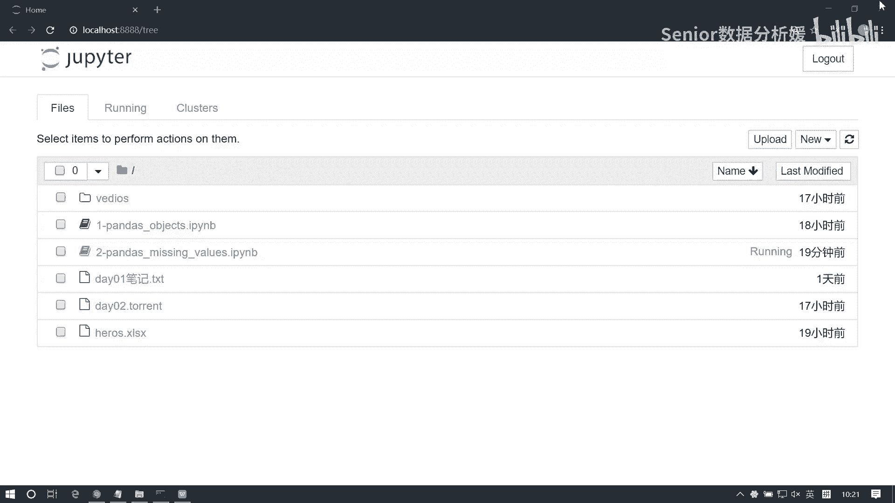

我把今天的今天用的东西给大家发一下啊。

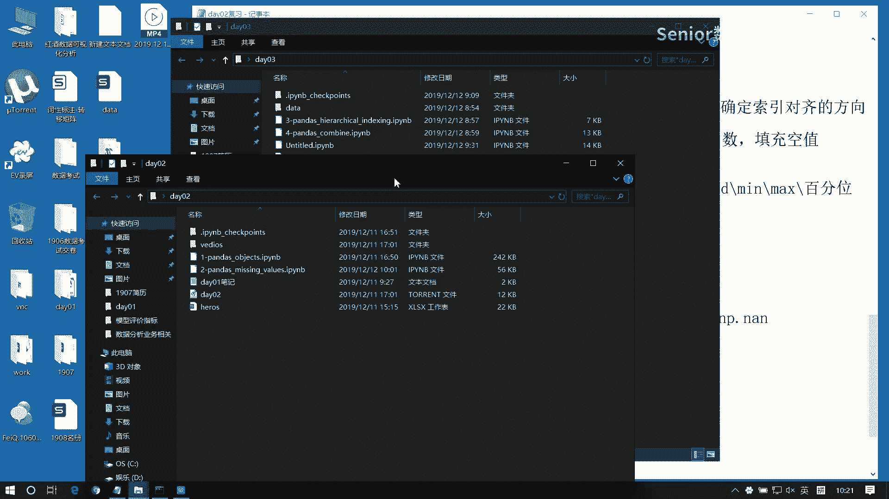

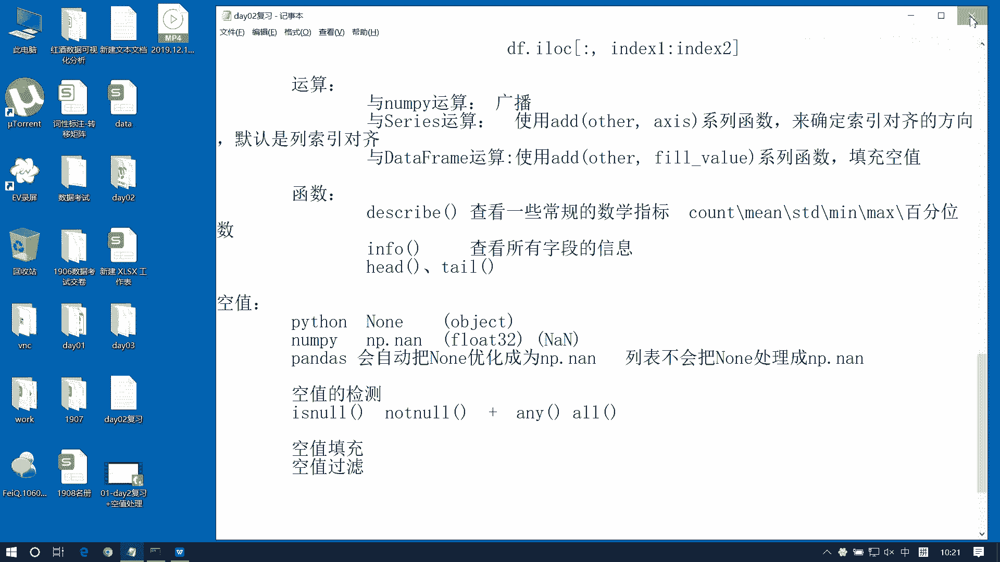

35个人啊。

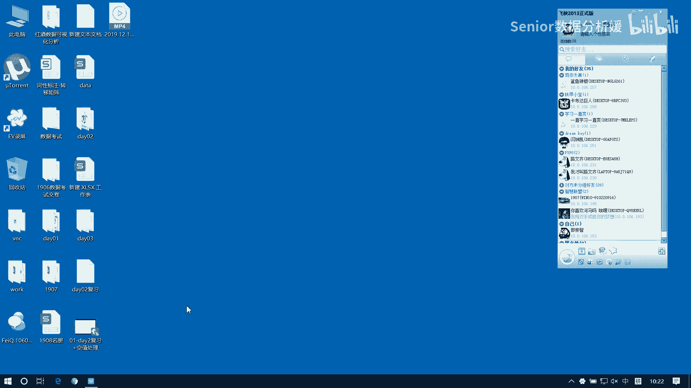

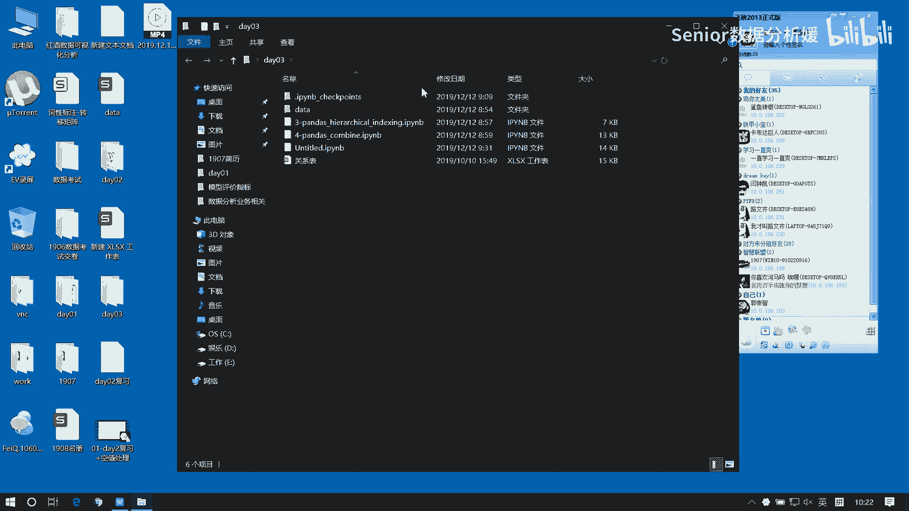

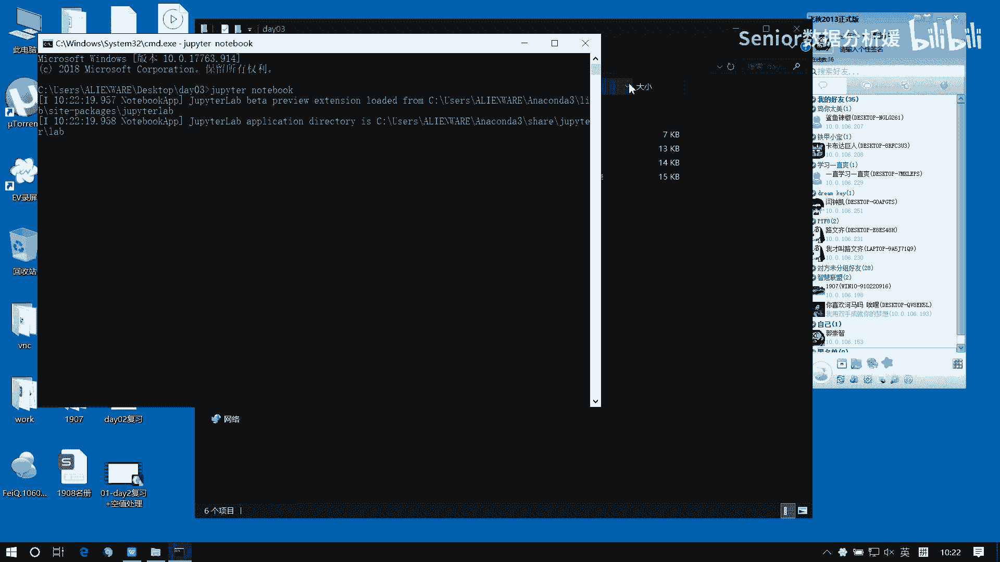

好今天我们这个主要学两个东西啊，一个是我们这个就是多层级索引，它的一个处理办法啊，然后另外呢就是我们这个很重要的一个地方啊，就是我们pandas的数据汇总，那这个数据汇总呢我们主要讲两个。

一个是集连操作，一个是合并操作，这个东西是非常常用的啊，然后我们这个学完今天的内容呢，我们就能够初步去做一些数据分析的工作了啊，也就是说你其实你只要学了三天的东西，我们将来在工作当中啊。

你就能够去解决日常的这个工作，工作这种数据分析的内容了啊，那如果你解决不了，那一个是思路不够啊，再一个就是这个代码不熟啊，如果想解决这两个问题呢，啊就一个一个一个路径啊。

就是把我给你讲过的这些代码拼命的敲，拼命的敲啊，敲到海阔时代哈哈你就能解决了啊，就是有有同学经常会说，我要说我没有思路啊，你一听我你一讲我就有思路了，我就明白了，那你不讲的话，我就解决不了啊。

那原因在哪呢，原因在于就是没有熟啊，因为你只有熟才能熟练运用是吧，如果你不熟的话，是没有办法熟练运用的啊，好了那我们先说个简单的啊，第一个是我们这个多层索引啊，多层索引呢它也很常见啊。

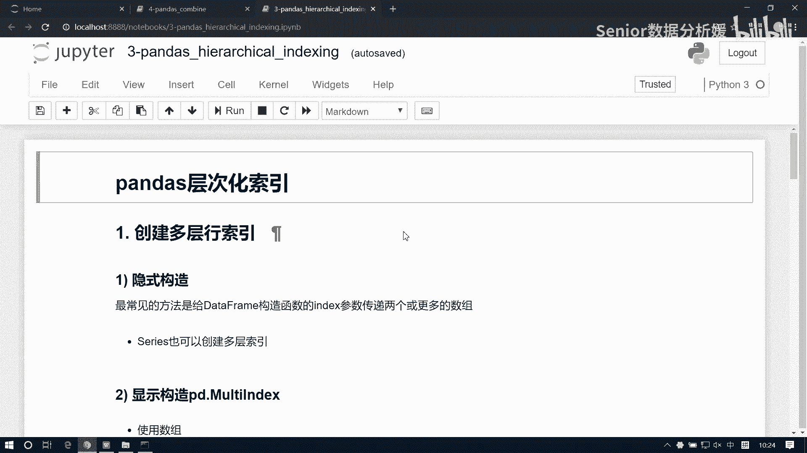

什么是多层索引，这个大家这个大家应该都有都有见过啊。

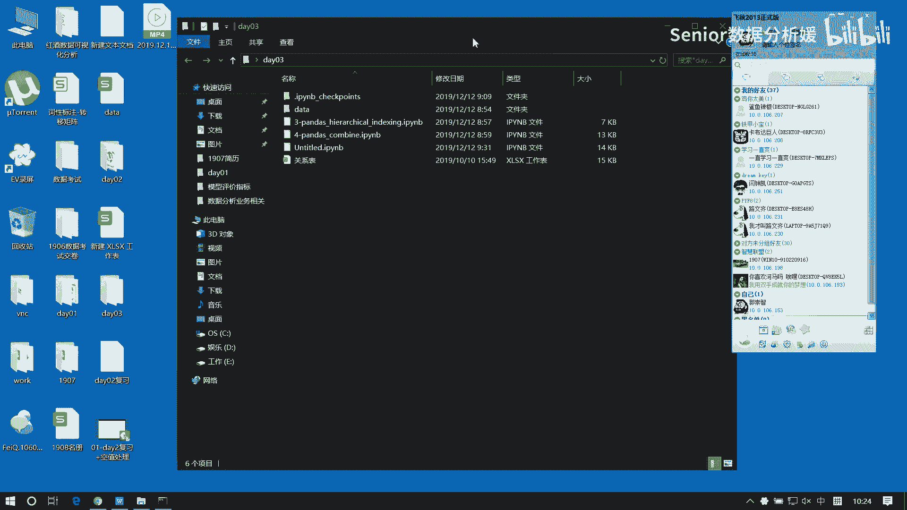

比如说我们去，经常我们在在这个处理一些业务表的时候呢，它会有有这样的一些问题啊。

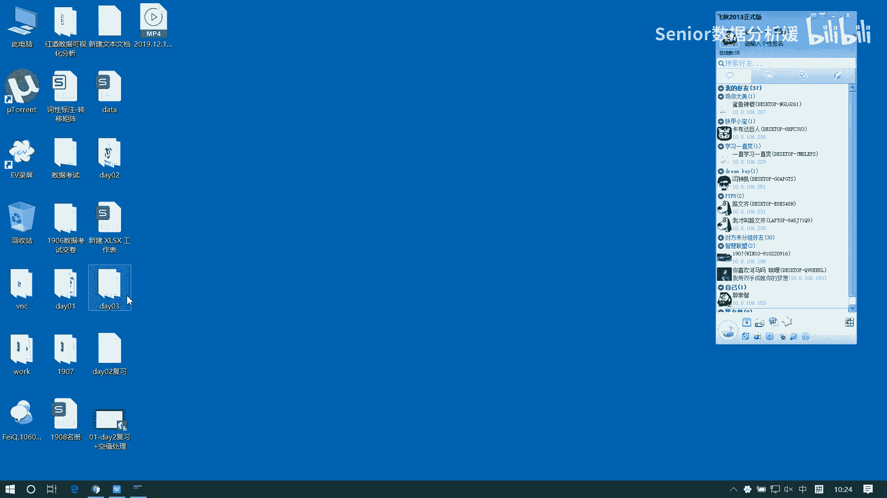

我们去创建一张excel啊，这种叫data吧。

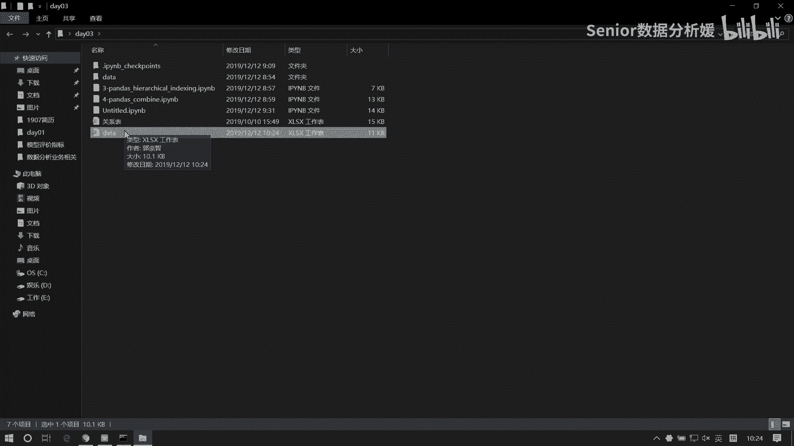

比如我们想统计一个公司的这个，一个产品的销量表啊，一个销量表，那一般来讲我们可能会这么干啊，比如说我们列呢，我们去来表示它是产品啊，比如产品，比如这是这个，比如说统计这个油吧。

啊这个比如说我们是卖卖油的啊，卖汽油的，那么他有这个额97号是吧，然后这个92号还有这个90号，还有0号对吧，九十七九十二，90和零，现在还有98是吧，然后呢列方向呢，可能是我们统计的是这样的一种表啊。

比如说我的这个销量，销量，然后这个单价，然后这个费用，然后利润，啊那我们在统计这表的时候呢，可能它又分成分成两部分啊，比如说是这个上半年和下半年啊，我们分成两部分统计，那这呢是，上半年好。

然后同样的道理，这个这个标签呢我们就来一份，这是下半年，那这样的话，那我们就构成了一个多层级的索引，啊你像这个里边呃，比如说利润这一块，那利润这块是能算出来的是吧，这是能算出来的啊。

其实应该还有什么成本之类的东西啊，然后那它如果你这个像一般我们做表的话啊，就如果有一些是公式的公式列或者公式行的话，我们都可以给它加一个，反正我的习惯是给它加一个就是颜色啊，就是额外的颜色。

我一般会喜欢这种这个暗黄色啊，因为它不太刺眼啊，那比如说我这个销量啊，它是我们来一个run北between啊，等于run，乱的北寸，我们从哦1000到1万，啊1000到1万啊，然后把这个我们复制一下。

然后选择粘贴一下，复制选择粘贴啊，然后单价的话呢，比如说没有什么太大变化，现在这个97号有多少钱，五多多少钱，我我也不知道多少钱啊，反正65L65啊，60L60L除以这个除以470多少钱。

从来没算过这个东西，0。127，嗯就就胡乱写一个吧，就他是九块吧，它是六块，这个是五块，这个是三块啊，然后呢这个单价稍微有点浮动啊，对他是9。1，然后这个是呃这个6。7，然后这个是5。2啊。

然后这个是3。2是吧，那把它呢我也变成这个小数吧，啊申请不了算了，然后这个费用费用的话，我们先先大概算一下啊，这个它乘以它的是多少，2万4嗯嗯，我们就在这个1万到1万，到2万这个区间吧。

啊反正这个肯定不太合逻辑哈，这费用太少了，这都赚发了哈，像这种都赚发了是吧啊，然后这边也来一个复制粘贴啊，那这样利润的话，我就等于什么，等于我这个销量乘以单价，再减去一个费用是吧，把它拉下来啊。

然后这边也是它等于销量乘以单价，然后减去费用啊，然后中国石油要是这么干的话，估计老板都得枪决是吧，以前我在在那个我在游公司也上过班啊，这家公司当时也是做那个，就是当时做的属于预算啊，还不是纯数据岗啊。

就是预算的预算岗的话也是他每每每周都会去，就每天我都要去那个跟业务那边去对接，一个就是所有分公司的一个销量啊，然后它销量就大概就这么一个表啊，但是统计的会比较麻烦啊，因为它他他我那当时做的表是你要去做。

就是每一个月都要做一次，每个月做要做一个汇总，所以我下边有一共是12个C的啊，12C的，然后这只是一个销量表，然后除了销量表之外，还有一些费用表，比如说费用还有还有一些明细，然后销量也会有一些明细。

然后还有各个公司的明细啊，所以这个表一拆的话，当当时就是每每个月要维护，那么三四张表吧，我但时间太久了，已经是78年前的事了，然后那个就是每个月会怎么样呢，就每周我会做两张大大总表去交。

到那个就是我们那个公司的那个老大，那也就业务部门老大手里啊，然后当时教那个业务表也特别有意思，当时当时那会儿还那会儿还不是纯无纸化办公，那会儿的是有纸化办公，然后呢那会儿你还得去搞搞清楚。

就是我这个表他怎么去打印啊，就刚开始弄的时候，就我不太不太会用那个打印机啊，所以那会儿那办公室那个纸啊，接到我们领导说这纸怎么用这么废呢，啊，其实每天晚上我就我就我自己在那打，打那个表啊。

每天都打这么厚一摞子啊，格式都不对啊，有时打有时候那个或者有时候数据错了，然后换一换重打一次，然后有时候格式不对，然后重打一次，然后反正就是翻来覆去的，然后后来我就学尖了，后来又怎么的呢。

后来我就是一张表，我就是翻来覆去的一张纸，我先正反面先打对，打完之后然后再说啊，完了后来业务慢慢熟了以后，然后就就不怎么废纸了啊，要不然特别费纸啊，啊可能这句话咱们同学也经常听到是吧。

你的母亲经常会说说，哎怎么最近这么废纸啊，哈哈啊哎。

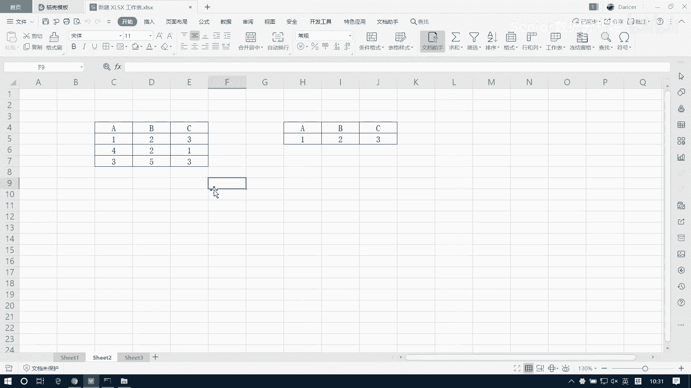

呀哎呀呀呀呀哎呀就尴尬了。

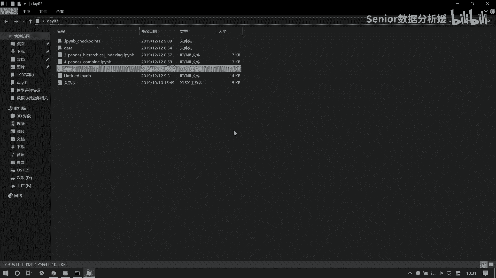

哎呀还好还在啊，我们其实我们的我们到公司以后，你肯定也你也可能会处理这种表啊，比如你要是纯做数据的话，那么你你肯定手里也会有很多这种表啊，可能当然还有一个技术，就是你可能还要去维护好多数据库啊。

但可能不是维护，就是你得去读各种什么select select查询，就是各种高级查询分组查询之类的啊，然后呢另外呢你可能还要去做就是一些表啊，做一些做一些这个表，那你手里应该有那么几张表啊，这样的话。

你你日常的工作就大概就是这些内容啊，你像我们现在很多同学写简历啊，有个什么毛病，写简历呱呱写了四个项目啊，然后那四个项目写的说用户什么模型分析和，用户什么这个啊画像去这个处理。

然后呢又什么风什么风控系统的模型，什么这个创建啊，这些东西你看你看到这这种东西啊，它没有什么立足点，就是什么叫立足点呢，就是你我们做数据的话，你最最主要是要撑起你的工作量是什么。

就是你你的你每天到底在干啥，你不能说我就建几个模型，那建模型的话可能你要快的话，三五天就建完了，那你比如你写个3年工作经验，你爸爸写了四个项目，我就往多了，说你一个项目俩月啊，一个建模你写俩月。

那你四个项目也不过就8月，你这3年剩，那那20多个月你干嘛呢，你在那看看片呢吗，是吧嗯，所以说只要你数据分析部门，大家不要觉得他就是在建模，我们现在很多人搞不清楚一件事情就是啥，就数据分析和数据挖掘。

什么叫数据分析，什么叫数据挖掘啊，不是这个挖掘是挖掘，其实数据分析它主要强调的是什么，是这个业务表的分析，我们现在学的就是业务表的分析，知道吧，我们现在我们现在学的是什么，学的是这种方法啊，学是方法。

当然了，你需要将将来的话，其实我们在工作以后，你你才能真正的去碰到数据是吧，我们现在的数据都是假数据，但是我们得先有方法，你才能去知道这些东西怎么搞，那另外一个就是挖掘发掘它偏向于什么呢。

它偏向是算法的，算法和这个建模，它是偏向侧重于这种东西的啊，所以我们很多同学其实一直到学完，可能都搞不清楚这个事，但这个事其实我一直在强调啊，一直在强调就是你到底我们做的是什么。

其实我们大部分同学做的都是数据分析的业务，甚至有些同学我是外部的外部工作找进去的，然后结果你在公司里面其实也没写什么网站，天天就干这个了啊，觉得很，所以很奇怪啊，有的同学就说回来之后说这个。

我发现我这我干干这活，不像是外部外部开发，感觉我就是在做数据，他天天什么追踪，各种什么日志啊，做分析，然后就或者说解析什么文件啊，天天就干这种活，我说那你干这种活的话。

你这个你其实你用data frame去处理的话，其实很很方便的，但是但是他当时学的也不行，他说因为我当时想走的是web，所以现在发现，原来我的工作是数据分析的工作是吧。

我拿着那个data data frame，他拿过来之后，那个那个数据，我拿着data frame88给他给他一弄，他说他感觉他恍然大悟，他说这个原来我现在干的活是收集分析的活，不是外部开发活是吧。

所以说就是这个这个工作任务啊，这工为什么，我说让大家一定要跟前两周跟着我学，因为你你到工作岗位的话，就像这种这种业务，还有包括你比如我们互联网上的一些数据，那肯定是要你去解决的，因为java也好。

H5也好，还是前端，还是那个移动端的开发人员也好，根本他们根本干不了这个啊，你就大数据的人来来，他也搞不了这个，他不会是吧，他们只能说玩玩那种什么数据怎怎么存呢，或者前端比如搞数据怎么展示啊。

移动端我只是说怎么去玩架构，怎么去搞这些东西对吧，那其实对于Python程序员来讲，他在企业当中的作用，就是你的什么爬虫的需求啊，数据处理的需求啊，那肯定都是压在你头上对吧。

所以说这种东西它可以认为是你的一个，就是一个硬技能啊，就是一个硬指标，你不会的话，将来就是瘸腿对吧，你光会一个Y不行，你光会一个JO，光会一个flash的，那你你有什么很强的竞争力嘛。

其实没有什么强的竞争力，因为实际上你做做Python开发的人，Python开发的人，他就是解决企业这种，就是这种Python的这种纯Python的需求，你但是Python需求跟网站需求又不太一样。

他有交集，但是他不全不是全部对吧，所以说我们比如说我们现在拿一个jungle，比如你jungle学的特别溜，我项目写的也特别好，然后我特别有灵气，我觉得我学的超级棒啊，全班全是垃圾。

在座的各位都是垃圾啊，哈就我一个人是这个超级牛的啊，但是呢你跟java程序员比的话，你还是有弱势的，因为首先企业的选型，企业企业它选型这就是一个很大一关，现在大多数企业你别看Python现在火。

但是大多数企业它你做你做这个web开发的话，它还是java是主流，他不可能说Python是主流对吧，所以你还毕竟没有过渡到那个时候的，那Python为什么火，Python火的话，就是因为他能干这个。

他也能干那个，他也能干那个对吧，所以说你呀你在里边的地位就是我能帮你解决，就是这种边边角角的这种奇奇怪怪的事，我都能帮你干对吧，这才是你的核心竞争力，当然了，你要是哪个地方能干的特别好的话。

那那也行是吧啊，但是呢你不要说因为故此就失彼了是吧，Python这么多这么多东西要学对吧，你不能说我只学一块啊，那你要你要说我就是想干这个web开发的话，那你为啥不学java呢对吧。

那或者你学PHP也行嘛对吧，你要说我这样搞前端的话，那你这样不就学H50吗，对不对啊，那你学这东西还是说为了什么，为了我们有一个更广的一个就是一个知识，知识面嘛，一个知识体系嘛。

你哪个地方你都了解了是吧，你都你都那个能上手是吧，咱们还有个还有个问题啊，就是我们现在同学有什么问题呢，就是这个就是你那个一出去以后啊，你会觉得我感觉我哪个地方好像玩的都不溜，玩都不转。

我就我就实话跟你说，我你资格啊，你资格从10年开始干这行，干这个行业啊，那其实你要说开发经验，培训经验其实也都算是挺挺富余的了啊，都是算挺充分的了啊，那其实我对这个行业的理解啊。

应该是比你们还是能客观一些的，你学一门技术，其实学深他当然是更好的一个选择，但是学深不是说靠你那一年两年能学深的，你甚至做到3年可能都不审，都没有达到那个所谓的深的那个度啊，你做到3年跟你做一年。

其实你出去要工资还是看什么呢，还是看你这个人有没有张力，什么叫有张力啊，我们土话讲就能不能吹牛逼，在北在中国的互联网啊，中中国的互联网，中国的互联网，它不是说纯靠技术混圈混这个圈子的。

中国的互联网是靠你的业务，靠你的思维，靠你的对张力的啊，是靠张力的啊，其实你看比如我血淋淋的例子，就是跟我同龄的人，可以算是就是我的，我当年同学跟我算是同同一时代入行的，这算是老程序员了吧对吧。

你就满你就是你就是怎么算，他也是78年的程序员了，这种程序员呢，你觉得他应该拿多少钱呢，年薪50啊，那那没有那没有那么高啊，没那么高啊，就你正儿八经你干个10年成全他，你拿能拿到年薪50的也也拿不到啊。

也没那么夸张啊，能拿50的，他肯定不是纯靠技术的啊，那他肯定是有点别的别的问题的，比如说管理啊，或者说他有有过一些这个带，就是带过团队，然后可能创过，创造过一些什么什么企业的一些价值，这种才能真正拿钱。

你要光靠打工，说我能解决这个技术难题，或能解决那个技术难题，我能去开发个网站，这东西能替代你的人太多了，你就是咱都不用不用找大牛，就就你就现在市面上找那种两三年的程序员，基本上我们所有公司的网。

就是这种什么网站的开发呀，或者一般的数据建模啊处理呀，你给他个3万2万的工资，他都能给你干得了对吧，所以他没有必要说一年我要拿个50万去花，这种人能拿50万的，一定是他给公司创造了至少500万的价值。

才能拿50万，所以他他其实并不是说，因为你你的技术玩的多么透彻，然后你赚钱就多了啊，他是什么呢，它其实还是你要去看你能做到什么事情啊，那比如说这个比如说你就说一个销售。

你说一个销售他能做能他能起起到什么价值呢，它外部就是联系一些客户嘛对吧，但是如果你比如说我我做了一些变通，我能给公司节省很多成本，比如说我们我们可以通过这种套路去进行销售。

然后呢我发现我的这个月销量上来了，然后呢我成本也下来了，那这个区间很大，那这个东西是你带来的，那你就能拿赚钱，而不是说因为你是一个销售，你的有很多技巧，那你你如果是走前人的老路的话。

其实能替代你的人很多啊，你能给公司拿20万，你虽然干了10年，但我也能给公司赚20万，我就干了两年对吧，所以那这样的话，其实对于一个企业来讲，你的价值是一样的，他不会说。

因为你干了几年就觉得应该多给你拿钱，这肯定不是啊，你像我我我也经常给那个别人面试，有好多那种，一看那种就是就是那个很程序员的那种人，知道吧，就光头来了啊，光头来拖家带口就来了啊来了，然后那一聊还挺好的。

感觉干了好多年了，都十几年了啊，说你要多少钱，我要1万5啊，感觉有时候有时候感觉他要这价，自己都觉得揪心，你感觉自己都对不起这个社会，然后怎么拿那么多钱比他多那么多啊，就是就是为什么呢。

因为他他没有他没有那种，就是说我能够给企业创收的那种本事啊，他就是按部就班的去干一些活，所以说所以你就会看到，其实在中国互联网这个圈子里边，你真的想赚钱，说你说我想拿到一个高工资是吧。

或者说我想拿更多的更多的钱去去，这个让我的生活品质更好一点的话，他不是说只能靠技术的啊，那我说这么多什么意思呢，就是说我们不要觉得说我学的东西杂啊，然后我感觉我学的东西好像都不如别人，你现在什么都不学。

就学四个月，比如说你就学四个月JO啊，你就学四个月降工，那么你觉得你学了四个月的浆工，或者学五个月降工，跟人家学一个月的浆狗，你觉得你能强到哪去呢，啊其实你强不到哪去，所以说你拼深度。

它是永远是低效的一种回报方式，拼广度才是最有效的，最快捷的一个实现财富自由的路径，明白吧啊所以你看你看你智哥这个人啊，实际上也也没有财富自由啊，但是呢我就认清一个理，哈哈啊，我认清一个什么理呢。

在北京这个互联网行业啊，一定是追着风口跑，你看我就我这么多年我干的行业也特别多了啊，不是行业多，就是我学的语言就特别多了，现在基本上这个计算机的语言，我基本上都用过啊。

然后基本上就是我们就是基本上都有所涉猎吧，你看从最早期的那个嵌入式，然后后来的这个移动互联网，然后到后来的这个H5，到后来的VR，到后来的那个那个区块链，然后又到后来的那个数据分析，人工智能是吧。

那你知道我这么几年我我都经历了什么呢是吧，我经历的就是在不不断在转型啊，不是在转型，一直在转型的路上啊，所以说但是你你会发现其实你干了这么，你你干了这么多以后，然后你发现一直扎在那个地方的那个人。

他拿的钱永远没有你多啊，他永远是拿那个那个工资，就我最早跟我一块入行的那哥们儿啊，最早的时候有一哥们，他干C加加的啊，那应该大神了吧对吧，搞C加加的呀，搞了十来年，C加加那什么人啊对吧。

他这两年还是稍微高一点了，但是就是前些年啊，就两三年以前他的工资还是1万多块钱呢啊，非常少啊，为什么，因为C加加这种这种，虽然我们都知道C搞C加加是大牛，但是你C加加的话，你对于企业来讲的话。

你到底能创造什么价值呢，我想搞个网站，你用C加加搞吗，不会吧，我想写个爬虫，我用C加加写吗，不会吧对吧，我我我几千块钱的爬虫工程师，我市面上随便抓对吧，我为什么要你拿C加加呢，而C加加搞得又慢，对不对。

或者说比如说我想做个架构的话，那我要用C加加吗，不用啊，我每我每每个东西都有原生的，比如我安卓或IOS，它都有原生的开发语言啊对吧，我原原生语言干不好吗，我为什么要非要用C加加呢。

所以他虽然说我们都知道C加加难学，我们都也都知道，C加加是个他比较牛的技术是吧，他什么都能实现，但是他没有那种市场啊，它没有市场，市场很小很小众啊，当然了，真正高端的C加加，那一定是挣得非常多的。

但你就算是真正高端的C加加，他也不能说只是因为他会C加加，他一定是玩的什么算法之类的这种东西，他才挣得多啊，或者他是他能够给公司解决一些核心的，一些一些方案啊，那他才能拿到这么多。

但大多数人他是拿不到这么多钱的啊，所以说我们也是一个道理，我们应该什么应该是拼广度啊，你不要觉得说我比别人少学一个月，或者比别人少学俩月，我就不行啊，别人就行，没有那个道理啊。

其实他多学仨月跟你状态差不多的啊，其实没啥行不行的啊，行不行，在于你的一念之间，你觉得你说你行你就行啊，不行也行，哈哈对，关键是你得你关键是你得觉得自己行，你要觉得自己不行，那你就真的不行对吧。

比如你比如你面对你的女神的时候，你觉得我我靠不行，这女神太美了，我配不上她，那你就别追了呗，对吧，那不是一个道理对吧，我不甘心，那我不追，我凭啥不追啊对吧，万一追上了呢，是不是啊。

所以说其实是很多事情是一念一念之间的事，对不对，一念之间的事啊，咳咳好了，那我们还是来处理咱的业务表啊，像这种表咱能不能处理呢，太难处理了，它很简单啊，就是一个二维，这种是这种叫多层级啊，这叫多层级。

多层级呢除了这种情况，还有这个列方向的多层级啊，列方向多升级，那跟他道理是一样的，比如说我这块我会写一个1月份，2月份，3月份，或者说我呃1117年18年一九年啊，我觉得我这样分啊也可以啊。

那我们就先以这个列列多级来来说啊，因为列多级是最常见的啊，那他们处理逻辑其实是一样的，首先对于这种表来讲的话呢，咳咳我先把他这个啊这个费用我得复制一下，然后粘贴数值，这个费用复制一下，然后粘贴数值好。

这都是亏钱的啊，啊都是亏钱，我没要亏啊啊但是你跟你说，就就像这种石油公司啊，他他说他亏钱，那只是少挣了咱老百姓钱了，他怎么可能亏钱啊，那那东西是搁地里挖出来的，他怎么能亏钱对吧。

他的成本就是一个开发成本而已啊，剩下的钱啊，那东西都是捡捡的来的，天下人捡黄金是吧，你还你还能觉得有有什么成本呢对吧，所以像这种国有企业的吧，国有企业的话不会亏钱的啊，他所谓的亏钱啊，就是挣的少了哈。

啊，然后那个我们先把这个多层，那个索引先读一下啊，读进来我先看看它的形式啊，南派as np，然后import pandas as pd from pandas。

import series和data frame，啊应该是excel，好那这边我们要注意一个问题啊，它是个多层级的对吧，多层级的话，我们这里边是不是第一，第一行和第二行都得作为我们的列标签啊对吧。

所以这个地方呢，我们需要把这个header做一个设置啊，header数来设定哪一行作为列标签啊，那么它默认值是零，是不是我们现在可以写成零和一，也就是说我们要拿两行作为我们的列标签。

这样一读呢就是一个多层级的表了啊，我把这个东西呢先保存一个DF，我们先看啊，这个多层级的表它的索引是什么样子的，那我们可以把这个columns给它读出来是吧，点columns读出来这个属性。

他说什么是个multi index对吧，就是这样一个类型，就这样一个类型，所以说如果我们想构造这种多层级索引的话呢，那我们也要通过这种方式来进行构造啊，那如果是用它来构造的话呢。

我们有几种方式来表达这个多层级，比如说我们现在对于这个这个层级来讲啊，我们写个简单一点吧，这个全汉字不好不好输出啊，我们比如说这个是嗯给他做个合并居中，合并居中，这个是B，或者这个是呃first吧。

first这是second，然后呢，这里边是，Python java，然后C然后这个是Python java c啊，这是两次考试，比如说这样，对于这样的一个多层级索引，我们怎么来构造它呢。

它有这么两种表达方式啊，一种是什么呢，一种是我们可以这样去写啊，第一种我们用这个数组的方式写，array等于一个中括号，那么这个，呃上边这是我是先把它展开啊，那其实比如这个上面这个second。

它因为有合并单元格的，所以这个second其实是被被他们仨共用的，对吧是吧，所以一样啊，那我这边也是共用的，所以可以写成这个样子，它呢我们一拆的话，对吧就是这样一个东西啊，因为first是被他共用的。

这个second是被他们共用的，如果是用数用数组来表达的话呢，这是一个两行六列的数组对吧，那我就可以这样写啊，两行六列，第一个第一行，第二行，那么里边每一列是第一个是first，然后first。

First，再来个second，Second，然后第二行是什么，是这个java Python c，然后再来一行，Python c是这样的啊，Python java写啊，这写反了无所谓啊。

second看有没有写错啊，这是一种表达方式啊，这叫数组的表达方式，那么还有一种方式是什么呢，是用这个元组来表达tables，哎可以写成元组啊，或者是写成这个列表都行啊，无所谓啊。

只要是这个集合这种结构就可以，那如果用原组的话，那就是这一个这一个这一个，这一个这一个这一个啊这么写，所以它是我们这来写这样的啊，写一个这个，First，然后再写一个java，这是一种啊。

然后再写一个first，再写一个Python，然后再写一个，First，然后再写一个C啊，然后呢我们再复制一下，这是second啊，这是第二种表达方式啊，用元组来表达，然后第三种呢就是用这个乘积。

乘积呢这种方式最简单的乘积怎么来呢，那它是共用的对吧，那这块公的，也就是说我们想组合成这个方案的话，那就是force的跟它跟他来乘一次，跟他乘一次，跟他乘一次就得到三个second，跟他跟他跟他乘一次。

就是三个对吧，比如说你左边有一个first，一个，然后右边有一个java Python c对吧，它们它们两两个数组之间一乘，是不是就得到这个这个表了对吧，1×2他跟他三三个相乘得到这个。

然后他跟他三个相乘是得到这个，所以这种层级的表达方式是最简洁的，我们来一个first，再来一个second，然后第二个写一个呃java，然后Python那来个C啊，一共就这么三种表达方式啊。

这三种表达方式呢，我们都可以用来构造这个多层级索引，显然呢我们第三种方式是最简单的，对不对啊，那么这三种方式呢，我们必须要通过这个对象来进行一个处理啊，你不也就是说你不能直接把它们拿过来用啊。

比如说啊我们举个例子啊，现在如果我们构成这张表的话，它是几行几列，假设我们现在有这个有三个人啊，这个第一个人是汤姆杰克，然后MARY有三个人，那这个表是几号几点啊，三行几是六列啊，三行六列啊。

那我们就是有相当于有这个data，就是，NP点random点round int0到100，然后这个size，等于三六啊，这是我们的data啊，三行六列，那这是我们的数据，然后呢这是列索引对吧，列索引。

比如我们用这个grease来做列索引，那这个COLUMENTS就等于BERRISE啊，然后index呢那就是汤姆杰克和MARY这三个人是吧，呃汤姆，杰克和MARY，然后呢我们这个DF呢就可以构造了啊。

等于data frame，data等于data，然后columns等于columns，然后index等于index好，那这个东西叫什么呢，它叫隐式索引创建啊，叫隐式构造。

演示构造呢只支持这种array的这种表达方式，如果你换个别的就不行了，比如说我把它换成这个tables，就是换成这种表达方式是吧，把它换过来就报错了对吧，或者你用乘积的这种表达方式也不行好。

因为他不会优化这个事啊，所以呢他只能用这种方式，这样也是创造啊，那么如果是，如果是我们想用这几种方式来构造的话呢，我们有一个单独的办法，就是用显示构造第一种方式，用数组来构造索引啊，他们都是构造索引啊。

我们现在来到这个columns，它等于pd点叫multi index，然后点from有ARRACE，有tables，有product是吧，有三种形式啊，那么这个类呢就这个对象啊。

他会帮我们去优化来处理这个问题，如果是from arrace的话呢，那这个array我们就得传这种结构的，这种结构的数据给它，我们把这个ARRASE给他好，让我们来看这个columns是吧。

这个东西是不跟我们上面那个是一样的是吧，或者我们在这我们把这个DF的啊，columns读一下啊，是吧，这个这个东西啊和这个是一样的对吧，这是一种啊，那第二种呢是我们用元组来构造。

columns等于pd点，multi index点from这块我们就用tables啊，那这块我们就用上边我们写好的，这个这个tables来处理它啊，然后我们再输出一下columns啊。

它也是一个标准的可用的格式啊，那另外一个呢就是我们用乘积的方式，pd点MULTINDEX点from，From product，是吧，啊这样也能构造啊，也就是说我们我们我们想构造这种，多层级索引的表啊。

必须先干一件事，先把索引构造出来，知道吧，这个columns呢像以前我们如果写单级的话，直接给个列表就行了，但是如果你想构造多层级索引，我们必须要用mult index对象，来构造一个多层级索引对象。

啊就是说构造多层级索引表啊，必须先使用这个multi index，点from叉叉叉函数来构造多层级索引啊，然后再呢，然后第二步你要一定要注意啊，要注意这个匹配，我们的这个数据的个数及形状好。

要与这个多层级匹配上啊，那比如说我们现在这个columns，它是这样的一个索引，这是几行几，这是几列呀，这数不应该是六列啊，对六列啊，那所以你要注意配配合啊，那我们这个index是三个人。

所以这时候我们用它构造这个data frame，那我们这个data就得是三行六列对吧，这是我们刚才构造好的啊，index等于index，然后这个columns我们就等于column。

这个column哪来的，是我们最后这块用乘积构造的，对吧，好是吧，这样也构造出来了啊，这三种方式都行，但是呢显然最后一种最简单，所以我们可以使用它来构造啊，我把这个东西拿过来。

这是product的表达方式，啊这个是元组，好嗯，好了，那我们来这个练习一下啊，创建一个这样表，表示张三李四期中期末各科成绩啊，那这个成绩呢你就随便写吧，比如说这个成绩，它包括，嗯就随便写几个就行了。

包括这个Python java c，咳咳好吧，然后期中期末张三李四，咱们来试一下，看能不能构造出来这个多层级索引啊，多层索引的这个嗯啊行，这刚才我们说的是列索引是吧，现在我们说行索引啊。

行索引就很简单了，就是说我们可以columns和index都可以设置啊，啊我现在构造这种是多层级列索引，那我如果把这个把这个东西给它设置为index，不就行数引了吗是吧，比如我们可以比量一下啊。

如果我们这个index，我这样吧，我这个data frame，就是说现在如果我想把期中期末和Python，java c把它作为行索引，然后以把张三李四作为列索引展示，那你怎么弄啊，date要不要变一下。

要不要变一下，你现在是两行六列，如果你把它作为行索引，把它作为列索引的话，是几行呢，是不是六行两列了，所以data得变一下啊，NP一点random点RANDOINT呃，这个100size等于六行两列。

前行九六这个数字很恐怖啊，啊大家可能是逃不开的命运的死劫啊，六行两列将来将来毕业以后啊，咱们同学应该有大部分，可能会面临996的问题，哎其实996也那么回事吧，其实所谓的996啊就是什么呢。

就是早晨11。12点到公司啊，然后看会儿片啊，然后那个聊聊天，打开工作呃，呃打开那个微信啊，然后打开QQ，然后然后去get上抓一下呃，拉一下这个项目啊，往那一等，然后呢那个中午吃个饭，吃完饭。

下午回来呢，简单简单睡一会啊，睡一会起来呢，然后写吧，写个代码写两句呢，下午就开始开会了啊，开到个五六点钟，然后七八点钟开始上班了是吧，上到九点，然后打车回家了啊，然后也闹过996，我天天说哎呀。

没有人生啊，没有生活了是啊，其实也那回事吧，啊996啊，你公司里啥都有啊，咖啡屋啊，健身房啊是吧，美女如云啊，都都有，对不对啊，当然肯定有肯定有累的时候，肯定有累的时候啊。

就是996的公司也没有大家想的那么夸张，说早上九点他就坐在办公室了，就开始开始开始敲代码了，拼命的敲，不是那样的那样，人都废了嘛对吧，一天一周一周全在工作，那肯定废了你，你就是比如说我们说这个。

咱们说这个军人是有个站岗的对吧，只有站岗站岗，他站一天的话，他也得找技巧嘛，你得学会偷懒的呗，比如你前脚趾找会交会D是吧，然后呢后脚跟找会D是吧，哎然后左左边的靠靠一会啊，右边靠会哎，挺好挺舒服啊。

来然后再换个姿势再再来一遍对吧啊，一样的工作也是一样的啊，工作工作什么时候，领导一在的时候，立马赶紧全全副武装是吧，一会皱，时而皱眉，然后时而微笑对吧，然然后呢你再你再深入思考，然后领导过来之后。

然后你假装一惊，哎呀领导什么时候过来的是吧，要有这种状态是吧，领导一走的话，该干嘛干嘛对吧，你要不偷懒的话，工作怎么干呢对吧，不偷这个劳逸结合嘛对吧，偷懒不是说推脱责任，工作没有那么那么饱和的啊。

没有那么饱和的，就是你要在有效的时间干最多的事啊，那剩下的时间你自然就可以干别的了，就学习啊什么的对吧，相个亲啊，是线上相亲啥的都可以的是吧啊，线上相亲我们叫网恋是吧，那我我现在如果做这样一个变更。

我这index就可以设置这个columns的，对不对啊，把这个column设置给他，然后这个columns那设置为谁啊，那就设置为我这个index就行了是吧，是吧，这样就出来了啊，嗯嗯嗯咳咳啊。

说多层级行索引和列索引线没啥区别，就是看你把这个多层级索引是设置给行，还是设置给列啊，这么一个区别好，那我先来看这个难的啊，难在于什么呢，这个呃对象的这个多层索引的访问，访问这个事呢。

嗯如果你自己看的话，你一定觉得这个事挺麻烦的啊，但是核心啊我只要把这个给你点出来了，你就觉得不难了啊，比如说你现在啊，现在我们我们先来说一下最基本的，比如说这个我把这个东西专业做个保存啊。

这个我保存为这个DF嗯，这东西比如我现在想访问这个Python啊，想访问Python，那你怎么访问到Python呢，那我我这个它是个多层级啊是吧，多层级的话，那我们一般的原则是什么。

你先把这个多层级啊变成单层级的，在拿到了其中这一部分，对不对，然后现在就是data frame了，那现在这数据随便访问了，是不是啊，学员访问，但是你这样访问会有什么问题呢，我这样访问啊。

他是一个间接访问，对不对，这个对象是我从这临时读出来的呀对吧，他是个引用对象吧对吧，我通过一个引用去操作另一个引用对吧，你跟我借的车，然后别人呢又从你这借车好吗，不合适对不对，你把车借给别人了。

说不合适啊，万一坏了算谁的呢，对不对啊，所以间接访问是不行的啊，所以这种情况呢我们可以干嘛，只读是没问题，比如说你如果是读取数据，读取数据的原则就是什么，先把多层级变成单层级啊，然后再访问啊。

这样的话就就避免了这个多层级的问题，但是呢很多时候我们是需要去做赋值，就写操作的，如果做写操作的话呢，我们想访问这个Python这一列，我们可以这么干啊，DF它其实无外乎就是这个索引的表达方式。

我们可以用一个元组来表达啊，先写个其中啊，然后写个逗号，再写一个Python，这样我们拿到这一列了啊，也就是说他把什么呢，他把这个索引啊，使用元组来表达，表达多层级索引的结构啊。

其实它就相当于是一个索引了啊，用元组来表达一个索引，但是注注意什么呢，啊这种这种索引呢不适用于切片操作啊，什么意思呢，比如说我们想想做这个列切片啊，那我如果我们用那个单层级索引，比如对于他来讲。

我把它保存一下啊，这我们记为一个time，tab如果我想做列切片的话，我是不是得用点lock呀，第一维不动，是不是，第二维我们从Python冒号到java是不是这么切啊，对吧，也就是说我们这东西。

是不是就是我们的列标签啊，如果是对于多层级索引的话，那刚才我说了，我们可以用元组的方式来表达这个列标签嘛，对不对，那我就可以把这个结构给它变成这样的啊，这个DF点lock，第一维我不动。

第二维我第一个数是这个，其中，然后逗号Python，比如说我想切到期末的Python，那我是不是应该后边写冒号啊，然后再写个元组，期末，然后Python是吧，这样什么这样是不行的啊，这样不行的。

也就说我们用元组来表达元组来表达索引，这种方式呢只适用于行列或者是元素访问，但不能用它来做切片啊，所以这是一个一个问题啊，那如果切片怎么办，切片有两个办法，一个是用隐式索引切片，一个是用堆栈变换。

变完之后我们再去切啊，那样会好一些啊，所以主要是从这两个途径来处理，那如果我们知道了这种索引的表达方式之后呢，其实这个事情就很很简单了对吧，比如说我想访问元素啊，我们先回顾一下我们这个单层级索引的表。

他想访问元素是怎么访问的，DF点lock roll name，Call name，是这样的呀对吧，那那如果他做到，他如果放到我们这个多层级索引表里边，比如说我现在想访问张三的Python程。

其中的Python成绩，那我这个肉name是谁，roll name就张三呗，点lock，张三对吧，那我这个列标签是什么，它是个多层级，所以我说得用元组来表达啊，元组那就是其中。

然后Python是拿到了对吧，所以就是你记住这个就是这个东西，其实就是它啊，说说到底就是我们的访问方式根本就没变，变的，只是什么变的，只是一个索引的表现表现方式而已啊，所以说你这样去理解的话。

这个事情就没就不是什么新问题啊，它就是一个旧的问题，那我们现在再举个例子啊，比如说我现在想访问张三这一行，怎么访问，不叫访问张三银行，什么访问点log张三呗是吧，这有什么没什么变化呀，就业行出来了。

我现在想访问期末Python这一列怎么访问，想访问一列data frame，访问一句怎么访问点log，第一维是全留下，第二维写什么，写期末，然后逗号Python是不是出来了对吧，所以你怎么变啊。

你怎么变，比如我再说一个啊，我们现在想访问这个，想访问啥呢，嗯比如说我想访问这个期末的，java和C期末的java和C的成绩怎么访问呢，期末的加OC，那这是两列数据对吧，所以还是一个这个相当于是多次。

就是那个列表访问啊对吧，我第一维数还是全留下呀，然后第二维怎么样，是不是给个列表啊，这边里边传一个期末，期末然后逗号一个java是吧，这样是一个对吧，然后再来一个，然后期末，期末逗号。

然后再来一个C是两列出来了，好，那同样的道理我先给他变更一下，我先用这个多方级的行索引啊，哪个是行索引，这这个哎这个是行索引是吧，这个我们记为DF1，Df1，现在我问大家，我现在想访问张三这一列数据。

怎么访问，拿张三这一列，访问列呗，直接张三就行了是吧，是吧就出来了是吧，那我现在如果想拿张三李四两列呢，张三再来个李四，是不是这个规矩没变，对不对，完全没变化啊，那我现在想访问这个张三的咳咳，期中成绩。

怎么拿呢，DF1我是不是得先把这个期中拿出来啊，那我直接点lock呗，我直接到点log7中是不就可以了，这种是单，这是一个单层级的一个变化对吧，然后再次在里边怎么样，我拿到，张三这一列是不就行了。

啊如果你想要拿data frame，你可以再加个中括号，是不是以列表的方式来来读，这样我们读到的是一个data frame，对吧好，那我现在如果想访问这个李四的期末的java成绩，怎么访问。

我想给它赋值，给他复制100，李四期末的java复制100，李四期末成绩，那我我访问元素的话，先行后列啊对吧，点lock行那行索引怎么表达期末java是不是，所以我用个元组，这是个期末。

然后逗号java，然后列那列索引怎么表示啊，没变，就是就李四呗对吧，把李四写进来就行了，李四，是吧，我把这个值做一个100分赋值DF1啊，这样就复制成功了是吧，就你要注意啊。

就是像这种情况什么我们读是没问题的对吧，读没问题，如果是赋值的话呢，用这种情况来处理啊，那我现在想读这个期中的Python和期末的Python，这两行怎么读呢，那就是行行发行于里边访问呗。

是不是点lock啊，点lock，然后里边是不是放个列表啊，第一个是期中的Python，第二个是期末的Python对吧，其中的话，其中然后逗号Python，然后这个是期末，逗号Python啊。

这样两个就出来了哈，那这是这是索引啊，行列访问的索引，其实对于多层级索引来讲的话，其实就是你它还是依照我们普通的data frame的，访问原则不变，变化的只是我们在索引的表达方式上。

那另外我们要注意的一点，就是这种索引的表达方式呢，它不适用于切片对吧，这你记住就完了啊，这两个原则，那如果想切片怎么办，我现在想从期中Python切到期末，Python切到第四行。

我想切出这四行来怎么办呢，这种情况我们可以先用第一种方式，第一种方式呢就是我们用隐式索引，嗯如果他是他是在一个就是在一个区域内的话，那这种情况无所谓了对吧，这样我先可以拿到其中。

然后在PON再JA这样切是没问题的对吧，难就难在就是我跨区这么这么切啊，从期中切到期末，这样其实就比较恶心了，那我演示索引怎么办呢，颜色所以我想从期中期到期末，我就直接这么干啊，DF点i lock。

这是切行对吧，切行，我从零切到呃，0123+4，是不是因为是隐私索引嘛，哎好DF1啊，是不切切下来了啊，为什么可以这么干呢，这个我们跟大家说过数组的内存，数组的内存它是什么连续的对吧，连续的。

说白了它数组内存如果你要靠这个索引的话，这是什么，这叫偏移量，对不对，偏量只是地址上的事儿，跟你这个索引数没关系啊对吧，就跟你哪个门叫什么没关系，你是历史上是这样一个关系对吧，所以我用这种索引的方式啊。

可以可以规避掉，就是这个索引的这种逻辑啊，就是这个啊就是K值的逻辑啊，因为他就是连续的，这是第一个第二个，第三个第四个啊，所以我通过这种方式能绕开这个东西啊，只是索引啊，另外一种呢。

就是我们可以通过这个后边的这个堆栈来进行，处理啊，这个我们说的时候再细说啊，好了。

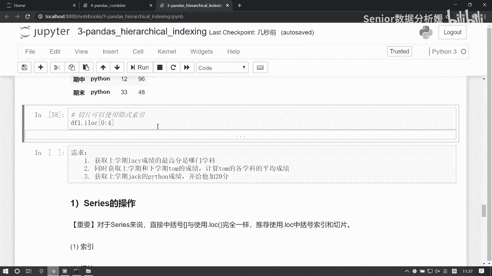