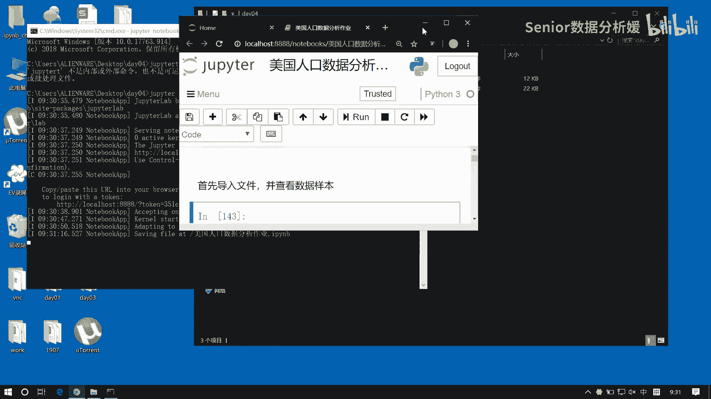
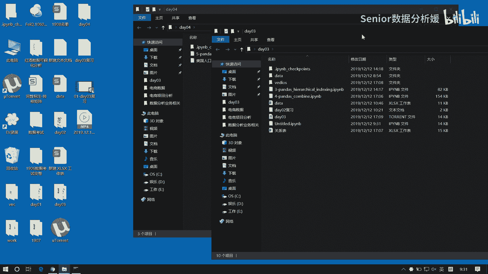
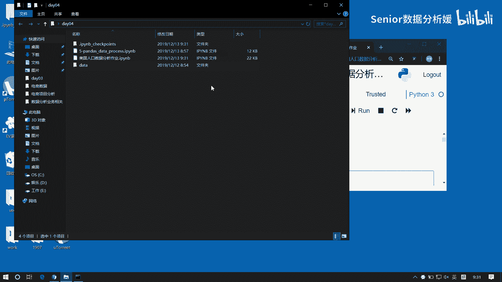
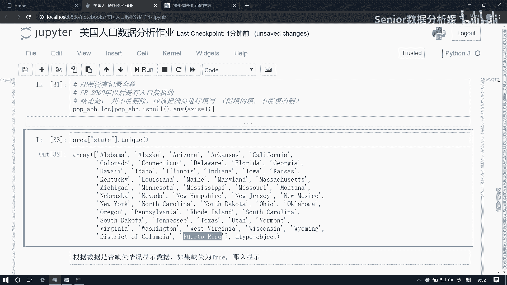
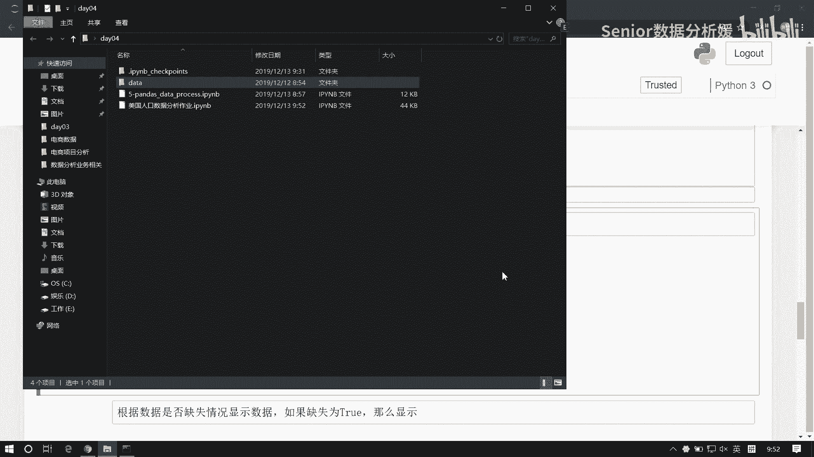
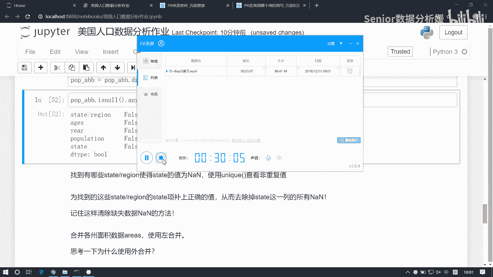

# 数据分析+金融量化+数据清洗，零基础数据分析金融量化从入门到实战课程，带你从金融基础知识到量化项目实战！【入门必备】 - P42：02 美国人口数据分析-01 - Senior数据分析媛 - BV1Ak61YVEYX

好这个数据集也没拿过来。

我把它拿过来啊。

咳咳咳，那我先把这三张表读出来啊，第一个是state啊，这个是population那个表，然后还有还有两个表，我先导一下包哈，Import npas np pandas。

第一个data文件夹下的这个state a abb，那这个我们可以把它命名为叫AABB啊，apple apple ars啊，这个是我们那个周和周名缩写的那个表是吧，然后呢第二张表我们再把它读成呃。

pd点read csv，Data，然后state这个我们把这个面积表读出来是吧，那我把它起名为area，然后第三张表示它了，我把它起名为pop，就是人口表哈咳咳好，三张表先读完，然后呢。

我们一般来讲呢就是拿到一一组数据之后啊，首先都是去先去查看一些，他的基本属性什么的啊，就是基本的数据形式的啊，那比如说我们可以通过head来查看啊，AABB啊，我们可以查看我们这个数据的一个基本组成。

是吧，A b b，然后这个area它的数据是这样子的，然后这个pop点head啊，大概是这样子的啊，然后呢我们除了这个head之外，我们说还有跟大家说过两个函数，一个叫describe。

一个叫info啊，还记得吗，那describe是干嘛的呀，他是帮我们查看这些数学指标的是吧啊，那这里边显然app里边state跟AVERIZATION，这里边是这是啊，这是一些主指标。

但是这个指标不是数学指标的，它里面只有一个数量unique，这就是从驱虫的个数对吧，然后top这是第一个是吧，然后frank这是个分数啊，它因为它是字符串，所以这种值就有点没什么意义了啊。

所以它我们还应该应该看这个info info会好一些啊，因为这里面有什么有total to columns两列是吧，然后state apiation1D都是什么，都是对象类型，一共是896个字节好。

这是第一组数据啊，然后那其他的呢我就不展不演示了啊，就是你可以通过这些方式呢，先来查看你这个基本的数据结构啊，那我查看数据结构是为了了解数据对吧，了解数据我才知道应该怎么用。

比如这里边我们能读到的信息是什么呢，我们最终是要去求这个密度，那你要求密度的话肯定是跟面积，还有这个人口数相关对吧，人口呢在这个pop表里，而面积呢在area表里，所以这两个表。

所以我们得它给它合并到一起才行啊对吧，那合并的话，那显然现在这个area里边他这个周是全称，而我们这个周是缩写，对吧，所以我们还得建立一个关联，我们还得根据谁啊，我们还得把这个周和缩写之间的这个关系。

先给它合并出来，然后再去把最终这个结果合并起来，对吧啊是吧，也就是说三张表，我们最终最终的目最终的结果一定是合并的，但是在合并这个期间内，可会有一些问题，我们需要去进行一些处理对吧。

这边主要是一些空值的问题啊，然后那我们先看第一件事啊，合并pop和APIATIONS啊，apple rs两个data frame，根据这个来合，那我看看啊，这个pop和AABB这个pop这张表。

这是那个啊啊这是人口表，然后这个AABB是什么表，APP是那个周和周名缩写的表，对吧啊，这里边呢我们先把他俩做一个合并，那大家想一下，为什么我不我不先拿pop或者拿先拿a app，跟那个类张表合并呢。

为什么先喝它呢，嗯有过同像吗，三张表，三张表，除了那个pop跟艾瑞尔之间没有功能项之外，AABB是不跟任何一个表都有功能项啊对吧，为什么不拿area和AABB先合呢，咳咳这边你得先检查一下你的数据啊。

比如说我们先可以看一共有哪些个州啊，比如说我看这个AABB这个表当中，这表我想看有哪些州，我说看state或者是APIZATION这两两列任何一列就行，看它的驱虫是不是。

比如说我们看这个apple ization这一列吧，我想读出这一列的话，是不是可以直接用这个来读啊，这样我读到的是不是一个series serious啊，那这个serious我想做驱虫的话。

unique是不是驱虫了，这一共有多少个数据可以对它求一个点size，是不是50一个对吧，这说明什么，说明我们这个统计出来的这个周明，周明和这个，和缩写一共有51条数据啊。

这是我们通过这个表能拿到的信息啊，然后我们通过另一个表去拿，通过这个error，我们看统计的周有多少个啊，area这张表head，里边也是有这个state对吧，那我可以根据这个state。

我看我统计了多少个州的面积，因为有可能什么，要么呢，你这个这个周跟缩写的映射表是有50一个，但是可能你统计的面积表，只你只是查了20个州或者是十几个州，对不对，有这种可能吧啊可能某某个省啊或者某个州啊。

我没有去统计数据啊，所以他呢我也查一下啊，我把这个state这一列拿出来，然后我对它做一个什么呢，做一个unique去重，然后对它做一个长，求一个size是吧，诶他是52个，说明什么。

说明有有面积记录的，记录的周，哎我这怎么成REA了呢，啊我应该是不小心弄掉一个啊，有面记录的州有多少个呢，有52个，那就有问题了，现在我们是什么，这个周的映射表里边少信息了，对吧啊。

面积里面是这个信息是全的，那我再看看人口里边啊，咳咳pop，pad那这里边我们想看周的个数，是不是看这个啊，看这个，然后我们对它做一个驱虫，Unique，然后我们看他这里边有多少个信息。

求一下他的size，53个啊，这就奇怪了是吧，那你说这东西怎么合呢，现在问题是我们人口啊，人口统计了53个信息，然后面积呢统计了52个信息，然后呢周明和周所写的对应表，统计了50一个信息。

那这里边如果我们拿这个，呃如果我们拿任意一项，如果跟这个周，因为都要跟他去做做这个合并的对吧，都得跟他做合并，我拿任意一项跟他做合并的话，那你说我们咳应该是内合并还是外合，并，没有网内核编还是外核变。

那肯定是外合并对吧，因为本身什么本身你这个周的数据是最少的，我如果采用内核并的话，那不论是它还是它是不是都会有数据丢失啊，对吧，所以我们应该是因为你求的是什么，求的是密度，密度说白了跟这个表有关。

跟这个表有关，它只是起到一个连接的作用，是不是，所以我们不能说以它为准对吧，不能以它为准啊，应该是以这两个表为准啊，那现在它里面既然它是多了俩，它多了一个，那其实我们就应该找到，这到底是我这边少了什么。

还是说这边多了什么对吧，其实最好是能把它给它分析出来啊，嗯那这个分析的话，我们可以先这样啊，咱们可以先先合着啊，我们先采用这个外合并先合着，然后呢我们再通过后边的办法，我们可以把它就都找出来啊。

我们先把这个pop跟这个AABB做一次合并啊，因为它最多是吧，他的信息量是最大的，所以呢我先把这个最多的信息量先保留下来啊，那我先拿pop跟ADB先合一下啊，我用pd点merge，那我谁做左表。

谁做右表啊，最好是把pop放左边是吧，因为它的信息量大啊，然后右边是这个AABB，然后把这个have设置为alter对吧，额外合并，然后呢他们根据哪一列合呀，我看看能不能合是吧，咳咳。

pop app它默认是这个，我们这个函数，默认是找那个列标签相同的向量和对吧，所以这里确确认一下啊，这个pop点head，然后这个AABB点head，那是不是得根据这这个AL来合呀对吧。

根据这个内容来合，所以说我们左边是pop，那pop的话应该是依照这个列标签对吧，那把这个left on我们设定为它，然后right on设定为这个是吧，Observation，这样应该可以了是吧。

好我们先运行一下看看啊，好这应该是没问题，然后呢，这里边是不是多了一列啊对吧，多一列，那我们应该保留谁啊，保留它还是保留它啊啊，那必须是保留多的呀对吧，我们这个AABB它这个信息是不少啊。

这个pop里面多对吧，就是它里面的信息是要比它多的啊，所以我们应该是保留它，那就可以把它删掉，对吧啊，删它的话是不是可以用这个jump jump，然后呢我们这个labels等于。

Appropriation，然后方向是得改成列方向吗，好了把它删掉了，那我把这个表保存一下，我们就叫嗯poo p杠ABB，好把它先这样存存进来啊，那我看这个pop杠ABB点head，查看下这个结构。

好那现在呢我们就可以看一下啊，因为我们这里边嗯，state这一列是不合进来的呀对吧，那我们知道state这个东西，它是来源于ABB这个表，ABB这个表的信息量是要比他少的，对不对。

所以说就有可能什么有可能是我们有缩写，但是可能没有全称，是这个道理是吧，所以我们可以先查一下啊，我们看一下这里面有没有空值，那肯定是存在空值的，这里面一定有空值，因为数据量它不够，对不对，可以。

那我们想查看那个空值怎么查呀，是用is now啊，好查看缺失数据啊，这个pop a b b点is now回车，然后我们想看什么，想看存在缺失数据的列，那我们就再来一下，Any any any any。

默认数据是列方向的聚合呀，这样我们就可以看到哪些有有空值，人口这一项有空值，周全称这一项有空值啊，那么如果如果这两个列有空值的话，那我们先想知道到底是哪些周啊，哪些州它的州名没有统计。

哪些州的人口没有记录对吧，那这个数就是应该是行方向的一个查找啊是吧，就我们相当于是什么什么，我们现在对整个班级的成绩我们做了一个统计，我发现我们考了三科Python，java和C。

我发现Python里面有缺失值，那我现在知道是谁没有考对吧，所以说应该变成行方向去查找了啊，啊是张三没考还是李四没考对吧，所以到底是一样的啊，现在我发现这两列数据没值，那么有空值，那我们就去找谁。

导致了它是空值啊，我们就看行方向，行向怎么看呢，还是这个表对吧，这个表AABB，然后还是得is now吧，然后只不过这个any name我们变成了变成行了呗，是不是变成行了。

这种返回true的数都是有空值的，那么我们再用利用利用这个布尔列表，是不是就可以把我们这个表的数据给它log出来，查看它的行吗，用布尔列表来查看一个表的所有行数，可以啊，能跟上不，好先运行。

现在我们发现啊，这个里边PR周PR州的人口有空值，但是呢P2州人口还不全是空值是吧，什么时候开，什么时候空值，99年之前都是空值，是不是啊，99年之后就有值了啊，这是一个信息啊，我们能观察到的。

另外呢哎我发现还有个什么有个USA这个字段，它它怎么也出来了，他没有控制啊，请问设备ui FA没有他的详细的语义，你这名字在做啊，你前面那个pot在做了啊，啊应该应该是POPAPB是吧。

我说怎么出来这啊，嗯哪线啊，这个PR周人口有空值，然后周明有有空值对吧，那说明什么，如果说这个周明有空值的话，说明什么，这个周名怎么来的，这个周明是不是，我们拿那个就是周明和它缩写映射表合进来的。

这一列数据，那是不是说明那张表里面没有记录，这个PR周的那个证明啊，对不对，那我们可以先看一下啊，你看看我们那个AABB这张表里面，它里边我们看有没有那个pr周啊。

那可以看这个APIATION里面是不是，然后它等于等于pr，可以吧，等于等于pr，然后看看这里边有没有处，对不对，要是有处处不说明就有啊，是不是没有出啊对吧，其实或者我们肉眼看也能看出来啊。

我们可以证明一下啊，因为有的时候你肉眼可能看不了，你可以通过这种方式来证明它啊，你看有没有pr，找一找ABCDEFGHIJKLMN，然后O没有P吧啊这有P有PA有RAI是吧，OPQRSTUVWXYZ哎。

LMMM跑这来了，是这对吧，没有不是没有pr啊，没有pr对吧，所以我们猜想是正确的啊，那也说其实是什么，通过这个通过这个查看啊，我们发现一个问题，就是说这个首先pr周是没有全称的，没有记录全称。

没有记录全程，但是PR周有什么PR周这个2000年以后嗯，是有人口数据的对吧，所以说那这个PI周你你是不是得留着呀对吧，因为他也他是有人口的话，那他如果有人口的话，除非它没有面积，其实它没有面积。

我们也能填对吧，因为这种这种周的这种面积，我们是可以直接网上搜到的，对吧啊，那你应该把这个数据留着啊，那想留着的话，那那么我们就应该尽量的去把他的这个周名，给它填进来，是不是要填进来啊。

所以这是两两个信息啊，有全称，所以说我们得到的结论是什么呢，这个结论是这个周不能删除，不能删除，应该把周名，周明进行这个填写啊，填写那如果没有人口数据的这种情况，是不是可以删了对吧，因为你你周名可以填。

但人口数据这块不能乱填，每一年都不一样对吧，谁让谁加三什么二大爷啊，还有三三舅姥爷啥的，是不是是不是还不在人世了啥的是吧，所以每一年都不一样啊，所以这个这个人口数不能不能胡乱编啊。

所以那也是我们原则是什么呢，能填的填，不能填的删，对不对，这是我们的原则啊，做人的原则就是这样的啊，能填的填，不能填的删这个道理啊，那谁能填周名，能填人口不能填好了，这是一个基本信息啊。

除了pr看还有没有说到USA啊，USA的周名能不能填，能不能填，能填对吧，但是USA是啥呀，USA是不是美国全称啊对吧，那我们现在要干的是什么，我们干的是美国各州的人口数据，说USA项有没有用用啊。

是不是没啊，没什么用啊，但是你想保留也行是吧，因为啊那你看我们是不是统计的是周的，是不是统计的是州的人口面积和人口那个密度，啊对吧，就最高五个州嘛，那你美国算是州吗。

就像相当于说你要统计中国的各省人口面积，然后你帮你把中国放进去了是吧，有有意义吗，对吧，是没这么干的对吧，这都能看错啊，当然想你要想留着也可以，那这个东西肯定他肯定排不上号，因为他是个平均值嘛对吧。

你均值不可能说排在第一第二第三，对不对啊，你可以留着啊，那现在想留的话，我们可以怎么办呢，我们可以去做一些这个剔除，比如说我们人口数据没有的，我们应该删掉对吧，但是呢如果我们我们想删人口的话。

可以根据有空值来删，但如果有空值删的话，我们会把这个会把这种指数也删掉了，是不是，所以我们可以先把这个值啊，说可以先做一个填充啊，先把周名填进来，然后呢周明填进来以后呢，就只有这一部分的。

就是周人口数据缺失的数据，我们可以把它根据控制删掉，明明白我意思吧啊所以我们先干爹，我们先干这件事啊，先把周给他做一个填充，那pr周是什么周啊，嗯美国的皮亚洲啊，咱可以这个百度一下啊，啊不是百度啊。

啪啪一下，皮亚洲是哪个洲，最好去练习表里面找他，那没有那些啊，没有链条有吗啊，那我你去找一下行啊，这个建议很好啊，我看看那个看他这个里边有没有那个数据啊，我们现在还有个表没动，就那个面积表对吧。

咱看面积表里边有没有那个pr轴，这是error，然后他让我们去找这个开头找state对吧，State，然后这边我们来一个unique，用那个P开头的，其实就是这个啊。

这你还是得佐证一下啊，就是波多黎各啊，因为我知道啊，我可能不知道。

所以你还最好先看一下pr是哪个洲，pr就是波多黎各州，波多黎各州啊，这么像圣弗里，什么那个什么圣托里尼那个什么是吧啊，这这个这个周一看，就是感觉那种什么极品飞车啥的，就不愿意找这种地形是吧啊行啊。

然后这里边，这这这一层住着一群那什么亡命之徒是吧，手柄拎着AK叼着雪茄啊，然后还有戴着眼罩的，然后楼下一辆一辆这个车是吧，里边坐着一个什么什么特工之类的，是蒙着头照，然后还有掐秒记记记记录镜是吧啊等等。

都是这种美国大片就喜欢玩这种东西哈，波多黎各州啊，算联邦自治州，那这个玩意是不是跟美国的，美国的这种这种这个地域的管理方式不太熟哈，是不是跟我们的这种这个直直辖市啊，自治区域应该类似的，对不对。

应该类似那个概念啊，看来也是有一些历史原因在里边啊，主要是一些移民啊，波多黎各啊，那么根据根据它来看啊，那显然面积表里面是有这个值的对吧，是不是它吗，是不是啊，就是它啊，那我们为了统一这个数据。

我们就可以用这个值来填充，我们这个pr的对应的那个state，这这些项啊，是不是好，那我们就以它来填啊，波多黎各来填这个东西，嗯嗯什么嗯嗯现在好像给谁填呢，是不是得给这个a abb pop这个表来填啊。

哎pop a abb这表上给这个表来填啊，这表填填这个表的话，我们是要访问什么，访问这里边的部分数据了是吧，那我看怎么怎么处理啊，嗯这边要填的是嗯要填的有哪哪一项呢，不不过就是一个是pr嘛。

一个就是USA嘛对吧，要填这两个pr的话，我们用这个东西来填，然后USA的话呢，我们就用USA来填吧，因为这个数据啊其实没啥用对吧，我们我们现在体验只是为了什么，只是为了我们在删空值的时候呢。

先把它留下，如果你不想留的话，就不用填了对吧，直接扔就完了啊，那我这个填是有必要的，因为我们刚分析了整个这张表当中，我们要把这个人口人口为空的绿调，要把人口有的留下是吧，所以我们得把这一列先解决掉。

这样我才能依赖空值来把这些数据删掉对吧，要不然的话这些东西也被删掉了，因为他也有空值啊，所以我们要做的就是先把这个周啊先填充一下，那填它的话，我们就对这个表来填啊，这表我们说得先有个条件筛选啊。

嗯那这条件什么，我们叫pr condition，它等于什么，它等于我们这个pop a b b，它里边的我们就根据它等于pr不就是条件吗，是不是它等于pr，这个是不是条件啊，这是个布尔列表啊。

我们拿这个布尔列表，是不是可以把这个pr周的数据都读出来是吧，我们来试一下啊，我们现在把这个，Pop a b b，然后是不是得点lock呀，Pr condition，你看拿到的什么是不就是pr的信息啊。

全是pr吧，然后pr干嘛呢，我们先说要把这一列，把这一列做赋值啊对吧，那想拿这一列的话，我们是不是相当于访问元素啊，拿这个state列是不是把信息全拿出来了，那这一列怎么样呢，我们给他做一个赋值。

赋值为，波多黎各啊，你注意这个写法，我现在在赋值是吧，赋值的话一定要用这种方式叫直接访问是吧，不要间接访问啊，运行好了，这样我们把这个把这个表啊，我们操作是这个pop a abb这张表他操作完了。

我们先看一下啊，还是根据这个条件，我看能不能我看他读出来的数据，它是不是不为空了，都有了吧，都有值了啊，然后那同样道理，我们把USA也做一个填充，那usa condition。

那是不是就是跟他一样把这个拿过来，把它变成USA，然后把这个变成哎，这是USA，然后把它填充为USA好，然后同样的算法我们再去，查看一下USA是不是填完了好了，都填完了对吧。

那这样周的这个空值我就处理过了啊，周二空值处理过之后，我们现在再来看好，再来看我们这个整个的数据集啊，它的空值情况，现在应该只有人口那一列有空值了吧，pop a b b点is now any是吧。

现在只有人口这一类有控制，而且是哪些哪些州的人口有控制啊，是不是就是pr轴，而且还指定是pr的那个2000年以前的那些数据，是不是我们可以再再去查看一下啊，现在我们还是看行哪些行有空值啊。

pop杠AABB，然后点is now，我们再来个any内查看行等于一这行方向是吧，然后用这个行去过滤我们这个pop a abb这张表，点lock，是不是就是pr轴从90年。

90年一直到99年这些数据对吧，那这个数据人口数据肯定没法填了，所以可以直接滤掉了对吧，可以把这些值啊给它弄掉，那这些是怎么弄掉呢，可以找到这些什么说找到index啊，这是index对吧。

有了index就是好删了啊，这个我们叫jump index，这是什么，这就是啊获取到这个人口数据为空的行索引，所有行索引，然后我们根据这个行索引去做过滤啊，那我们对这个AABB啊。

pop a abb列表，我们去做一个jump就行了，Jump，然后我们把这个，labels设置为job index，然后那咳默认就是行方向，所以不用改了啊，不用改了，然后把这个表给他做一个更新。

给它保存到pop a p b当中好了，现在我们再来去查看一下啊，看看还有没有空值了啊，pop app点is now，点any，没有控制了对吧，好，那就是相当于我们把那个2000年以前的那个。

pr周的数据都过滤掉了，好了，现在这个数据又好看一点了啊。

