# 【整整198集】这太完整了！python金融分析与量化交易实战课程，全程干货无废话，入门到精通一步到位，(数据挖掘分析／大数据／金融／股票／) - P34：4-股票池筛选 - 人工智能- - BV13K11YiEbb

好了。

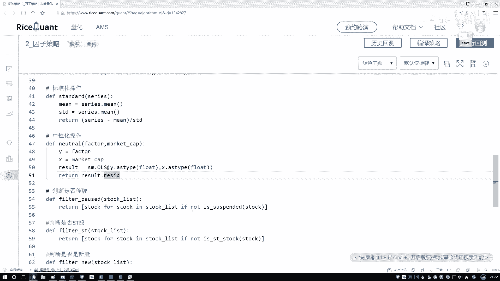

那咱们现在啊就是这个中性化操作，我们也写完了，在这里回头来看一下吧。

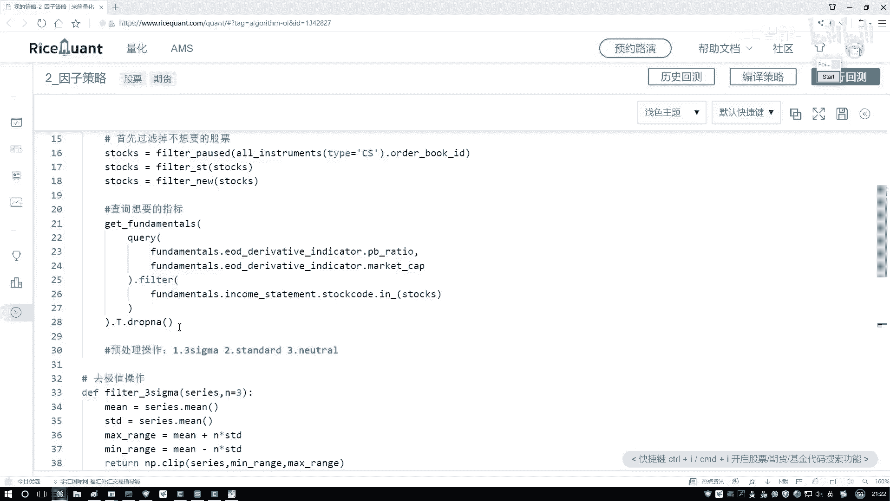

现在我们是不是在这块就可以去执行，哎咱们刚才写那几个操作了。

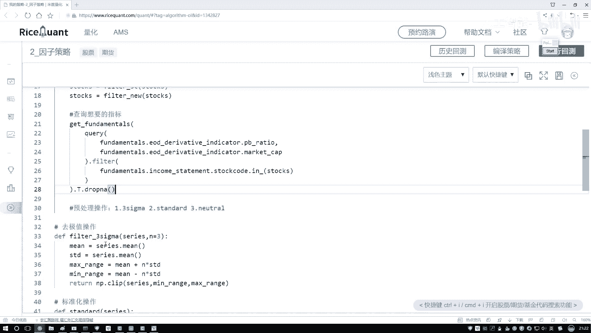

好了，一个来执行吧，啊在在在在这里啊。

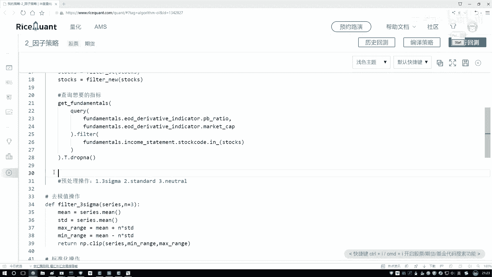

改写了预处理操作，预处理操作当中啊，咱们一个来写第一个第一个啊，就是咱们去啊做一个三西格玛3C码当中啊，我们要传进来什么，哎对谁做呀，哎对我的市值做还是对我因子做呀，对因子做吧，好了。

把我们的因子拿到手呃。

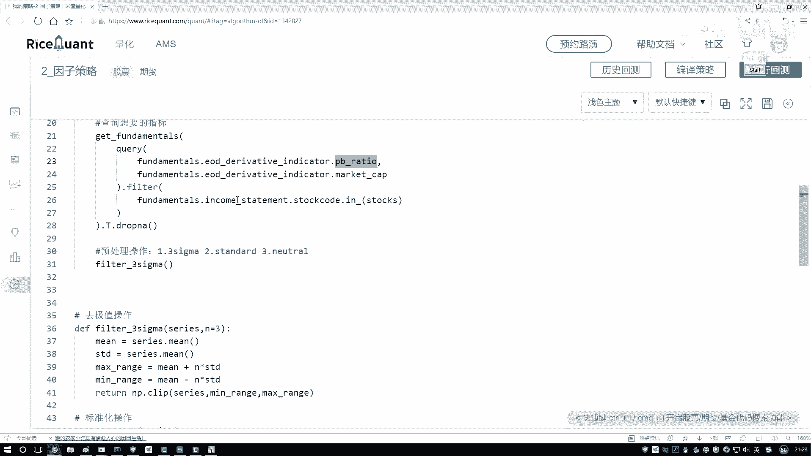

这里边哦，这里边咱的一个结果还没有个返回值，我给他个返回值吧，在这块哦，我说咱们现在得到一个返回值呃，把它复制过来，把它复制过来，fundamental呃，fundamental当中它指定一个名字吧。

Fundamental，然后做data frame就行了，然后在这个data frame当中就有我们需要的啊，我们想要的这个指标了，好了，把它拿过来fundamental，然后对其中谁操作呀。

是不是咱们之前写好的，我们当前的一个实际试镜这个东西啊，好了把它传进来，然后这样咱们做的第一步就是我的一个呃，去我们的一个离群值确利润值之后啊，然后咱们写一下吧，就是现在额现在我这个指标就是没有什么。

没有我的一个额极值了啊。

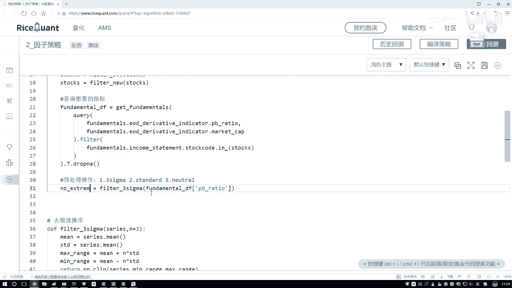

咱们现在做了一个没有极值的，做完没有进制之后啊，还没完，我们还得再做什么。

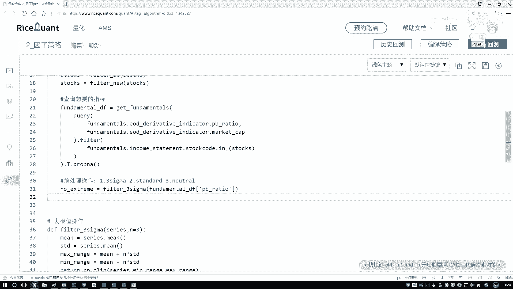

是不是说再做下一个操作，做一个标准化的一个操作呀，好了，把咱们当前这个结果传进去，下面我做了一个标准化的操作，相当于额相当于一个标准化的操作，就是这东西吧，直接把它拿过来。

然后再点上一个standard呃。

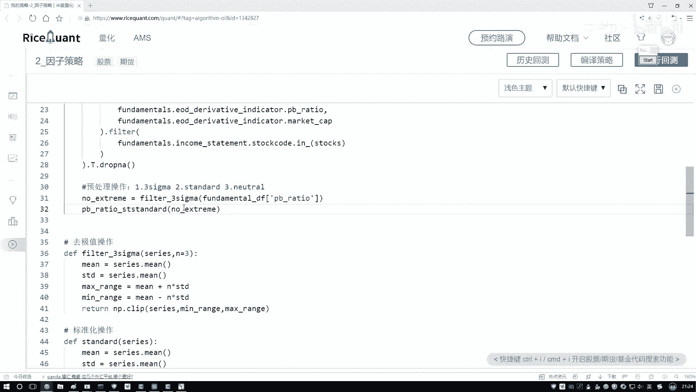

DDER等于我当前的结果行了，这是我做了一个标准化的一个操作。

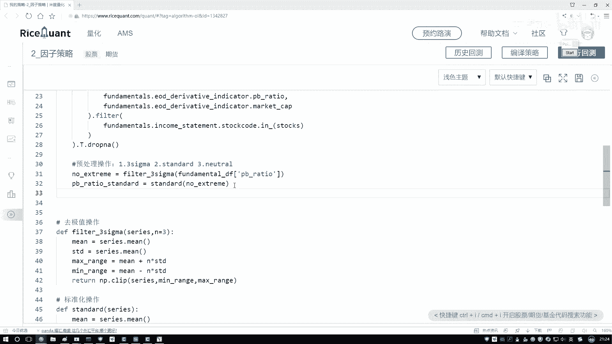

做完咱们这个标准化操作之后，接下来还有什么，还有一个中性化操作吧，好了再给他复制过来。

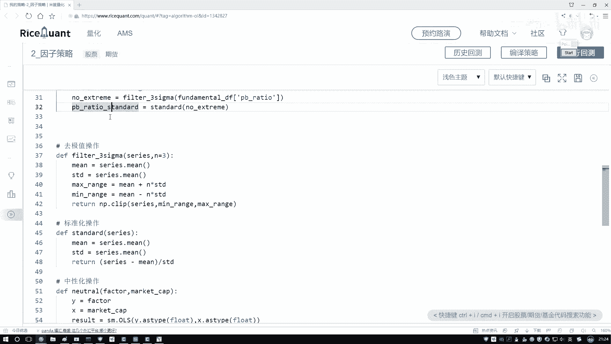

再给他复制过来之后，我说哎呀他就就就叫这个名字得了，他就就叫做预处理完之后，然后杠这个东西。

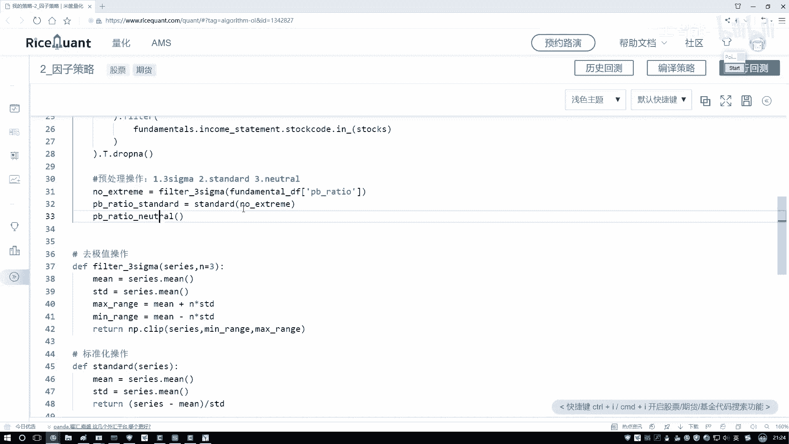

然后等于咱的这个结果好了。

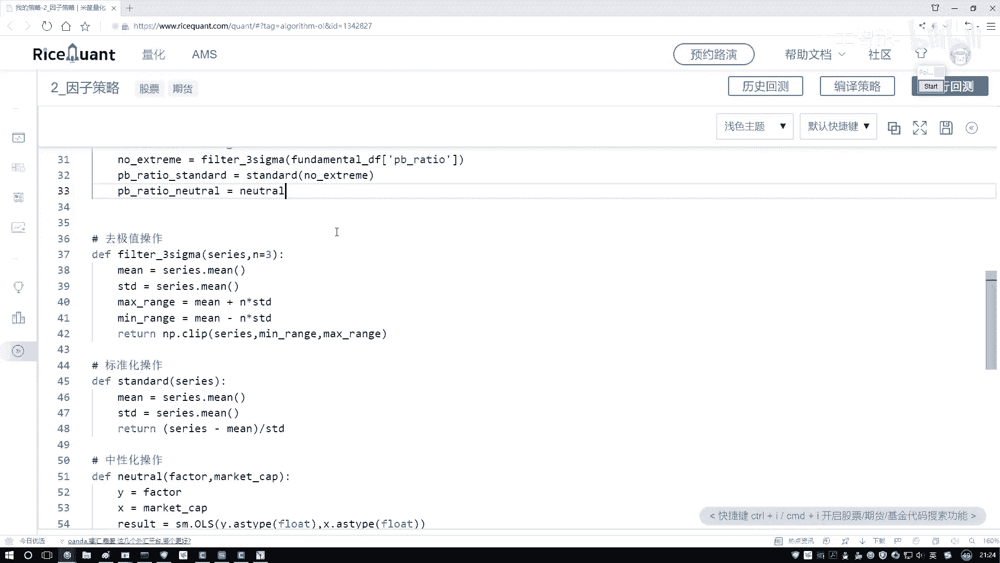

等于我们这个结果，然后把上面这个值再传进来，是不是就可以了，那现在我们就完成了。

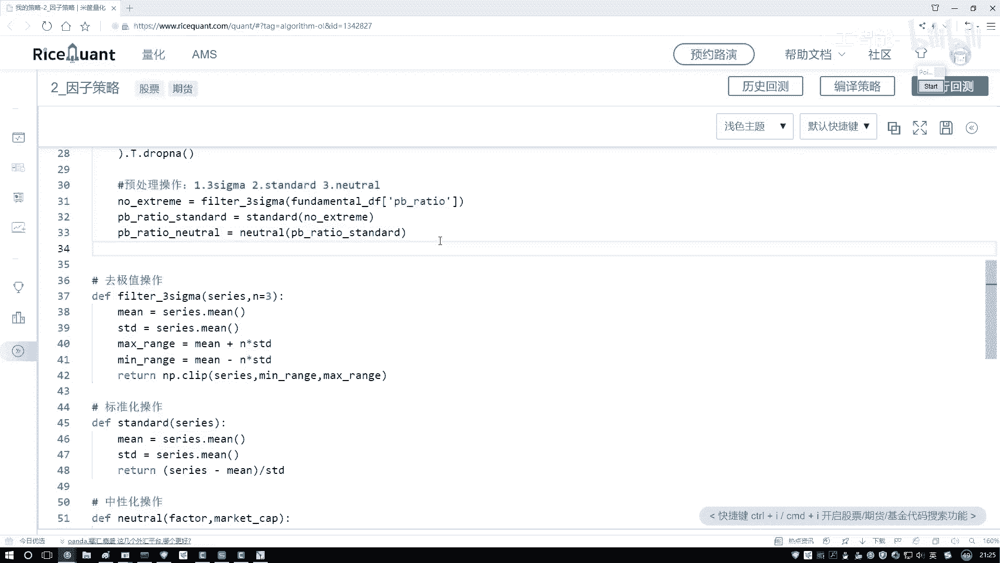

咱们所需要的所有的预处理操作了，那接下来呢哎接下来是不是说我现在啊哎呦。

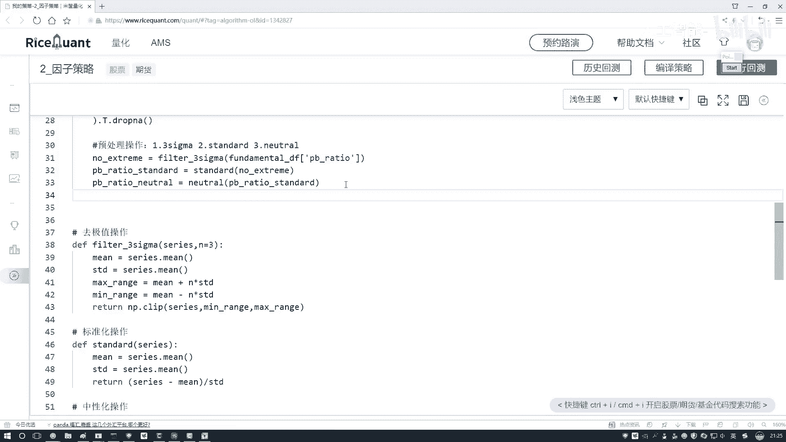

我要对这个因子做一些筛选了好了，咱们来指定一下呃，对因子啊，不是对因子基于因子啊，对池子，对咱们的股票池子做做一个筛选。

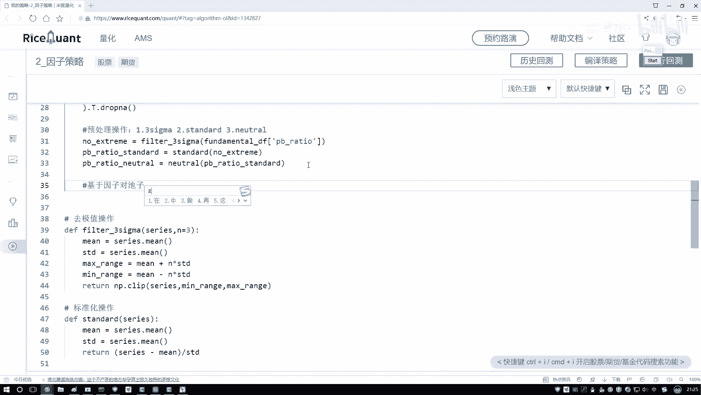

或者做一个调仓，做筛选吧，做一个筛选操作，筛选操作咱们想一想怎么去做啊，是不是这里哎你得给我指定一个指标啊，比如说我是个QQ当中呢啊，你说是小于这个因子是小点好还是大点好啊，咱们之前不是说小点好吗。

所以说我对当前这个指标我看一下吧，他的呃比如说从小到大啊，就是20%的时候，它是等于多少，就是我们希望选出来前20%最小的，可以吧，还有这里我们来指定一下，切一下吧，咱们来选多少个，那我就选这么呃0。

2个吧，相当于选了20%。

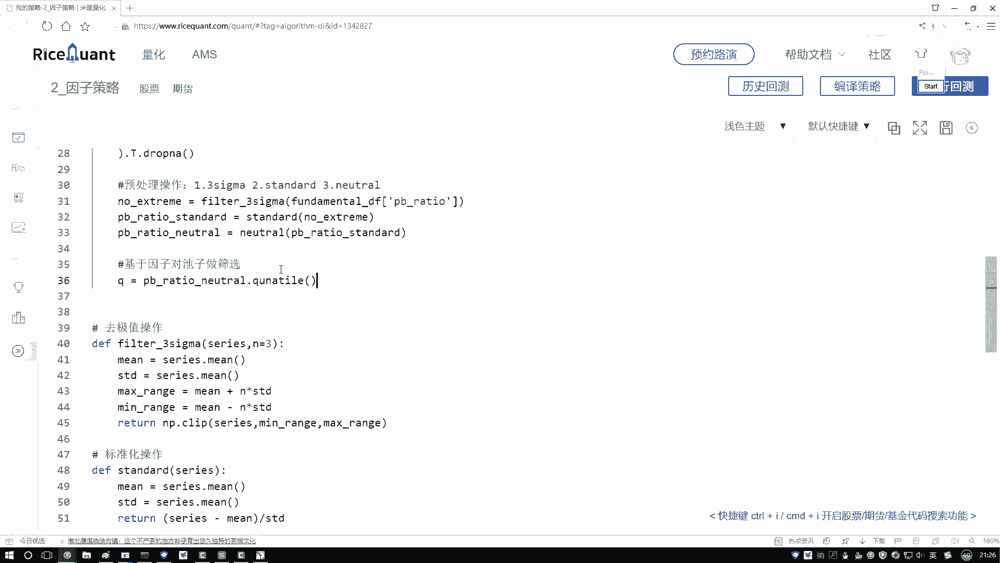

然后呢这里这是我做了一个因子策略，然后接下来接下来是不是说我要去选股啦，那好了，现在我们要选股，在这个选股过程当中，我需要再怎么样，我们看一下当前当前我得到这个结果，这个是我的一个因子，对我的因子当中。

我要做一个所有的股票当中啊，都有这个因子是吧，那所以说我现在可以做判断吧，做一个筛选吧，在这里哎我说现在啊如果说啊它的一些值啊，如果说它的一些指标怎么样没有满足我的要求，没有满足什么，咱刚才不是说了吗。

我们自己哎指定一个范围，通常啊就是我们这个市净率啊，我希望它不是小一点的时候，能怎么样能使得咱的一个收益，或者说我们的一个期望收益吧，可能会更大一点吧，所以这里哎咱们说小于等于一个零。

小于等于一个20%那个值啊，是不是就行了，我们现在先来选小一点的那一些，然后呢我需要把这些股票找到手点，你death一下，这是不是呃，这个东西判断是基于值去判断的，均值判断完之后。

咱们现在相当于传进来索引，我得到了什么所有的股票吧，好了，那这这这这是什么股票，这是不是说我这是我现在想要的这个股票啊，判断完的我想要的这批股票好了。

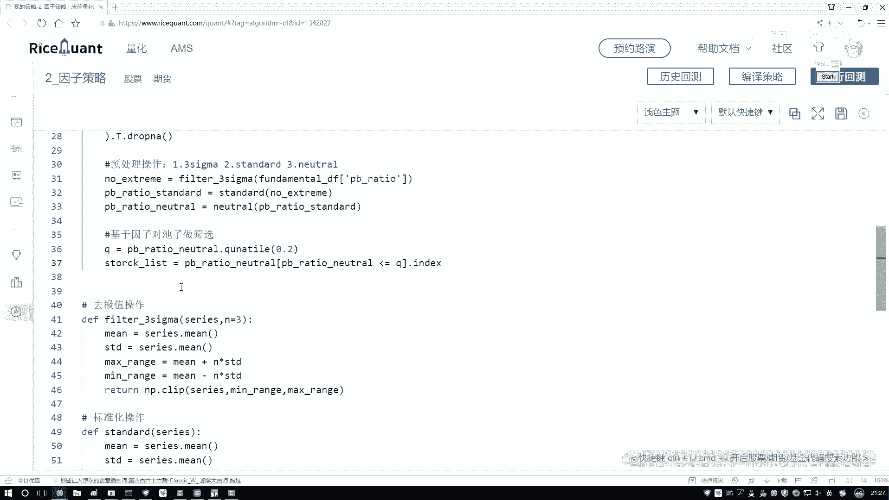

我们拿到这个股票呃，一会儿咱要对这股票做一些做一些交易操作。

我们先把它传到这个context当中，context当中呃，stock list等于一下我当前的一个结果呃，这块不改了，直接把它传过来就行好了，这是我们现在呃有了一个stop list。

然后接下来呢就是我们要干什么。

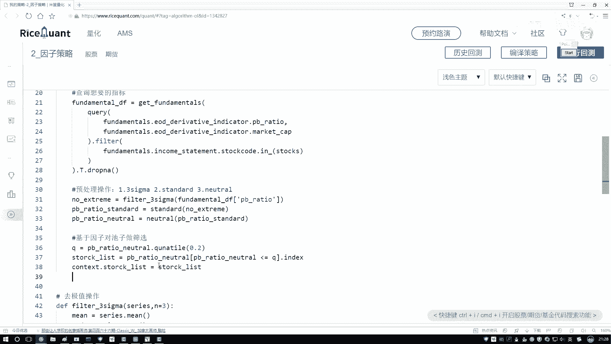

我们要执行一些调仓，还有买进买出的一些操作了哦，在这里就是我们要做买进买出啊，那你是不是说你得知道哎呀买什么，或者说你把哪些要删除出去啊，然后剩下的是在股票池子当中去选吧，那首先我们得看一看一会儿啊。

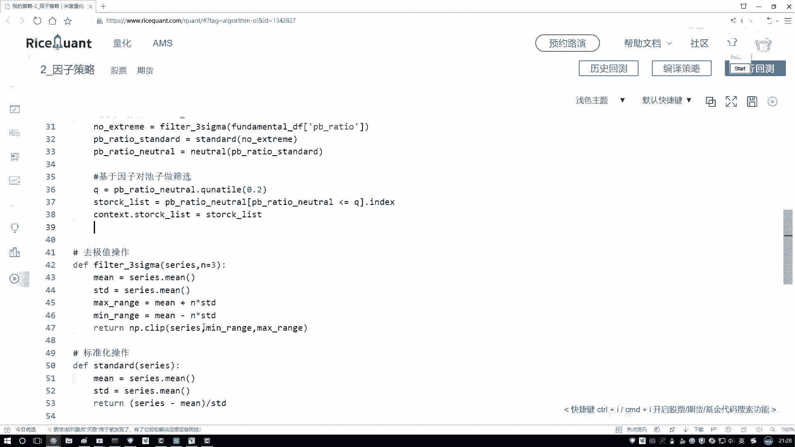

有哪些不在这个池子哦，我得写一下呃，删掉删掉不在当前啊，当前那个呃因此选中的池子中的股票啊。

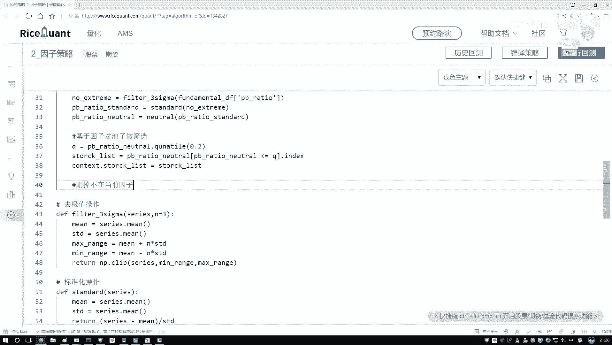

咱们要做一个删除，删除怎么写呢，来写一下吧，呃删除我是不是说得把这些股票啊给它删一下，删完之后呢，我也知道你删了什么东西啊，好了，这是一个返回值，返回值啊，当中就包括了所有我要删的，那来想一想吧。

哪些诶是我要去删的，那肯定是之前咱有的啊，并且跟我当前池子是不一样的，这个是我当前的我的一个池子吧，好了，我把它复制过来，这是我当前的一个池子，我先给它括号括起来，那我们要看的那肯定就是哎呀。

现在手里有的股票跟我们当前池子那不一样的，我这有一个different操作呃，d f f r e NC e different操作好了，这是对谁啊，是不是说现在我手里有的这些啊，那好了。

那我们现在拿到手里有的吧。

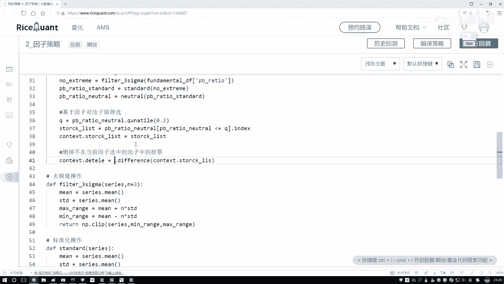

啊这块呃咱们还在写一下，就是拿到拿到手里。

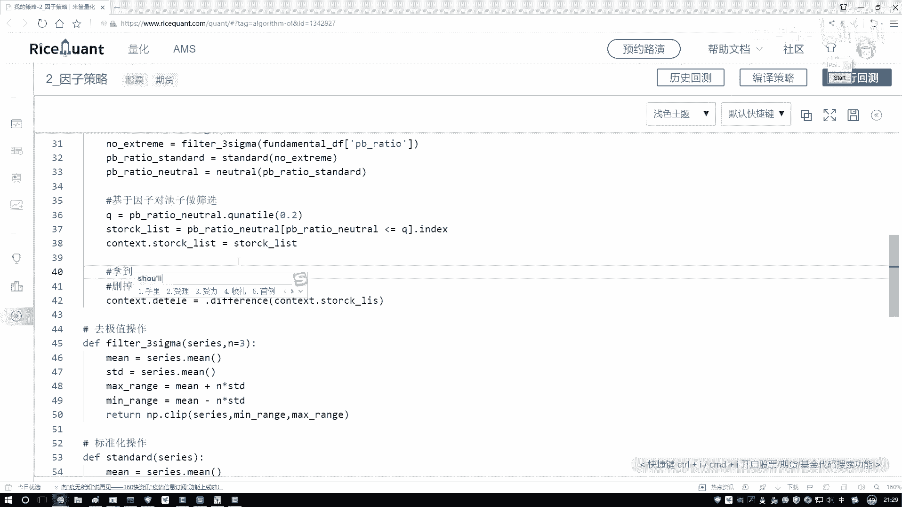

有的拿到手里，有的咱们也指定一下，在这个context当中把这个哦不用复制上面的。

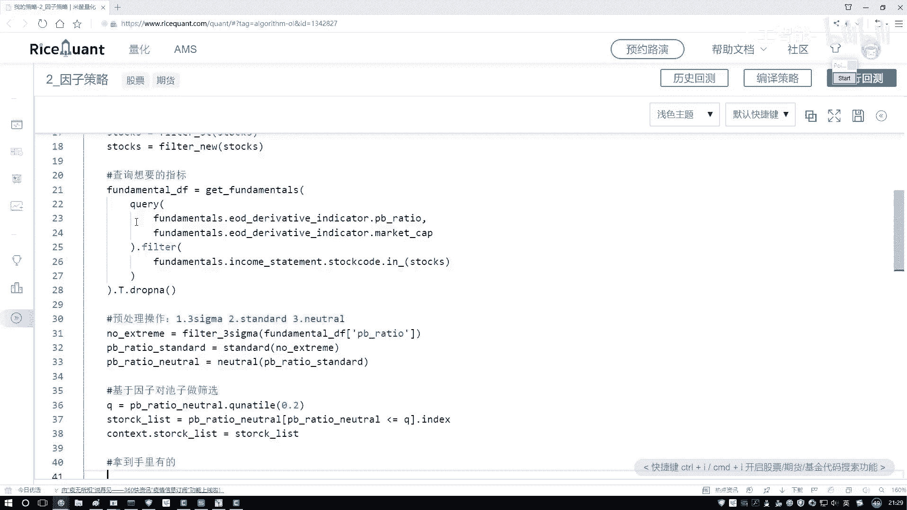

咱这也有在这个context当中，我们要找谁呀，是不是找我们现在哎，我的一些账户的一些信息啊，在账户信息当中我要看什么，我持有什么东西吧，position诶，没有啊，这是position，找一下呃。

看一下，在我只有这是一个IO是吧，哎没什么问题啊，他怎么没没有这个东西啊，position咱试一下吧，一会儿看一看这个API有没有问题，有问题要改，我记着他是一个possessions好了。

这是我现在手里有的吧，咱现也拿到手啊，然后指定个名字，这个就是我的一个context点儿呃，咱们最后一次手里有的啊，咱指定一下，我们最后一次手里有的这些个呃股票吧，啊就叫做这个股票得了好了，然后呢。

我是不是用现在手里有这个东西啊，跟我当前池子的诶，跟我当前这个池子的做一个判断，判断完之后，difference什么意思啊，那就是说当前你手里有这些股票，不在你池子里边的，哎。

这是difference吧，咱把这些股票给他拿到手吧，哦是这个意思，然后这个这个我把这个前面就得给它复制一下，好了，这完事了，这个就是咱们当前啊完成的一件事。

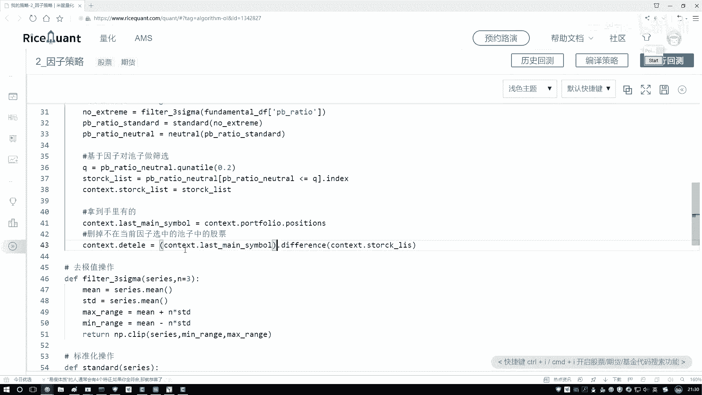

好了嗯，点set一下吧。