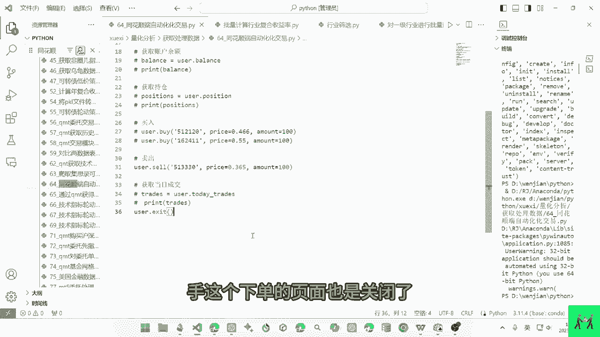
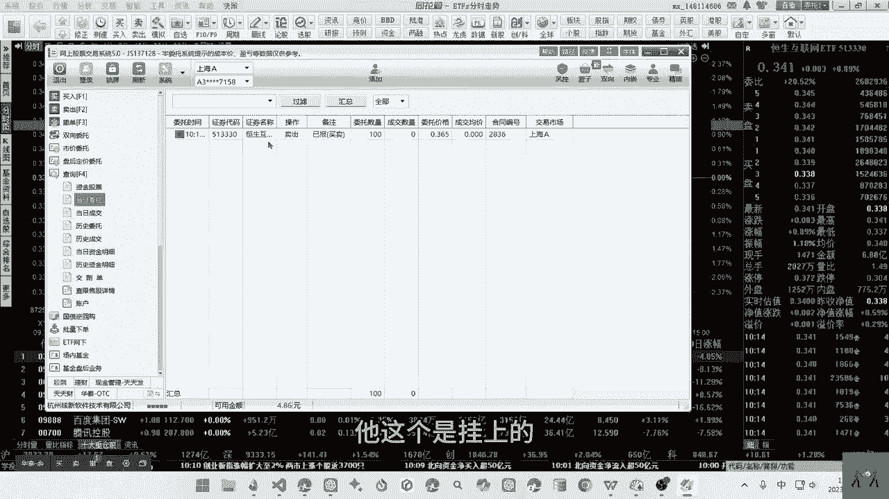
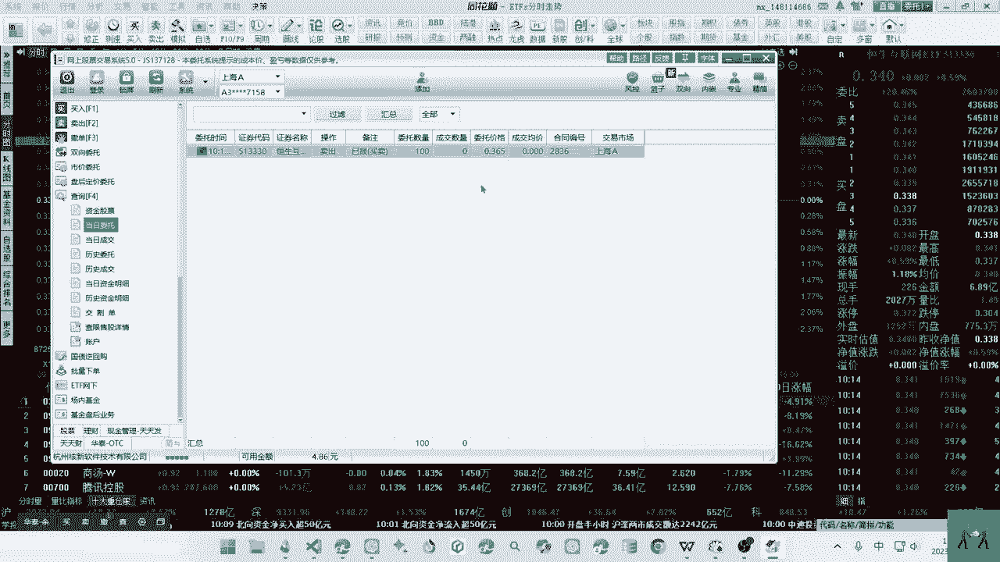
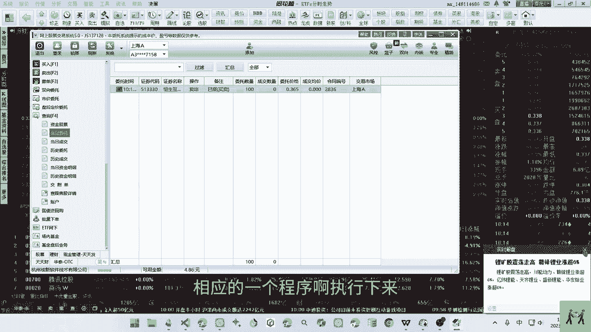
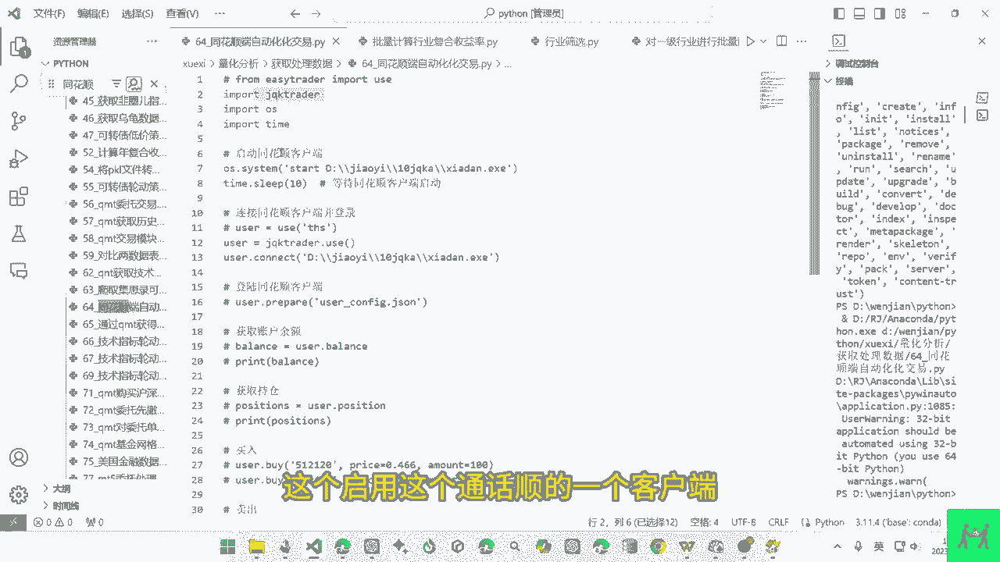
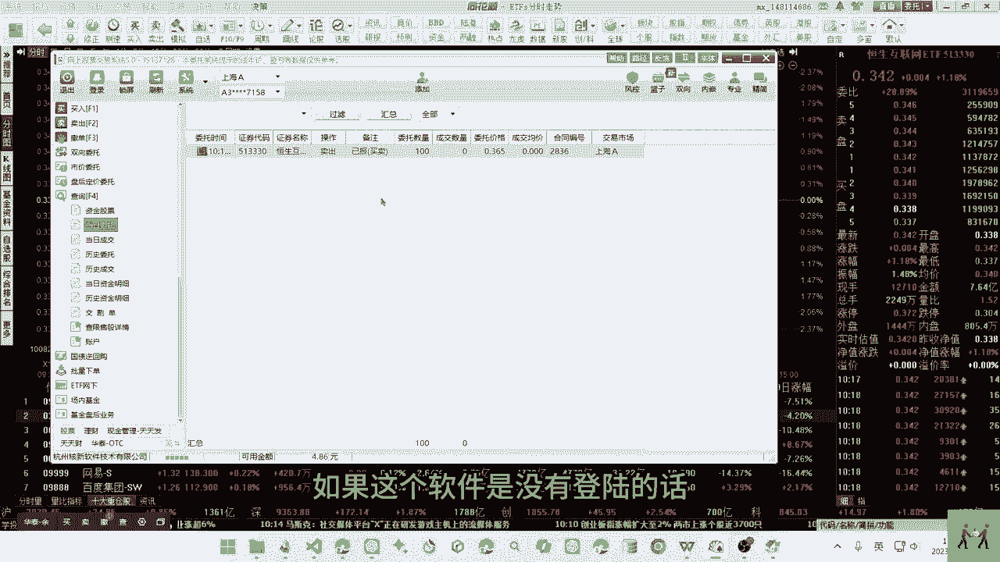
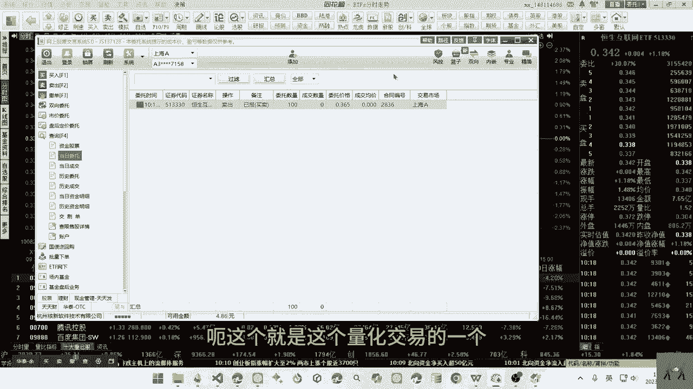
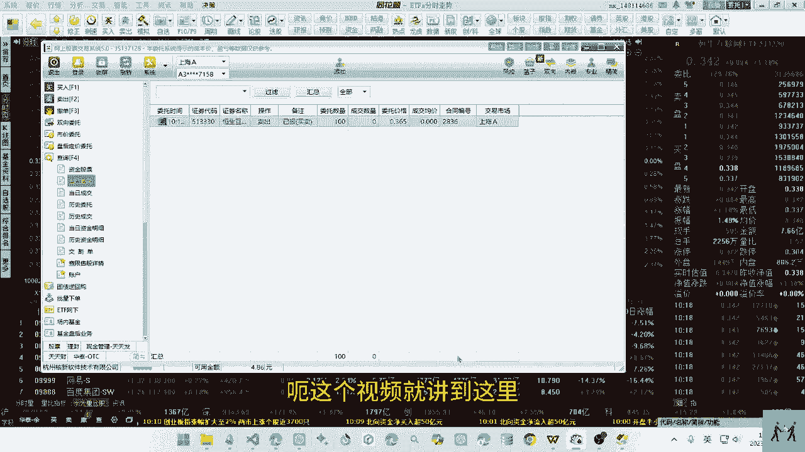

# 无门槛的同花顺自动交易，实现量化交易 #量化交易 #python #自动化交易 #自动交易 - P1 - 无限超人Infinitman - BV12AtAe1E17

而这个视频来讲一下，通过这个同花顺的下单进行一个自动化交易，呃，之前我们讲这个量化交易的时候，收到这个自动化交易，但是自动化交易，很多人是没办法去开通这个QMT之类的，一个专业的一个量化交易的一个软件。

因为存在较高的门槛，但是我们也可以借助这个同花顺的一个下单啊，进行了一个自动化交易，但是这个而是存在一定的缺陷的，不是每一次都能下单成功，毕竟不是通过单口去实践的。

而是通过面的一个类似鼠标点击的一种方式，去实现的一种下单，之前我们也讲过通过东方财富的网页端，我们也是可以去实现这个自动化交易的，类似鼠标的一种点击器啊，实现一个下单的啊，比如这个仲裁的一个下单。

下单的话，我们通过这个Python代码可以点击这个，然后输入这个代码，然后点击这个输入这个价格啊，然后进行点击这个买入啊或者卖出呃，可以实现一个自动下单，这个是通过网页的形式进行一个下单。

当然我们也可以通过类似点击的下单方式，在这个同花顺的一个下单里面进行一个下单，它也是类似于这个鼠标的点击，只是我们看不到鼠标而已，呃我们来先来演示一下吧，在这里的话，我这里是没有这个当这是没有委托的。

没有委托，我们可以去刷新一下，是没有委托的，我们来演示一下这个代码，代码的话是引入了这个库，这个库的话待会我们来看这个作者的一个声明，然后这个是同花顺的一个客户端的一个，下单的一个程序，这个程序的话。

我们在安装这个同花顺的软件的话，他是有这个程序的，那待会我们来讲这个啊，我们先来运行一下，我们对这个代码进行啊卖出卖出100，这个价格是远高于当前的一个价格的啊，是我们来测试的一个价格呃。

这个地址我重新更新之后，这个地址是发生了一个更改啊，我们重新更改一下这个地址啊，然后我们进行一个运行，呃他刚才就是进行了一个下单，下单以后，我们看这个委托下单之后，它这个页面就关掉了。

因为我们在这里进行了一个退出，呃，这里进行了一个下单界面的一个退出，手，这个下单的页面也是关闭了。

我们啊回来重新看一下，我们打开，我们可以看得到他这个是挂上了。

就是卖出一手这个价格额，就是刚刚挂上的一个单，这个就是自动下单的一个代码。

如果你要量化交易的话，相应的一个程序啊执行下来。

然后我们把这个啊要交易的一个，执行到这里来就可以了，呃通过Python去计算一个买入的价格，然后把这个价格放进来，然后这个数量放进来，然后就可以实现一个自动化的一个交易额，然后这个是获取这个持仓啊。

获取这个余额啊，跟获取这个当日成交呃，一个数据都可以去获取的，我们来看一下这个库的奏折啊，对这个自动化交易的一个程序的一个说明啊，这个就是代码的奏折，然后这里有就啊有相应的一个说明。

由于此种方法啊交易并不稳定啊，此项目已啊停止维护，因为可能受限于网络，或者呃也就是可能啊交易不成功，请选择QMT等专业的量化交易软件代替额，他这里就有相应的一个说明，然后这个库的安装啊。

这个他简单的介绍一下呃，然后我们来看这个路径，同花顺有一个下单的一个路径，下单的一个路径的话，我们可以打开这个文件，找到你的同花顺的安装的一个文件，我是安装到这个交易这个文件夹来。

然后安装到这个啊同花顺的一个文件夹来，然后我们在这个程序里面可以去找找找，找到这个ESE的一个程序，就是下单的一个ESE传器，我们复制这个路径就可以了，把这个路径啊放到这个这个启用这个。

同花顺的一个客户端这里面来。

还有一点需要注意的是，我们在登录同花顺之后，我们是需要去登录这个下单你一个软件的，如果这个软件是没有登录的话。

嗯是下不了单的，而这个就是这个量化交易的一个注。

这个同花顺序实现的一种自动下单呃。

