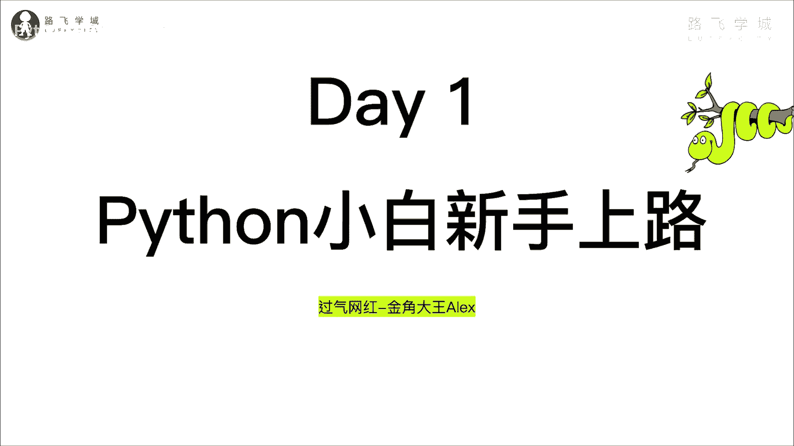
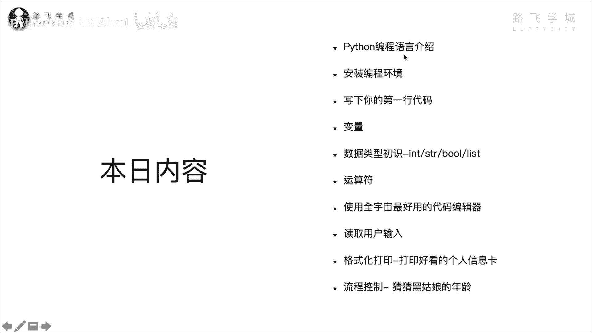
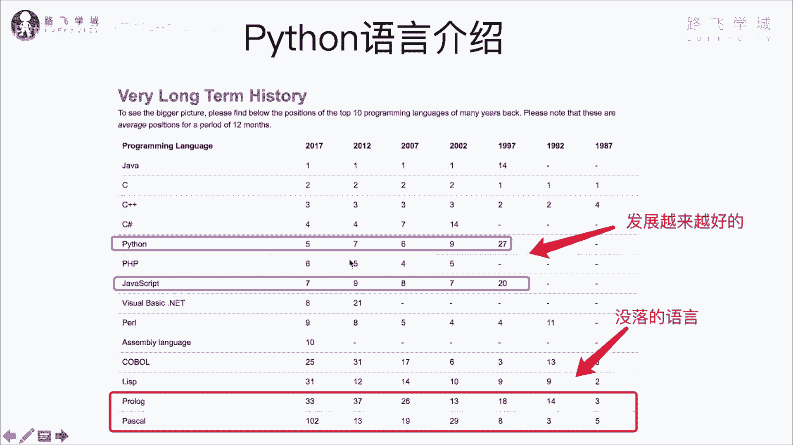
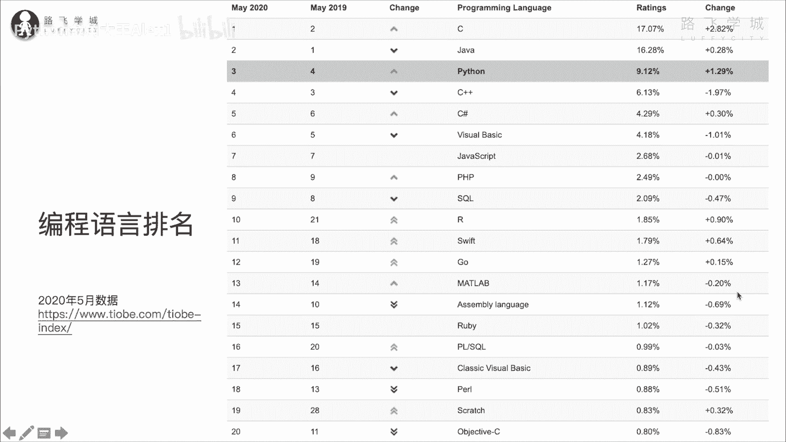

# 【2024年Python】8小时学会Excel数据分析、挖掘、清洗、可视化从入门到项目实战（完整版）学会可做项目 - P2：01 为何Python能屌丝逆袭？ - Python金角大王Alex1 - BV1gE421V7HF

哈喽哈喽，同学们大家好，我是过气网红讲师金角大王ALEX，那今天呢咱们就开始咱们python8天，这个从入门到放弃集训营的那么一个课程，今天第一天叫Python小白新手上路，即便你是一个纯小白。

一行代码没写过，保证你学完今天之后，能写出来50行一样的代码。

好吧呵，那咱们直接看今天的内容啊，今天内容呢要学这么多东西啊，这个首先花点时间介绍一下Python，安装Python的这个编程环境，写下你的第一行hello world代码，学习变量知识。

学习数据类型运算符啊，然后学习这个全宇宙最好用的代码编辑器，读取用户的指令啊，这个按照用户指令去做事情，然后开始打印打印好看的个人信息卡格式化，打印流程控制，猜年龄的小游戏，对今天这个知识量比较多啊。

差不多全学完的话小两个小时啊，一个小时一个多小时啊，学一个多小时练吧，OK那学完了之后嗯对吧，那这个你就可以写代码了，OK咱们废话不多说，先看第一小节，就是Python编程环境的编程语言的一个介绍。

那说到这个Python大家你自己肯定也了解了一些，那众所周知呢，它已经是全球啊，全球的这个什么呀，三大主流编程语言之一，与C和java并驾齐驱啊，在并且呢，呃他与java这个和C这两位编程界的大佬啊。

这个长期霸屏编程语言排行榜的前列，不同的是啊，这个Python是近几年才郁金突起的，并且爬到了前三的一个位置上，他活脱脱的是一个屌丝逆袭的故事，大家看这张图，这张图呢就是一个编程语言排行的那么一个啊。

一个权威网站，它每个月都会进行所有编程语言的一个排行，根据这个使用的情况，那大家来看是一个Python，python97年开始上榜，虽然他89年诞生啊，但是前面都都默默无闻，就是比较小众。

97年之后开始这个把它放到排行榜上的话，是27位，02年到了九位，076位，012年到七位，17年到了第五位，结果现在呢到了第三位啊，从19年开始到了第三位，OK吧到第三位让大家来看这个什么呀。

这个说java和C是长期霸屏的，大家看这个java是995年诞生啊，95年诞生，97年上榜是刚开始14位，02年一位第一位，第一位第一位啊，C语言也是除了第一就是第二，哎那同学们说了。

你看这个java和C语言一直排第一第二，那很显然是他更牛逼啊，那我直接学java和C不就行了，为什么还要学Python诶，此话差矣，话说啊，这个全球的编程语言有600多种，我管600多种哦对吧。

那这个每个编程语言都有自己的优势劣势，有的编程语言它是可能只做专定向的，某某些特殊的一个功能，比如说像R语言，他就主做这个数据分析对吧，有些这样，那像java它虽然是一个综合性的语言对吧。

但是呢他也有他比较擅长的地方，比如说一些一个大型的这个啊，像ERP软件的开发，就是这种非常复杂的这种工业软件，然后还有大型的网站，像淘宝网这种对吧，京东网这种对吧，还有这个他在啊安卓都是java开发的。

所以呢他有他擅长的东西，但是Python也有他擅长的东西，比如说Python在做爬虫方向，在做数据分析，人工智能方向，再做自动化开发，自动化运维方向对吧，都是啊排异，这说白了就是优先选用的语言，对不对。

所以你要是说非得拿java来做爬虫，那就不合适，你会做的特别别扭，不是说不能做，做得特别别扭OK吗，所以那大家现在学Python Python火，就是因为他在AI方向，数据分析方向啊对吧。

比较比较这个出众，所以大家在这些领域主要去用它，OK吧，你说我还就是做什么移动端的开放，那你当然还是可以用安卓，是不是啊，唉那像C语言也是对吧，你做这种比较高并发，像像那个搜搜索引擎对吧。

像百度这种搜索引擎，像这个复杂的网络游戏对吧，像那个王者荣耀，它对性能要求非常高，大家知道C语言比较快对吧，那所以他在这种你就用C语言，OK啊，不同的语言，不同的场景，你选择用不同的语言好吧。

那接下来看这个像JAVASCRIPT对吧，这是做前端开发的，他也是这几年越来越火对吧，这个刚开始20名，后来越排越靠前，越排越靠前啊，所以啊大家知道你看这个Python就是一个屌丝逆袭。

大家看这个往下走的语言对吧，一开始对不对，排排在这个前前三前五的位置，到最后现在排在100多名，排在30多名对吧，这就是没落的一员啊，全球600多种，现在流行的就是二三十种语言好吧。

那Python排前三，是全球程序员最喜爱的编程语言之一。

OK吧，大家看这个是最新的啊，2020年5月份的排名，他排第三位，去年5月排第四，对不对，这个这个这个这个这是这个啊，他的一个排名的一个情况对吧，排名的情况现在这两年比较稳定了，一直处在一个第三的位置。

大家可以自己拿这个网址去看好吧，OK那这个编程语言的介绍啊。

就给大家讲到这，那我要问大家一个问题，说Python为何能逆袭，也就是说他为何从20多名，一下子跑到了第三名，对不对啊，第三名，那首先我从这么几个维度来说，主要是它的开发效率是学习曲线生态圈啊。

在所有语言里几乎都是排第一位啊，排第一位对吧，那运行速度当然它没有排比对吧，它它不不快，这是大家诟病Python的一个原因，但是没关系，我们先从前面来看一下，首先你评判一个编程语言的这个优劣啊。

它有多种维度对吧，一般就其实就是包括我说的这几种，开发效率对吧，学习起学学习曲线啊，生态圈运行速度等是吧，那Python这在这三个领域，这三个领域它是排第一的，排第一的，首先是看那个开发效率啊。

Python这个开语法，它整个语法，你后面学的时候发现它非常简洁明了啊，简洁明了，然后呢又有丰富的现成的各种模块库，模块库，就是你你就理解为它是个工具箱，工具箱里装着各种东西对吧，你想这个砸钉子。

你就拿锤子出来，你想干别的，你就嗯这个这个这个这个，比如说想想这个拧螺丝，你就拿螺丝刀出来，所以就是说它怎么讲，它这个模块库很丰富，你想开发什么功能都不需要重新造轮子，OK吧，不需要重新造轮子。

直接在前辈写好的代码的基础上扩展就可以，扩展就可以啊，所以可以大大的提高你的开发效率对吧，那这是开发效率，所以它就非常高啊，你就你你你做一个软件，用Python你可能写一个月。

但是你用java就得写俩月，所以大家现在对吧，是这个这个做事情都要求效率嘛，所以这个嗯就选Python的会比较多，创业的公司啊，会选Python做开发的比较多啊，另外他的学习曲线什么意思。

也就是说怎么学习难度啊，Python的这个Python应该算是对吧，最适合小白上手的一个语言了啊，很多人觉得计算机难学，我告诉你啊，是因为他一开始啊就没有选对语言啊，选对语言。

像咱们大学里这个计算机专业一开始上来啊，先给你搞C语言，最最难的那这种全都放弃了，因为C语言它是1970年啊开发出来的语言，它到现在已经五六十年了，他那个时候开发那个语言的时候，我跟你讲。

哎那个内存都非常小对吧啊，这个CPU的运算非常慢，所以他必须对，他就导致这个语言就要求对硬件的这个操作啊，这个这个非常的谨慎，因为你不一不小心就这个导致你这个程序对吧，崩了对吧。

因为你整个的内存空间都很小，所以他就要求你这个C语言，你必须自己管理内存空间呀，这些东西就我跟你讲很复杂对吧，大家说什么指针啊，链表啊这些东西啊，你一听都懵逼了啊，我当时学的时候听就懵逼了啊，学了半年。

对不对啊，只会写指针两个字啊，所以导致对吧，你一开始学就他不符，就是大家学编程的这个逻辑，它不符合这个这人类的正常学习曲线对吧，这个这个这个一上来就是先难后易，我告诉你这个不行对吧。

正常的人性学习曲线是什么，由简入繁对吧，先易后难，是不是啊，所以呢你一开始你觉得难，那些觉得变成难的就是一你没选对，一开始如果你学的是Python，你就会发现卧槽编程其实并不难学啊，编程并不难学啊。

好所以呢这个大家啊为什么呢，因为Python我告诉你，它即可你学Python就跟学英语似的啊，就非常简单，他把复杂的东西全都给你封装好了，你看不到，你只需要简单的操作啊就可以了。

OK那接下来它的生态圈是第一啊，Python自九八呃89年诞生啊，这个到现在30余年了，30余年了，比我都大好几岁啊，他在i it技术的各个领域方向对吧，都发展出了强大的生态圈啊，it技术有很多领域。

比如说人工智能，数据分析，爬虫，游戏开发，软件开发，自动化开发，web开发，后端开发啊，图形化开放啊，科学运算对吧，这个非常多，Python在这些领域，对不对啊，在Python在这些领域都是全面开花啊。

全面开花对吧，这个这其中对不对，这个人工智能啊，数据分析啊，爬虫啊，这是属于首选对吧，这几个领域是首选对吧，其他领域像游戏开发呀，外部开发呀，他也比较强啊，比较强，所以他在，所以他就被称为什么呀。

万能语言就是什么都能干对吧，就什么都能干，又称为被称为编程界的瑞士军刀，什么编程器瑞士，你这是对吧，用一堆工具啊，一个刀弄开，可以干各种事对吧，所以这也是大家为什么要选它对吧。

也就是说为什么现在像菲律宾这种语言没落了，因为PRP他几乎只能做网站啊，有的人非得非得非得这个抬杠，说PRP他也可以这个做做，做这个什么做这个啊，爬虫对吧，也可以做什么数据分析，哎呦你这仇人对不对。

你这个叫这个这个这个不论是不遇傻瓜论长短，就是他非得叫这个人抬杠没有用，不是说他不能做java也可以做各种事，只不过是他有的地方不擅长对吧，那Python是在这某些领域非常擅长，所以到偶质对吧。

这个这个啊这个大家都用它，所以它生态圈非常强大啊，另外一个啊就是这个什么呀，运行速度啊，运行速度这个肯定Python就不快啊，Python不快，为什么呢，因为他这个在这个什么呀。

在这个呃就由于他这个语言特性啊，因为咱们是一个是一个体验课是吧，所以我不给大家讲太多底层理论，你要知道的是，Python它是一门动态的解释型语言，你记不住，你都忘记就行了，就是他的这种编程语言特性啊。

它跟它跟C语言的那种编程语言的，这个底层原理是不一样的，OK吗，C语言是C语言，它被称为最快的编程语言对吧，因为它直接是几乎是直接跟这个CPU硬件去啊，沟通的对吧，你你你直接操作CPU啊。

这个它的速度肯定就会快，但是Python呢你先大概理解一下Python，它是需要一件一个翻译，就是这么讲啊，假如这个计算机是一个美国人，假如计算机是一个美国人，他说英语对不对，那这个C语言，C语言。

C语言，我这个舌头啊，C语言也是一个美国人，所以他跟那个两个美国人之间，直接母语英语沟通就OK了，但是Python就像是一个中国人对吧，你要是想跟美国人沟通，你必须干嘛，你必须先去把你的汉语翻译成英语。

那Python注意了，他就有这个过程，就是他要把汉语翻译成英语OK吧，但是C语言不需要OK吧，所以C语言会比较快，Python有个翻译的过程比较慢，像java它也是需要翻译。

OK吗啊那所以呢怎么讲它在运行速度方面，它肯定是没有办法跟C语言进行对比的对吧，这个啊但是注意了啊，但是注意了同志们啊，这个什么呀，这个这个这个这个其实这种慢。

比如说这种因为说Python有个翻译过程嘛对吧，但是这种慢是大多数情况下人类无法感知的，OK吗，他必须借助一些专业的测试工具才能体现出来，说啊，这个比如说同样的功能用Python它比C要慢很多。

对不对啊，但是这个所以就是说在大多数情况下，我们平常写的一些程序，我告诉你，根本他对速度的要求没高到，那个没没到那个程度对吧，没到那个程度啊，OK比如说举个例子啊，比如说举个例子。

假如说你要写一个程序啊，写一个程序，你要花这个什么呀，你要花这个啊，算了啊，鸟花这个叫啊啊，写一个写一个程序，甭管什么程序了，你就花0。1秒啊对吧，这是用C语言写的对吧。

但是你用Python呢写花的什么呀，花了啊对对，用C语言写了0。01秒，用Python呢写成0。1秒啊，这是Python，OK吧，那这么来看的话，你看这个0。01啊，这么看C是比Python快十倍的。

对不对，但是这种快十倍是我们人类感知不到的，对不对，因为人类能感知的，这个时间是0。3到0。4秒之间啊，也就是说这个片段之间你能感到啊是快还是慢，但是到0。01到0。1你是感受不到。

但是它实际上C是比它相当于这么就快十倍了，对不对，那所以呢在咱们写的这个程序，大多数程序啊，我告诉你，Python都是这个都是可以满足它的速度要求的，啊对吧，除非你写一些真的是用户量非常大。

比咱们刚才讲说这个什么搜索引擎，像什么网络游戏，你用这种C语言无疑了，对不对，但是大多数你写一个网站啊，写一个什么爬虫，我告诉你用Python完全没有问题，所以呢这也是说对吧，这个大家其实并大多数人。

大多数情况下并不care Python man的问题，只不过那些钻牛角尖的抬杠的，或者是真正的大牛，人家就是写那种对吧，这个这个对吧，像百度啊，像BT这种这种这种大牛级别的，写这个网络软呃。

这个游戏软件啊，这个搜索引擎对不对，用户量特别大的啊，才会考虑这个情况好吗，这个就是它的一个整个的情况，所以根据这三个特点导致Python他逆袭了，OK吧啊，这个就是Python一个基础的一个介绍。

