# 【2024年Python】8小时学会Excel数据分析、挖掘、清洗、可视化从入门到项目实战（完整版）学会可做项目 - P72：05 os & sys 模块使用 - Python金角大王Alex1 - BV1gE421V7HF

OK同学们，这一小节我们来快速的学这两个模块，os and cs啊。

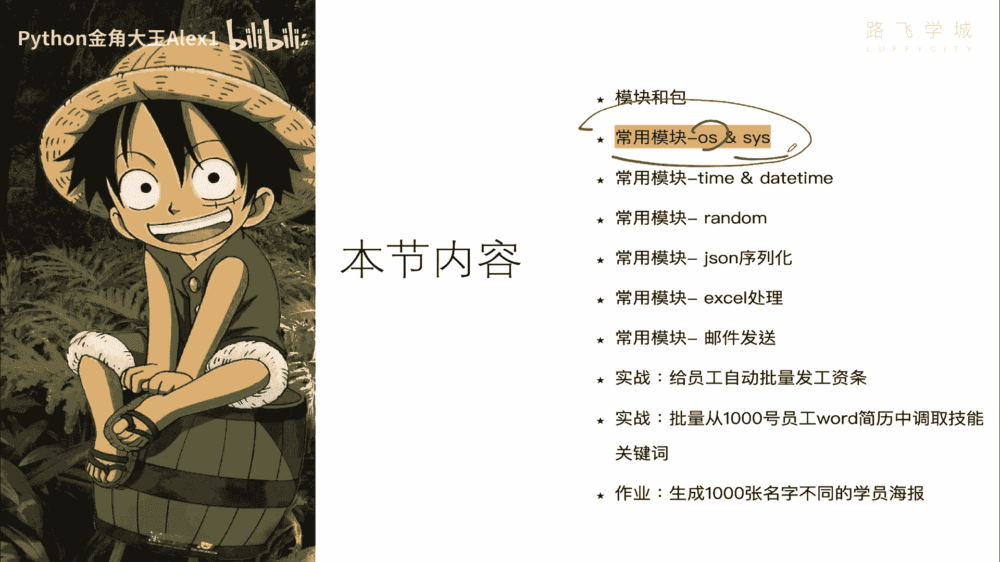

其实都很简单，没有什么逻辑性可言，那这些模块里面的几乎大部分的功能，我都给大家列出来了，每一个是干嘛，每一个是干嘛的，所以咱时间有限，我不挨着给你敲了啊，因为咱们这个集训营地好多用不到啊。

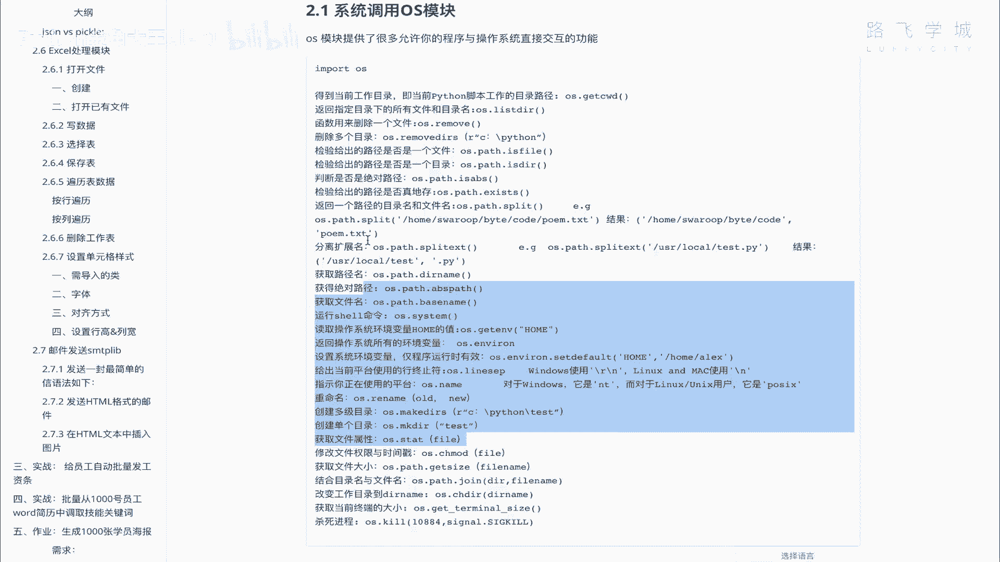

我只把这个几个常用的给大家啊，咱们一块来快速的看一下好不好。

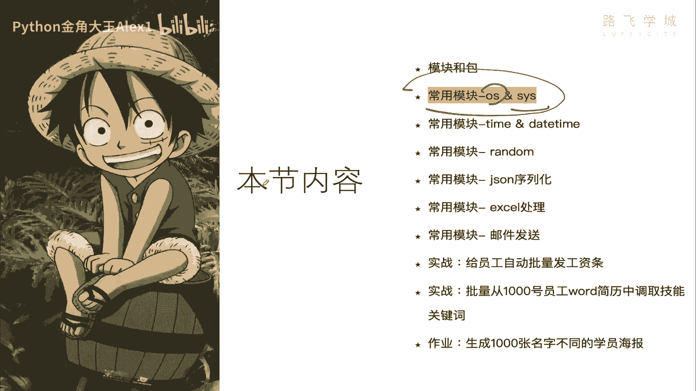

那常用的OS模块里面这里有两页，咱们从第一页开始看啊，首先得到当前这个Python脚本的，当前Python脚本的工作路径啊，也就是说说白了什么意思呢，就是你你比如说你你这个。

你这个你这个你这个脚本是在哪里执行的，比如说你在这里开始调用一个啊脚本，调用你这个叫什么呀，模块导入啊，那你当前的工作目录，就是属于在当前这个路径下明白吧，也就是说你的解对，或者这么讲。

你从哪里哪个目录下开始去调用你这个Python脚本，你获得的这个当前工作路径就是哪个路径，能理解意思吧，哎你可以自己试一下，你自己试一下，比如说我在这里啊进入一个交互模式，Import os os。

点get CCD wd，这是在哪呢，哎这个是你看我当前的目录，就是在这看到没，当前交互器就给我获取的当前工作目录。

然后另外一个另外一个是什么呀。

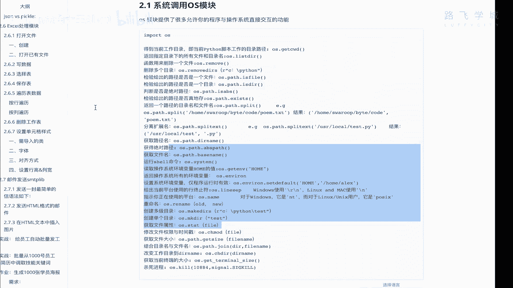

呃历史DR诶这个是有用的，就是获取当前目录下的文件，所有文件，OS点list dr，所有文件和目录，都给它当做一个列表的形式获取出来，所以如果你想便利你这个什么呀，你便利你这个啊。

当前目录下所有的这个文件的话，你就可以for循环是吧，这个列表，然后每个都给他打开。

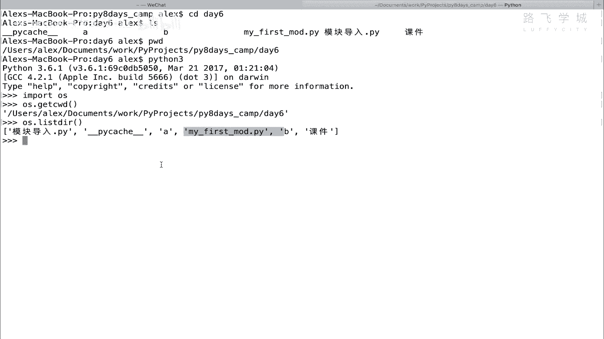

是不是啊，接下来就是这个呃什么呢。

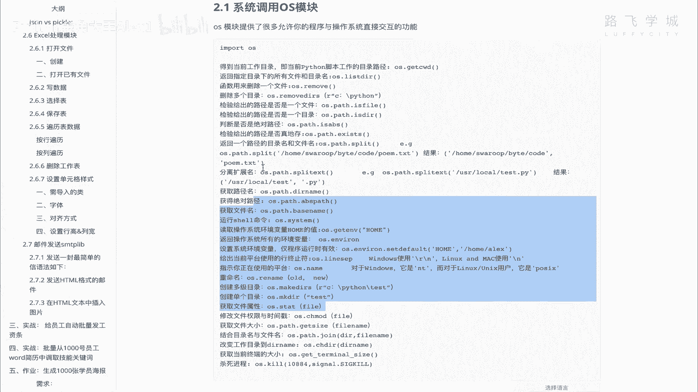

sorry哎呀呀呀呀呀呀呀。

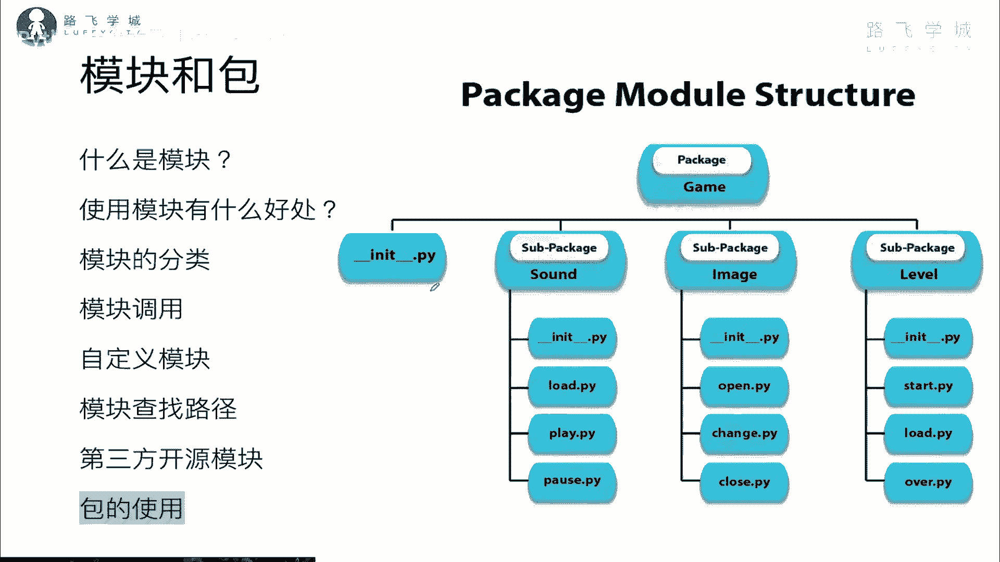

接下来就是OS点remove，remove是删除一个目录。

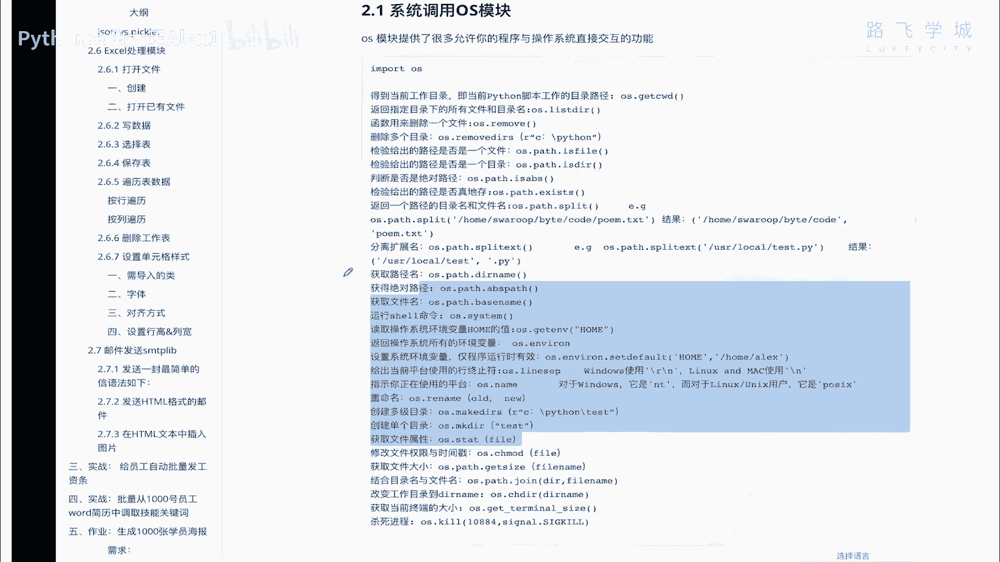

删除一个目录啊，这样我，好remove是删除一个，那现在我有一个呃这个这个什么呢，嗯文件我在这里创建一个文件吧，我先创建一个文件啊，就是CP，然后my first mode啊。

这个model test看到没有，我创建一个文件，然后我就可以直接在oi用OS点给它删除，你写对了啊，Mode test py，哎他就这个文件就已经给它删除掉了是吧，你再看这个文件已经没有了好吧。

那接下来还有什么功能呢，还有什么功能呢。

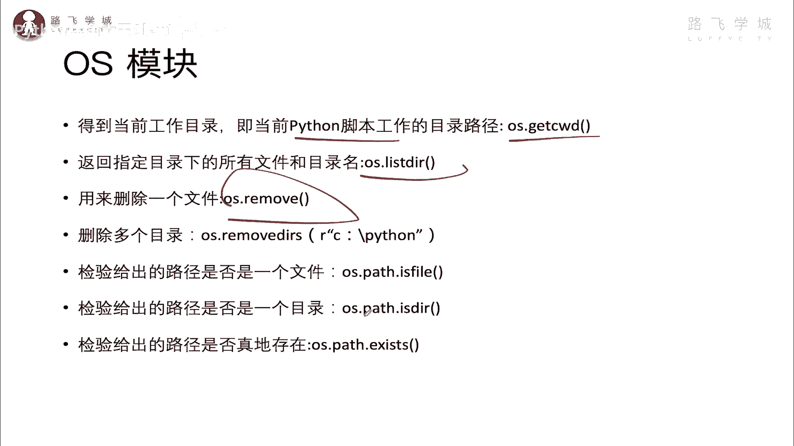

就是remove dr，它是把整个目录都给你删掉啊，整个目录比如说我想在这里把这个A目录删掉。

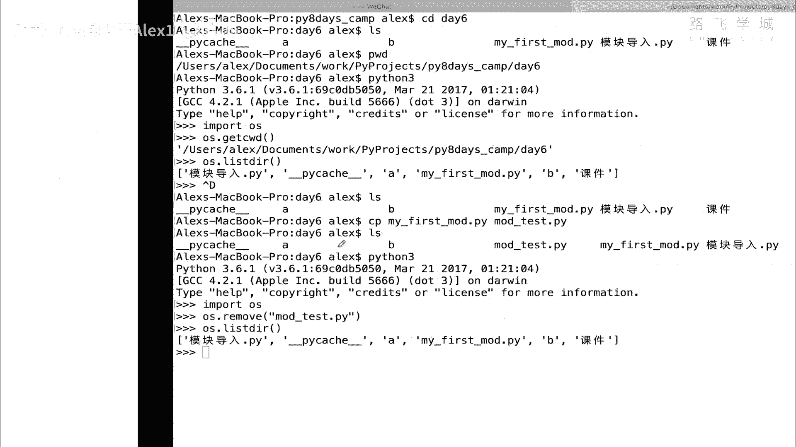

你直接写就行了，你自己试一下，我不想删哈，is file啊，OS点pass，注意这里加了个pass pass，is file是判断你这个是不是一个文件，是不是一个文件。

比如说OS点pass点is fire is file，然后呢我就判断我这个A它是个文件吗，NO它是一个目录，我如果判断这个啊，my first node点PY，它就翻了哎，哎写错了就返回了true。

对不对，然后DR就跟这个相反的，你试一下就行了，然后接下来看这个叫什么呀，检测这个路径是否真的存在啊，就是这个路径是否存在，我们来啊看一个路径啊，看一个路径是这个路径，看到没有，哎。

这个路径呢我们检测一下它是否存在呢，他肯定是存在的，大家看它就返回true，那你当然输入一个不存在的，它就返回false，好吧，哎这个就是啊讲的路径存在，另外获取路径名。

这个我们已经用过了dr name，对吧啊，路径名不要文件名叫路径名，然后获取绝对路径，哎这个是其实是有点用的啊，比如说你看啊，大家看os list dr，他就是直接写啊。

显示当前目录的这个所有的这个文件，然后呢我把这个文件看着啊，我想获取它的绝对路径啊，OS点pass点abs pass哈，然后呢他就给我干嘛呢，他会把前面的它的整个所，它所在的绝对路径给我打印出来。

这个其实有的时候还挺有用的啊，你比如说你对吧，你想你想拿到这个文件，然后在一些特定情况下，你不知道这个文件的路径对吧，那你这个这个这个这个你你你，但是你不获取到这个文件的路径的话，你可能呃想想去打开它。

你知道知道文件名，但是想打开可能就比较麻烦啊，就打不开对吧，因为你没有文件路径啊，所以这个这个还是有用的啊，知道就行了，好，接下来是base name，这个是干嘛的，获取文件名，它只获取文件名啊。

只获取文件名，我来看一下，是不是只获取到的文件名啊对吧，把那个路径名去掉了，然后这个运行shell命令，就是运行这个操作系统的指令是吧，OS点system，其实我们已经试过了，对不对，system啊。

咱们可以运行一条对吧，是这个DF用户的，运行这个这个这个这个you name吧，you name是查看操作系统的这个版本，我是达尔文的操作系统啊，因为是Mac的是吧，你那个电脑上windows的话。

windows的话你是可以运行这个的IP configure，应该是对吧，IPCONFIG就是查看那个网卡，网卡信息好吗，然后rename rename是干嘛的，文件重命名，把一个旧的名字改成。

就是把一个文件给它改名，看到没有，那这个我现在就是OS点rename啊，然后把这个什么呢，把这个啊模块导入，给它改成漫画导入二，这个时候你再看一下文件，其实就已经什么了呢，就已经改了，是不是改成二了。

对不对好，那接下来OK大家看这个啊，这创建多级目录，看到没有，你可以创建好几层，那我们在这个什么呀，PYTHM这里来试一下，我直接在这个地方直接OS点啊，叫make di。

然后呢我就在这里创建一个什么啊啊，CDFG可以吗，就一下子就创建很多层，咱们试试可不可以啊，大家看是不是就出来了对吧，是不是出来了，那这个是MAD，然后MIDR你自己试一下啊，创建一个目录啊。

创建目录啊，这个还有点用，就state file，这是什么获取文件的详细属性，我们来去获取一下啊，这个啊这个什么呢，print嗯，OS点state下的谁呢，呃这个什么呀。

OSOS杠mode点PY获取这个文件的什么属性呢，大家来看一下，哎大家看你看这个结果，这个结果啊，这个结果里面就是什么呢，你可以拿到它的，这个是它的权限数据啊，你就不用管，你不用管啊。

这个现在咱也不解释，这里面有一些这也是他的权利，这是属主的，这个是什么账号的id，就是谁创建的这个人谁创建的这个文件啊，这个账户属于哪个用户组的，唉这个你都呃如果懂点LINUX应该都知道。

不懂我也不解释了，大家看这个你要知道这个是什么呀，是你的创是你的这个文件大小啊，按字节来算的，这个是你的什么呀，啊这个叫叫叫这个是创建时间，看到没有，这个是创建时间，Same time。

这个是这个是什么呀，这个应该是修改时间，M time，我忘记叫什么了，还有一个a time，反正反正是最最后一次修改时间，什么创建时间，然后修改时间就类似这种啊，类似这种啊。

这个其实重点是拿这个和这个这种创建时间，修改时间其实还有点用的，比如说你想监测文件有没有修改过啊，那你就可以通过这个OS点state之后，你拿到这个信息之后，你就可以直接拿点啊。

s t size就可以了，看到没有，他就直接把你那个文件大小就可以打印出来，好吗啊，就是这个啊，另外还有一个专门的命令，get size也是可以获取文件大小的，知道你自己可以试一下好不好。

哎这个就是OS模块啊，OS模块咱就不不多给他，大家在这讲了啊，你也不用非得记住敲一遍就行了啊，那接下来再来看一个一个cs模块，你看cs模块我都没写上来啊，因为这个模块我们在这里能用的东西啊。

其实现在呢我们学的这个东西，基本上都就是都差不多用了啊，cs啊，cs点它这个能我们能用的这个什么呀，你别看它那么多啊，那么多呢，现在我们其实都用不到啊，都用不到以后可能会用得到。

你只需要知道一个C4点pass，和C4点ARGV就可以了，这个是获取系统环境变量啊，这个是干嘛呀，获取那个这个脚本的那个参数，是不是脚本的参数就可以这两个命令啊，然后C4点还有什么呀。

就其实是没有什么呃，其他的这些呢，对其他这些我们其实现在都用不到啊，你就记住这两个就可以了。

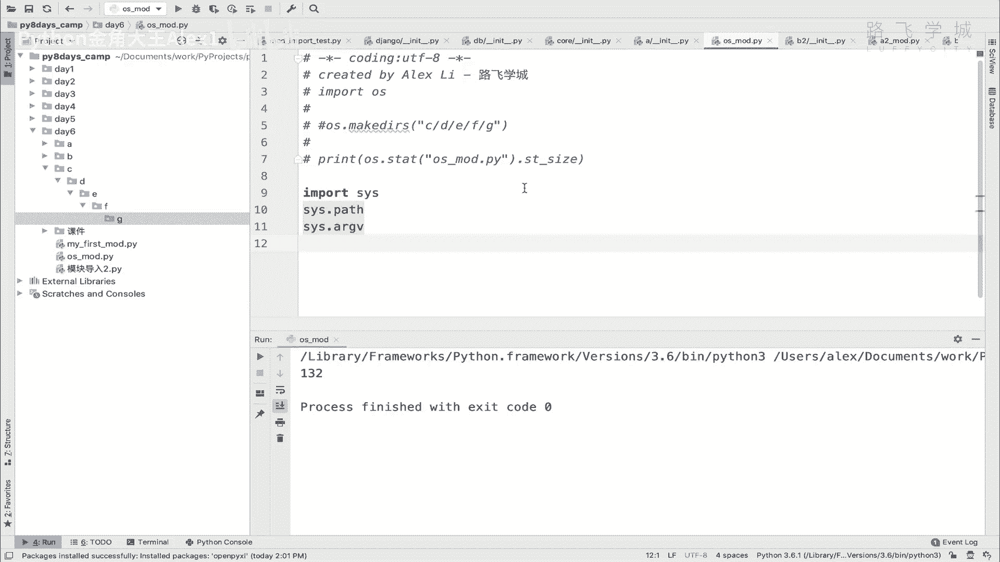