# 【2024年Python】8小时学会Excel数据分析、挖掘、清洗、可视化从入门到项目实战（完整版）学会可做项目 - P95：01 数据分析S03D01（上） - Python金角大王Alex1 - BV1gE421V7HF

好了咱们同学们都到了啊，咱们测一下声音，大家能听到我说话吗，听到我说话，在那个讨论区帮我扣个一啊，OK好的啊，BGM让你失望了哈，sorry啊，随机点了一个啊，不过咱们今天是来学干货的，对吧啊。

这个这个小老师的这个小品位啊，就不要不要那个啥了啊，然后我们还有3分钟啊，咱们再稍等一下啊，稍等一下啊，等等，咱们八点人人差不多了，咱们就开始正式开始讲啊，好了，先聊几句吧，哈哈3分钟啊。

咱们同学们都是做什么的呀，做什么的呀，都是哪里人啊，小度小度，小度小度是什么，是那个智能音响吗，学生嗯敏而好学哈，行，今天今天咱就带着那个什么带着excel来就可以啊，咱们今天全程是将excel嗯。

然后如果你excel还行的话，今天这个课不会太难啊，所以说咱们主要是对那些呃不太excel，用的不是不算太溜的，然后平时用的比较多的啊，所以今天课主要讲这个，然后今天主要重心在可视化上，然后呢。

我们在后半部分会给大家介绍一个，就是高级的bi工具，excel没装啊，你你你windows windows没没给你带个office啊，开发人员开发人员来搞数据分析啊，也可以啊。

现在有不少开发人员也在转一下测试的，然后运维的，然后早期IOS安卓的啊，也有不少转转数分的，你们平时平时工作的话，咱们工作的同学的话，你平时用的多吧，啊，我知道我知道大家可能在，你们可能会有的是拿手机。

然后有的是拿这个IPAD，然后有的是拿电脑啊，然后呢咱们直播课啊有一些延迟是正常的，不过呢，我还是希望大家能够尽可能多的去提出问题，然后呢尽可能多的跟我交流对吧，要不然的话咱们这个直播课呀。

就不如改成录播课了，OK啊然后我还是希望说能够在这个课堂上呢，能给大家啊，除了课课程之内呢，也能去多做一些拓展啊，大家当然就是大家感兴趣的东西啊，不论是技术啊等等方面都一样啊。

excel正版不用买正版的啊，你现在一般买电脑偷偷带一个嘛对吧，就算不带的话，淘宝几块钱也能买一个正版，给你直接安装的那种，好了，咱们八点差不多了啊，然后呢啊这个有个小秘密就不告诉别人了。

你们在直播间都会知道啊，就是我会给大家偷偷录个屏吧，因为正常咱们这个课是没有录屏的对吧，所以说这算是咱们同学们，来到直播间的一个小福利吧，给大家录一个吧啊那明天录不录就不知道了啊，啊好看啊，怎么录一下。

OK啊啊这个然后我先我先这样吧。

我先说一下我们今天的这个课程主题啊，咱就不说废话了啊，课程主题，咱们进咱们这个整个这个X2excel，这个数据分析的集训营，那我们是以这个数分数据分析为出发点，然后给大家设计的这么一套。

适合我们这个在职人群啊，或者是一些小白人群啊，啊会给你啊，会给你发的啊，录播会给你发啊，然后呢给大家设计了这么一套呃，这个很轻量级的一个学习的一个小课啊，就是我们三天时间可以搞定。

我们最终可以做到什么程度呢，就是大家可以做到，我们除了可以用excel和这种高级的bi工具，做一些可视化之外呢，你可以做一些可这个这个可交互的啊，这样一些可视化大屏，然后呢。

你还可以用excel去做一些高级的一种统计工作啊，另外呢我们还可以就是在excel之外啊，excel我们可以简单的应用一下Python，去解决一些你日常工作当中啊，在excel之外的一些问题啊。

比如说PPT的文档的读取啊，格式转换啊，批量文件的处理啊等等啊，这些我们基本上我们在课课前呢，在那个课程介绍里面也给大家说了啊，所以说咱们这几天的直播课啊，加上咱们课下的一些录播。

然后包括咱们这几天在集训营，在这个期间内啊，然后我们呢还虽然说答疑成本很高啊，但是呢大家有什么日常的啊，工作当中的一些问题都可以在群里边去艾特我，或者是艾特拉你进群的那个课程规划师啊。

所以说你们在日常工作当中碰到的一些问题，也可以在这几天呢咱们跟老师们啊，然后以及跟咱们圈内的同学们，可以做一些交流啊，算是给大家扩展一个圈子，OK啊，那我先做一个简单自我介绍啊，容我花2分钟时间啊。

自我先吹吹嘘一波哈，吹一波啊，那么这个人就是我了啊，就是现在你们听到这个声音，就是这个人发出来的啊，然后呢我叫啊，我我姓郭啊，我叫郭崇志，然后一般的网上名字都叫dancer。

然后呢那么一般我因为我87年，所以说很多同学没有带啊，一般会叫我一声智哥，我也听习惯了，所以就把这个名呢作为我的一个艺名了，我现在是在在咱们路飞学城呢，担任咱们数据分析学科的教学总监啊。

还有这个AI学科教研总监，然后呢我做了11年的it这个行业的开发，包括教学啊，所以说呢啊今天啊然后最近几年正在主攻算法，然后呢我也在卡口上啊，去参加过一带团队，参加过一些项目啊。

所以说咱们咱们未来三期的直播课呢，都是由我主讲啊，当然你们在听那个录播课的前前两个章节啊，就第一天数分的那点事儿，然后第二天excel那点基础，那个是我们的一个同事，ta老师给大家讲的。

然后第三天到第四天啊，就是代码阶段都是我给大家录的啊，然后直播也是我来，OK好我们就算简单认识了啊。

好那我们今天直入主题啊，第一个主题就是说我们的这个图表啊。

图表它的一个使用场景是什么，使用场景是什么啊，这个excel不用装2021啊，20110以后就可以了，OK啊然后其实我我们在做可视化的时候啊，同学们经常会去做这种可视化，可视化的话。

我们很多时候都会纠结在一些细节上，比如说诶一个饼图我应该怎么画，一个线形图，我应该怎么画啊，但是呢其实我我们在使用图的时候呢，我反而觉得你不要太太去纠结一些细节，因为我说句难听一点的啊。

就说今天的课其实你不听，那么也没有人会拦得住，你说我用excel去做图表，这个工作只可能说我效率低一点，但这个其实不是本质问题，本质问题是什么，是我们图表用的到底清不清楚啊，什么叫清楚。

就是这个图表你的意义是什么，我们是我们说白了一个图，我们是要能够更快速的，去把我们的信息呢表达给对方，让对方呢以最短的路径去理解，我们想表达的含义对吧，这才是我们用图表的一个最初的一个初衷啊。

那至于后边的所所谓的美化呀，或者所谓的交互啊，它都是要围绕着我们这样一个初衷对吧，我们去做的一些优优化啊，所以说呢啊我们在使用图表最最开始之前呢，你就应该明白我们在使用图表的时候。

我们往往表达的是几种不同的情况啊，所以说呢我们在这块呢做了一个总结，实际上呢你不论是用图表还是用用什么，其实你也就是说我们在扩展的大一点，你在做数据报告的时候啊，你想展示一些信息的时候。

其实本质上呢无外乎就那么几块，这几块分别是什么呢，其实就是诶其实就是什么呢。

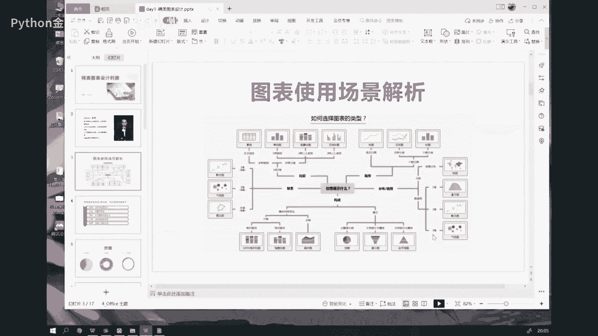

我就直接最大化啊。

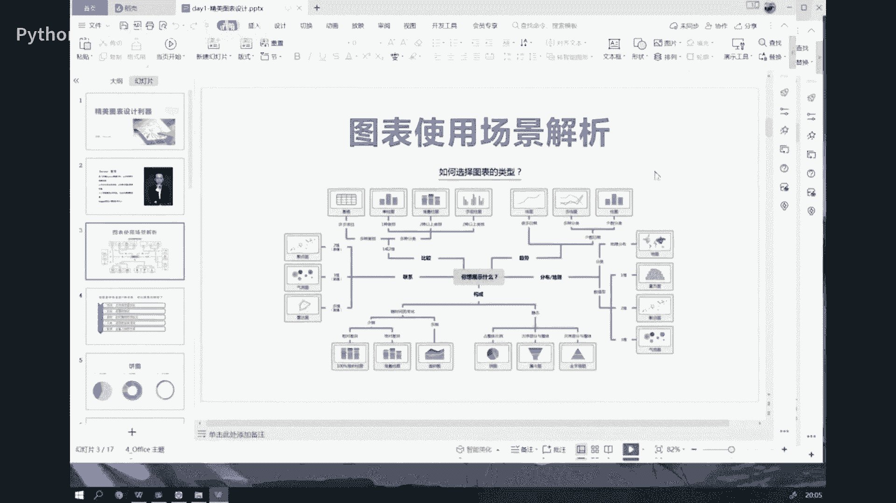

第一种呢就是比较啊，这种比较关系，比如说我们想去表达这个多个类别啊，多个类别，比如说A产品，B产品，C产品他们的一个销量啊，那我们就是就是用比较关系啊，所以呢我们就会想比较关系的话。

我们有哪些图形可以拿来使用是吧，常规的来讲呢就是这种柱形图啊，或者叫条形图啊，当然了条形图也可以做一些拓展，比如说我们可以拓展成堆叠图，或者说这种簇状条形图等等啊，那他们呢都可以在这个单个对比之外呢。

还可以去拓展一些别的，比如说结构啊是吧，比如说组内啊，组内的一些对比情况啊，啊本质上还是为了表达对比呢，那如果你要你要去做对比的话，比如说这个时候你你如果用这种什么线形图啊，的来表示的话呢。

显然的就是有点这个词不达意对吧，就是图不达意有这样一个意思啊，所以说呢这是第一种啊，第二种呢就是我们想表达趋势啊，比如说我们一个股票的一个，随着时间线的一个变化，诶那这就是属于趋势，趋势的话呢。

往往我们就会用这种什么线形图，这是最主流的一种图像，那么其次呢，那也可以用柱状图呢来表达我们的一个趋势，因为柱柱状图的话，它也有高有低的，对不对，OK啊，然后那么第三种呢，就是我们想表达这种分布形态。

分布形态最多的呢，就是我们我们最常见的，一定是这个什么直方图啊，可能这两年我们见得多的是地图，因为我们这两年疫情数据，经常是以使用这种地图的可视化，方式来进行展示的，因为它表达的更直观啊。

那么我们其实在做统计分析的过程当中呢，啊往往这个直方图用的比较多，好，我想问问大家啊，这个直方图什么意思，大家知不知道，大家知道直方图是表达什么的吗，哪知道的给我扣个一，不太清楚的，给我扣个二好不好。

来大家动起来啊，不太清楚是不是啊，OK啊，稍作解释啊，稍微做一个解释，其实直方图啊，它它我们我们正常来讲是一个柱状图来表达，比如说A啊，AB两组数据啊，诶比如说A它是这个三，然后B呢是二。

我们可以看到A和B它们之间的一个，什么大小关系，对不对啊，但是我现在如果想问，比如说我们中国，我们中国人民的啊，咱们中国老百姓的一个收入的情况，收入的情况诶这种情况的话呢。

我们就其实它本质上描述的是一种分布啊，我们叫单变量分析啊，单变量就是你的你研究的指标，只是一个一个什么呢，一个收入，那收入的话，那我们就可以划分成几个不同的区间，比如说我们从零到2000元是一个区间。

然后2000到5000是一个区间，5000到1万是一个区间，然后1万以上是另一个区间，对吧好，那我们就可以比如说我们随机抽样1万个人啊，我们在全国各地随机抽样1万个人，好。

比如说有3000个是在零到2000这个范围之内的，那我们可以得到一个高度，这个高度呢就是3000，OK然后2000到5000呢，可能我们统计出来是有有这个4000个诶。

那我们得到一个柱高呢就是4000啊，然后5000到1万呢，可能我们得到的是一个3000啊，2000吧2000，然后呢可能它对应的值就是这个2000啊，然后那么1万以上的可能是1000。

然后呢我们对应的是1000这个位置好，这样的话你就得到一个什么呢，一个看似是条形图的东西，对不对，但是它其实表达的是什么，表达的是一种分布形态，明白吧，就说我们发现我们可以看到什么呀。

可以看到2000到5000这个收入群体呢，他们是最大的对吧，所以它描述的是一种分布啊，所以直方图它是干嘛的，他是来表达分布的一种图像啊，这个我们如果你是做这种什么，比如说做统计分析，或者你是做业务的啊。

做业务的一个一个工作，可能你经常会需要用到这种直方图的这种方式，来表达分析啊分布，然后往往我们还会做一些关联分析，比如说我们用户的年龄分布，和我们的用户的这个收入分布，它们之间可能会有一种关联。

那我们可能会用统计学的方式去做一些啊，这样的一些关联分析啊，我可以给出一些值OK啊，另外一种呢就是散点图，它也是来表达什么呢，也是来表达这个分布的，但它跟直方图的区别是什么呢。

直方图它只可以表达一种一个值，我们叫单变量，就是它只表达比如说啊收入的分布形态啊，但是散点图呢它可以表达的是二维数据对啊，两者之间的分布形态，比如说我们的年龄跟收入之间的关系。

我们小费和消费账单之间的关系，是不是随着这个某一项高，另一项也随之增高呢对吧，这种情况呢我们往往就用散点图的方式来表示，这是二维啊，如果更高维度的话，那我们就会用到气泡图，我们可以除了横轴和纵轴。

可以表达两组数据之外呢，这个点的大小啊，这个大小也可以表达另一组数据，像这几个图呢我们今天都会讲到啊，然后就是分布啊，那么除了分布之外呢，另外一个我们可能常用的一个表达场景啊，就是构成啊一个组成。

比如说我们去年总全年的这个GMV销量啊，啊GMV值啊，就全年的这个总的建V值，就是我们的销售总额啊，销售总额这边是包含退货总额的啊，这个总额呢，它里边ABCD4类产品各自的是多少对吧。

这就是一种构成的一种表达形态啊，哪一种产品是我们的主流产品啊，我们可以用这个什么饼图，就可以很容易地把它表达出来，诶这是一种构成的形态，当然这种是常规的，我们可能见得比较多，还有一些呢比如说金字塔图诶。

这个图我们也比较常见，它往往比如说我们分析这个人口的结构啊，或者我们的收入的结构啊，对吧，都可以用这种金字塔的方式来进行进行表示，还有一种呢就是我们在做这种运营的啊，运营的这种岗位当中呢。

我们会用到的图就是漏斗图，比如我们想描述一个用户的付费完整事件哎，从我们看到产品的展示页，然后到我们点击进入到详情页，然后到我们点击这个订单啊，我们点勾点击这个购买，然后点击付费完成对吧。

然后一直到最后一单完成啊，整个这个过程呢，它其实可以描述为一个漏斗的一个，这样的一种形态啊，那么它可以就可以追溯什么呢，追溯我们整个这个我们这个用户的付费事件呀，它的一个每一个环节上的一个转化率对吧。

那我们就知道每一个转化率上呢，我们就可以去有针对性的，去对各个环节的转化率呢，去做一定的这个归因分析啊，然后我们做一些优化的手段啊，我们去促进这个转化率的不断提升，OK啊这是一个。

所以漏斗图也是一种我们表达构成的啊，比较常用的一种东西啊，一个图像，另外一个呢就是我们也会有一些变化，比如说我们随时间而变化的这种构成啊，比如说像我们这个面积图，面积图啊。

那它其实就是一个我们线形图的一个，一个变种啊，它的面积呢来表达我们的一个数量啊，它不但可以看到我们构成对吧，还可以看到我们一个趋势，还有就是这种堆叠图啊，还有这个百分比堆叠图。

我们不但可以看到组与组之间的大小关系，我们可以看到组内的每一个啊，组内的成分的占比，OK这是都都是构成，那么另外一种就是表达关系哎，表达两种关系，所以说散点图呢它也可以用到这个里面当中啊。

还有就是什么呢，我们这个三维的啊，这个气泡图，那么另外一种呢就是我们这个雷达图，比如说我们玩那个王者荣耀吧，每每打完一局，我们会看到一个什么，你你这个每一盘啊，每一局游戏，你局内的一些表现对吧。

这种情况就是用雷达图来表示的，还有比如说我们玩那种网络游戏啊，各个这个职业之间的这个强弱划分对吧，都可以用这种啊，雷达图的方式来表达他们之间的一种关系啊，一种联系，OK所以说呢我们简单归纳一下。

实际上呢我们想去做一个图表的一个应用，之前呢，你就应该明白，就是说我们想说什么，然后我们再选择什么，对不对，这个有一个有一个这个人名人吧，算是那么一句名言吧对吧，他说人啊，人会不会说话。

其实不在于你的口才在于什么呢，在于你的思维对吧，那我们其实在做数据展示的时候呢，也是一个道理，你的思维上，如果没有一个正确的一个建立的话啊，那么我们在表达的时候呢。

一定是会有一些含糊其辞的一些东西出来对吧，就会造成我们表达可能会选择冗余，或者说不清晰的这样一个啊窘窘状，OK好，那么我们有了这样的一个基本的一个对图形的，一个应用场景的啊，这样的一种感受之后啊。

我们再去学各种各样的图像，我们才啊有意义好，那么接下来呢我们就会给大家说一下啊，各类图像的他们在excel当中的一个使用情况好。

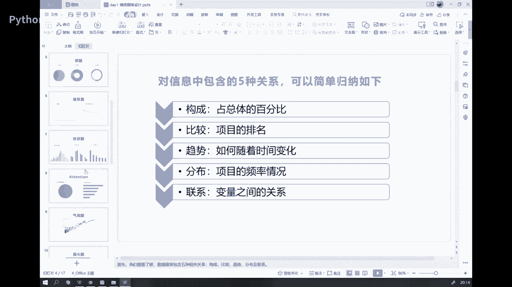

这个课件啊，我我们同学们应该都拿到了吧对吧，如果没拿到的话，可以去找拉你进群的那位老师跟他要一下啊，就这个excel可视化的这个excel文件啊，好我们把它呢就用excel的方式打开啊。

你也可以用WPS，但是不建议啊，你最好是用这个excel的方式来打开啊，因为有一些函数啊，还有有一些这个功能，他在WPS当中呢是不能用的，但是我们在这个excel当中是可以使用的啊。

所以说尽可能的咱们使用excel啊，不要用这个WPSK，好啊，那我们呢来看一下，我们要去搞几个图啊，哎呀数量这，好我这里面放了很多个sheet啊，然后呢我们先从第一个sheet开始，第一个呢是个饼图。

饼图的话呢，它有很多的一个扩展啊，然后比如说我们这个，首先呢最常规的饼图就是这个东西啊，这个就是最常规的一个饼图，稍等一下，我确保一下我这个录屏啊，大家稍等我一下啊，大概几秒钟。

因为我这个屏幕挂的好像有点不太对劲，稍等啊，稍等啊，几20秒钟就可以搞定啊，诶怎么卡住了，OK啊好了，好我们先来看这个啊，先来看咱们这个呃第一个饼图啊，这个饼图的话呢我们常规的画法啊。

就是咱们大家都大家在这个画的饼图的时候，可能大家都这么画，比如说我随便去这么一拉对吧，我把这个数据这么一拽过来，然后呢可能我点击一个插入，然后呢我们在这选择一张图像是吧，把这个饼图选中，然后八一点好。

然后呢我们这个饼图啊就出来了。

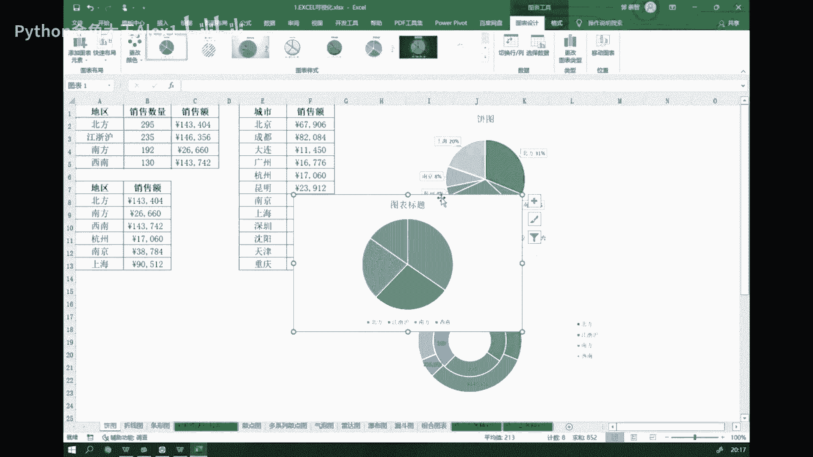

然后可能其他的话呢，就是就是凭感觉乱点了对吧，因为本身其实excel在绘图的时候呢，它基本上就是所见即所得，就是我我点哪儿改哪儿，就基本就是这个这个逻辑对吧，所以呢我们可能在日常的点的过程当中呢。

可能有些东西是能改的，比如说这个图表标题啊，我把它改成一个这个叫我们叫给他点中，然后我们点叫销售，销售额，然后构成，对吧，而我这样可以点，但实际上呢我们发现如果一旦这个需求，我们做一些变化。

可能很多人啊就开始这个措手不及了啊，比如说我现在想这样，我做这样一件事情啊，我现在呢我我我这每一个饼啊，每一个饼表达的是这个销售数量，但是我现在我想把它换成销售额的话，怎么搞啊，这个同学知道会怎么搞吗。

对吧，可能我们我们就是还是靠这种点点点的方式呢，可能就会比较麻烦，就是这张图呢我就不太容易下手了，其实本质上就有一个操作，你记住了，其实这个图啊你就学会一半了，就是你大多数的图在。

至少在改数据源这个问题上啊，大家就不用再害怕了啊，我告诉你怎么搞每一张图啊，每一张图啊，我们都可以用鼠标右键看着啊，鼠标右键里面有一个叫什么选择数据，注意到这啊，鼠标右键选择数据，然后这里边你看啊。

它会给你一个什么呢，左边一部分，右边一部分，左边这部分呢叫系列，右边这部分呢叫什么叫水平分类的轴标签好，那这个什么意思，什么叫轴标签，这玩意就是我们的那个标签啊，然后那左边这个系列是什么意思呢。

系列就是你要展示的那一组数据对吧，所以是一个系列嘛，是一组数据好，那我们现在这个系列是谁呢，它系列其实指的就是这一组数据，就是我们销售数量这一组数据，然后我们右边这个标签是谁呢。

就说我们用谁来标注这些数据的每一个呢，那这个标签指的就是这个东西啊，所以如果你知道这个组成情况的话呢，我们是可以对它进行修改的啊，比如说我现在呢就想把这个销售数量这个数啊。

给它变成销售额的这个情况怎么办呢，那我们就选择这个序列，这个序列里边呢有个什么，有个编辑好，我一把这个编辑打开以后，哎这里边会有什么呢，有一个系列名称，就是你这一组数据，你想描述的是谁。

那么这里边你可以写一个文字，你可以写个文字，当然了，你也可以绑定一个单元格，比如说我可以绑定到这个销售额的这个单元格，那么我这个单元格的内容一旦变化，我这个系列名称呢也就会跟着变化了啊。

所以呢这个地方我怎么办呢，我就直接看到有这个，有这个上方向箭头的东西啊，它就是让你可以选择单元格的一个符号啊，我们点击它，然后呢我们选中这个符号啊，选中这个单元格，你看它周边是不是有那个光标。

就那个闪动了对吧，那个边缘那个界限在闪动好选中它，我们现在绑定到这个C腰上了对吧，就这个单元格好把它收回来，然后呢我们再点下下边，当你把鼠标放到里边的时候呢，它会联动，就是这个地方你会注意到，看到了吧。

这个东西啊，它是周边有个光标闪动啊对吧，那么这个闪动说明它数据是绑定到这里的，就是B2到B5，所以这个地方呢我们可以给他修改，比如说我们给它改成销售额这一段，OK然后点击下方，然后，这个给删给它清光啊。

给它删光，然后再重新上选好选中，然后下来，然后点确定好，那么这个时候我们会发现啊，我们左边这个系列它的名字变成什么了，是变成销售额了，销售额怎么来的，就是刚才我们选择那个名字给他点过来的。

然后它里边的内容呢，现在变成了下边这些数据了，好现在我们点击确定，OK我们整个这个饼图就变过来了对吧，好饼图变回来以后，然后比如说我们现在呢又想在这个什么呢，每一个扇形区上去做一些变化。

比如说我想把这些值啊显示到每一个扇形区上，怎么办呢，那你知道你要知道我们这张图，它的一个构成元素都有什么啊，现在我们看到的这些，这个图当中的这个元素都有什么呢，我们可以在右侧这个什么加号。

这个位置给它点开啊，把它点开，我们可以看到图表元素里面有图表标题，标题是显示出来的啊，我把它点掉呢，就没有标题了，再点开呢就有标题了对吧，然后图例把它点掉呢，是不是没了，下边那东西没了对吧。

给它再点开呢，下面就出来了啊，当然这个位置可以调的啊，然后数据标签我点中它说出来这个数字了对吧，点掉就没了啊，所以说呢我们如果想显示数据的话呢，那就是点这个数据标签好，那么接下来呢每一个元素。

其实我们都是可以对它进行更高级的，一些设置的，我们把这个鼠标放到这个元素上边，会被右边会有个什么三角号，这个三角号点开以后呢，我们可以看到它的一些什么设置项对吧，如果这里边给你提示的设置项不够用的话。

我还可以点点击这个更多选项啊，把这个展开，那么我们就可以在右侧看到它整个的这个，元素的一个编辑界面啊，这个边界面呢基本上前两个都是通用的啊，就是每一个元素它都有前面前面两个东西啊。

一个是来帮你去解决什么呢，这个填充与线条的啊，另外一个呢是我们做这个效果的，像什么阴影啊这种东西啊，就是效果的把鼠标放上就可以看到对吧，发光边缘三维格式，OK啊，比如说我们现在呢可以对这个。

我们现在编辑是谁呀，说是这个标题呀对吧，这个标题是谁，就是这个东西对吧，这是一个选中状态，你也可以用鼠标在这个地方去换，比如说我们想换系列销售额，那么我编辑的就是我的这个扇形区的东西。

因为它就是我的数据嘛对吧，然后那我也可以去用它定位到别的地方，比如说数据标签上啊，那标签呢就是我这个文字啊，我显示这些信息啊，所以在这可以切换的啊，那比如说我们现在怎么去操作咱们这个标题呢。

那我们可以比如说在填充里边，我们做一个纯色填充，然后我们加个颜色，比如说选一个这个绿色对吧，那不太好看啊，OK啊然后下边呢我就不不演示了，大家可以自己尝试啊，每个功能基本上是你一看就能明白什么意思。

好吧，OK然后呢，那我们比如说现在想对我这个标签项，做一个处理，怎么办呢，也可以在这里边点加号，然后干嘛呢，选择我们的数据标签，然后找到这个箭头把它展开，选择更多选项是吧，它依然是回到我们这个编辑界面。

跟我们刚才在这个标签选项里边去做选择，是一样的啊，到一样的都能找到这个功能界面好，那现在呢我们对标签做处理，它里边我们会发现多了一个什么，说多了一个最右边，这个像一个像一个条形图的一个符号啊对吧。

这个符号呢就是来设定我们这个标签内容的，就是每一个绘图元素呢，他们都会有前两个这个绘图功能，但是后边这两个功能有的有有的没有啊，这个要看你是什么样的，一个就是这个绘图元素好，它有，那我们把它展开啊。

标签选项里边，我们要着重说一下它里面这些功能啊，就是我们比较常用的，比如说首先第一个啊单元格中的值什么意思呢，我现在如果想去对我们每一个标签，做一些文本上的标注，比如说我这个143742。

它呢我想标注为这个西南，然后143404我想标注为北方啊，以此类推，那怎么办呢，这里边我们可以通过选择单元格中的值，来进行绑定好，那么它呢，我们可以直接绑定到我们左侧地区的，这四个单元格对吧。

它们跟它正好是一一对应的好，我们再点回来确定，OK是吧，那现在我们就可以看到，在下边就有我们这些个什么，这个单元格中的值了，以它绑定了啊，然后除此之外，我们再往下看还有什么系列名称，谁是系列名称啊对吧。

我们刚才我们在右键我们选择数据的时候里边，我们说左边是什么，这是系列对吧，系列怎么讲呢，我们说系列啊，它就是你现在这个饼图里边，他展示的那个数据啊，那么这个系列我们一点编辑的时候呢。

它里面是有个什么是一个系列名称啊对吧，系列名称好，这个呢我们怎么来的，是这个绑定了一个单元格，是C1啊对吧，绑定到这了啊，所以这就是系列名称，那么我们如果在这个里边啊，把这些确定掉啊。

我们对它进行选处理，在这儿啊打印一下，如果这边我们对标签选项，如果我们把这个系列名称选中会怎么样，那就会把我们刚才选择的那个系列名称，也标记出来，对不对，销售额销售额诶，它就出来了啊。

然后另外呢还有个类别名称啊，那么类别名称的话就是什么，就是指的是我们这个你的这个标签项啊，那这两个显然重复了，我就不要了啊，当然这边你可以选择性的处理，比如说我们现在不想显示值，我们现在只想显示百分比。

那我就把这个值勾掉，把这个百分比显示出来，现在的话呢，我们这个销售额就变成了什么百分比，而不是原来的那个原来的值啊，OK还有这个引导线啊，引导线的话呢，那这里边就是相当于是我们对这个标签啊。

啊就这个标签加了一条线对吧，这个你一般你加不加都行啊，但你标签得放到能就是能看到你引导线的位置，OK啊，然后下边还有标签位置，比如居中啊，标签内啊可以调整它的一个一个位置啊，OK好好。

这是我们的一个文本选项啊，然后前边的这三个我们就不细说了啊，其实这就是大家点点点就能看到效果的，OK然后呢，我们如果想对整个这个图表，它的颜色做处理的话呢，你也可以选择它excel啊。

给我们提供了一些默认的样式和一些颜色，这个呢就在我们每一个图表右侧啊，上边加号，下边这个毛笔的图标，把它点开，里面我们能看到很多预制的一些配色方案啊，但遗憾的是啊，这些配色方案都不是很好看啊。

所以呢嗯你可以选择啊，可以选择样式来做一些修饰啊，比如说我们选这个啊，或者这个或者这个等等吧，啊嗯OK啊，当然了，你最好的方式是什么呢，肯定不是说我我靠自己去设计这些配色呀对吧，然后包括我的字体啊。

这东西咱们不是搞专业UI设计的，肯定设计出来不好看啊，所以呢大家啊，拿到我们这个咨询老师给你发的那些模板的，你不妨可以用那些模板往里面套啊，这是一个比较好的方法，那或者呢就是你用一个WPS啊。

它里面不是有很多好看的模板嘛，对吧，你用那种套套就可以了啊，当然了，你你不论你怎么套你，那你至少你得知道我这个数据是怎么设置的，OK好，这是最简单的饼图啊，其实我们饼。

我这个饼图花了这么长时间给大家讲啊，就是为了为什么呢，因为我后边所有的图像的逻辑，基本上你把这几点事搞清楚了，其他的图像啊，你只要知道它的图像的含义，它怎么表达数据就完事了，因为你只要会了这几下。

你基本上大多数图像的一个处理工作，你都能搞定了啊，不信我们就来试试啊，OK那假设现在我告诉你啊。

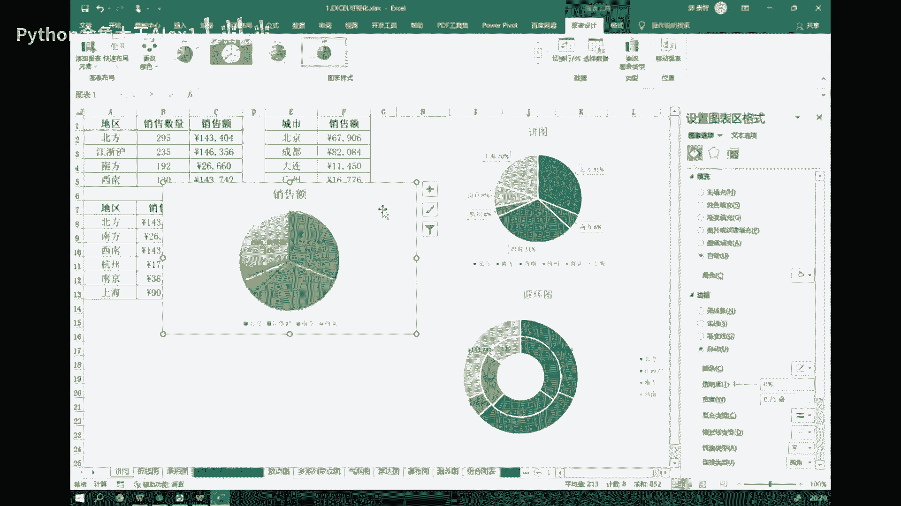

圆环图呢它是一个饼图的一种扩展，图像，拓展到哪呢，啊，那么我饼图呢，我表达的是是一组数据还是多组数据啊，同学们是一还是二啊，一组就是一，多组就是二，同学们告诉我，普通饼图表达几组数据，第一组好。

非常棒啊，那好了，那当你想表达两组数据的组成的时候呢，我们用一个饼图就表达不了了，对不对啊，如果你两组数据之间呢，又有一定的联系的时候呢，我们又不能用两个饼图来分开表示了。

所以这种情况呢显然我们有更好的选择，就是什么，就是环形图好，也就是说，环形图，它帮我们表示的是两组甚至更多组数据的，什么呢，组成关系啊，每一环代表一组数据，每一环代表一组数据，诶，这就是圆环图了。

好在你知道这一点之后呢，好那我们现在假设我们现在要做一个实验啊，看大家能不能搞出来一件事，我现在想通过一个环形图呢，把我的销售数量和销售额呢都表达出来啊，而且呢每一个环呢，每一个环的每一部分呢。

我们用这个地区来给它进行标注上，并且呢我想把我这些销售数量和销售额，这些数值呢跟他们这些这个标签名字啊，给它绑定到一起，显示到我的这个圆环图之上，好这件事我们来尝试一下啊，看看我们能不能搞。

当然你现在如果手头没有excel的话，那你就看我啊，我们来一步步走啊，看你能不能想到这些地方，首先呢我们想画啊，我们想画一个这个圆环图的话，那我们得知道原画图在哪对吧，那这个很简单。

我们只要在这个饼图里面可以找到这个圆环图，对吧好，我们先把这个圆环图啊给它放进来啊，放进来好，那现在呢我要去给它配置数据了对吧，怎么配置数据呢，右键我们去怎么样选择数据好选择数据，然后我们要去添加什么。

你要添加一个系列，对不对，添加一个系列好，这个按钮我没用过啊，我们先第一次用好，但是本质上道理是一样的，只是这个功能我们第一次用而已，我们点添加添加一个系列系列名称是谁，系列名称，我们选择销售数量。

这是我们的第一个系列，然后系列的值是谁，把这个啊点开，选择下边这四个号，这四个单元单元格啊，选中，OK点击确定好了，第一环是不出来了，第一环出来了啊，然后呢，第一环我们怎，你看现在是用1234来标注。

这个每一个扇形区的对吧，那显然不合理，每个三元区用谁来标注啊，是用这个标签来标注啊，谁是来帮你设置标签的，右边这部分，这个是来帮你设置你的标签的，好怎么办，点击编辑，然后轴标签区域，我们这儿做一个选择。

把北方江浙沪，南方西南的这个区域选中，点击确定好了，现在变过来了，已经有一个环了，对吧好，那么现在大家思考啊，虽然说我们没用过，先思考，我现在一个系列表达的是一个环，那我想表达第二个环的话。

我是不是应该再加一个系列进来，是不是对，那如果需要加的话，显然这个地方有个添加按钮，那么它会不会是这个功能呢，点击一下，点击它以后，我们还是老样子诶，选择一个系列名称，好，销售额是我的系列名称。

然后下边的数值是谁呢，销售额下边的这四个数据是我要表示的数据，给他点回来好，我们先点击确定，然后那同样的右侧这个标签，其实这个你设不设置都行了，因为它们是可以什么说，它跟第一个环是共用的呀对吧，当然了。

为了更严谨，我们也去给他做一个处理，这个区域我们还是给他选中地区的这四列，这四行啊选中，然后点确定好，这个时候我们再确定好，我们发现怎么样说一个圆环图就出来了，实际上你现在看到这张图就不再像以前一样。

我们只是看到一张图，我们看到的什么是这个图的一个数据，我们知道了里边是一组是一个系列，叫什么叫销售数量的，然后外边这个圈呢是一个叫销售额的，这么一个数据好，接下来就是什么我们外观的配置了。

咱先不用管这个粗细的问题啊，大家一定会第一个关注的，就是我这个粗细怎么调的问题，是吧啊，没关系啊，别着急啊，如果你现在呢跟不上的话呢，我我先把速度稍微放慢点啊，然后呢这个东西你课下你看视频一停啊。

一根一停一根你绝对能跟上啊，因为这个东西没什么技术含量，你只是不熟不熟而已啊，所以说net这个一定要先跟着思路啊，先知道思路，OK好，先不用管这个环的粗细啊，我知道大家一定会看到这个粗细。

尤其是有这种强迫症的人啊，先不用管它，我们先用我们现在已经学过的东西，来处理一些问题，比如说我现在问大家第一个问题，我想把我的这个标签给它给它列出来，什么意思，我现在不想让这个北方江浙沪南方。

它是以这种独立的方式在下边显示了，我呢，要让这些东西跟我的每一个环跟他绑定到一起，哎，跟他们绑定到一起，这个事儿怎么办，他是什么样，它是我们这个环上这个，标签的这么一个一个元素啊，所以怎么去找呢。

我们现在没有标签，所以我在这里边我去点加号，我要把我的数据标签给它选出来对吧，选出来好，选出来之后我们发现默认的数据标签是什么，看看啊，这个数字143404是从这来的呀。

然后内环的295是从这儿来的对吧，我们先要什么，我们先要是这个现在我们要这个好，那么我们怎么办，那你说你现在给我的这种预制的这种填充方式，不是我想要的，所以呢我就点击右边的这个箭头干嘛呢，点击更多选项。

在这个里边我们可以看到什么，说这个文本选项又出来了，我们点击这个干嘛，对我们这个标签进行自定义设置，是不是有一个标签选项，把它展开里面可以干嘛呢，说可以放单元格中的值啊，系列名称啊，类别名称啊。

哒哒哒一堆啊，对不对，好，我们现在放什么，我们说放类别名称就行了，因为你这个玩意儿是不是类别呀，谁是类别啊，啊我慢点啊，我们点击右侧选择右键选择数据，然后这个玩意儿就是你右边这部分，它是不是你的标签啊。

对不对，OK所以说呢我们就怎么样，我们就是对他这个标签啊，数据标签更多选项里边，在我的啊这个图标里面的标签选项把它展开，我们就选择类别名称出来了吧，是不是北方西南南方江浙沪都出来了啊。

OK然后那我如果你们不记得这个也没关系，它还有什么说还有这个单元格中的值啊，它怎么用啊，它是可以手动去选择一组啊，比如说我们别说你搞这个，我连搞这个都可以对吧，我用北京成都。

大连广州来标记我的这个环形区域行不行，也可以，因为我就是可以随便去选择一组数据嘛，好把它点回来，点击确定看看这图有点小，放大一点啊，大家看能不能看清这个是北京对吧，然后这个是大连。

然后成都广州是不是出来了，OK啊，但显然这样的话怎么不合理了，是不是啊，给他再改回来啊，也可以鼠标就是鼠标选中它啊，选中这个标签，然后也直接可以定位它，上它就是就是我们想找到这个编辑菜单的话。

有很多种途径啊，哪几种途径啊，整理一下，一种就是刚才我们用的，我现在想编辑哪个元素，那我就鼠标点中它，但你注意啊，它有的时候会点中一个，有时候会点中这一组，你要想编辑一组呢，你就确保我我选中的是一组。

比如说我们现在选择就是内环的这个标签对吧，如果我想选择外环的标签呢，我就选中这个14304的，默认就是把这四个都选中了对吧，如果你仅仅是想不想这个处理我这个系列的话，我可以点中这个环。

是不是我要想处理这个类别的话，我就鼠标点中类别，不论我点哪一个，我都可以找到什么，在右侧是定位到我的编辑界面啊对吧，这是一种方式，那么第二种方式呢，就是我可以如果有些控件特别小，我鼠标很难点中。

我也可以怎么样，我也可以在这个地方这个下拉按钮把它拉开，也可以去找到每一个元素，是不是比如说我想选择我这个数据标签，销售额的数据标签对吧，就是外环嘛对吧，这个外环的数据标签我不也选中了，选中它以后。

我点这个说也可以定位到我这个文本选项啊，是吧，然后包括我想想放我的类别名称啊，还是系列名称啊，还是单元格中的值啊对吧，都可以啊，这道理是一样的好啊，那我现在如果想把下边这个这个东西隐藏掉，怎么办呢。

有回放啊，咱们有回放，你先把它隐藏掉，怎么办呢，对吧，那我就可以怎么在这个里边，我说可以把这个图它叫图例啊，同学们，是不是我可以在这里边说把图例给它勾选掉，是吧，因为我本身已经在每一个环上说。

已经对它进行一个什么数据类别的标注了，所以那个图例也显得有点多余了，那我就可以把它关掉好，接下来我们说这个啊，好刚才我们讲这些东西啊，是不是都是我们讲第一个饼盒的时候，都涉及到了对吧。

实际上你你就会发现，你你往后所有的图像基本上干的都是这些事儿，你只要把一个饼图，一个圆环图搞定了，其实大多数图像你都搞定了啊，这个就属于一种excel，它给你提供的福利，就是他不会把这。

它一定是有他自己的一套使用逻辑的，所以我们很多时候会讲说你，你其实不论是excel还是说一些高级的bi工具，基本上都是你像我们很多在数分的那种啊，招聘简历上是吧。

就是那种需求上都会讲讲说你熟悉power bi啊，TABER啊，或者建模软件吧，比如SPSS啊，或者是那个MATLAB等等，你熟悉其中之一即可对吧，就是这个道理，因为很多软件它是一通百通的啊。

他们的逻辑是一样的啊，excel是一样一样的，OK然后哎那我们比如说我们做一个配色吧，在这个里边啊点一个这个刷子，然后我们点击颜色对吧，随便选一组配色好，比如这个好看一点，选它吧，OK好。

然后呢我们再去把这个环啊，这个环的粗细怎么调，这个环的其实它不是调粗细的，就是excel里面的，它它是不去给你调，比如说条形图啊，或者说这个啊这个环图啊，甚至说一些其他的一些这种图啊。

它都不是不是给你调粗细的，它调什么呢，它调间距的啊，调间距的，或者比如这个调环的大小的，它是通过这种空间的方式呢，来做做你这个图像大小的一个缩放啊，所以它不是按照宽高那么方式去给你调整的啊。

所以这个环呢，它的粗细是通过环的大小来进行调整的，你看两个环，因为它们是绑定到一起的，你其实不论调内环还是外环都是会互相影响的，所以这里边我就不用那么抠细节了，你随便点哪个都行，点中一个干嘛呢。

在右侧啊，我这个电脑今天有点卡啊，在右侧看到什么呢，说有一个什么圆环的什么大小啊，对不对，好这个大小我们调整它知道了吧，这个环就变粗变细了，是不是诶，好这样这个就调粗细了啊。

好然后我们还有一个工具没用啊，就是下面这个东西像一个漏斗一样啊，它是一个过滤器，就它干嘛用呢，比如说我我们现在呢在整个这个图里面，我们并不想全显示，我们想有选择性的去显示其中一部分。

那我们就可以用这个过滤器的方式来处理了，比如说呢我们现在只想关注这个北方啊，北方我不想关注，我只关注江浙沪，南方和西南，OK那我在类别里边呢，我就可以把北方给它反选掉，OK我再选择应用。

看我的这个饼图是少了一部分，同样道理上边也是我们两个环，对不对，两个环，那我一个还是销售数量，一个还是销售额，我现在只想关注我的销售额的话，那我把销售数量点掉，我们再点击应用。

这样就变成了一个什么一个单的一个环形图，所以实际上你要想画这种空心的，空心的这种饼图怎么办，说用这个环形图就可以帮你搞定是吧，OK啊好，这个图如果搞定了啊，那么这下就是刚才我们说大部分图能搞定。

如果一个环形图加一个饼图，你两个都搞定了，现在基本上所有的excel图像，我们都有思路去搞了啊，接下来咱们再看复合饼图，还是先说场景，我们为什么要使用复合饼图，同学们在日常生活当中啊。

工作当中大家用过几个复合饼图吗，大家可以回想一下，你用对了没有啊，用对了没有，你为什么用它对吧，首先思想上要有一个建设啊，包括我们做数分也是一样的，我们淑芬并不是大家想的说写个Python代码。

或者写个SQL语句，或者说我就做个图表就完事了，不是那个那个只是你的工具，就像我们现在学的图表一样，它只是你的工具，真正是什么，真正是你后后面的那个核心思想啊，你你想。

你想通过数据去表达一些什么样的事情是吧，它能佐证什么，它能帮助我们做什么，它能驱动什么东西，这才是你的价值啊，也是一个道理，我们做数据报告也是的，为什么要使用复合饼图呢。

啊因为我们有些时候啊我们想去强调啊，我们想去，比如说我们想强调某一个整体当中的，一个小团体啊，或者呢我们在整体当中有有这种长尾现象，什么叫长尾现象，同学们啊，比如在我们一个，我们通常我们说。

我们会分析这个市场的一个竞争度啊，就是我们在数分这个领域有有这样一个概念，就是这个做这个竞争度分析哎，怎么去做竞争度分析呢，它是有一个指标叫HSI指标，这个我们先不展开说了啊。

那么它呢其实我我们就会分析市场的一个组成，通常来讲我们会有一些维度，比如说我们可以通过市场的一个占有量啊，这个是比较常见的占有量，或者他什么交易指数的方式，都可以表达这个占有量，那比如你现在市场。

比如我们就说卖鞋的啊，卖鞋的这个市场，运动鞋这个子类市场好，我们可能有100家企业啊，100家或者100个品牌啊，我们想去研究，在这个卖这个运动鞋的这个市场上，它的一个竞争度是高还是低。

我们有没有机会入场，如果我们入场的话，我们面临的竞争压力是高还是低，是大还是小哇，我们会做这样一些竞品好，那么我们就要去做这种分析了，100家企业，可能我们往往面临的现象是什么样的，是这样的。

如果有垄断情况的话，那一定是有一些巨头，比如说第一家它占了70%的市场份额，然后第二家呢占了20%的市场份额，然后剩下10%分给那98家，这就是一个长尾现象啊，包括我们在做推荐系统的时候也是有这样的啊。

我们想去给一个用户推荐他感兴趣的商品，那如果你你一味的去给他推荐他感兴趣的，就会造成什么呢，他对于我们多数的外界的一些信息呢，可能会get不到啊，就是接收不到，这样会造成他的视角会缺失的对吧。

所以有人会跟你讲说我们现在看的什么抖音啊，快手啊，这种短视频平台，它本它其实是限，会限制住我们的一个对外界信息的一个捕捉的，一种概率啊，一种可能性啊，所以说有人会说你不要天天看那个玩意儿啊。

其实不是因为它在推荐算法里面，它它其实是思考到这个问题了，他他其实也在做这种平衡啊，好OK好，那我们扯扯扯的稍微有点远了，我们回到回来说这个长尾问题，那比如说这种情况，你想表达你的饼图的话。

你就会很尴尬啊，100家，哪怕我就表表达前十家的话，你的饼图画出来一定是这样子的，大家都可以想象出来是吧，一个饼图，这从这儿一直到这，这是这是一家对吧，然后呢剩下这些又是一家。

然后剩下这些888密密麻麻排了98家，好了，你这个图能看吗，想看也看不明白，对不对，只能看到这家很大，这家很大，那这里边的东西呢，你连字都排不满啊，字都排不下呀，是不是，所以这种情况的话。

那我们就会采用什么复合饼图的方式，来把我们一些更小的一些细节啊，给他做一些微观展示啊，所以就会出现了复合饼图，OK好，有了这个前提呢，我们就来看啊，其实复合饼图跟环图也好，还是跟我们这个饼图也好呢。

唯一的区别就是我们怎么去设置这个小饼对吧，这是他的问题，其他的逻辑其实是一样的好，那我们现在比如说以这个以这个地区销售额，以他为例，那这里边呢我们明显可以看到啊，这边有比如说北方和这个西南。

那这两家卖的是比较多的对吧，它的销售额比较多的，然后呢剩下几家呢，比如说像杭州啊啊和这个南方啊，可能卖的比较少好啊，那这种情况呢，我们就可以考虑采用复合饼图的方式，来对它进行一个展示啊。

怎么用呢啊还是我们可以直接选中它，我们直接选中它，然后再插入有什么好处呢，它会自动帮我们去适配，比如它会自动帮我们，把这个数值型的数据呢做成我们的系列，把这个这个文本型的数据呢做成我们的类别。

什么类别啊，就是你这个饼图里边这是什么，这个画饼的这个东西是系列，然后下边标注它的是什么，是那个类别，对不对啊，类别一般是文本，然后系列呢一般是数值啊，数值型的，OK所以我们这样去勾选的。

会有这样一个好处，如果你把这个列标题啊，就这个列名称也选中以后呢，那么它也会绑定，比如说销售额会绑定为我们的系列名称，而地区呢会绑定为我们的这个类别名称，对吧啊，OK当然如果你不选的话，怎么样不选的话。

他就不会绑定了，那你就需要配置它，OK啊，就这个道理好，所以我们先全选中它，然后呢我们点击插入选择饼图，我们选择这个复合饼图好出来了，那它默认直接把我们这些这个饼啊就划进来了。

我们现在如果想知道每一个丙标注是谁，其实是可以看到的，在下边，这个他已经默认把这个类别数，帮我们勾选了对吧，那我们现在如果想让他在这个顶上去，把这个数据呈现出来的话，怎么办啊，同学们怎么办啊。

说还是什么呀，加号，然后选择什么数据标签对吧，这个数据啊直接就出来了，好我们就能看到啊，它是一个什么样的逻辑呢，哎当你把这个鼠标选择，咱们右边这个小饼图的时候啊，你就能看到了啊。

它其实呢是有这样的一个也是啊，就一般来讲，这个都是跟数据设置有关的这个选项啊，OK选中它以后，我们会看到啊，这边有个什么系列的分割依据，谁是系列呀，你展示的这种数据是不是一个系列呀，对吧好了。

系列的分割依据跟什么分，根据位置来分，然后在第二绘绘图区当中放什么，放是二二是什么意思，二就是从从后从后往前查两个，查两个，这是第一个，这是第二个，也就是说把这两个放到了第二个饼图里边了。

所以这里边90512是不是这个上海啊，这个38784是我们这个南京啊对吧，这个啊是我们按照位置的方式来进行，默认帮你去摆放的，那如果我们觉得这个位置它不合逻辑，我们也也可以做一些调整。

比如说我们可以不让它按位置调，可以按直，也可以按百分比值，也可以去自定义，比如说这里边我们可以按百分比值，我们可以做小于10%的，我们放到右侧，那现在你看把谁放过来了，右边啊是吧，38784。

这个还有17060，还有这个266660，这个一个是南方，一个是这个，一个是南京对吧，就是南方杭州和南京放过来了对吧，可以看这个颜色啊，这个浅蓝色，南京红色是南方紫色是这个杭州对吧，OK啊。

然后其他的配色呀，筛选器啊，还有我们这各种组件啊是吧，我就不用多说了啊，好同学们啊，这个图饼图这个逻辑大家搞清楚了没啊，能跟上不给我反馈啊，如果这块能跟上，后边我就要加快速度了啊。

因为重复的东西我就不要讲再讲那么细了啊，如果你不熟，这不是问题啊，你不熟是一定的啊，如果你之前没用过的，那么你课下在我会给你留点作业啊，你课下呢再跟着视频呢，再一步一步的拆解走一遍，然后一边思考一下。

尝试一下就一定会熟了啊，这个没不需要你太太多的一个学习成本，两个小时足够了，OK好好，同学们啊，跟得住啊，扣一啊，给我扣个一动起来啊，你们要是反馈吧，我我会讲的很嗨，知道吗，同学们，我讲课经验非常丰富。

知道吧非常丰富，你们想听就这么讲啊，就是我你别看我给你讲的是excel，我跟你说，我我真不是专门干excel的啊，我是搞算法的，我是搞我是有有了，我是有11年的it行业从业经验。

我不是一个做excel的人，也更不是一个什么搞bi工具的人，这个东西它只是我在做数分这个领域的时候，我会后学的，我真正的强项是编程，然后算法，所以基本上你在IT这个领域所有的问题啊，我11年的经验。

我相信都能给给到你一个比较客观的一个答案，所以大家啊我们听excel一定要放轻松，因为这玩意没什么技术含量啊，不要紧张，你不要觉得自己学不会一定能学会啊，你跟不上，可能是跟不上啊，但学习一定能学会。

所以啊咱们想问什么啊，我知无不言，OK包括算法，包括深度学习，包括现在AI的整个领域，包括数分是如何发展的，包括我们现在的哪个行业啊，做什么怎么做，学什么技术，我都可以告诉你。

因为这个行业我混的太久了啊，基本上啊基本上就是专家级别了啊，这个不太谦虚的讲啊，因为因为大家也知道啊，如果大家是上过班的，在一个行业混了十几年是吧，基本上这个啊边边角角，犄角旮旯的地方也都看得到了啊。

很多事都经历过了，OK啊好，那么接下来我就要快了啊，我重点就会告诉你这个图它是表达什么的，什么场景用，然后至于具体的操作细节，我就是给大家演示一遍啊，大家应该都能跟住了，好下面一个图呢就是这个折线图。

折线图啊，比如说比如说咱们这个echo啊，EO同学问了一个啊，示例复合饼图中像对话框一样的标签，怎么设置好，我们来看一下啊，这应该是共性问题，是这个标签吗，同学这个标签对不对，好，我来演示一下啊。

他怎么搞，那同学你可以先思考就是这个东西是什么，它是不是我们数据标签啊，对吧，既然你是数据标签，那我一定是在数据标签里面去做手脚嘛，对不对，然后我们可以看到它是放到了什么，它像别的图一样。

它是放到了外边，所以说它的位置是不是得做一些调整啊，比如我们放到内内部对吧，最佳是吧，还有外部和居中数都位置都不一样啊，所以显然我们这边什么标签Y对吧，那至于我这个外边的框怎么搞的。

更多选项里边不是有这些基本属性吗，我这个填充还有我什么，还有我这个阴影啊，那这里边我们做什么，做一个填充就行了，我们是无色填充，然后呢我们要做边框，要什么，要有边框，如果无边框就看不到了，要有边框对吧。

加上一个实现，这不就出来了嘛，然后至于这里边的名字怎么搞的，说还是标签的，那什么文本选项里边是加什么加类别名称啊，或者我们选中单元格的指数也可以啊，对吧啊，这个百分比怎么搞，说我们不要这个值显示了。

我们要把这个值勾掉。

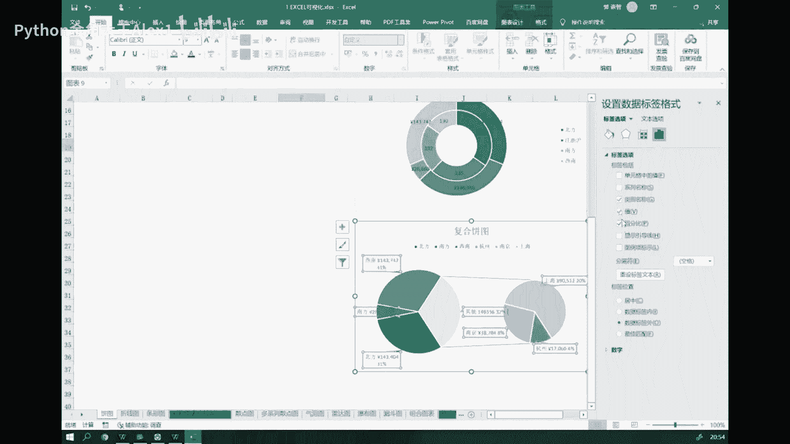

然后把百分比选中就可以了，对不对啊，OK啊。

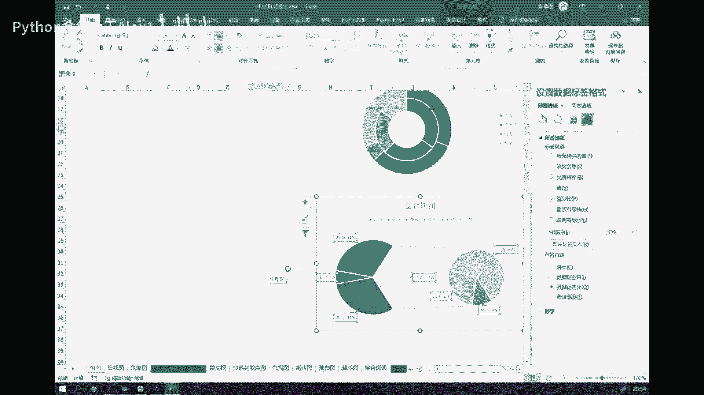

所以你你就先知道你要设置是什么什么元素，因为实际上你整个图表当中，你如果分不清哪个是叫哪个元素叫什么，那你就是把它点开，然后你鼠标放上去，你动一下，你把它勾选掉，你就知道这个元素是谁了啊。

这个是比较容易区分的啊，OK啊你只要知道它是什么元素了，然后OK那我们再去尝试啊，再去在右边的这个什么这个编辑区内啊，去给他做各种的尝试啊，其实主要是数据啊，因为这种外观的设置。

基本上你都可以点一下就知道效果，所以这种东西就比如说无色填充，纯色填充，这就没必要说一个一个都告诉你啥意思了对吧，这玩意儿咱们都知道啊，一看就明白了，OK啊好我们先看下一个折线图。

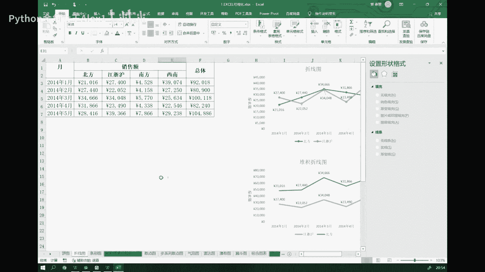

折线图干嘛呢，表达趋势的，所以表达趋势的话呢，通常啊就是通常我们用折线图的时候呢。

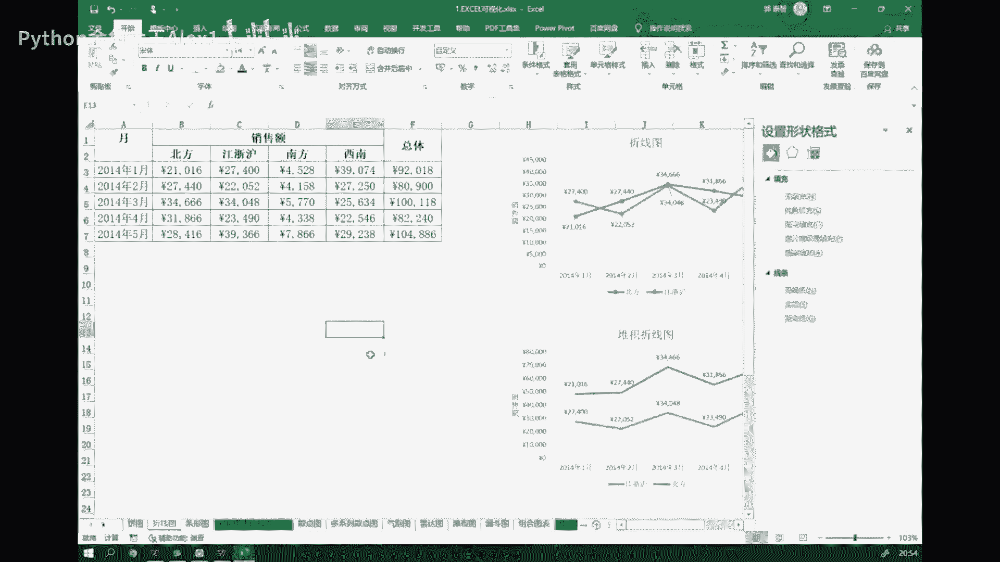

都是跟时间有关，都是跟时间有关，但这里边呢给大家提一个醒，就是对于excel的时间。

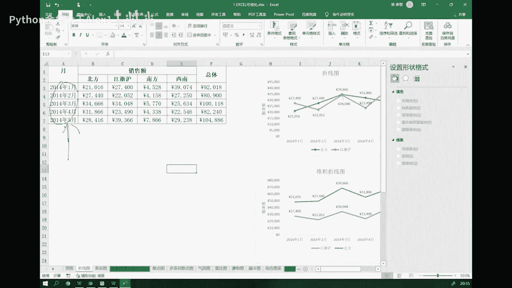

它是一种专属的类型啊，专属的类型。

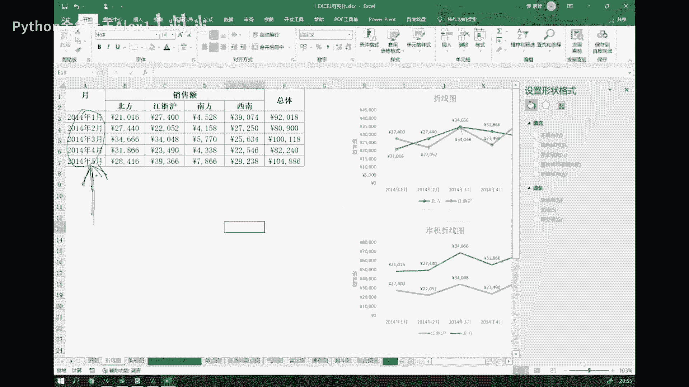

所以呢那我们在写时间的时候，一定要注意时间的规范，就是你不能乱写，比如说我们想写个时间，我们我们可以写2022，然后杠比如说这个今天是7月，然后杠19我可以这样去写，对不对啊，我可以这样写。

或者说我可以写成这个2022年，然后这个7月19日我也可以这样写啊。

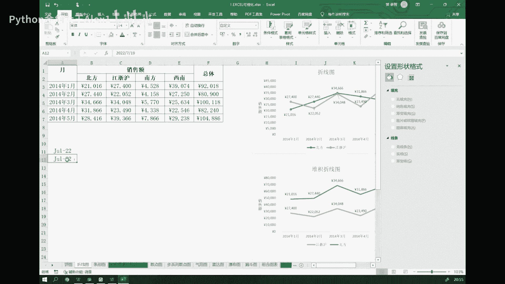

你为什么你可以这样写呢，因为你这样写的话，那我是能识别的，能把你当成日期类型来识别。

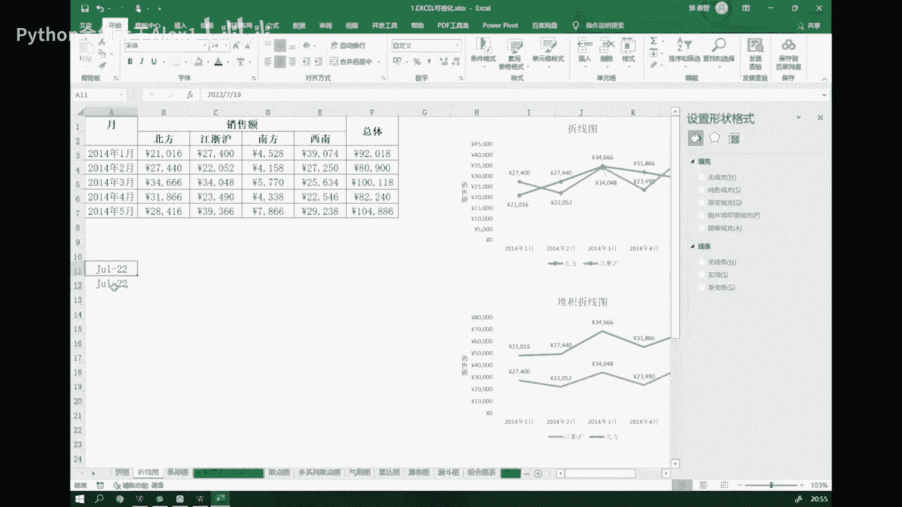

但你不能这么写，你不能这么写，比如我写上一个2022，然后年然后杠七，然后杠19。

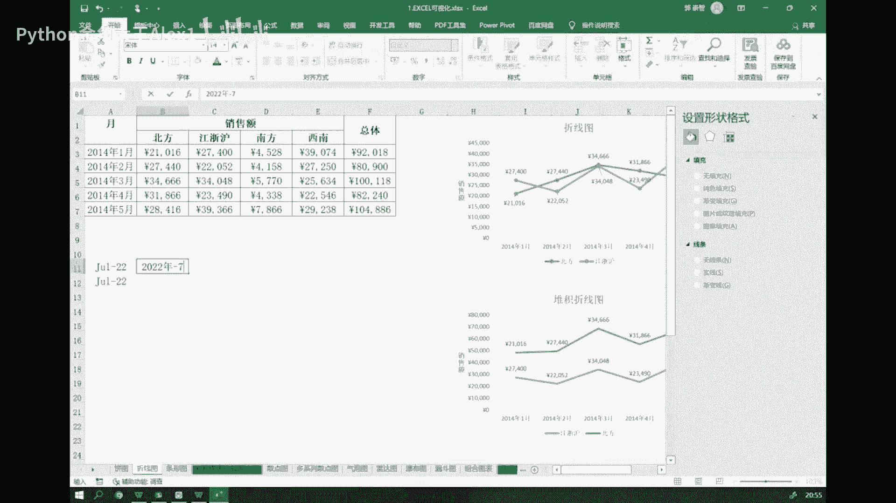

就你乱写是吧，乱写不行，因为这种就不是一个标准的时间格式了啊。

为什么这么搞啊，因为我们其实我们明天会给大家，仔细讲这个事啊，就是excel它本质上是个什么东西，我们大多数普通就是没有去刻刻意去研究excel的。

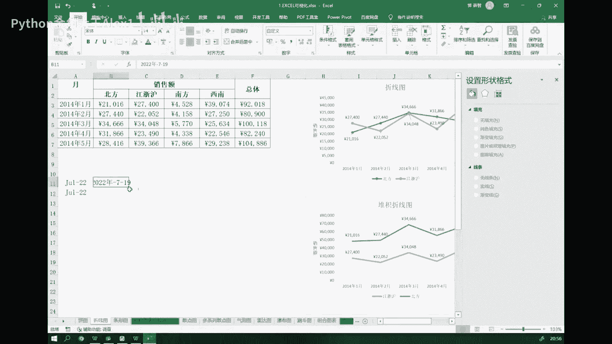

同学呢，会把excel当成一种展示的工具，所以比如说我会很自然地把这种表格，展示给老板看或者展示给别人看啊，其实那其实这个本质是什么呢，你是把它当图表来用了啊，比如一张一个表。

里面这一个sheet里面放了好几个表，这一个这一个表，然后那一个表，然后呢，我们顺便在这个表里面简单做一些这个统计啊，但其实这个是不合理的啊，为什么不合理啊。

因为你的图你的excel本质上是一个统计工具啊，是个统计工具，然后可视化呢是它这个统或可统计工具呢，给我们提供了一个功能组件啊，但本质还是要去做统计的，那么如果你是做统计的话呢。

你所有数据的一个存储方案，他必然是要去为了这个统计的目标而存在的，而设计的，所以说比如说大家如果看了，咱们那个第二天的那个录播，那里边会给你讲什么一个通用格式，比如你看这个啊。

我们北方这里边它前面是加了一个什么，加了这么一个人民币的符号啊，那这个东西它能不能运算。

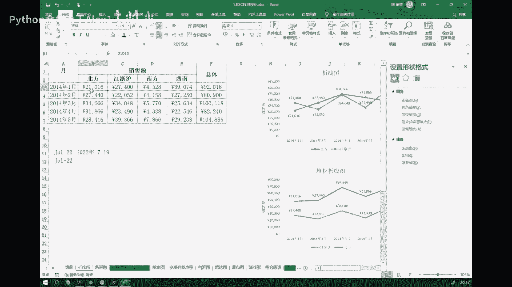

能不能运算呢，这一列能运算，我把它选中以后，我就可以在什么，在下面是可以看到我的平均值计数和求和啊，对不对，为什么它能运算呢，它为什么能计算呢，这玩意不是个文本吗，不是你要看它是不是文本。

你得把这个excel点中，你看单元格的内容存的是啥，存的是21016，它存的是个数字，那么它就能运算。

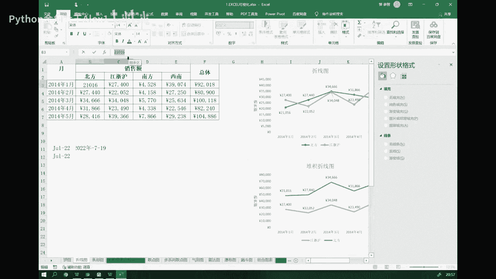

如果你存的不是数字，如果你存的是这个，比如一个dollar符。

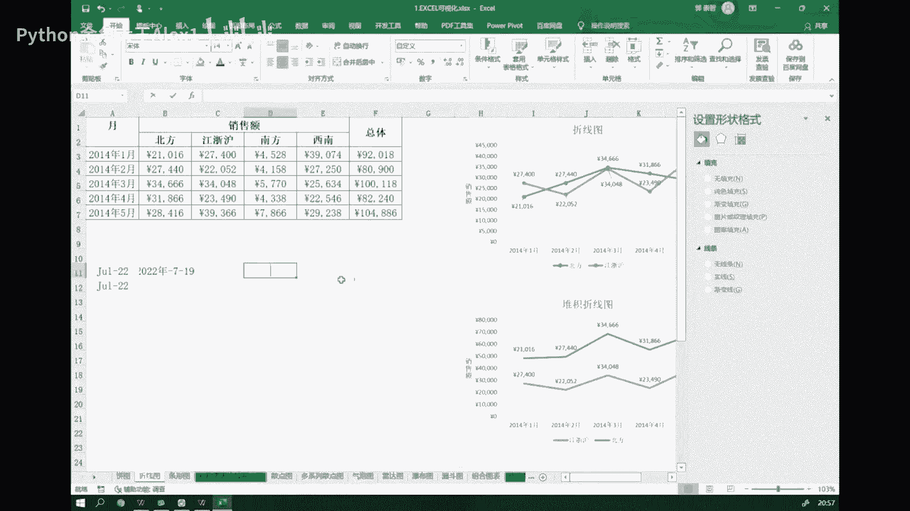

再来一个好，这玩意儿能运算吗，同学们还能运算吗，不能运算了。

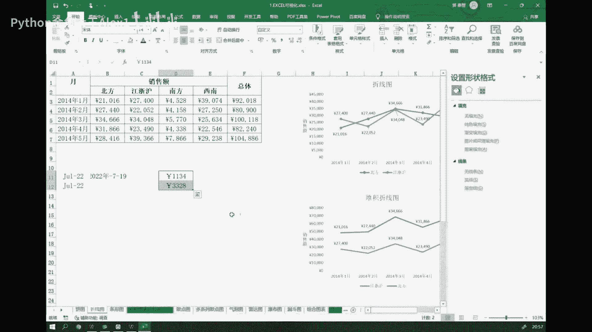

他只能做个计数，看看吧，看右下角我能求和了吗。

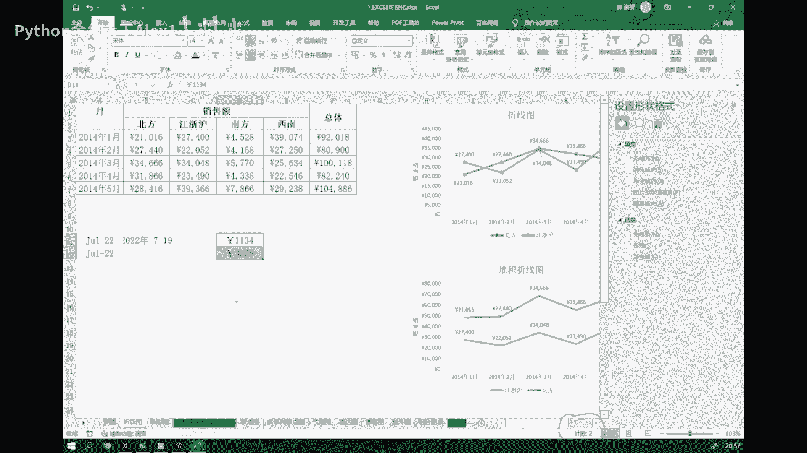

还能求平均值了吗，average能求了吗，求不了了，为什么，因为这个单元格你发现我选中它以后，它里面放的是什么呀，是一条文本，不是一个数字。

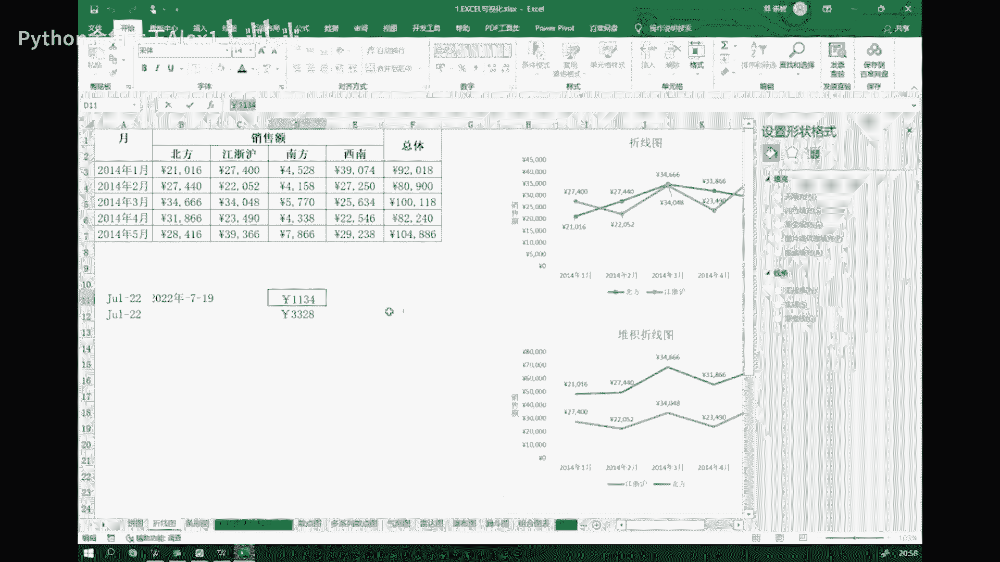

是不是excel会提倡你这么搞吗，不会的，但是我们遗憾的是。

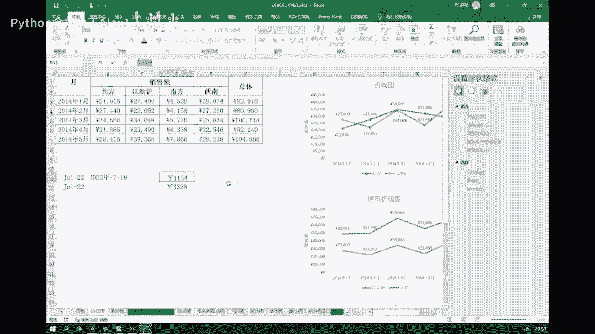

我们大多数在记录excel信息的时候，我们经常这么搞，这叫什么叫数据不规范，为什么会不规范，因为你没有一个excel是用来统计。

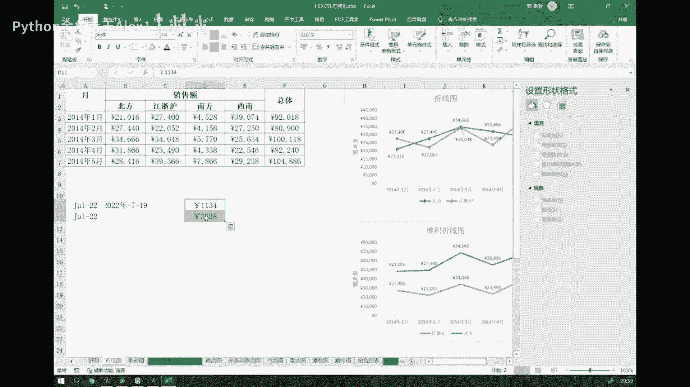

做批量数据统计的这么一个基本的思想，你没有想过这件事。

你只是在想啊，这块它是一个dollar符号，如果我把单位写到上面会写得很low，我不如这么写，这样写好看，可能我会这么去思考问题，但实际上呢你违背了，你要想让它显示出来很简单，只需要怎么样呢。

我只需要写个1134，然后我把它变成什么呢，把它变成以这个货币的方式来进行显示就完了，它只是改变了我的显示格式，但是我这个excel存储的数据，它依然是一个可运算的一个数值啊，能理解吗。

所以说啊所以说我为什么要跟大家说这个年啊，就是为什么要说这个这个时间类型啊，你为什么要写的规范一点，尤其是我们如果是在上游，或者我们负责公司的这种统计工作的话，那么你一定要注意你的表格下发出去以后。

你前端的那些人员给你填的表格，它是不是规范的，如果不是规范的话，我怎么可以在规则上，或者说我们在excel的这种规则限定上。

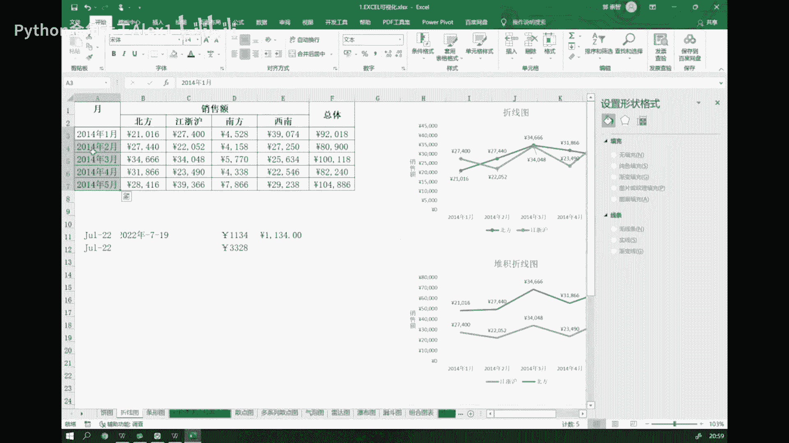

我们能够让他填的是规范的数据，所以你就会发现excel为什么要给你提供什么数据。

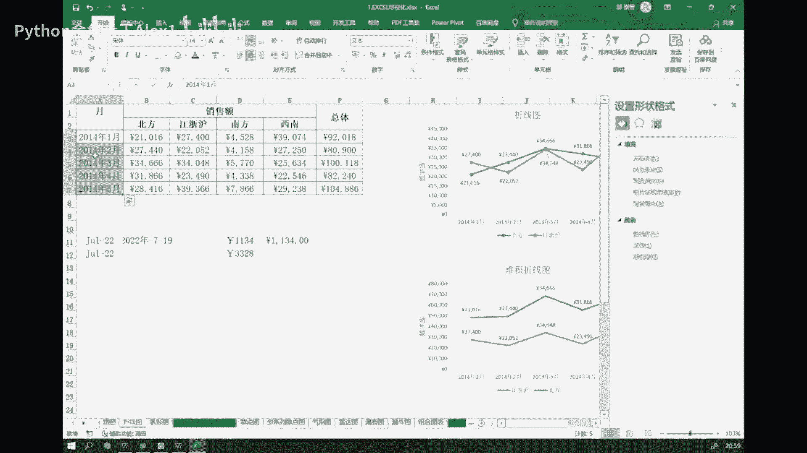

有效性，有效性检验啊之类的这样一些功能，甚至说一些单元格的安全性的功能，单元格保护的功能，为什么它本质上是给你提供excel的这个设计者，上游的用户去给下下游用户做什么，做这种对齐的。

因为这样的话你上边你数据才可以可以。

怎么样才可以去正常的一个统计，才可以提高效率啊，那包括如果这个问题你再扩展的话，比如说你像我们为什么在使用手机app的时候。

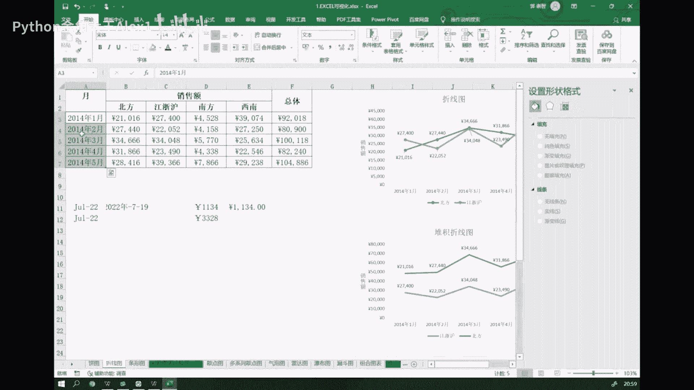

对吧，他会给你各种提示，比如说啊这个密码啊，比如说我们在设置密码的时候，为什么一定要有大小写，数字跟字母都要去组合，这是一种数据规范的一个意识啊，那再比如说我们为什么要去做嗯。

比如说这个做做这个照片的一个一个头像上传，它要要多少兆，多少兆以内，对不对啊，包括我们在手机在采集照片的时候，那它也也是要对这个数据做什么做清洗的，做规范的，如果不这样处理的话，数据乱七八糟啊。

那么我们其实到不论你前端怎么设计。

你到后端的处理都会变得非常棘手，所以说我们在在这个数据库设计的时候，比如说你线上产品，包括你后端产品，在设计之前，他都要考虑这些问题。

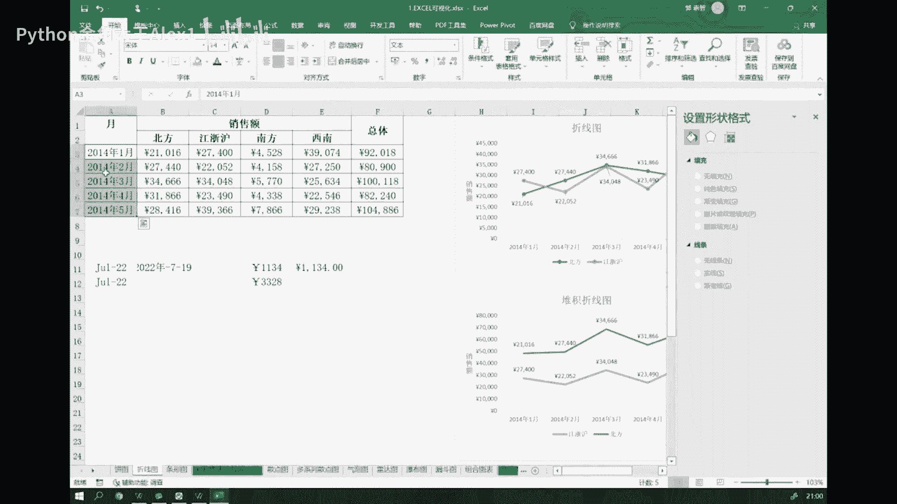

那这些问题谁谁帮帮你出谋划策呢，其实很多时候在大厂里面，都是数据分析师再去做，还有包括很多我们做前端数据采集，我想研究用户他为什么会流失等等的问题啊。

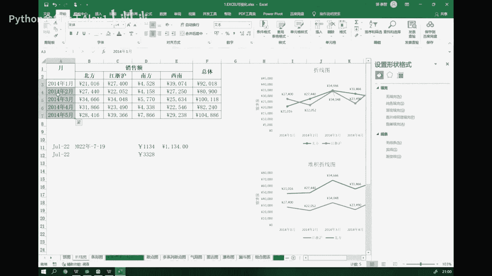

其实这些都是数据分析师干的活啊，这个就是我我们在这个数据的一个规范的。

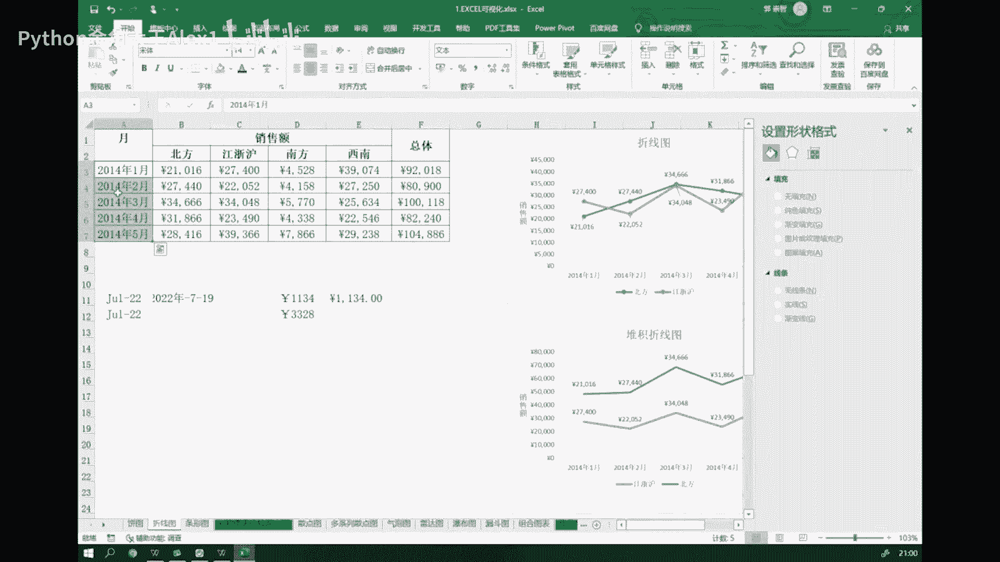

这个视角下啊，我们给大家做了这样一个扩展啊，但是我希望大家理解的是啊，即便是你仅仅是用一个最初级的一个excel工具。

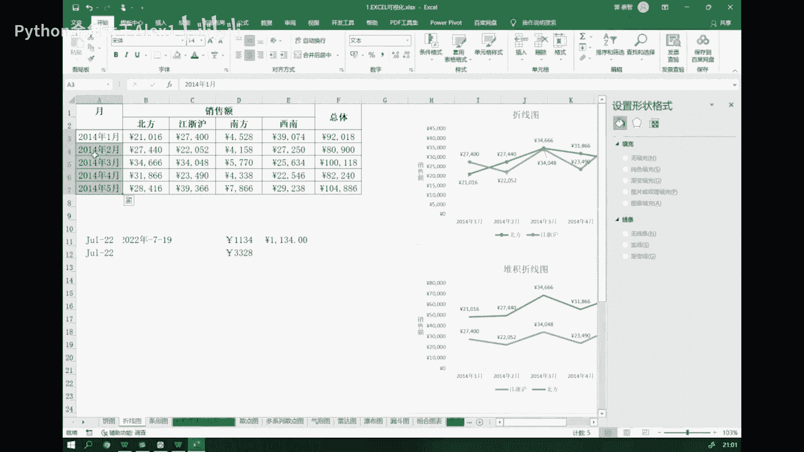

在解决问题的时候，那么你也应该有这样一个规范性的一种。

数据统计的思想，如果没有这个啊，那其实你学这个画一个图。

两个图没有任何意义，OK啊好，所以说啊这是第一个点好。

那么回来啊拉回来，我们说线形图呢通常是跟时间绑定的，也就是说我们通常看到的一条线呢，它的横轴啊，多数情况是一个时间，因为你表达的是趋势嘛对吧，你表达的趋势。

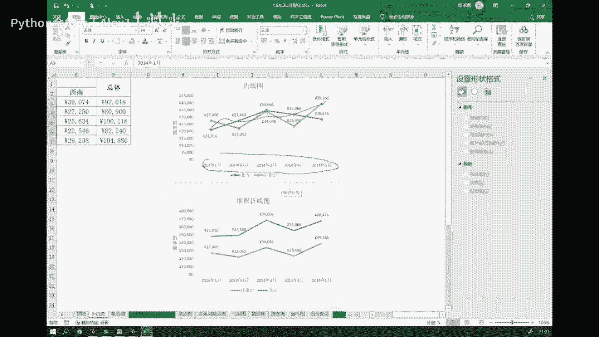

所以随着时间的变化，我们这个数据的一个变化周期，我们是可以通过线的走势来表示出来的啊。

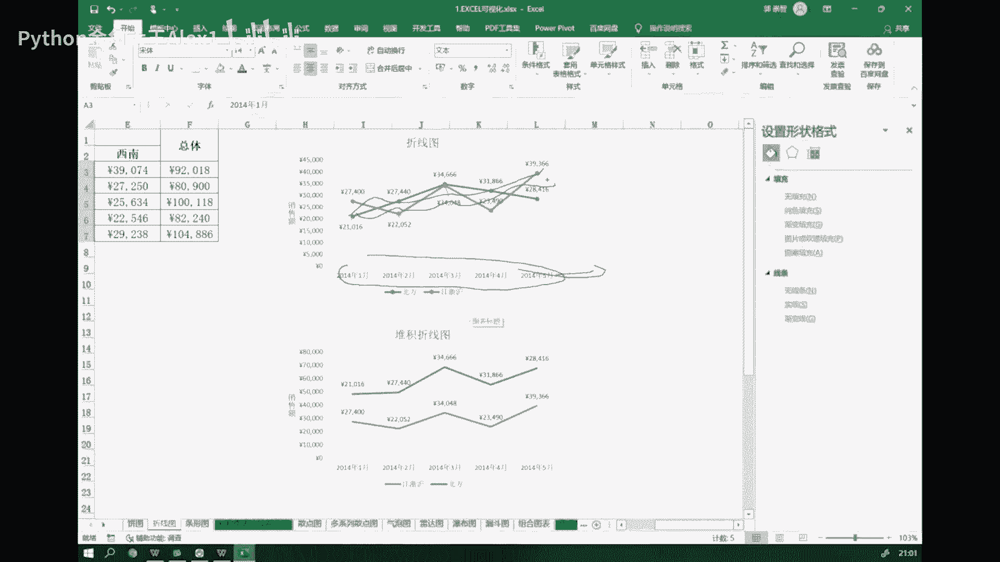

好但线的本质是什么，其实线的线形图的本质就是点啊，每一个点的一个什么直线的连接，连出了一条折线，所以呢它就成了一个线形图，我们也把它叫做折线图啊，就这个道理好线形图怎么画，画起来就简单了啊，你知道了。

我们这个线形图的一个使用的一个场景，它首先跟时间一般是绑定的，然后呢他表达的是一种趋势，OK知道这个以后其他的问题简单了，比如说我们现在就想画右侧这个图，想画这个图啊。

那我们先分析一下这个图里面有什么有什么啊，好这个肯定是两两张两条线，那肯定是两个系列对吧，然后这个什么啊，这个1月2月三月四月五月，这个标签怎么定制的，选择系列那个啊，那个那个类别名称我们往哪儿选，选。

选到我们这个左边这个单元格这个部分对不对，把它绑定进来就可以了，然后我们下边这个什么，这个是每一个系列的名字嘛，对不对，系列名字的话，那我们就设置咱们这个系列的名称就可以了，在哪能设置啊。

在那个数据里边。

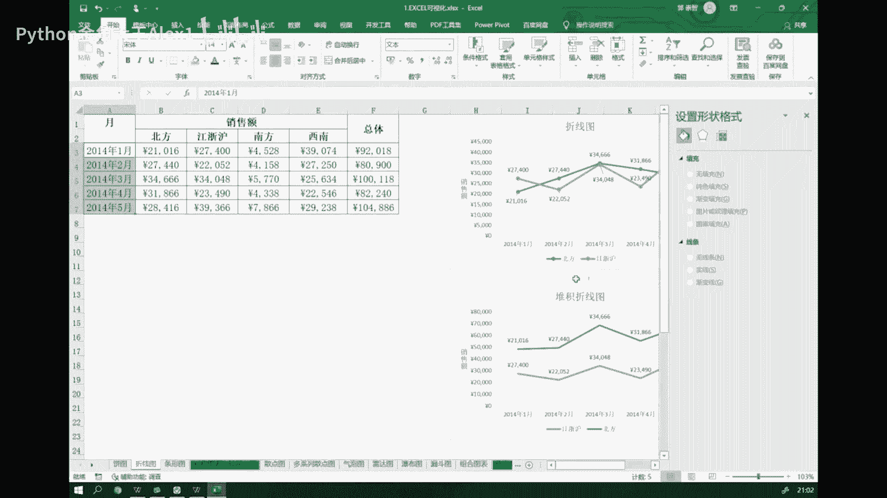

就是这里边我们点个右键啊，这是个图还设置不了啊，一会儿我们设置诶，能能设置啊。

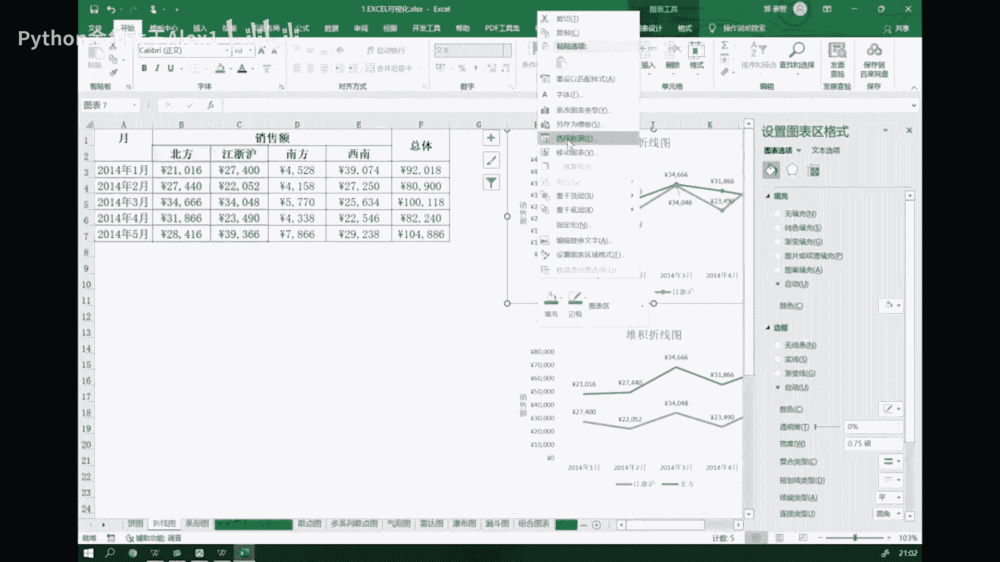

这里面两个系列嘛，一个北方，一个江浙沪，这两个名称对吧，就是这个和这个嘛，对不对，OK然后呢。

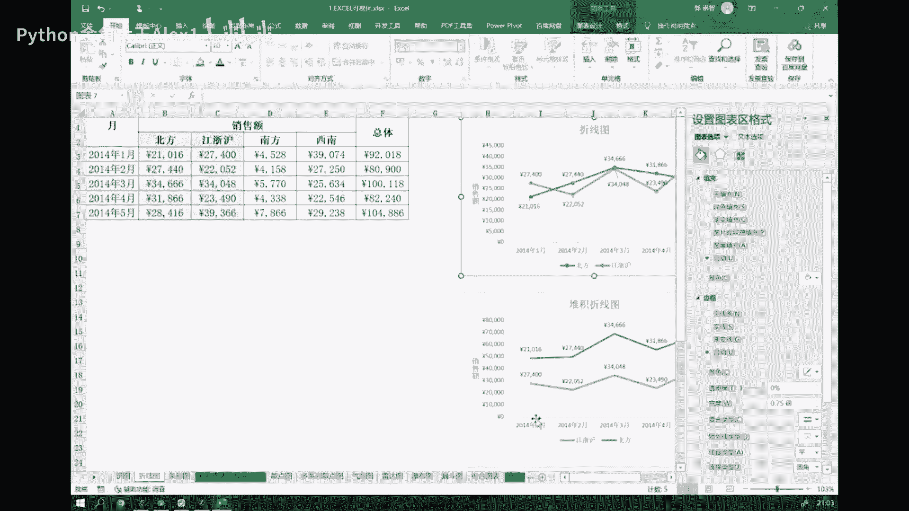

上边图表标题这个是最容易的。

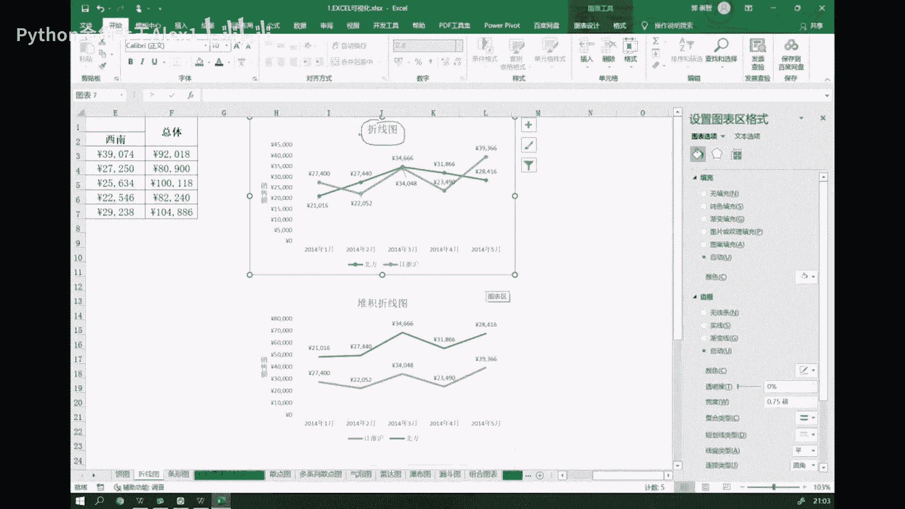

这个不用讲，大家也知道，你就手动改也可以对吧，OK然后其他还有什么，还有这个销售额，这是个什么玩意儿啊，什么东西，它呢叫轴标签，轴标签，我们这个叫什么叫轴的刻度标签，包括这个都是轴的刻度标签。

这个是图例，所以你要想显示我们这个销售额就是什么，设定我的轴标签就完了，OK好好那好，我先来画这张图啊，两个系列我先用一个比较简单的办法，就是如果你熟了以后，基本上你就这么干了，我我这么一选好一选。

然后呢，我知道这个线形图可以自动帮我们去匹配，它会把这个当成我的横轴，这个当成一条线，这个当成另一条线，这是最简单的一种方式，我直接就画一个线，那我在这里边选择这个普通的线形图。

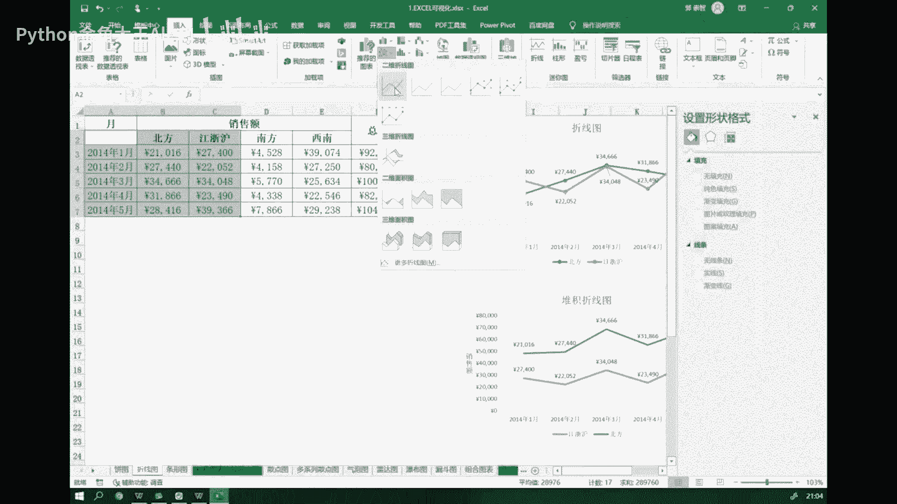

一会就出来了嘛对吧，然后我想把这个销售额这个展示出来，那我就加一个什么，加一个坐标轴标题。

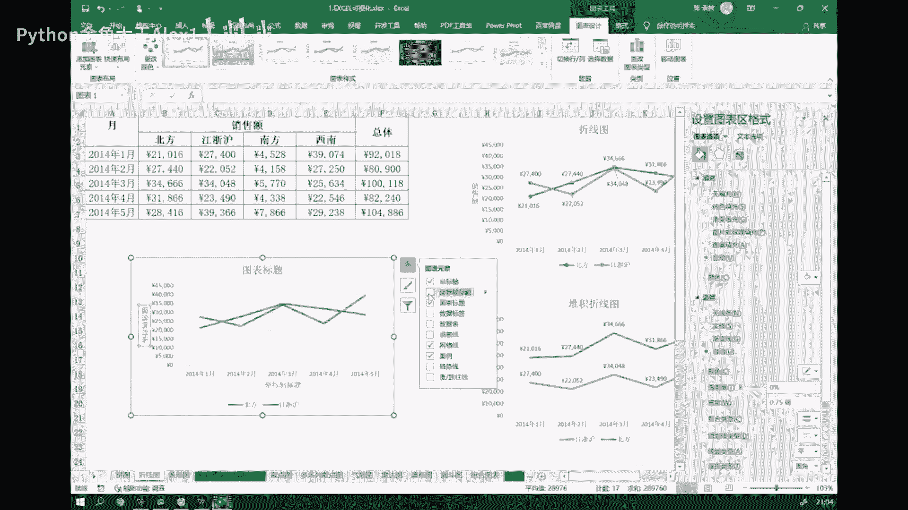

我得加这个横轴标题对吧，点这个纵轴标题，把这个展开啊，能看到纵轴标题。

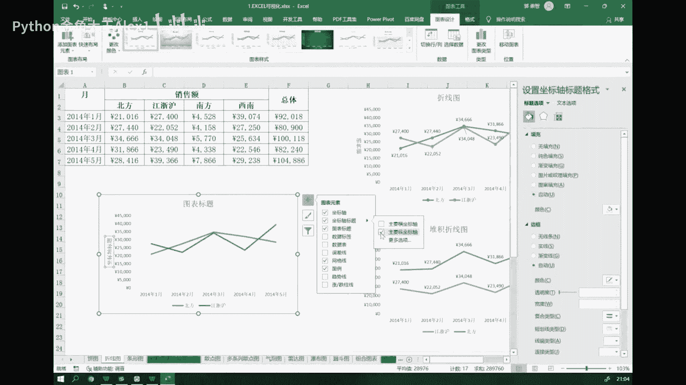

OK好，然后还有什么啊，还有就是我这个每一个点上这个标签啊，这玩意儿怎么设置啊，是不是跟那个饼图是一个道理啊，怎么能怎么搞，这里边我们点击加号，然后选择什么选择数据标签是不是出来了，OK啊。

然后我们这个线线的颜色怎么改对吧。

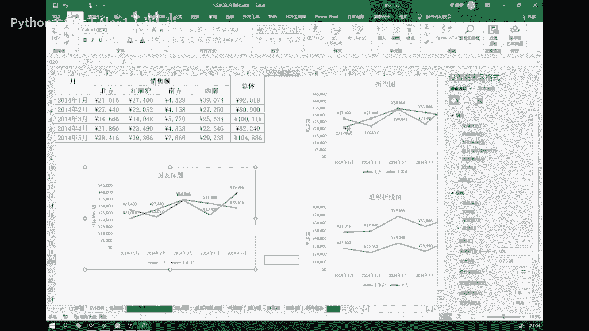

在这里边刷子里边选个颜色。

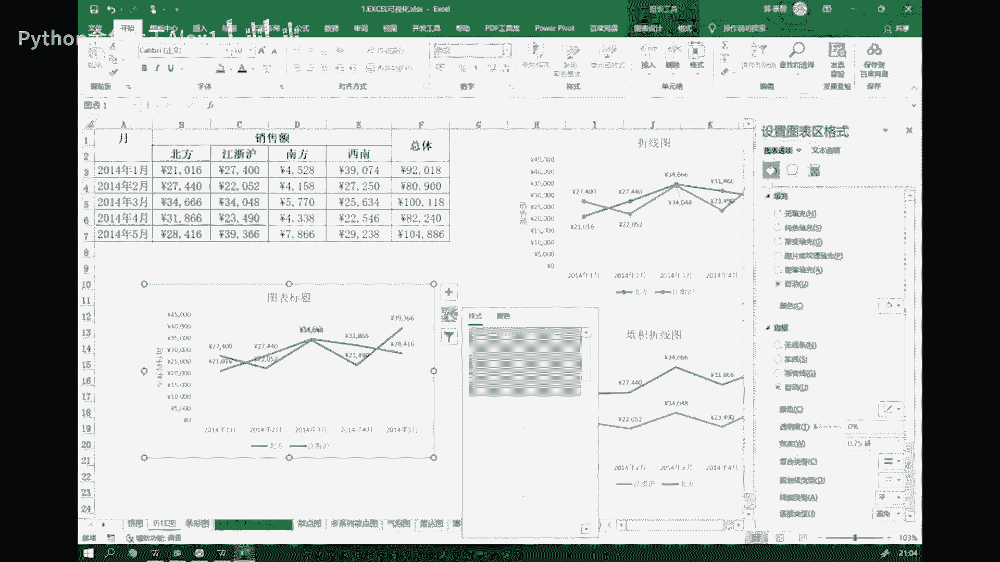

选个这个是这个颜色呀。

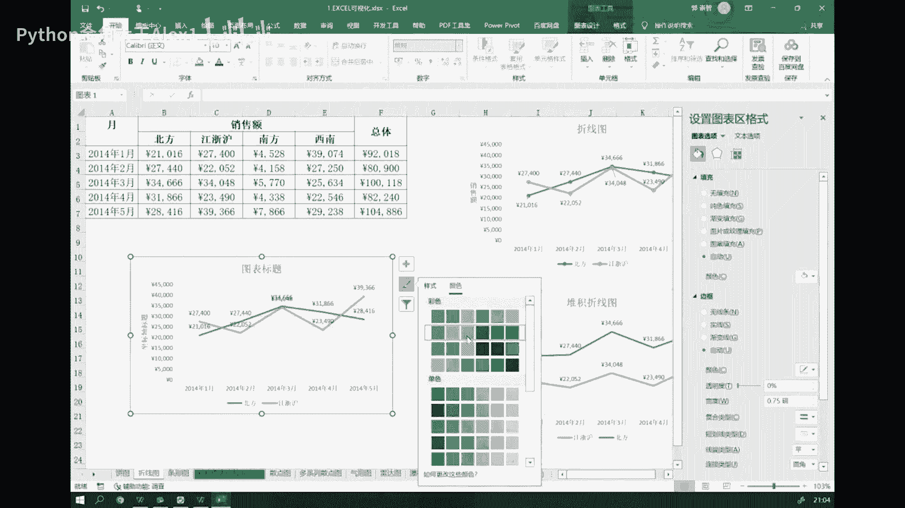

好图表标题这个地方显然是手动输入的。

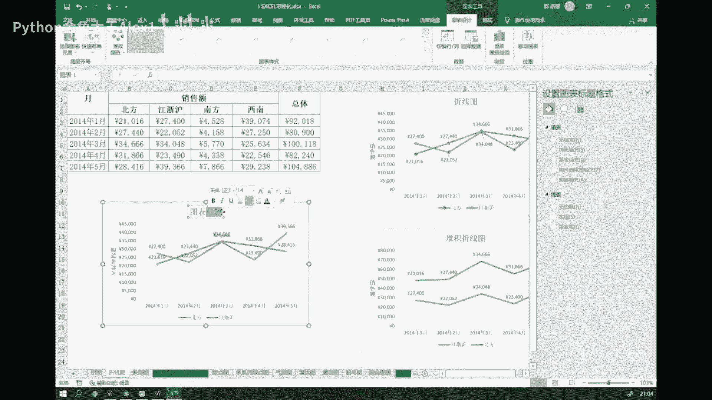

当然你也可以绑定一个是吧，哎电脑卡啊。

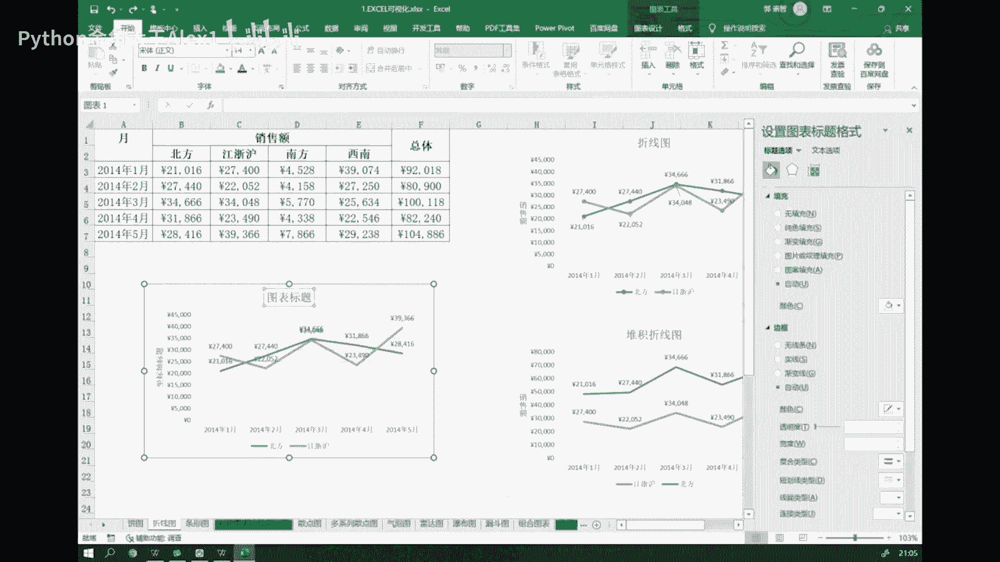

折线图啊，然后这个坐标轴标题呢给它改一下。

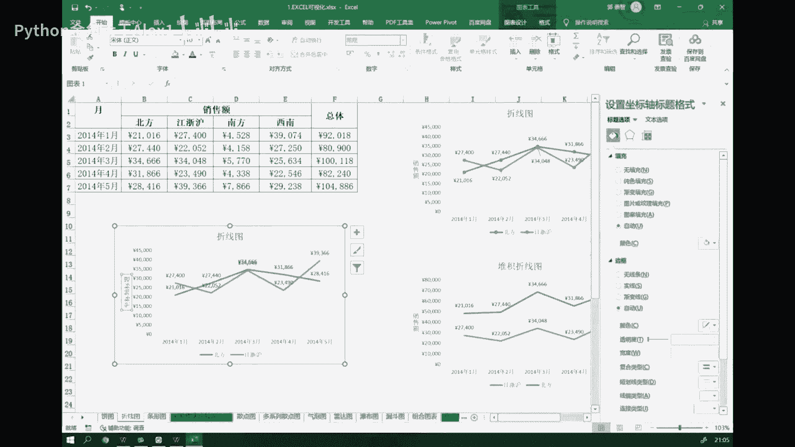

选中，删掉，然后叫什么叫销售额，OK啊，这图就出来了对吧。

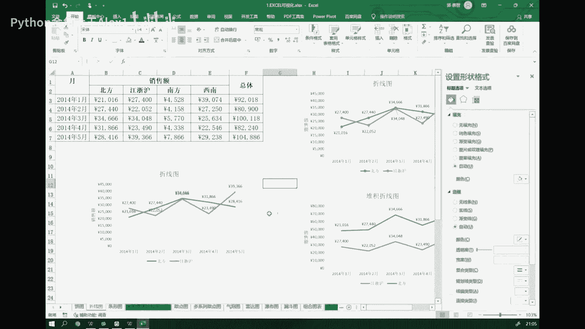

然后另外啊有个小细节，我们发现这个折线上面是不是有个小点啊对吧。

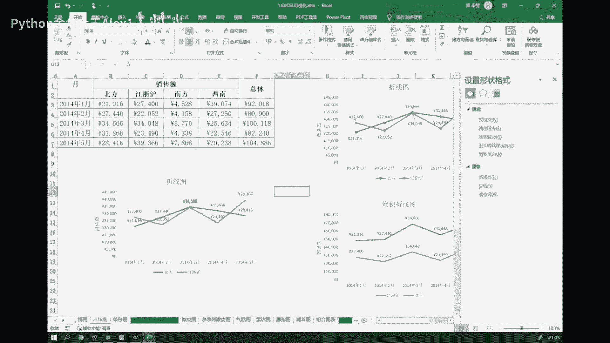

有个小点啊，这个点怎么设置好，我们来看这个小细节啊，线形图呢当你鼠标点中每一条线的时候，啊啊我会在什么呢。

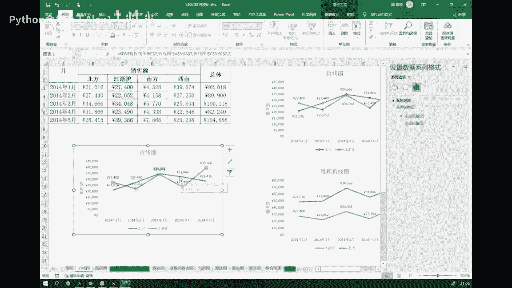

在这个它的这个基础的，这个就是这个填充设置里面啊。

它除了能看到一条线之外呢，就一个线的设置之外呢，还能看到一个标记的设置，这个标记呢叫Mark marker，Marker，其实是什么，就是这个点啊，就是这个这个点，我整个线呢其实就是这些点的连线嘛。

OK啊marker好，这个marker呢就这个标记标记，我们给它展开来看的话，这边呢有什么有自动有无，现在就是没有标记对吧，我们可以选择内置的，它给我们提供了很多内置的这种标记的形状，比如有正方形。

有这个菱形，有三角形，有差，还有这个什么，还有这个还有这个圆啊，我们选个圆好，然后这个大小下边我们调大一点，对吧，这样就看到了，然后你会发现呢，当你把这个线形图这个样式啊做了修改以后，我们加了点对吧。

你这个图里的这个样式是不是也跟着变化了，对吧，这两个之间啊是联动的，OK啊好了，另一个会设置了吧，好就不说了啊，然后下一个啊，这是普通的线性图，普通线性图呢就是我们我们在同一个坐标系下。

我们在沿着一个相同的时间轴，两个产品线的一个走势，那么还有一种呢叫堆叠折线图，堆叠折线图啊，它其实是我们这个普通折线图的一种变化啊，什么变化呢，变化在哪，普通主线图呢，我们只能表达两组数据的一个走势。

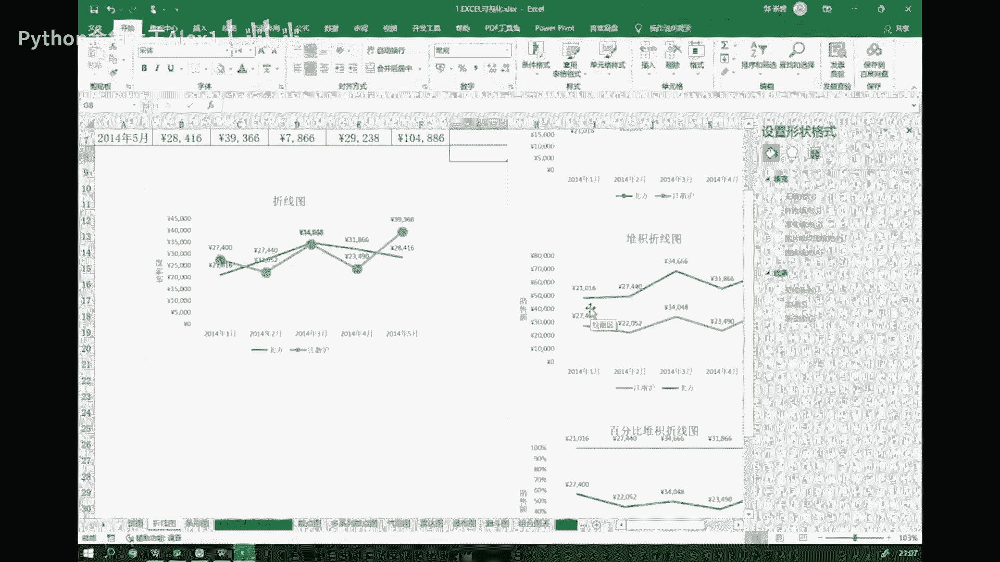

它们之间大小关系是可以看到的一个比较关系，它是方便这个的。

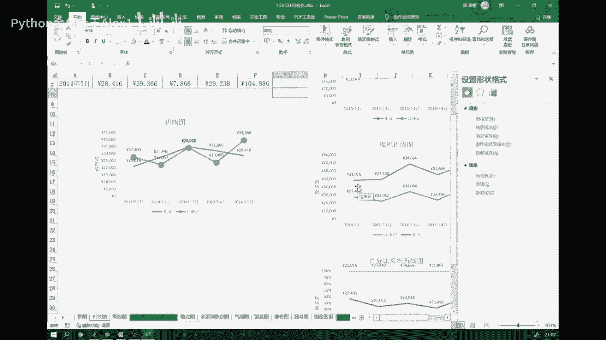

那如果是做堆叠的话啊，对比的话，我们除了可以看到两两个产品的一，个走势之外呢，我们还可以看到这两个产品，它们的一个构成关系。


比如说我们在1月份，我们在1月份一共卖了多少呢。


看这个轴大概是不到5万，对不对，不到5万不到5万，这里面有2万7400是由我们江浙沪提供的，然后呢剩下这个差2万7400到往上，这一共是2万1016，这是多少呢，这是北方给我们提供的，看明白了吗。

所以说其实在这个这两个加到一块儿，共同达到了不到50的这个位置，所以实际上呢这个堆积折线图啊，主要体现在堆积上，就它表达的是什么呢，是同一期同一期我数据的一个构成，就我除了可以看到两个产品线的一个趋势。

我还能看到在每一期上两个产品的一个构成，对吧，不像它只是一个比较，而它表达的是一种构成关系啊，这是堆积折线图，设置方式完全一样，简单演示一下，比如说我们现在想表达北方江浙沪这两组数据，它的一个堆积啊。

怎么办，选中它，然后点击插入，然后选择线形图，选择这个堆积对吧，然后就可以了，其他设置都一样的啊，那另外一个呢嗯下边这个叫什么呢，叫百分比百分比堆积折线图，它和堆积折线图有有什么差异呢。

它是给你转换成一个百分比的形态，因为这种情况呢我们能看到数值的大小，比如说总和是大概50万，然后其中有2万啊，这5万是吧，有2万1是这个这个北方给我们提供的，然后有2万7400是江浙沪提供的。

他只能看到数值，但是有的时候呢，我们我们希望用这个用占比来表达大小对吧，所以呢这种情况呢，我们就可以用百分比堆积折线图这种图啊，它永远最上边这条线呢是一条平直的线，为什么。

因为到这个位置它是百分之百了啊，也就是说2014年的1月份，这一期，北方和江浙沪这到这百分百的数据当中呢，有百分之不到60的是给是这个江浙沪提供的，然后剩余的40%多呢是北方提供的啊，就这么一个差异啊。

所以变成了一个百分比堆积折线图啊，比它更进一步啊，来表达一个百分比的形态好，它怎么处理啊，也是一样的啊，我还是选它，然后点击插入，选择这个图像里边的第三个图百分比啊。


然后后边的图呢，就是我不它是给你自动去帮你去做了。


那个点的大小，还有那个点的一个配置啊。


诶所以那个啊其实我们可以手动去修改啊，都一样的，这是什么意思，在这儿啊，你看插入是有这个带点的呀，对吧啊。

其实这个我们可以用手动设置就完了啊，它还有一些三维的啊，OK好。


然后下一个条形图，条形图的话呢，其实它跟这个线性图的逻辑也差不多啊，那么条形图的话呢。


通常我们是来表达两组啊，就是多组数据之间的大小关系的。


他最擅长去说这个啊，比如说不同类别的数据啊，像这个是我们我们想去比较啊，这个比如说这个北方江浙沪西南。


南方西南他们的眼妆的一个销售量的大小。


我们可以做这种比较对吧，那再比如说我们想看啊，北方在北方这个区域里边，它每一个品类它的销售量的大小，也可以做这什么，做我们这个条形图的展示啊，OK那么比如说我们这个是比较好弄的。

比如说我们以地区为为横轴，然后这个以这个眼妆的销量大小，销售额的大小作为我们这个柱状图的一个高低，它我们直接选中就行了，选中它呢我们点插入，然后选择这个条形图，对啊，默认情况就这个就这样子的。

北方江浙沪，南方西南，然后眼妆每一个销量大小成了四个素质。


但是我们现在如果想想变化一下。


我们现在想换一个，我们现在想表达这个北方啊，北方这个区域，然后这个眼妆底妆唇妆刷子，我想表达这组数据怎么办呢。


啊怎么办呢，是吧好，那我们选中它。


我们来试一下啊，选中它，我们直接点插入一个柱状图。


能正常显示吗，看一看眼妆底妆。


唇妆刷子诶，显示出来了对吧，显示出来了好。


那它是怎么显示出来的呢，我们可以看一下啊，这两个图，这两个图看明白了吧。


这两张图有什么区别对吧，一个是展示这一这一列数据，一个呢是展示这一行数据，对不对啊，这两个图它们之间有什么区别，那么你其实可以看我这个选择数据里边，看这个就知道了，其实主要是谁不一样，是系列不一样。

系列不一样，和什么和标签不一样，所以其实我们完全可以。


通过手动的方式来配置，比如说我们现在想把第一张图也变成。


跟第二张图一样的，怎么搞，把这个系列改了，编辑它的系列不再是表达眼妆这一数一数，而是什么呢，而是北方这一行好。


那我们系列名称就叫北方了，选中它对吧。


然后我们的系列值怎么办呢，我们不要这一竖了，我们要这一行了，选中它，确定好了，现在两个图数一样了，但是还有区别，我们下边这个标签数有问题啊，这个标签应该变成什么眼妆底妆唇妆刷子了，怎么办。

调哪儿调右边调你的标签项，对不对，这个标签怎么改啊，点击编辑好，我们选择区域，哪个区域是不是这个区域啊，眼妆底妆唇妆刷子啊，那它作为标签项好了，确定变过来了对吧，这点确定好了，我们来看这个时候。

我们的第一张图和第二张图数据完全一样了。


OK啊好，这是什么，这是一种啊，那好了，我们现在想继续变啊，想继续变，现在呢我又想看第二组数据了啊，第二数据了，我我在一张图当中，我想看到江浙沪的眼妆底妆，唇妆和刷子。

他们的一个销售量的一个情况怎么办呢，好在这张图里边，我们现在只是展示的是一个系列呀，就是一组数据啊，现在我想展示第二组数据怎么办，右键啊选择数据家系列对吧，左边现在只有一个系列是北方。

我再加上一个江浙沪系列进来不就完了吗，点击添加好系列名称是谁呀，选择江浙沪啊，然后系列的纸是谁啊，把这个选中就是这一行，确定好标签怎么办，一样的选择眼妆底妆，唇妆刷子回来确定好了，现在这个图就变了。

变成什么了，变成一个包含两个柱的这种图像了对吧，其实这是一个簇状条形图了，当然了，如果你想去做这种图像的话呢，其实你完全可以不用这个图了，用什么呢，换一个把这个删了啊，把这个删了。

我们直接把这个这两行给它选中，选中以后，然后我们点插入，然后选择这个条形图，选哪个呢。


选这个嗯，簇状条形图。


OK其实还是一个好的选择，这一个现在是什么，跟刚才完全一样的对吧，那好了，我们现在想再变啊，现在变。


现在呢我我我现在看到的其实是四个四组数据。


眼妆底妆，唇妆和刷子啊，然后下边是北方江浙沪这么划分的，如果我现在想怎么样呢，我现在想把它两个呀给它对调一下。


什么意思，就是我的图例要用眼妆底妆，唇妆和刷子来放。


然后呢，我北方和江浙沪呢作为我的横轴标签怎么办，这个事儿能搞吗，那我是不是还要去手动去选择呀，这个选择数据啊，然后一个个调呢，不用啊，这时候不用一个调了，如果你单纯的是想把这个和这个，做一个对调的话。

那我们直接怎么样，在这儿看到了吗，切换行列就完了啊，点击这切换行列是吧，直接就变过来了，诶这是北方那一组，然后这呢是江浙沪那一组，分别是四个不同的产品线啊，他们的一个销售数量，OK好。

这是我们的普通的簇状条形图啊。


它表达什么意思呢，对不对，它表达其实就是两组数据之间的。


组内的大小比较，也可以也可以做组间的比较对吧，他在这儿给你做了一个划分，但是这有什么不好的地方，它不好的地方就是你你没有办法比较。


北方和江浙沪到底哪个区域卖的销售额更高。


我只是能看到每一个区域的每一个品，它的销售额谁高谁低，对不对，比如说我们红色这个这是什么底妆，我可以知道北方的底妆呢，是要比江浙沪的底妆要卖的多一些的对吧，然后我还可以看到北方北方的这一个组内呢。

它的底妆呢是卖的最好的，跟同类跟其他商品相比，实际道理吧啊能我能看到这些信息。


但是如果我想同时看到啊，每一个区域的总销量的话。


这种情况是什么呢，就得用堆积条形图，我要把它们一个个摞到一起啊，摞到一起，用颜色给它们加以区分。


我同时知道每一个区域内内的，各种单品的销售总额。


我还知道每一个区域的销售总额的一个大小关。


系对吧，这种情况啊，好把这个删掉啊，我们来看，现在我们想查看啊这个每一个区域内啊。


每一个区域内他们的这个少一点吧，就是眼妆加底妆吧，啊我们这儿做一个插入选择这个堆叠啊，堆叠条形图好，我们看到什么是吧，现在很明显了是吧，那显然呢我们这里边啊，南方这个区域啊卖的是最少的对吧。

这个销量垫底的其他几个区域呢差不多啊，但是北方会最高，然后呢那同时我们如果关注到北方的话。

