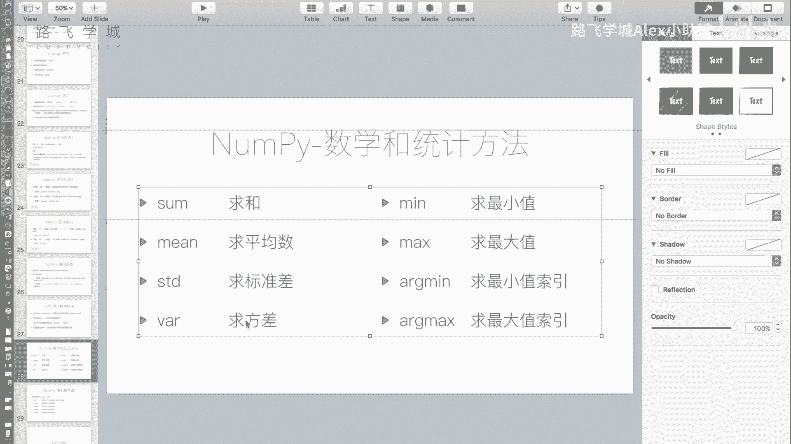
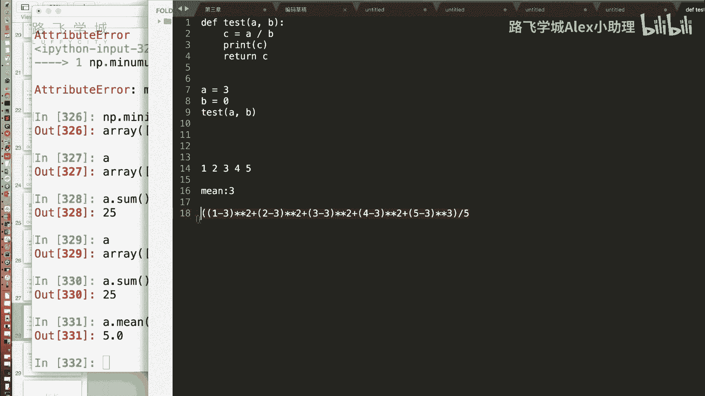
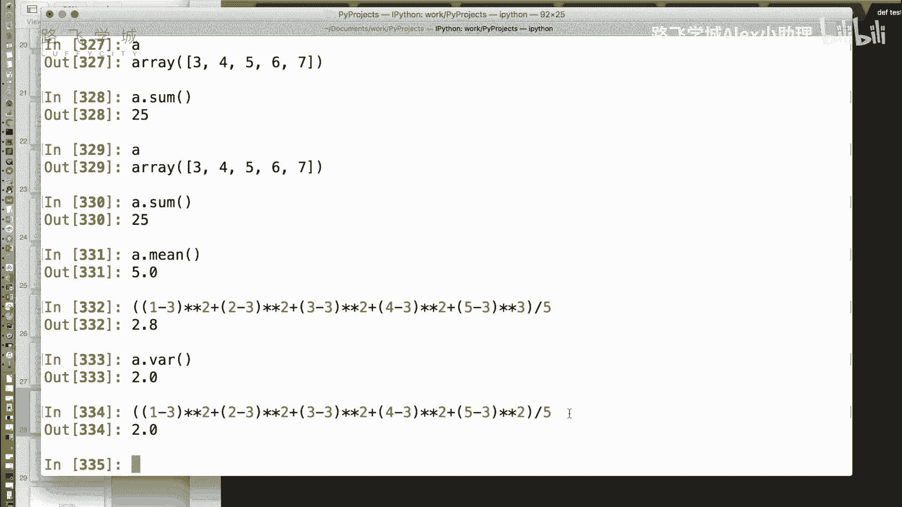
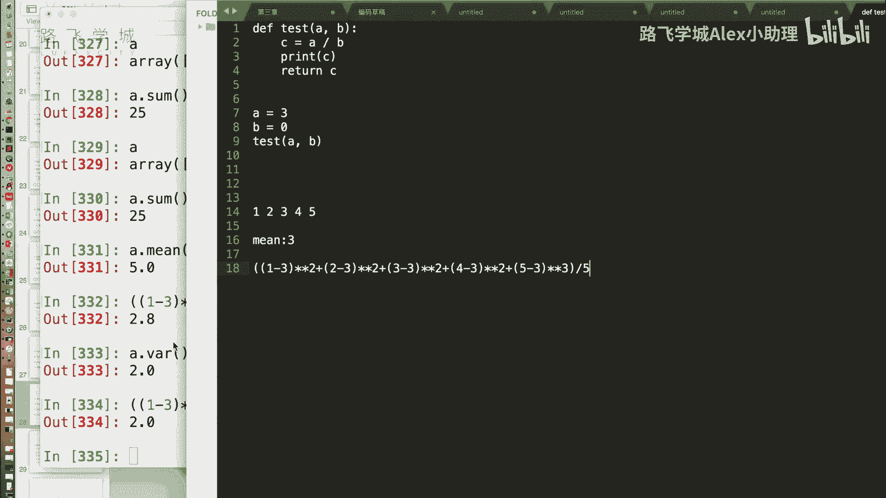
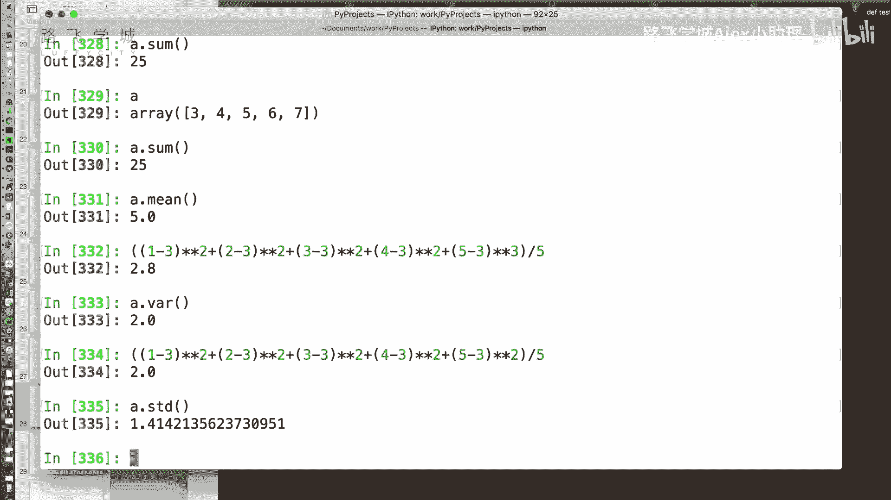
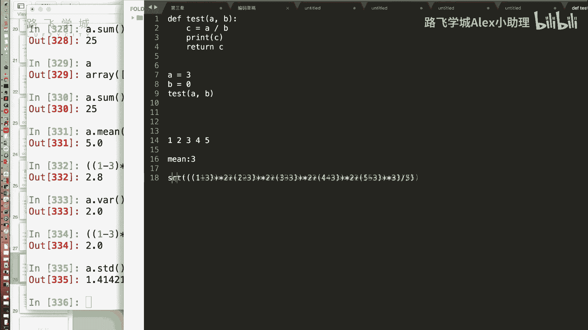
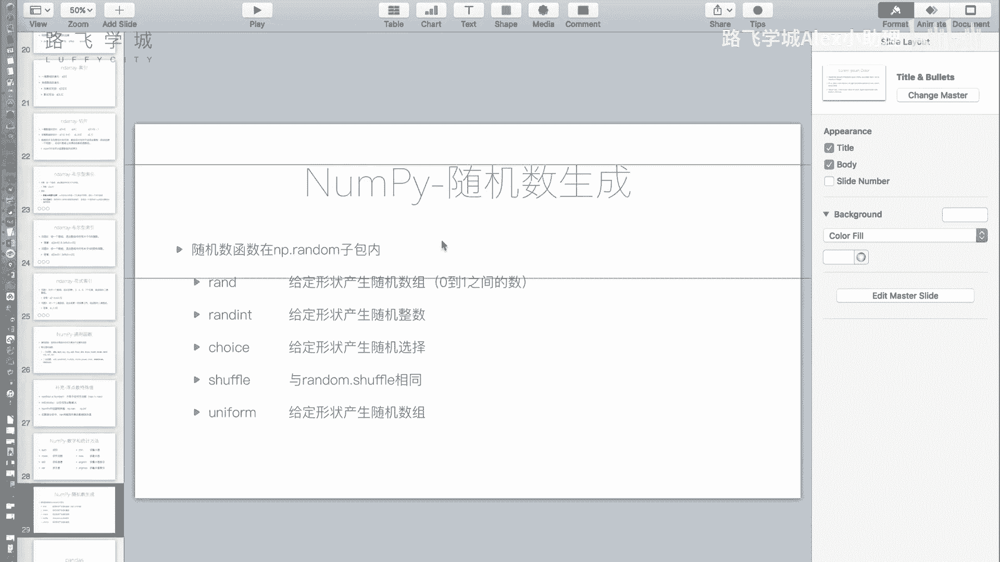

# 强推！这可能是B站最全的【Python金融分析+量化交易】系列课程了，计算机大佬精细讲解从入门到项目实战，看完全程即可就业！ - P18：16 金融量化分析-numpy-统计方法和随机数生成 - 路飞学城Alex小助理 - BV1FsmyYHEGy

好，那接下来我们说一下number py这个模块，提供了一些数学和统计方案啊，SAMSAM是什么不就求和了吗，还是说对提供了一些方法吧，A点sum这个方法对A里边所有值进行求和啊。

两个加起来两个加起来两个数组加起来A啊，我知道我的意思是说，你跟那个自带的sum有什么区别吗，没有太大的区别啊，那就一样的，是嗯啊啊，那自带的有这个吗，mean啊，求那个平均，求那个求平均值。

平均值有啊，有一个有一个叫average age，在那个什么模块里，在哪个operate，不是你看你都不记得吧，在max里面有他Mac里没有，那好吧，那就没有啊，命方法平衡平均值啊。

然后接下来是两个大家不知道，知道不知道的数学概念，求标准差和求方差，来再给我们普及一下吧。

哎现在是数学时间啊，这里有一组数啊，12345，它的平均数是几，是不是平均数是三嗯，那方差怎么算方差看啊，1-3我懂了，这个东西是说相当于方差还是平时差，我忘了，也是是他俩的差距越小。

就代表这个每个数之间的，那个那个那个一个波动越小对吧，这是工业上用来运看那个良品率的，没有听过好哎，怎么算方差，先给大家给一个式子啊，我就不给那个正经的带求和号，那个看起来特别复杂的数学式子了，就算啊。

1-3的平方加上什么呢，2-3的平方嗯，加上3-3的平方嗯，加上4-3的平方，再加上，5-3的平方嗯，然后括起来，这个是求标准差吧，这个方差啊除以五啊，这个就是方法啊，咱们可以算一下这个值啊。

2。8对吧，我们来看方差的这个这个方法是VAR，为啥2。0，为啥是2。0的，哦我这写错了，应该就是2。0，看我这个二改成三了，看你看为什么要重新二平方嘛，啊你看这都是平方嘛，都是平方的。

就是你每一个数减去均值的平方，再求和，再除以你整个的个数，所以这个是方差，是为了算这方差是为了算方差表示什么，表示你数据整组数据的离散程度对。

那不就求良品率嘛，你比如Y之前我也对，就是我有我生产一组IPH这个IPHONE呢，比如说那个之间的那个缝隙的差距，有的大有的小，但是整体来讲它差的越小，就代表我这个良品率越高，对是不是啊，对对你说的对。

就是比如说一组零件啊，你要求它的直径是三对，但那你结果量了五个12345，对对对，然后你求一下方差，发现方差是方差是二比较高，有问题比较高了，那就不太好，对啊好，那它表现的是一个我们说叫离散程度嗯。

也就是说你方差越大，你那个数据越零三，如果你对五个数都是三，方差是不是零了，对那就代表就非常好，就对，就没有方差，那你说的那个良品率。

其实更多的一个指标是用标准法，标准差是啥，标准差是STB这个函数啊，那这个是啥。

这个其实就是方差，看到没有，最后再开个根号再括起来嗯，帮他再开个灯，再开个灯啊，SKSTKKSR啊，s qr t就不会偏了啊。

你看本来方差是二对吧，标准差就是根号21。414嗯，标准差越小代表标准差表现一个什么标准差，可以可以根据均值加减标准差，来估计整个一组数据的范围，来我举个例子，啥忘了怎么办啊，上课我教你。

你给我辅导这个这个这个数学吧，之前还专门在项目中还用过，好诶啊，这怎么说，这个是0。2，好们来看A这是一组数对吧，我们来看A看一下a min和A点什么，s std是标准差，嗯好我们来用什么呢，A咳咳嗯。

幂加上它的标准差和a min减去就是平均值，减去它的标准差，这两个值哎，大概就能估计出你这一组数的一个范围，就是我通过它大概能估计你这几组数，是在二到7。7之间，这组数对，但实际上不是，但实际上不是。

这个和数据分布有关，这个我们暂时不详细说，也就是说什么呢，有可能我这个是比如说我有呃，1万个1万个产品，1万个零件，我不可能每一个都量一下对吧，那我可能抽100个出来量嗯，我100个扬完了之后。

哎我100个只有了，我算一下它的方差和均值嗯，就是平均值和方差，比如说平均值是4。9，方差是2。8，那也就是说我可以大概估计我整个100，这1万个零件啊，如果这个说数学上，如果说它是正态分布的话。

就是一般的分布的话，它的零件的66%点多，都在7。7和2。0之间两，那你再正确的话，你可以加减，我这不是加减的一倍的s std吗，有加减两倍ST啊，这些都有一个置信概率，嗯啊两倍X你看就你看就可以。

两倍两倍的方差的话，我记得执行概率好像是90%多，就是90%都落在这个范围内，0。8的-0。8的时候，你看就差不多了，嗯对不对，嗯啊这是说数学上的一些应用了，那咱们可以暂时不管它啊。

你要记得标准差STD啊，标准差是SDD，方差是VARNARK，这是这两个数学函数，那后边还有两个大家可能见得比较多了，min和max啊，A是这个数，max是什么。

就找最大的数嗯mean就是找最小的数目好，还有两个A点ARGX，A点ARG幂这个数字上用的有点多，它其实返回的是啥，它返回是最大的那个数的下标哦，所以对你看这9。8嘛，在这是最后一个49。

那min就是0号这个啊，这是一些数学和统计法嗯，然后接下来最后我们再来说一下，number py的一个功能叫做随机数生成，就跟random一样的对，我们都知道我们自带的random模块是什么。

这个是自带的随机数，是在random对吧，还有几个函数呢，复习一下random点，Int range ge，第一个shuffle sample，第一个random啊，是不是返回0~1的一个数，浮点数。

0~1的一个随机数，对不对好，第二个常用的可能是RINT，给一个A和B返回的是0~10之间，反对A0到七，0~10之间随机的一个整数对，然后random int random range就是包括是呃。

没有那个东西啊，可能还有一个choice，344记得吗，我传一个列表，比如说1345哎，我就从1345，这四个数里随机扔一个返回出来，对对不对对好，那还有什么shuffle杀啊，杀UFFLE就是洗牌。

打乱一个数组嗯啊这是A等于啊，列表1345好点，3random点啥点，Shuffle，嗯OK打乱了好，那这些函数我们在number py里，在它不是直接点，是RNP点random这个子包下。

这也是一个包，在这个包下有一些函数，那有人说为什么要提供这些函数呢，对数组对我批量可以生成一个数字，比如说举个例子，RINT函数啊，可以和之前一样的用，还记得之前有rn int吗。

0~10嗯对就是扔一个随机的数数了，嗯这个是一样的好，那不一样的是我还可以添加第三个参数，我添加一个十，你看多少啊，就是一个称之为事件的数组，第三个其实相当于传的是，你这个你要生成的这个array。

一个sheet嗯，那我不可以传，不光可以传一个是，比如说我想生成一个二维数组，生成一个三行五列的数组，那我怎么办，我这写个元组三五这么牛逼，这是不是那个圆那个array sh吧，嗯对不对。

你看你看你拿它回去，它它点shape嗯，是不是352，所以就是哎你当然你这如果传一个354，它返回就变成三维数，我靠我就变了RIN，那其他的几个函数都一样，比如说这有RINT，这有是不是有random。

那个random函数现在叫ran了，不叫random了啊，在这个里边的render了，是返回0~1的对吧，原来没有参数，现在比如说我传一个十进去，那就是长度为十的0~1的一个嗯，非常好嗯。

其他round rint choice，Shuffle，shuffle的话和random shuffle就是一样的，因为他也没有生成数组，只是打乱了，对不对，choice的话。

原来我可能是比如说12345随机出一个，对不对，原来我只是出一个啊，不加就是出一个，那我后边还得加，我出个长度为十的哎，一看就是随机出十个，每一个都是从这里边随机出一个，明白除十次好。

那还有一个我不知道大家知道没有，在原版的random里边，比如说我想出一个我有随机的整数，对不对，比如说我想出随机的浮点数，我想出2。0到4。0之间的一个，随机的浮点数，你知道什么难受吗。

在就普通的random是吧，2。0到4。0之间的一个什么一个小数，一个随机一个小数，不是你不是说了么，uniform吗，嗯啊对我说过了，uniform这个函数为啥是这个函数，它有好多函数。

这个函数它是一个叫做为什么是uniform，是分布，它是一个分布，我们说这个数据是平uniform就是平均分布的，就是说出现每一个小数的概率都一样，嗯啊当然还有一些高斯分布啊，其他的这些等等我就不说了。

还uniform，比如说我们想出个2。0到啊，2。0到4。0的一个数啊，就这么写，那在NP里，那就是NP点random点uniform嗯，哎同样那同样我们可以加一个参数生成十次，嗯其实这只是一部分啊。

random里，基本上所有的函数嗯啊，都会被都被这个number py这个模块，重新写了一次啊，支持了直接批量生成数组的一个功能，Good，这是我们说的number py的随机数生成。

生成好一些常用的方法嗯好，那关于number prey这个模块，我们就讲到这就全都里面所有功能都讲了吗，常用的所有功能来讲，这些功能我们略选哪些功能，比如说傅立叶变换，比如说线性代数计算的矩阵的乘。

计算矩阵的秩，计算矩阵的逆等等等等啊，包括有一些他涉及到直接读写磁盘上的文件，而我们为什么不在这讲，因为我们下一个模块要讲pandas这个那个模块，是我们整个数据分析的一个核心包。

OK这个number批判是一个基础包，你可以看到我们讲的好多部分都是数学上的，都是一些底层的数学的，那总结一下，你刚才讲这number py里面，我们常用的就是数数组的定人定义数组。

然后对它进行的这种这个增删改查索引对吧，各种索引是不是，然后另外还有什么，那第一个，你上次刚才说了一个数组结构是两核心，那他可以批量的进行运算一，那他可以有一些常规的我们的索引和切片。

还有两种高级的索引方式是过性作用和滑索，然后number pi模块还提供了一些函数，一些通用函数对对一些数学的统计方法一样，然后包括我们刚才最后普通的随机数生成嗯，那他还有一些更多的功能。

我们因为我们可能暂时不会去用到，所以时间关系我没有讲到，OK好就这些是吧，对这是单发出的所有功能。