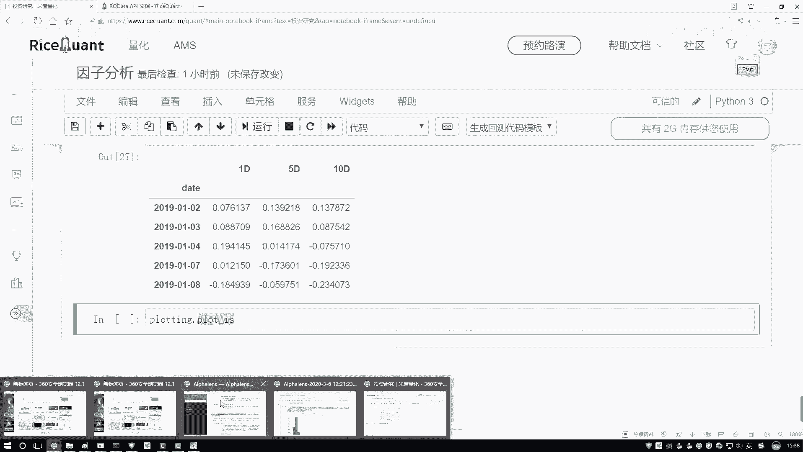
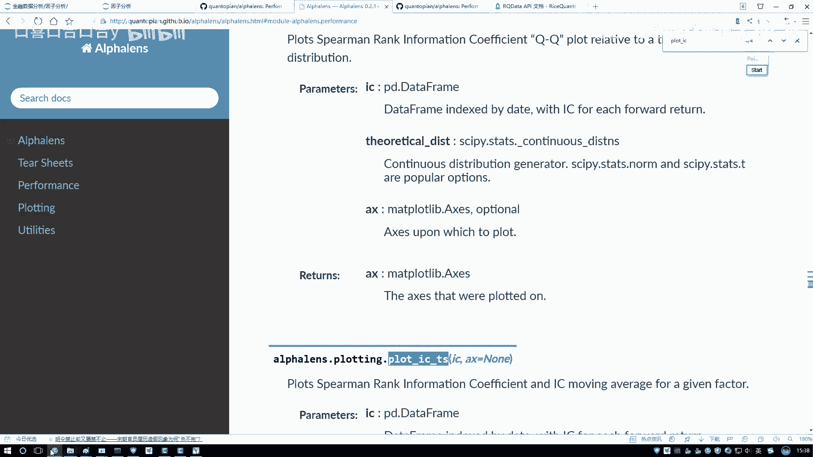
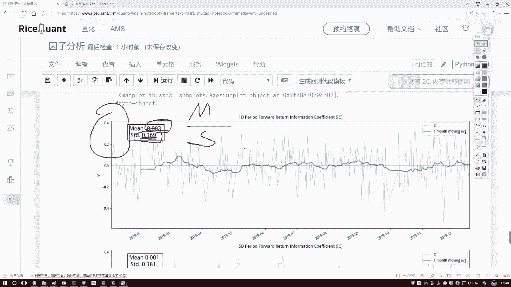
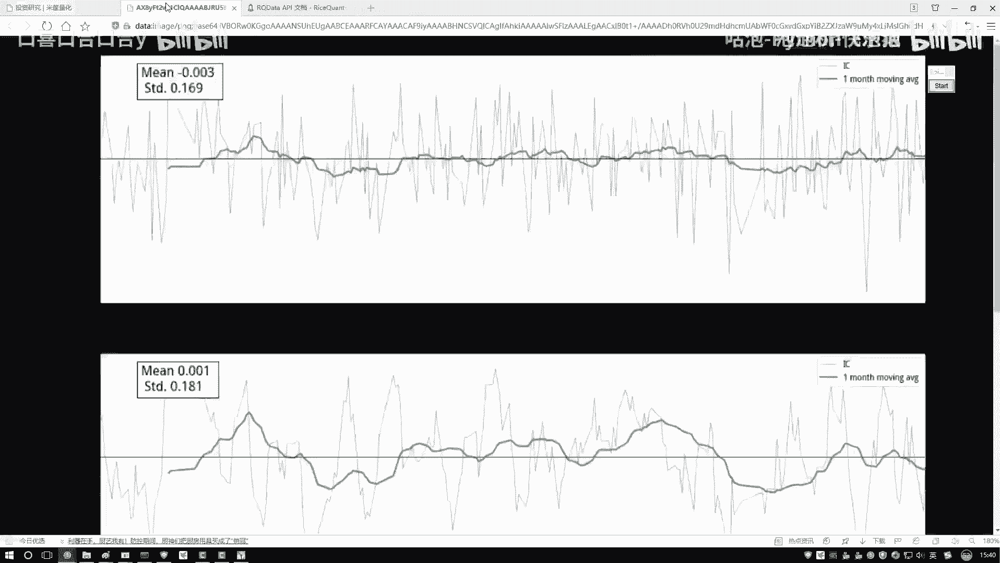
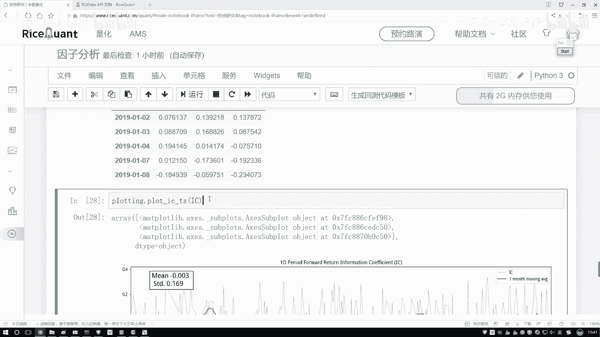
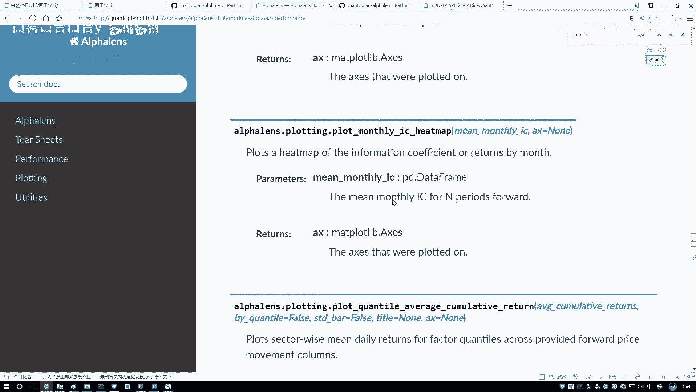
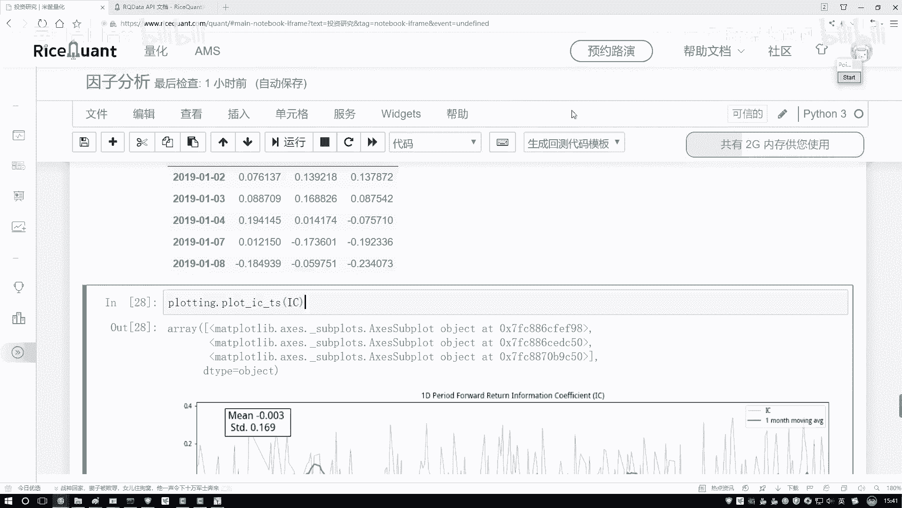

# 【量化交易教程】全100集（完整版）清华大佬耗时一月讲完的系统python金融分析与量化交易实战课程，包含基础教程，进阶学习，项目实战案例讲解，存下吧，比啃书好 - P46：46.46.工具包绘图展示(Av1302064773,P46) - 萍乡树里女装 - BV1dx4y1q7iG

然后在这里啊，就是我们只要关注一期就行啊。然后这是五期，这是1期的方法。像我刚才说的在上面，我们是不是把这个相关系数算完了。那其实算完之后，哎，你说你喜欢相关系数大的还是喜欢相关系数小的呀。

相对来说咱们喜欢大的吧，大的有研究的一个意思啊，你跟我相关啊，而且跟谁相关的，跟收益率相关吧，越跟收益率相关的，可能是咱越想要的吧，但是有问题。😊，你看啊现在我们拿到这个因子了，这个因子啊。

当前我们算啊这个IC值是不是每天都不一样啊？那通过这个图啊，咱可就是通过这个结果可能看的是不是不是特别明显啊，我们能不能把这个图给它画出来啊，来看一下吧，这里我们还导进一个工具啊，叫pluting是吧？

它呀是帮我们做展示的。咱把这个结果给大家画出来。😊，protin当中呃点pl一下点pl，然后它是一颗ICIC杠什么来着？哇，记不太清了，咱查一查IC当中，然后呃找一下。

呃，不是IS是IC不是是IC杠一个实验序列，它是一个t series来找哎这呢IC杠实验序列是吧？其实刚才还看到一下API这些就是大家你想看都可以去展示一下它不同的一个结果，画直方图啊，画QQ图啊。

看看是不是分布都行。咱主要看这个实验序列吧它就叫做一个IS我给它复制过来，咱来写一下，在这里直接的去执选一下，那就行了。然后把这个IC给我传进去来看一看好了，默认把这个图就给你画出来了。

这个图画出来之后啊，咱们来看一下吧。然后这个绿色一线啊哦，我我们没选参数，绿色先默认是以一个月做一个平均的，相当于你看前面没有，这正好是一个月吧，一个月计算的平均值。

然后呢这个蓝色的就是呃咱们上面画出来的这个实际的IC值，然后它的一个走势的情况，然后这里就是然后它不光画的IC值接走势，它还画了这样一个值。😊。

有什么有一个均值比上一个STD是吧啊？这有一个你的当前啊，就是整体的一个平均值，整体的一个标准差是等于多少，这块他也帮你统计了。然后通过这个绿色线，咱来观察一下吧，咱只看这个绿色线行了。因为这个蓝色线。

它这个浮动范围太大了，看不出来，所以然咱主要是观察这个绿色线绿色线，你看怎么样，有些时候那感觉还有点意思是吧？但是绝大多数情况下怎么样太平稳了，可能这个跟我们最终结果怎么样，不是特别相关吧。

因为通过当前走势来看没有什样一个趋势，我希望什么趋势啊，那越当然是这个值啊肯定是越大越好了，现在这个值看起来是不是点小了，而且一算这个平均怎么样，是不是也比较小的一个值啊啊，有这样一件事。

然后还有个指标叫那个信息比率，我首先给大家说一说吧，有个值叫那个信息比率信息比率是这样啊，就是它是用这个均值比上这个STD啊，信息比率是描述什么？它是描述啊，就是你当前哎你的呃当。😊。

前算的这个相关性用结果吧，稳不稳定的意思啊，稳不稳定，那比值越大代表什么？比值越大，代表你当前STD值肯定越小越稳定吧。然后呢你的一个比值越小，就是你的个命比上这个STD值STD如果说越小了。

肯定越稳定吧。它是标准差啊，所以说信息比率啊描述的是一个稳定的程度啊，就用这个比STD啊不是特别重要，大家简单解行啊。这个是给大家看了，就是一个咱这一个周期的。然后右边下面它还有这么5个周期的。

还有10个周期的，都是有这样一些的结果啊，主给大家简单的来画个图来观察一下，然后呢大家如果说啊你想去看，那刚才是给大家看了AP文档API文档当中啊，除还有一些QQ图，还有其他指标啊。

这些不给大家详细去看了，等到后续啊就是大家用的过程当中，真要去详细的分析这个因子策略。这里边啊就是基本上啊能给你展示的东西就全给你去展示了。这些有好多函数不给大家一个做实验了，还能画的一些恶度图。

用不多颜色表示哎还挺有意思。这个到时候大家自己来玩吧。

