# 最常见的市盈率指标，哪来这么多不同的算法？ - P1 - 量化交易邢不行啊 - BV1Mgm2YzEzU

不光回字有四种写法。

市盈率指标也有四种计算方法，市盈率指标，这应该是最常见也是最有名的一个财务指标。

理论上的它的计算公式是这样的，由市值和净利润构成。

非常的简洁明了，99%的价值，投资者都会用它去判断，股票是否被高估或者低估。

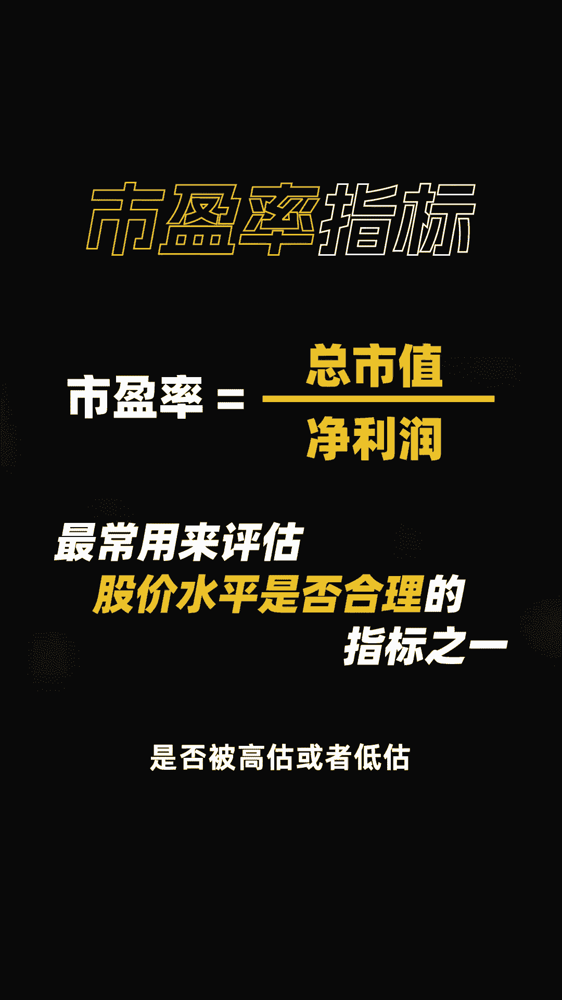

它默认显示在所有的行情软件当中，但同一个股票，在不同的行情软件上的市盈率都有略微的差别。

很多人不知道该如何去看，比如同花顺上是这样的，万德上是这样的。

雪球上它又是这样的，这些市盈率呢都对，但所代表的含义和计算方式又都各不相同。

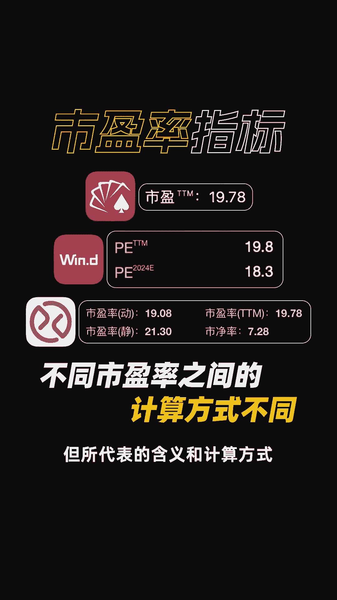

最常见的市盈率呢有四种，分别是静态市盈率，动态市盈率，滚动市盈率和预期市盈率。

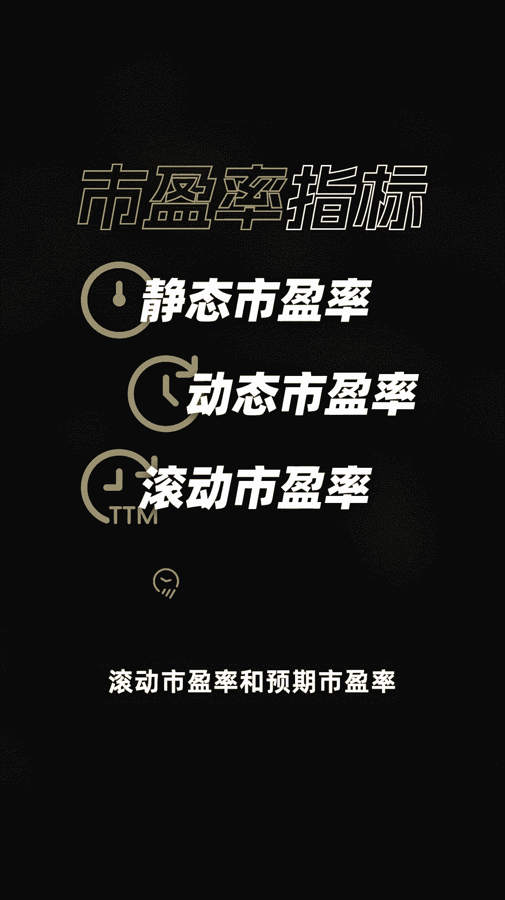

其中静态市盈率指的是用静态的净利润数据，计算得来的指标，所以它的公式是这样的。

比如在2020年8月20日这一天，茅台市值2万903亿。

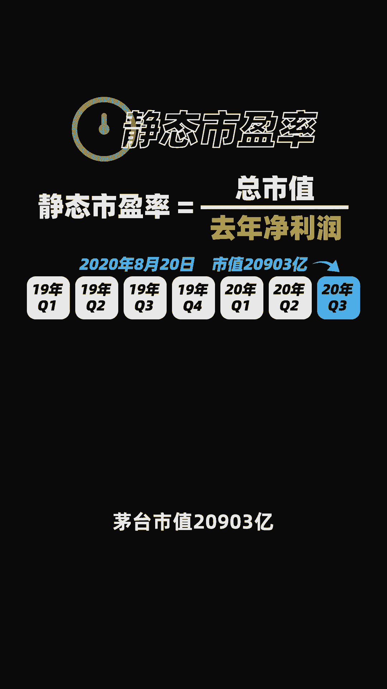

就要用到2019年全年，茅台的净利润数据来计算，当天他的静态市盈率算出来是47。5倍。

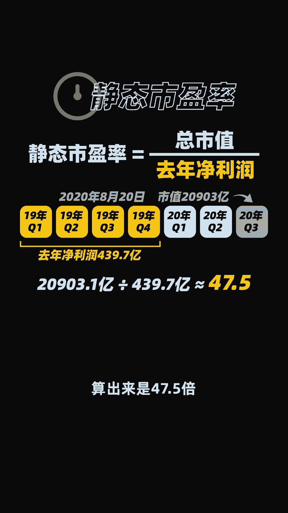

静态市盈率的计算呢比较简单，但他没有考虑增长率，所以越到年末数据的误差就越大。

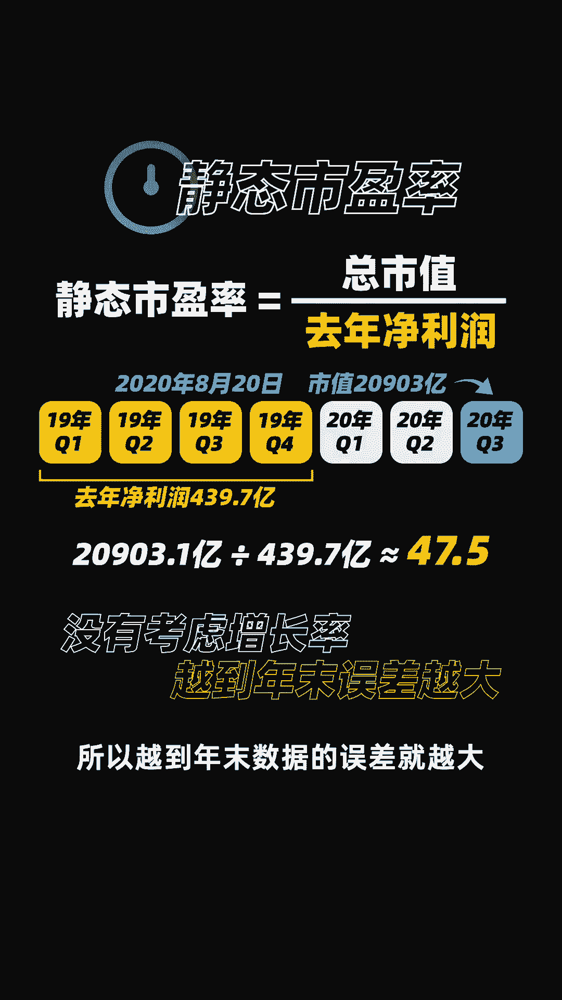

动态市盈率用到的净利润数据呢是折算净利润，一般会用当年最新几个季度的净利润。

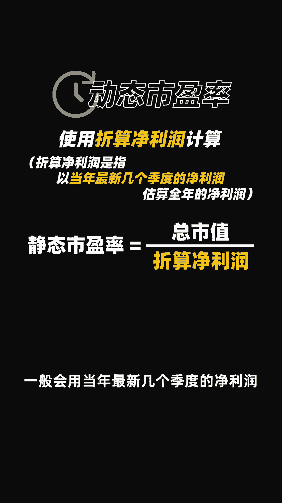

来估算全年净利润，比如同样是20年8月20日，这一天，我们取了茅台上半年的净利润乘二。

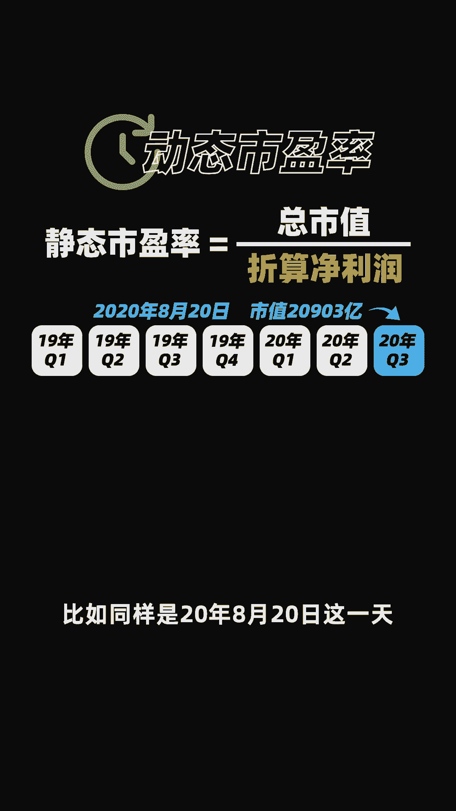

作为全年净利润，那此时计算得到的动态市盈率，就是43。7倍。

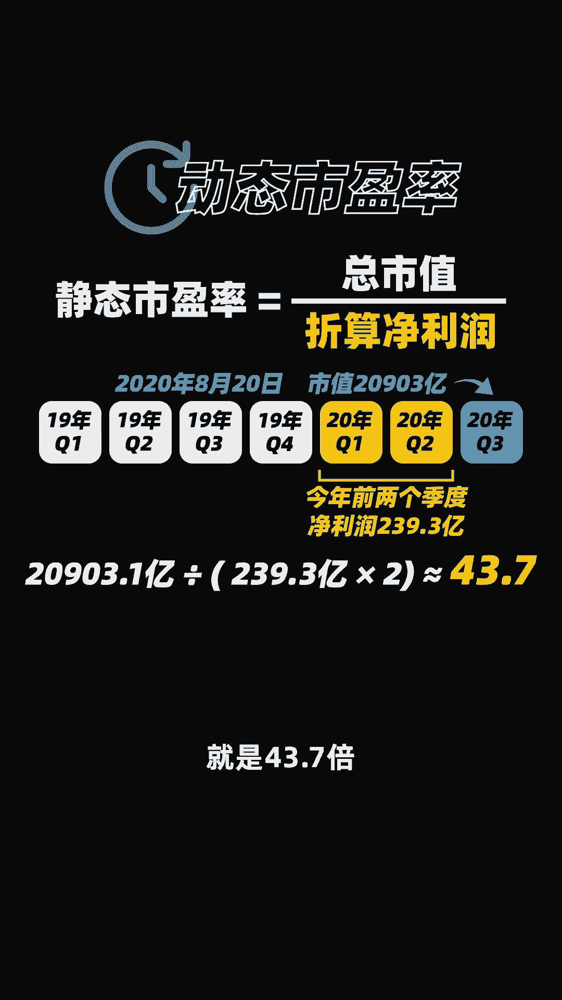

这个方法和静态市盈率的计算平呢，年初的误差更大，越往后误差反而越小。

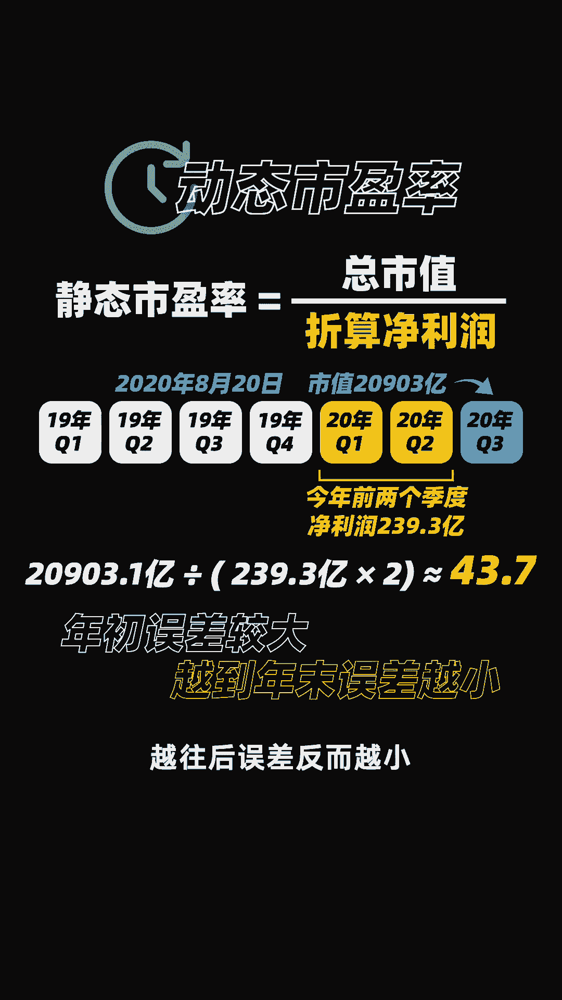

最准确，也是我们量化交易实盘中用到最多的，计算方法呢是滚动市盈率。

我们用到的是最近四个季度的净利润，来进行计算的，它能有效反映公司，过去12个月的真实盈利情况。

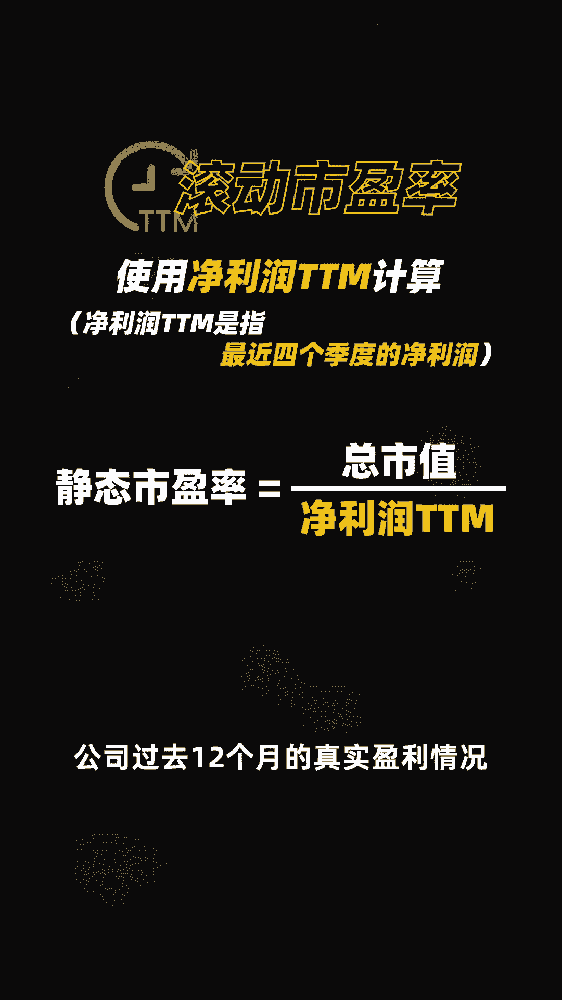

还是和之前同一天，我们取了茅台19年三季度，四季度和20年一季度二季度的净利润数据。

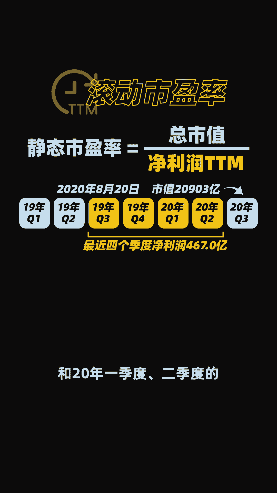

加总计算，得到了滚动市盈率是44。7倍，这个数据也是所有行情软件上都会展示的。

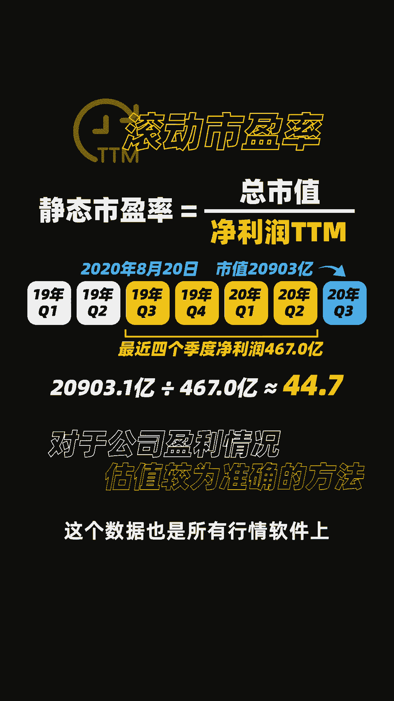

市盈率指标，还有一种市盈率的计算方法呢，基于各大券商的分析师对股票净利润的预期。

主观性较强，可以作为我们平时的参考依据，也叫预期市盈率。

它的计算公式是这样的，比如我们可以把各家券商预期的茅台，20年净利润求平均值得到一个预期的净利润。

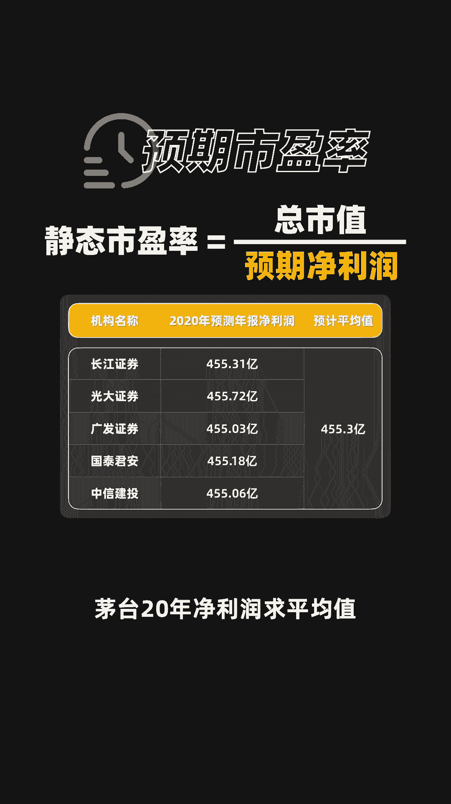

也就能计算得出，此时预期市盈率是45。9倍。

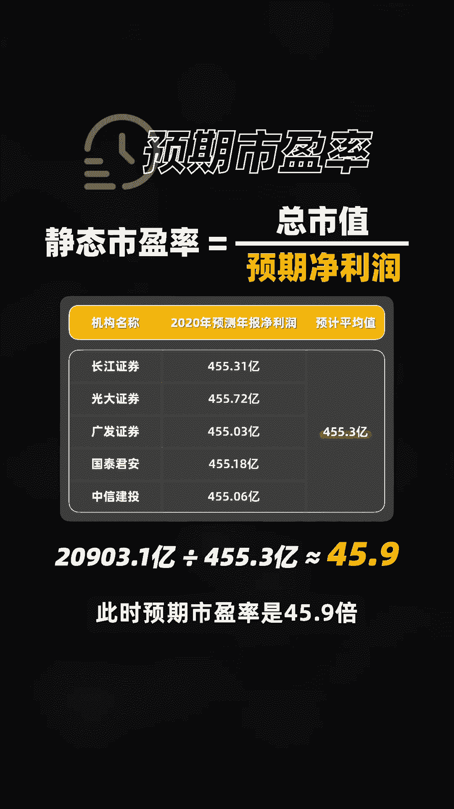

至此我们就讲清了市盈率的四种计算方法，我也把各个方法的计算公式和特点，总结成了图中的表格。

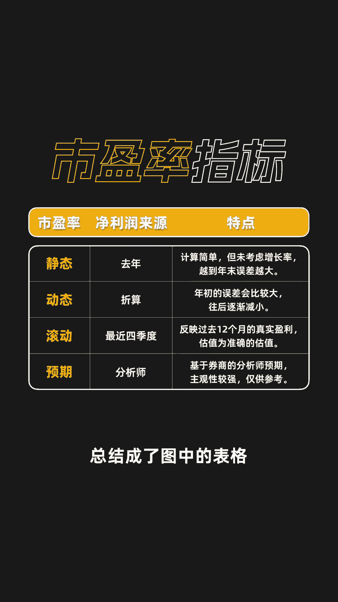

感兴趣的可以暂停截图查看我是行不行，关注我，科学投资。