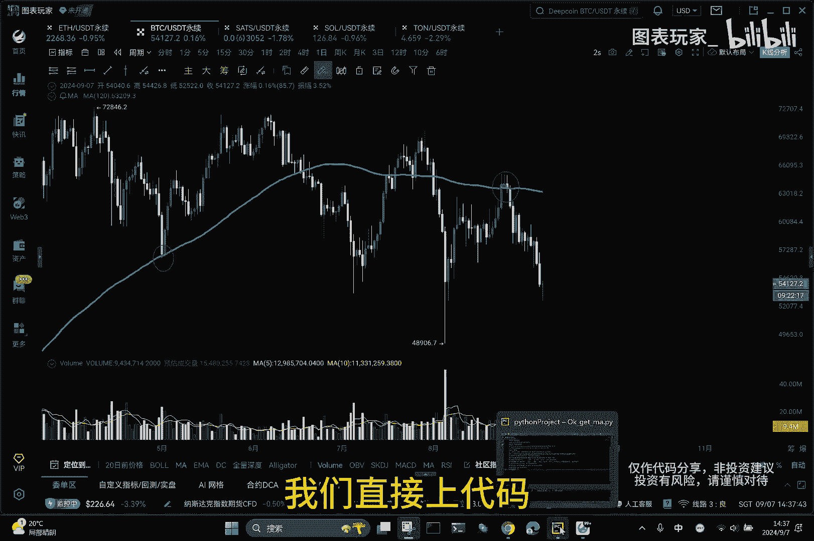
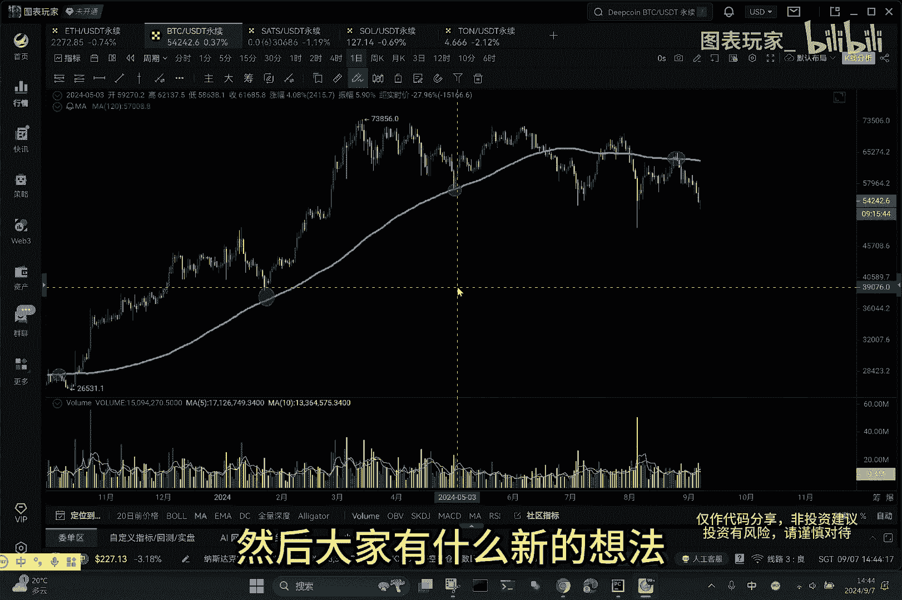

# 最短的Python代码，计算OKX的MA均线 - P1 - 区块捕手聚合群 - BV1bPpbeVEuT

哈喽大家好，这个视频给大家演示一下，如何使用8g Python代码，获取比特币的实时K线行情数据，并且计算出当前的ma值，可以看到盘面上面，我们现在时间周期是日线级别。

然后待会我们需要计算的ma是120日ma，好话不多说，我们直接上代码。

代码我是写好的，然后我们可以看到，其实这个总共用到的代码量是非常低的，除去这些注释部分，一共用到是八句代码，接下来我们逐行对代码进行讲解，首先我们需要导入三个库。

第一个request是用于发送HTTP请求的，我们需要把这个获取数据的URL，准确的发送到交易所，然后我们看到第二个库pandas库，pandas库常用于各种领域的数据分析和处理。

第三个库就是ta lib库，ta lib安装的时候稍微有点费事，但是这个库功能是非常强大的，它提供了超过200种的技术指标计算功能，就避免了我们去浪费很多时间，再去自己计算指标。

比如我们常见的MAMAACD，RSI和KDJ等，都是可以一句代码就可以计算出来的，非常的方便，接下来我们看第四句代码，第四句代码我们定义了一个URL，包含三个可变参数，一个是要获取的币种代码。

这个我们目前是比特币，这个代码是可以切换成，任意你需要的币种的代码的，只要交易所有这个币就可以，第二个是时间周期bar，我们这里填的是1D大写字母D就是一天limit，是就是需要获取的K线数量啊。

这个是只要300以内都可以，唯一的规则是不能超过300根K线，然后第五句代码，我们将这个URL然后用request点get的方式发送出去，将它返回的数据再做一个JASON的处理。

我们在这里可以将这个返回的DF文件，打印出来看看，中间把它截断一下，然后运行，运行之后可以看到，这是交易所反馈给我们的数据，我们整理好之后就是这个样子的，一共从0~299是300条数据啊。

但是它的每一列的列名是以01234，5678的数字显示出来的，这个显然不利于我们去区分和观察，我们给它重命名为开盘时间，开盘价，最高价，最低价，收盘价以及各种成交量和这根K线的状态。

我们再将它重新打印一下，同样的代码我们从这里截断看一下呃，现在这个已经重新命名之后，就比较好区分了，只有时间戳开盘价最高价，然后这个是K线状态，我们可以看到一个细节，就是最后一根K线。

因为日线级别还没走完，所以最后一根K线的状态是零，其他已经走完的K线全部都是一嗯，接下来就到了一个很重要的阶段，我们需要计算出我们要的数据ma，那这个也很简单，因为有了ta列表这个库。

你直接就一句代码添加一个ma的列，然后ta lip点ma，其中需要传入两个参数，一个就是你就是收盘价，所以传入第一个参数就是DF中括号，然后里边是close，第二个参数是多少条的均线啊。

我们计算120条的，然后接下来我们运行一下这个程序，这一共是八行代码，我们可以看到最终最后面添加了一列的数据，这个就是ma的数据嗯，我们来比较一下吧，跟行情软件比较一下，因为最后一个K线还没走完。

所以我们就以倒数第二根K线为例，这里计算出来mu20的值是63265。

我们回到盘面看一下，这是倒数第二根K线，然后我们可以看一下这个嗯，ma120就是63265，这个数据没问题啊，说明这个ta lib库计算的还是相当的准确的，然后我们再多说一句。

这个M120在长周期的一个行情当中，有着非常明显的支撑和压力作用，可以看到图中我红色标注的地方，当行情走到M120附近的时候，都会有一个很明显的反转，或者是趋势的延续，侧方面。

也印证出了MA120的适用性还是比较强的，那下一期视频呢我们可以通过Python代码，将这些临近M120的一些点去识别出来，也可以通过程序去扫描的方式去扫描，所有的盘面，贴近M120的一些币种。

然后我们可以添加一个重点的关注，嗯好今天的课程就到这里，然后大家有什么新的想法。

