# 期货截面多因子量化策略设计框架，教你设计本地化的完整量化策略流程，思维适用于各种量化策略。 - P1：studio_video_1731038381105.mp4 - QuantPlayer - BV18QDdYVEH9

喂嗯大家好，距离上一次发布视频已经过去很久了，这么长时间一直没有录制新的视频，主要还是因为选题的问题，就说啧我也不太清楚，应该分享一些关于量化的什么内容给大家，因为我发现B站特别多。

就是嗯从up主的角度的话，可能很多人都会分享一些额策略内容啊之类的，特别是现在特别多币圈之类的，分享一些什么网格啊，也有各种这种就是看起来好像很简单的策略，然后在，光看了用户的角度的话。

很多人也很确实很喜欢，这种看起来很快就能赚钱的样子的东西，但其实的话我个人不是很认可，所以后面很长一段时间，我也没怎么去录制新的视频，因为我做视频的初衷呃，也反正也只是为了分享一下，量化方面的一些东西。

并没有想说做成盈利了或者是吸粉，然后甚至拉大家开户什么的，我没有这方面的需求，那这一次重新录制视频是因为有两个契机，一个是因为嗯，我我刚好需要跟一部分人去嗯，分享一些量化相关的东西。

而选题就是期货多因子的策略，然后另外一个也是因为我朋友嗯有蛮多，要么原来是学金融的，要么原来是学it的，都对量化有兴趣，但是我发现很多人都很迷茫，不管是完全零基础的人，还就对量化是零基础的人。

还是已经有多年量化经验的人，我发现一个现象，就是说我以期货量化为例吧，就是说其实大家有一些原来主观交易出身的，那他本身自己有策略，而一些如果是计算机行业出身的，那它本身有编程的技术基础。

但是大家关于怎么把呃，编程跟交易经验，甚至如果涉及到一些模型，是需要一些数学，物理学的一些知识的东西，怎么把这些东西给它串联在一起，其实这才是量化作为复合领域，比较核心的内容要点。

但是很多人是比较迷茫的，这有很多种原因啊，一方面是呃一些三方的量化平台，比如说tb文化金字塔之类的，很多人一上手其实用的就是这些平台，那其实这些平台的话额对于时间序列的策略嗯。

比如说趋势跟踪这种的比较入门级别的策略，大分大部分还是可以的，但是也会涉及到一些细节问题，因为很多人用完之后，就算是真正用到上市判断地步的人，也有可能发现，实盘起来跟你的回撤差距还是很大。

嗯这是因为可能你用的是指数做回车，或者是足联做回车，就算你是复选过的主联，就算你是指数映射过的，结果仍然是会有一些差距的，这个我们就不展开细说了，但只有一种嗯，也也有一些大佬确实是只需要用这些三方平台。

因为他们是能承受这些误差，他们可能资金量体量是很大的，然后他们的交易频率是相对比较低的，所以他们能接受这种误差，在实盘的一个跑出来的效果，只要能占回撤的一个六七成，他们就已经很满意了。

因为对于他们资金体量来说，这点小细节问题不重要，但我相信对于大部分人来说的话，嗯这个偏差还是比较致命的，还有一个原因是这些三方平台它很嗯，比如说我们今天要讲的期货，多因子的这种策略的话。

三方平台对他的支持，我可以说是可以直接说是根本没法做，因为我们需要用的是额前面的数据来做，但我指的是，基于目前的这些上班平台的版本来说，就算你想做也是比较折腾的，很难去。

就是比较轻松的去回撤这种期货多因制的策略，那我一直推崇的是，当你掌握一定的编程基础，然后你又有交易经验，那我我建议都是自己完整的去搭一套量化的，完整流程的一套系统，你可以不同的策略类型有不同的系统。

但很多这种关于量化整个完整化流程的设计，它是通用的，在我看来就分为数据端，策略端和交易端三个方面，数据端是不同策略类型，其实大家都是可以通用的，而策略端的话，相当于就是我不再用三方平台来做一个回测。

而是搭建完全自己本地化的回撤平台，这样子的好处就是自由化程度高，而且很多东西都掌握在我们自己手上，如果你涉及到一些比较比较，不管是你自认为还是真的比较隐私的一些嗯，嗯年龄的能力较好的一些策略。

让你完全本地化的话，就可以做到安全性高，然后交易端的话，这就选择就比较多了，你可以选择比如说通过CDP的接口，或者是比如像天晴的接口嗯，反正就是说如果你按照我说的这种流程，你不管是数据端。

策略端还是交易端，你都可以有多种选择，自由化程度很高，你甚至可以做好各种备用的方案，因为如果你一直依赖三方平台的话，某个三方平台，如果假设哪天哪一块功能出问题了，或者甚至整个平台没法用了，那你就很被动。

但你如果构建一个完全本地化的平台的话，首先在你数据端的话，你自己可以做多路数据源的一个备份，然后策略端的话因为是完全离线的一个处理，所以不不涉及到网络的问题，所以这个正常是不会出问题的。

有出问题的是你自己代码的一个bug，那最后是策略端啊，不这最后交易端的话，那其实也是可以做多种方式的，你可以做接口类型的，也甚至可以做，比如说案件经理模式的这种模拟下单，这些都可以自由去发挥。

所以说我建议是搭建这么一套完整的流程，那对于不同的策略，其实整体的思路是一样的，比如说你期货多音者的策略类型，今天我讲的内容你能好好的去给它停下来，消化下来，我今天主要讲的是一个思维。

思维方面的一个问题啊，因为其实市面上关于这种中低频的策略，包括多因子策略，包括趋势跟踪的策略，都有很多的研报或者论文，这一块的资料还是比较容易获取的，只要你有一定的搜索能力跟学习能力。

你了解这种策略它到底是什么样的一个原理，这个我觉得难度不大，但是你想要在市面上直接得到，就是关于怎么针对某种策略直接搭建一个框架，然后有这么好用的一个工具来进行，关于他的一个回测。

这种东西我觉得是很难得到的，至少在目前到目前为止，我觉得嗯，你很难找到一个完完整的资料去介绍这一块，因为这是比较复合的一块东西，而且可以说也是比较核心的一块东西，当然大部分的量化私募公司。

只要不是太小型或者没有技术能力的公司，他们基本都有自己的完整的交易系统，也就是我说的完整的一整套流程的东西，然后我指的市面上没有指的，是因为这一块的话，对于这些公司来说也是比较精密的东西。

而对于个人来说的话，很少有个人会去就是去搭建，那那是可以的，但很少会有个人就是搭建了，然后并且使用起来，并且还愿意分享出来，所以我希望嗯大家有兴趣了解这一块的话，可以好好把这一节的内容去理解消化一下。

而我今天主要讲的还是侧重于整套流程的设计，嗯我们只是选题时选了多因子策略，今天不会讲太多关于策略方面的内容，这个策略的话我会简单带过它的一个基础原理，而我们今天更重要的核心还是在思维方面。

就像我前面说的，思维才是你很难去通过资料，直接通过自己学习来获得的，当然关于多音的策略，这个他是什么样的原理，你你如果听了我今天的介绍还不太清楚的话，你完全可以自己去找资料去了解。

但是你如果完整的把今天的内容消化下来的话，你手头就有一份可以用来评测这种策略类型的，一整套框架，那后面你看到新的东西，新的策略类型或者新的因子，你都可以直接套上去去评测它的结果。

甚至到怎么把它做成实盘的一个地步，同样的，如果之后你想做趋势跟踪策略，或者做套利的策略，你模仿这一整套流程，自己设计一套自己完全本地化的东西，之后的话，你就不再依赖于任何的单独的一个双方平台了。

好那我们呃我我刚才讲的意思是，我今天侧重点是在于思路的一个构建，不在而不在于啊多印制策略怎么赚钱，也不在于说把代码嗯讲的多详细咳，今天相关的代码的话，数据端的代码是我临时写的，为了这一次的一个分享嗯。

也就是说不是我自用的一个数据框架，那策略端的话是我早期用的，关于期货多因制这种策略回测的一个框架，只做了一个稍微的一个调整，所以说策略那一块的话，可能代码会相对比较详细，功能会稍微完善一些。

但不管怎么样，我觉得就是今天提供给你们代码都是属于能用，但是的话呃你们还是有很多自己的拓展空间的，你们在听完整个思路流程之后，自己可以去想办法去拓展这些工具，它的一个功能做到更适合你们去使用吧。

嗯需要源码的可以直接后台私信我，把你们邮箱留下来，你们嗯其实我之前分享的，有很多人会后台私信我给我发邮箱，当然你们记得你们在发邮箱的同时，也说一下是哪一期的视频啊。

不然经常出现一种情况是你们要么直接问我，能不能给你们源码，但是你们连邮箱都没留，要么就留了个邮箱，但没有说是哪一期，等我追问你要的是哪一期的时候，后面可能很多人又有很少看私信的一个习惯。

可能隔了很久都忘记回复我，所以说你们需要这一期的源码的话，你们就标注清楚是这一期标题的视视频标题，然后留下你们的邮箱，我有看到都会发给你们的，今天讲的代码内容的话，我可以直接发送给你们好。

那我们就前面铺垫了这么久，我们今天就开始正式的话题，期货多因子策略设计框架呃，这是今天的目录啊，策略原理我会简单带过，然后数据端和策略端我会主动去介绍一下，交易端的话，这个，关于这个多因子策略。

它的一个交易端相对来说是比较简单的，所以我等下也是简单带会好，那我们先讲一下多因子策略，它的一个策略原理啊，其实期货的多因子这种，跟股票的多因的这种是类似的，只是说股票那边的话。

股票那边它其实是因为多因子，它是要做多一部分做空一部分来做对冲的，股票那边他的做空是相对比较没，反正就没那么方便，你要么融券，要么你其实是要去胡子那边去做空，但是对于我们期货来说的话。

他是一个特别方便的，因为它自带多功，我们本身既可以做多，也可以做空，但是期货这边适用的一个因子类型，相对股票那种数据来说，可以拓展的空间可能会少一些好，那我们以动量因子。

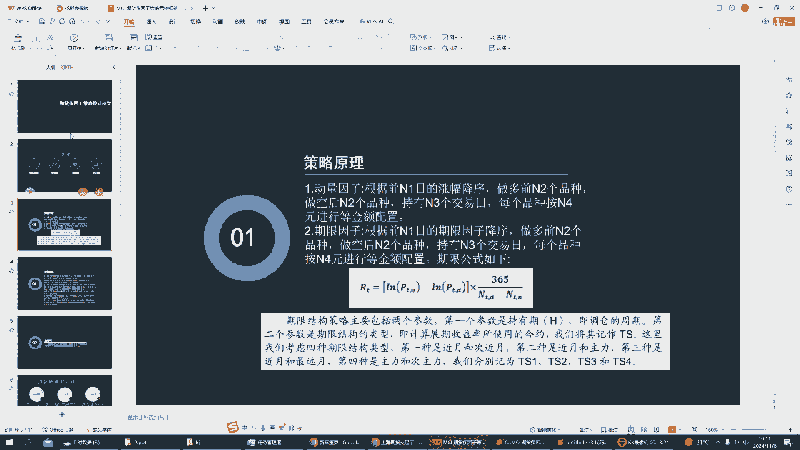

今天以动量因子和期限因子为例，为什么是这两个因子，是，因为呃，我们参考的资料是2017年海通那篇研报，这篇这个整个文件我到时候会压缩，你们有需要的话，我会发给你们，所以基于这一个这一份研报里面。

介绍的重量跟期限因子，我们来分享今天的内容。

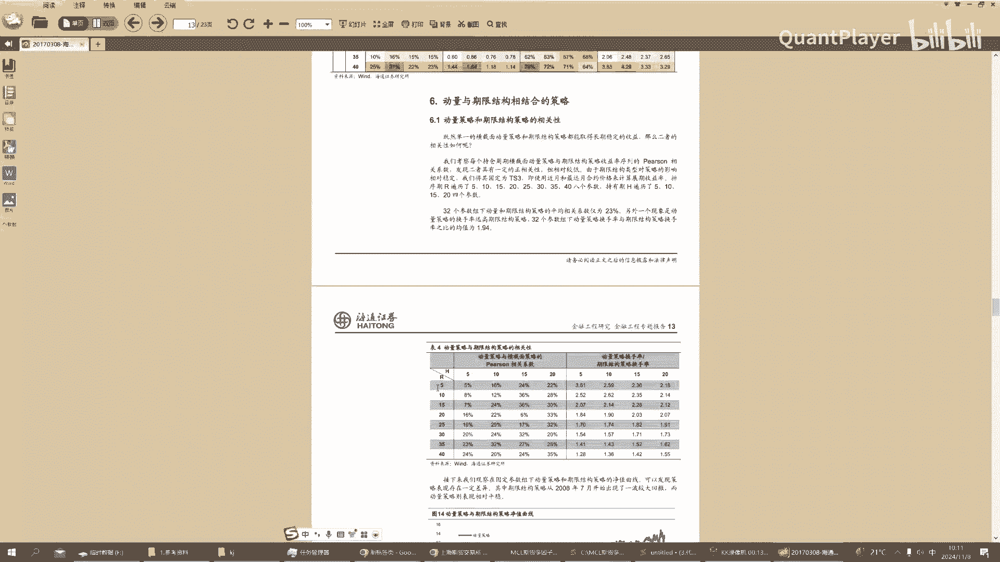

那我说了策略内容的话，我会简单带过，那我们就来看一下动量因子的话，它其实就是根据前N1日的一个涨幅降序，然后做多钱N2个品种，做封后NN2个品种，然后持有N3个交易日，每个品种按N4人进行。

等额等额资金的一个配置，这是我简单概括的一个，这什么意思呢，额其实简单来说，就是大家根据最近的涨跌幅进行一个排序，重量的意思其实就是做觉得说最近涨的多的，接下来会继续涨，然后跌的多的接下来会继续跌。

还有一种反转的，在经济学领域中，还有一种反转的一种现象，那今天我们讲的动量反转就跟他相反，就觉得涨的多了会跌，然后跌的多了会涨，那也是一个因子，但今天我们讲的是动量的嗯，这个刚才说了。

其实就是假设我们N1是取20天嘛，那我根据前20天我所有的品种，这个所有品种指的是，我们在做这种策略类型的时候，我们可以先有一个前置的标记值，也就是说现在期货品种有几十个。

但我们可能一般做这种这种多因子策略的话，我自己的习惯，首先会提出金融期货就是ICIFHIM，包括还有国债期货这些我不做，然后像原油可能比较相对比较大的品种，可能也不做。

然后剩下的这些品种组成一个前置的标的词，当然也会剔除一些交易非常不活跃的标的，然后假设说我们留下来44个品种，期货品种嗯，也就是相对比较活跃，然后又不是那么特殊的品种，然后我们进对这些品种进行一个。

过去20天涨跌幅的一个排序，过去20天的一个涨跌幅，这个嗯具体怎么说呢，其实就是你可以每一天用收盘价，减去上一日的收盘价，这就是当天的一个涨跌幅度对吧，那你可以把过去的时间累积起来，你可以算他们平均值。

也可以算他们的整体的值，整体的值其实指的就是我今天跟前20天比，我涨了多少，跌了多少，那如果平均值的话，相当于就但其实对于这个策略来说，您取平均值跟取整体的值啊，效果是一样的，嗯这个能理解吗。

因为你到时候是横截面的一个排序，就是说你就算是除以前20，那其实对大家来说，大家都是同时除以了20，所以说我们在做完这个啊，所以你要不要除以29都可以，我们在做完这个排序之后，就是去挑选前N2个品种。

这个N2的话，其实指的就是你要做多多少个品种，做空多少个品种，这个由你自己定，你既可以做，现在股票他们一般会喜欢去做多，比如前10%，20%这种按百分比来的，因为股票数量较多，而期货这边的话呃。

你既可以是固定的一个个数，也可以是百分比，但我个人建议是用克数，假设就是做多前五个品种，然后做空后五个品种，然后持有二三个交易日，指的就是在整个嗯到了排序日的这一天，我买入之后做多了。

这比如说前五个运动做空了后五个运动，接下来的23个交易日，我是不会再进行调整仓位的操作，我一直会迟到，下一个就是N13个交易日，我这里不是以N3个交易日为间隔吗，比如说这个N3指的是十个交易日。

那我今天今天排完序，买完品种之后，我会等十天再进行下一轮的交易，然后每个品种还有N次元，这个应该好理解，相当于就在家等资金，大家本金是一样的，除以他们每一个品种，他的一个理论保证金。

然后你取证得出来每个评论要下多少首嗯，7000英尺相对于动量因子来说，可能稍微复杂一点点啊，因为动量应该好理解，其实就是涨跌幅的一个排序，而期限的话，它本身是一个嗯一个概念是指呃。

原始的概念是指期货跟现货的一个东西，相当于也就是说额看这里的介绍吧，看看一下这个公式吧，他就是根据额近远期的一个收益率差值，然后乘上后面，这个是相当于他们到期日之间的一个，这个这个分母指的是他们到期期。

到期日一个差值，365天除下来就换算成年化收益率，也就是说他根据这个收益率来进行一个排序，排序出来的话，后面的操作跟动量因子是一样的，就是做做前N个，做空后N个，然后持有多少个交易日。

这这些后面的处理大家是一样的，但是前面关于这个算法它是不同的，它是一个有四种模式的一个算法。

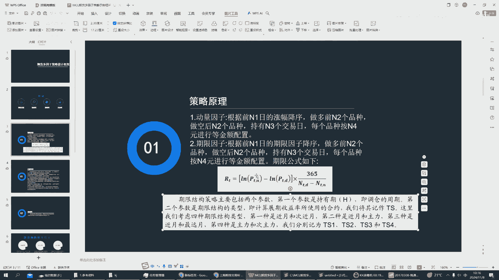

我们可以看这里，我这PPT是临时做的，所以可能比较粗糙，就是根据这段话，我是截取他这里的长期收益率嗯，我们看一下他这里的PTN跟p dd指的是什么，PTN指的是近月的一个价格。

p dd指的是远月的一个价格，相当于也就是说他用近月的一个收额，就算出来一个所谓的攒机收益率，他其实用的其实就是呃，你要不要落影的话都可以吧，就根据当时的一个价格，你每天可以去计算它的音质值，价格计算。

然后你要换算一下，换算成年化收益率，但其实后面这一部分关系没那么大，当然我做的时候也有也有做这一块，只是说关键还是在前面的部分，相当于就是用近月减去远月的，得出来的一个价格，至于他为什么会嗯。

为什么这种因子是有效的，这个我们之后如果有机会的话，我们再展开去讲因子策略的一个解析，以及他的一个怎么去改造升级，让它做成收益能力更强的这种策略，到时候我们再展开，今天的话重点不在这。

反正你只要先能理解他就是用近越简远乐，然后他有一共有四种算法，就是说这个跟我们刚才前面动量类似啊，我就不展开，然后但他这里有个特殊的类型，就是因为它涉及到两个合约的一个差值相减，那我们就可以有多种组合。

这里一共是有四种，第一种是近月减次近月，然后第二种是近月跟主力，第三种是近月跟最美员，第四种是主力跟次主力会有四种的模式，我今天给你们的代码，也会把这四种都已经算清楚了哦。

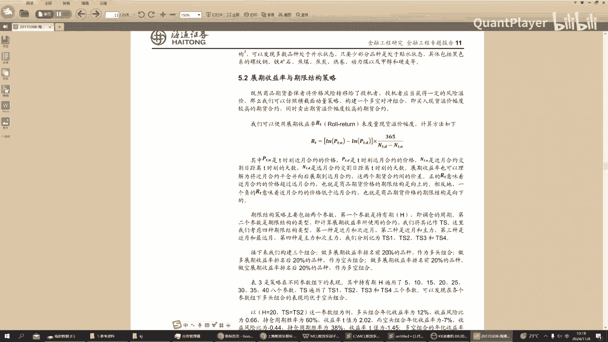

然后整个策略的话，其实你只要理解，就是它都是根据我们呃，前多少天的这么一个某个音准值，来进行一个排序，当然你有些因子它甚至可以用当天的值，你就根本不需要去做嗯，比如说期限。

这个如果你一直都只用单天的做一个比较的话，你就不再需要对它进行一个平滑，或者加和之类的一些处理，也就是说什么你每次到交易日，你都是以当天的作为一个排序，那可以，当然你也可以有带这个参数。

就是你可以根据过去20天，假设是参数是20，那你可以根据过去20天它的一个平均值，期间因子的期限，这个数值的一个平均值来进行排序，然后后面的操作大家都是类似的，你做多多少个，做空多少个。

然后再持有一定的交易日，所以整个策略的模式也就这样，他跟我们传传统的就是呃入门，比较入门级别的趋势跟踪策略类型的话，他这一个交易方式不太一样啊，因趋势跟踪相当于它是一个时间序列模式的。

它是一直跟跟踪某一个单独的合约，某一个单独的标的，而不会进行一个截面的比较，今天这策略之所以叫截面这啊，这他他也叫截面多因子额，他之所以在前面，其实意思就是因为他到了这个恩山，到了这个指定的交易热搜。

大家是几十个品种，大家同一时间节点上，当时的这个音质值来进行比较的，而不是跟踪每个策略，它啊每个品种它自己自己本身的这个音质值，当然你也可以把这种因子策略做成时序类型的。

那我们以后有机会再开一个项目再讲好，那这里有一些注意事项，注意事项的话呃，我们简单过一下，第一个就N个交易日进行调仓，这间隔多久是取决于自己的想法，当然也有可能是根据因子的属性。

因为有些音质值它是经常就隔一两天，可能变化幅度是比较大的，那你可能更适合这个调整周期可能稍微短一些，但是有一些因子它可能时间是比较久的，比如说一些库存仓单的这种东西，它本身的统计是可能按周之类的。

所以你就算是很经常去调仓意义也不大，第二点，这个做空和做多数量一般是相等的，但不一定是固定个数，在前面讲过，你既可以按固定个数，也可以按百分比来，然后第三点是这个等金额的一个问题。

嗯就是其实我们设计等金额的话，那我们到时候比如说我们确定了，我们的比例是前五个，后五个，那我们一共十个品种，然后如果等金额，假设我们是5万，那我们就是50万的保证金，就是我们占用的保证金全部都是50万。

然后我我自己个人喜欢，正常是如果再用50万的话，那我乘以二相当于100万，是我的整个交易组合，这个交易账户的本金，那我会用100万去做这50万的这个策略组合，当然的话这个是我们已经定好。

我们的金额跟我们的数量，但其实我们的真正金额应该怎么定，这个其实是取决于我们嗯前置词面最贵的标点，因为我们要至少他要能做一首对吧，就比如说黄金他一手多少钱，那我们这种比较大的品种的话，它需要多少钱的话。

我们要作为一个相对的一个参考，也就是说你整个前置的标的池里面，最贵的那个，决定了你差不多每个品种应该是下多少的金额，那如果想设计小资金的话，组合你就需要把这些大品种剃掉，比如说你想只想做1万以内本金的。

那这样子的话，你到时候起步的资金就可以比较少对吧，比如说你只想做以1万为初资金，那你就要把超过1万保证金的，至少当前为止，因为这个保证金在历史上是会变的，所以本身这个也不是那么精确，只能说你要么当前。

要么历史，这个我我觉得没必要做的那么细致，你只能说留个大概，然后自己本金方面对于相对于你自己的保证金，你就要乘以二或者乘以更大的一个数额，来心里有个数，因为这个嗯价格每个品种的价格。

它在历史上是一直在波动的，所以它的保证金，包括甚至很多时候交易所会去调整保证金比例，所以这个没办法做到精确，但是你可以做一个大致的一个换算，那比如说我剔除掉大品种，我标的前置标的尺内最贵的品种。

假设是1万左右，那可能我比如说我留下了30个品种，那我做做前五个做空后五个，那我一共只需要10万的保证金，10万的保证金的话，那我只需要20万的本金，就可以去开启一个单印制的一个策略好，那第四点的话。

持仓过程中，我们刚才说了二三个交易日，我们是不做其他嗯，其他做其他行为的，但是有可能如果中途遇到幻月，我们肯定还要吃进行经济合约的切换，这一点在我给你们的交流框架里面，也会去考虑这些细节啊。

第五点是第五点，其实就涉及到交易方面的内容，其实我们就是在到了挑战之日，我们计算完因子值，然后会进行判定，如果以此为选，就是本身已经在上一次的持仓里，但是没有选入的话，那说明这一次他没被选中。

我们就踢出去而已，选位置指的就是这一次我们选出来，但是持仓里面没有，那我们就把它引入进来就可以了，第六点，就是因此我们今天讲的其实都是就算是期限，期限它本身嗯不太算量价，就他的基础逻辑不太像量价。

但是它使用的数据还是价格的，也并非所有因子都降序，因为今天讲的是降序，但有些时候，有些因子我们可能反而是升序来进行一个处理，H是on，这个等你们掌握基础之后，后面再说吧，数据端，数据端，刚才那策略原理。

我觉得你们只要有一个概念，就是有一个大致的概念，先因为关于这个整个策略内容的话，不是说我今天给你们稍微讲一下，你们就能消化吸收了，你们对这一块真有兴趣的话，自己可以先比如说这一篇先好好的看一下。

然后自己还可以去找一些关于多因子策略，相关的研报或者论文，自己先去消化一下，如果之后还有机会的话，我会去展开分享策略方面的内容，好今天时间不多，我们先继续数据，数据是基础啊，不管我们做什么策略类型的话。

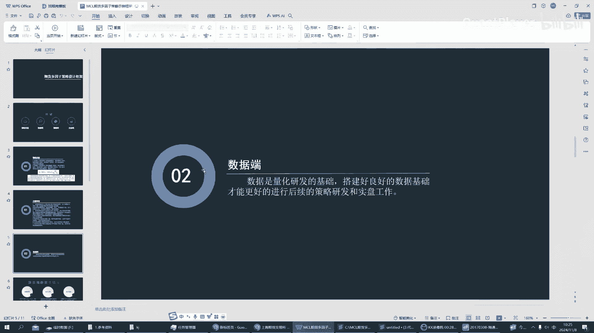

首先都是要把数据端先搭建好，一个陌生期货庄数据处理流程，这个的话我这边讲到了数据获取，主力计算和因子数据这三方面的内容，额数据获取的话有几种方式啊，一种是接口，像天启啊，AK掘金万德。

然后就同花顺的一个接口，GDP等，但GDP只有随时没有历史啊，其他接口一般是历史跟随时都有，然后量化软件的话，金字塔TP通信重大线大致会等，这是他们不同软件，他们的获取方式不太一样啊，这可以。

如果你只需要历史的话，你可以通过这些平台获取哦，另外数据结合这块并不是都免费的，而且相对来说你需要嗯有的是免费，但是质量又不一定，所以说嗯正常我前面说了数据端的话，你是可以有多个数据源来备份的。

所以至于要弄几个，你可以根据自己的需要，然后第三个是交易网，交易所官网如果只需要日线级别，因为我们今天讲的内容额，是基于日线级别的这么一个策略，所以我们今天会从交易所官网获取。

然后主力计算量化软件的这个就是我说的，其实三方平台的话，他们一般喜欢用指数或者主联来进行一个，长周长时间段的一个评测，但其实这都不是最优，和最近日期实盘的一个方式。

就建议就是你们自己要算好主力换月的数据，每个阶段只交易主力合约，这不管是隔夜策略还是日内策略，其实都一样，隔夜策略的话你肯定要涉及到一个换月的处理，而日内策略的话。

你要知道你当天是要交易哪一个主力合约的，就算你是做一些交易非主力合约的，那你也需要区分清楚谁是主力合约，谁是非主力合约，那主力判断的原理很多，成交量最大，持仓量最大。

成交持仓同时最大或者连续N日持仓最大，或者还有一些其他的什么，连续多少个交易日算平均值，然后股这里股指是比较特殊的，股指是每个月第三周周五切换嘛，所以说呃对胡子的画面其实是要单独去处理的。

而我们这个项目我给的demo里面，没有没有对胡子这一块进行特殊处理，因为我们用不到胡子了，然后第四点注意的是，他有可能回切，这个也是需要处理的一个问题啊，额就是回切什么意思啊。

比如说你从零幺的回约切到零五，然后根据你的判断规则，他可能等下又切回到零幺，我是要避免这种问题的，然后因子数据像动量因子，哦因子数据的话是这样，就比如说我们刚才提到重量跟期限嗯，动量因子因为它很简单。

它其实就是根据克洛斯的一个相减来算出来的，所以你既可以在策略端去计算，也可以一开始就把这个算好，我给你们的demo是提前算好的，因为我要统一一下所有的因子都用提前算好。

这样我们策策略端只要读取就可以直接使用，然后期限因子的话它相对比较复杂，所以肯定因为它涉及到，比如说刚前面说的有四种类型嘛，所以说这种的话一般习惯是先算好这一段，只需要去调取其他因子的话，就看具体情况。

但我建议你们还是，每每种因子都是提前算好的好，那我们现在来看一下数据端的一个具体的，一个完整的一个操作流程，我是以交易所官网的数据为例，交易所官网是提供了日线级别的一个历史数据，这是上期所。

上期所在这里点数据，然后再点数据下载，我这边下的是2022年的为例啊，嗯历史年度的话，你可以按年份直接去点下载。

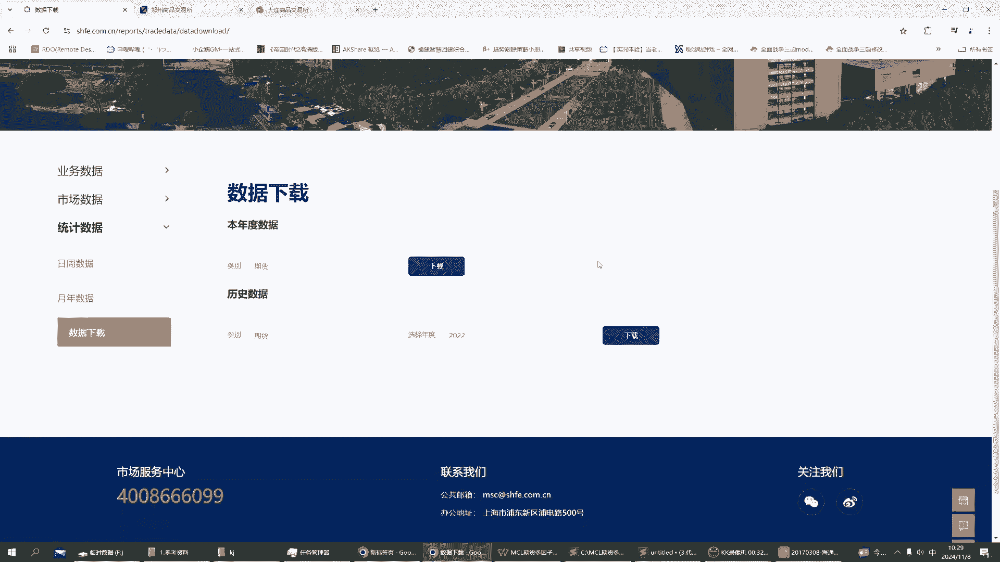

然后郑商所的话也一样的，这里应该有个交易数据，然后历史行情下载，这里的话也是分年度啊，我也下载了2022年的作为一个样本，然后这里的话，这大三所大三所的数据是比较特殊的，我看一下日韩情。

最后的用痛苦喊当困难，又如今将眼见，我也是这边历史数据他比较特殊是什么，你看23年他可以点全部屏幕下载，但是历史年度嗯需要一个一个品种就下载啊，我是下载好，2022年除了期权以外的这些品种到本地来。

所以这个你们可以自己去下载，如果需要其他年份的话，你自己去点，再自己去重新下载，我给到的是这样，我是下载到了本地这个三个交易所我分开来的，然后上期所的话它的格式是这样，它分成每个月份是一个文件。

然后打开里面的话，长的是这种模式的，所以不算太规范的，我先都打开吧，给你们先看一下，然后等下再看一下我们是怎么处理的，大三所的话，因为他是每个品种独立的嘛，就是长这个样子。

然后每个品种里面是相对比较规范的，是这样子，将火焰的星华统烧花可摧残，只共你觉得苦也不，然后是正三所，正三所是所有人都汇总到一个TNT，他是最不规范的，他的这些列名啊，就呃列名这些后面都有很多空格啊。

然后他就以数来隔开的，还有最麻烦的一点是，它的品种是三位数的，它是大部分就上期所跟大连的，大家都是四位数，就是这后面的数字年份，这个是完整的，比如说201，他其实是2201，所以正三角这个要自己补齐。

而我是偷懒的，我直接因为我知道我下的是22年的数据，所以我直接统一大家前面加个二，这一点的话，你如果确定是20年之后的数据没问题啊，但20年之前的话会有的问题，比如说你如果是18年的数据。

那你待到时候可能代表了意义是不一样的，他到时候可能写的801，你不能给他写成2801，所以说嗯最合理的是，要自己根据当时数据所在的日期，来进行一个判定，它到底是属于哪一个年份的合约。

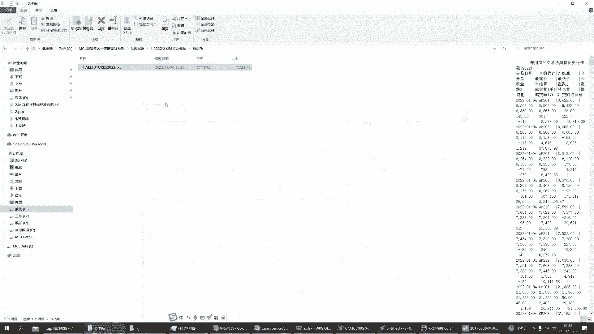

好，那我们看一下，我们在代码里面怎么来处理这一块，我这里的话一共是会有数据端。

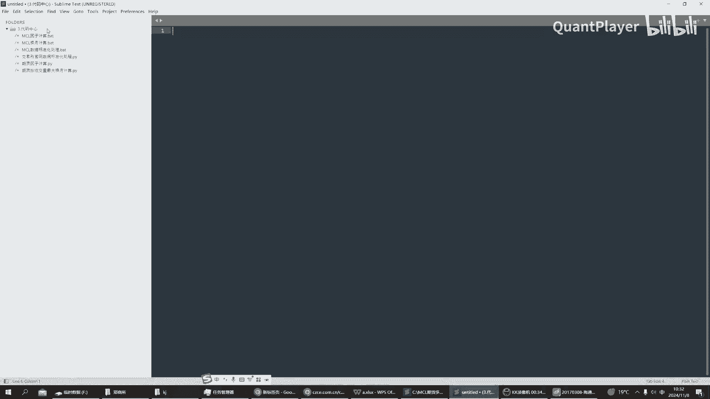

代码里面有三个啊，上面的bt beta这些这些是用来启动它的，这个你们可以自己参考，因为我是方便使用，我今天不会再去运行这些，我直接给你们讲一下代码的一个，简单的一个设计啊，因为我本地已经运行过一遍了。

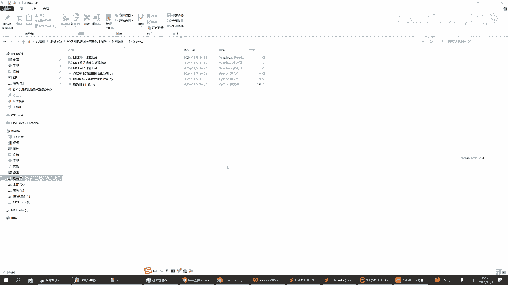

我们节省时间啊，啊我们先看交易所官网标准化处理这一块，就是刚才那位是从官网下载下来的基础数据，我们怎么给它进行一个标准化处理。

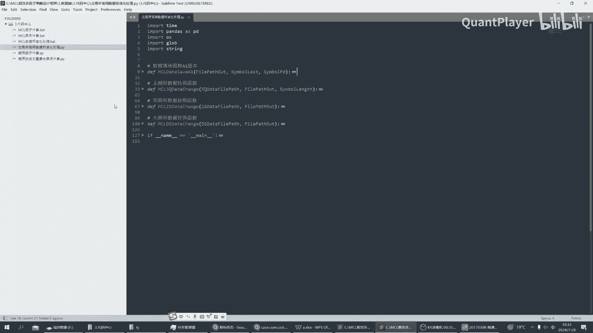

因为我们最后的数据格式肯定是要统一的，我自己统一成的格式是这样，这是已经标准化之后的，我是用data time日期时间，然后这两列是int类型的，这些的话啊，这两类data跟time。

然后成交量跟后面的持仓量都是int类型，中间四个应该是float类型，然后这代表的意义应该就不用我多说了吧，日期时间开高低收成交量，后面这两个我提一下，就是额根据天晴的它的字段来去配的。

我现在习惯性的把其他地方也这么去用OpenAI，这后面两个o I/O i oi，是代表的是一个持仓量的意思，open代表的是这一根开始的一个持仓量，然后close代表结束的词向量。

所以正常你数据完整的话，它的对角线是相等的，斜对角线是相等的，所以一般用的是这个格罗索啊，就这一根K线，它收盘为止，它的一个持仓量好，那我们来看一下，怎么从刚才的这种数据转换到后面的一个。

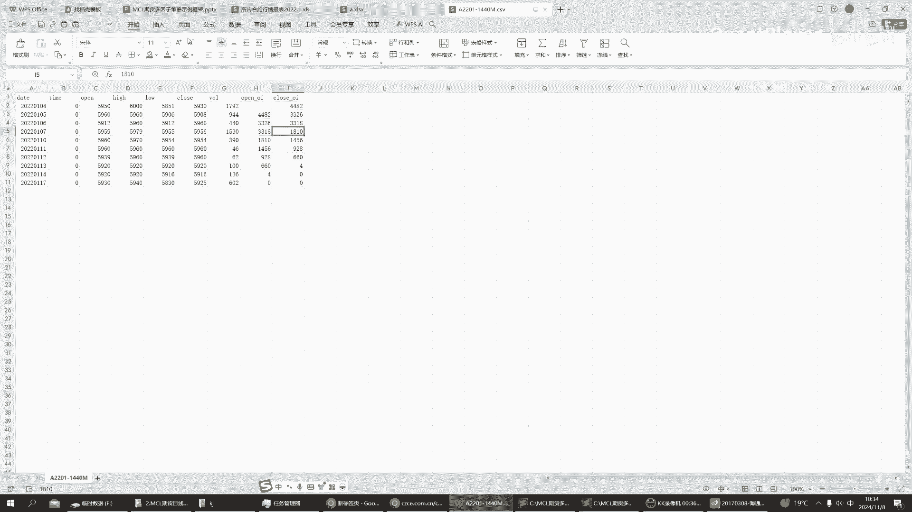

标准化的一个结果，就我们简单带过吧，因为前的时间确实不多，上期所上期所因为他是嗯数据格式咋的呀，就是每一个品种，然后有一共有十十二个月份，所以你需要去循环这12个文件，然后它是有规律的。

你要知道它规律怎么去读取，后面读取进来之后的话呃，三七锁这个写法我是用的是循环的，所以他处理起来相对比较慢啊，相当于就是简单讲逻辑，就是它一行一行去循环下来，如果切换品种了，它会把旧的这个品种先落地。

落地前我会先去读取一下，就是落地前我会先判断一下本地是否已经存在，这个文件存在的话，先读旧的数据，然后再更新的一起拼接起来，那有了这份源码之后，你就下2021年啊，2022年，2023年。

房下不同的年份呢，基本上就简单再运行一下，就能把新老数据拼接在一起。

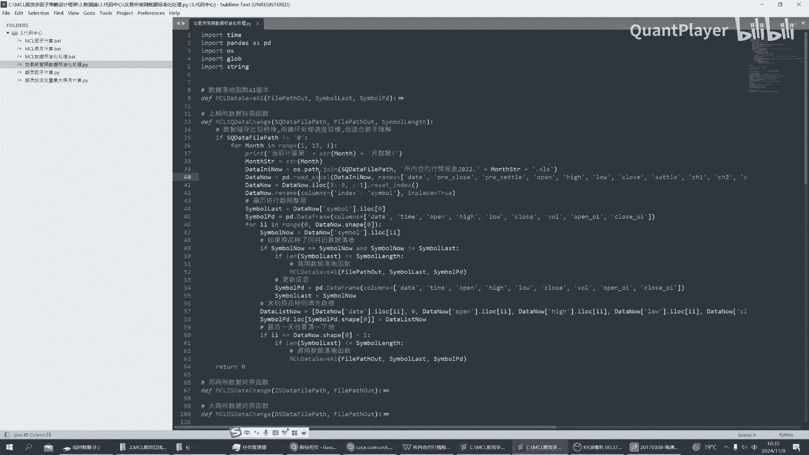

但是有一点要提一下，就是交易所它嗯有点比较麻烦的。

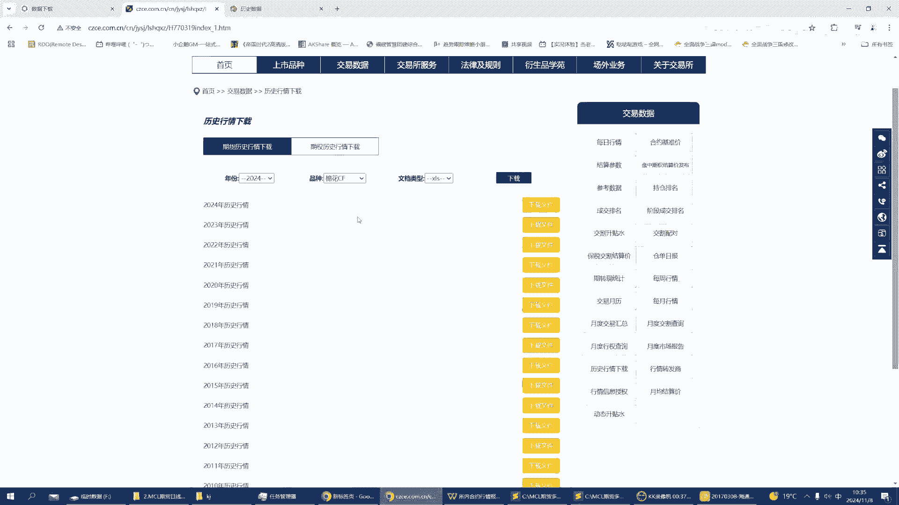

就是它不一定每年的数据格式都是一样的。

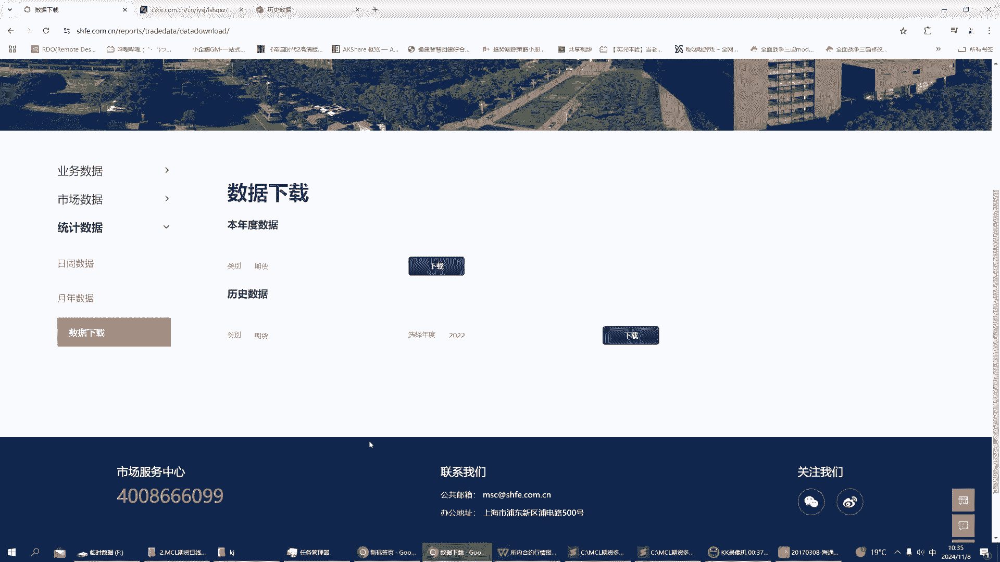

比如说比如说刚才你们看到的这个数据，上期说的他是这样的，但他可能有些年份它是不是一，他可能是010203这种，或者甚至这这这这道小问题，你到时候代码简单改一下就可以，当最担心的是它是否内部结构发生变化。

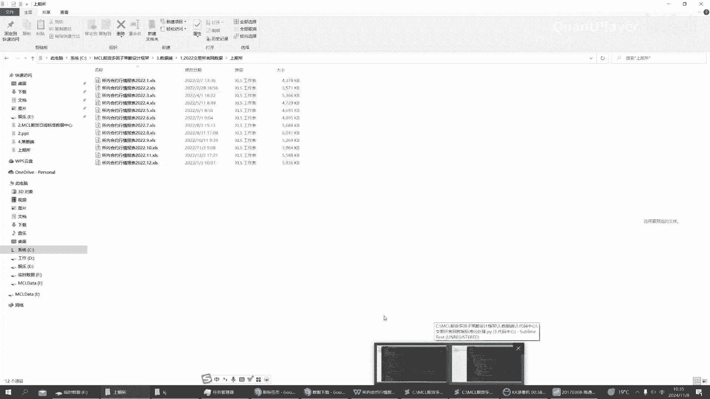

如果内部结构发生变化，你们需要调整的代码量就比较多，好那上级锁是呃循环下来的模式去计算，然后再循环12个文件，正三锁正三所，从此感其实他主进来，你主要是要去处理一下它不规范的一些因素。

比如说你要把它多余的空格先去掉，然后再做后面的一个处理，嗯后面的处理的话也不算太复杂，但最后就是一个分组，就是我们根据合约代码来分组，分完组之后再进行一个数据的一个落地，这个跟大三所是类似的。

增删所为嗯，刚才我前面说了，要提前加个二，就在这里，因为要补齐，那大三所的话也是类似的，跟正三所类似，但是因为他数据比较规范，你只只需要去读取。

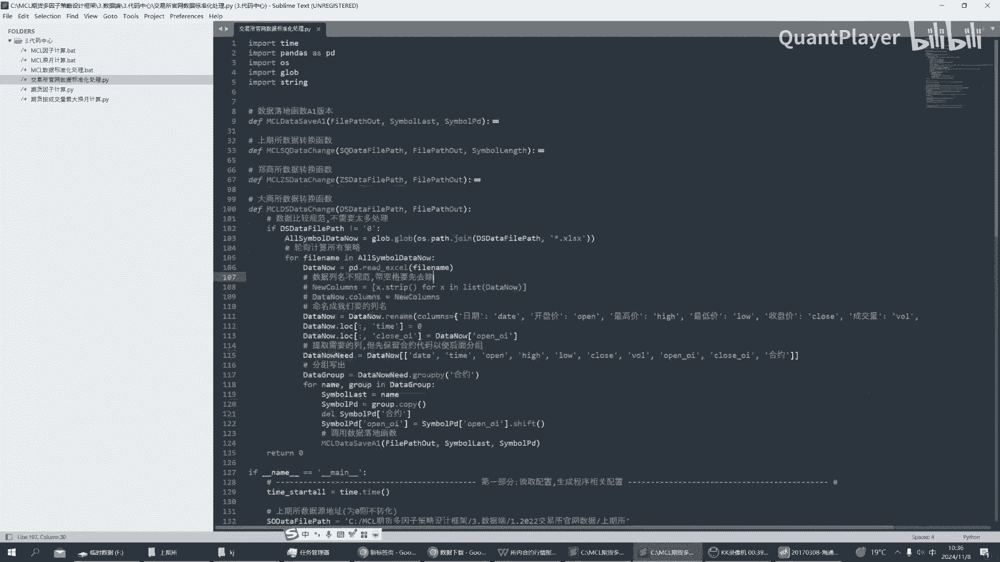

你文件夹底下有多少个你的excel文件。

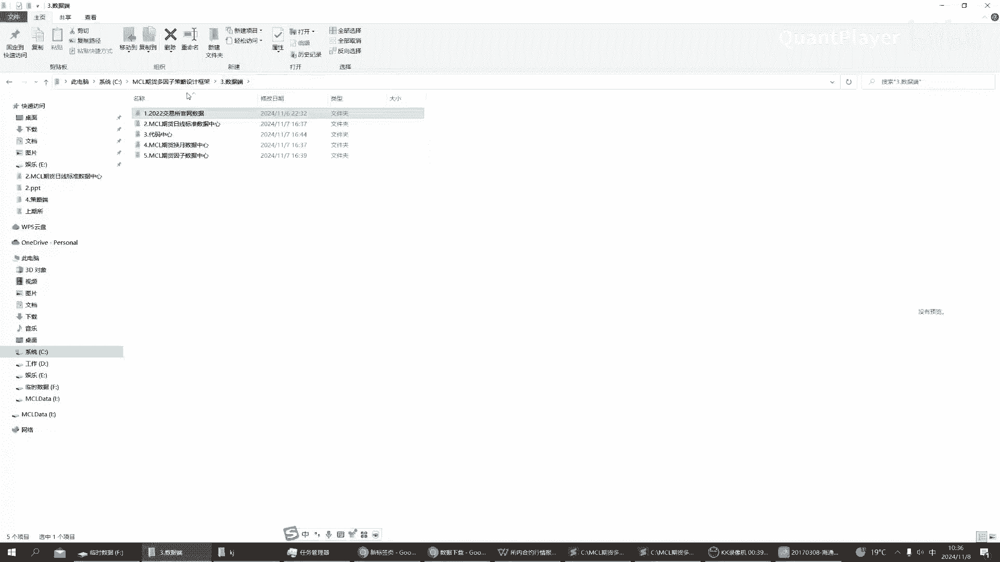

把每一个文件它都是循环读取进来，然后进行一个分组操作就可以了，数据端额数据的处理我就简单讲到这，然后第二步我们要做的是幻月的一个处理啊，画面的处理的话，我今天就更没法展开了，因为这一块的看看起来代码量。

代码量不多，但里面涉及到一些细节，我只能讲一下原理，我给你们的这个让利，它是根据成交量最大来切换，相当于我就是会先做一个什么处理呢。

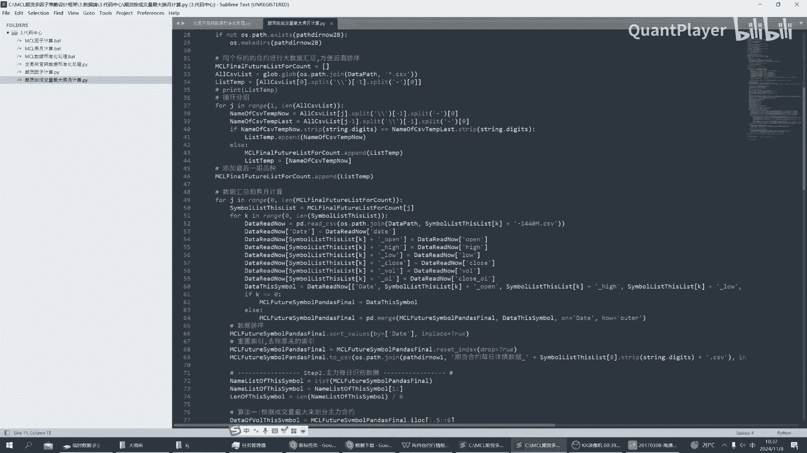

嗯我们看一下结果，这边吧，幻月的话我会有两份数据，一份是合约每日详情，我每个品种会把本地所有的数据弄成，汇总成一个大表，然后他的表头是这样，每个合约后面用下划线再跟上他的开高低收，成交量和持仓量。

然后再根据每一天去横向的去比较，谁是成交量最大的那一个挑出来，然后做最后的一个主力合约的一个识别，这这底下每一个合约他就会有一份文件，它上面就会有当天的主力合约是谁，然后主力了开高低收成交量，成交量。

然后关键是后面这几个是后面要使用的，不管你做什么策略类型，这一块数据都是相相当有用的，就是说因为我在主力切换的时候，是要做一个换用处理吗，那我们看这里，这一天从2203切到207的时候嗯。

我会记录什么主力合约的close las，Close，前一日的收盘价，还有主力合约今天的开盘价，一般我们用这个，一般我们会在这一天做一个换月的一个处理，怎么换呢，因为这一天其实已经换成207了。

你这个6052是2207的开盘价，但是6069是203的开盘价，那我实际上会在6069先把旧的，如果你有持仓的话，先把旧的平仓掉，再用这个6052来开新的仓，所以有了这份数据的话。

你就完全可以做到跟实盘非常接近的一个，幻月处理的一个结果，然后另外还有一个文件是汇总的，相当于就是TQ是天井的意思，这是我历史遗留的一个问题，嗯我是用天晴做后缀，这没什么，不代表什么意义呃。

这边的话就每个它相当于是汇总了所有品种，它每天随时主力了这么一个，代表这些后面的策略端有可能会使用到假。

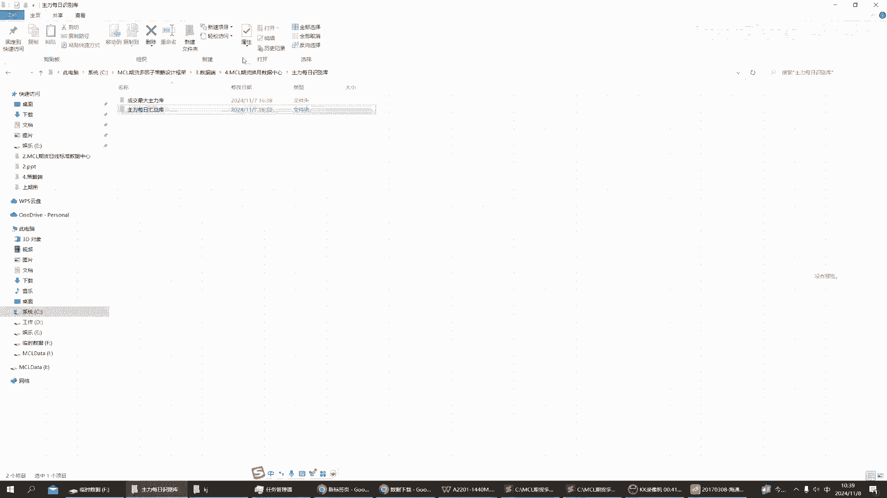

所以幻月的话代码我就不说了，原理就是这样，代码你们自己回去读，有什么问题的话，可以再跟我沟通，然后它运行完之后就会出刚才的那样的晶格，结果你们如果用了历史的2021年的数据。

或者23年的数据都已经下载完，然后要处理成标准格式了，那你要把幻月的这一封呃代码再运行一下。

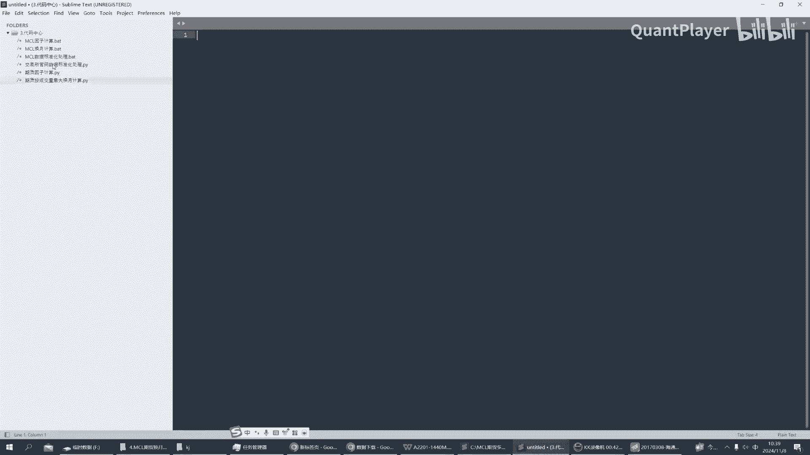

你的本地才会有完整的更新完的。

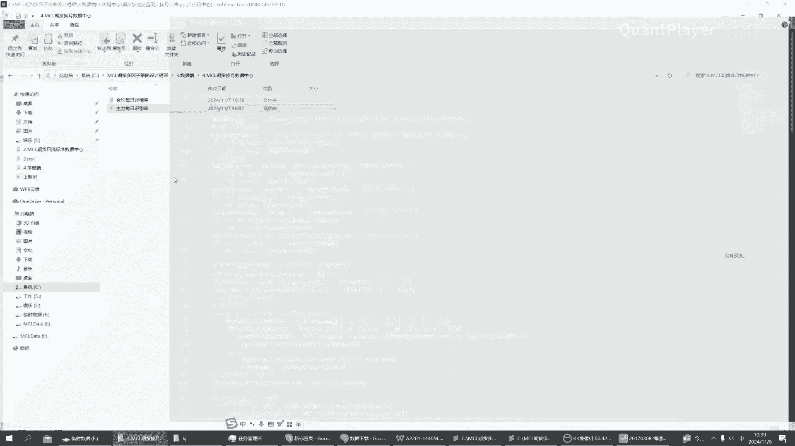

这么一个换原数据，然后第三个数据就是期货因质的一个数据，我们这就是在对应这三块啊，这三块内容我做了一个代码的一个演示，因为我们有了基础数据，有了幻月的数据，最后我们再算一下因子数据。

那最后就可以用来评测我们的策略，因子数据的话是这样，有两个因子吗，一个动量，一个是期限，这个我们也没办法讲的太详细，就展开就稍微讲一下吧，我们长期因子的话有四种模式嘛对吧。

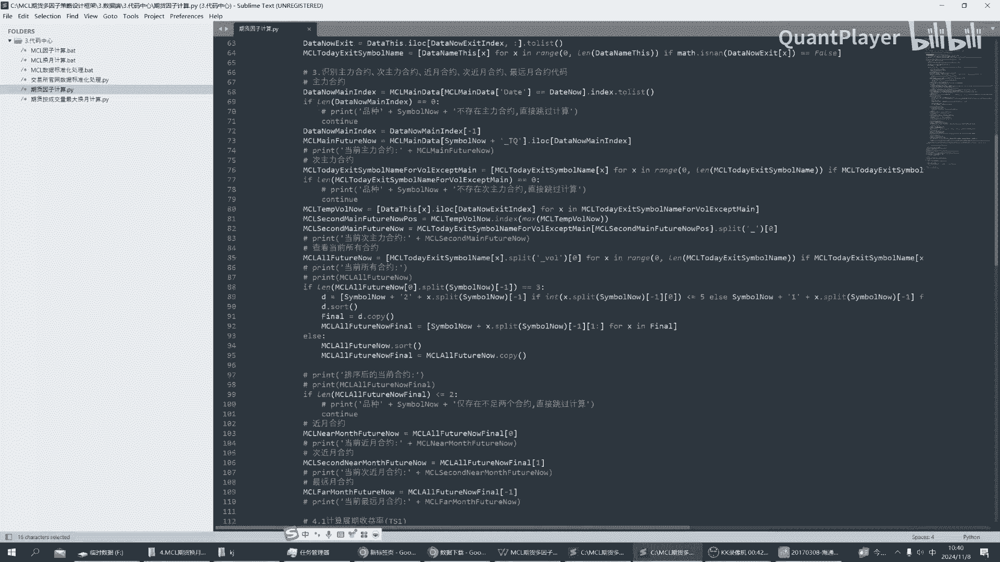

所以我们在代码里面是要去判断，因为我们前面讲到了，我看一下他是有近月次近月。

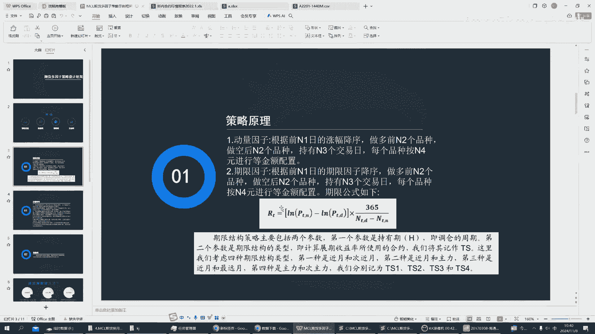

近月主力，近月最远越主力次主力这几种，那你在代码里面，你要首先把这几个合约识别出来，才能用他们数据来进行一个运算，爱握在手中却流失去自己风，然后关于他的分母的那个计算，我是这样处理的。

就是我会把他的一个到期。

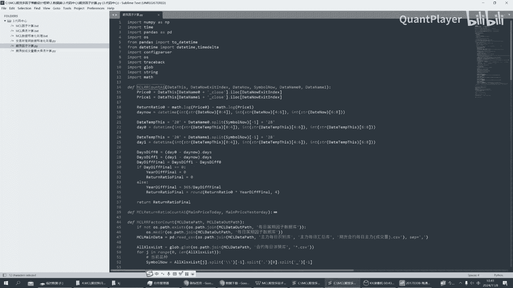

就他是一个到期预约，它这里有个NTD减NTN嘛。

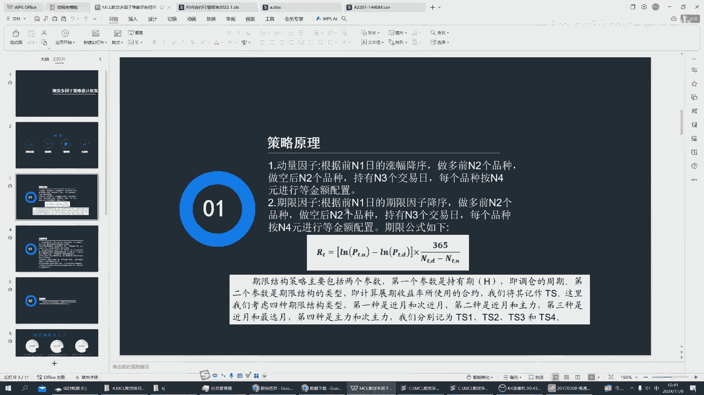

就他们到期日日的一个差值相减，这个东西我是把他应该是默认成我看一下，啊，对头，我应该是以他的就是可以取它品种的一个代码，比如说啊A2201，那我是以它最后月份的这个后面加个28，我这里每个月的28号。

作为他结束的一个日期，这样子来得到我们要的一个时间。

它的一个到期日，要不然你真的要去维护一个到期日的数据的话，是相对比较麻烦的。

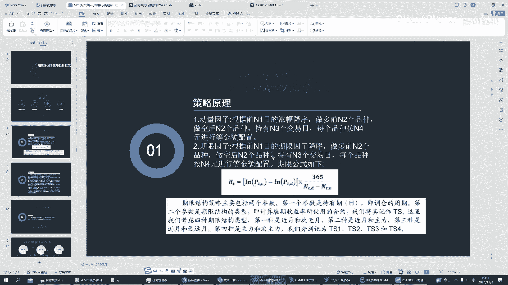

所以我是简化成这样，就相当于云他自己1月份到期的一个28号，作为一个最终的一个到期日，比如说201，那可能就是个0128，然后如果是梦中，反正就是二零，要是1月28号，如果是2205的话，就是5月28。

大概是这么一个意思啊，具体的你们可以自己再去看一下代码，然后我们来看一下他最后输出的一个结果。

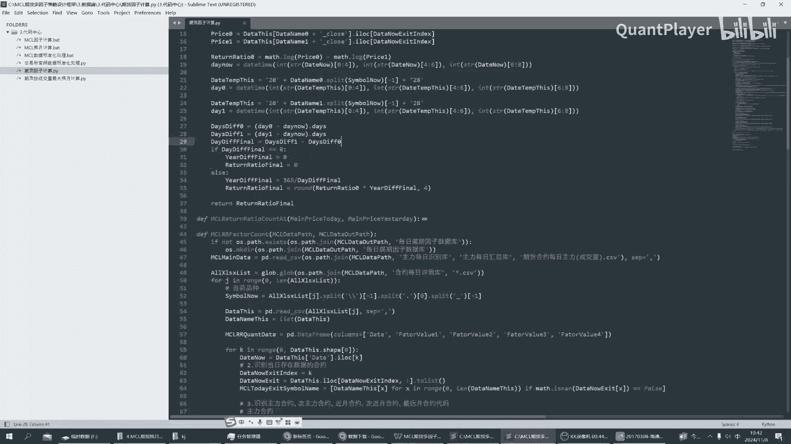

就是我们的音质值的数据长什么样，我分两个，一个重量，一个呢一个旗舰重量的话，我们我后面都叫啊value1，然后如果有多个的话，就234动量就长这样，他是最后就相当于就两列一列日期，然后一列是因子的数值。

那我们看一下期限期限，因为它有四种模式嘛，所以他就会有四列的一个数据，就根据多个上传，有些地方会零，这个的话你们自己去看代码，以及看它原理就明白是什么意思了，所以说正常期限的话。

我们可能更喜欢用的是T3跟T4的模式，在我这里面的数据的话，他就是后缀变成234这种，到时候方便策略端去调取，所以有了这三个代码的话。

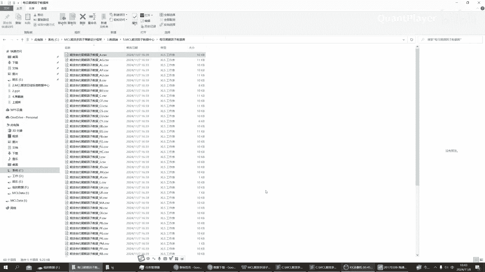

这三份代码我们就可以算我们的基础数据，算我们的换月数据，算我们的因子数据，当然这三部分你都可以自己去想办法，替换成别的，或者是把功能做的更完善，因为我们今天是从呃交易所官网获取，而且我们只是讲历史的。

如果你想要实时的话，交易手官网也可以。

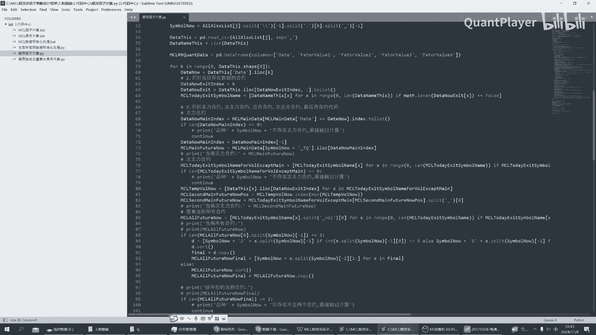

交易手官网的实时的话，你就需要自己去爬取，因为他每天也会有呃，当天的一个数据嘛，在下午可能十点后吧，具体几点你们可以自己去看一下，自己去观察一下它的一个规律，它不规范，不同交易所也不一样。

你在每天他收盘之后，但你肯定是要在至少在网上夜盘前，你要把这个数据处理清楚，你用爬虫的方式去把数据爬取下来。

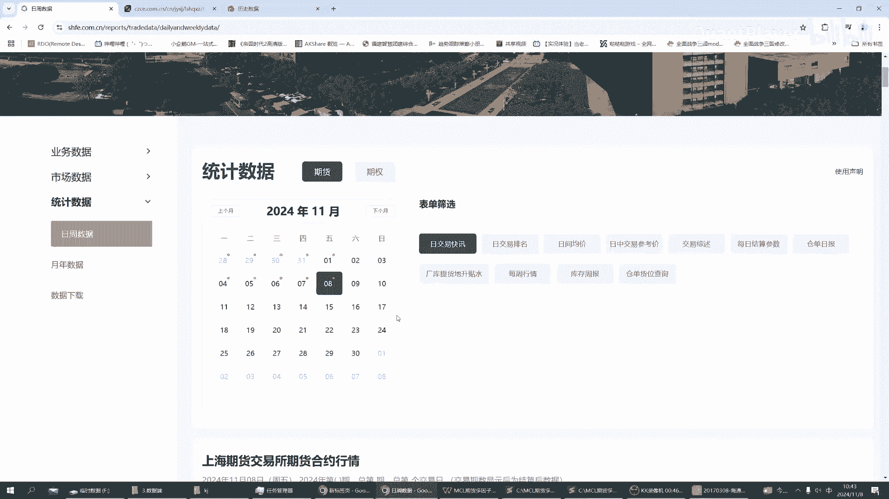

然后再根据我们的格式去给他录入到本地，那你就可以保证每天数据的一个完整性，那这个代码你们就需要自己去拓展，如果你们需要做一个策略的一个更新的话，小狼好。

那我们今天数据端就简单过到这后面，我们我们这里来讲策略端，策略端的话，我们就是以实现动量跟期间因子的评测为例，至于它的策略原理，前面我们简单讲过了，就是那么那么简单的一个模型。

我们看一下怎么设计一个完整的流程，其实细节包括会相对多一些，不要看觉得这图其实嗯，你你只要完整的想象一下，如果你是做手工交易的时候，你对于这个策略你要做哪些步骤，我们无非是把它做成程序化而已。

我这只是为了PPT做好看点展开这样讲，但其实我们先把这个过一下，然后等下再看一下代码的一个内容吧，因子读取第一步嘛，因为我们因子已经算好了，所以我们只需要把音子读进来，然后调参数交易，这个要在排在前面。

是因为如果涉及到我们挑战日，已经到了挑战日的话，我们是需要进行一个交易处理的，我们要去模拟一下实际的一个情况，知道说我们要对哪些品种进行一个平仓操作，对哪些品种进行一个开仓操作，然后排序计算。

这是根据音质值来进行一个呃，升序或者降序的一个排序，来确定说我们做多是哪些品种，做空是哪些品种，每日收益，这个是持仓过程，我们因为我们只要第一次开完餐之后，我们应该是一直都有持仓的。

那只是说品种不一样而已，中间过程可能会有切换，那我们持仓过程的话，我们只需要计算每日的一个持仓收益，就品种他今天的收盘价减去上一天的收盘价，就是我们当天的一个持仓收益，但如果有交易或者换月的话。

我们就要计算一下开平仓的收益，以及一些手续费的一些内容，然后换热处理，因为我们在实盘交易过程中，我们肯定是也是要做这一步的，所以我们在我们的历史回测中，也要把这一块考虑在内，换用处理，我们有了换用数据。

其实这一块就相对比较好处理了，只要判断到某个品种，某个合约我们是有持仓的，然后他他到了他当天是该换月的时候，那我们就需要平旧的仓位，开新的仓位，就是我们刚才数据有讲到的，我既有旧主力的竞开。

又有新主力今天的数据，所以我就可以做一个这么一个切换的一个处理，然后汇总统计就是包括最后的绘图了，就是我已经算好每天的收益了对吧，那我就可以最后累计在一起，然后绘制出曲线，这就是策略端的一个内容。

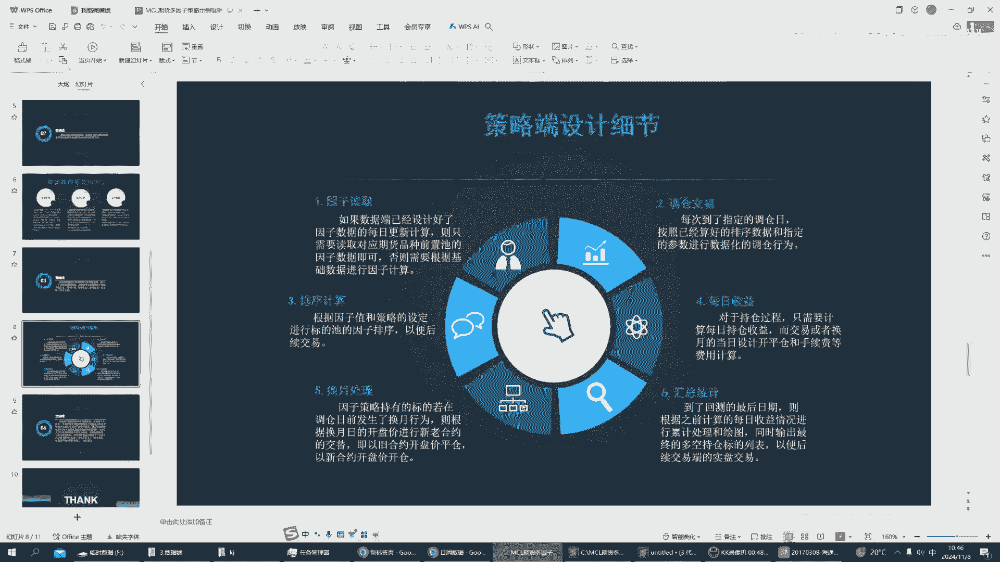

我讲起来简单，但其实代码设计起来还是相对比较复杂一点。

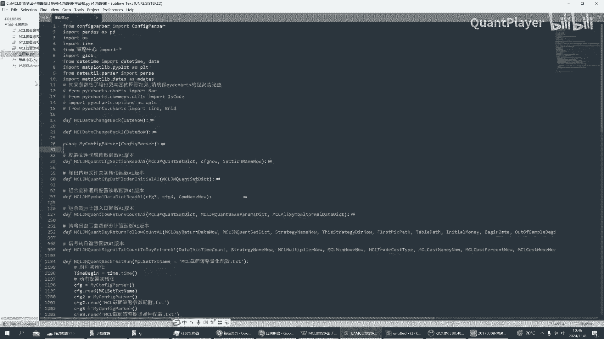

代码的话有两个多漫长嗯，两个Python的文件，一个是主函数，一个策略中间运行的时候。

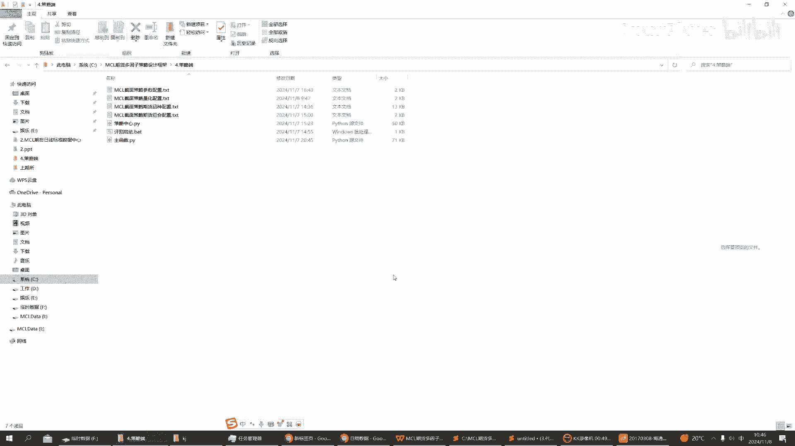

在主函数里面运行，策略中介是用来写因子策略用的，包括一些细节的一些处理，这个代码我也没法展开讲呀，因为时间有限，我主要讲一下你们在使用的时候。

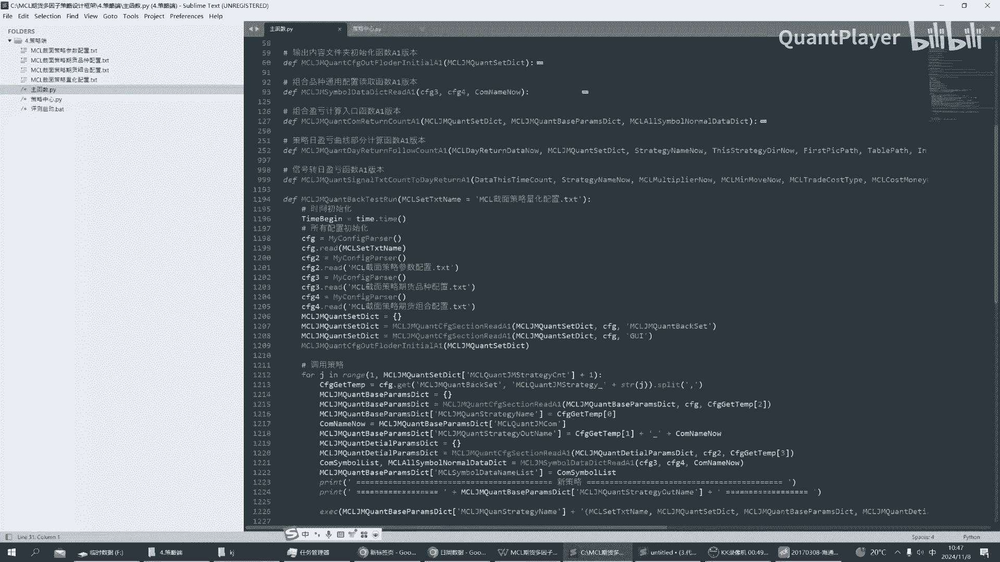

可能会遇到的一些问题，然后看到这里有四个配置文件啊，前面讲数据端的时候没有配置文件，是因为我基本把配置写死在里面了，因为我临时写的也不想弄得那么复杂，但是我正常自己做项目的时候，肯定是会用配置文件的。

因为我们正常都是写完策略，或者说写完一个项目之后，我们希望的是，除非是做比较大的升级或者是修改bug，否则的话我们一般是不会想再去动我们的源码，而我们有需要调整策略或者换别的策略。

很多时候我们都是改一个配置文件，所以我一般设计习惯也都是带配置文件，而配置文件的话模式有很多种，我最喜欢的是用TT这种模式，让我们看一下这两个，我先讲一下期货组合配置的话，就是我前面讲到的。

我们的前置标的值，我这里已经配好了，是适合品种，这个比较简单，然后期货品种配置，就每个品种它会涉及到我们的保证金中，因为我们的保证金比例我统一在我们策略端，我设置10%，但是每个品种它有它的合约层数。

然后他的一个手续费的一个内容，以及他最小变动的这些内容，我都在这个文件里面配好，到时候我们呃策略装会自动去读取，然后参数参数这个是我们策略内容的，我这里要讲一下呃比较关键的一个内容，调仓模式。

这几个配置相对来说，我我讲几个主要有用的一个配置啊，啊挑战模式这里都写零啊，这个没有意义，但这个很有用，就间隔日，就是我们刚才里面策略内容讲到的，间隔N3个交易日。

这个这个东西你写20就是20天调一次仓，你写十就十天，所以这个是比较重要的，后面这几个呃嗯这两个也没有用，但这个的话是有用的，就是我说的你是要固定个数还是百分比好，那一般我们选固定个数。

然后就固定多少个，也是，这，这个上限，是用来在百分比情况下做一个上限的一个设置，因为你正常的话，我们去交易，我们肯定心里要先清楚，我们大概要用多少的本金去交易，如果你超上限的话是会比较麻烦的。

我什么时候会超上限，一般都是设置百分比模式的时候比较不可控，所以正常这个也不用动，所以你正常这部分要改的内容就是调仓的天数，然后以及前后，你可能要选多少个品种进行交易啊。

然后这部分内容我建议是可以不用动，这部分内容是用来过滤不活跃了，虽然说我44个品种，我正常已经把不活跃的品种剔除，但是运行过程中它仍然有可能遇到某些品种，可能近一段时间很不活跃。

那我用的是成交量和成交量同时的一个模式，相当于也就是嗯你前一个交易日，这我嗯我有点忘了，是前应该是前一个交易日，前一个交易日他如果或者是当天吧，因为我们正常这种策略，它是在当天收盘价已经出来之后。

收盘数据已经出来之后，我们盘后进行一次计算，那我如果判断出来我这个标的，虽然他在我在我进行一个排序，然后在排序完之后，我要筛选他的时候，我会先看一下，或者说直接让他不参与排序，让什么不参与排序呢。

就是不够活跃了，那我是根据比如说持仓金额它小于1亿，或者是成交额小于1亿，因为这里用1万来表示，然后它单位是万元嘛，如果他是这样子的话，小于一个亿的话，那我就不把它筛选在内，所以这一部分你们不懂的话。

可以不用动，这个也不用动，然后这下面这两个也是可以调整的，对动量因子来说的话，嗯我们只有一种模式，因为正常我自己用的话，我可能还会有指数的方式，还有主联的方式或者其他数据源的方式。

所以这里的话这个框架里面，你们后续有拓展的话再去调整，没有的话就直接用E就可以，但这个的话代表的是，到时候你用我前面有提到的，我们用多少个交易日来做平均，或者说是多少个交易日，他一个回看的一个窗口。

那长期收益率的话，这个参数就比较有用，你用的是哪种模式，我一般是用三或者四，你要一跟二的话，也可以自己去调整，然后攒期收益率的窗口就是你多少个交易日，它的一个收益率的一个平均，所以这几个参数都是有用的。

整体来说的话，就是你要调整的参数范围，主要是这部分跟这里还有啊，不是不是，这里是这里挑战日，就第一部分是挑战日跟个数，然后过滤不用不用动，下面这里的话可以根据自己的需要去调整，但这还只是说你手动去调整。

正常我们去使用的话，我们可以想办法把这一块，那就自己写个代码，把我们的参数优化这种功能添加上去，那它就会自动去跑，这才是比较高效的一个行为，然后最后还有一个量化配置，这一块量化配置的话有终于双手呃。

量化配置这一块的话呃，前面几个都是最后结果输出的一个路径，我这今天先弄到F盘嗯，我给你们的时候可能会打包成，我等下会把替换到C盘去，就这路径你都可以自己改，然后基础数据路径，换月数据路径和因子数据路径。

就我们前面算的这几个路径，你们自己根据自己放的位置去调整，然后计算完整度的话，嗯一般不用改，你按一就可以，除非你想看每个策略的细节，因为我们这个截面类型的话，我是四个品种。

我最后肯定是看大家组合的一个结果，但你如果想要知道每个策略他的表现，你可以把它改成二，然后这里图形结果的话，一般我简化了，看，我只看一张日影绘图文表格，如果你调成别的话，比如调成三的话。

他会输入很多的图表。

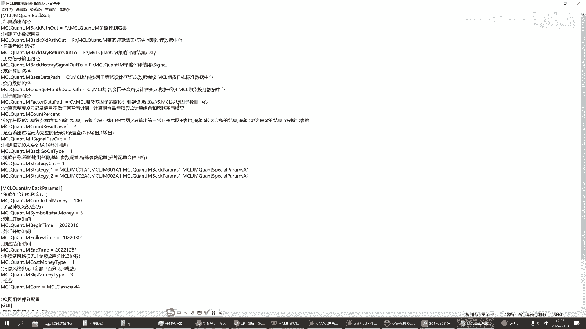

但是你如果要调成三的话，你等会代码那边有一个地方要去放出来，就是py recharge这个包，因为他有些图是根据这个来画比较好漂亮的，但是你如果要那个的话，你自己要保证你自己的包安装完整。

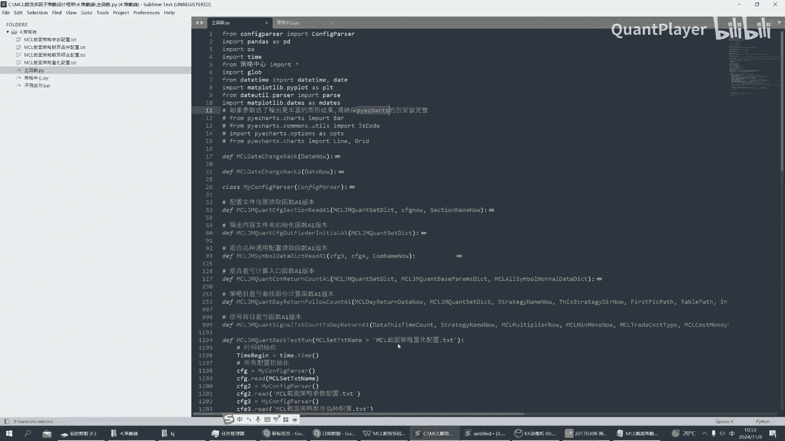

好那我们今天继续看是否输出更完整的记录嗯，这个一般不用动吧，回车模式，好像我并没有这嘶在这个版本里面，我没有提供这个功能，也就是说是什么，就是在实盘过程中的话，我正常是历史上算一遍嘛，然后新的日期的话。

我只需要根据当间新的数据再算一下，它会更快，否则的话我给你们这个框架是一个循环模式的，他的评测效率相对比较低，我自己现在肯定是在关于这种策略类型，我肯定是用呃矩阵化的一个处理，他是秒出结果的。

不管基本上你就算是几年的数据，基本也是秒出结果的，所以我那种的话无所谓，就完整计算就可以，但对于循环模式嗯，确实从头到尾算的话会比较慢，但这个功能我记得好像这个版本里面没有，你们后续可以自己考虑加。

其实也简单，你只需要去判断一下本地的这个日盈亏，算到了哪一天，然后在他日期之后的数据，再进行一个处理就可以，然后策略策略就是你到时候调用的策略，如果你要计算多个策略，你就改成二三，但你不能写成三。

但下面只有两个，但你可以下面有两个，你只写成一，就是说你这个数量，不能超过你实际配置的策略数量，然后策略主要是策略名称，这是你在源码里面叫的名字，输出名称是等一下你输入到本地的时候，它会有个前缀名。

你要叫什么名字，这个可以随便改，然后第三个是基础配置，也就下面这个你可以配到别的地方去，你可以有不同的配置，把这个copy一下，然后自己再改别的，比如说你可能你的本金啊，初始资金不一样，那你可以再改。

然后这个是对应的，刚才提到了这一个配置里面的这个，他前面的小界名，正常我们前期使用不熟悉的话，就不用动就可以，然后这里就是他策略的基础配置了，但是额100万至本金，然后每个品种5万。

那我实际上的话按照我刚才的配置，六个六个多，六个空，12个品种60万，那我100万嗯，差不多吧，也可以勉强，然后测试测试的开始时间和结束时间，因为我用的是22年的数据，这个外延时间是嗯。

因为我们正常做策略的时候，我们会分一个样本内，个样本外，我样本内数据可以用来做参数优化，但是样本外的话我肯定是不动的，会直接测试，所以正常有这么一个设计，到时候画图的话颜色也不一样。

比如说样本内它是一个黑色的，然后样本外它是一个红色的，但你们如果只做样本类的一个处理，这个无所谓了，这个你随便设一个就可以，但不要超过他们的一个时间范围就可以，手续费风格的话。

一般我用的是额固定金额的手续费，然后再加以跳的这么一个滑垫来进行一个设计，但我们实盘过程中的话，因为这种截面类型的策略，你如果资金少的时候，你甚至可以用集合竞价的模式来进行一个，实盘的下单处理。

所以实盘的一个效果，可能甚至会略优于我们历史评测，因为历史评测它我们都是华点实盘，你如果按集合竞价一开盘价成交，你是不会滑点的，我指的是日线级别，好组合，我们默认是的GI这个无所谓，这次画图的时候。

一些配置你们不用动就可以了，好讲完配置内容的话，我们嗯策略内容是这样。

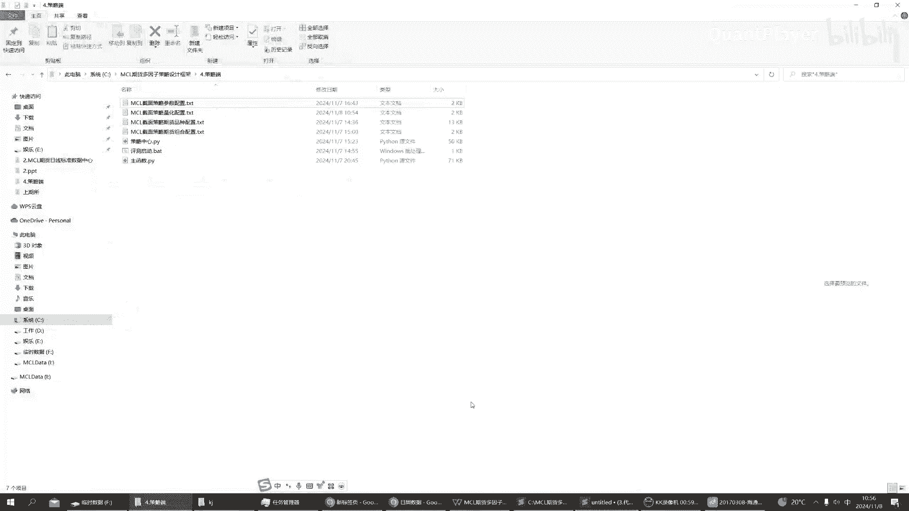

你如果要去，看的话，这个主函数里面主要是涉及到一些绘图的，以及一些参数的一些，把刚才那几个参数表读进来，然后做成质点，然后后面去调用也可以，C1C这个可以自己去查一下什么意思，然后去调用我们的策略内容。

策略内容就在这，我一共两个策略的样板给你们，一个是截面策略，一个是动量的因子，今天没时间啊，不然我可以稍微展开讲一下这块内容。

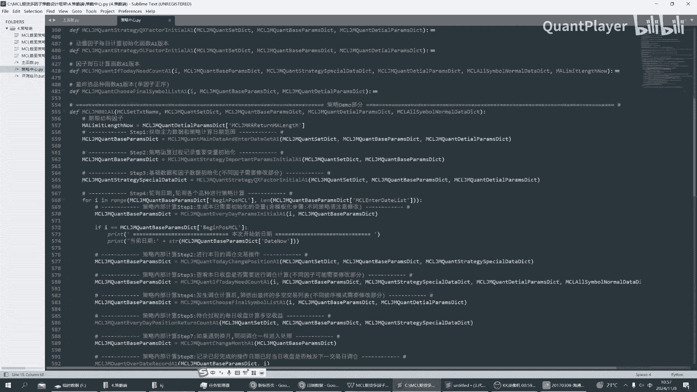

这里其实就是把我刚PPT的讲到这几块内容。

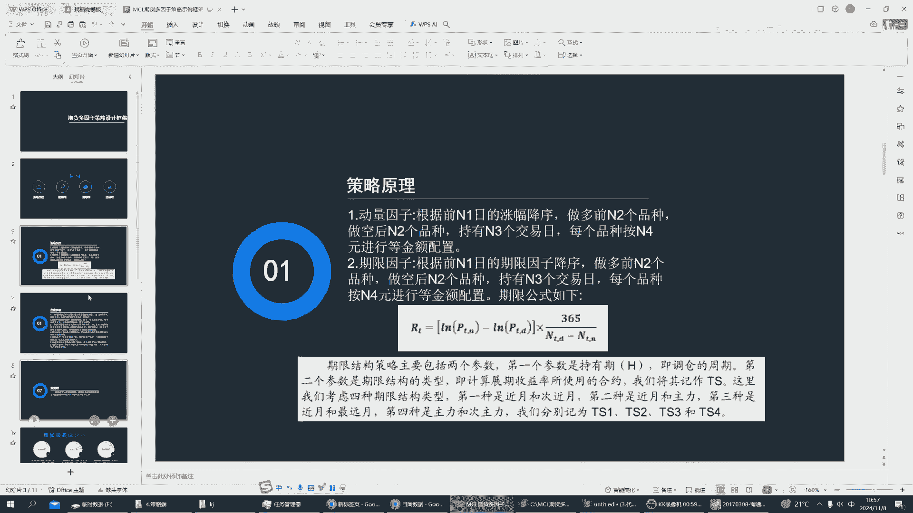

在代码里面进行了一个复现，然后做成了这么一个嗯，我们可以直接评测的这么一个工具，结合我们前面的数据端，那我们就把数据端和策略端做好了，然后把它运行起来就能出结果，那我们还是运行一下吧。

策略当我们还是运行一下嘛，比如说主函数给他运行一下，然后去看一下F盘，他在F盘会出一个文件夹，我们应该是一个策略还是两个策略，我刚好我刚才只配置了一个策略。

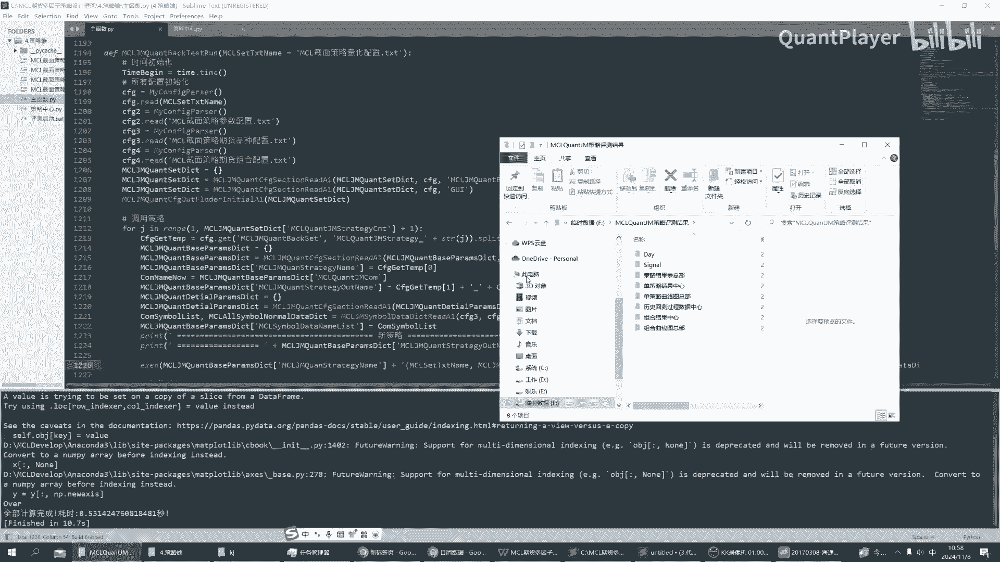

如果你选二的话。

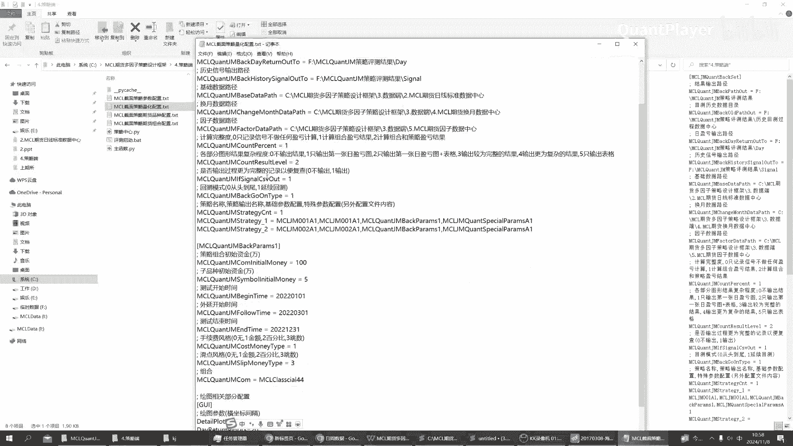

二也会运行吗，如果你选一的话，只会运行一，我看下一是我们的期限这里，那我们看个一就好了，我们看一下我们的结果。

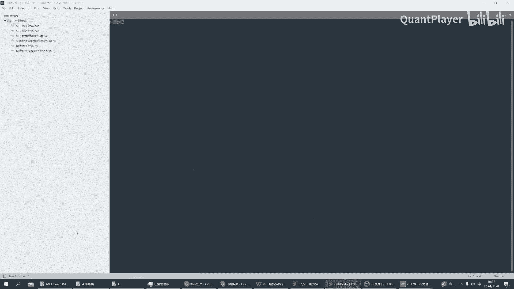

结果有这么几个文件夹data，这里面放的是日盈亏日期加当日的一个银灰。

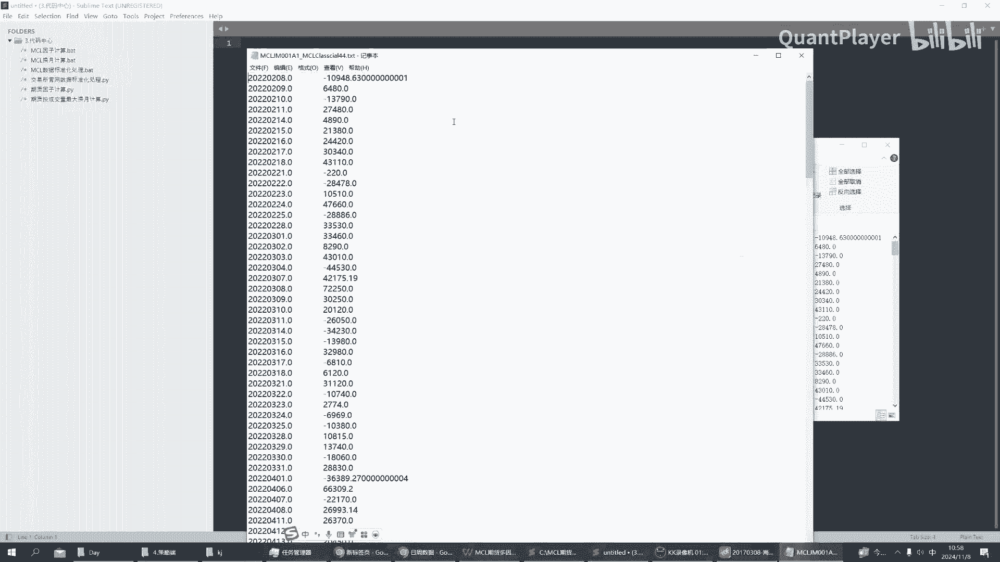

然后这个放的是信号。

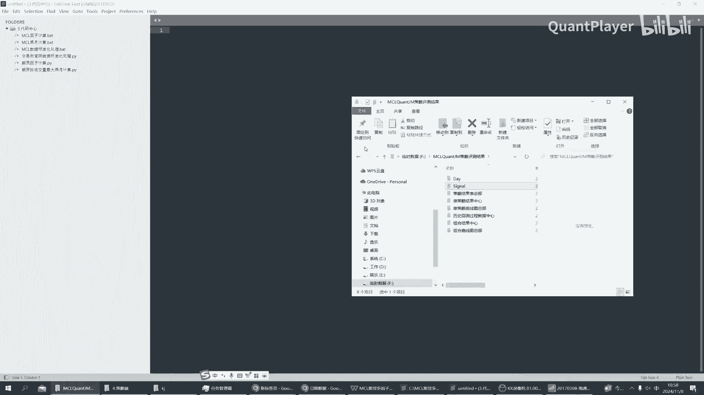

每个品种它的一个信号，2530是我用来代表，就是当天是否有持仓的一个状态，更新的一个中间，具体你们去看代码，因为我用2530是，因为我想用一个自然时间外的，因为以前有弄比特币的时候，他是24小时交易的。

所以我用了2530这么一个东西，然后策略结果表，每个策略的一个结果内容单策略，因为我们刚才配置的没有看单策略的结果，然后历史回测的话，这个比较重要，这个其实你要实盘的时候。

其实就看按照最后一个交易日来看的时候嗯，你只要根据这两份文件去指导你的下单就可以，这什么意思啊，就是我这里提供的是最后一个交易日，就你评测到最后的时候，那如果你是实时运算，实盘过程中。

你也是根据知道说下一个交易日，比如说呃你交易的是哪个合约，他要下单多少手，你到时候就算你是人工交易，那你只需要手动去开仓就可以，如果你是能写成程序化的话，你每天只需要对照一下你自己的实际持仓。

跟这个我们理论算出来，下一交易日的一个对比区别就可以，所以说，我的整个策略框架，它是已经就已经这种日线级别的评测，而这只是盘后就算数据的这种东西，它实际上我们的评测跟我们的实盘用的代码，是一样的。

因为这交易端你是可以独立开来的，你可以根据这个数据直接去下单就可以，然后组合结果哦，组合结果就是我们刚才的那个呃，001期间结构那个策略，然后他的一个结果内容，它包含了呃。

日盈亏的文本跟他自己的一个曲线在里面，那我们看下组合曲线图，总部的话，如果你策略就是你如果凭着多个策略，或者你是跑参数优化的时候，他大家都会当在这里画一个图。

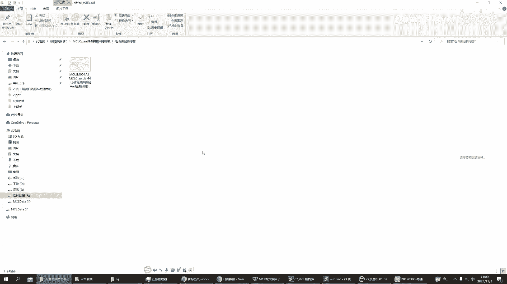

到时候你就方便去查阅，那我们来看一下曲线图，大概就这样。

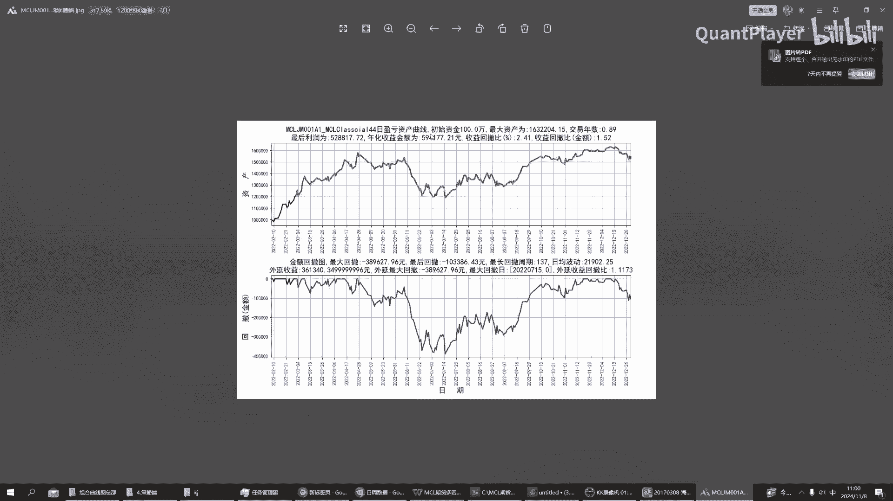

就是我们刚才配置的那么一个参数期限的，它是这么一个策略，它在2022年的一个表现情况，我们用的应该是20日的一个调仓，然后20日，然后用的是T4，就是20日的一个平均值，20天的一个调仓。

那想要得到更好的结果。

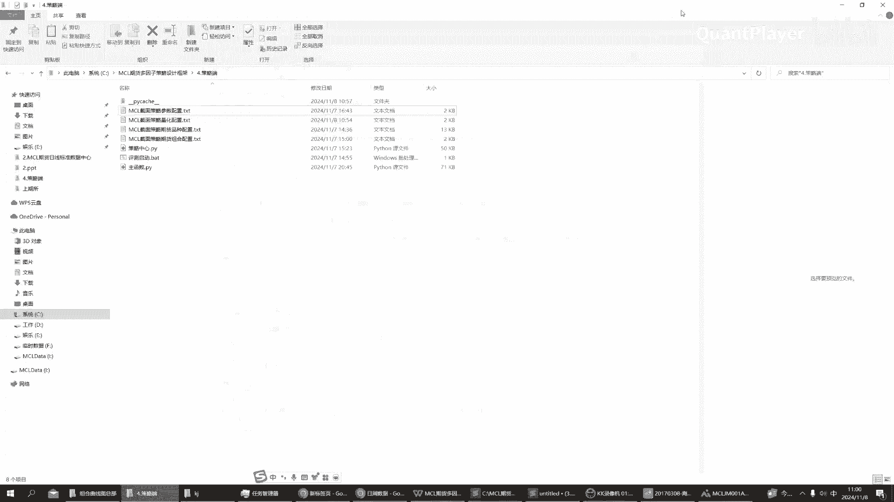

你也可以自己去跑一下参数优化，然后自己去多看一些资料，想办法怎么去改进它，一般我比较关注的是收益回这笔金额这一块，这一块他的意思是根据我这里面的算法，就是根据你年化的收益金额除以你的呃，一年的日期。

我这里面用的是自然日一些算法，比如说一些理论化，学术化的一些习惯是喜欢用夏普啊，然后用的是200多个交易日，这个来作为分母去计算下部值之类的，然后对于期货的这种策略来说，我一般喜欢直接看收益。

回撤比金额，你就按你的年化收益除以你的最大回撤，你的年化收益在计算的时候，就按你总的资金除以你的365天算出来，你的牛就是你的总利润除以365天，也就是用这个52万这个值。

除以365天算出来你的年化收益，年化收益再除以你额中间出现了最大回撤，最后得出来的值这个值收益回这笔金额，我们一般我自己一般就不同，策略不太一样啊，因为对于如果你是高频策略的话。

那你收益回撤比超过十也不夸张，但是你如果是中低频的策略的话，我一般是您每个组合这种，因为前面策略已经算是一个组合，每个组合的一个象限是至少要有二，因为你这还只是回撤回撤。

你有可能涉及到额拟合的一些问题啊，所以说你是要考虑到未来可能还会打折扣的，所以我建议是至少二以上才有进一步分析，是否可以实盘的一个价值。

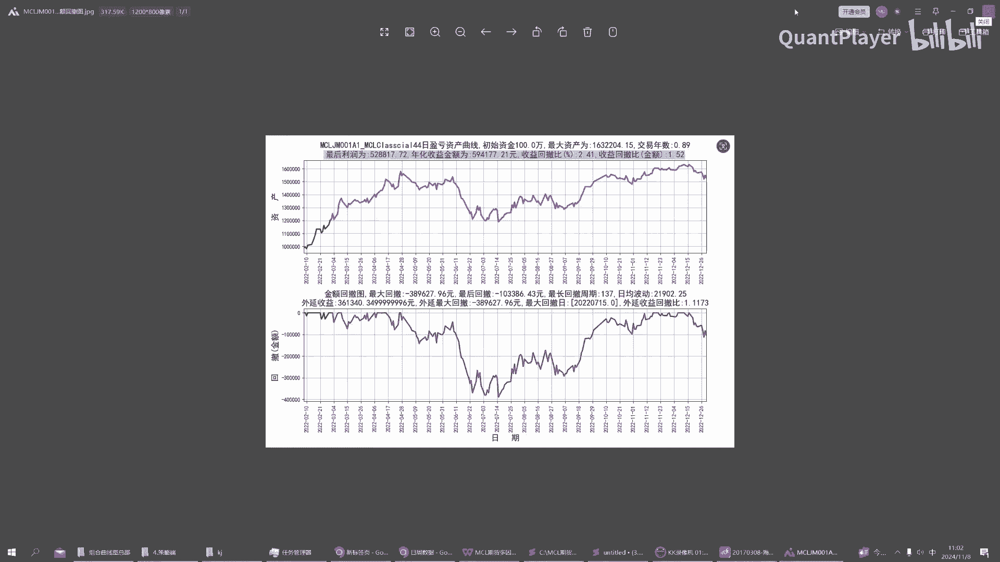

好那策略端的话代码没时间。

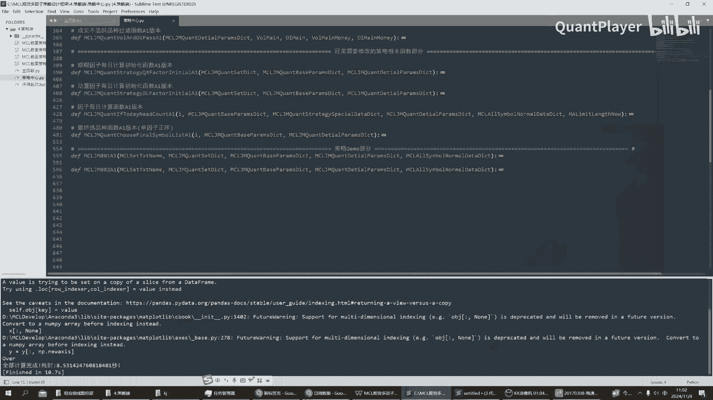

那你们还是自己去看吧，最后我们就是交易端，交易端我前面讲了就是额交易端很简单，对于这种策略类型，因为我们都是当天收盘后去计算数据，算完之后，我们就知道我们下一交易日要持什么仓位，然后期货品种也比较少。

不像股票，你要交易几百斤，可能所以说你只需要你要么自己写，你会会懂得编程的话，你自己去写一个工具，专门用来就就刚才说的这个结果。

你每次根据每天去读取这个，当然你前提是你如果真的要交易的话，你得把首先第一步你要把数据端做完整，就是每天的数据你要更新下来，然后把每天的换月数据，每天的音质值的数据算完，算完之后算策略，策略算完之后。

你就根据多头跟空投的这两份调仓的，这两份文件，你每天去读取，然后跟你自己的实际仓位做比较。

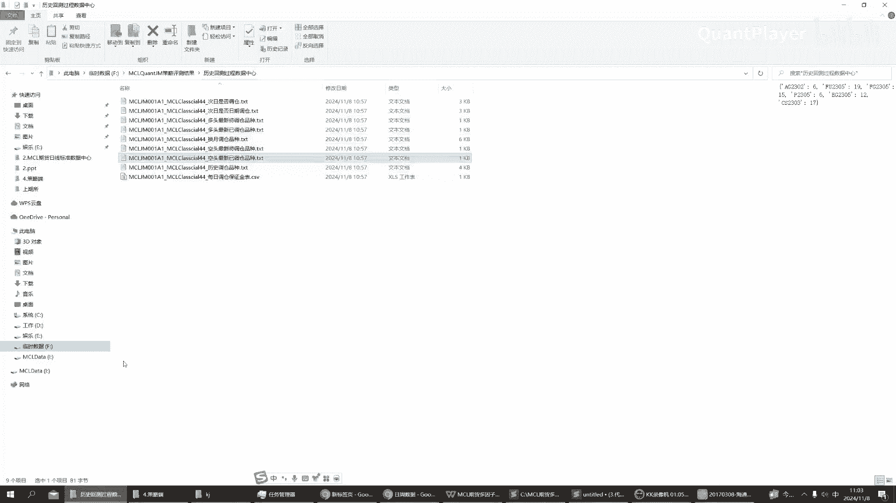

有什么差别的地方，你给他做一个调整就可以，所以就这么简单，因为你就算是手工做也能做，但当然我肯定是自动化做的，所以交易端这些我就不展开说了啊，这个视频我也发到B站，然后这个的话是我我要去分享的时候。

可能会给他们布置的一些东西啊，必做的这个可以考虑做一下选择，这个看自己吧，如果你真的是想把这个策略做到能够质疑，未来可能会去实盘交易的地步，那我建议你选做的内容，也可以去考虑去完成一下好。

那我今天的分享就到这里。

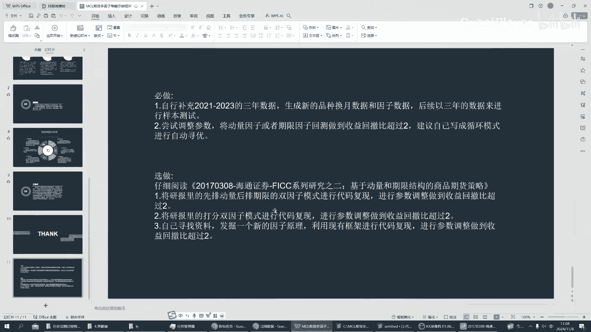