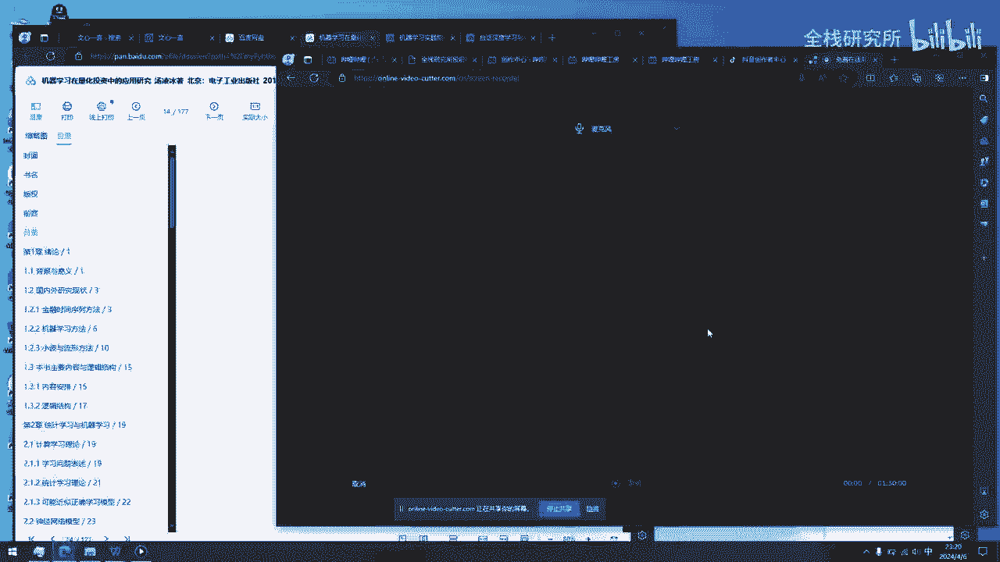
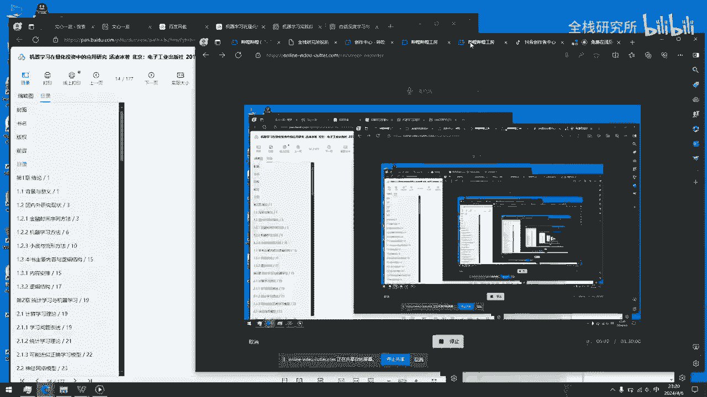
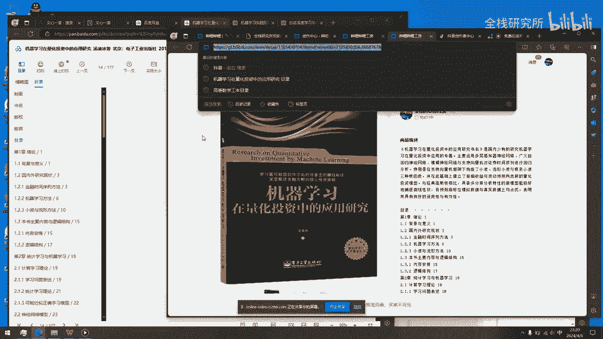
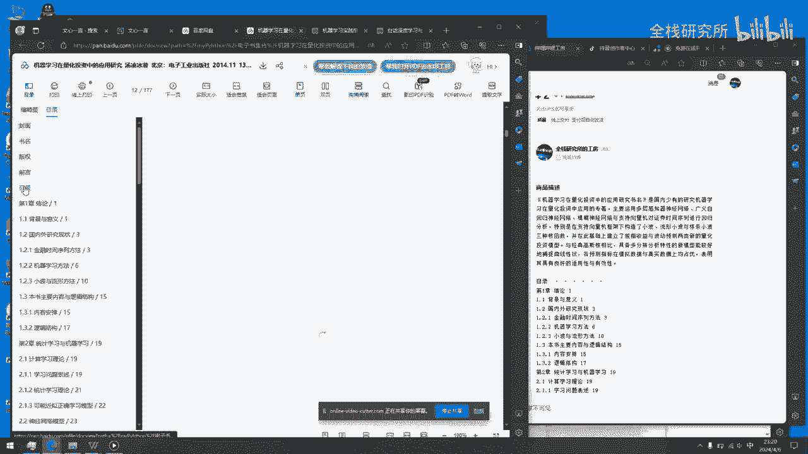
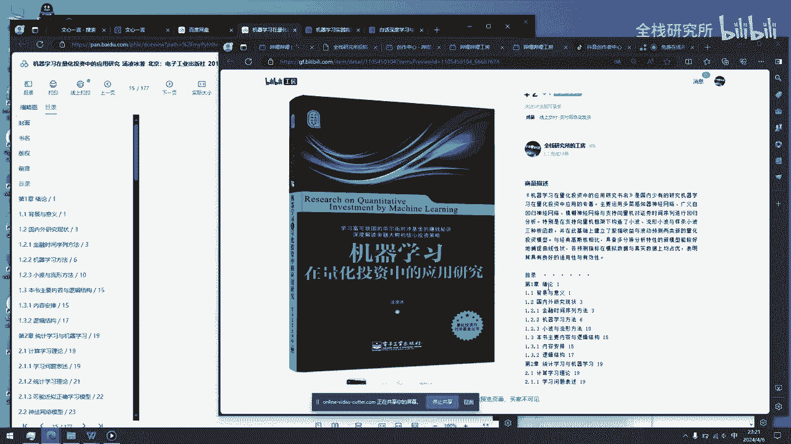
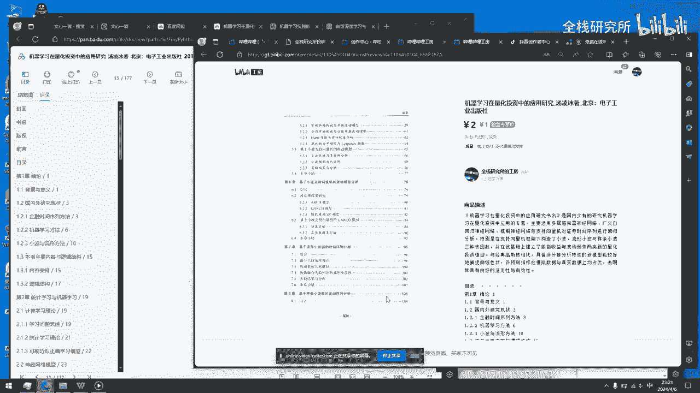

# 机器学习在量化投资中的应用研究 - P1 - 全栈研究所 - BV1Px421m7Fi

大家好。

今天我给大家推荐一本书，是机器学习在量化投资中的应用和研究，我这个已经放到工坊上面。

大家如果需要可以去搜索嗯，首先简单的来看一下，这个是网页版的，然后就是这一本书，然后的话就看一下目录嗯。

其实我在这里也写了，就是有背景的意义，还有就是啊机器学习与机器统计学习，大家可以看一下目录，大概就是这么多嗯，然后的话我这个已经放在我工房上面。

如果需要可以自行获取。

