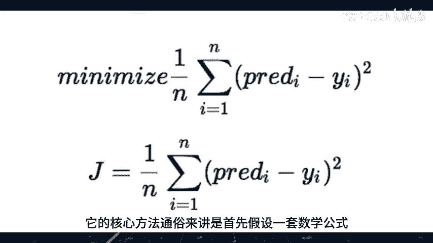
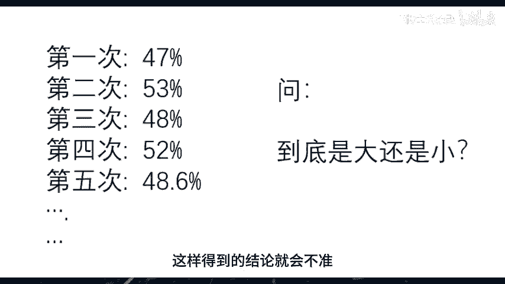
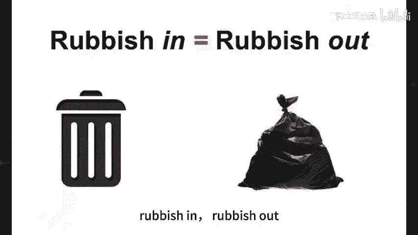
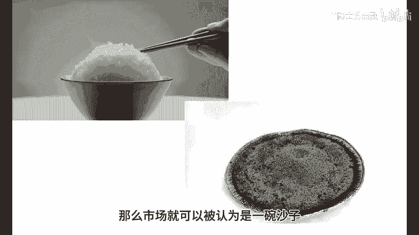

# 机器学习能预测市场吗 (一) - P1 - 量化K博士 - BV1CZ421N7Z5

在人工智能如此火爆的今天，自然会有很多人产生这样的疑问，机器学习能够用来预测市场吗，首先放出结论，不能，至于为什么不能，主要有两点理由，第一点理由，信噪比机器学习是统计学习的一种技术。

它的核心方法通俗来讲是，首先假设一套数学公式。

然后我们用历史的数据，魏晋这套数学公式来训练模型，所谓训练就是调整公式里面的变量的数值，使得这套公式能够最大程度地预测历史数据，它相当于从历史的数据里提取出有意义的特征，认为这些特征能够在未来复现。

从而使用这些特征来预测未来，举个例子，我们日常生活中的地域歧视，其实就是一种机器学习，例如我们常说北方人粗犷，南方人精细，四川人能吃辣，广东人爱喝汤，其实就是日常生活中大量数据的总结。

比如我们接触了100个北方人，里面有80个都是粗犷的，那么我们得到了一个北方人粗犷的规律，在历史数据里，这个规律具有80%的正确率，于是在未来我们只要遇到北方人，就使用这个规律来预测这个人是粗犷的。

我们自然而然的认为，这个预测有80%的正确率，说到这里看起来没有什么问题，那么为什么预测市场却不行呢，因为上面提到的北方人粗犷，这个特征是一个相当强的特征，它有80%的正确率。

但是如果这个特征没有那么强，例如只有51%的正确率，那么我们还能通过历史数据得到吗，仔细想一想，这就变得很困难了，因为每一次我想通过样本数据来统计，这个特征的时候，很可能有一半左右的机会得到的数据。

样本里面是不到50%的，有的样本集里面是47%，有的样本集里面是53%，这样得到的结论就会不准。

而且就算是得到了51%正确率的结论，用这个结论来预测一个新认识的人，说他有51%的概率是粗犷的，这有什么意义呢，如果说一个人80%的概率是粗犷的，这就意味着只有20%的噪音，这个结论是有实际意义的。

但是说一个人51%的概率是粗犷的，这就意味着49%都是噪音，这样的结论有意义吗，80%的这组数据就是高信噪比的数据，51%这组数据就是低信噪比的数据，接下来我们来看金融市场，为什么机器学习难以预测市场。

因为市场的价格数据，就是类似于这个51%概率的数据，换句话说，数据里特征太弱，噪音太强，对于这种情况，在机器学习领域有一个常用的说法，叫做rubbish in rubbish out。

意思就是说，如果你喂给模型的数据是垃圾，那么你就只能输出垃圾的模型，金融市场的一个重要的特点就是信噪比超级低，它的大部分的成分都是随机的运行，有特征的成分非常的少，傻到什么地步呢，我们用米饭来打，比方。

一碗米饭里面如果掺了十几粒沙子，我们一般仍然认为它是碗米饭，只是不太干净而已，而如果是一碗沙子，掺了十几个米粒，那么我们一般不会认为这是一碗米饭，而是认为这是一碗沙子。

如果把市场里面随机的部分比喻作沙子，把有特征的部分比作米饭，那么市场就可以被认为是一碗沙子。

一般人吃一碗有沙子的米饭可以吃饱，但是吃一碗有米粒的沙子，显然不仅不能吃饱，还会吃出病来，那么同样，如果我们在训练机器学习的模型的时候，喂进去的都是沙子，而不是米饭，则可想而知我们能够得到什么样的模型。

用行话来讲，这叫做使用脏数据来训练模型，用这样的模型来预测市场，显而易见是无法成功的，以上是第一点理由，下一期视频我们来讲，机器学习不能预测市场的第二点理由，过拟合，欢迎大家点赞收藏K博士。

