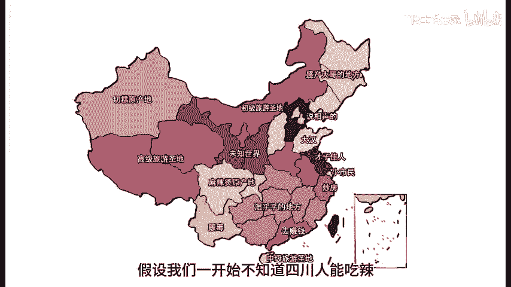
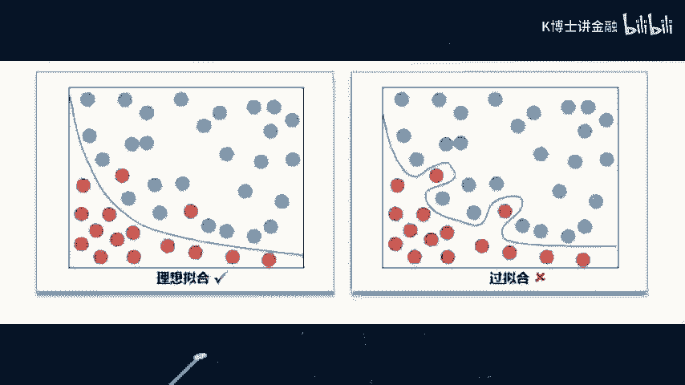
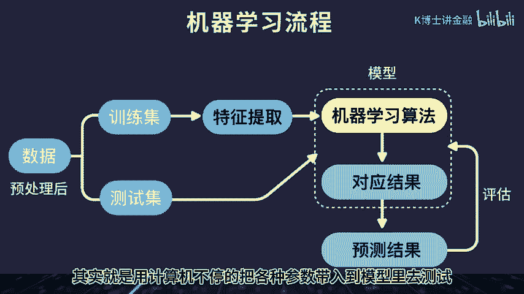
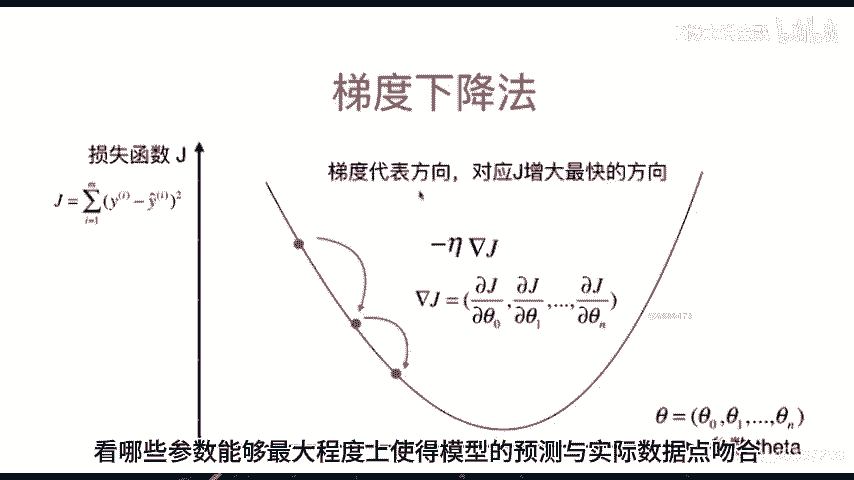
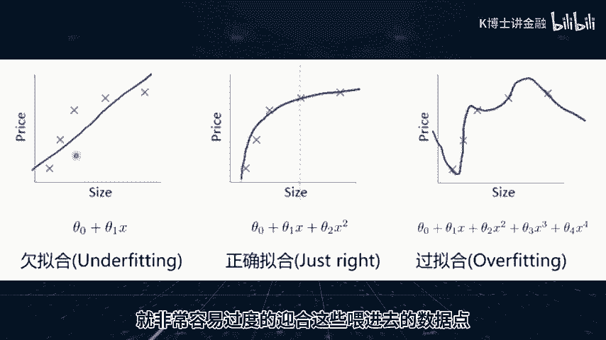
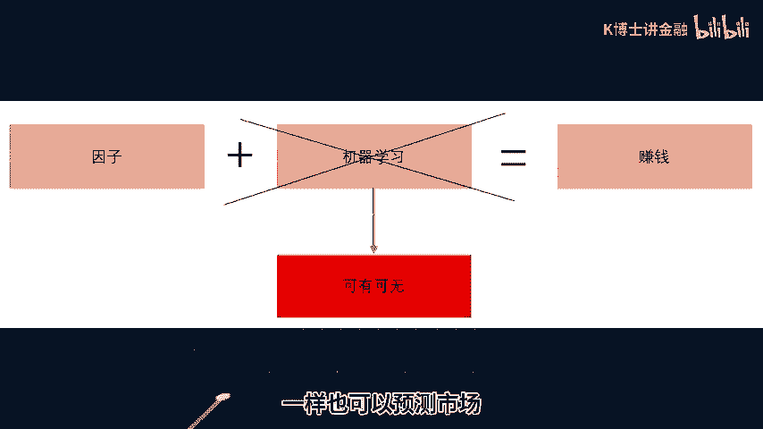

# 机器学习能预测市场吗 (二) - P1 - 量化K博士 - BV1PViwe8EvH

大家好，上一期我们讲了，人工智能无法预测市场的第一个理由，信噪比，这一期我们来讲第二个理由，过拟合，英文叫做OVERFITTING，我们首先来看某百科的定义，在统计学中。

过拟合是指过于紧密或精确的匹配特定数据集，以至于无法良好的拟合其他数据，或预测未来的观察结果，过拟合模型指的是相较有限的数据而言，参数过多或者结构过于复杂的统计模型，如果你觉得这个表述过于晦涩。

我们仍然用上一期用过的地狱骑士来举例子，假设我们一开始不知道四川人能吃辣。

我们随机采访十个四川人，如果我们恰好遇到了十个不能吃辣的四川人，然后根据我们的这次调查结果，我们就得到四川人不能吃辣的结论，这就是一种过拟合，因为四川人口有1亿多，我们恰好碰上的十个人。

完全不能代表1亿多个四川人的普遍特征，我们相当于是使用无法代表全集的关键特征，的几个数据点进行了拟合，这样得出的结果就是过拟合的结果，再举一个男生追女生的例子。

小明同学向身边的五个女生请教，女生一般喜欢什么样的男生，这五个女生给出了几个答案，包括高学历，幽默风趣，小明于是根据这个结论，去追求一个新认识的妹子，但是不巧的是。

这个新认识的妹子不喜欢高学历和幽默的人，他觉得高学历是书呆子，而幽默风趣是耍贫嘴，这个女生喜欢的是严肃，有肌肉的高冷男，小明的这个行为也是发生了过拟合，他用认识的五个女生的特征，代表了所有女生的特征。

所以在追新的女生的时候产生了失败，下面我们稍微学术一点，我们看图左图的拟合是一个理想的拟合，但是很明显，我们看到有两个橘红色的点，是被画在了错误的区域，形成了误差，但是如果我们过于计较这两个点的误差。

非常精细的调整了模型，就形成了右图的样子，这个时候虽然礼盒的误差小了，但是这个分界线并不能反映，两组数据的真实边界，这就形成了过拟合，它是为了拟合有限的这些数据点，勉强而为之的结果。

如果用这样的拟合结果去预测效果显然会不好，我们更进一步。

举一个金融市场的例子，为了便于理解，我们让这个例子更夸张一些，比如我们恰好选取了十天，这十天恰好都是雨天，这十天里恰好每一天的第二天市场都是上涨的，于是我们得出一个结论，第一天下雨，第二天市场就会上涨。

请问这个结论对吗，显然不对，但是我们为什么会得出这样的结论呢，因为我们过度的拟合了被我们采样的这十天，用这十天的特征代表了整个数据集的特征，这就是所谓的过拟合，现在我们来到机器学习。

机器学习的所谓学习的过程，其实就是，用计算机不停地把各种参数带入到模型里去。

测，试，看哪些参数能够最大程度上，使得模型的预测与实际数据点吻合。

那么如果数据点是有限的，就非常容易过度的迎合这些未进去的数据点。

勉强地做一些过于精细的操作，要注意金融市场的数据量一般都是非常稀少的，所以过拟合就成了家常便饭，很容易得出来类似于今天下雨，明天上涨的荒唐结论，所以使用过拟合无法用来预测市场，我们再讲远一点的真相。

有些人或者机构宣称自己，使用机器学习来预测市场，其实更多是怀有营销目的的，因为机器学习和人工智能的概念，在近年来非常的火爆，如果宣称自己使用了机器学习，就会显得非常的新潮，非常的高大上，就容易拉到钱。

仅此而已，按照我们业内人士的观点，即便是使用机器学习的形式，构建了有效的交易模型，如果这个模型是有效的，一般是由于使用了有效的因子，而不是因为使用了机器学习的方法，换句话说，如果同样的使用这些因子。

而不使用机器学习，一样也可以预测市场。

这个时候，一些人或者机构就可以利用信息的不对称，利用不懂得人们对人工智能概念的盲目崇拜，来大锤特锤机器学习，从而实现自己营销目的。

本期就讲到这里。