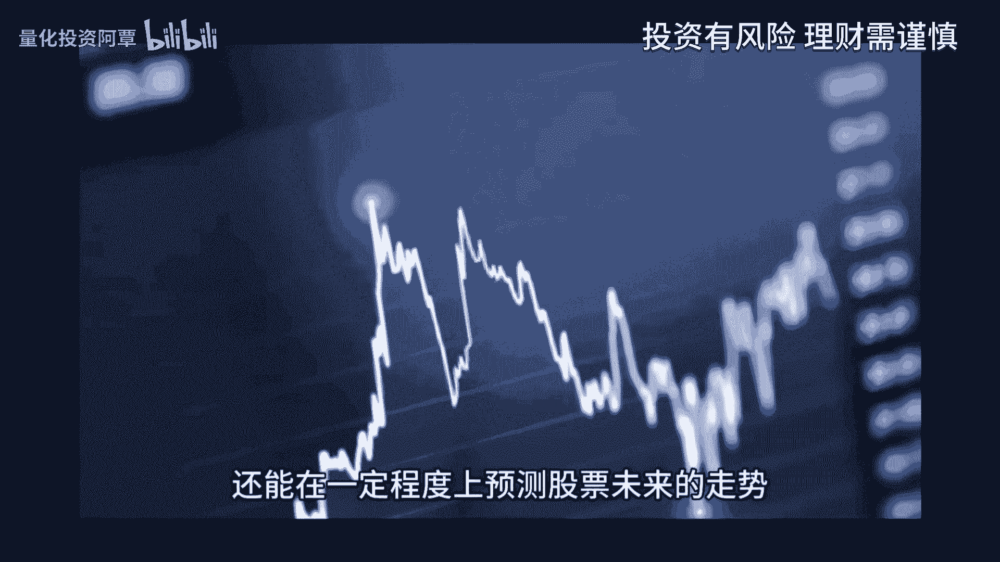
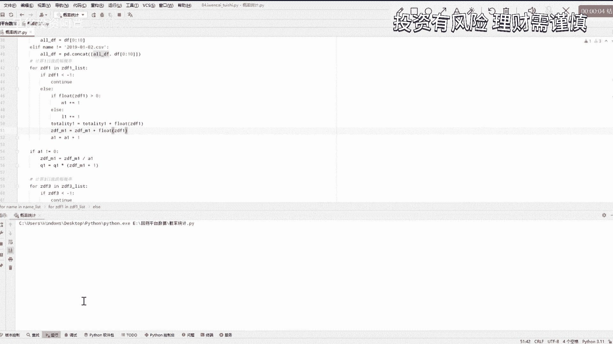

# 机构调研这么懂市场吗，5年10倍展现调研实力 - P1 - 量化投资阿覃 - BV1hK421h7zH

投资小船永不坏，量化策略定成败，大家好，我是品优量化的阿晴。

在这个信息爆炸的时代，我们每天都面临着海量的数据和信息，各种信息层出不穷，特别是在股票市场中，每天都充斥着各式各样的消息，有真有假，如何从中筛选出有价值的内容，并排除各项纲要。

机构投资者往往会选择实地调研，通过亲自拜访上市公司，了解其真正的状况，才能帮助他们做出正确的选择，今天我将教大家探讨一个有趣的量化策略，基于机构调研加速的量化策略，在投资市场中。

机构调研加速往往被视为一个重要的参考指标，它不仅能够反映市场对某只股票的关注度，还能在一定程度上预测股票的未来走势。

那么如何利用这个指标，构建一个有效的量化策略呢，接下来就让我们一起揭开它神秘的面纱，首先我们来了解一下什么是机构调研加速，机构调研是指专业的投资机构，对上市公司进行实地的考察和深入研究。

其目的是为了获取第一手资料，了解公司的经营状况，发展前景以及潜在风险，当一家公司的机构调研家数增多时，说明这家公司受到了市场广泛关注，其基本面和成长性可能获得的机构的认可，简单来说，机构调研加速。

就是一段时间内，对某一只股票或某个行业进行调研的机构数量，这些机构通常是专业的投资研究机构，他们对市场有着敏锐的洞察力，和深入的研究能力，因此机构调研家数在一定程度上，反映了市场。

对某只股票或某个行业的关注度和认可度，那么为什么机构调研家数会成为我们，构建量化策略的重要依据呢，这是因为机构调研加速，其背后蕴含着丰富的市场信息，一方面，机构调研加速的增加。

意味着越来越多的机构开始关注，这只股票或这个行业，这通常意味着市场对该股票或者该行业，未来的表现持乐观态度，另一方面，机构调研加速的变化，也能反映出市场的热点和趋势，帮助我们及时把握市场机遇，一般来说。

机构调研家数的增加会提升市场的关注度，进而推动股票价格的上涨，这是因为机构调研通常伴随着资金的流入，而这些资金往往会成为，推动股价上涨的重要力量，此外机构调研还能带来信息的传递和扩散。

使得更多的投资者了解并关注这家公司，从而进一步推高股价，那么到底怎么使用这个指标，构建一个行之有效的量化策略呢，接下来我将详细介绍如何构建，基于机构调研加速的量化策略，与往常一样。

我们的思路大体上要确定三样东西，第一就是机构调研加速这个指标该如何界定，第二就是要确定我们策略的持仓周期，第三要确定我们的持股个数，下面我将逐一的讲解，首先我们需要收集大量的机构调研数据。

我们在东方财富网站，数据中心里面的特色数据中，找到的机构调研这一数据，这里的接待机构数量指的是某一上市公司，每天接待前来调研的机构总数，这是我们所需要的数据，然后我们通过Python代码爬取每一只股票。

每天的这项数据整合到一个文件里面，方便后面的回撤，然后由于机构加速的增加，会提升市场的关注度，我们可以将过去累计三天，五天或者七天的机构调研家数累加起来，就可以得到对应天数的总调研家数。

假设我们关注的是过去一周的机构调研数据，那么我们就需要收集过去累计七天的机构调研，加速将其累加起来，得到总数，数据方面我已经整理好了，包括了公告日期，股票代码和对应的，向前累计七天的机构调研家数。

感兴趣的小伙伴可以私信我，都是可以免费发给大家的，所以这里呢我们将基于机构调研加速的量化，策略，使用的指标确定为，向前累计七天的机构调研加速，当然屏幕前的小伙伴可以自己尝试，向前累计三天或者五天的数据。

其次我们需要确定我们的策略持仓周期，这里我们直接采用概率统计方法，我们统计了一下从19年到20年，上榜向前累计七天的机构调研家数的股票，其未来一日3日五日的涨跌幅是什么情况。

通过运行代码可以看到，未来日日的涨跌概率为48。96%，上涨的数学期望为0。2028%，未来3日的上涨概率为48。56%，上涨的数学期望为0。1122%，未来5日上涨概率为48。45%。

上涨的数学期望为0。0779，对比之下可以看出，虽然按机构调研加速这个指标选取的未来一日，3日五日，其上涨概率都只有48%多一些，但平均下来的涨跌幅都是正的，而且可以看出，在持股一天的情况下。

其上涨概率和上涨的数学期望都是最大的，因此我们车队的持仓天数就可以确定为，持股一天，最后我们要确定我们的持仓个数，按照我们大多数策略的经验，可以先选择持股十只，当然你可以自己尝试使用持仓一只。

又或者三只，那到底选择哪十只呢，我们就选择按照向前累计七天的机构调研，加速这一个指标，从大到小进行排序，选择前十只股票，那么现在我们已经确定了指标，持仓周期和持仓个数，我们就可以按照这个思路。

构建一个简单的量化策略。

策略的流程非常简单，每天开盘之前统计，好像前累计七天的接待机构数量，注意这里不包含买入当天同时剔除S7的股票，然后按照向前累计七天接待机构数量，这一个指标从大到小进行排序，开盘时均仓买入前十只股票。

第二天开盘时卖出，如此循环反复回撤，结果又是怎么样呢，我们用Python代码计算一下策略的累计收益，点击运行我们的Python代码计算结果显示，从2019年年初到2023年年底，的累计收益为733。

25%，年化收益率高达53。91%，这么看来这个策略还是相当可以的，有如此高的收益率，也是我不曾想到的，以上所有的数据和代码，感兴趣的小伙伴可以私信联系我，都是可以免费发给大家的。

接下来我将向前累计七天的结构调研加速，这一个数据更新到了，我们之前的量化回测小工具上，只需要在小程序上动动手指，选择机构调研，加速向前累计七天的回测条件，就能看到回撤结果，完全不需要写代码。

而且手机就能轻松操作，非常的方便，感兴趣的朋友可以关注公众号，使用我们的量化回测小程序和我验证一下，刚才的策略能有一个什么样的结果，点击数据栏目进入回测平台，首先我们给策略一个名称。

输入机构调研加速策略，然后点击添加回收条件，选择股本信息里的机构调研加速向前累计七天，最小值填写为一，然后选股指标排序，选择机构调研加速向前累计七天，从大到小就选择降序股票标的时。

勾选vs t股回收周期，选择日持仓上线选择十只，也就是每日金仓买入十只股票，持仓周期为一，回撤的时间设置为2019年1月1日，到2023年的12月31日，初始资金填写100万，最后点击开始回撤。

我们可以在回撤结果中看到，该策略5年的累计收益率为710%，3。94，车队的最大回撤为33。64%，年化收益率为54%，由于我们的小程序回测过程中，考虑到涨跌停机制的影响。

这个结果与我们上面用Python代码统计的结果，略微不同，但更为精确。

视频到了这里，熟悉我们的小伙伴，肯定对我们的车队有着更多的期望，没错，接下来就是我们对这个车队在进行优化改进，结合其他的量化指标和技术分析方法，对这些股票再进行进一步的筛选和评估。

比如我们可以查看这些股票的基本面数据，以及技术层面的走势，成交量，均线等指标，通过综合分析和判断，进一步筛选出更优的股票，那么接下来我们可以在这个策略的基础上，使用小工具不断的去尝试优化。

看看能不能得到更加优秀的选股策略，例如回测条件，我们可以参考量化势力里的北向日增仓策略，这里我们就使用小工具里面的组合回撤，将北向日增仓策略里面的五个条件，再结合上上面的机构调研加速这一固定条件。

进行组合回测，我们直接在量化示例里点击北向日增仓策略，再点击修改辐射条件，第一步，先修改策略名称为机构调研加速优化策略，然后点击添加回车条件，选择股本信息里的机构调研加速向前累计七天，设置最小值为一。

点击开始组合回测，点击向下箭头，将北上日增仓策略里的五个条件，都添加在组合条件里，然后选股指标排序改为机构调研，加速向前累计七天，从大到小排序就选择降序股票标的时，勾选非st股，持股上限改为十支。

回撤的开始时间改为2019年1月1日，我们点击开始回撤，可以看见总共有31种组合方案，点击回撤结果，可以看到，我们的小工具已经按照综合收益从高到低，将每一种方案都排序好了。

点击序号为零的策略即为最优的组合方案，在这个方案当中，我们可以看到，回撤条件在原来的基础上新增了两个条件，分别为5日的涨跌幅小于25，总市值小于500亿，这个组合的优化结果更为惊喜，累计收益变成了十倍。

年化收益率达到了64。32%，胜率也提升至了48。71%，而且回撤也降低至30。16%，可以说这次的组合优化效果是非常不错的，此车队的质量直线上升了一个台阶，当然我们也可以尝试更改组合条件。

去看看能否找到更好的优化方案，好了，视频讲到这里，我们已经将基于机构调研加速这一个策略，从一开始的思路到如何构建，到如何回撤，以及最后如何优化完整的展示出来了，这个策略是否还存在别的优化空间。

就交给屏幕前的各位小伙伴们自己去探索了，屏幕前的小伙伴，如果有更好的优化思路，赶紧尝试在小工具上验证一下，构建属于自己的量化策略吧，希望通过这个视频，大家能够对当前的市场有着更深入的了解。

为自己的投资决策提供更多的参考，如果你觉得这个视频对你有帮助，别忘了点赞分享和关注，后续我们将持续推出更新更好，更前沿的量化策略。

